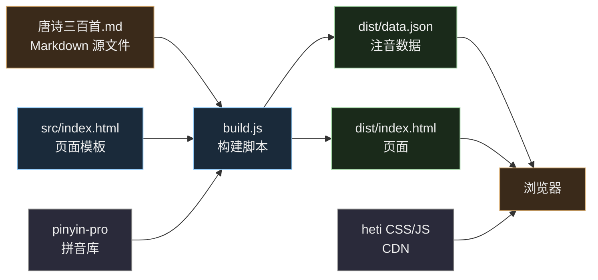
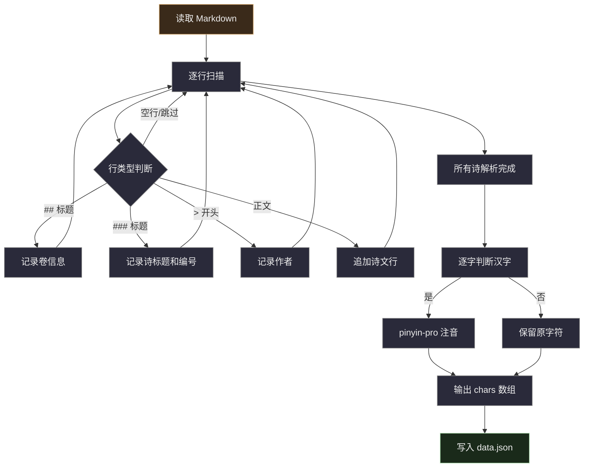

# 唐诗三百首 · 注音版

> 古籍竖排风格的唐诗三百首在线阅读器，310+ 首唐诗逐字拼音注音，支持竖排/横排切换。

## 功能

- **逐字注音** — 310+ 首唐诗逐字标注带声调拼音
- **古籍竖排** — 默认竖排从右到左，可切换横排
- **四方位拼音** — 拼音可在汉字的上/下/左/右四个方位显示
- **明暗双主题** — 默认深色主题，一键切换浅色或跟随系统
- **排版可调** — 字体（宋/楷/黑/仿宋）、字号、字距、行距、拼音大小、注音距离均可自定义
- **侧栏目录** — 按卷分组，可折叠，点击跳转
- **全文搜索** — 按标题、作者、诗句实时搜索
- **键盘导航** — 左右箭头键翻页
- **长诗滚动** — 长篇诗（长恨歌、琵琶行等）在卡片内滚动阅读
- **响应式** — 适配桌面和移动端
- **设置持久化** — 所有排版设置自动保存到 localStorage

## 快速开始

```bash
# 克隆仓库
git clone https://github.com/yourname/pinyin.git
cd pinyin

# 安装依赖
npm install

# 构建数据（解析 Markdown → 生成拼音 JSON → 输出到 dist/）
npm run build

# 本地预览
npm run preview
# 打开 http://localhost:3000/
```

## 技术栈

| 环节 | 技术 | 说明 |
|------|------|------|
| 拼音生成 | [pinyin-pro](https://github.com/zhennann/pinyin-pro) | Node.js 后端逐字注音，带声调符号 |
| 排版 | [赫蹏 heti](https://github.com/sivan/heti) | 中文书刊排版 CSS 库 |
| 前端 | 原生 HTML/CSS/JS | 无框架，单文件 SPA |
| 部署 | GitHub Pages | 纯静态站，直接从 dist/ 发布 |

## 项目结构



```
pinyin/
├── build.js              # 构建脚本：Markdown → JSON + 注音
├── package.json          # 依赖和脚本命令
├── src/
│   └── index.html        # 页面模板（含全部 CSS/JS）
├── dist/                 # 构建产物（gitignore）
│   ├── index.html        # 页面
│   └── data.json         # 注音数据 (~0.82 MB)
└── docs/
    ├── 唐诗三百首.md      # Markdown 源文件
    ├── prd-web.md         # 产品需求文档
    ├── dev-plan.md        # 开发规划
    ├── devlog.md          # 开发日志
    └── guide-adapt.md     # 适配其他经典的指南
```

## 数据管线



## 命令

| 命令 | 说明 |
|------|------|
| `npm install` | 安装依赖（pinyin-pro） |
| `npm run build` | 运行构建，生成 `dist/` |
| `npm run preview` | 本地预览（`npx serve dist`） |

## 适配其他经典

本项目不限于唐诗，任何结构化分篇的中国古典文献都可以适配。详细指南见 [docs/guide-adapt.md](docs/guide-adapt.md)。

## License

MIT
