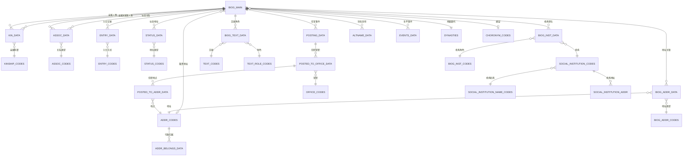
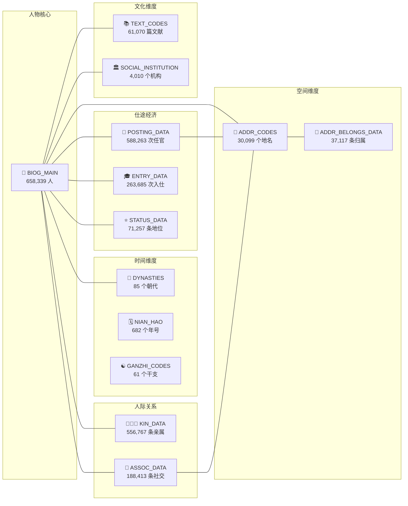

# CBDB — 中国历代人物传记资料库

## 一、项目简介

**CBDB**（China Biographical Database，中国历代人物传记资料库）是由哈佛大学主导开发的免费开放关系型数据库，收录了从先秦至清末约 **658,339 位** 历史人物的传记信息。

| 维度 | 数据量 |
|------|--------|
| 人物总数 | 658,339 |
| 唐代人物 | 57,474 |
| 宋代人物 | 83,204 |
| 明代人物 | 224,527 |
| 清代人物 | 235,671 |
| 女性人物 | 57,580 |
| 地名记录 | 30,099 |
| 官职名称 | 34,052 |
| 亲属关系 | 556,767 |
| 社会关系 | 188,413 |
| 任官记录 | 588,263 |
| 文献记录 | 61,070 |
| 年号记录 | 682 |

**数据来源**：正史列传、地方志、墓志铭、登科记、文人别集等。

**起源**：Robert Hartwell（郝若贝，1932-1996）为研究宋代官员的亲属与社会网络而构建了最初的关系型数据库模型，后遗赠给哈佛燕京学社，经过哈佛大学团队持续扩展至今。

**数据格式**：Microsoft Access (.mdb) 和 SQLite (.sqlite3) 两种格式，本次分析基于 **2026年5月23日** 版本的 SQLite 文件。

---

## 二、设计理念

CBDB 的核心思想是将历史人物的传记信息抽象为 **实体**（Entity）和 **关系**（Relation）两类数据：

1. **实体表** — 描述"事物本身"的属性：人物、地名、官职、文献等
2. **关系表** — 描述实体之间的关联：人物与地名、人物与官职、人物与人物等
3. **代码表** — 对关系的类型进行分类定义：亲属称谓类型、社会关系类型等

Hartwell 将传记信息归纳为八大交互维度：

| 维度 | 实体 | 与人物的关联 |
|------|------|-------------|
| 亲属 | KINSHIP_CODES | KIN_DATA |
| 社会关系 | ASSOC_CODES | ASSOC_DATA |
| 社会地位 | STATUS_CODES | STATUS_DATA |
| 入仕方式 | ENTRY_CODES | ENTRY_DATA |
| 官职 | OFFICE_CODES | POSTING_DATA → POSTED_TO_OFFICE_DATA → POSTED_TO_ADDR_DATA |
| 社会机构 | SOCIAL_INSTITUTION_CODES | BIOG_INST_DATA |
| 文献 | TEXT_CODES | BIOG_TEXT_DATA |
| 地名 | ADDR_CODES | BIOG_ADDR_DATA |

---

## 三、核心表结构

### 3.1 人物主表 — BIOG_MAIN（658,339 条）

所有人物的核心登记表，每人一条记录，主键 `c_personid`。

| 字段 | 类型 | 说明 |
|------|------|------|
| c_personid | INTEGER (PK) | 人物唯一ID |
| c_name_chn | VARCHAR | 中文名（如"李白"） |
| c_name | VARCHAR | 拼音全名 |
| c_surname_chn | VARCHAR | 姓 |
| c_mingzi_chn | VARCHAR | 名 |
| c_female | SMALLINT | 性别（0=男, 1=女） |
| c_index_year | SMALLINT | 索引年（用于定位时代） |
| c_birthyear | SMALLINT | 出生年 |
| c_deathyear | SMALLINT | 卒年 |
| c_death_age | SMALLINT | 享年 |
| c_dy | SMALLINT | 朝代代码 → DYNASTIES |
| c_choronym_code | SMALLINT | 郡望代码 → CHORONYM_CODES |
| c_ethnicity_code | SMALLINT | 民族代码 → ETHNICITY_TRIBE_CODES |
| c_index_addr_id | INTEGER | 籍贯/代表地点 → ADDR_CODES |
| c_fl_earliest_year | SMALLINT | 最早活动年 |
| c_fl_latest_year | SMALLINT | 最晚活动年 |

> 姓名字段有四套：中文、拼音、非拼音罗马化（如 Wade-Giles）、母语原名，由系统自动拆分姓/名。

**示例查询**：

```
李白:  ID=32540, 701-762, 唐代(c_dy=6)
杜甫:  ID=3915,  712-770, 唐代
白居易: ID=32227, 772-846, 唐代
李清照: ID=19713, 1084-1155, 宋代(c_dy=15), 女性(c_female=1)
```

### 3.2 朝代表 — DYNASTIES（85 条）

| 字段 | 类型 | 说明 |
|------|------|------|
| c_dy | SMALLINT (PK) | 朝代代码 |
| c_dynasty_chn | VARCHAR | 中文名（如"唐"） |
| c_dynasty | VARCHAR | 英文名（如"Tang"） |
| c_start | SMALLINT | 起始年 |
| c_end | SMALLINT | 终止年 |

**示例**：

| c_dy | 朝代 | 起止 |
|------|------|------|
| 5 | 隋 | 581-618 |
| 6 | 唐 | 618-907 |
| 15 | 宋 | 960-1279 |
| 18 | 元 | 1234-1367 |
| 19 | 明 | 1368-1644 |
| 20 | 清 | 1644-1911 |

### 3.3 地名表 — ADDR_CODES（30,099 条）

| 字段 | 类型 | 说明 |
|------|------|------|
| c_addr_id | INTEGER (PK) | 地名唯一ID |
| c_name_chn | VARCHAR | 中文名 |
| c_name | VARCHAR | 英文名 |
| c_firstyear | SMALLINT | 该地名起始年 |
| c_lastyear | SMALLINT | 该地名终止年 |
| c_admin_type | VARCHAR | 行政类型 |
| x_coord | REAL | 经度 |
| y_coord | REAL | 纬度 |
| CHGIS_PT_ID | INTEGER | 对应CHGIS的点位ID |

> 同一个地理实体在不同朝代有不同的 `c_addr_id`。例如"成都"在先秦、唐、宋、明、清各有独立记录，但经纬度基本一致（约 104.08, 30.65）。地名坐标来自 CHGIS（中国历史地理信息系统）。

**ADDR_BELONGS_DATA（37,117 条）**：记录地名的行政归属关系（如某县属于某府），含时间范围。

### 3.4 亲属关系 — KIN_DATA（556,767 条）

| 字段 | 类型 | 说明 |
|------|------|------|
| c_personid | INTEGER (PK) | 人物ID → BIOG_MAIN |
| c_kin_id | INTEGER (PK) | 亲属ID → BIOG_MAIN |
| c_kin_code | SMALLINT (PK) | 亲属称谓代码 → KINSHIP_CODES |

**KINSHIP_CODES（479 条）**：定义亲属称谓，每个称谓有四个距离度量：

| 度量 | 含义 | 示例 |
|------|------|------|
| c_upstep | 祖先方向距离 | 父=1, 祖父=2 |
| c_dwnstep | 后代方向距离 | 子=1, 孙=2 |
| c_colstep | 旁系距离 | 兄弟=1 |
| c_marstep | 姻亲距离 | 妻=1 |

**李白的亲属关系示例**：

| 亲属 | 关系 |
|------|------|
| 李暠（ID:22466） | 九世祖 |
| 李客（ID:512561） | 父 |
| 許氏（ID:512537） | 妻子 |
| 宗氏（ID:447351） | 第二任妻 |
| 許圉師（ID:92748） | 妻之祖父 |
| 李月圓（ID:512564） | 妹 |
| 李伯禽（ID:447876） | 子 |
| 李頗黎（ID:512565） | 子 |
| 李平陽（ID:447760） | 女兒 |

### 3.5 社会关系 — ASSOC_DATA（188,413 条）

这是 CBDB 最丰富的关系表之一，记录人物之间的非亲属社会联系。

| 字段 | 类型 | 说明 |
|------|------|------|
| c_personid | INTEGER (PK) | 人物ID |
| c_assoc_id | INTEGER (PK) | 关联人物ID |
| c_assoc_code | SMALLINT (PK) | 关系类型代码 → ASSOC_CODES |
| c_assoc_first_year | SMALLINT | 关系起始年 |
| c_assoc_last_year | SMALLINT | 关系终止年 |
| c_addr_id | INTEGER | 发生地点 → ADDR_CODES |
| c_litgenre_code | SMALLINT | 相关文体 → LITERARYGENRE_CODES |
| c_text_title | VARCHAR | 相关作品标题 |
| c_source | INTEGER | 资料来源 → TEXT_CODES |

**ASSOC_CODES（498 条）** 关系类型示例：

| 代码 | 关系 | 英文 |
|------|------|------|
| 4 | 是Y的恩主 | Patron of |
| 9 | 友 | Friend of |
| 13 | 推荐 | Recommended |
| 14 | 被Y推荐 | Recommended by |
| 16 | 遭到Y的反对/攻讦 | Opposed by |
| 17 | 被Y欣赏/器重 | Praised by |
| 22 | 为Y之学生 | Student of |
| 24 | 辟（征召） | Directly recruited |

**李白的社会关系示例**：

| 关系 | 对方 |
|------|------|
| 友 | 杜甫、元丹丘、张谓 |
| 被Y推荐 | 吳筠、宋若思 |
| 被Y欣赏/器重 | 賀知章、唐玄宗、司馬承禎、蘇頲 |
| 遭到Y的反对/攻訐 | 張垍、高力士 |

### 3.6 任官记录（三表联动）

任官信息使用三张表来处理"一职多地点"和"一任多官职"的情况：

```
POSTING_DATA（588,263 条）          — 任官事件主表
  └─ POSTED_TO_OFFICE_DATA（588,294 条） — 任职官职
       └─ POSTED_TO_ADDR_DATA（463,162 条） — 任职地点
```

**POSTING_DATA**：任官事件

| 字段 | 类型 | 说明 |
|------|------|------|
| c_posting_id | INTEGER (PK) | 任官事件ID |
| c_personid | INTEGER | 人物ID |

**POSTED_TO_OFFICE_DATA**：该任官事件涉及的官职

| 字段 | 类型 | 说明 |
|------|------|------|
| c_posting_id | INTEGER (PK) | 任官事件ID |
| c_office_id | INTEGER (PK) | 官职ID → OFFICE_CODES |
| c_firstyear | SMALLINT | 到任年 |
| c_lastyear | SMALLINT | 离任年 |
| c_appt_code | SMALLINT | 任命类型 → APPOINTMENT_CODES |

**POSTED_TO_ADDR_DATA**：该官职对应的地点

| 字段 | 类型 | 说明 |
|------|------|------|
| c_posting_id | INTEGER (PK) | 任官事件ID |
| c_office_id | INTEGER (PK) | 官职ID |
| c_addr_id | INTEGER (PK) | 地点ID → ADDR_CODES |

**李白的任官记录**：

| 官职 | 时间 |
|------|------|
| 翰林供奉 | 742-744 |
| 僚佐 | 756-757 |
| 参谋 | 757 |

### 3.7 入仕方式 — ENTRY_DATA（263,685 条）

| 字段 | 类型 | 说明 |
|------|------|------|
| c_personid | INTEGER (PK) | 人物ID |
| c_entry_code | SMALLINT (PK) | 入仕方式代码 → ENTRY_CODES |
| c_year | SMALLINT | 入仕年 |
| c_age | SMALLINT | 入仕年龄 |
| c_exam_rank | VARCHAR | 科举名次 |
| c_entry_addr_id | INTEGER | 考试地点 |

**ENTRY_CODES（272 条）** 包括：进士、明经、举人、荫补、荐举等。

### 3.8 社会地位 — STATUS_DATA（71,257 条）

| 字段 | 类型 | 说明 |
|------|------|------|
| c_personid | INTEGER (PK) | 人物ID |
| c_status_code | SMALLINT (PK) | 地位类型代码 → STATUS_CODES |
| c_firstyear | SMALLINT | 起始年 |
| c_lastyear | SMALLINT | 终止年 |

**STATUS_CODES（284 条）** 包括：以书法闻名、以诗文名、僧人、道士、隐士等。

### 3.9 文献表 — TEXT_CODES（61,070 条）

| 字段 | 类型 | 说明 |
|------|------|------|
| c_textid | INTEGER (PK) | 文献ID |
| c_title_chn | VARCHAR | 中文标题 |
| c_title | VARCHAR | 英文标题 |
| c_text_type_id | VARCHAR | 文献类型 → TEXT_TYPE |
| c_text_dy | SMALLINT | 所属朝代 |

**BIOG_TEXT_DATA（52,078 条）**：人物与文献的关联（作者、编者、译者等角色）。

**BIOG_SOURCE_DATA（1,215,572 条）**：记录每条传记数据的来源文献。

### 3.10 社会机构

```
SOCIAL_INSTITUTION_NAME_CODES（2,601 条） — 机构名称
SOCIAL_INSTITUTION_CODES（4,010 条）       — 机构实体
SOCIAL_INSTITUTION_ADDR（3,857 条）        — 机构地址
BIOG_INST_DATA（559 条）                   — 人物-机构关系
```

机构类型包括：佛寺、道观、书院、城墙修缮、桥梁修建等。

### 3.11 别名表 — ALTNAME_DATA（207,074 条）

| 字段 | 类型 | 说明 |
|------|------|------|
| c_personid | INTEGER (PK) | 人物ID |
| c_alt_name_chn | VARCHAR (PK) | 别名中文 |
| c_alt_name_type_code | SMALLINT (PK) | 别名类型 → ALTNAME_CODES |

**ALTNAME_CODES（21 种）** 包括：字、号、谥号、法号、笔名、室名等。

### 3.12 年号表 — NIAN_HAO（682 条）

| 字段 | 类型 | 说明 |
|------|------|------|
| c_nianhao_id | SMALLINT (PK) | 年号ID |
| c_dy | SMALLINT | 所属朝代 |
| c_nianhao_chn | VARCHAR | 年号中文 |
| c_nianhao_pin | VARCHAR | 年号拼音 |
| c_firstyear | SMALLINT | 起始年 |
| c_lastyear | SMALLINT | 终止年 |

### 3.13 辅助代码表

| 表名 | 条数 | 说明 |
|------|------|------|
| ADMIN_CAT_CODES | 211 | 行政区划类型 |
| APPOINTMENT_CODES | 116 | 任命方式 |
| ASSUME_OFFICE_CODES | 6 | 到任方式 |
| CHORONYM_CODES | 173 | 郡望 |
| COUNTRY_CODES | 11 | 国家代码 |
| ETHNICITY_TRIBE_CODES | 498 | 民族部落 |
| EVENT_CODES | 117 | 事件类型 |
| GANZHI_CODES | 61 | 干支 |
| HOUSEHOLD_STATUS_CODES | 34 | 户等 |
| KIN_MOURNING | 159 | 丧服关系 |
| LITERARYGENRE_CODES | 12 | 文学体裁 |
| OCCASION_CODES | 10 | 场合类型 |
| SCHOLARLYTOPIC_CODES | 32 | 学术主题 |
| YEAR_RANGE_CODES | 6 | 年份范围修饰词 |
| INDEXYEAR_TYPE_CODES | 31 | 索引年类型 |

---

## 四、ER 关系图



---

## 五、核心实体关系总览



---

## 六、表分类汇总

CBDB 的 71 张表可归纳为以下几类：

### 6.1 实体表（描述"是什么"）

| 类别 | 表名 | 条数 |
|------|------|------|
| 人物 | BIOG_MAIN | 658,339 |
| 地名 | ADDR_CODES | 30,099 |
| 官职 | OFFICE_CODES | 34,052 |
| 文献 | TEXT_CODES | 61,070 |
| 社会机构 | SOCIAL_INSTITUTION_CODES | 4,010 |
| 朝代 | DYNASTIES | 85 |
| 年号 | NIAN_HAO | 682 |

### 6.2 关系表（描述"谁与什么有关"）

| 类别 | 表名 | 条数 |
|------|------|------|
| 亲属关系 | KIN_DATA | 556,767 |
| 社会关系 | ASSOC_DATA | 188,413 |
| 任官事件 | POSTING_DATA | 588,263 |
| 任官官职 | POSTED_TO_OFFICE_DATA | 588,294 |
| 任官地点 | POSTED_TO_ADDR_DATA | 463,162 |
| 入仕记录 | ENTRY_DATA | 263,685 |
| 社会地位 | STATUS_DATA | 71,257 |
| 人物地址 | BIOG_ADDR_DATA | 457,656 |
| 文献角色 | BIOG_TEXT_DATA | 52,078 |
| 人物别名 | ALTNAME_DATA | 207,074 |
| 数据来源 | BIOG_SOURCE_DATA | 1,215,572 |
| 地名归属 | ADDR_BELONGS_DATA | 37,117 |
| 机构参与 | BIOG_INST_DATA | 559 |
| 生平事件 | EVENTS_DATA | 427 |
| 合并记录 | MERGED_PERSON_DATA | 2,374 |

### 6.3 代码表（定义关系类型的"字典"）

| 类别 | 表名 | 条数 |
|------|------|------|
| 亲属称谓 | KINSHIP_CODES | 479 |
| 社交关系类型 | ASSOC_CODES | 498 |
| 入仕方式 | ENTRY_CODES | 272 |
| 社会地位类型 | STATUS_CODES | 284 |
| 官职层级 | OFFICE_TYPE_TREE | 2,739 |
| 行政区划类型 | ADMIN_CAT_CODES | 211 |
| 任命方式 | APPOINTMENT_CODES | 116 |
| 别名类型 | ALTNAME_CODES | 21 |
| 郡望 | CHORONYM_CODES | 173 |
| 民族部落 | ETHNICITY_TRIBE_CODES | 498 |
| 文献类型 | TEXT_TYPE | 126 |
| 文献分类 | TEXT_BIBLCAT_CODES | 144 |
| 文献角色 | TEXT_ROLE_CODES | 12 |
| 文学体裁 | LITERARYGENRE_CODES | 12 |
| 干支 | GANZHI_CODES | 61 |
| 年份范围 | YEAR_RANGE_CODES | 6 |
| 事件类型 | EVENT_CODES | 117 |

---

## 七、对我们项目的价值

CBDB 与我们的"中华经典文库"项目高度互补：

| 需求 | CBDB 能提供什么 |
|------|----------------|
| 诗人年谱地图 | `BIOG_ADDR_DATA` + `ADDR_CODES` 的经纬度 + `POSTING_DATA` 的任官轨迹 + `EVENTS_DATA` 的生平事件 |
| 诗人关系网 | `ASSOC_DATA` 的 188,413 条社会关系 + `KIN_DATA` 的 556,767 条亲属关系 |
| 典故溯源 | `BIOG_TEXT_DATA` 的文献关联 + `TEXT_CODES` 的文献数据库 |
| 历史背景 | `DYNASTIES` + `NIAN_HAO` + `EVENT_CODES` 提供精确的年号-公元纪年对照 |

**李白示例** — 用 CBDB 数据可以完整还原：

```
701年 出生
742-744年 翰林供奉（长安）
756-757年 僚佐
757年 参谋
762年 卒

社会关系：
  友 → 杜甫、元丹丘、张谓
  被推荐 → 吳筠、宋若思
  被欣赏 → 贺知章、唐玄宗
  被反对 → 张垍、高力士
```

---

## 八、数据获取方式

| 方式 | 地址 |
|------|------|
| 官方网站 | https://cbdb.hsites.harvard.edu/ |
| 结构说明 | https://cbdb.hsites.harvard.edu/structure-cbdb |
| HuggingFace | https://huggingface.co/datasets/cbdb/cbdb-sqlite |
| 本地文件 | `cbdb/cbdb_20260523.sqlite3`（575MB） |

> 本地 SQLite 文件来自 HuggingFace 的 2026-05-23 版本。CBDB 同时提供 Microsoft Access 格式和在线查询工具。
