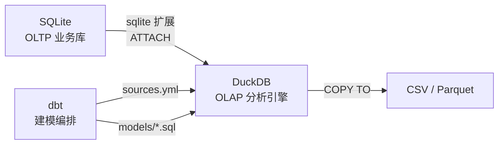

# PRD — CBDB 数据仓库工具集

## 1. 产品概述

基于 CBDB（中国历代人物传记资料库）的 658,339 条人物数据，构建一套命令行工具集，实现数据字典采集、数仓分层建模和多维分析输出，最终为"中华经典文库"项目的诗人年谱地图、关系网络等可视化功能提供数据支撑。

### 1.1 项目定位

| 维度 | 说明 |
|------|------|
| 用户 | 开发者自身（个人工具集） |
| 场景 | 本地命令行运行，数据探索与分析 |
| 产出 | CSV / Markdown / JSON 文件，存放在 `output/` 目录 |
| 技术栈 | Node.js（脚本工具，零外部依赖） + DuckDB（OLAP 分析） + dbt（数仓建模编排） |

### 1.2 项目目录结构

```
cbdb/
├── package.json            # 项目配置
├── .gitignore
├── README.md               # CBDB 项目介绍
├── data/                   # 源数据（不提交 git）
│   ├── cbdb_20260523.sqlite3
│   ├── cbdb_20260523.json
│   └── latest.zip
├── docs/                       # 文档
│   ├── PRD.md                  # 本文档
│   ├── cbdb_tbl.md             # 原始表结构 DDL
│   ├── cbdb-data-warehouse.md  # 数仓建模方案
│   ├── sqlite-duckdb-dbt-guide.md  # SQLite + DuckDB + dbt 使用教程
│   ├── devlog.md               # 开发日志
│   └── pachong.md              # 爬取技术分析
├── scripts/                    # Node.js 脚本
│   └── crawl-dict.js           # 数据字典爬虫
├── sql/                        # SQL 查询
│   └── test.sql
├── dbt_cbdb/                   # dbt 项目（M4 里程碑）
│   ├── dbt_project.yml
│   ├── profiles.yml
│   ├── models/
│   │   ├── sources.yml
│   │   ├── ods/
│   │   ├── dwd/
│   │   ├── dws/
│   │   └── ads/
│   └── macros/
└── output/                     # 脚本输出（不提交 git）
    └── .gitkeep
```

---

## 2. 功能需求

### 2.1 数据字典采集（crawl-dict）

**目标**：从 https://cbdb.sunan.me 采集 CBDB 所有表的数据字典。

| 项目 | 说明 |
|------|------|
| 入口 | `npm run crawl` → `node scripts/crawl-dict.js` |
| 数据源 | `https://cbdb.sunan.me/data/{表名}_data_dict.json`（约 90 个 JSON） |
| 特殊处理 | SSL 证书过期，需 `NODE_TLS_REJECT_UNAUTHORIZED=0` |
| 编码修复 | JSON 中中文描述存在乱码，尝试修复；修复失败则保留原始乱码 |

**输入**：无（从远程网站采集）

**输出**：

| 文件 | 格式 | 说明 |
|------|------|------|
| `output/cbdb_dict.json` | JSON | 原始 JSON 合并，按表名索引，包含字段和外键 |
| `output/cbdb_dict_columns.csv` | CSV | 全部表结构汇总，每行一个字段（带 BOM） |
| `output/cbdb_dict_foreign_keys.csv` | CSV | 外键关系汇总（带 BOM） |
| `output/cbdb_dict.md` | Markdown | 按表分章节，每张表含字段表和外键表 |

**CSV 列定义**：

```
# cbdb_dict_columns.csv
table_name, column_name, column_type, notnull, pk, column_desc

# cbdb_dict_foreign_keys.csv
table_name, from_column, target_table, target_column, on_update, on_delete, fk_desc
```

**Markdown 输出格式**：

```markdown
## BIOG_MAIN

表说明：人物传记主表

| 字段名 | 类型 | 非空 | 主键 | 说明 |
|--------|------|------|------|------|
| c_personid | INTEGER | 是 | 是 | 人物唯一标识 |
| c_name | CHAR(255) | 否 | 否 | 英文名 |
...
```

**验收标准**：

- [x] 成功采集目录页列出的所有 JSON 文件（87 张表，0 失败）
- [x] CSV 行数 = 所有表的字段总数（795 个字段）
- [x] Markdown 文件可正常渲染，表名和字段名无乱码
- [x] 中文描述编码修复率 100%（latin1→utf-8 修复策略）
- [x] 外键关系完整输出（185 个外键，65 张表有外键）

---

### 2.2 表结构导出（export-tables）

**目标**：从本地 SQLite 数据库直接导出表结构，作为网站爬取的补充和校验。

| 项目 | 说明 |
|------|------|
| 入口 | `npm run tables` → `node scripts/export-tables.js` |
| 数据源 | `data/cbdb_20260523.sqlite3`（本地文件） |
| 依赖 | 无外部依赖，通过 `child_process` 调用系统 `sqlite3` 命令行工具 |

**输入**：`data/cbdb_20260523.sqlite3`

**输出**：

| 文件 | 格式 | 说明 |
|------|------|------|
| `output/tables_count.csv` | CSV | 每张表的行数统计 |
| `output/tables_schema.md` | Markdown | 每张表的 CREATE TABLE 语句 + 字段列表 |

**验收标准**：

- [ ] 表数量 = 71（与 CBDB 官方一致）
- [ ] 每张表的行数与 `SELECT COUNT(*)` 结果一致
- [ ] Markdown 格式规范，可直接用于文档

---

### 2.3 数仓建模（dbt）

**优先级**：P1（在数据字典采集完成后启动）

使用 dbt（Data Build Tool）作为数仓建模和编排框架，直接从 SQLite 读取数据到 DuckDB，在 model 层完成 ODS → DWD → DWS → ADS 分层建模。

| 项目 | 说明 |
|------|------|
| 框架 | dbt-duckdb（`pip install dbt-duckdb`） |
| 数据源 | `data/cbdb_20260523.sqlite3`（通过 DuckDB sqlite 扩展直连） |
| 分析引擎 | DuckDB（OLAP） |
| 中文注释 | dbt `schema.yml` 中定义，dbt run 时自动执行 `COMMENT ON` 写入 DuckDB |
| 详细教程 | 见 `docs/sqlite-duckdb-dbt-guide.md` |

**技术架构**：



**分层建模**：

| 阶段 | 说明 | materialization | 输出 |
|------|------|-----------------|------|
| ODS | 原始数据层：从 SQLite 源表 1:1 映射 | view | DuckDB 视图 |
| DWD | 明细数据层：清洗、去重、维度退化 | table | DuckDB 表 |
| DWS | 汇总数据层：按分析主题轻度聚合 | table | DuckDB 表 |
| ADS | 应用数据层：直接驱动前端可视化的宽表 | external | CSV / Parquet 文件 |

**dbt 项目结构**：

```
dbt_cbdb/
├── dbt_project.yml          # 项目配置
├── profiles.yml             # DuckDB 连接（含 sqlite ATTACH）
├── models/
│   ├── sources.yml          # SQLite 源表定义
│   ├── ods/                 # 原始数据层
│   │   ├── ods__biog_main.sql
│   │   └── schema.yml
│   ├── dwd/                 # 明细数据层
│   ├── dws/                 # 汇总数据层
│   └── ads/                 # 应用数据层
└── macros/                  # 可复用 SQL 宏
```

**中文注释方案**：

在 `schema.yml` 中为每张表和字段添加 `description`，dbt 运行时自动调用 `COMMENT ON` 将注释写入 DuckDB 元数据，无需修改 SQLite 源文件。

```yaml
# models/ods/schema.yml
models:
  - name: ods__biog_main
    description: "人物传记主表"
    columns:
      - name: c_personid
        description: "人物唯一标识"
```

---

## 3. 非功能需求

| 维度 | 要求 |
|------|------|
| 运行环境 | Node.js ≥ 18（脚本），Python ≥ 3.8（dbt），Windows 11 |
| Node 依赖 | 零外部 npm 依赖，仅使用 Node.js 内置模块 |
| Python 依赖 | `dbt-duckdb`（dbt 核心自带） |
| 网络要求 | 爬虫脚本需要能访问 https://cbdb.sunan.me |
| 性能 | 采集 87 个 JSON 文件应在 60 秒内完成（串行请求，间隔 200ms） |
| 容错 | 单个 JSON 请求失败不中断整体流程，记录失败列表并在结束时报告 |
| 输出位置 | 脚本输出写入 `output/`，dbt 输出由 materialization 配置决定 |

---

## 4. 脚本设计规范

### 4.1 通用约定

- 脚本文件放在 `scripts/` 目录
- 使用 ESM（`import/export`），与 `package.json` 的 `"type": "module"` 一致
- 路径一律使用 `import.meta.dirname` 或 `path.dirname(import.meta.url)` 获取，不硬编码
- 进度信息输出到 stderr（`console.error`），数据输出到文件
- 错误处理：`try/catch` 包裹，失败时打印表名和错误原因，继续执行

### 4.2 npm scripts 约定

```json
{
  "crawl": "node scripts/crawl-dict.js",
  "tables": "node scripts/export-tables.js"
}
```

新增脚本时在 `package.json` 的 `scripts` 中添加对应入口。

---

## 5. 已知风险

| 风险 | 影响 | 应对 |
|------|------|------|
| 网站 SSL 证书过期 | 请求需跳过证书验证 | 设置 `NODE_TLS_REJECT_UNAUTHORIZED=0` |
| JSON 中文乱码 | 字段说明不可读 | 已用 latin1→utf-8 策略 100% 修复 |
| sqlite3 文件被占用 | 无法删除根目录旧副本 | data/ 已有副本，旧文件不影响功能 |
| dbt sqlite 扩展兼容性 | DuckDB sqlite 扩展可能不支持所有 SQLite 特性 | 先做小规模测试，确认 ATTACH 成功 |
| dbt 项目初始化复杂度 | profiles.yml 和 sources.yml 配置可能需要调试 | 参考 `docs/sqlite-duckdb-guide.md` 逐步操作 |

---

## 6. 里程碑

| 阶段 | 内容 | 状态 |
|------|------|------|
| M1 | 项目脚手架搭建（目录结构、package.json、.gitignore） | 已完成 |
| M2 | 数据字典爬取脚本（crawl-dict） | 已完成 |
| M3 | 表结构导出脚本（export-tables） | 待开发 |
| M4 | dbt 数仓建模（初始化项目、ODS 层模型、中文注释） | 待开发 |
| M5 | 数仓分层建模完成（DWD → DWS → ADS 全链路） | 待规划 |
| M6 | 分析结果输出（CSV / Parquet 导出） | 待规划 |

---

*文档更新日期：2026-05-30*
