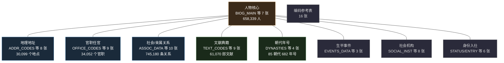
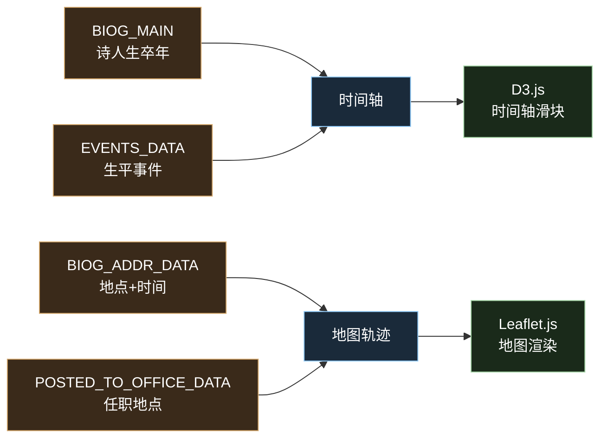
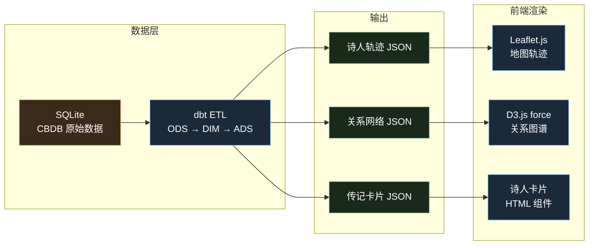

# CBDB 数据挖掘与诗词项目集成

CBDB（中国历代人物传记资料库）包含 658,339 位历史人物的 77 张核心表，涵盖人物、地理、官职、关系、文献、朝代等领域。本文档分析数据挖掘方向，以及如何为"中华经典文库"诗词项目提供数据支撑。

---

## 一、CBDB 数据领域全景



### 核心表速查

| 领域 | 核心表 | 记录数 | 关键字段 |
|------|--------|--------|----------|
| 人物 | BIOG_MAIN | 658,339 | 姓名、生卒年、朝代、籍贯、性别 |
| 地理 | ADDR_CODES | 30,099 | 地名、x_coord(经度)、y_coord(纬度)、时间范围 |
| 地址关联 | BIOG_ADDR_DATA | 457,656 | 人物ID、地点ID、起止年份 |
| 社会关系 | ASSOC_DATA | 188,413 | 双方人物ID、关系类型、发生年份、地点 |
| 亲属关系 | KIN_DATA | 556,767 | 双方人物ID、亲属类型 |
| 官职任职 | POSTED_TO_OFFICE_DATA | 588,294 | 人物ID、官职ID、地点ID、起止年份 |
| 入仕途径 | ENTRY_DATA | 263,685 | 人物ID、科举类型、年份 |
| 文献 | TEXT_CODES | 61,070 | 书名、作者、年代、分类 |
| 朝代 | DYNASTIES | 85 | 朝代名、起止年份 |
| 年号 | NIAN_HAO | 682 | 年号名、朝代、起止年份 |

---

## 二、数据挖掘方向

### 2.1 人物迁徙轨迹

**数据来源**：BIOG_ADDR_DATA（457,656 条人物-地点-时间记录）+ ADDR_CODES（坐标）

**可分析**：
- 单个诗人一生的地理迁移（出生地 → 游学地 → 任职地 → 贬谪地 → 卒地）
- 群体迁徙趋势（安史之乱后文人南迁、宋室南渡）
- 地域聚集分析（唐代进士籍贯分布、江南文人群落）

**CBDB 已有坐标**：李白、杜甫、白居易、王维等唐代诗人的多个地址都有经纬度。

### 2.2 社会关系网络

**数据来源**：ASSOC_DATA（188,413 条）+ KIN_DATA（556,767 条）+ ASSOC_CODES（498 种关系类型）

**可分析**：
- 诗人关系图谱（师承、交游、唱和、政敌、亲属）
- 关键节点人物（韩愈同时连接古文运动和诗歌革新两大网络）
- 关系的时间维度（李白杜甫 744 年洛阳相遇）
- 六度分隔验证（任意两位历史人物的社会距离）

**CBDB 记录的关系类型举例**：

| 编码 | 关系 | 典型案例 |
|------|------|---------|
| 0101 | 祖父 | 杜甫 → 杜审言 |
| 0401 | 师生 | 韩愈 → 贾岛 |
| 0501 | 友人 | 李白 ↔ 杜甫 |
| 0901 | 推荐者 | 贺知章 → 李白 |
| 1101 | 文学交往 | 白居易 ↔ 元稹 |

### 2.3 官职流动分析

**数据来源**：POSTED_TO_OFFICE_DATA（588,294 条）+ OFFICE_CODES（34,052 个官职）

**可分析**：
- 个人仕途轨迹（升迁、贬谪、外放的时间线）
- 官职分布地图（某朝代某官职在全国的分布）
- 科举与仕途的关系（进士出身 vs 举荐入仕的职位差异）
- 贬谪地理（唐代被贬官员的去向分布）

### 2.4 文献计量

**数据来源**：TEXT_CODES（61,070 部）+ BIOG_TEXT_DATA + TEXT_INSTANCE_DATA

**可分析**：
- 文献作者关联网络
- 文献存世状态统计
- 出版地与年代的交叉分析
- 四部分类法（经史子集）的文献分布

### 2.5 时空交叉分析

**数据来源**：所有含年份字段 + 地点字段的表

**可分析**：
- 某朝代某地区的进士数量热力图
- 历史事件的空间分布（黄巢起义路线、靖康之难人口南迁）
- 朝代更替时的人口/文化中心转移

### 2.6 群体画像

**数据来源**：BIOG_MAIN + STATUS_DATA + ENTRY_DATA + ETHNICITY_TRIBE_CODES

**可分析**：
- 唐代诗人群体的共同特征（籍贯分布、入仕途径、平均寿命）
- 不同身份群体对比（进士群体 vs 隐士群体 vs 女性诗人）
- 民族/族群与仕途的关系

---

## 三、与诗词项目的集成方案

当前"中华经典文库"收录唐诗三百首（310 首、77 位诗人），CBDB 可增强四个方向：

### 3.1 诗人年谱地图



**效果**：点击诗人名字 → 展示地图 + 时间轴。地图上标注该诗人一生的地点轨迹（出生、游历、任职、贬谪），时间轴可拖拽查看不同年份的位置。每首诗也可标注创作地点。

**CBDB 提供的数据**：
- 李白：碎叶城（出生）→ 四川（少年）→ 长安（供奉翰林）→ 洛阳（遇杜甫）→ 夜郎（流放）→ 当涂（卒）
- 杜甫：巩县（出生）→ 长安（十年困守）→ 成都（草堂）→ 夔州 → 湖南（卒）

### 3.2 诗人关系网络

**效果**：力导向图展示 77 位诗人之间的社会关系，不同颜色代表不同关系类型（师承、交游、唱和、亲属），点击连线显示关系详情（时间、地点、背景）。

**CBDB 提供的数据**：
- 李白 ↔ 杜甫（交游，744 年洛阳）
- 杜甫 → 李白（文学追忆）
- 王维 ↔ 裴迪（交游，辋川）
- 白居易 ↔ 元稹（唱和，大量诗歌往来）

### 3.3 诗人传记卡片

**效果**：每首诗的作者栏从"〔唐〕李白"扩展为富信息卡片：生卒年、籍贯、字号、入仕途径、主要官职、社会身份、别名。

**CBDB 提供的数据**：

| 字段 | CBDB 表 | 示例（李白） |
|------|---------|-------------|
| 生卒年 | BIOG_MAIN | 701-762 |
| 籍贯 | BIOG_ADDR_DATA + ADDR_CODES | 碎叶城/四川江油 |
| 字号 | ALTNAME_DATA | 字太白，号青莲居士 |
| 入仕 | ENTRY_DATA | 荐举（贺知章推荐） |
| 官职 | POSTED_TO_OFFICE_DATA | 供奉翰林 |
| 身份 | STATUS_DATA | 著名诗人 |

### 3.4 朝代时间线

**效果**：顶部展示唐朝（618-907）时间轴，标注年号更替，每位诗人的生命线叠加在上面，诗歌创作年份也标注。

**CBDB 提供的数据**：DYNASTIES（85 朝代）+ NIAN_HAO（682 年号），提供公元纪年与年号的精确映射。

---

## 四、经纬度转地图：技术栈

CBDB 的 ADDR_CODES 表存储了 `x_coord`（经度）和 `y_coord`（纬度），可直接用于地图标注。

### 4.1 坐标系说明

CBDB 的坐标来源是 CHGIS（中国历史地理信息系统），使用 **WGS-84 坐标系**（GPS 标准坐标系），可直接用于大多数地图引擎，无需坐标转换。

中国境内在线地图（高德、百度）使用 GCJ-02/BD-09 坐标系，如需叠加中国底图需要坐标偏移转换。但国际底图（OpenStreetMap、CartoDB）使用 WGS-84，无需转换。

### 4.2 推荐技术栈

| 方案 | 库 | 适用场景 | 复杂度 |
|------|-----|---------|--------|
| **Leaflet.js**（推荐） | `leaflet` npm 包 | 2D 地图、标记点、轨迹线、热力图 | 低 |
| MapLibre GL JS | `maplibre-gl` | 3D 地形、矢量瓦片、大数据量渲染 | 中 |
| D3.js 地理模块 | `d3-geo` | 完全自定义的 SVG 地图投影 | 高 |
| Mapbox GL JS | `mapbox-gl` | 商业方案，功能最全 | 中 |

### 4.3 Leaflet.js 实现方案（推荐）

Leaflet 是最成熟的开源地图库，适合历史地理可视化。

**底图选择**：

| 底图 | 特点 | URL |
|------|------|-----|
| OpenStreetMap | 免费、无限制 | `https://tile.openstreetmap.org/{z}/{x}/{y}.png` |
| CartoDB Dark Matter | 暗色主题，适合数据可视化 | `https://basemaps.cartiocdn.com/dark_all/{z}/{x}/{y}.png` |
| CHGIS 历史底图 | 古代行政边界 | 需从哈佛 CHGIS 项目获取 GeoJSON |

**诗人轨迹示例代码**：

```javascript
// 数据：从 CBDB ADS 层导出的 JSON
const poetTrail = [
  { year: 701, lat: 42.75, lng: 75.30, label: "出生：碎叶城" },
  { year: 725, lat: 31.04, lng: 104.07, label: "少年：四川" },
  { year: 742, lat: 34.26, lng: 108.94, label: "入京：长安" },
  { year: 744, lat: 34.68, lng: 112.45, label: "遇杜甫：洛阳" },
  { year: 757, lat: 27.95, lng: 107.42, label: "流放：夜郎" },
  { year: 762, lat: 31.57, lng: 118.50, label: "卒：当涂" },
];

const map = L.map('map').setView([34, 108], 4);
L.tileLayer('https://tile.openstreetmap.org/{z}/{x}/{y}.png').addTo(map);

// 轨迹线
const polyline = L.polyline(poetTrail.map(p => [p.lat, p.lng]), { color: '#d4a76a' }).addTo(map);

// 标记点
poetTrail.forEach(p => {
  L.marker([p.lat, p.lng]).bindPopup(`<b>${p.year}年</b><br>${p.label}`).addTo(map);
});
```

### 4.4 关系网络技术栈

| 库 | 适用场景 | 复杂度 |
|-----|---------|--------|
| **D3.js force**（推荐） | 力导向图，完全可定制 | 中 |
| AntV G6 | 蚂蚁图可视化引擎，开箱即用 | 低 |
| Cytoscape.js | 生物网络出身，图分析功能强 | 中 |

### 4.5 数据流架构



ADS 层输出 JSON 文件，前端通过 `fetch()` 加载，不依赖后端服务，保持纯静态站点的架构。

---

## 五、优先级建议

| 优先级 | 功能 | 数据复杂度 | 前端复杂度 |
|--------|------|-----------|-----------|
| P0 | 诗人传记卡片 | 低（BIOG_MAIN 单表） | 低 |
| P1 | 诗人年谱地图 | 中（多表 JOIN） | 中（Leaflet） |
| P2 | 诗人关系网络 | 中（ASSOC_DATA） | 中（D3 force） |
| P3 | 朝代时间线 | 低（DYNASTIES + NIAN_HAO） | 中（D3 轴） |
| P4 | 群体迁徙热力图 | 高（全量 BIOG_ADDR_DATA） | 中（Leaflet heat） |

P0（传记卡片）可先做——从 BIOG_MAIN 单表即可提取，前端改动最小，效果立竿见影。

---

*文档更新日期：2026-05-31*
