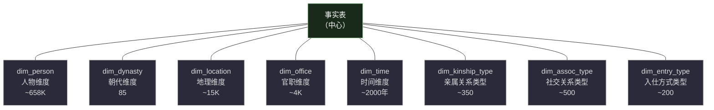
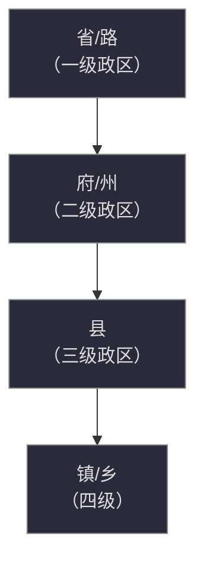
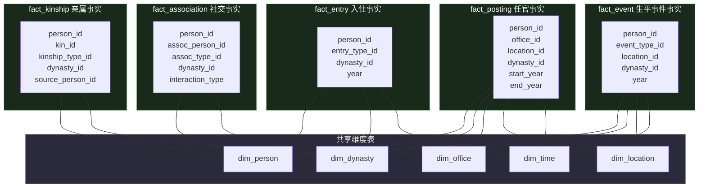
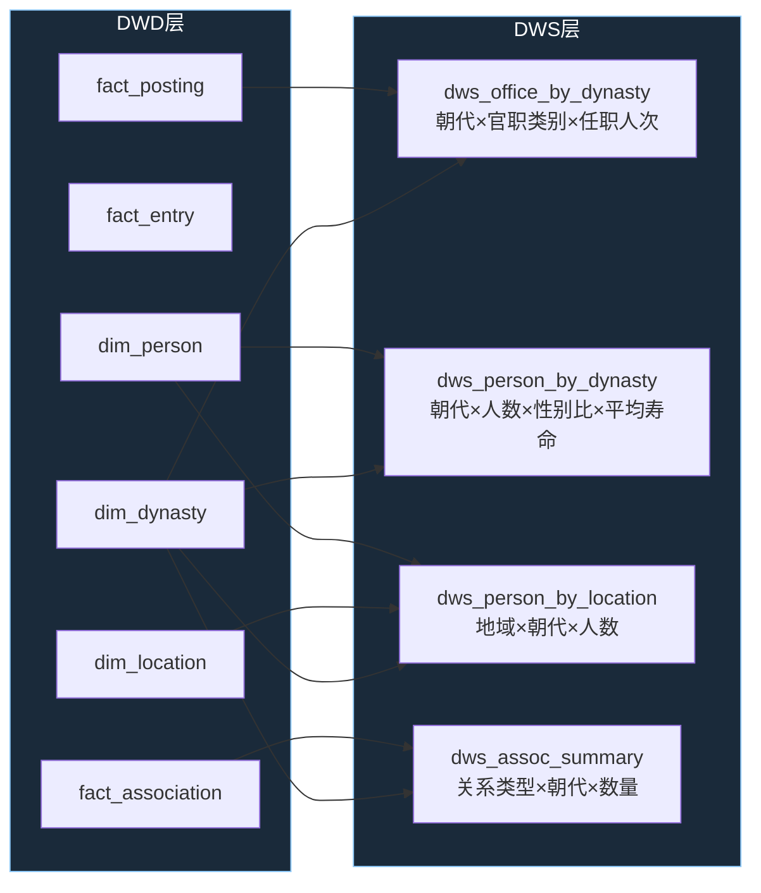
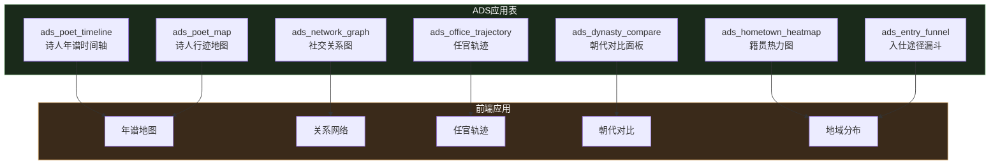
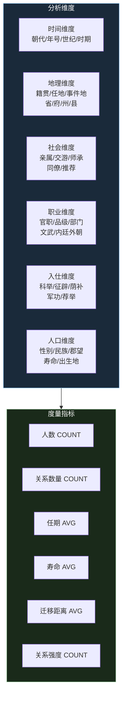
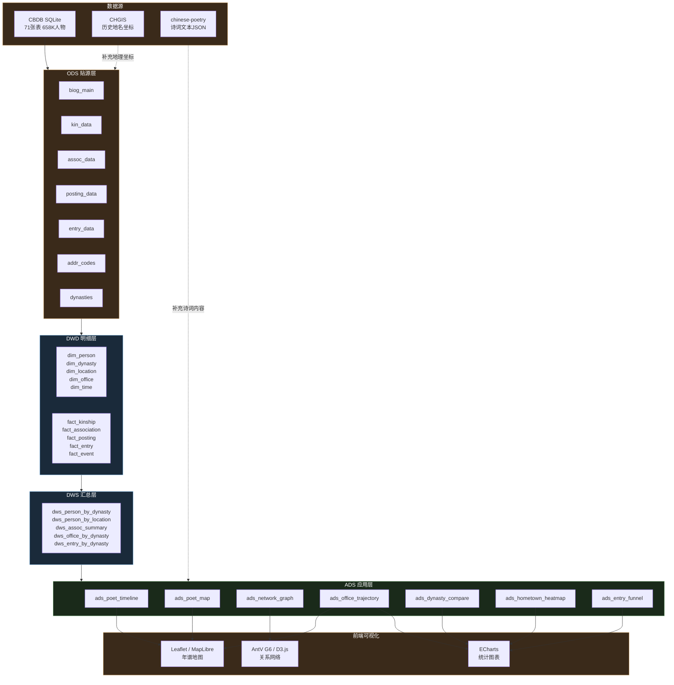

# CBDB 数据仓库建模与分析方案

基于 CBDB（中国历代人物传记资料库）的 658,339 条人物数据，设计分层数仓架构，支持多维分析和可视化应用。

---

## 一、现有 CBDB 分析与可视化项目

### 1.1 CBDB QVis — 北大数字人文可视化平台

| 项目 | 信息 |
|------|------|
| 网址 | https://cbdb-qvis.pkudh.org/home_eng.html |
| 团队 | 北京大学数字人文研究中心 |
| 技术 | D3.js + Vue.js |

**核心功能**：

| 功能 | 说明 |
|------|------|
| 人物迁移地图 | 在地图上展示人物生平的地理移动轨迹（出生→求学→任官→流放→去世） |
| 学术谱系树图 | 以树图展示师承关系，可视化学术传承脉络 |
| 动态网络图 | 时间轴驱动的社交网络演化，可观察不同时期的人物关系变化 |
| 统计面板 | 按朝代、地域、官职等维度的人物分布统计 |

**对我们的价值**：QVis 的交互模式和可视化方案可直接作为"诗人年谱地图"产品的设计参考。

---

### 1.2 CBDB 官方 GitHub

| 项目 | 信息 |
|------|------|
| 地址 | https://github.com/cbdb-project |
| 内容 | 数据导出工具、API、文档 |

官方维护的代码仓库，包含数据转换脚本和查询工具。

---

### 1.3  CBDB 可视化大屏项目

| 项目 | 信息 |
|------|------|
| 技术栈 | React + ECharts + D3.js + SpringBoot + MySQL |
| 主题 | 唐代人物可视化分析大屏 |
| 特点 | 将 CBDB 数据导入 MySQL 后，前端展示人物分布、关系网络、任官统计等 |

**对我们的价值**：完整的前后端技术栈参考，展示了 CBDB 数据如何从 SQLite 迁移到关系型数据库并构建可视化应用。

---

### 1.4 北大数字人文相关项目

| 项目 | 说明 | 链接 |
|------|------|------|
| 朱子年谱可视化 | 朱熹生平事件的时空可视化 | https://pkudh.org |
| 经籍指掌 | 中国古代典籍流传的可视化 | https://pkudh.org |
| 历代人物迁移地图 | 基于 CBDB 的人口迁移动态地图 | https://pkudh.org |

---

### 1.5 学术论文与参考资料

| 资源 | 说明 |
|------|------|
| CBDB 官方文档 | https://cbdb.hsites.harvard.edu/structure-cbdb |
| 《中国历代人物传记资料库的使用与数据分析》 | 哈佛 CBDB 团队发表的数篇方法论论文 |
| SNA + CBDB | 多篇论文使用社会网络分析法（Social Network Analysis）研究 CBDB 中的历史人物关系 |
| CBDB Lecture Notes | https://cbdb.hsites.harvard.edu/lectures |

---

## 二、CBDB 是否适合数仓建模？

**结论：非常适合。** 理由如下：

| 适合数仓的特征 | CBDB 的表现 |
|----------------|-------------|
| 数据量适中 | 65 万人、18.8 万社会关系、55.7 万亲属关系、58.8 万任官记录 |
| 关系结构清晰 | 已有规范化的表结构和外键关系（代码表 + 数据表） |
| 多维分析需求强 | 时间（朝代/年号）、地理（籍贯/任地）、社会（亲属/交游）、职官（品级/部门） |
| 原始数据为 OLTP 设计 | CBDB 的 71 张表按实体-关系-代码三范式设计，适合数仓分层重构 |
| 分析场景明确 | 诗人年谱、关系网络、任官轨迹、地域分布等 |


---

## 三、数仓分层架构设计

### 3.1 分层总览

```mermaid
graph TB
    subgraph ODS["ODS 原始数据层（贴源层）"]
        O1["biog_main<br/>658,339人"]
        O2["kin_data<br/>557,801条亲属"]
        O3["assoc_data<br/>188,397条社交"]
        O4["posting_data<br/>588,218次任官"]
        O5["entry_data<br/>入仕记录"]
        O6["status_data<br/>身份记录"]
        O7["events_data<br/>事件记录"]
        O8["addr_codes<br/>地名坐标"]
        O9["dynasties + nian_hao<br/>朝代年号"]
    end

    subgraph DWD["DWD 明细数据层（维度建模）"]
        D1["dim_person<br/>人物维度"]
        D2["dim_dynasty<br/>朝代维度"]
        D3["dim_location<br/>地理维度"]
        D4["dim_office<br/>官职维度"]
        D5["dim_time<br/>时间维度"]
        D6["fact_kinship<br/>亲属事实"]
        D7["fact_association<br/>社交事实"]
        D8["fact_posting<br/>任官事实"]
        D9["fact_entry<br/>入仕事实"]
    end

    subgraph DWS["DWS 汇总数据层"]
        S1["人物统计汇总"]
        S2["地域分布汇总"]
        S3["社交网络汇总"]
        S4["任官轨迹汇总"]
    end

    subgraph ADS["ADS 应用数据层"]
        A1["诗人年谱地图"]
        A2["人物关系网络"]
        A3["任官轨迹分析"]
        A4["地域迁移分析"]
        A5["朝代人物对比"]
    end

    ODS --> DWD --> DWS --> ADS

    style ODS fill:#3a2a1a,stroke:#d4a76a,color:#fff
    style DWD fill:#1a2a3a,stroke:#90caf9,color:#fff
    style DWS fill:#1a2a3a,stroke:#90caf9,color:#fff
    style ADS fill:#1a2a1a,stroke:#a5d6a7,color:#fff
```



### 3.2 各层职责

| 层次 | 英文 | 职责 | 对应 CBDB |
|------|------|------|-----------|
| ODS | Operational Data Store | 原样保留源数据，仅做格式统一 | CBDB SQLite 71 张表的 1:1 镜像 |
| DWD | Data Warehouse Detail | 维度建模：清洗、标准化、建立事实表和维度表 | 星型模型重构 |
| DWS | Data Warehouse Summary | 按分析主题轻度汇总 | 跨维度聚合统计 |
| ADS | Application Data Store | 面向具体应用的宽表 | 直接驱动前端可视化 |

---

## 四、DWD 层 — 维度表设计

### 4.1 维度表总览



### 4.2 dim_person（人物维度表）

核心维度，承载人物的静态属性。

| 字段名 | 类型 | 来源 | 说明 |
|--------|------|------|------|
| person_id | INT | BIOG_MAIN.c_personid | 人物唯一 ID（主键） |
| name_chn | VARCHAR | BIOG_MAIN.c_name_chn | 中文名 |
| name_en | VARCHAR | BIOG_MAIN.c_name | 英文名 |
| dynasty_id | INT | BIOG_MAIN.c_dy | 所属朝代 |
| birth_year | INT | BIOG_MAIN.c_birthyear | 生年 |
| death_year | INT | BIOG_MAIN.c_deathyear | 卒年 |
| index_year | INT | BIOG_MAIN.c_indexyear | 索引年（活跃年份） |
| gender | CHAR | BIOG_MAIN.c_female | 性别（0=男, 1=女） |
| ethnicity_id | INT | BIOG_MAIN.c_ethnicity | 民族 |
| hometown_id | INT | BIOG_MAIN.c_birthplace_addr_id | 籍贯（关联地理维度） |
| choronym | VARCHAR | CHORONYM_CODES | 郡望/堂号 |
| first_year | INT | BIOG_MAIN.c_by_self | 最早年份 |
| notes | TEXT | BIOG_MAIN.c_notes | 备注 |

**数据示例**（李白）：

| person_id | name_chn | dynasty_id | birth_year | death_year | hometown_id | gender |
|-----------|----------|------------|------------|------------|-------------|--------|
| 32540 | 李白 | 6 | 701 | 762 | 成纪 | 0 |

---

### 4.3 dim_dynasty（朝代维度表）

层级维度：朝代 → 时期。

| 字段名 | 类型 | 来源 | 说明 |
|--------|------|------|------|
| dynasty_id | INT | DYNASTIES.c_dy | 朝代 ID（主键） |
| dynasty_chn | VARCHAR | DYNASTIES.c_dy_chn | 朝代中文名 |
| dynasty_en | VARCHAR | DYNASTIES.c_dy | 英文名 |
| start_year | INT | DYNASTIES.c_start | 起始年 |
| end_year | INT | DYNASTIES.c_end | 结束年 |
| period | VARCHAR | — | 大时期分类（先秦/秦汉/魏晋南北朝/隋唐五代/宋辽金/元明清） |
| parent_dynasty | INT | — | 父朝代（如"蜀汉"的父级为"三国"） |

**数据示例**：

| dynasty_id | dynasty_chn | start_year | end_year | period |
|------------|-------------|------------|----------|--------|
| 1 | 秦 | -221 | -207 | 秦汉 |
| 6 | 唐 | 618 | 907 | 隋唐五代 |
| 15 | 宋 | 960 | 1279 | 宋辽金 |

---

### 4.4 dim_location（地理维度表）

支持地图可视化的核心维度，层级：朝代 → 一级政区 → 二级政区 → 具体地点。

| 字段名 | 类型 | 来源 | 说明 |
|--------|------|------|------|
| location_id | INT | ADDR_CODES.c_addr_id | 地点 ID（主键） |
| name_chn | VARCHAR | ADDR_CODES.c_name_chn | 中文名 |
| name_en | VARCHAR | ADDR_CODES.c_name | 英文名 |
| x_coord | FLOAT | ADDR_CODES.x_coord | 经度 |
| y_coord | FLOAT | ADDR_CODES.y_coord | 纬度 |
| admin_level | INT | ADMIN_CAT_CODES | 行政级别（省/府/州/县） |
| parent_id | INT | ADDR_BELONGS_DATA | 上级地点 ID |
| belongs_to_dynasty | INT | ADDR_BELONGS_DATA | 所属朝代（同一地名在不同朝代归属不同） |

**层级结构示意**：



---

### 4.5 dim_office（官职维度表）

层级维度：官类 → 官职。

| 字段名 | 类型 | 来源 | 说明 |
|--------|------|------|------|
| office_id | INT | OFFICE_CODES.c_office_id | 官职 ID |
| office_chn | VARCHAR | OFFICE_CODES.c_office_chn | 中文名 |
| office_en | VARCHAR | OFFICE_CODES.c_office | 英文名 |
| category_id | INT | OFFICE_CATEGORIES | 官类别（文/武/内廷等） |
| level | INT | OFFICE_TYPE_TREE | 品级 |
| parent_office | INT | OFFICE_TYPE_TREE | 上级官职 |

---

### 4.6 dim_time（时间维度）

将年号和公历年份统一建模。

| 字段名 | 类型 | 来源 | 说明 |
|--------|------|------|------|
| year_id | INT | — | 公历年份（主键，负数=BC） |
| dynasty_id | INT | NIAN_HAO.c_dy | 所属朝代 |
| nianhao | VARCHAR | NIAN_HAO.c_nian_hao_chn | 年号 |
| nianhao_year | INT | NIAN_HAO.c_nth | 年号第几年 |
| century | INT | — | 世纪 |
| period | VARCHAR | — | 大时期 |

---

## 五、DWD 层 — 事实表设计

### 5.1 事实表总览与星型模型



### 5.2 fact_kinship（亲属关系事实表）

| 字段名 | 类型 | 说明 |
|--------|------|------|
| kinship_id | INT | 主键 |
| person_id | INT | 人物 ID → dim_person |
| relative_id | INT | 亲属 ID → dim_person |
| kinship_type_id | INT | 亲属关系类型 → dim_kinship_type |
| dynasty_id | INT | 朝代 → dim_dynasty |

**示例查询**：查询李白的所有亲属关系。

```sql
SELECT p.name_chn AS person, kt.type_name, r.name_chn AS relative
FROM fact_kinship fk
JOIN dim_person p ON fk.person_id = p.person_id
JOIN dim_person r ON fk.relative_id = r.person_id
JOIN dim_kinship_type kt ON fk.kinship_type_id = kt.kinship_type_id
WHERE fk.person_id = 32540  -- 李白
```

结果：

| person | type_name | relative |
|--------|-----------|----------|
| 李白 | 父 | 李客 |
| 李白 | 妻 | 許氏 |
| 李白 | 第二任妻 | 宗氏 |
| 李白 | 子 | 李伯禽 |
| 李白 | 子 | 李頗黎 |
| 李白 | 女 | 李平陽 |

---

### 5.3 fact_association（社交关系事实表）

| 字段名 | 类型 | 说明 |
|--------|------|------|
| assoc_id | INT | 主键 |
| person_id | INT | 人物 ID → dim_person |
| assoc_person_id | INT | 关联人物 ID → dim_person |
| assoc_type_id | INT | 关系类型 → dim_assoc_type |
| dynasty_id | INT | 朝代 → dim_dynasty |
| interaction | VARCHAR | 交互方向（主动/被动/双向） |

**示例查询**：李白社交网络。

| person | assoc_type | associate |
|--------|-----------|-----------|
| 李白 | 友 | 杜甫 |
| 李白 | 被推荐 | 吳筠 |
| 李白 | 被欣赏 | 賀知章 |
| 李白 | 被欣赏 | 唐玄宗 |
| 李白 | 被反对 | 張垍 |
| 李白 | 被反对 | 高力士 |

---

### 5.4 fact_posting（任官事实表）

| 字段名 | 类型 | 说明 |
|--------|------|------|
| posting_id | INT | 主键 |
| person_id | INT | 人物 ID → dim_person |
| office_id | INT | 官职 → dim_office |
| location_id | INT | 任地 → dim_location |
| dynasty_id | INT | 朝代 → dim_dynasty |
| start_year | INT | 起任年份 → dim_time |
| end_year | INT | 离任年份 → dim_time |
| appointment_type | INT | 任命方式 |

**示例查询**：李白任官轨迹。

| person | office | location | start | end |
|--------|--------|----------|-------|-----|
| 李白 | 翰林供奉 | 长安 | 742 | 744 |
| 李白 | 僚佐 | — | 756 | 757 |
| 李白 | 参谋 | — | 757 | — |

---

### 5.5 fact_entry（入仕事实表）

| 字段名 | 类型 | 说明 |
|--------|------|------|
| entry_id | INT | 主键 |
| person_id | INT | 人物 ID → dim_person |
| entry_type_id | INT | 入仕方式 → dim_entry_type |
| dynasty_id | INT | 朝代 → dim_dynasty |
| year | INT | 入仕年份 → dim_time |

---

### 5.6 fact_event（生平事件事实表）

| 字段名 | 类型 | 说明 |
|--------|------|------|
| event_id | INT | 主键 |
| person_id | INT | 人物 ID → dim_person |
| event_type_id | INT | 事件类型 |
| location_id | INT | 事件地点 → dim_location |
| dynasty_id | INT | 朝代 → dim_dynasty |
| year | INT | 事件年份 → dim_time |
| description | TEXT | 事件描述 |

---

## 六、DWS 层 — 汇总统计表

DWS 层按分析主题对 DWD 层做轻度聚合，生成可复用的统计中间表。

### 6.1 汇总表清单

| 表名 | 汇总维度 | 度量 | 说明 |
|------|---------|------|------|
| dws_person_by_dynasty | 朝代 | 人数、性别比、平均寿命 | 各朝代人物统计 |
| dws_person_by_location | 地域 + 朝代 | 人数、入仕率 | 人物籍贯分布 |
| dws_kinship_summary | 关系类型 + 朝代 | 关系数量 | 亲属关系统计 |
| dws_assoc_summary | 关系类型 + 朝代 | 关系数量 | 社交关系统计 |
| dws_office_by_dynasty | 官职类别 + 朝代 | 任职人次、去重人数 | 任官分布统计 |
| dws_entry_by_dynasty | 入仕方式 + 朝代 | 人数 | 入仕途径分析 |
| dws_migration_summary | 起始地 → 目的地 | 迁移人次 | 人口迁移统计 |
| dws_person_timeline | 人物 + 年份 | 事件类型 | 人物年谱数据 |

### 6.2 汇总过程示意



### 6.3 DWS 表结构示例

**dws_person_by_dynasty**：

| 字段名 | 类型 | 说明 |
|--------|------|------|
| dynasty_id | INT | 朝代 ID |
| dynasty_name | VARCHAR | 朝代名 |
| total_persons | INT | 总人数 |
| male_count | INT | 男性人数 |
| female_count | INT | 女性人数 |
| avg_birth_year | INT | 平均生年 |
| avg_death_year | INT | 平均卒年 |
| avg_lifespan | FLOAT | 平均寿命 |
| entry_count | INT | 有入仕记录人数 |
| office_count | INT | 有任官记录人数 |

**预计算示例**：

| dynasty_name | total_persons | male | female | avg_lifespan |
|-------------|---------------|------|--------|-------------|
| 唐 | 57,474 | 56,812 | 662 | ~58 |
| 宋 | 83,204 | 82,190 | 1,014 | ~61 |
| 明 | 178,000+ | — | — | ~56 |
| 清 | 190,000+ | — | — | ~54 |

---

## 七、ADS 层 — 应用数据表

ADS 层直接面向前端应用，每个表对应一个具体的可视化或交互功能。

### 7.1 ADS 表与应用场景映射



---

### 7.2 ads_poet_timeline（诗人年谱时间轴）

驱动前端时间轴组件，展示诗人一生的事件序列。

| 字段名 | 类型 | 说明 |
|--------|------|------|
| person_id | INT | 人物 ID |
| name_chn | VARCHAR | 人物名 |
| year | INT | 公历年份 |
| age | INT | 时年（= year - birth_year） |
| event_type | VARCHAR | 事件类型（出生/入仕/任官/交友/创作/流放/去世） |
| event_desc | VARCHAR | 事件描述 |
| location_id | INT | 地点 ID |
| location_name | VARCHAR | 地点名 |
| x_coord | FLOAT | 经度 |
| y_coord | FLOAT | 纬度 |
| related_person | VARCHAR | 相关人物 |

**李白年谱示例数据**：

| year | age | event_type | event_desc | location_name |
|------|-----|-----------|-----------|---------------|
| 701 | 0 | 出生 | 生于碎叶城 | 碎叶 |
| 725 | 24 | 游历 | 仗剑去国，辞亲远游 | 成都 |
| 730 | 29 | 交友 | 与孟浩然相识 | 襄阳 |
| 742 | 41 | 任官 | 奉诏入京，供奉翰林 | 长安 |
| 744 | 43 | 离任 | 赐金放还 | 长安 |
| 744 | 43 | 交友 | 与杜甫、高适同游 | 洛阳 |
| 756 | 55 | 任官 | 入永王幕府 | 庐山 |
| 757 | 56 | 流放 | 永王兵败，流放夜郎 | — |
| 759 | 58 | 遇赦 | 白帝城遇赦 | 白帝城 |
| 762 | 61 | 去世 | 卒于当涂 | 当涂 |

---

### 7.3 ads_poet_map（诗人行迹地图）

驱动前端地图组件，标注诗人一生的地理移动。

| 字段名 | 类型 | 说明 |
|--------|------|------|
| person_id | INT | 人物 ID |
| name_chn | VARCHAR | 人物名 |
| seq | INT | 事件序号（按时间排序） |
| year | INT | 年份 |
| location_name | VARCHAR | 地点名 |
| x_coord | FLOAT | 经度 |
| y_coord | FLOAT | 纬度 |
| event_type | VARCHAR | 事件类型 |
| event_desc | VARCHAR | 事件简述 |
| related_person | VARCHAR | 同行者/关联人 |

用于在 Leaflet / MapLibre GL 地图上绘制带箭头的迁移路径线。

---

### 7.4 ads_network_graph（社交关系图）

驱动 AntV G6 / D3.js 力导向图，展示诗人社交网络。

| 字段名 | 类型 | 说明 |
|--------|------|------|
| source_id | INT | 源人物 ID |
| source_name | VARCHAR | 源人物名 |
| target_id | INT | 目标人物 ID |
| target_name | VARCHAR | 目标人物名 |
| relation_type | VARCHAR | 关系类型（友/师/推荐/反对等） |
| dynasty | VARCHAR | 朝代 |
| weight | INT | 关系强度（同类型出现次数） |

**数据生成方式**：

```sql
-- 从 fact_association 聚合生成
SELECT
    p1.person_id AS source_id,
    p1.name_chn AS source_name,
    p2.person_id AS target_id,
    p2.name_chn AS target_name,
    at.type_name AS relation_type,
    d.dynasty_chn AS dynasty,
    COUNT(*) AS weight
FROM fact_association fa
JOIN dim_person p1 ON fa.person_id = p1.person_id
JOIN dim_person p2 ON fa.assoc_person_id = p2.person_id
JOIN dim_assoc_type at ON fa.assoc_type_id = at.assoc_type_id
JOIN dim_dynasty d ON fa.dynasty_id = d.dynasty_id
GROUP BY source_id, target_id, relation_type
```

---

### 7.5 ads_office_trajectory（任官轨迹分析）

| 字段名 | 类型 | 说明 |
|--------|------|------|
| person_id | INT | 人物 ID |
| name_chn | VARCHAR | 人物名 |
| office_name | VARCHAR | 官职名 |
| office_category | VARCHAR | 官类别 |
| location_name | VARCHAR | 任地 |
| x_coord | FLOAT | 经度 |
| y_coord | FLOAT | 纬度 |
| start_year | INT | 起任年 |
| end_year | INT | 离任年 |
| duration | INT | 任期（年） |
| seq | INT | 第几次任官 |

用于绘制任官轨迹的时间轴 + 地图联动视图。

---

### 7.6 ads_dynasty_compare（朝代对比面板）

| 字段名 | 类型 | 说明 |
|--------|------|------|
| dynasty_id | INT | 朝代 ID |
| dynasty_name | VARCHAR | 朝代名 |
| total_persons | INT | 总人数 |
| female_ratio | FLOAT | 女性比例 |
| avg_lifespan | FLOAT | 平均寿命 |
| top_entry_method | VARCHAR | 最主要入仕途径 |
| top_office | VARCHAR | 最常见官职 |
| top_hometown | VARCHAR | 最大籍贯地 |
| assoc_density | FLOAT | 社交网络密度 |
| kin_avg | FLOAT | 平均亲属记录数 |

---

### 7.7 ads_hometown_heatmap（籍贯热力图）

| 字段名 | 类型 | 说明 |
|--------|------|------|
| location_id | INT | 地点 ID |
| location_name | VARCHAR | 地名 |
| x_coord | FLOAT | 经度 |
| y_coord | FLOAT | 纬度 |
| dynasty_id | INT | 朝代 ID |
| person_count | INT | 该地籍贯人数 |

用于地图热力图展示。**唐代籍贯 TOP 5 预览**：

| 地名 | 人数 |
|------|------|
| 長安 | 2,379 |
| 洛陽 | 1,466 |
| 河南 | 1,049 |
| 成紀 | 973 |
| 萬年 | 846 |

---

### 7.8 ads_entry_funnel（入仕途径分析）

| 字段名 | 类型 | 说明 |
|--------|------|------|
| dynasty_id | INT | 朝代 ID |
| entry_method | VARCHAR | 入仕方式 |
| person_count | INT | 通过此方式入仕的人数 |
| percentage | FLOAT | 占比 |

**唐代入仕 TOP 5 预览**：

| 入仕方式 | 人数 | 占比 |
|---------|------|------|
| 科舉:進士(籠統) | 1,217 | 42.8% |
| 徵辟 | 162 | 5.7% |
| 封贈 | 54 | 1.9% |
| 科舉:明經 | 43 | 1.5% |
| 蔭補 | 38 | 1.3% |

---

## 八、分析维度体系

### 8.1 多维分析立方体



### 8.2 典型分析场景

| 分析主题 | 维度组合 | 度量 | 对应 ADS 表 |
|---------|---------|------|-------------|
| 诗人年谱 | 人物 × 时间 × 地理 | 事件序列 | ads_poet_timeline |
| 迁移轨迹 | 人物 × 时间 × 地理 | 迁移路径 | ads_poet_map |
| 社交网络 | 人物 × 社会 × 时间 | 关系数量和类型 | ads_network_graph |
| 任官轨迹 | 人物 × 职业 × 地理 × 时间 | 任期、地点 | ads_office_trajectory |
| 朝代对比 | 朝代 × 人口 × 职业 × 入仕 | 综合统计 | ads_dynasty_compare |
| 地域分布 | 地理 × 朝代 × 人口 | 人数热力 | ads_hometown_heatmap |
| 入仕分析 | 入仕方式 × 朝代 | 人数占比 | ads_entry_funnel |
| 家族分析 | 人物 × 亲属 × 朝代 | 家族规模 | — |

---

## 九、完整架构数据流



---

## 十、实施建议

### 10.1 技术选型

| 层次 | 推荐方案 | 理由 |
|------|---------|------|
| 存储引擎 | DuckDB / SQLite | CBDB 本身是 SQLite，单机分析 DuckDB 性能更优 |
| ETL 工具 | Python + pandas | 与 pypinyin 等工具生态一致 |
| OLAP 查询 | DuckDB SQL | 直接查询 Parquet/SQLite，支持窗口函数和复杂聚合 |
| 前端地图 | Leaflet + Tippy.js | 轻量、移动端友好 |
| 关系图 | AntV G6 | 中文文档完善，开箱即用的力导向布局 |
| 统计图表 | ECharts | 中文生态最好，地图/热力图/漏斗图组件齐全 |

### 10.2 实施步骤


### 10.3 优先级建议

| 优先级 | 应用 | 价值 | 复杂度 |
|--------|------|------|--------|
| P0 | 诗人年谱地图（李白/杜甫/苏轼） | 核心功能，用户最直观的体验 | 中 |
| P0 | 籍贯热力图（唐代） | 展示数据量级和地域特色 | 低 |
| P1 | 社交关系网络 | 展示人物关联，增加探索深度 | 中 |
| P1 | 朝代对比面板 | 宏观视角，适合首页展示 | 低 |
| P2 | 任官轨迹分析 | 深度内容，适合诗人详情页 | 高 |
| P2 | 入仕途径分析 | 学术向，补充内容深度 | 低 |

---

*文档更新日期：2026-05-30*
