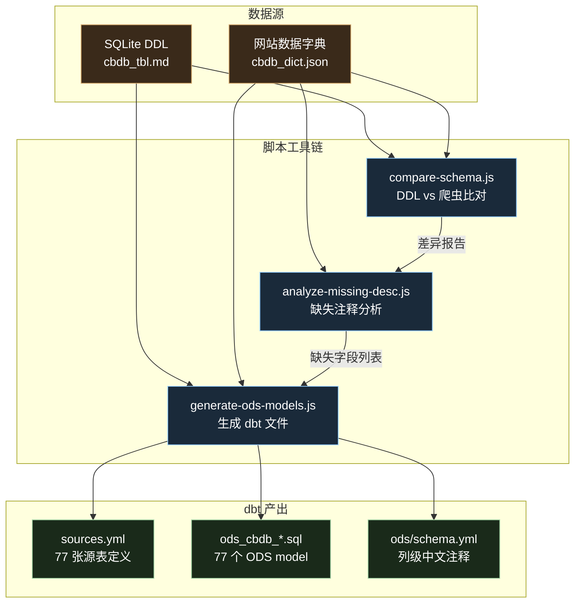
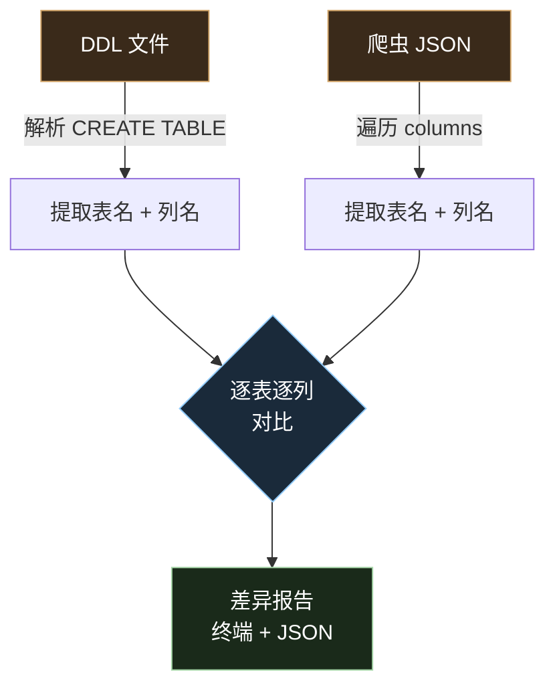
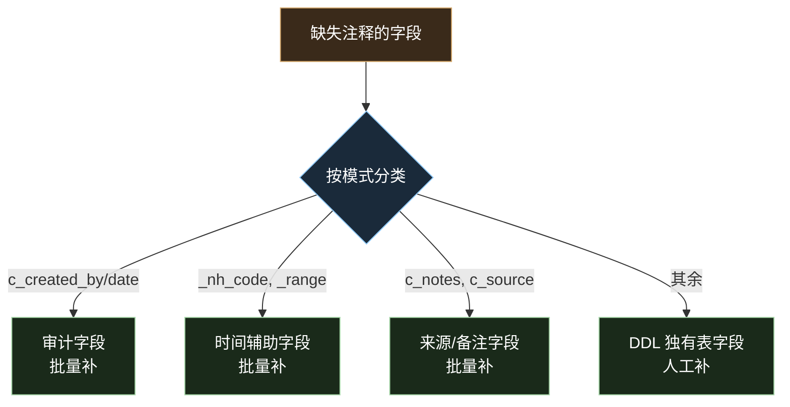
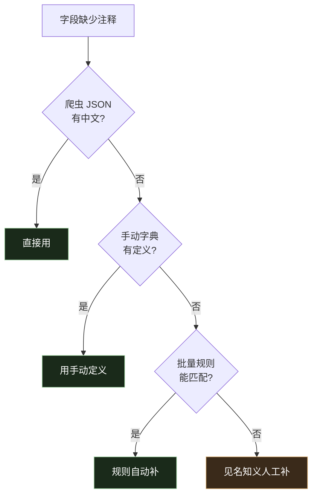
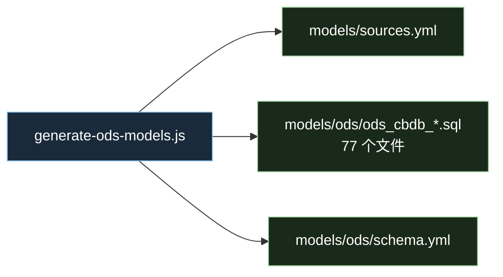
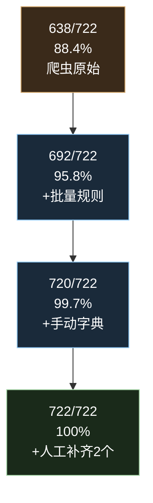
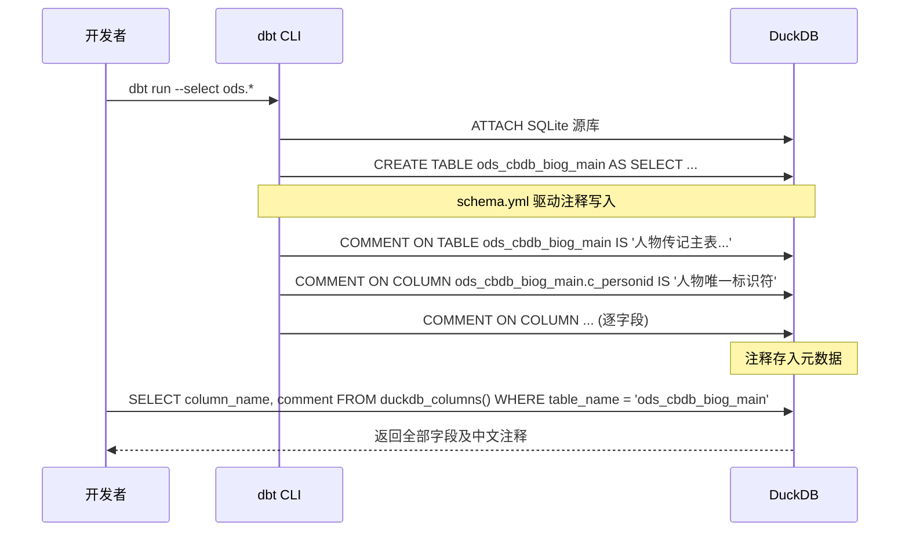

# ODS 同步指南 — 从 SQLite 到 DuckDB

基于 CBDB 项目实践，总结"脚本驱动数仓 ODS 层同步"的完整方法论。

***

## 一、整体流程



***

## 二、三个阶段的脚本

### 阶段 1：比对 DDL 与爬虫字典

**目的**：确认 SQLite 实表和网站数据字典的字段是否对齐。

**输入**：

- `docs/cbdb_tbl.md` — SQLite `.schema` 导出的 DDL
- `output/cbdb_dict.json` — 爬虫从网站抓取的数据字典

**脚本**：`scripts/compare-schema.js`



**关键处理**：Markdown 文件中下划线被转义为 `\_`，解析前需还原为 `_`。

**输出**：

- 终端：人类可读的对比报告
- `output/schema-compare-report.json`：结构化差异清单

**比对维度**：

| 维度    | 说明                          |
| ----- | --------------------------- |
| 仅 DDL | SQLite 有但网站不展示的表（如审计日志表）    |
| 仅爬虫   | 网站有但 SQLite 无此实表（如视图、应用元数据） |
| 字段差异  | 共有表中的列名或列数不同（版本差异）          |

***

### 阶段 2：分析缺失注释

**目的**：定位所有缺少中文注释的字段，分类并制定补充策略。

**输入**：比对结果 + 爬虫 JSON

**脚本**：`scripts/analyze-missing-desc.js`



**补充策略的优先级**：



***

### 阶段 3：生成 dbt ODS 文件

**目的**：从 DDL + 爬虫 JSON + 补充规则，一键生成 dbt 所需的全部文件。

**输入**：DDL、爬虫 JSON、手动字段描述、批量规则

**脚本**：`scripts/generate-ods-models.js`

**生成三个文件**：



**每个文件的职责**：

| 文件               | 职责                                        | dbt 关键字                              |
| ---------------- | ----------------------------------------- | ------------------------------------ |
| `sources.yml`    | 定义外部数据源（SQLite），列出源表字段和中文注释               | `sources:` + `{{ source() }}`        |
| `ods_cbdb_*.sql` | ODS 层查询，显式列出字段 + 行内注释 + ETL 审计列           | `{{ config(materialized='table') }}` |
| `ods/schema.yml` | ODS 模型描述，dbt 执行时自动 `COMMENT ON` 写入 DuckDB | `models:` + `{{ ref() }}`            |

**SQL 文件结构**：

```sql
{{ config(materialized='table') }}

-- ODS: 表中文描述
-- 源表: TABLE_NAME（行数）

SELECT
    c_personid,       -- 字段中文注释
    c_name_chn,       -- 字段中文注释
    ...
    NOW()             AS ETL_LOAD_DATETIME,  -- ETL加载时间
    CURRENT_DATE      AS ETL_LOAD_DATE       -- ETL加载数据日期
FROM {{ source('cbdb_src', 'TABLE_NAME') }}
```

**ETL 审计字段**：`ETL_LOAD_DATETIME` 和 `ETL_LOAD_DATE` 仅出现在 SQL 文件和 `ods/schema.yml` 中，不出现在 `sources.yml` 中（SQLite 源表没有这两个字段）。

***

## 三、注释覆盖率推进过程



| 阶段      | 来源                                                 | 新增覆盖数 |
| ------- | -------------------------------------------------- | ----- |
| 爬虫 JSON | 网站数据字典，69 张共有表的字段描述                                | 638   |
| 批量规则    | 审计字段（20）+ 时间辅助（14）+ 来源备注（7）                        | 41    |
| 手动字典    | 8 张 DDL 独有表的字段 + 版本差异字段                            | 41    |
| 人工补齐    | 版本重命名字段（c\_assoc\_type\_code → c\_assoc\_type\_id） | 2     |

***

## 四、DuckDB 视图注释机制


```sql
SELECT column_name, comment FROM duckdb_columns() WHERE table_name = 'ods_cbdb_biog_main'

```

关键点：

- DuckDB 的 view 和 table 都支持 `COMMENT ON`
- dbt 解析 `schema.yml` 后自动执行 `COMMENT ON`，无需手动写
- 注释可通过 `duckdb_columns()` 系统函数查询

***

## 五、目录结构总览

```
cbdb/
├── scripts/
│   ├── compare-schema.js          # 阶段1: DDL vs 爬虫比对
│   ├── analyze-missing-desc.js    # 阶段2: 缺失注释分析
│   ├── crawl-dict.js              # 爬虫（前置）
│   └── generate-ods-models.js     # 阶段3: 生成 dbt 文件
├── cbdb_dw/                       # dbt 项目
│   ├── dbt_project.yml
│   └── models/
│       ├── sources.yml            # SQLite 源表定义（无 ETL 字段）
│       └── ods/
│           ├── ods_cbdb_*.sql     # 77 个 ODS model（含 ETL 字段）
│           └── schema.yml         # ODS 模型描述（含 ETL 字段）
├── docs/
│   ├── ods-sync-guide.md          # 本文档
│   └── devlog.md                  # 开发日志
└── output/
    ├── cbdb_dict.json             # 爬虫数据字典
    ├── schema-compare-report.json # 比对报告
    └── missing-desc-detail.json   # 缺失注释详情
```

***

*文档更新日期：2026-05-31*
