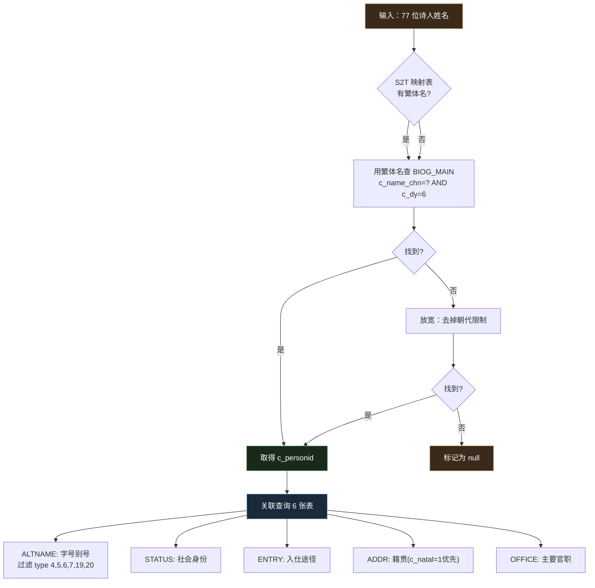

# 诗人传记卡片 — 技术实现文档

基于 CBDB 数据库为唐诗三百首网页版添加诗人传记侧滑卡片功能。

---

## 一、功能概述

在唐诗三百首注音网页版中，每首诗的作者名字可点击，点击后右侧滑出传记面板，展示该诗人的生卒年、字号、籍贯、入仕途径、官职等信息。


**数据覆盖**：72/77 位诗人有传记数据（5 位无 CBDB 记录：无名氏、柳中庸、刘脊虚、朱庆余、邱为）。

---

## 二、数据提取脚本

**文件**：`cbdb/scripts/export-poet-bio.js`

**运行**：`node cbdb/scripts/export-poet-bio.js`

**输出**：`src/poet-bio.json`

### 2.1 查询的 CBDB 表

共查询 11 张表（7 张数据表 + 4 张代码表）：

| 数据表 | 代码表 | 用途 | 关联键 |
|--------|--------|------|--------|
| BIOG_MAIN | — | 人物主表，匹配诗人 | c_name_chn + c_dy |
| ALTNAME_DATA | ALTNAME_CODES | 字号别号 | c_personid → c_alt_name_type_code |
| STATUS_DATA | STATUS_CODES | 社会身份 | c_personid → c_status_code |
| ENTRY_DATA | ENTRY_CODES | 入仕途径 | c_personid → c_entry_code |
| BIOG_ADDR_DATA | ADDR_CODES | 籍贯地址 | c_addr_id + c_natal=1 优先 |
| POSTED_TO_OFFICE_DATA | OFFICE_CODES | 官职 | c_office_id |

### 2.2 查询逻辑



### 2.3 简繁映射

诗词项目用简体字（王维），CBDB 用繁体字（王維）。脚本内置静态映射表 `S2T`，覆盖 50 个需转换的姓名。

特殊映射：

| 诗词项目名 | CBDB 名 | 说明 |
|-----------|---------|------|
| 唐玄宗 | 李隆基(唐玄宗) | CBDB 以本名记录，括号注明庙号 |
| 僧皎然 | 釋皎然 | CBDB 以僧名记录 |
| 西鄙人 | 釋西鄙人 | CBDB 归入释氏 |

### 2.4 字号过滤

仅保留以下 6 种别名类型（ALTNAME_CODES）：

| 编码 | 类型 | 示例 |
|------|------|------|
| 4 | 字 | 字太白 |
| 5 | 室名、別號 | 号青蓮居士 |
| 6 | 諡號 | 谥号文 |
| 7 | 行第 | 行第李十二 |
| 19 | 法號 | 法号皎然 |
| 20 | 道號 | — |

### 2.5 输出 JSON 结构

```json
{
  "李白": {
    "birthYear": 701,
    "deathYear": 762,
    "dynasty": "唐",
    "altNames": ["字太白", "行第李十二", "号酒仙翁", "号青蓮居士"],
    "hometown": "洛陽",
    "hometownCoord": [34.665276, 112.38263],
    "status": ["書法家", "[幕僚]", "求仕", "[隱居（有隱德）]", "詩人"],
    "entry": ["徵辟"],
    "offices": ["翰林供奉", "僚佐", "參謀"]
  },
  "无名氏": null
}
```

字段说明：

| 字段 | 类型 | 来源表 | 说明 |
|------|------|--------|------|
| birthYear | number\|null | BIOG_MAIN.c_birthyear | 出生年份 |
| deathYear | number\|null | BIOG_MAIN.c_deathyear | 卒年 |
| dynasty | string | 固定值"唐" | 朝代 |
| altNames | string[] | ALTNAME_DATA + ALTNAME_CODES | 字号别号，带类型前缀 |
| hometown | string | ADDR_CODES.c_name_chn | 籍贯地名 |
| hometownCoord | [lat, lng] | ADDR_CODES.y_coord, x_coord | 经纬度 |
| status | string[] | STATUS_DATA + STATUS_CODES | 社会身份 |
| entry | string[] | ENTRY_DATA + ENTRY_CODES | 入仕途径 |
| offices | string[] | POSTED_TO_OFFICE_DATA + OFFICE_CODES | 主要官职 |

---

## 三、构建集成

**文件**：`build.js`（项目根目录）

在构建流程末尾，读取 `src/poet-bio.json` 并合并到输出：

```js
const bioPath = path.join(__dirname, 'src', 'poet-bio.json');
if (fs.existsSync(bioPath)) {
  data.poetBios = JSON.parse(fs.readFileSync(bioPath, 'utf8'));
}
```

最终 `dist/data.json` 结构：

```json
{
  "volumes": [...],
  "poems": [...],
  "poetBios": { "张九龄": {...}, "李白": {...}, ... }
}
```

---

## 四、前端实现

**文件**：`src/index.html`

### 4.1 作者名字可点击

`renderPoem()` 中作者 HTML：

```html
<span class="poem-author" data-bio="${poem.author}">
  〔${poem.dynasty || '唐'}〕${poem.author}
</span>
```

渲染后检查 `data.poetBios[author]`，有数据则绑定点击事件，无数据则移除 `data-bio` 属性（名字不可点击）。

### 4.2 侧滑面板

复用设置面板（settings-panel）的 overlay + slide-in 交互模式：

- **打开**：点击作者 → `openBio(name, bio)` → 面板从右滑入
- **关闭**：点击遮罩 / ESC 键 / ✕ 按钮 → `closeBio()`

面板内容按条件渲染：生卒年（大号字）、字号别号（标签）、籍贯、入仕途径、官职、社会身份。

### 4.3 CSS 结构

```
bio-overlay      全屏半透明遮罩，z-index: 200
bio-panel        右侧滑出面板，340px，z-index: 210
  bio-header       诗人姓名 + 关闭按钮
  bio-body         可滚动内容区
    bio-section      每个信息区块
      bio-section-title  区块标题（如"字号别号"）
      bio-section-content 内容（标签或文字）
    bio-years       生卒年大号显示
    bio-tag         药丸标签样式
```

移动端（768px 以下）面板宽度 100%。

---

## 五、文件清单

| 文件 | 作用 |
|------|------|
| `cbdb/scripts/export-poet-bio.js` | 数据提取脚本，查询 CBDB SQLite 输出 JSON |
| `src/poet-bio.json` | 72 位诗人的传记静态数据 |
| `build.js` | 构建脚本，合并 poetBios 到 data.json |
| `src/index.html` | 前端页面，包含传记面板 CSS/HTML/JS |

---

## 六、数据统计

| 指标 | 数量 |
|------|------|
| 诗人总数 | 77 |
| 有传记数据 | 72 |
| 无 CBDB 记录 | 5（无名氏、柳中庸、刘脊虚、朱庆余、邱为）|
| 有生卒年 | 43 |
| 有字号 | 61 |
| 有籍贯 | 66 |
| 有官职 | 62 |
| 有入仕途径 | 55 |

---

*文档更新日期：2026-05-31*
