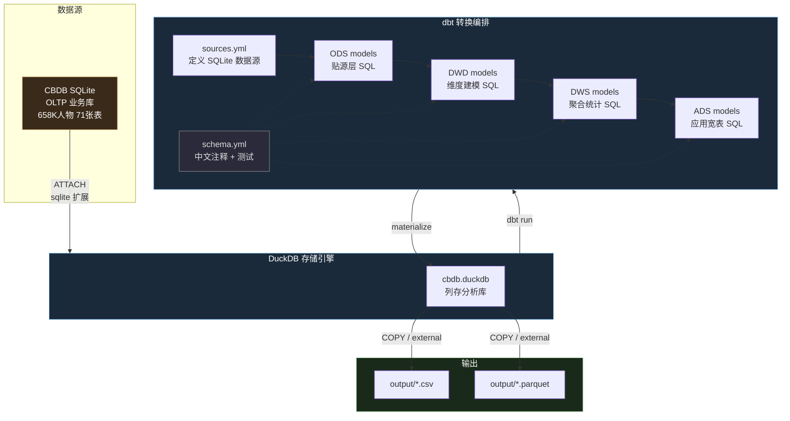
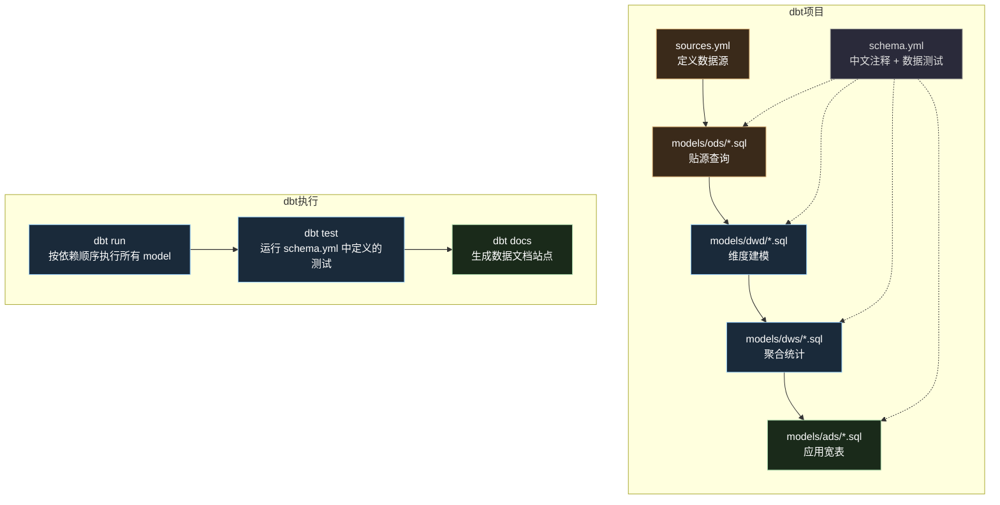
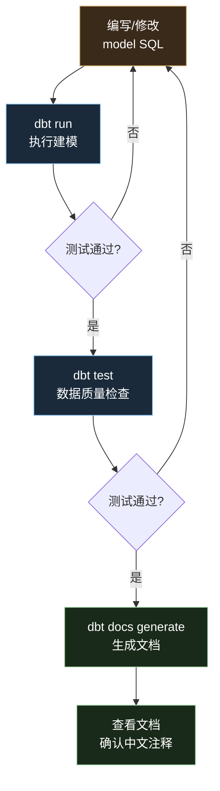
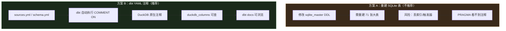

# SQLite + DuckDB + dbt 使用指南

## 一、整体架构

SQLite 做业务库（OLTP），DuckDB 做分析引擎（OLAP），dbt 做数仓建模和转换编排。



### 1.1 职责划分

| 组件         | 定位         | 做什么                  | 不做什么             |
| ---------- | ---------- | -------------------- | ---------------- |
| **SQLite** | 业务库（OLTP）  | 存储原始数据，单行查询          | 不做聚合分析           |
| **DuckDB** | 分析引擎（OLAP） | 列存查询，聚合分析，读写 Parquet | 不做事务             |
| **dbt**    | 转换编排       | SQL 模型、依赖管理、测试、文档    | 不搬运数据（DuckDB 负责） |

### 1.2 数据流

```mermaid
graph LR
    A["SQLite<br/>cbdb_20260523.sqlite3"] -->|"DuckDB ATTACH"| B["DuckDB<br/>cbdb.duckdb"]
    B -->|"dbt run<br/>ODS model"| C["ODS 层<br/>贴源表"]
    C -->|"dbt run<br/>DWD model"| D["DWD 层<br/>维度+事实表"]
    D -->|"dbt run<br/>DWS model"| E["DWS 层<br/>聚合表"]
    E -->|"dbt run<br/>ADS model"| F["ADS 层<br/>应用宽表"]
    F -->|"dbt external<br/>或 DuckDB COPY"| G["CSV/Parquet<br/>output/"]

    style A fill:#3a2a1a,stroke:#d4a76a,color:#fff
    style B fill:#1a2a3a,stroke:#90caf9,color:#fff
    style C fill:#3a2a1a,stroke:#d4a76a,color:#fff
    style D fill:#1a2a3a,stroke:#90caf9,color:#fff
    style E fill:#1a2a3a,stroke:#90caf9,color:#fff
    style F fill:#1a2a1a,stroke:#a5d6a7,color:#fff
    style G fill:#1a2a1a,stroke:#a5d6a7,color:#fff
```



***

## 二、SQLite CLI

### 2.1 安装（Windows）

**方式一：官方下载（推荐）**

1. 访问 <https://www.sqlite.org/download.html>
2. 下载 `sqlite-tools-win-*.zip`（约 1.8MB）
3. 解压得到 `sqlite3.exe`
4. 放到 PATH 目录（如 `C:\Tools\`）

**方式二：包管理器**

```bash
winget install sqlite.sqlite
# 或
scoop install sqlite
```

### 2.2 常用操作

```bash
# 打开数据库
sqlite3 "D:/Consun/Code/GITHUB/pinyin/cbdb/data/cbdb_20260523.sqlite3"

# 列出所有表
.tables

# 查看建表 DDL（含英文注释）
.schema BIOG_MAIN

# 查看字段结构（PRAGMA 格式）
PRAGMA table_info(BIOG_MAIN);
# 输出：cid | name | type | notnull | dflt_value | pk

# 查看外键
PRAGMA foreign_key_list(BIOG_MAIN);

# 查询数据
SELECT c_name_chn, c_birthyear, c_deathyear FROM BIOG_MAIN WHERE c_name_chn = '李白';

# 退出
.exit
```

### 2.3 PRAGMA 速查

| PRAGMA                        | 用途                                   |
| ----------------------------- | ------------------------------------ |
| `PRAGMA table_info(表名)`       | 字段信息（cid, name, type, notnull, pk）   |
| `PRAGMA foreign_key_list(表名)` | 外键（from, to, on\_update, on\_delete） |
| `PRAGMA index_list(表名)`       | 索引列表                                 |
| `PRAGMA table_xinfo(表名)`      | 含隐藏列的字段信息                            |

### 2.4 CBDB SQLite 的注释现状

CBDB 的 DDL 中**部分字段有英文注释**（`/* ... */` 形式），但大部分字段无注释，且无中文注释：

```sql
-- 有注释的字段（少数）
"c_name" varchar(255) DEFAULT NULL
    /* Hanyu Pinyin full name; auto-generated: c_surname + " " + c_mingzi */,

-- 无注释的字段（多数）
"c_birthyear" smallint(6) DEFAULT NULL,
```

SQLite 没有 `COMMENT ON` 语法，无法通过 SQL 语句给表或字段加注释。**中文注释的解决方案见第六节**。

***

## 三、DuckDB

### 3.1 安装

**方式一：CLI**

```bash
winget install DuckDB.cli
```

**方式二：Python pip（dbt 依赖，后续统一装）**

```bash
pip install duckdb
```

**方式三：直接打开 SQLite 文件**

DuckDB 可以直接打开 `.sqlite3` 文件（自动使用 sqlite 扩展）：

```bash
duckdb "D:/Consun/Code/GITHUB/pinyin/cbdb/data/cbdb_20260523.sqlite3"
```

### 3.2 直接查询 SQLite

```sql
-- 安装并加载 sqlite 扩展（首次使用）
INSTALL sqlite;
LOAD sqlite;

-- 方式一：ATTACH 整个数据库
ATTACH 'data/cbdb_20260523.sqlite3' AS cbdb_src (TYPE sqlite);
USE cbdb_src;
SHOW TABLES;

-- 方式二：直接查询（无需 ATTACH）
SELECT * FROM sqlite_scan('data/cbdb_20260523.sqlite3', 'BIOG_MAIN') LIMIT 5;
```

### 3.3 DuckDB 的 COMMENT ON（核心能力）

DuckDB **原生支持** `COMMENT ON`，这是解决 CBDB 中文注释的关键：

```sql
-- 给表加注释
COMMENT ON TABLE biog_main IS '人物传记主表，存储 658,339 位历史人物的核心信息';

-- 给字段加注释
COMMENT ON COLUMN biog_main.c_personid IS '人物唯一标识符';
COMMENT ON COLUMN biog_main.c_name_chn IS '中文全名';
COMMENT ON COLUMN biog_main.c_female IS '性别：0=男性 1=女性';
COMMENT ON COLUMN biog_main.c_dy IS '朝代编码，关联 DYNASTIES 表';

-- 查看注释
SELECT table_name, column_name, comment
FROM duckdb_columns()
WHERE table_name = 'biog_main'
ORDER BY ordinal_position;
```

### 3.4 读写 CSV / Parquet

```sql
-- 读 CSV
SELECT * FROM read_csv_auto('output/cbdb_dict_columns.csv') LIMIT 5;

-- 导出为 Parquet
COPY biog_main TO 'output/biog_main.parquet' (FORMAT PARQUET);

-- 导出查询结果为 CSV
COPY (
    SELECT c_dy_chn, COUNT(*) AS cnt
    FROM biog_main b JOIN dynasties d ON b.c_dy = d.c_dy
    GROUP BY c_dy_chn ORDER BY cnt DESC
) TO 'output/dynasty_stats.csv' (HEADER, DELIMITER ',');
```

***

## 四、dbt（Data Build Tool）

### 4.1 dbt 是什么

dbt 是一个**SQL 转换编排工具**，核心思想是"Select 工作流"：



**dbt 解决的核心问题**：

| 问题         | dbt 怎么做                                                      |
| ---------- | ------------------------------------------------------------ |
| SQL 脚本执行顺序 | 自动分析 `ref()` 依赖，按拓扑排序执行                                      |
| 表和字段的中文注释  | `schema.yml` 中写 `description`，dbt 自动执行 `COMMENT ON`          |
| 数据质量测试     | `schema.yml` 中定义 `tests`（unique, not\_null, relationships 等） |
| 文档生成       | `dbt docs generate` 生成可浏览的文档网站                               |
| 增量更新       | `materialized='incremental'` 只处理新增数据                         |

### 4.2 安装

dbt 是 Python 工具，需要 pip 安装。**需先安装 Python 3.8+**。

```bash
# 安装 dbt-core + dbt-duckdb 适配器
pip install dbt-duckdb

# 验证
dbt --version
# 应输出 dbt-core 和 dbt-duckdb 版本
```

> **dbt-duckdb** 自带 DuckDB 引擎，不需要单独安装 duckdb Python 包。

### 4.3 创建 dbt 项目

```bash
# 在 cbdb/ 目录下初始化 dbt 项目
cd D:/Consun/Code/GITHUB/pinyin/cbdb
dbt init cbdb_dw

# 交互式选择：
# 1. 选择数据库 → duckdb
# 2. 输入数据库路径 → cbdb.duckdb
```

初始化后的项目结构：

```
cbdb/
├── dbt_project.yml          # dbt 项目配置
├── profiles.yml             # DuckDB 连接配置（自动生成在 ~/.dbt/）
├── models/                  # SQL 模型文件
│   ├── example/             # 示例（可删除）
│   └── sources.yml          # 数据源定义
├── macros/                  # 自定义宏（Jinja）
├── seeds/                   # 静态 CSV 数据
├── tests/                   # 自定义测试
└── snapshots/               # 快照（SCD Type 2）
```

### 4.4 项目目录规划（适配 CBDB 数仓）

```
cbdb/
├── dbt_project.yml
├── models/
│   ├── sources.yml              # SQLite 数据源定义
│   ├── ods/                     # ODS 贴源层
│   │   ├── _ods__models.yml     # ODS 层中文注释
│   │   ├── ods_biog_main.sql
│   │   ├── ods_kin_data.sql
│   │   ├── ods_assoc_data.sql
│   │   └── ...
│   ├── dwd/                     # DWD 明细层
│   │   ├── _dwd__models.yml     # DWD 层中文注释
│   │   ├── dim_person.sql
│   │   ├── dim_dynasty.sql
│   │   ├── dim_location.sql
│   │   ├── fact_kinship.sql
│   │   └── ...
│   ├── dws/                     # DWS 汇总层
│   │   ├── _dws__models.yml
│   │   ├── dws_person_by_dynasty.sql
│   │   └── ...
│   └── ads/                     # ADS 应用层
│       ├── _ads__models.yml
│       ├── ads_poet_timeline.sql
│       ├── ads_network_graph.sql
│       └── ...
├── macros/
│   └── comment_on.sql           # 自动生成 COMMENT ON 的宏
└── seeds/                       # 静态数据
    └── dynasty_mapping.csv
```

### 4.5 配置连接 — profiles.yml

`profiles.yml` 告诉 dbt 如何连接 DuckDB，以及需要加载哪些扩展：

```yaml
# ~/.dbt/profiles.yml
cbdb_dw:
  target: dev
  outputs:
    dev:
      type: duckdb
      path: cbdb.duckdb                    # DuckDB 文件路径
      extensions:
        - sqlite                           # 加载 sqlite 扩展
      attach:
        - path: data/cbdb_20260523.sqlite3  # ATTACH SQLite 数据库
          type: sqlite
          alias: cbdb_src
```

这个配置等价于在 DuckDB 中执行：

```sql
INSTALL sqlite;
LOAD sqlite;
ATTACH 'data/cbdb_20260523.sqlite3' AS cbdb_src (TYPE sqlite);
```

### 4.6 定义数据源 — sources.yml

`models/sources.yml` 声明 SQLite 中的原始表，让 dbt 知道数据从哪来：

```yaml
version: 2

sources:
  - name: cbdb_src
    description: "CBDB 中国历代人物传记资料库原始数据"
    database: cbdb_src
    schema: main
    tables:
      - name: BIOG_MAIN
        description: "人物传记主表，658,339 位历史人物"
        columns:
          - name: c_personid
            description: "人物唯一标识符"
            tests: [unique, not_null]
          - name: c_name_chn
            description: "中文全名"
          - name: c_female
            description: "性别：0=男性 1=女性"
          - name: c_birthyear
            description: "出生年份（公历）"
          - name: c_deathyear
            description: "死亡年份（公历）"
          - name: c_dy
            description: "朝代编码，关联 DYNASTIES"
          - name: c_index_addr_id
            description: "籍贯地址 ID，关联 ADDR_CODES"

      - name: DYNASTIES
        description: "朝代表，85 个朝代"
        columns:
          - name: c_dy
            description: "朝代编码"
            tests: [unique, not_null]
          - name: c_dy_chn
            description: "朝代中文名"
          - name: c_dy
            description: "朝代英文名"

      - name: ADDR_CODES
        description: "地址编码表，含经纬度坐标"
      - name: KIN_DATA
        description: "亲属关系数据，556,767 条"
      - name: ASSOC_DATA
        description: "社会关系数据，188,413 条"
      - name: POSTING_DATA
        description: "任官记录，588,263 条"
      - name: ENTRY_DATA
        description: "入仕记录"
      - name: EVENTS_DATA
        description: "生平事件记录"
      - name: NIAN_HAO
        description: "年号表，682 个年号"
```

### 4.7 编写 Model（SQL 文件）

每个 model 是一个 `.sql` 文件，使用 Jinja 模板语法。dbt 会自动：

- 解析 `{{ source() }}` 和 `{{ ref() }}` 依赖
- 按拓扑排序执行
- 根据 `materialized` 配置决定建表/建视图

#### ODS 层示例：`models/ods/ods_biog_main.sql`

```sql
{{ config(
    materialized='table',
    schema='ods'
) }}

SELECT
    c_personid,
    c_name,
    c_name_chn,
    c_female,
    c_index_year,
    c_birthyear,
    c_deathyear,
    c_dy,
    c_index_addr_id,
    c_ethnicity_code,
    c_choronym_code,
    c_notes
FROM {{ source('cbdb_src', 'BIOG_MAIN') }}
```

#### DWD 层示例：`models/dwd/dim_person.sql`

```sql
{{ config(
    materialized='table',
    schema='dwd'
) }}

SELECT
    c_personid    AS person_id,
    c_name_chn    AS name_chn,
    c_name        AS name_en,
    c_dy          AS dynasty_id,
    c_birthyear   AS birth_year,
    c_deathyear   AS death_year,
    c_female      AS gender,       -- 0=男 1=女
    c_index_addr_id AS hometown_id,
    c_choronym_code AS choronym_id
FROM {{ ref('ods_biog_main') }}
```

#### DWS 层示例：`models/dws/dws_person_by_dynasty.sql`

```sql
{{ config(
    materialized='table',
    schema='dws'
) }}

SELECT
    d.c_dy            AS dynasty_id,
    d.c_dy_chn        AS dynasty_name,
    COUNT(*)           AS total_persons,
    SUM(CASE WHEN p.gender = 1 THEN 1 ELSE 0 END) AS female_count,
    AVG(p.death_year - p.birth_year) AS avg_lifespan
FROM {{ ref('dim_person') }} p
JOIN {{ ref('dim_dynasty') }} d ON p.dynasty_id = d.c_dy
GROUP BY d.c_dy, d.c_dy_chn
ORDER BY total_persons DESC
```

#### ADS 层示例：`models/ads/ads_network_graph.sql`

```sql
{{ config(
    materialized='table',
    schema='ads'
) }}

SELECT
    p1.c_personid   AS source_id,
    p1.c_name_chn   AS source_name,
    p2.c_personid   AS target_id,
    p2.c_name_chn   AS target_name,
    ac.c_assoc_desc_chn AS relation_type,
    COUNT(*)         AS weight
FROM {{ source('cbdb_src', 'ASSOC_DATA') }} ad
JOIN {{ source('cbdb_src', 'BIOG_MAIN') }} p1 ON ad.c_personid = p1.c_personid
JOIN {{ source('cbdb_src', 'BIOG_MAIN') }} p2 ON ad.c_associd = p2.c_personid
JOIN {{ source('cbdb_src', 'ASSOC_CODES') }} ac ON ad.c_assoc_code = ac.c_assoc_code
GROUP BY p1.c_personid, p1.c_name_chn, p2.c_personid, p2.c_name_chn, ac.c_assoc_desc_chn
```

### 4.8 用 YAML 写中文注释 — schema.yml

这是解决 CBDB 中文注释的核心方案。每层的 model 目录下放一个 `_layer__models.yml`：

**models/ods/\_ods\_\_models.yml**：

```yaml
version: 2

models:
  - name: ods_biog_main
    description: "人物传记主表（贴源层），从 CBDB SQLite 原样导入"
    columns:
      - name: c_personid
        description: "人物唯一标识符"
        tests: [unique, not_null]
      - name: c_name_chn
        description: "中文全名"
      - name: c_female
        description: "性别：0=男性 1=女性"
      - name: c_birthyear
        description: "出生年份（公历）"
      - name: c_deathyear
        description: "死亡年份（公历）"
      - name: c_dy
        description: "主要活动朝代编码"
        tests:
          - relationships:
              to: source('cbdb_src', 'DYNASTIES')
              field: c_dy
      - name: c_index_addr_id
        description: "籍贯地址 ID"
        tests:
          - relationships:
              to: source('cbdb_src', 'ADDR_CODES')
              field: c_addr_id
```

**models/dwd/\_dwd\_\_models.yml**：

```yaml
version: 2

models:
  - name: dim_person
    description: "人物维度表 — 所有历史人物的标准化属性"
    columns:
      - name: person_id
        description: "人物唯一 ID（主键）"
        tests: [unique, not_null]
      - name: name_chn
        description: "中文全名"
      - name: dynasty_id
        description: "所属朝代 ID → dim_dynasty"
      - name: birth_year
        description: "出生年份（公历）"
      - name: death_year
        description: "死亡年份（公历）"
      - name: gender
        description: "性别：0=男性 1=女性"
      - name: hometown_id
        description: "籍贯地址 ID → dim_location"

  - name: dim_dynasty
    description: "朝代维度表 — 层级：朝代 → 大时期"
    columns:
      - name: dynasty_id
        description: "朝代 ID（主键）"
        tests: [unique, not_null]
      - name: dynasty_chn
        description: "朝代中文名"
      - name: period
        description: "大时期分类（先秦/秦汉/隋唐五代/宋辽金/元明清）"

  - name: fact_kinship
    description: "亲属关系事实表 — 556,767 条亲属记录"
    columns:
      - name: person_id
        description: "人物 ID → dim_person"
      - name: relative_id
        description: "亲属 ID → dim_person"
      - name: kinship_type_id
        description: "亲属关系类型（父/母/妻/子/女等）"
```

### 4.9 dbt 常用命令

```bash
# 在 cbdb_dw 项目目录下执行

# 运行所有 model（按依赖顺序执行 SQL，建表并写入数据）
dbt run

# 只运行某一层
dbt run --select ods.*
dbt run --select dwd.*
dbt run --select ads.*

# 只运行某个 model 及其上游依赖
dbt run --select +ads_network_graph

# 运行数据测试（schema.yml 中定义的 tests）
dbt test

# 生成文档站点（含中文注释、数据 lineage 图）
dbt docs generate
dbt docs serve    # 浏览器打开 http://localhost:8081

# 查看依赖关系图
dbt ls --select ods.*      # 列出 ODS 层所有 model
dbt dag --select ads.*     # 显示 ADS 层 DAG 图
```

### 4.10 dbt 执行流程

```mermaid
sequenceDiagram
    participant U as 开发者
    participant CLI as dbt CLI
    participant DDB as DuckDB
    participant SQL as SQLite文件

    U->>CLI: dbt run
    CLI->>CLI: 解析 model 依赖图(DAG)

    rect rgb(58, 42, 26)
        Note over CLI,DDB: ODS 贴源层
        CLI->>DDB: INSTALL sqlite / LOAD sqlite
        CLI->>DDB: ATTACH cbdb.sqlite3 AS cbdb_src
        CLI->>DDB: CREATE TABLE ods_biog_main AS SELECT ...
        DDB->>SQL: 读取原始数据
        SQL-->>DDB: 返回行数据
        CLI->>DDB: COMMENT ON TABLE/COLUMN 写入中文注释
    end

    rect rgb(26, 42, 58)
        Note over CLI,DDB: DWD 明细层
        CLI->>DDB: CREATE TABLE dim_person AS SELECT FROM ods_biog_main
        CLI->>DDB: COMMENT ON TABLE/COLUMN 写入中文注释
    end

    rect rgb(26, 42, 58)
        Note over CLI,DDB: DWS 汇总层
        CLI->>DDB: CREATE TABLE dws_person_by_dynasty AS SELECT GROUP BY
    end

    rect rgb(26, 42, 26)
        Note over CLI,DDB: ADS 应用层
        CLI->>DDB: CREATE TABLE ads_network_graph AS SELECT JOIN
    end

    CLI-->>U: 运行完成 PASS / FAIL / WARN
```



***

## 五、dbt + DuckDB 的完整工作流

### 5.1 初始化项目

```bash
cd D:/Consun/Code/GITHUB/pinyin/cbdb

# 1. 初始化 dbt 项目
dbt init cbdb_dw

# 2. 配置 profiles.yml（见 4.5 节）
# 编辑 ~/.dbt/profiles.yml

# 3. 创建目录结构
mkdir -p models/ods models/dwd models/dws models/ads

# 4. 编写 sources.yml（见 4.6 节）

# 5. 编写各层 model SQL 文件

# 6. 编写各层 schema.yml 中文注释
```

### 5.2 日常开发循环



### 5.3 导出结果

dbt 的 `external` 物化方式可以直接导出文件：

```sql
-- models/ads/ads_export_network.sql
{{ config(
    materialized='external',
    location='output/ads_network_graph.csv'
) }}

SELECT * FROM {{ ref('ads_network_graph') }}
```

也可以在 dbt run 之后，用 DuckDB CLI 导出：

```bash
duckdb cbdb.duckdb -c "
    COPY (SELECT * FROM ads.ads_network_graph)
    TO 'output/ads_network_graph.csv' (HEADER, DELIMITER ',');
"
```

***

## 六、中文注释方案对比



| 维度     | SQLite 重建表          | dbt YAML + DuckDB COMMENT ON         |
| ------ | ------------------- | ------------------------------------ |
| 注释存储   | DDL 文本中的 `/* */`    | DuckDB 元数据系统表                        |
| 查询注释   | `.schema`（肉眼读 DDL）  | `SELECT comment FROM duckdb_columns` |
| 实施风险   | 高（重建大表）             | 无（只读 SQLite，新建 DuckDB）               |
| 自动化    | 需写脚本生成 DDL          | `dbt run` 自动处理                       |
| 文档生成   | 无                   | `dbt docs generate` 自动生成站点           |
| 数据测试   | 无                   | `schema.yml` 中定义，`dbt test` 执行       |
| 中文注释来源 | crawl-dict 爬取的 JSON | 同样来自爬取，写在 YAML 里                     |

**结论**：不需要修改 SQLite，直接在 dbt 的 YAML 中写中文注释，由 dbt 在 DuckDB 中通过 `COMMENT ON` 写入元数据。

***

## 七、参考资源

| 资源                       | 链接                                                                      |
| ------------------------ | ----------------------------------------------------------------------- |
| DuckDB SQLite 扩展文档       | <https://duckdb.org/docs/current/core_extensions/sqlite.html>           |
| dbt-duckdb 适配器           | <https://github.com/duckdb/dbt-duckdb>                                  |
| dbt-duckdb 官方教程（2025.04） | <https://duckdb.org/2025/04/04/dbt-duckdb.html>                         |
| dbt DuckDB 连接配置          | <https://docs.getdbt.com/docs/local/connect-data-platform/duckdb-setup> |
| dbt SQLite 连接配置          | <https://docs.getdbt.com/docs/local/connect-data-platform/sqlite-setup> |
| dbt-duckdb PyPI          | <https://pypi.org/project/dbt-duckdb/>                                  |

***

*文档更新日期：2026-05-30*
