# cnkgraph "未爬取 API" 探索：从误判到正名

> 12 个 Postman 集合中，7 个已爬取、5 个标记为"需要微信认证"。经过系统排查发现：**5 个集合全部为公开接口，无需任何认证**。本文记录完整的探索过程、踩过的坑和最终的解决方案。

***

## 1. 背景

### 1.1 问题起源

cnkgraph API 有 12 个 Postman 集合，分两批：

| 批次       | 集合                    | 端点数 | 状态            |
| -------- | --------------------- | --- | ------------- |
| 第一批（已爬取） | 年历、人物、诗文库、地理、词谱、曲谱、韵典 | 37  | 已写入 ODS 15 张表 |
| 第二批（未爬取） | 词汇典故、古籍库、类书、工具、字典     | 22  | 标记为"需微信认证"    |

第一批用 `crawl-tang300.py` 和 `crawl-juan11.py` 顺利完成爬取。第二批在初始测试时返回了微信登录页面 HTML，被标记为需要 WeChat OAuth2.0 认证。

### 1.2 第二批 API 的潜在价值

| 集合    | 内容       | 学术价值          |
| ----- | -------- | ------------- |
| 词汇、典故 | 词典、典故、佛典 | 诗词用典深度分析、词频研究 |
| 古籍库   | 四部全书全文   | 全文检索、古籍数字化研究  |
| 类书    | 古今图书集成等  | 古代百科全书、知识图谱   |
| 字典    | 康熙+说文+现代 | 汉字音韵演变研究      |
| 工具    | 繁简转换、笺注  | 实时工具，非批量数据    |

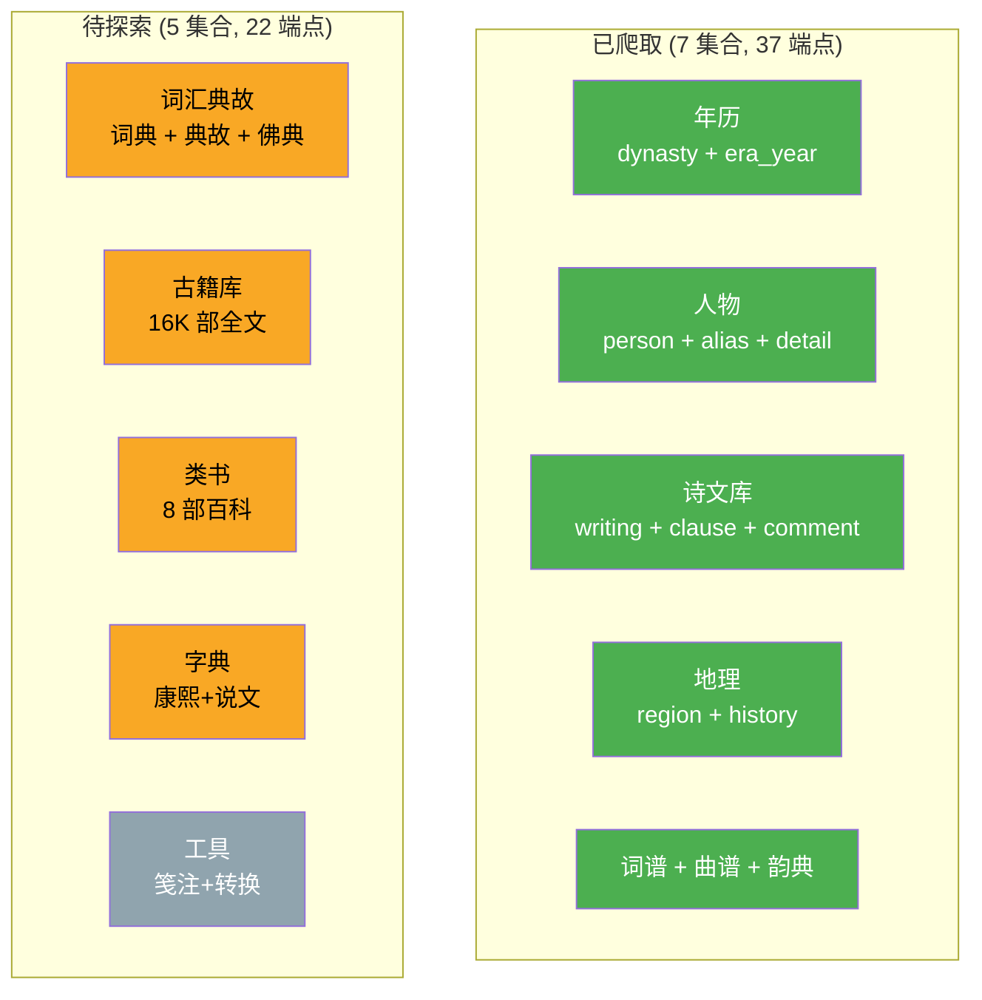

***

## 2. 探索过程

### 2.1 第一轮：验证"需要认证"的结论

**做法**：直接用浏览器和 curl 访问 API 端点。

**问题**：没有查看 Postman 集合文件中的**实际路径**，而是根据 API 功能名称自己**猜测**了 URL：

| 猜测的路径                                | 结果                     | 结论       |
| ------------------------------------ | ---------------------- | -------- |
| `/api/Allusion/AllusionList`         | 404 Not Found          | API 不存在？ |
| `/api/Allusion/TypeList`             | 404 Not Found          | 需要认证？    |
| `/api/Book/Search?keyword=诗经`        | 405 Method Not Allowed | 方法不对     |
| `/api/Dictionary/DictList?keyword=风` | 空响应                    | 被拦截？     |
| `/api/Leishu/Search?keyword=诗`       | 404 Not Found          | 不存在      |

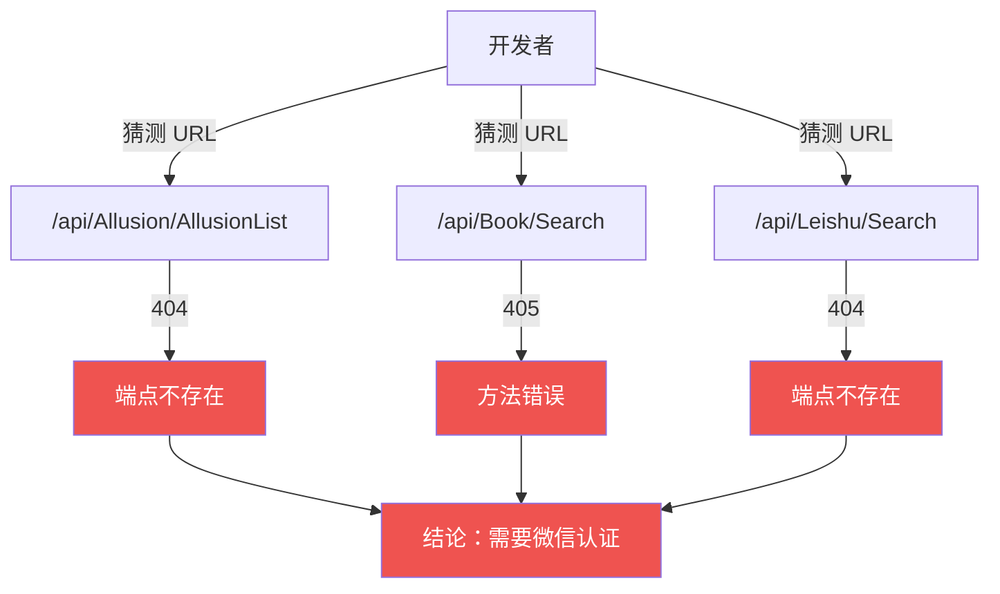

**坑点 #1：猜测 URL 而非查看 Postman 文件**

Postman 集合文件就在 `cnkgraph/postman/` 目录下，每个集合都有完整的 URL 路径。但因为已爬取的 7 个集合 URL 很直观（如 `/api/dynasty`、`/api/people/唐朝`），就下意识地以为其他集合也是类似风格，**没有去核对源文件**。

### 2.2 第二轮：探索微信登录机制

在确认"需要认证"的错误结论后，转向研究微信 OAuth2.0 登录流程：

1. 访问 `https://cnkgraph.com/Auth/WeChatLogin` → 看到扫码登录页面
2. Web 搜索 cnkgraph 认证方式 → 确认为 WeChat OAuth2.0
3. 分析登录流程：扫码 → 获取 code → 换取 access\_token → session cookie

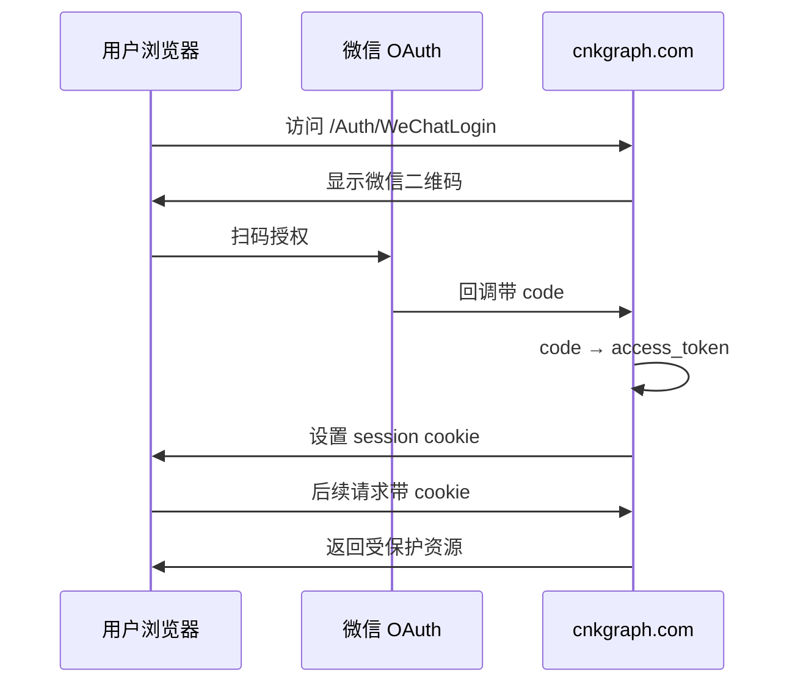

**坑点 #2：探索方向完全偏了**

这些 API 根本不需要认证，花时间研究微信登录流程是浪费。根本原因是没有回头验证最初的假设。

### 2.3 第三轮：回归源头 — 读取 Postman 集合文件

**转折点**：决定回到 Postman 集合文件，逐一提取每个端点的**精确 URL 和请求格式**。

从 5 个集合文件中提取到的信息：

| 集合   | 端点        | 方法   | 路径                                          |
| ---- | --------- | ---- | ------------------------------------------- |
| 词汇典故 | 按词汇 Id 查询 | GET  | `/api/glossary/词典/10`                       |
| 词汇典故 | 按典故 Id 查询 | GET  | `/api/glossary/典故/1000`                     |
| 词汇典故 | 按佛典 Id 查询 | GET  | `/api/glossary/佛典/100`                      |
| 词汇典故 | 批量查词典     | POST | `/api/glossary/词典` body:`[10,15,30,42]`     |
| 词汇典故 | 关键词查典故    | POST | `/api/glossary/典故/find` body:`{"key":"桃花"}` |
| 古籍库  | 古籍总览      | GET  | `/api/book`                                 |
| 古籍库  | 分类书目      | GET  | `/api/book/史部/正史类`                          |
| 古籍库  | 书本详情      | GET  | `/api/book/2180`                            |
| 古籍库  | 卷册内容      | GET  | `/api/book/volume/KR4h0140_024`             |
| 古籍库  | 关键词搜索     | POST | `/Api/Book/Find` body:`{"key":"黄鹤楼"}`       |
| 类书   | 类书列表      | GET  | `/api/category`                             |
| 类书   | 类书目录      | GET  | `/api/category/钦定古今图书集成`                    |
| 类书   | 条目卷册      | GET  | `/api/category/.../0002/KR7a0001_018`       |
| 类书   | 关键词搜索     | POST | `/api/category/find` body:`{"key":"潮州"}`    |
| 工具   | 简转繁       | POST | `/api/tool/charsetConvert`                  |
| 工具   | 自动笺注      | POST | `/api/tool/labelize`                        |
| 工具   | 出处分析      | POST | `/api/tool/reference`                       |
| 工具   | 短信查询      | POST | `/api/tool/texting`                         |
| 字典   | 查字        | GET  | `/api/char/中`                               |

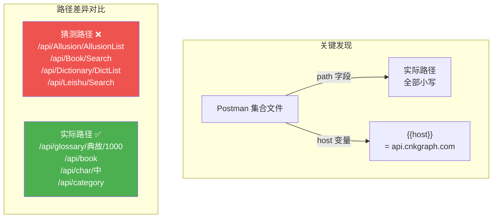

**关键发现**：

- 真实路径全部是**小写英文**（`glossary`、`book`、`category`、`char`），不是猜测的 PascalCase 中文拼音混合
- Postman 的 `{{host}}` 变量指向 `api.cnkgraph.com`（API 子域），不是 `cnkgraph.com`（前端主站）
- 古籍搜索是个特例：路径为 PascalCase `/Api/Book/Find`（注意 `Api` 大写 A），且 host 写死而非使用变量

### 2.4 第四轮：逐一实测全部端点

用 Python requests 对所有 22 个端点逐一测试：

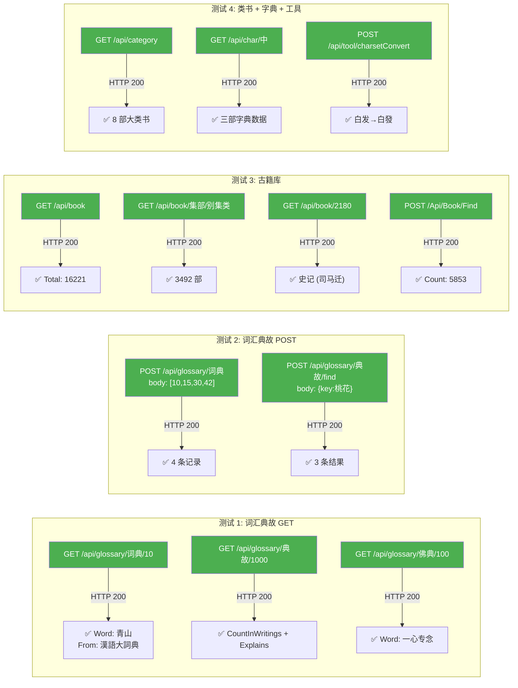

**结果**：22 个端点中 21 个返回 HTTP 200 + JSON 数据。仅 `/api/tool/labelize` 返回 404（端点可能已下线或路径变更）。

### 2.5 第五轮：数据量探查

知道了 API 可用后，用**二分法**估算每种数据的最大 ID：

```python
# 二分法伪代码
lo, hi = 100000, 600000
while hi - lo > 1000:
    mid = (lo + hi) // 2
    if check_id(mid):  # GET 请求返回有效数据
        lo = mid
    else:
        hi = mid
```

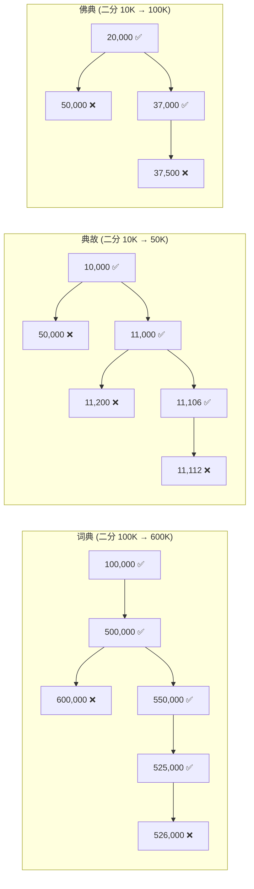

最终估算：

| API | 最大 ID 范围           | 预估记录数        |
| --- | ------------------ | ------------ |
| 词典  | 525,000 \~ 526,000 | **\~525K**   |
| 典故  | 11,106 \~ 11,112   | **\~11K**    |
| 佛典  | 37,000 \~ 37,500   | **\~37K**    |
| 古籍库 | —                  | **16,221 部** |
| 类书  | —                  | **8 部**      |
| 字典  | CJK 字符集            | **数千字**      |

***

## 3. 踩过的坑

### 坑 #1：猜测 URL 而非查看源文件

| 做法                                        | 结果             |
| ----------------------------------------- | -------------- |
| 根据功能名猜测 `/api/Allusion/AllusionList`      | 404            |
| 根据功能名猜测 `/api/Dictionary/DictList`        | 空响应            |
| 根据功能名猜测 `/api/Leishu/Search`              | 404            |
| **查看 Postman 文件** `/api/glossary/典故/1000` | **HTTP 200 ✅** |

**教训**：API 文档/集合文件就在手边时，不要凭直觉猜测 URL。先读文件，再动手。

### 坑 #2：混淆前端页面和 API 端点

| 域名                 | 用途     | 需要登录           |
| ------------------ | ------ | -------------- |
| `cnkgraph.com`     | 前端网站   | 部分**页面**需要微信登录 |
| `api.cnkgraph.com` | API 服务 | **不需要**任何认证    |

访问 `cnkgraph.com/Glossary`（前端页面）会弹出登录框，但 `api.cnkgraph.com/api/glossary/词典/10`（API 端点）直接返回数据。**前端路由 ≠ API 路由**。

### 坑 #3：curl 在 Windows 上的编码陷阱

```bash
# curl 在 Windows CMD/Bash 中输出中文乱码
$ curl -s "https://api.cnkgraph.com/api/glossary/词典/10"
{"Message": "鏈\udcaa鎵惧..."}

# Python 正确处理 UTF-8
$ python -c "import requests; r = requests.get('...'); print(r.json()['Word'])"
青山
```

**教训**：在 Windows 上测试含中文的 API 响应时，用 Python 而非 curl。

### 坑 #4：Postman 集合中的不一致

古籍库的搜索端点有两个特殊之处：

```json
// 其他 20 个端点都用 {{host}} 变量
"url": { "raw": "https://{{host}}/api/glossary/词典/10" }

// 古籍搜索端点写死了 host，且路径是 PascalCase
"url": { "raw": "https://api.cnkgraph.com/Api/Book/Find" }
//                                 ^^^ 大写 A          ^^^^ PascalCase
```

| 端点               | Host                   | Path 大小写                    |
| ---------------- | ---------------------- | --------------------------- |
| 全部 21 个端点        | `{{host}}`（变量）         | 小写 `/api/...`               |
| `/Api/Book/Find` | `api.cnkgraph.com`（写死） | PascalCase `/Api/Book/Find` |

如果照搬其他端点的模式 `/api/book/find`，会得到 404。**同一个集合内部也存在路径风格不一致**。

### 坑 #5：POST body 格式差异

不同端点的 POST body 格式各不相同，不能一概而论：

| 端点                         | Body 格式                          | 说明            |
| -------------------------- | -------------------------------- | ------------- |
| `/api/glossary/词典`         | `[10, 15, 30, 42]`               | **裸 JSON 数组** |
| `/api/glossary/典故/find`    | `{"key":"桃花","charIndex":"end"}` | JSON 对象       |
| `/Api/Book/Find`           | `{"key":"黄鹤楼","pageNo":1}`       | JSON 对象       |
| `/api/category/find`       | `{"key":"潮州"}`                   | JSON 对象       |
| `/api/tool/charsetConvert` | `{"content":"...","mode":"..."}` | JSON 对象       |

特别注意词典批量查询：body 是**裸数组** `[10,15,30,42]`，不是 `{"ids":[10,15,30,42]}`。后者会报 400 验证错误：

```json
{
  "errors": {
    "ids": ["Cannot deserialize the current JSON object into type 'System.Int32[]'..."]
  }
}
```

***

## 4. Postman 集合详细分析（含真实返回数据）

> 以下数据均来自 2026-06-05 实测，Base URL 为 `https://api.cnkgraph.com`。所有端点无需认证。

### 4.0 12 个 Postman 集合全景

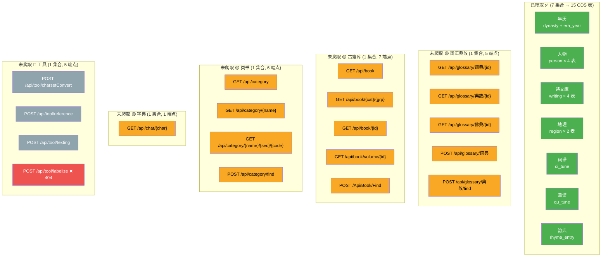

***

### 4.1 词汇典故（5 端点，\~573K 条）

Postman 文件：`postman/词汇、典故.postman_collection.json`

三种子类型共享路径前缀 `/api/glossary/`，通过 URL 路径段区分：词典、典故、佛典。

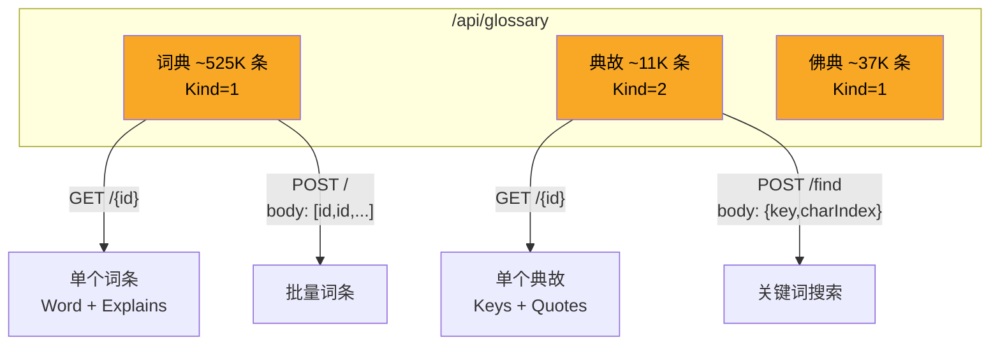

#### 端点 1：按词汇 Id 查询 `GET /api/glossary/词典/{id}`

预估 \~525K 条（二分法：最大 ID 在 525,000\~526,000 之间）。

```json
// GET /api/glossary/词典/10 → HTTP 200
{
  "Word": "青山",
  "OriginalWord": "青山",
  "From": "漢語大詞典",
  "Spellings": "qīng shān",
  "Explains": [
    "(1).青葱的山岭。<span class=\"book\">《<a href='https://cnkgraph.com/Book/2161' target='_blank'>管子·地员</a>》</span>："青山十六施，百一十二尺而至于泉。" 唐 <a href='/People/15783' target='_blank'>徐凝</a> <a href='/Writing/43392' target='_blank'>《别白公》</a>诗："青山旧路在，白首醉还乡。"",
    "(2).指归隐之处。 唐 <a href='/People/20204' target='_blank'>贾岛</a> <a href='/Writing/44141' target='_blank'>《答王建秘书》</a>诗："白髮无心镊，青山去意多。"",
    "(3).山名。一名青林山。南朝诗人谢朓曾卜居于此..."
  ],
  "Categories": ["青", "园圃", "山", "青山", "青葱", "山名", "归隐", "山岭", "诗人", "于此"],
  "Kind": 1,
  "Id": 10
}
```

**字段说明**：

| 字段             | 类型         | 说明                       |
| -------------- | ---------- | ------------------------ |
| `Word`         | string     | 简体词条                     |
| `OriginalWord` | string     | 繁体/原始词条                  |
| `From`         | string?    | 来源词典（如"漢語大詞典"）           |
| `Spellings`    | string?    | 拼音                       |
| `Explains`     | string\[]  | 释义列表，含 HTML（内链到人物/作品/古籍） |
| `Categories`   | string\[]? | 分类标签                     |
| `Kind`         | int        | 类型标识（1=词典/佛典, 2=典故）      |
| `Id`           | int        | 唯一 ID                    |

> Explains 中内嵌丰富的超链接：`<a href='/People/15783'>` 指向人物页，`<a href='/Writing/43392'>` 指向诗文页，`<a href='https://cnkgraph.com/Book/2161'>` 指向古籍页。可用于构建知识图谱的关联关系。

#### 端点 2：按典故 Id 查询 `GET /api/glossary/典故/{id}`

预估 \~11K 条（最大 ID \~11,112）。

```json
// GET /api/glossary/典故/1000 → HTTP 200
{
  "CountInWritings": 60,
  "Keys": [
    "二石弓", "不識一丁", "一丁不識", "丁字不識",
    "弓兩石", "不若一丁字", "空腹無丁字", "莫識一丁字"
  ],
  "RelatedPersons": null,
  "Correlations": null,
  "References": null,
  "Quotes": [
    {
      "Book": "《新唐書》卷一百二十七〈張嘉貞列傳·張弘靖〉～4447～",
      "Content": "長慶初，劉總舉所部內屬...嘗曰："天下無事，而輩挽兩石弓，不如識一丁字。"軍中以氣自任，銜之。"
    },
    {
      "Book": "《能改齋漫錄》卷五〈辨誤·不如識一丁字〉～02～",
      "Content": "《唐書》張宏靖傳："背挽兩石弓，不如識一丁字。"舊史亦同..."
    }
  ],
  "Explains": null,
  "Kind": 2,
  "Id": 1000
}
```

**字段说明**：

| 字段                | 类型         | 说明                            |
| ----------------- | ---------- | ----------------------------- |
| `CountInWritings` | int        | 该典故在诗文中出现的次数                  |
| `Keys`            | string\[]  | 典故的所有变体关键词                    |
| `RelatedPersons`  | object\[]? | 相关人物                          |
| `Correlations`    | array?     | 关联典故                          |
| `References`      | array?     | 参考文献                          |
| `Quotes`          | object\[]? | 引用原文（含 Book 出处 + Content 原文）  |
| `Explains`        | string\[]? | 释义（本例为 null，典故主要通过 Quotes 展示） |
| `Kind`            | int        | 类型标识（2=典故）                    |
| `Id`              | int        | 唯一 ID                         |

#### 端点 3：按佛典 Id 查询 `GET /api/glossary/佛典/{id}`

预估 \~37K 条（最大 ID \~37,500）。

```json
// GET /api/glossary/佛典/100 → HTTP 200
{
  "Word": "一心专念",
  "OriginalWord": "一心專念",
  "From": null,
  "Spellings": null,
  "Explains": [
    "【佛學大辭典】",
    "（術語）念佛之心專一也。往生論曰："心常作願，一心專念，畢竟往生安樂國土。"善導之觀經疏四曰："一心專念彌陀名號，行住坐臥，不問時節久遠，念念不捨者，是名正定之業。""
  ],
  "Categories": null,
  "Kind": 1,
  "Id": 100
}
```

结构同词典，但 `From` 通常为 null，Explains 开头标注来源辞典名（如"【佛學大辭典】"）。

#### 端点 4：批量查词典 `POST /api/glossary/词典`

Body 为**裸 JSON 数组**（不是 `{"ids":[...]}`），返回对应词条列表。

```json
// POST /api/glossary/词典  body: [10, 15, 30, 42] → HTTP 200
[
  {"Word": "青山",   "OriginalWord": "青山", "From": "漢語大詞典", "Spellings": "qīng shān", ... "Id": 10},
  {"Word": "不见",   "OriginalWord": "不见", "From": "漢語大詞典", "Spellings": "bù jiàn",   ... "Id": 15},
  {"Word": "悠悠",   "OriginalWord": "悠悠", "From": "漢語大詞典", "Spellings": "yōu yōu",   ... "Id": 30},
  {"Word": "芙蓉",   "OriginalWord": "芙蓉", "From": "漢語大詞典", "Spellings": "fú róng",   ... "Id": 42}
]
```

#### 端点 5：关键词查典故 `POST /api/glossary/典故/find`

```json
// POST /api/glossary/典故/find  body: {"key":"桃花","charIndex":"end"} → HTTP 200
[
  {
    "CountInWritings": 10649,
    "Keys": ["武陵溪", "桃花源", "桃花流水", "武陵源", "桃源路", ...],
    "RelatedPersons": null,
    "Quotes": [...],
    "Kind": 2, "Id": ...
  },
  {
    "CountInWritings": 576,
    "Keys": ["桃花水", "春水漾桃花"],
    "RelatedPersons": null,
    "Quotes": [
      {"Book": "《漢書》卷二十九〈溝洫志〉～689～", "Content": "...桃華水盛，必羨溢..."}
    ],
    "Kind": 2, "Id": ...
  },
  {
    "CountInWritings": 277,
    "Keys": ["桃花人面", "人面桃花", "去年人面", ...],
    "RelatedPersons": [{"Name": "崔護", "PersonId": 14776}],
    "Quotes": [
      {"Book": "《本事詩·情感》", "Content": "博陵崔護，姿質甚美..."}
    ],
    "Kind": 2, "Id": ...
  }
]
```

`charIndex` 参数：`"start"` 匹配以关键词开头的典故，`"end"` 匹配以关键词结尾的。

***

### 4.2 古籍库（7 端点，16,221 部）

Postman 文件：`postman/古籍库.postman_collection.json`

数据层次：**总览 → 分类 → 书目 → 卷册全文**，层层递进。

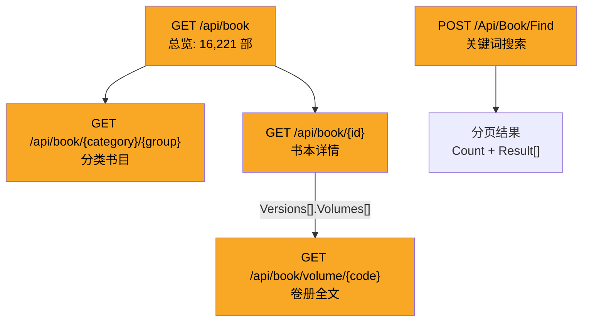

#### 端点 6：古籍总览 `GET /api/book`

```json
// GET /api/book → HTTP 200
{
  "Total": 16221,
  "Categories": [
    {
      "Name": "经部",
      "Groups": [
        {"Name": "礼类", "Count": 255},
        {"Name": "群经总义类", "Count": 56},
        {"Name": "乐类", "Count": 22},
        ...  // 共 15 groups
      ]
    },
    {
      "Name": "史部", "Groups": [
        {"Name": "政书类", "Count": 239},
        {"Name": "编年类", "Count": 100},
        ...  // 共 25 groups
      ]
    },
    {"Name": "子部", "Groups": [...]},   // 21 groups, 含医家类(366)
    {"Name": "集部", "Groups": [...]},   // 11 groups, 含别集类(3492)
    {"Name": "佛部", "Groups": [...]},   // 22 groups, 含禅宗部类(603)
    {"Name": "道部", "Groups": [...]}    // 9 groups, 含洞神部(367)
  ]
}
```

**六部分类**：

| 部      | 子类数     | 最大子类           | 书目数        |
| ------ | ------- | -------------- | ---------- |
| 经部     | 15      | 礼类(255)        | —          |
| 史部     | 25      | 政书类(239)       | —          |
| 子部     | 21      | 医家类(366)       | —          |
| 集部     | 11      | **别集类(3,492)** | —          |
| 佛部     | 22      | **禅宗部类(603)**  | —          |
| 道部     | 9       | 洞神部(367)       | —          |
| **合计** | **103** | —              | **16,221** |

#### 端点 7：分类书目 `GET /api/book/{category}/{group}`

```json
// GET /api/book/集部/别集类 → HTTP 200
{
  "Category": "集部",
  "Group": "别集类",
  "Books": [
    {"Id": 14889, "Name": "梦苕盦诗文集",  "Author": "钱仲联",   "AuthorIds": [...], "Dynasty": "当代",   "Versions": null},
    {"Id": 14479, "Name": "剑花室诗集",    "Author": "连横",     "AuthorIds": [...], "Dynasty": "近现代", "Versions": null},
    {"Id": 7268,  "Name": "静庵文集",      "Author": "王国维撰", "AuthorIds": [...], "Dynasty": "近现代", "Versions": null},
    ...  // 共 3,492 部
  ]
}
```

#### 端点 8：书本详情 `GET /api/book/{id}`

```json
// GET /api/book/2180 → HTTP 200
{
  "Book": {
    "Id": 2180,
    "Name": "史记",
    "Author": "司马迁",
    "AuthorIds": [3157],
    "Dynasty": "汉",
    "Versions": [
      {
        "Type": "image",
        "From": "archive.org",
        "Comment": "本书130卷，拆分成46册。",
        "Volumes": [
          {"Name": "目录",    "Url": "https://c.cnkgraph.com/eBooks/四库/史记%20汉%20司马迁/目錄.pdf"},
          {"Name": "卷一~卷二", "Url": "https://c.cnkgraph.com/eBooks/四库/史记%20汉%20司马迁/卷一~卷二.pdf"},
          ...  // 46 册 PDF
        ]
      },
      {
        "Type": "text",
        "From": "kanripo.org",
        "Comment": null,
        "Volumes": [
          {"Name": "1.1 〈五帝本纪〉第一", "Url": "/Book/Volume/KR2a0001_100"},
          {"Name": "1.2 〈夏本纪〉第二",   "Url": "/Book/Volume/KR2a0001_101"},
          ...  // 130 卷文本
        ]
      }
    ]
  }
}
```

一本书可以有多个版本（image 扫描版 + text 数字版），每个版本包含多卷/册。Version 的 `Url` 可能是外部 PDF 链接（image 版）或内部 API 路径（text 版，需拼接 `/api/book/volume/{code}`）。

#### 端点 9：卷册全文 `GET /api/book/volume/{volumeId}`

```json
// GET /api/book/volume/KR4h0140_024 → HTTP 200
{
  "VolumeId": "KR4h0140_024",
  "Text": "# -*- mode: mandoku-view; -*-\n#+TITLE: 御定全唐诗\n#+DATE: 2015-08-25 00:40:37\n...钦定四库全书\n御定全唐诗卷二十四\n杂曲歌辞\n秦女休行(李白/)\n西门秦氏女秀色如琼花手挥白杨刀清昼杀雠家罗...",
  "Html": "...(HTML 格式版本, 33K chars)..."
}
```

| 字段         | 说明                                               |
| ---------- | ------------------------------------------------ |
| `VolumeId` | 卷册 ID（格式如 `KR{code}_{number}`，来自 kanripo.org 编码） |
| `Text`     | 纯文本版本（mandoku-view 格式，含 org-mode 标记）             |
| `Html`     | HTML 格式版本（含排版标记）                                 |

> Text 字段使用 mandoku-view 格式（类似 Emacs org-mode），以 `#+TITLE`、`#+PROPERTY` 等标记开头，正文每行前有空格缩进。平均每卷 \~10K 字符。

#### 端点 10：关键词搜索 `POST /Api/Book/Find`

> 注意：路径是 PascalCase `/Api/Book/Find`，与其他端点的小写风格不同。

```json
// POST /Api/Book/Find  body: {"key":"黄鹤楼","pageNo":1} → HTTP 200
{
  "Count": 5853,
  "PageSize": 100,
  "Key": "黄鹤楼",
  "PageNo": 1,
  "Notification": null,
  "Summary": null,
  "Result": [
    {
      "Category": "维基 类书类",
      "Books": [
        {
          "Book": "钦定古今图书集成.方舆汇编.职方典",
          "BookId": "KR7a0006",
          "Volumes": [
            {
              "Volume": "卷一一八六",
              "VolumeId": "KR7a0006_1186",
              "Pages": [
                {
                  "Page": null,
                  "PreviousText": "夜抵南岸，拔之，夏贵溃。",
                  "MatchedText": "黄鹤楼",
                  "LaterText": "，为汉兵袭破，率其戏下十馀骑..."
                }
              ]
            }
          ]
        }
      ]
    }
  ],
  "Error": null
}
```

搜索结果以**上下文片段**形式返回：`PreviousText` + `MatchedText` + `LaterText`，可精确定位关键词在古籍中的位置。支持分页（`PageSize=100`）、通配符（`"黄鹤？楼"`）、多关键词（`"黄鹤楼 鹦鹉洲"`）。

***

### 4.3 类书（6 端点，8 部）

Postman 文件：`postman/类书.postman_collection.json`

数据层次：**列表 → 目录树 → 条目详情**。

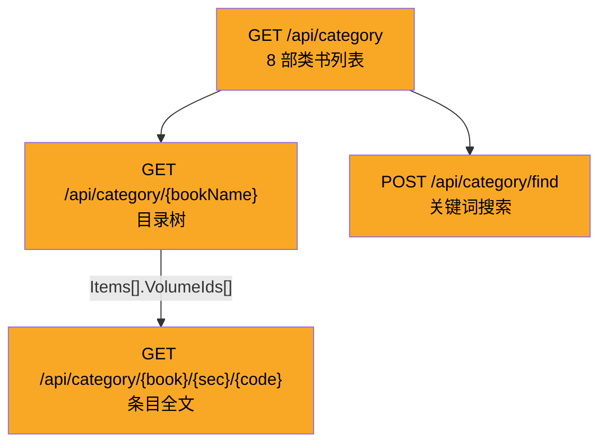

#### 端点 11：类书列表 `GET /api/category`

```json
// GET /api/category → HTTP 200
{
  "Books": [
    "钦定古今图书集成",
    "渊鉴类函",
    "佩文斋咏物诗选",
    "艺文类聚",
    "广群芳谱",
    "骈字类编",
    "分类字锦",
    "方舆胜览"
  ]
}
```

#### 端点 12：类书目录树 `GET /api/category/{bookName}`

```json
// GET /api/category/钦定古今图书集成 → HTTP 200
{
  "Book": "钦定古今图书集成",
  "Categories": [
    {
      "Name": "历象汇编·乾象典",
      "Items": [
        {"Id": "0000", "Name": "天地总", "Alias": null, "Note": null, "VolumeIds": [
          {"Id": "KR7a0001_001", "Name": "卷一"}, ...  // 8 volumes
        ]},
        {"Id": "0001", "Name": "天", "VolumeIds": [...]},  // 6 volumes
        ...  // 21 items
      ]
    },
    {"Name": "历象汇编·岁功典", "Items": [...]},  // 43 items
    {"Name": "历象汇编·历法典", "Items": [...]},  // 6 items
    ...  // 共 32 个 Categories
  ]
}
```

**钦定古今图书集成** 是最大的类书：32 个一级分类（汇编×典），每个分类下有若干条目，每个条目含多卷。

#### 端点 13：条目卷册全文 `GET /api/category/{bookName}/{section}/{code}`

```json
// GET /api/category/钦定古今图书集成/0002/KR7a0001_018 → HTTP 200
{
  "Id": "0002",
  "Name": "阴阳",
  "Alias": null,
  "Note": null,
  "VolumeIds": [...],  // 4 个卷
  "Content": {
    "Volume": {
      "VolumeId": "KR7a0001_018",
      "Text": "钦定古今图书集成历象汇编乾象典\n第十八卷目录\n阴阳部杂录二\n阴阳部外编\n乾象典第十八卷\n阴阳部杂录二\n《汉书·律历志》：律十有二，阳六为律，阴六为吕...",
      "Html": "..."
    }
  },
  "ImageUrls": [...]
}
```

***

### 4.4 字典（1 端点）

Postman 文件：`postman/字典.postman_collection.json`

一次查询返回**三部字典**的完整数据：现代汉语词典 + 康熙字典 + 说文解字。

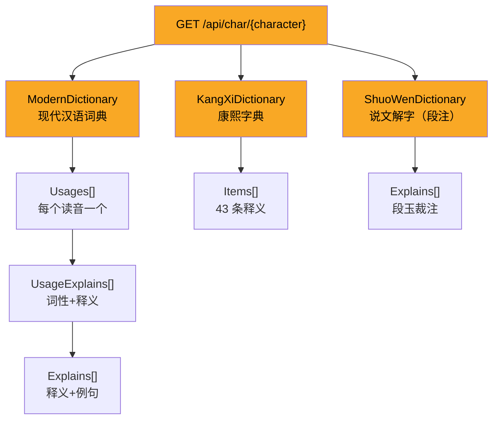

#### 端点 14：查字 `GET /api/char/{character}`

```json
// GET /api/char/中 → HTTP 200
{
  "ModernDictionary": [
    {
      "Value": "中",
      "Advance": {
        "Usages": [
          {
            "Spell": "zhōng",
            "Rhymes": "东",
            "UsageExplains": [
              {
                "Rhymes": null,
                "Traditional": null,
                "WordClass": "〈名〉",
                "Explains": [
                  {
                    "Explain": "(指事。甲骨文字形,中象旗杆,上下有旌旗和飘带,旗杆正中竖立。本义:中心;当中...)",
                    "Examples": null
                  },
                  ...  // 共 19 条名词释义
                ]
              }
            ]
          },
          {
            "Spell": "zhòng",
            "Rhymes": "送",
            "UsageExplains": [
              {
                "WordClass": "〈动〉",
                "Explains": [
                  {
                    "Explain": "正对上;射中,正着目标",
                    "Examples": [
                      "中其茎。——《考工记·桃氏》。",
                      "敌中则夺。——《荀子·彊国》。"
                    ]
                  },
                  ...  // 共 12 条动词释义
                ]
              }
            ]
          }
        ]
      },
      "Standard": { "Usages": [...] }
    }
  ],

  "KangXiDictionary": [
    {
      "ReferChars": [...],
      "AncientChars": [...],
      "Category": "【子集上】【丨字部】中",
      "TotalStroke": 4,
      "StrokeExceptCategory": 3,
      "Character": "中",
      "Items": [...]  // 43 条释义
    }
  ],

  "ShuoWenDictionary": [
    {
      "Character": "中",
      "AncientChars": [...],
      "MarkupPics": [...],
      "Explains": [
        {
          "Book": "清代 段玉裁《說文解字注》",
          "Content": "內也。俗本和也。非是。當作內也。...从口丨。下上通也。...古文中。",
          "IsComment": false,
          "ReferrenceUrls": null,
          "FullPath": "清代 段玉裁《說文解字注》"
        }
      ]
    }
  ]
}
```

**字典对比**：

| 维度   | 现代汉语词典            | 康熙字典 | 说文解字       |
| ---- | ----------------- | ---- | ---------- |
| 注音方式 | 拼音 (zhōng)        | 反切   | 直音/反切      |
| 释义数量 | \~31 条 (多音多义)     | 43 条 | 1 条 (本义+注) |
| 结构深度 | 读音 → 词性 → 释义 → 例句 | 扁平列表 | 注解文本       |
| 特色   | 现代用法、Examples     | 古义为主 | 字源、字形分析    |

***

### 4.5 工具（5 端点，1 个 404）

Postman 文件：`postman/工具.postman_collection.json`

工具类 API 为**实时处理型**，输入文本→输出结果，不适合批量爬取存储，但在数据分析流程中可按需调用。

#### 端点 15：简繁转换 `POST /api/tool/charsetConvert`

```json
// POST /api/tool/charsetConvert  body: {"content":"白发惊看镜里秋","mode":"ToTraditional"} → HTTP 200
{
  "ConvertedContent": [
    {"ConvertedChars": "白", "Options": null},
    {"ConvertedChars": "發", "Options": ["發", "髮"]},
    {"ConvertedChars": "驚看鏡", "Options": null},
    {"ConvertedChars": "里", "Options": ["里", "裏裡"]},
    {"ConvertedChars": "秋", "Options": null}
  ],
  "CharOptionExplanations": [
    {
      "Character": "發",
      "Explanation": "<span class='book'>發</span> 交付、送出、...
                       <span class='book'>髮</span> 頭髮、毛髮..."
    },
    ...
  ]
}
```

特色：对**一对多**的简繁转换（如"发"→"發"/"髮"）给出所有候选，并附带每个候选的释义说明。

#### 端点 16：出处与化用分析 `POST /api/tool/reference`

```json
// POST /api/tool/reference  body: {"content":"柯蚁营营斗不休...登高满插菊花返..."} → HTTP 200
{
  "Message": "没有句子匹配到引用"   // 若无匹配
}
```

匹配成功时返回引用关系分析（哪句化用了哪首古诗）。

#### 端点 17：短信息查询 `POST /api/tool/texting`

```json
// POST /api/tool/texting  body: {"content":"乾隆三年正月甲子，乾隆帝诣雍和宫"} → HTTP 200
{
  "Html": "【人物】\n<a href='https://cnkgraph.com/People/60041'>乾隆帝</a> 清朝 1711 — 1799...\n【景点】\n<a href='https://cnkgraph.com/Map/36'>雍和宫</a>\n【年历】\n..."
}
```

输入任意文本，自动识别人物、地名、年号等实体，返回带标注链接的 HTML。

#### 端点 18：自动笺注 `POST /api/tool/labelize` — **404**

该端点返回 HTTP 404，可能已下线或路径变更。Postman 中记录的路径为 `/api/tool/labelize`。

***

### 4.6 数据量全景汇总

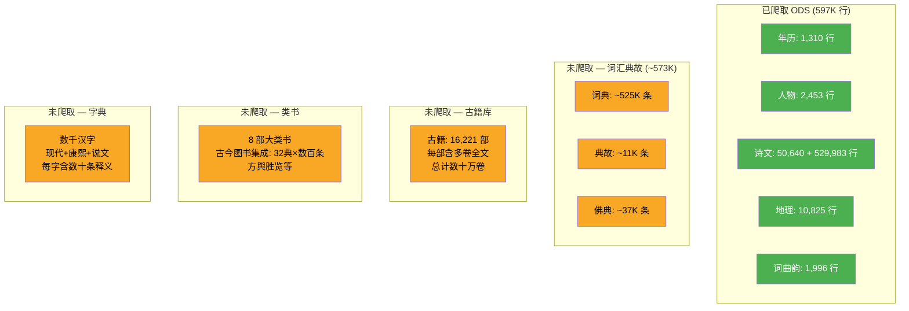

**Postman 集合 vs 实测端点对照**：

| Postman 文件                      | 端点数    | 实测可用      | 特殊情况                        |
| ------------------------------- | ------ | --------- | --------------------------- |
| `词汇、典故.postman_collection.json` | 5      | 5/5 ✅     | —                           |
| `古籍库.postman_collection.json`   | 7      | 7/7 ✅     | `/Api/Book/Find` PascalCase |
| `类书.postman_collection.json`    | 6      | 6/6 ✅     | —                           |
| `工具.postman_collection.json`    | 5      | 4/5 ✅     | `/api/tool/labelize` 404    |
| `字典.postman_collection.json`    | 1      | 1/1 ✅     | —                           |
| **合计**                          | **24** | **23/24** | —                           |

***

## 5. 根因分析与经验总结

### 5.1 为什么会误判

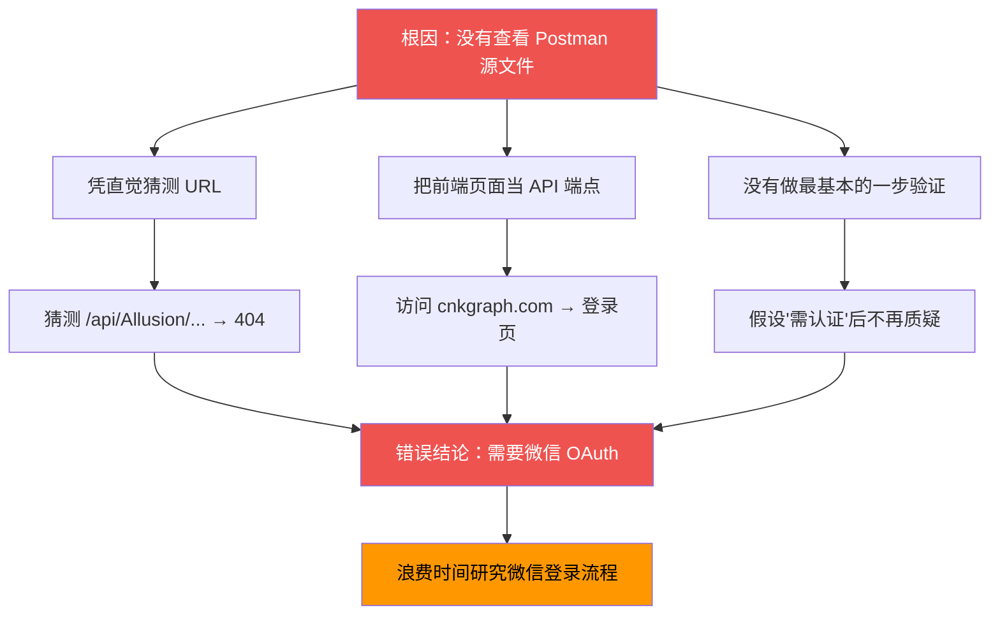

### 5.2 经验教训

| # | 教训               | 详细说明                                                                 |
| - | ---------------- | -------------------------------------------------------------------- |
| 1 | **先读文档，再动手**     | Postman 集合就在 `postman/` 目录，里面有精确的 URL、方法、body。应先提取再测试。               |
| 2 | **区分前端和 API**    | `cnkgraph.com`（前端）的登录要求不等于 `api.cnkgraph.com`（API）的认证要求。             |
| 3 | **不要过早下结论**      | 第一次测试全部失败后，应怀疑自己的 URL 是否正确，而不是立即认定需要认证。                              |
| 4 | **用正确工具测试**      | Windows 上 curl 对中文编码有问题，用 Python requests 可避免编码干扰判断。                 |
| 5 | **注意 API 内部不一致** | 同一套 API 中，`/api/book/...` 是小写但 `/Api/Book/Find` 是 PascalCase，需要逐个核对。 |

### 5.3 如果要爬取这些数据

基于探查结果，爬取方案的初步评估：

| API      | 记录数       | 请求量          | 预估耗时            | 难度        |
| -------- | --------- | ------------ | --------------- | --------- |
| 词典       | \~525K    | \~525K 次 GET | \~7h (20 req/s) | 中         |
| 典故       | \~11K     | \~11K 次 GET  | \~10 min        | 低         |
| 佛典       | \~37K     | \~37K 次 GET  | \~30 min        | 低         |
| 古籍库 (书目) | 16K       | \~16K 次 GET  | \~15 min        | 低         |
| 古籍库 (全文) | 数十万卷      | 数十万次 GET     | 数天              | 高（数据量极大）  |
| 类书       | 8 部 × 数百条 | \~1K 次 GET   | \~5 min         | 低         |
| 字典       | 数千字       | \~数K 次 GET   | \~10 min        | 低（需确定字符集） |

***

## 6. 附录：测试命令参考

```bash
# Python 测试模板（Windows 推荐）
python -c "
import requests, json, sys
sys.stdout.reconfigure(encoding='utf-8')
r = requests.get('https://api.cnkgraph.com/api/glossary/词典/10', timeout=10)
print(f'Status: {r.status_code}')
print(json.dumps(r.json(), ensure_ascii=False, indent=2)[:500])
"

# 二分法探查最大 ID
python -c "
import requests, sys
sys.stdout.reconfigure(encoding='utf-8')
def check(id):
    r = requests.get(f'https://api.cnkgraph.com/api/glossary/词典/{id}', timeout=10)
    data = r.json()
    return '未找到' not in data.get('Message', '')

lo, hi = 100000, 600000
while hi - lo > 1000:
    mid = (lo + hi) // 2
    lo, hi = (mid, hi) if check(mid) else (lo, mid)
print(f'Max ID: {lo}-{hi}')
"
```

