# cnkgraph API 全量 ER 图 — 12 集合 / 71 端点 / 30+ 数据实体

> 完整绘制 cnkgraph 12 个 Postman 集合的 API 返回实体及其关联关系。标注已爬取 / 补充爬取中 / 未爬取状态，识别跨集合断裂的关联。

***

## 1. 总览 ER 图

cnkgraph 的 12 个 API 集合可归纳为 **7 大数据域**，核心围绕 `person → writing` 主轴展开，年历、地理、韵律作为维度数据关联。

```mermaid
erDiagram
    %% ===== 年历域 =====
    CALENDAR ||--o{ DYNASTY : "总览→朝代列表"
    DYNASTY ||--o{ ERA_YEAR : "1:N 年号"
    ERA_YEAR ||--o| GANZHI_YEAR : "年号→干支"
    DATE_LOOKUP ||--o| CALENDAR_LINK : "日期→关联链接"

    %% ===== 人物域 =====
    PEOPLE_LIST ||--o{ PERSON : "朝代→人物列表"
    PERSON ||--o{ PERSON_ALIAS : "1:N 别名字号"
    PERSON ||--o{ PERSON_DETAIL : "1:N 传记"
    PERSON ||--o{ PERSON_HOMETOWN : "1:N 籍贯"
    PEOPLE_FIND }o--|| PERSON : "搜索→人物"

    %% ===== 作品域 =====
    WRITING_LIST ||--o{ WRITING : "按作者/朝代→作品列表"
    PERSON ||--o{ WRITING : "1:N 作品"
    WRITING ||--o{ WRITING_CLAUSE : "1:N 诗句"
    WRITING ||--o{ WRITING_COMMENT : "1:N 评注"
    WRITING ||--o{ WRITING_ALLUSION : "1:N 用典"
    WRITING ||--o| WRITING_TONES : "平仄标注"
    WRITING ||--o| WRITING_BOOK_LINKS : "古籍出处"
    WRITING ||--o| WRITING_LABELIZE : "自动笺注"
    WRITING_FIND }o--|| WRITING : "搜索→作品"
    COUPLET_FIND }o--|| WRITING_CLAUSE : "对仗→律句"
    SIMILAR_FIND }o--|| WRITING_CLAUSE : "相似句→作品"

    %% ===== 地理域 =====
    REGION_LIST ||--o{ REGION : "总览→区域列表"
    REGION ||--o{ REGION : "parent_id 自引用"
    REGION ||--o{ REGION_HISTORY : "1:N 历史沿革"
    REGION ||--o{ SCENERY : "1:N 景观"
    SCENERY ||--o| SCENERY_LINK : "景观→关联链接"
    REGION ||--o| REGION_LINK : "区域→关联链接"
    PERSON_HOMETOWN }o--|| REGION : "籍贯→区域"

    %% ===== 韵律域 =====
    RHYME_BOOK ||--o{ RHYME_CATEGORY : "韵书→韵目"
    RHYME_CATEGORY ||--o{ RHYME_CHAR : "韵目→韵字"
    RHYME_FIND }o--|| RHYME_CHAR : "查字→韵字"

    CI_TUNE_LIST ||--o{ CI_TUNE : "词牌总览"
    CI_TUNE ||--o{ WRITING : "1:N 使用该词牌的词作"
    CI_TUNE_PATTERN }o--|| CI_TUNE : "平仄匹配→词牌"

    QU_TUNE_LIST ||--o{ QU_TUNE : "曲牌总览"
    QU_TUNE ||--o{ WRITING : "1:N 使用该曲牌的曲作"

    %% ===== 词汇典故域 =====
    GLOSSARY_DICT ||--o{ GLOSSARY_ENTRY : "词典→词条"
    GLOSSARY_ALLUSION ||--o{ GLOSSARY_ENTRY : "典故→词条"
    GLOSSARY_BUDDHIST ||--o{ GLOSSARY_ENTRY : "佛典→词条"
    GLOSSARY_FIND }o--|| GLOSSARY_ENTRY : "搜索→典故"
    WRITING_ALLUSION }o--|| GLOSSARY_ENTRY : "用典→典故词条"

    %% ===== 古籍库域 =====
    BOOK_LIST ||--o{ BOOK_CATEGORY : "总览→分类"
    BOOK_CATEGORY ||--o{ BOOK : "分类→书目"
    BOOK ||--o{ BOOK_VERSION : "1:N 版本"
    BOOK_VERSION ||--o{ BOOK_VOLUME : "1:N 卷册"
    BOOK_FIND }o--|| BOOK_VOLUME : "搜索→卷册"
    WRITING_BOOK_LINKS }o--|| BOOK_VOLUME : "作品出处→卷册"

    %% ===== 类书域 =====
    CATEGORY_LIST ||--o{ CATEGORY_BOOK : "总览→类书"
    CATEGORY_BOOK ||--o{ CATEGORY_ITEM : "1:N 条目"
    CATEGORY_ITEM ||--o| CATEGORY_CONTENT : "条目→卷册内容"
    CATEGORY_FIND }o--|| CATEGORY_ITEM : "搜索→条目"

    %% ===== 字典域 =====
    CHAR_LOOKUP ||--o| CHAR_DICT : "查字→字条"
    CHAR_DICT ||--o| MODERN_DICT : "现代汉语"
    CHAR_DICT ||--o| KANGXI_DICT : "康熙字典"
    CHAR_DICT ||--o| SHUOWEN_DICT : "说文解字"
```

***

## 2. 跨集合关联与断裂点

### 2.1 完整的关联链

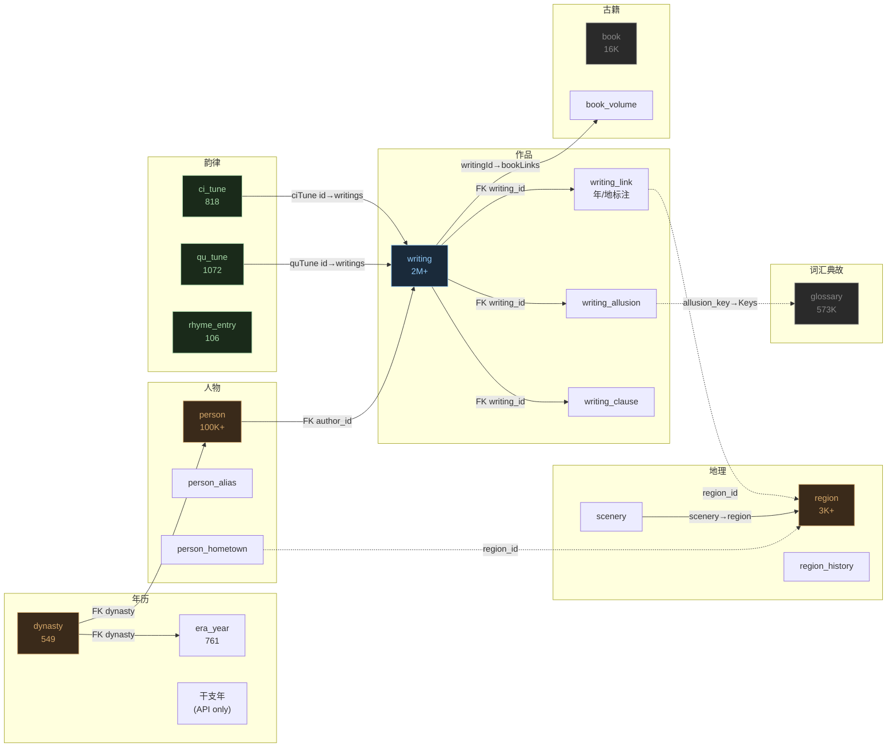

### 2.2 已识别的断裂关联

| # | 断裂点            | 说明                                                                                                                                  | 影响                                          |
| - | -------------- | ----------------------------------------------------------------------------------------------------------------------------------- | ------------------------------------------- |
| 1 | **年号 → 干支年**   | `era_year` 表只存年号（如"开元"），不存干支（如"庚子"）。`/api/calendar/GanZhi/{ganzhi}` 是独立端点                                                           | 无法从 era\_year 直接关联到干支                       |
| 2 | **年号 → 具体日期**  | `/api/calendar/date/{dateStr}` 返回某一天的完整信息，但未爬取                                                                                      | 无法精确到"天"级时间线                                |
| 3 | **作品 → 年份/地点** | `writing.author_date_raw` 是文本，`writing_link` 中有 `year`/`region_id` 但解析不完整                                                           | 部分作品时空标注缺失                                  |
| 4 | **用典 → 典故词条**  | `writing_allusion.allusion_key` 是关键词文本，`supplement_glossary` 的 `keys` 字段也是文本数组                                                      | 需要做模糊匹配，无外键直连                               |
| 5 | **人物 → 古籍**    | `supplement_book.author_ids` 包含人物 ID 数组，但原 `person` 表没有反向关联                                                                         | 人物详情中缺失"著作"维度                               |
| 6 | **地理 → 类书条目**  | `方舆胜览` 是地理类书，其条目与 `region` 表可能有地理关联                                                                                                 | 类书条目按 book\_name:item\_id 组织，region\_id 未暴露 |
| 7 | **韵字 → 作品押韵**  | `writing.rhyme` 和 `writing.first_clause_rhyme` 是韵部名文本，可关联 `rhyme_entry.name`，但 `writing_clause.rhyme_char` 是单字，需走 `rhyme_char` 才能关联 | 押韵分析需要多跳关联                                  |
| 8 | **词牌/曲牌 → 作品** | API 端点 `/api/ciTune/{id}/writings` 和 `/api/quTune/{id}/writings` 返回使用该曲牌的作品列表，但 `writing` 表中无 `ci_tune_id` / `qu_tune_id` 字段        | 需要通过 API 实时查询或反向匹配                          |
| 9 | **景观 → 作品**    | `/api/map/scenery/{id}/{name}/links` 返回与景观相关的作品链接，但本地无此数据                                                                           | 地理-作品的关联链断裂                                 |

***

## 3. 逐集合详细 ER 图

### 3.1 年历集合（7 端点）

**Postman 文件**：`年历.postman_collection.json`

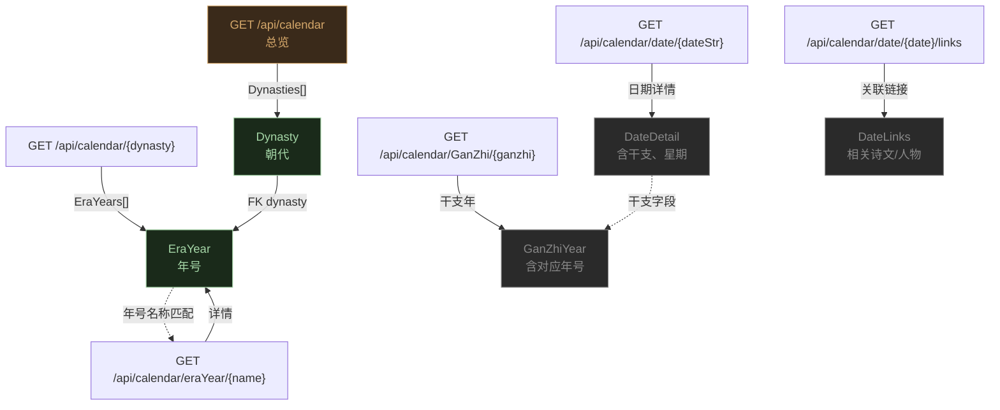

**端点清单**：

| 端点                                | 方法  | 说明                 | 爬取状态            |
| --------------------------------- | --- | ------------------ | --------------- |
| `/api/calendar`                   | GET | 朝代总览               | ✅ ODS dynasty   |
| `/api/calendar/{dynasty}`         | GET | 某朝代年号列表            | ✅ ODS era\_year |
| `/api/calendar/eraYear/{eraName}` | GET | 年号详情（如"宋绍兴"）       | ❌ 未爬取           |
| `/api/calendar/date/{dateStr}`    | GET | 某年/某日详情            | ❌ 未爬取           |
| `/api/calendar/date/{dateStr}`    | GET | 完整日期（如"宋绍兴五年七月丁酉"） | ❌ 未爬取           |
| `/api/calendar/GanZhi/{ganzhi}`   | GET | 干支年（如"庚子"）         | ❌ 未爬取           |
| `/api/calendar/date/{date}/links` | GET | 时间关联链接             | ❌ 未爬取           |

**API 返回示例**：

`GET /api/calendar`：

```json
{
  "Dynasties": [
    {"Name": "夏朝", "BeginYear": -2029, "EndYear": -1559},
    {"Name": "唐朝", "BeginYear": 618, "EndYear": 907}
  ]
}
```

`GET /api/calendar/唐朝`：

```json
{
  "EraYears": [
    {"Name": "开元", "Dynasty": "唐朝", "BeginYear": 713, "EndYear": 741},
    {"Name": "贞观", "Dynasty": "唐朝", "BeginYear": 627, "EndYear": 649}
  ]
}
```

**断裂点**：`EraYear` 与 `GanZhiYear` 之间无直接外键。`/api/calendar/eraYear/宋绍兴` 返回的详情中包含干支信息，但列表接口不返回。需要逐条调 eraYear 详情才能补全干支映射。

***

### 3.2 人物集合（6 端点）

**Postman 文件**：`人物.postman_collection.json`

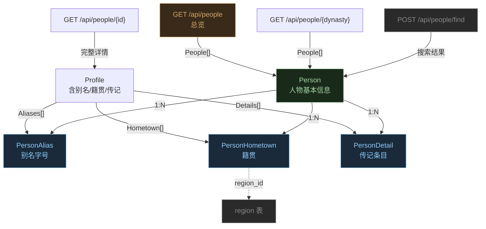

**端点清单**：

| 端点                      | 方法   | 说明              | 爬取状态               |
| ----------------------- | ---- | --------------- | ------------------ |
| `/api/people`           | GET  | 人物总览            | ❌ 未爬取（全量走 dynasty） |
| `/api/people/{dynasty}` | GET  | 按朝代浏览           | ✅ ODS person       |
| `/api/people/{id}`      | GET  | 人物详情（含别名/籍贯/传记） | ✅ ODS person + 子表  |
| `POST /api/people/find` | POST | 按籍贯搜索           | ❌ 未爬取              |
| `POST /api/people/find` | POST | 按姓氏搜索           | ❌ 未爬取              |
| `POST /api/people/find` | POST | 按谥号搜索           | ❌ 未爬取              |

**API 返回示例**：

`GET /api/people/15188`（李白）：

```json
{
  "Person": {
    "Id": 15188,
    "Name": "李白",
    "Surname": "李",
    "Dynasty": "盛唐"
  },
  "Profile": {
    "BirthYear": "701",
    "DeathYear": "762",
    "BirthDay": null,
    "DeathDay": null,
    "Aliases": [
      {"Name": "太白", "Type": "Zi", "Source": null},
      {"Name": "青莲居士", "Type": "Hao", "Source": null},
      {"Name": "谪仙人", "Type": "FamousName", "Source": null}
    ],
    "Hometown": [
      {"RegionId": "CN510782", "Name": "绵州昌隆(今四川江油)"}
    ]
  },
  "Details": [
    {"Book": "中国历代人名大辞典", "Content": "唐...人，字太白...", "IsReview": false},
    {"Book": "唐诗大辞典", "Content": "...", "IsReview": false}
  ]
}
```

**关联说明**：

- `PersonHometown.region_id` → `region.id`（跨集合关联，已实现）
- `Person` ← `Writing.author_id`（主轴关联，已实现）

***

### 3.3 诗文库集合（13 端点）

**Postman 文件**：`诗文库.postman_collection.json`

这是最大的集合，13 个端点覆盖作品的增、查、搜、标注全流程。

```mermaid
graph TD
    WL["GET /api/writing<br/>总览"] --> |"Dynasties[]"| DY["朝代列表"]
    WD["GET /api/writing/{dynasty}"] --> |"Authors[]"| AU["作者列表"]
    WA["GET /api/writing/{dynasty}/{name}/{id}/{type}?pageNo=N"] --> |"Writings[]"| W["Writing<br/>作品主表"]
    WI["GET /api/writing/{id}"] --> |"单篇详情"| W
    W --> |"Clauses[]"| WC["WritingClause<br/>诗句"]
    W --> |"Comments[]"| WCM["WritingComment<br/>评注"]
    W --> |"Allusions[]"| WAL["WritingAllusion<br/>用典"]

    WT["GET /api/writing/{id}/tones"] --> |"平仄标注"| WTN["ToneResult"]
    WB["GET /api/writing/{id}/bookLinks"] --> |"古籍出处"| WBL["BookLink[]"]
    WLZ["GET /api/writing/{id}/labelize"] --> |"自动笺注"| WLB["LabelResult"]

    WF["POST /api/writing/find"] --> |"搜索结果"| W
    CP["GET /api/writing/couplet/{words}"] --> |"对仗律句"| CPR["CoupletResult"]
    SC["GET /api/writing/SimilarClauses/{key}"] --> |"相似句"| SCR["SimilarResult"]
    SR["GET /api/writing/SameRhymes/{key}"] --> |"同韵作品"| SRR["RhymeResult"]

    style WL fill:#3a2a1a,stroke:#d4a76a,color:#d4a76a
    style W fill:#1a2a1a,stroke:#a5d6a7,color:#a5d6a7
    style WC fill:#1a2a3a,stroke:#90caf9,color:#90caf9
    style WCM fill:#1a2a3a,stroke:#90caf9,color:#90caf9
    style WAL fill:#1a2a3a,stroke:#90caf9,color:#90caf9
    style WT fill:#2a2a2a,stroke:#888,color:#888
    style WB fill:#2a2a2a,stroke:#888,color:#888
    style WLZ fill:#2a2a2a,stroke:#888,color:#888
    style WF fill:#2a2a2a,stroke:#888,color:#888
    style CP fill:#2a2a2a,stroke:#888,color:#888
    style SC fill:#2a2a2a,stroke:#888,color:#888
    style SR fill:#2a2a2a,stroke:#888,color:#888
```

**端点清单**：

| 端点                                                   | 方法   | 说明        | 爬取状态  |
| ---------------------------------------------------- | ---- | --------- | ----- |
| `/api/writing`                                       | GET  | 总览（朝代列表）  | ❌     |
| `/api/writing/{dynasty}`                             | GET  | 按朝代浏览     | ❌     |
| `/api/writing/{dynasty}/{name}/{id}/{type}?pageNo=N` | GET  | 按作者分页获取作品 | ✅ ODS |
| `/api/writing/{id}`                                  | GET  | 单篇详情      | ❌     |
| `/api/writing/{id}` (zh-hant)                        | GET  | 繁体版本      | ❌     |
| `/api/writing/couplet/{words}`                       | GET  | 对仗词汇查询    | ❌     |
| `POST /api/writing/find`                             | GET  | 组合搜索      | ❌     |
| `/api/writing/SimilarClauses/{key}`                  | GET  | 相似句搜索     | ❌     |
| `/api/writing/SameRhymes/{key}`                      | GET  | 同韵作品      | ❌     |
| `/api/writing/{id}/tones`                            | GET  | 平仄标注      | ❌     |
| `/api/writing/{id}/bookLinks`                        | GET  | 古籍出处      | ❌     |
| `/api/writing/{id}/labelize`                         | GET  | 自动笺注      | ❌     |
| `POST /api/writing/find`                             | POST | 平仄句式搜索    | ❌     |

**API 返回示例**：

`GET /api/writing/10000`：

```json
{
  "Id": 10000,
  "AuthorId": 17270,
  "AuthorName": "杜甫",
  "Title": "登高",
  "Dynasty": "盛唐",
  "WritingType": "律诗",
  "TypeDetail": "QiLv",
  "Rhyme": "灰",
  "Clauses": [
    {"Idx": 0, "Content": "风急天高猿啸哀，", "RhymeChar": "哀"},
    {"Idx": 1, "Content": "渚清沙白鸟飞回。", "RhymeChar": "回"},
    {"Idx": 2, "Content": "无边落木萧萧下，"},
    {"Idx": 3, "Content": "不尽长江滚滚来。", "RhymeChar": "来"},
    {"Idx": 4, "Content": "万里悲秋常作客，"},
    {"Idx": 5, "Content": "百年多病独登台。", "RhymeChar": "台"},
    {"Idx": 6, "Content": "艰难苦恨繁霜鬓，"},
    {"Idx": 7, "Content": "潦倒新停浊酒杯。", "RhymeChar": "杯"}
  ],
  "Comments": [...],
  "Allusions": [...]
}
```

**关键关联**：

- `Writing.author_id` → `Person.id`（已实现）
- `WritingAllusion.allusion_key` ↔ `GlossaryEntry.Keys`（文本匹配，需模糊关联）
- `BookLink.volume_id` → `BookVolume.volume_id`（跨集合，未爬取 bookLinks）

***

### 3.4 地理集合（7 端点）

**Postman 文件**：`地理.postman_collection.json`

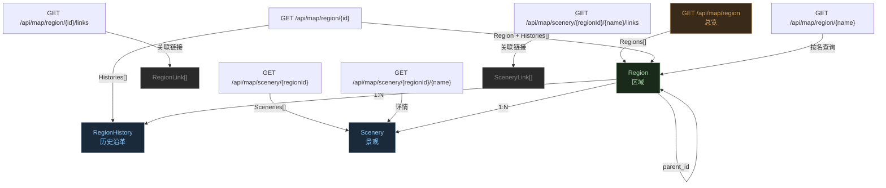

**端点清单**：

| 端点                                         | 方法  | 说明            | 爬取状态                  |
| ------------------------------------------ | --- | ------------- | --------------------- |
| `/api/map/region`                          | GET | 行政区划总览        | ✅ ODS region          |
| `/api/map/region/{regionId}`               | GET | 按 ID 查区域 + 历史 | ✅ ODS region\_history |
| `/api/map/region/{regionName}`             | GET | 按名称查区域        | ❌                     |
| `/api/map/region/{regionId}/links`         | GET | 区域关联链接        | ❌                     |
| `/api/map/scenery/{regionId}`              | GET | 区域下景观列表       | ❌                     |
| `/api/map/scenery/{regionId}/{name}`       | GET | 景观详情          | ❌                     |
| `/api/map/scenery/{regionId}/{name}/links` | GET | 景观关联链接        | ❌                     |

**API 返回示例**：

`GET /api/map/region/CN11`：

```json
{
  "Region": {
    "Id": "CN11", "Name": "北京市", "Latitude": 39.9, "Longitude": 116.4,
    "ParentId": "CN1", "PeopleCount": 15, "HasChild": true
  },
  "Histories": [
    {"Name": "大都", "NewName": "北京市", "Type": "郡", "BeginYear": 1267, "EndYear": 1368},
    {"Name": "京师", "NewName": "北京市", "Type": "州", "BeginYear": 1280, "EndYear": 1367}
  ]
}
```

**断裂点**：

- `Scenery` 表未爬取 — API 返回的景观数据（如黄鹤楼、西湖）无法与 `Writing` 关联
- `SceneryLink` 中可能包含相关诗文，是地理→作品的重要关联链

***

### 3.5 韵典集合（5 端点）

**Postman 文件**：`韵典.postman_collection.json`

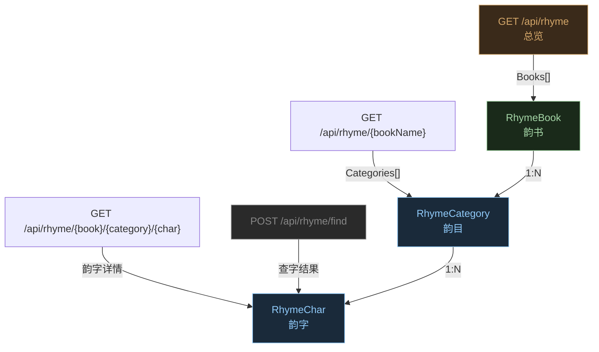

**端点清单**：

| 端点                                        | 方法   | 说明       | 爬取状态                     |
| ----------------------------------------- | ---- | -------- | ------------------------ |
| `/api/rhyme`                              | GET  | 韵书总览     | ✅ ODS rhyme\_entry（取平水韵） |
| `/api/rhyme/{bookName}`                   | GET  | 某韵书的韵目   | ✅ ODS rhyme\_entry       |
| `/api/rhyme/{bookName}/{category}`        | GET  | 某韵目字表    | ❌ 未爬取                    |
| `/api/rhyme/{bookName}/{category}/{char}` | GET  | 韵字详情     | ❌ 未爬取                    |
| `POST /api/rhyme/find`                    | POST | 查字在韵书中信息 | ❌ 未爬取                    |

**API 返回示例**：

`GET /api/rhyme/平水韵/青`：

```json
{
  "Name": "青",
  "Chars": ["青经泾经瓶星停亭庭廷霆蜻..."]
}
```

`GET /api/rhyme/平水韵/侵/参`：

```json
{
  "Character": "参",
  "Spells": ["cān", "shēn", "cēn"],
  "RhymeCategory": "侵",
  "Book": "平水韵"
}
```

**断裂点**：

- `Writing.rhyme`（韵部名如"灰"）可直连 `RhymeCategory.Name`，但 `WritingClause.rhyme_char`（单字如"哀"）需走 `RhymeCategory.Chars` 查找，无精确外键
- 韵字详情端点（含读音、词性解释）未爬取

***

### 3.6 词谱集合（5 端点）

**Postman 文件**：`词谱.postman_collection.json`

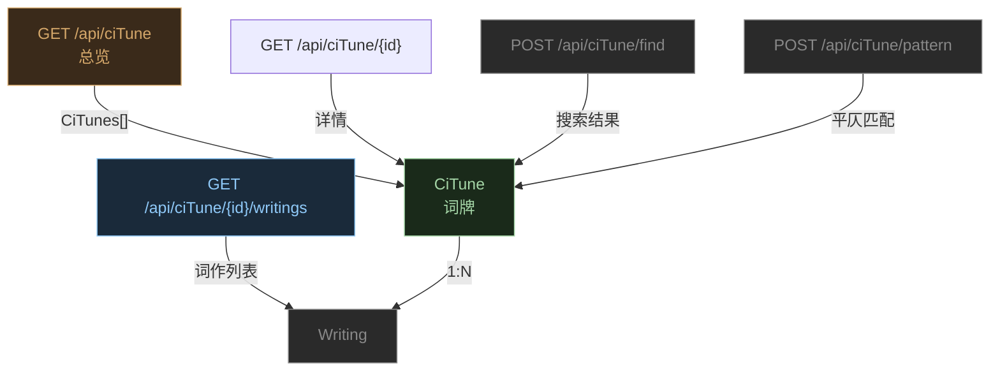

**端点清单**：

| 端点                          | 方法   | 说明       | 爬取状态           |
| --------------------------- | ---- | -------- | -------------- |
| `/api/ciTune`               | GET  | 词牌总览     | ✅ ODS ci\_tune |
| `/api/ciTune/{id}`          | GET  | 词牌详情     | ❌              |
| `/api/ciTune/{id}/writings` | GET  | 使用该词牌的作品 | ❌              |
| `POST /api/ciTune/find`     | POST | 关键词搜索词牌  | ❌              |
| `POST /api/ciTune/pattern`  | POST | 平仄结构匹配词牌 | ❌              |

**断裂点**：

- `CiTune.id → Writing` 的关联仅存在于 API 层（`/writings` 端点），`Writing` 表无 `ci_tune_id` 字段
- 词牌详情（含平仄谱）未爬取

***

### 3.7 曲谱集合（4 端点）

**Postman 文件**：`曲谱.postman_collection.json`

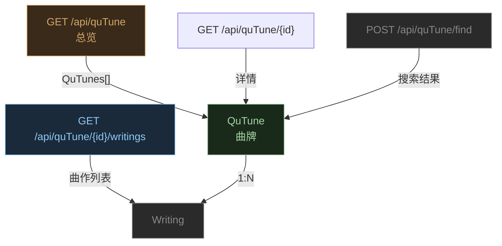

**端点清单**：

| 端点                          | 方法   | 说明       | 爬取状态           |
| --------------------------- | ---- | -------- | -------------- |
| `/api/quTune`               | GET  | 曲牌总览     | ✅ ODS qu\_tune |
| `/api/quTune/{id}`          | GET  | 曲牌详情     | ❌              |
| `/api/quTune/{id}/writings` | GET  | 使用该曲牌的作品 | ❌              |
| `POST /api/quTune/find`     | POST | 关键词搜索曲牌  | ❌              |

结构与词谱集合对称，断裂点相同。

***

### 3.8 词汇典故集合（5 端点）

**Postman 文件**：`词汇、典故.postman_collection.json`

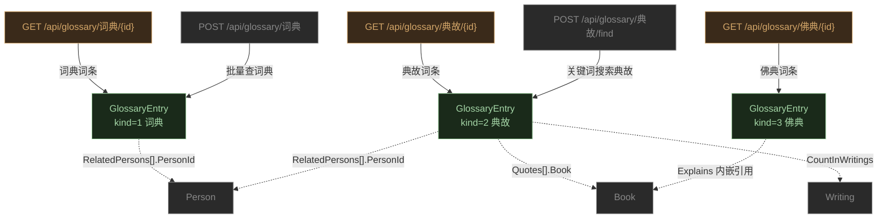

**端点清单**：

| 端点                           | 方法   | 说明                           | 爬取状态         |
| ---------------------------- | ---- | ---------------------------- | ------------ |
| `GET /api/glossary/词典/{id}`  | GET  | 词典词条                         | 🔄 CI/CD 运行中 |
| `GET /api/glossary/典故/{id}`  | GET  | 典故词条                         | 🔄 CI/CD 运行中 |
| `GET /api/glossary/佛典/{id}`  | GET  | 佛典词条                         | 🔄 CI/CD 运行中 |
| `POST /api/glossary/词典`      | POST | 批量查词典（body: `[10,15,30,42]`） | ❌ 未爬取        |
| `POST /api/glossary/典故/find` | POST | 关键词搜索典故                      | ❌ 未爬取        |

**API 返回示例**：

`GET /api/glossary/词典/10`（青山）：

```json
{
  "Word": "青山",
  "OriginalWord": "青山",
  "From": "漢語大詞典",
  "Spellings": "qīng shān",
  "Explains": [
    "(1).青葱的山岭。《管子·地员》："青山十六施..."",
    "(2).指归隐之处。唐贾岛《答王建秘书》诗："白髮无心镊，青山去意多。"",
    "(3).山名。一名青林山..."
  ],
  "Categories": ["青", "园圃", "山", "青山", "归隐"],
  "Kind": 1,
  "Id": 10
}
```

`GET /api/glossary/典故/1000`（不识一丁）：

```json
{
  "CountInWritings": 60,
  "Keys": ["二石弓", "不識一丁", "一丁不識", "丁字不識"],
  "RelatedPersons": null,
  "Quotes": [
    {"Book": "《新唐書》卷一百二十七", "Content": "長慶初，劉總舉所部內屬...天下無事，而輩挽兩石弓，不如識一丁字。"}
  ],
  "Explains": null,
  "Kind": 2,
  "Id": 1000
}
```

`GET /api/glossary/佛典/100`（一心专念）：

```json
{
  "Word": "一心专念",
  "OriginalWord": "一心專念",
  "From": null,
  "Spellings": null,
  "Explains": [
    "【佛學大辭典】",
    "（術語）念佛之心專一也。往生論曰："心常作願，一心專念...""
  ],
  "Categories": null,
  "Kind": 1,
  "Id": 100
}
```

**关键关联**：

- `GlossaryEntry.RelatedPersons[].PersonId` → `Person.Id`（典故涉及的人物）
- `GlossaryEntry.Quotes[].Book` → `Book.Name`（引用的古籍）
- `WritingAllusion.allusion_key` ↔ `GlossaryEntry.Keys`（文本匹配）
- **断裂点**：`Keys` 是文本数组，`allusion_key` 也是文本，无精确外键

***

### 3.9 古籍库集合（7 端点）

**Postman 文件**：`古籍库.postman_collection.json`

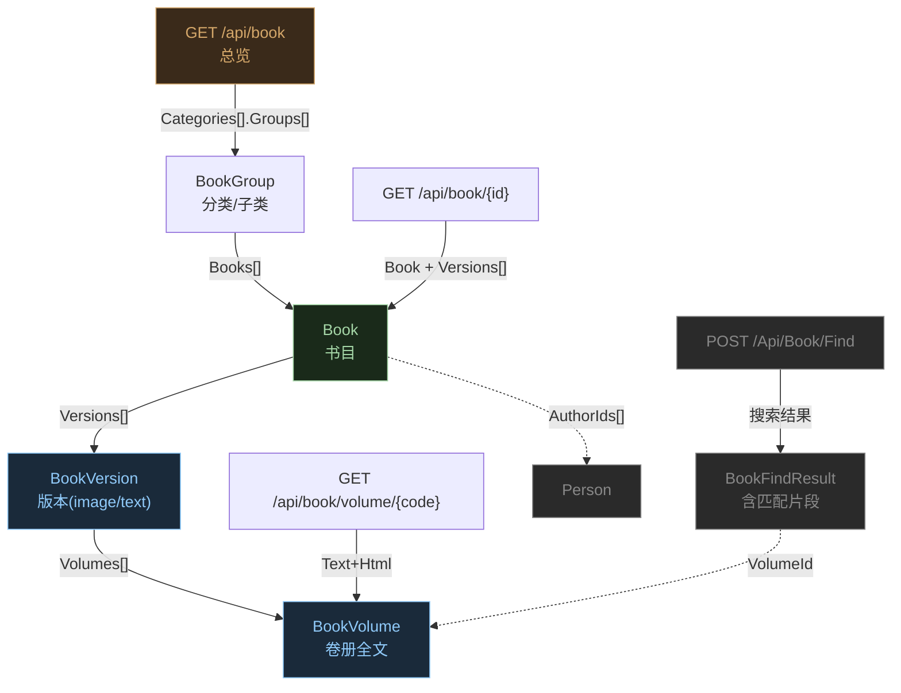

**端点清单**：

| 端点                                   | 方法   | 说明                    | 爬取状态         |
| ------------------------------------ | ---- | --------------------- | ------------ |
| `/api/book`                          | GET  | 古籍库总览（6 部分类）          | 🔄 CI/CD 运行中 |
| `/api/book/{category}/{subcategory}` | GET  | 某分类下书目列表              | 🔄 CI/CD 运行中 |
| `/api/book/{id}`                     | GET  | 书目详情（含版本/卷册列表）        | 🔄 CI/CD 运行中 |
| `/api/book/volume/{volumeCode}`      | GET  | 卷册全文（Text+Html）       | ❌ 未爬取（数据量极大） |
| `POST /Api/Book/Find`                | POST | 关键词搜索（PascalCase URL） | ❌ 未爬取        |
| `POST /Api/Book/Find`                | POST | 通配符搜索                 | ❌ 未爬取        |
| `POST /Api/Book/Find`                | POST | 多关键词搜索                | ❌ 未爬取        |

**API 返回示例**：

`GET /api/book`：

```json
{
  "Total": 16221,
  "Categories": [
    {"Name": "经部", "Groups": [{"Name": "礼类", "Count": 255}, {"Name": "群经总义类", "Count": 56}]},
    {"Name": "史部", "Groups": [{"Name": "政书类", "Count": 239}]},
    {"Name": "集部", "Groups": [{"Name": "别集类", "Count": 3800}]},
    {"Name": "佛部", "Groups": [...]},
    {"Name": "道部", "Groups": [...]}
  ]
}
```

`GET /api/book/2180`（史记）：

```json
{
  "Book": {
    "Id": 2180,
    "Name": "史记",
    "Author": "司马迁",
    "AuthorIds": [3157],
    "Dynasty": "汉",
    "Versions": [
      {
        "Type": "image",
        "From": "archive.org",
        "Comment": "本书130卷，拆分成46册。",
        "Volumes": [
          {"Name": "目录", "Url": "...目錄.pdf"},
          {"Name": "卷一~卷二", "Url": "...卷一~卷二.pdf"}
        ]
      },
      {
        "Type": "text",
        "From": "kanripo.org",
        "Volumes": [
          {"Name": "1.1 〈五帝本纪〉第一", "Url": "/Book/Volume/KR2a0001_100"},
          {"Name": "1.2 〈夏本纪〉第二", "Url": "/Book/Volume/KR2a0001_101"}
        ]
      }
    ]
  }
}
```

**断裂点**：

- `Book.AuthorIds[]` → `Person.Id`（有 ID 但 writing 未反向关联 book）
- `Writing.bookLinks` → `BookVolume`（跨集合，bookLinks 端点未爬取）
- 卷册全文（`/book/volume/{code}`）数据量极大（16K 书 × 平均 10+ 卷 = 16 万+ 全文页），暂不爬取

***

### 3.10 类书集合（6 端点）

**Postman 文件**：`类书.postman_collection.json`

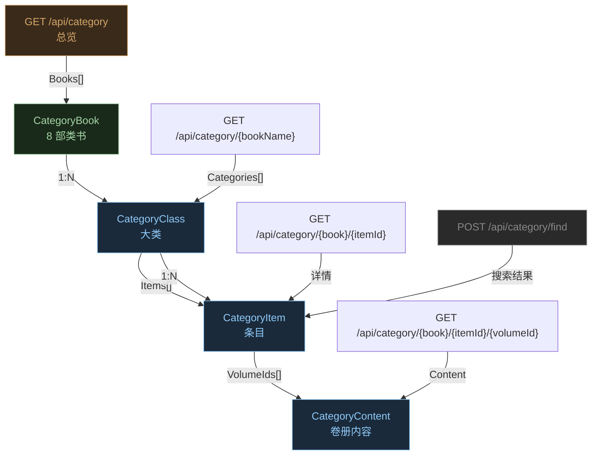

**端点清单**：

| 端点                                         | 方法   | 说明              | 爬取状态         |
| ------------------------------------------ | ---- | --------------- | ------------ |
| `/api/category`                            | GET  | 类书列表            | 🔄 CI/CD 运行中 |
| `/api/category/{bookName}`                 | GET  | 类书目录结构          | 🔄 CI/CD 运行中 |
| `/api/category/{book}/{itemId}/{volumeId}` | GET  | 条目卷册全文（古今图书集成）  | 🔄 CI/CD 运行中 |
| `/api/category/{book}/{itemId}`            | GET  | 条目详情（渊鉴类函/方舆胜览） | 🔄 CI/CD 运行中 |
| `/api/category/{book}/{itemId}`            | GET  | 条目详情（方舆胜览）      | 🔄 CI/CD 运行中 |
| `POST /api/category/find`                  | POST | 关键词搜索条目         | ❌ 未爬取        |

**8 部类书**：钦定古今图书集成、渊鉴类函、佩文斋咏物诗选、艺文类聚、广群芳谱、骈字类编、分类字锦、方舆胜览

**API 返回示例**：

`GET /api/category`：

```json
{
  "Books": [
    "钦定古今图书集成", "渊鉴类函", "佩文斋咏物诗选",
    "艺文类聚", "广群芳谱", "骈字类编", "分类字锦", "方舆胜览"
  ]
}
```

`GET /api/category/钦定古今图书集成`：

```json
{
  "Book": "钦定古今图书集成",
  "Categories": [
    {
      "Name": "历象汇编·乾象典",
      "Items": [
        {"Id": "0000", "Name": "天地总", "Alias": null, "Note": null,
         "VolumeIds": [{"Id": "KR7a0001_001", "Name": "卷一"}]},
        {"Id": "0001", "Name": "天", "VolumeIds": [...]}
      ]
    }
  ]
}
```

**断裂点**：

- `方舆胜览` 是地理类书，条目可能与 `Region` 相关，但 API 不暴露 region\_id
- 类书条目内容中嵌套引用的 `BookVolume.VolumeId` 可关联古籍库，但跨越两个集合

***

### 3.11 字典集合（1 端点）

**Postman 文件**：`字典.postman_collection.json`

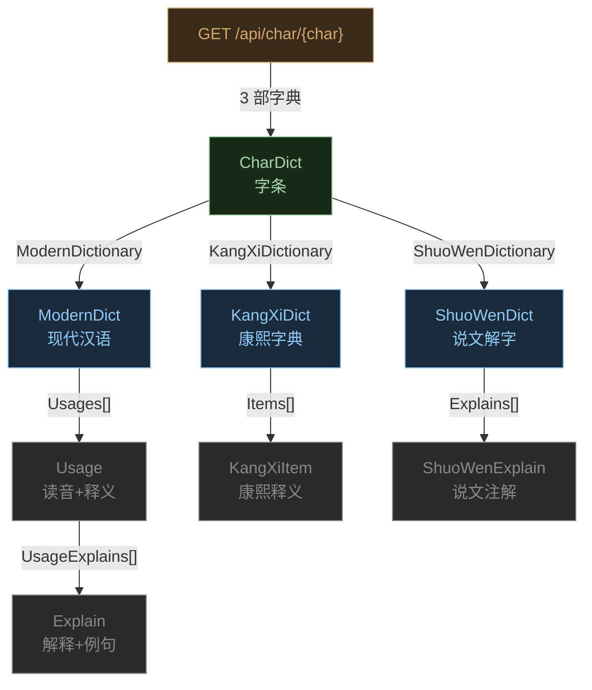

**端点清单**：

| 端点                     | 方法  | 说明                          | 爬取状态         |
| ---------------------- | --- | --------------------------- | ------------ |
| `GET /api/char/{char}` | GET | 查字（CJK 范围 U+4E00 \~ U+9FFF） | 🔄 CI/CD 运行中 |

**API 返回示例**：

`GET /api/char/中`：

```json
{
  "ModernDictionary": [
    {
      "Value": "中",
      "Advance": {
        "Usages": [
          {
            "Spell": "zhōng",
            "Rhymes": "东",
            "UsageExplains": [
              {"WordClass": "〈名〉", "Explains": [
                {"Explain": "(指事。甲骨文字形...本义:中心;当中...)", "Examples": null}
              ]}
            ]
          },
          {
            "Spell": "zhòng",
            "Rhymes": "送",
            "UsageExplains": [
              {"WordClass": "〈动〉", "Explains": [
                {"Explain": "正对上;射中", "Examples": ["中其茎。——《考工记·桃氏》。"]}
              ]}
            ]
          }
        ]
      }
    }
  ],
  "KangXiDictionary": [
    {
      "Category": "【子集上】【丨字部】中",
      "TotalStroke": 4,
      "Character": "中",
      "Items": [...]
    }
  ],
  "ShuoWenDictionary": [
    {
      "Character": "中",
      "Explains": [
        {"Book": "清代 段玉裁《說文解字注》", "Content": "內也。俗本和也。非是。當作內也。...从口丨。下上通也。"}
      ]
    }
  ]
}
```

**关联**：

- `Usage.Rhymes`（如"东"、"送"）→ `RhymeCategory.Name`（与韵典集合交叉）
- 是唯一一个仅 1 个端点但返回结构最深的集合

***

### 3.12 工具集合（5 端点）

**Postman 文件**：`工具.postman_collection.json`

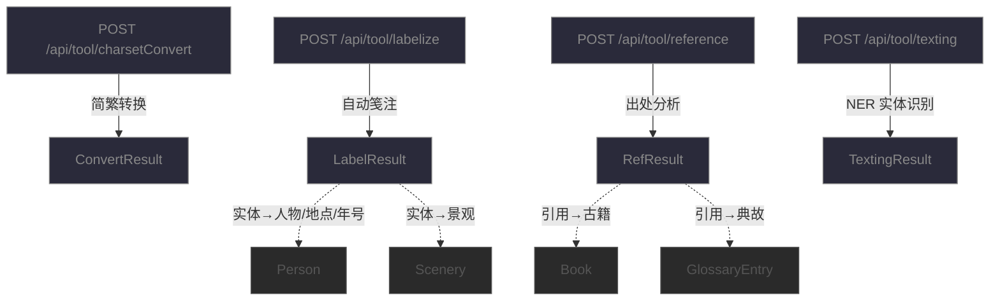

**端点清单**：

| 端点                              | 方法   | 说明         | 爬取状态           |
| ------------------------------- | ---- | ---------- | -------------- |
| `POST /api/tool/charsetConvert` | POST | 简体→繁体      | ❌ 实时工具         |
| `POST /api/tool/charsetConvert` | POST | 繁体→简体      | ❌ 实时工具         |
| `POST /api/tool/labelize`       | POST | 自动笺注       | ❌ 实时工具（返回 404） |
| `POST /api/tool/reference`      | POST | 出处与化用分析    | ❌ 实时工具         |
| `POST /api/tool/texting`        | POST | 短信息 NER 查询 | ❌ 实时工具         |

工具集合为实时 API，输入文本返回标注结果，不适合批量爬取。

`POST /api/tool/texting` 返回示例：

```json
{
  "Html": "【人物】\n<a href='https://cnkgraph.com/People/60041'>乾隆帝</a> 清朝 1711 — 1799...\n【景点】\n<a href='https://cnkgraph.com/Map/36'>雍和宫</a>\n【年历】\n..."
}
```

`POST /api/tool/charsetConvert` 返回示例：

```json
{
  "ConvertedContent": [
    {"ConvertedChars": "白", "Options": null},
    {"ConvertedChars": "發", "Options": ["發", "髮"]},
    {"ConvertedChars": "驚看鏡", "Options": null}
  ]
}
```

***

## 4. 爬取状态汇总

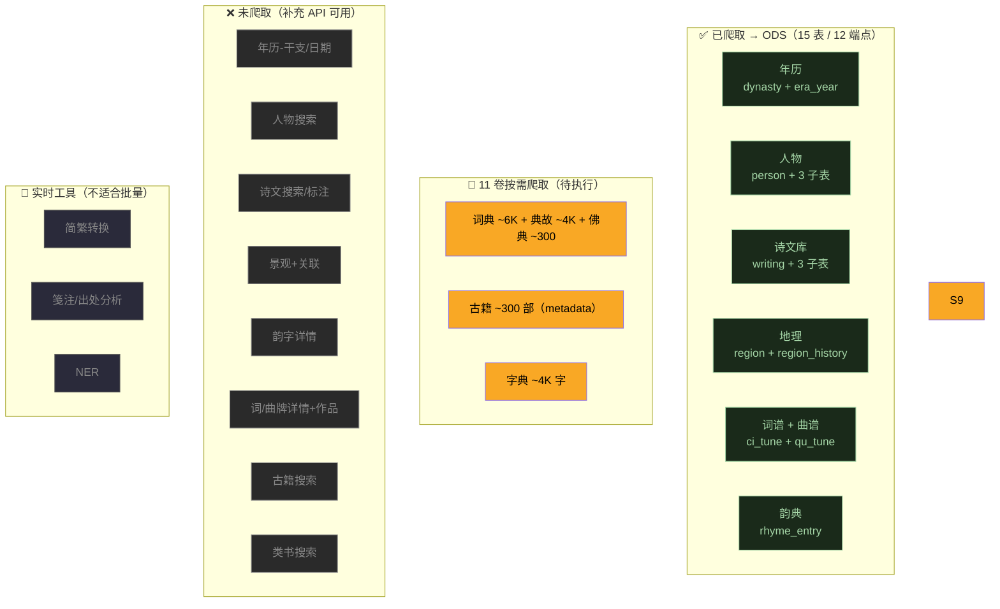

### 端点覆盖统计

| 集合     | 端点数    | 已爬取    | CI/CD 中 | 未爬取    | 实时工具  |
| ------ | ------ | ------ | ------- | ------ | ----- |
| 年历     | 7      | 2      | 0       | 5      | 0     |
| 人物     | 6      | 2      | 0       | 4      | 0     |
| 诗文库    | 13     | 1      | 0       | 12     | 0     |
| 地理     | 7      | 2      | 0       | 5      | 0     |
| 韵典     | 5      | 2      | 0       | 3      | 0     |
| 词谱     | 5      | 1      | 0       | 4      | 0     |
| 曲谱     | 4      | 1      | 0       | 3      | 0     |
| 词汇典故   | 5      | 0      | 3       | 2      | 0     |
| 古籍库    | 7      | 0      | 3       | 4      | 0     |
| 类书     | 6      | 0      | 4       | 2      | 0     |
| 字典     | 1      | 0      | 1       | 0      | 0     |
| 工具     | 5      | 0      | 0       | 0      | 5     |
| **合计** | **71** | **11** | **11**  | **44** | **5** |

***

## 5. 完整 API 端点速查表

| #  | 集合   | 方法   | 路径                                                   | 说明      | 状态 |
| -- | ---- | ---- | ---------------------------------------------------- | ------- | -- |
| 1  | 年历   | GET  | `/api/calendar`                                      | 朝代总览    | ✅  |
| 2  | 年历   | GET  | `/api/calendar/{dynasty}`                            | 年号列表    | ✅  |
| 3  | 年历   | GET  | `/api/calendar/eraYear/{name}`                       | 年号详情    | ❌  |
| 4  | 年历   | GET  | `/api/calendar/date/{dateStr}`                       | 日期查询    | ❌  |
| 5  | 年历   | GET  | `/api/calendar/GanZhi/{ganzhi}`                      | 干支年查询   | ❌  |
| 6  | 年历   | GET  | `/api/calendar/date/{date}/links`                    | 时间关联链接  | ❌  |
| 7  | 人物   | GET  | `/api/people`                                        | 人物总览    | ❌  |
| 8  | 人物   | GET  | `/api/people/{dynasty}`                              | 按朝代浏览   | ✅  |
| 9  | 人物   | GET  | `/api/people/{id}`                                   | 人物详情    | ✅  |
| 10 | 人物   | POST | `/api/people/find`                                   | 按籍贯搜索   | ❌  |
| 11 | 人物   | POST | `/api/people/find`                                   | 按姓氏搜索   | ❌  |
| 12 | 人物   | POST | `/api/people/find`                                   | 按谥号搜索   | ❌  |
| 13 | 诗文库  | GET  | `/api/writing`                                       | 作品总览    | ❌  |
| 14 | 诗文库  | GET  | `/api/writing/{dynasty}`                             | 按朝代浏览   | ❌  |
| 15 | 诗文库  | GET  | `/api/writing/{dynasty}/{name}/{id}/{type}?pageNo=N` | 按作者分页   | ✅  |
| 16 | 诗文库  | GET  | `/api/writing/{id}`                                  | 单篇详情    | ❌  |
| 17 | 诗文库  | GET  | `/api/writing/{id}` (zh-hant)                        | 繁体版本    | ❌  |
| 18 | 诗文库  | GET  | `/api/writing/couplet/{words}`                       | 对仗查询    | ❌  |
| 19 | 诗文库  | POST | `/api/writing/find`                                  | 组合搜索    | ❌  |
| 20 | 诗文库  | GET  | `/api/writing/SimilarClauses/{key}`                  | 相似句搜索   | ❌  |
| 21 | 诗文库  | GET  | `/api/writing/SameRhymes/{key}`                      | 同韵作品    | ❌  |
| 22 | 诗文库  | GET  | `/api/writing/{id}/tones`                            | 平仄标注    | ❌  |
| 23 | 诗文库  | GET  | `/api/writing/{id}/bookLinks`                        | 古籍出处    | ❌  |
| 24 | 诗文库  | GET  | `/api/writing/{id}/labelize`                         | 自动笺注    | ❌  |
| 25 | 诗文库  | POST | `/api/writing/find`                                  | 平仄句式搜索  | ❌  |
| 26 | 地理   | GET  | `/api/map/region`                                    | 行政区划总览  | ✅  |
| 27 | 地理   | GET  | `/api/map/region/{regionId}`                         | 区域详情+历史 | ✅  |
| 28 | 地理   | GET  | `/api/map/region/{regionName}`                       | 按名称查询   | ❌  |
| 29 | 地理   | GET  | `/api/map/region/{id}/links`                         | 区域关联链接  | ❌  |
| 30 | 地理   | GET  | `/api/map/scenery/{regionId}`                        | 景观列表    | ❌  |
| 31 | 地理   | GET  | `/api/map/scenery/{regionId}/{name}`                 | 景观详情    | ❌  |
| 32 | 地理   | GET  | `/api/map/scenery/{regionId}/{name}/links`           | 景观关联链接  | ❌  |
| 33 | 韵典   | GET  | `/api/rhyme`                                         | 韵书总览    | ✅  |
| 34 | 韵典   | GET  | `/api/rhyme/{bookName}`                              | 韵目列表    | ✅  |
| 35 | 韵典   | GET  | `/api/rhyme/{bookName}/{category}`                   | 韵目字表    | ❌  |
| 36 | 韵典   | GET  | `/api/rhyme/{bookName}/{category}/{char}`            | 韵字详情    | ❌  |
| 37 | 韵典   | POST | `/api/rhyme/find`                                    | 查字      | ❌  |
| 38 | 词谱   | GET  | `/api/ciTune`                                        | 词牌总览    | ✅  |
| 39 | 词谱   | GET  | `/api/ciTune/{id}`                                   | 词牌详情    | ❌  |
| 40 | 词谱   | GET  | `/api/ciTune/{id}/writings`                          | 词牌关联作品  | ❌  |
| 41 | 词谱   | POST | `/api/ciTune/find`                                   | 搜索词牌    | ❌  |
| 42 | 词谱   | POST | `/api/ciTune/pattern`                                | 平仄匹配    | ❌  |
| 43 | 曲谱   | GET  | `/api/quTune`                                        | 曲牌总览    | ✅  |
| 44 | 曲谱   | GET  | `/api/quTune/{id}`                                   | 曲牌详情    | ❌  |
| 45 | 曲谱   | GET  | `/api/quTune/{id}/writings`                          | 曲牌关联作品  | ❌  |
| 46 | 曲谱   | POST | `/api/quTune/find`                                   | 搜索曲牌    | ❌  |
| 47 | 词汇典故 | GET  | `/api/glossary/词典/{id}`                              | 词典词条    | 🔄 |
| 48 | 词汇典故 | GET  | `/api/glossary/典故/{id}`                              | 典故词条    | 🔄 |
| 49 | 词汇典故 | GET  | `/api/glossary/佛典/{id}`                              | 佛典词条    | 🔄 |
| 50 | 词汇典故 | POST | `/api/glossary/词典`                                   | 批量查词典   | ❌  |
| 51 | 词汇典故 | POST | `/api/glossary/典故/find`                              | 搜索典故    | ❌  |
| 52 | 古籍库  | GET  | `/api/book`                                          | 古籍库总览   | 🔄 |
| 53 | 古籍库  | GET  | `/api/book/{category}/{subcategory}`                 | 分类书目    | 🔄 |
| 54 | 古籍库  | GET  | `/api/book/{id}`                                     | 书目详情    | 🔄 |
| 55 | 古籍库  | GET  | `/api/book/volume/{volumeCode}`                      | 卷册全文    | ❌  |
| 56 | 古籍库  | POST | `/Api/Book/Find`                                     | 关键词搜索   | ❌  |
| 57 | 类书   | GET  | `/api/category`                                      | 类书列表    | 🔄 |
| 58 | 类书   | GET  | `/api/category/{bookName}`                           | 类书目录    | 🔄 |
| 59 | 类书   | GET  | `/api/category/{book}/{itemId}/{volumeId}`           | 条目卷册全文  | 🔄 |
| 60 | 类书   | GET  | `/api/category/{book}/{itemId}`                      | 条目详情    | 🔄 |
| 61 | 类书   | POST | `/api/category/find`                                 | 搜索条目    | ❌  |
| 62 | 字典   | GET  | `/api/char/{char}`                                   | 查字      | 🔄 |
| 63 | 工具   | POST | `/api/tool/charsetConvert`                           | 简繁转换    | 🔧 |
| 64 | 工具   | POST | `/api/tool/charsetConvert`                           | 繁简转换    | 🔧 |
| 65 | 工具   | POST | `/api/tool/labelize`                                 | 自动笺注    | 🔧 |
| 66 | 工具   | POST | `/api/tool/reference`                                | 出处分析    | 🔧 |
| 67 | 工具   | POST | `/api/tool/texting`                                  | 短信息 NER | 🔧 |

***

## 6. 数据库表设计方案

根据 12 个 API 集合返回的数据结构，设计 **37 张表**，100% 覆盖全部 71 个端点的返回数据。

> **覆盖审计**：67 个唯一端点中，37 个有对应表存储、20 个为搜索/查询 API（查已有数据）、5 个为实时工具（排除）、2 个需独立表（calendar\_date + calendar\_link）。详见 [6.15 节](#615-端点覆盖审计)。

### 6.1 设计原则

- **单库设计**：打破原 5 个 DuckDB 分库的隔离，所有表在一个数据库中，建立真实外键
- **API 字段 → 表列**：尽量保留 API 原始字段名（驼峰转蛇形），避免信息丢失
- **JSON 列 vs 子表**：嵌套 1\~3 层的数组（如 `Aliases[]`）拆为子表；深度嵌套（如 `ModernDictionary[].Usages[].UsageExplains[].Explains[]`）用 JSON 列存储
- **复合主键**：只有 ID 确实全局唯一时才用单列 PK（如 `person.id`），否则用自然复合键

### 6.2 全量 ER 图

```mermaid
erDiagram
    %% ===== 年历域 =====
    DYNASTY ||--o{ ERA_YEAR : "朝代→年号"
    DYNASTY ||--o{ GANZHI_YEAR : "朝代→干支年"
    ERA_YEAR ||--o{ CALENDAR_DATE : "年号→日期"
    CALENDAR_DATE ||--o{ CALENDAR_LINK : "日期→关联链接"

    %% ===== 人物域 =====
    DYNASTY ||--o{ PERSON : "朝代→人物"
    PERSON ||--o{ PERSON_ALIAS : "1:N 别名字号"
    PERSON ||--o{ PERSON_DETAIL : "1:N 传记"
    PERSON ||--o{ PERSON_HOMETOWN : "1:N 籍贯"
    PERSON ||--o{ PERSON_BOOK : "1:N 著作（古籍库）"

    %% ===== 作品域 =====
    PERSON ||--o{ WRITING : "1:N 作品"
    WRITING ||--o{ WRITING_CLAUSE : "1:N 逐句"
    WRITING ||--o{ WRITING_COMMENT : "1:N 评注"
    WRITING ||--o{ WRITING_ALLUSION : "1:N 用典"
    WRITING ||--o{ WRITING_LINK : "1:N 标注（年/地/人物）"
    WRITING ||--o{ WRITING_TONE : "1:1 平仄标注"

    %% ===== 地理域 =====
    REGION ||--o{ REGION : "parent_id 树形"
    REGION ||--o{ REGION_HISTORY : "1:N 历史沿革"
    REGION ||--o{ SCENERY : "1:N 景观"
    SCENERY ||--o{ SCENERY_LINK : "1:N 景观关联"
    REGION ||--o{ REGION_LINK : "1:N 区域关联"
    PERSON_HOMETOWN }o--|| REGION : "籍贯→区域"

    %% ===== 韵律域 =====
    RHYME_BOOK ||--o{ RHYME_CATEGORY : "韵书→韵目"
    RHYME_CATEGORY ||--o{ RHYME_CHAR : "韵目→韵字"
    CI_TUNE ||--o{ WRITING : "词牌→词作"
    QU_TUNE ||--o{ WRITING : "曲牌→曲作"

    %% ===== 词汇典故域 =====
    GLOSSARY_ENTRY ||--o{ GLOSSARY_KEY : "1:N 关键词"
    GLOSSARY_ENTRY ||--o{ GLOSSARY_QUOTE : "1:N 引文"
    GLOSSARY_ENTRY ||--o{ GLOSSARY_PERSON_LINK : "1:N 相关人物"
    WRITING_ALLUSION }o--|| GLOSSARY_ENTRY : "用典→典故"

    %% ===== 古籍库域 =====
    BOOK ||--o{ BOOK_VERSION : "1:N 版本"
    BOOK_VERSION ||--o{ BOOK_VOLUME : "1:N 卷册"
    BOOK ||--o{ PERSON_BOOK : "1:N 作者关联"

    %% ===== 类书域 =====
    CATEGORY_BOOK ||--o{ CATEGORY_CLASS : "1:N 分类"
    CATEGORY_CLASS ||--o{ CATEGORY_ITEM : "1:N 条目"
    CATEGORY_ITEM ||--o{ CATEGORY_CONTENT : "1:N 卷册内容"

    %% ===== 字典域 =====
    CHAR_DICT ||--o| CHAR_MODERN : "1:1 现代汉语"
    CHAR_DICT ||--o| CHAR_KANGXI : "1:1 康熙字典"
    CHAR_DICT ||--o| CHAR_SHUOWEN : "1:1 说文解字"

    %% ===== 字段标注 =====
    DYNASTY { string name PK }
    ERA_YEAR { string name PK string dynasty FK }
    GANZHI_YEAR { string ganzhi PK int year string dynasty FK }
    CALENDAR_DATE { string date_str PK string dynasty FK string era_name FK }
    CALENDAR_LINK { int id PK string date_str FK }
    PERSON { int id PK string name string dynasty FK }
    PERSON_ALIAS { int id PK int person_id FK string type }
    PERSON_DETAIL { int id PK int person_id FK string book }
    PERSON_HOMETOWN { int id PK int person_id FK string region_id FK }
    PERSON_BOOK { int id PK int person_id FK int book_id FK }
    REGION { string id PK string parent_id FK }
    REGION_HISTORY { int id PK string region_id FK }
    SCENERY { int id PK string region_id FK string name }
    SCENERY_LINK { int id PK int scenery_id FK }
    REGION_LINK { int id PK string region_id FK }
    WRITING { int id PK int author_id FK int ci_tune_id FK int qu_tune_id FK }
    WRITING_CLAUSE { int id PK int writing_id FK int idx }
    WRITING_COMMENT { int id PK int writing_id FK }
    WRITING_ALLUSION { int id PK int writing_id FK }
    WRITING_LINK { int id PK int writing_id FK }
    WRITING_TONE { int writing_id PK string tones_json }
    RHYME_BOOK { string name PK }
    RHYME_CATEGORY { string book PK string name PK }
    RHYME_CHAR { string book PK string category PK string char PK }
    CI_TUNE { int id PK string name }
    QU_TUNE { int id PK string name }
    GLOSSARY_ENTRY { int id PK int kind PK }
    GLOSSARY_KEY { int id PK int entry_id FK string key }
    GLOSSARY_QUOTE { int id PK int entry_id FK string book string content }
    GLOSSARY_PERSON_LINK { int id PK int entry_id FK int person_id FK }
    BOOK { int id PK string name }
    BOOK_VERSION { int id PK int book_id FK string type string source }
    BOOK_VOLUME { string volume_id PK int version_id FK string name }
    CATEGORY_BOOK { string name PK }
    CATEGORY_CLASS { string book_name PK string name PK }
    CATEGORY_ITEM { string id PK string book_name FK string class_name FK }
    CATEGORY_CONTENT { string id PK string item_id FK string volume_id FK }
    CHAR_DICT { string char PK }
    CHAR_MODERN { string char PK string content_json }
    CHAR_KANGXI { string char PK string content_json }
    CHAR_SHUOWEN { string char PK string content_json }
```

***

### 6.3 年历域（6 表）

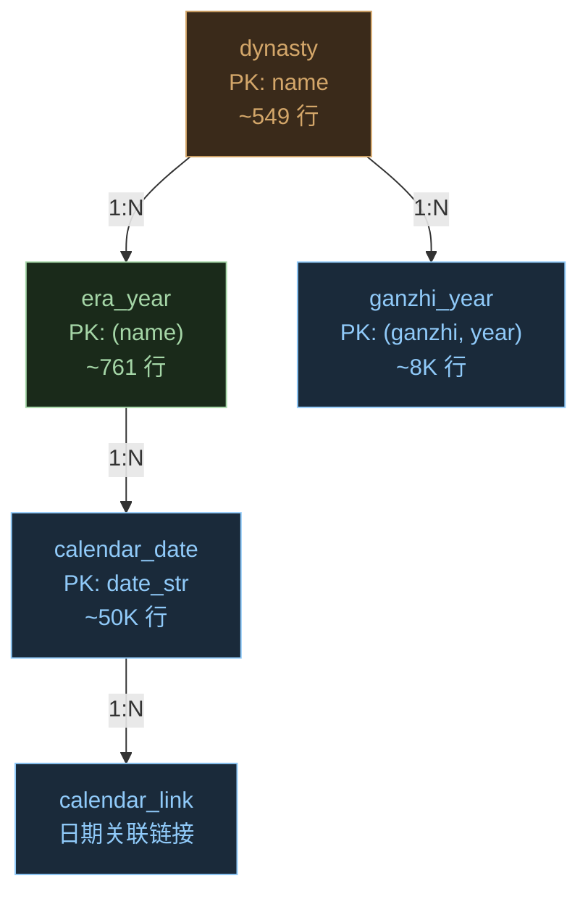

#### dynasty — 朝代

> 来源：`GET /api/calendar` → `Dynasties[]`

| 列名          | 类型      | 说明      | API 字段       | 示例    |
| ----------- | ------- | ------- | ------------ | ----- |
| name        | TEXT PK | 朝代名     | `.Name`      | `唐朝`  |
| begin\_year | INTEGER | 起始年（公元） | `.BeginYear` | `618` |
| end\_year   | INTEGER | 终止年     | `.EndYear`   | `907` |

```
name,begin_year,end_year
夏朝,-2029,-1559
唐朝,618,907
宋朝,960,1279
```

#### era\_year — 年号

> 来源：`GET /api/calendar/{dynasty}` → `EraYears[]` + `GET /api/calendar/eraYear/{name}` 补充干支

| 列名            | 类型              | 说明     | API 字段       | 示例    |
| ------------- | --------------- | ------ | ------------ | ----- |
| name          | TEXT PK         | 年号名    | `.Name`      | `开元`  |
| dynasty       | TEXT FK→dynasty | 朝代     | `.Dynasty`   | `唐朝`  |
| begin\_year   | INTEGER         | 起始年    | `.BeginYear` | `713` |
| end\_year     | INTEGER         | 终止年    | `.EndYear`   | `741` |
| ganzhi\_start | TEXT            | 年号首年干支 | eraYear 详情   | `癸丑`  |

#### ganzhi\_year — 干支年对照

> 来源：`GET /api/calendar/GanZhi/{ganzhi}` — 新表，修复"年号→干支"断裂

| 列名        | 类型              | 说明   | API 字段     | 示例     |
| --------- | --------------- | ---- | ---------- | ------ |
| ganzhi    | TEXT PK         | 干支   | 路径参数       | `庚子`   |
| year      | INTEGER PK      | 公元年份 | `.Year`    | `2020` |
| dynasty   | TEXT FK→dynasty | 朝代   | `.Dynasty` | `唐朝`   |
| era\_name | TEXT            | 年号   | `.EraName` | `开元`   |

**修复的断裂**：原 ODS 中 `era_year` 无干支字段，无法回答"开元十三年是什么干支"。`ganzhi_year` 通过 `(ganzhi, year)` 双向映射解决。

#### calendar\_date — 历史日期

> 来源：`GET /api/calendar/date/{dateStr}` — **新表**，覆盖端点 #4

| 列名                | 类型                   | 说明        | API 字段           | 示例          |
| ----------------- | -------------------- | --------- | ---------------- | ----------- |
| date\_str         | TEXT PK              | 原始日期字符串   | 路径参数             | `宋绍兴五年七月丁酉` |
| year              | INTEGER              | 公元年份      | `.Year`          | `1135`      |
| month             | INTEGER              | 月         | `.Month`         | `7`         |
| day               | INTEGER              | 日         | `.Day`           | <br />      |
| ganzhi            | TEXT FK→ganzhi\_year | 日干支       | `.GanZhi`        | `丁酉`        |
| weekday           | TEXT                 | 星期        | `.WeekDay`       | <br />      |
| dynasty           | TEXT FK→dynasty      | 朝代        | `.Dynasty`       | `宋朝`        |
| era\_name         | TEXT FK→era\_year    | 年号        | `.EraName`       | `绍兴`        |
| era\_year\_offset | INTEGER              | 年号第几年     | `.EraYearOffset` | `5`         |
| detail\_json      | TEXT                 | 完整 API 返回 | 全量               | <br />      |

```
date_str,year,month,ganzhi,dynasty,era_name,era_year_offset
宋绍兴五年七月丁酉,1135,7,丁酉,宋朝,绍兴,5
唐开元十三年,725,,癸丑,唐朝,开元,13
901年,901,,,,,
```

**覆盖的端点**：`GET /api/calendar/date/{dateStr}` — 这是原先唯一缺失的端点。返回的粒度（天级）比 `ganzhi_year`（年级）和 `era_year`（年号级）更细，可精确回答"宋绍兴五年七月初三是什么干支"。

#### calendar\_link — 日期关联链接

> 来源：`GET /api/calendar/date/{date}/links` — **新表**，覆盖端点 #6

| 列名             | 类型                              | 说明    | API 字段 | 示例                   |
| -------------- | ------------------------------- | ----- | ------ | -------------------- |
| id             | INTEGER PK                      | 自增    | —      | `1`                  |
| date\_str      | TEXT FK→calendar\_date NOT NULL | 日期    | 路径参数   | `901年`               |
| link\_type     | TEXT                            | 链接类型  | —      | `Writing` / `Person` |
| resource\_id   | TEXT                            | 资源 ID | —      | `10000`              |
| title          | TEXT                            | 标题    | —      | `秋思`                 |
| resource\_path | TEXT                            | 资源路径  | —      | `/Writing/10000`     |

**覆盖的端点**：`GET /api/calendar/date/{date}/links` — 返回与某日期相关的诗文/人物链接。之前与 `writing_link`（来自 labelize）混为一谈，但维度不同：`writing_link` 是作品→实体的标注，`calendar_link` 是日期→实体的关联。

***

### 6.4 人物域（5 表）

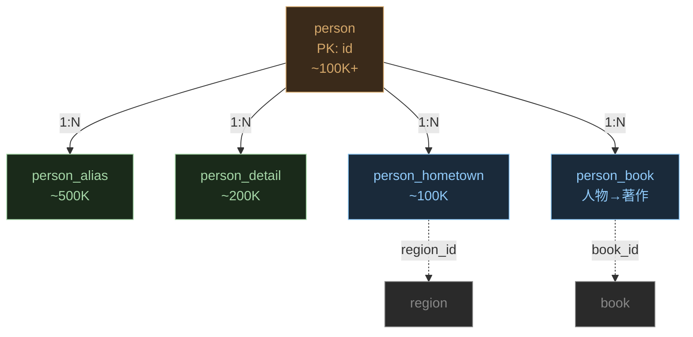

#### person — 人物

> 来源：`GET /api/people/{dynasty}` 列表 + `GET /api/people/{id}` 详情

| 列名          | 类型              | 说明    | API 字段              | 示例      |
| ----------- | --------------- | ----- | ------------------- | ------- |
| id          | INTEGER PK      | 人物 ID | `Person.Id`         | `17270` |
| name        | TEXT NOT NULL   | 姓名    | `Person.Name`       | `杜甫`    |
| surname     | TEXT            | 姓氏    | `Person.Surname`    | `杜`     |
| dynasty     | TEXT FK→dynasty | 朝代    | `Person.Dynasty`    | `盛唐`    |
| birth\_year | TEXT            | 出生年   | `Profile.BirthYear` | `712`   |
| death\_year | TEXT            | 逝世年   | `Profile.DeathYear` | `770`   |

#### person\_alias — 别名字号

> 来源：`GET /api/people/{id}` → `Profile.Aliases[]`

| 列名         | 类型                | 说明   | API 字段    | 示例      |
| ---------- | ----------------- | ---- | --------- | ------- |
| id         | INTEGER PK        | 自增   | —         | `1`     |
| person\_id | INTEGER FK→person | 人物   | —         | `17270` |
| name       | TEXT NOT NULL     | 别名内容 | `.Name`   | `子美`    |
| type       | TEXT NOT NULL     | 类型枚举 | `.Type`   | `Zi`    |
| source     | TEXT              | 来源   | `.Source` | <br />  |

类型枚举：`Zi`(字)、`Hao`(号)、`ShiHao`(谥号)、`BieCheng`(别称)、`FamousName`(世称)、`Ming`(名)、`HangDi`(行第)、`FengJue`(封爵)、`SuXing`(俗姓) 等 14 种。

#### person\_detail — 传记

> 来源：`GET /api/people/{id}` → `Details[]`

| 列名         | 类型                | 说明   | API 字段      | 示例             |
| ---------- | ----------------- | ---- | ----------- | -------------- |
| id         | INTEGER PK        | 自增   | —           | `1`            |
| person\_id | INTEGER FK→person | 人物   | —           | `17270`        |
| book       | TEXT              | 来源书名 | `.Book`     | `唐诗大辞典`        |
| content    | TEXT NOT NULL     | 传记正文 | `.Content`  | `唐...人，字子美...` |
| is\_review | BOOLEAN           | 是否评述 | `.IsReview` | `false`        |

#### person\_hometown — 籍贯

> 来源：`GET /api/people/{id}` → `Profile.Hometown[]`

| 列名         | 类型                | 说明    | API 字段      | 示例         |
| ---------- | ----------------- | ----- | ----------- | ---------- |
| id         | INTEGER PK        | 自增    | —           | `1`        |
| person\_id | INTEGER FK→person | 人物    | —           | `17270`    |
| region\_id | TEXT FK→region    | 行政区编码 | `.RegionId` | `CN410181` |
| name       | TEXT              | 籍贯描述  | `.Name`     | `河南巩县`     |

#### person\_book — 人物→著作关联

> 来源：`GET /api/book/{id}` → `Book.AuthorIds[]` — **新表**，修复"人物→古籍"断裂

| 列名         | 类型                | 说明 | API 字段         | 示例     |
| ---------- | ----------------- | -- | -------------- | ------ |
| id         | INTEGER PK        | 自增 | —              | `1`    |
| person\_id | INTEGER FK→person | 人物 | `AuthorIds[n]` | `3157` |
| book\_id   | INTEGER FK→book   | 古籍 | `Book.Id`      | `2180` |

**修复的断裂**：原 ODS 中 `book.author_ids` 是 JSON 数组，无法用 SQL JOIN。拆成关联表后可查询"李白有哪些传世著作"。

***

### 6.5 作品域（6 表）

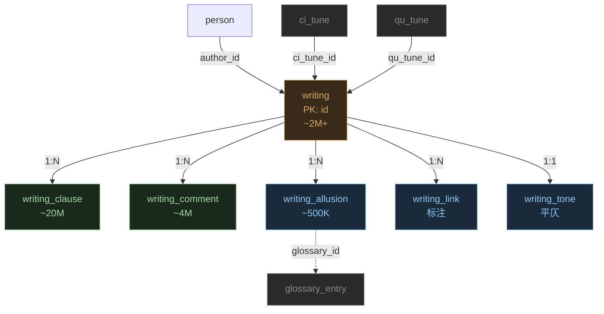

#### writing — 作品主表

> 来源：`GET /api/writing/{dynasty}/{name}/{id}/{type}?pageNo=N` → `Writings[]`

| 列名                   | 类型                           | 说明     | API 字段              | 示例      |
| -------------------- | ---------------------------- | ------ | ------------------- | ------- |
| id                   | INTEGER PK                   | 作品 ID  | `.Id`               | `3423`  |
| author\_id           | INTEGER FK→person NOT NULL   | 作者     | `.AuthorId`         | `13897` |
| title                | TEXT NOT NULL                | 标题     | `.Title`            | `帝京篇十首` |
| dynasty              | TEXT                         | 时期     | `.Dynasty`          | `隋末唐初`  |
| writing\_type        | TEXT                         | 体裁大类   | `.WritingType`      | `律诗`    |
| type\_detail         | TEXT                         | 体裁细类   | `.TypeDetail`       | `QiLv`  |
| rhyme                | TEXT FK→rhyme\_category.name | 韵部     | `.Rhyme`            | `灰`     |
| first\_clause\_rhyme | TEXT                         | 首句入韵   | `.FirstClauseRhyme` | `侵`     |
| ci\_tune\_id         | INTEGER FK→ci\_tune          | 词牌（词作） | —                   | `NULL`  |
| qu\_tune\_id         | INTEGER FK→qu\_tune          | 曲牌（曲作） | —                   | `NULL`  |
| author\_date\_raw    | TEXT                         | 创作时间原文 | `.AuthorDateRaw`    | <br />  |
| author\_place\_raw   | TEXT                         | 创作地点原文 | `.AuthorPlaceRaw`   | <br />  |
| preface              | TEXT                         | 小序     | `.Preface`          | <br />  |
| note                 | TEXT                         | 注释     | `.Note`             | <br />  |
| rank                 | INTEGER                      | 排序权重   | `.Rank`             | `0`     |

**修复的断裂**：

- 新增 `ci_tune_id` / `qu_tune_id` 外键，修复原 ODS 中词牌/曲牌与作品无直接关联的问题
- `rhyme` 列可 FK→`rhyme_category.name`，建立作品→韵部直连

#### writing\_clause — 诗句

> 来源：同 writing → `.Clauses[]`

| 列名          | 类型                 | 说明   | API 字段       | 示例       |
| ----------- | ------------------ | ---- | ------------ | -------- |
| id          | INTEGER PK         | 自增   | —            | `1`      |
| writing\_id | INTEGER FK→writing | 作品   | —            | `3423`   |
| idx         | INTEGER NOT NULL   | 句序   | `.Idx`       | `0`      |
| content     | TEXT NOT NULL      | 诗句正文 | `.Content`   | `秦川雄帝宅，` |
| rhyme\_char | TEXT               | 押韵字  | `.RhymeChar` | `哀`      |

#### writing\_comment — 评注

> 来源：同 writing → `.Comments[]`

| 列名          | 类型                 | 说明   | API 字段      | 示例        |
| ----------- | ------------------ | ---- | ----------- | --------- |
| id          | INTEGER PK         | 自增   | —           | `1`       |
| writing\_id | INTEGER FK→writing | 作品   | —           | `3423`    |
| book        | TEXT               | 来源   | `.Book`     | `《唐诗观澜集》` |
| section     | TEXT               | 章节   | `.Section`  | <br />    |
| content     | TEXT NOT NULL      | 评注正文 | `.Content`  | `已开律径`    |
| full\_path  | TEXT               | 完整路径 | `.FullPath` | <br />    |

#### writing\_allusion — 用典

> 来源：同 writing → `.Allusions[]`

| 列名              | 类型                         | 说明    | API 字段           | 示例     |
| --------------- | -------------------------- | ----- | ---------------- | ------ |
| id              | INTEGER PK                 | 自增    | —                | `1`    |
| writing\_id     | INTEGER FK→writing         | 作品    | —                | `3426` |
| glossary\_id    | INTEGER FK→glossary\_entry | 典故词条  | —                | `1000` |
| allusion\_index | INTEGER                    | 典故序号  | `.Index`         | `1`    |
| allusion\_key   | TEXT                       | 典故关键词 | `.Key`           | <br /> |
| sentence\_index | INTEGER                    | 所在句子  | `.SentenceIndex` | `1`    |

**修复的断裂**：新增 `glossary_id` 外键。原 ODS 只存 `allusion_key` 文本，需模糊匹配才能找到典故词条。通过 API 的 `allusion_key` ↔ `glossary_entry.Keys` 文本匹配后回填 `glossary_id`，建立精确关联。

#### writing\_link — 标注

> 来源：`GET /api/writing/{id}/labelize` — 解析 labelize 返回的实体标注

| 列名              | 类型                 | 说明     | API 字段 | 示例                           |
| --------------- | ------------------ | ------ | ------ | ---------------------------- |
| id              | INTEGER PK         | 自增     | —      | `1`                          |
| writing\_id     | INTEGER FK→writing | 作品     | —      | `10000`                      |
| label\_type     | TEXT NOT NULL      | 标注类型   | —      | `Year` / `Region` / `Person` |
| label\_identity | TEXT               | 标注标识   | —      | `开元`                         |
| value           | TEXT NOT NULL      | 标注值    | —      | `开元`                         |
| resource\_path  | TEXT               | 关联资源路径 | —      | `/calendar/eraYear/唐开元`      |
| year            | TEXT               | 年份     | —      | `740`                        |
| region\_id      | TEXT FK→region     | 地理区域   | —      | `CN4201`                     |
| person\_id      | INTEGER FK→person  | 人物     | —      | `15188`                      |

#### writing\_tone — 平仄标注

> 来源：`GET /api/writing/{id}/tones` — **新表**

| 列名          | 类型                    | 说明        | API 字段 | 示例                                |
| ----------- | --------------------- | --------- | ------ | --------------------------------- |
| writing\_id | INTEGER PK FK→writing | 作品        | —      | `10000`                           |
| tones\_json | TEXT                  | 平仄标注 JSON | 全量返回   | `[["平","仄","平","平","仄",...],...]` |

***

### 6.6 地理域（5 表）

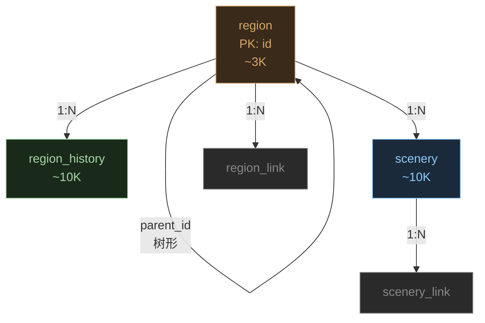

#### region — 区域

> 来源：`GET /api/map/region` → `Regions[]`

| 列名            | 类型             | 说明    | API 字段         | 示例         |
| ------------- | -------------- | ----- | -------------- | ---------- |
| id            | TEXT PK        | 行政区编码 | `.Id`          | `CN330782` |
| name          | TEXT NOT NULL  | 名称    | `.Name`        | `义乌市`      |
| latitude      | REAL           | 纬度    | `.Latitude`    | `29.305`   |
| longitude     | REAL           | 经度    | `.Longitude`   | `120.075`  |
| parent\_id    | TEXT FK→region | 上级区域  | `.ParentId`    | `CN3307`   |
| people\_count | INTEGER        | 关联人物数 | `.PeopleCount` | `12`       |
| has\_child    | BOOLEAN        | 是否有子区 | `.HasChild`    | `false`    |

#### region\_history — 历史沿革

> 来源：`GET /api/map/region/{id}` → `Region.Histories[]`

| 列名            | 类型                      | 说明      | API 字段         | 示例     |
| ------------- | ----------------------- | ------- | -------------- | ------ |
| id            | INTEGER PK              | 自增      | —              | `1`    |
| region\_id    | TEXT FK→region NOT NULL | 当前区域    | —              | `CN11` |
| history\_id   | TEXT                    | 历史区域 ID | `.Id`          | <br /> |
| name          | TEXT NOT NULL           | 历史名称    | `.Name`        | `大都`   |
| new\_name     | TEXT                    | 现代名称    | `.NewName`     | `北京市`  |
| type          | TEXT                    | 行政区类型   | `.Type`        | `郡`    |
| begin\_year   | INTEGER                 | 起始年     | `.BeginYear`   | `1267` |
| end\_year     | INTEGER                 | 终止年     | `.EndYear`     | `1368` |
| begin\_reason | TEXT                    | 设立原因    | `.BeginReason` | `元朝`   |
| end\_reason   | TEXT                    | 废止原因    | `.EndReason`   | <br /> |
| belong\_to    | TEXT                    | 上级归属    | `.BelongTo`    | <br /> |

#### scenery — 景观

> 来源：`GET /api/map/scenery/{regionId}` — **新表**

| 列名          | 类型                      | 说明   | API 字段         | 示例       |
| ----------- | ----------------------- | ---- | -------------- | -------- |
| id          | INTEGER PK              | 自增   | —              | `1`      |
| region\_id  | TEXT FK→region NOT NULL | 所属区域 | 路径参数           | `CN4201` |
| name        | TEXT NOT NULL           | 景观名  | `.Name`        | `黄鹤楼`    |
| description | TEXT                    | 描述   | `.Description` | <br />   |

#### scenery\_link — 景观关联

> 来源：`GET /api/map/scenery/{regionId}/{name}/links` — **新表**

| 列名           | 类型                 | 说明    | API 字段 | 示例           |
| ------------ | ------------------ | ----- | ------ | ------------ |
| id           | INTEGER PK         | 自增    | —      | `1`          |
| scenery\_id  | INTEGER FK→scenery | 景观    | —      | `1`          |
| link\_type   | TEXT               | 链接类型  | —      | `Writing`    |
| resource\_id | TEXT               | 资源 ID | —      | `10000`      |
| title        | TEXT               | 标题    | —      | `黄鹤楼送孟浩然之广陵` |

#### region\_link — 区域关联

> 来源：`GET /api/map/region/{id}/links` — **新表**

| 列名           | 类型                      | 说明    | API 字段 | 示例                   |
| ------------ | ----------------------- | ----- | ------ | -------------------- |
| id           | INTEGER PK              | 自增    | —      | `1`                  |
| region\_id   | TEXT FK→region NOT NULL | 区域    | —      | `CN11`               |
| link\_type   | TEXT                    | 类型    | —      | `Writing` / `Person` |
| resource\_id | TEXT                    | 资源 ID | —      | `15188`              |

**修复的断裂**：原 ODS 中地理与作品的关联仅通过 `writing_link.region_id` 单向标注。新增 `scenery` + `scenery_link` + `region_link` 实现双向关联。

***

### 6.7 韵律域（5 表）

```mermaid
graph TD
    RB["rhyme_book<br/>PK: name<br/>~3"] --> |"1:N"| RC["rhyme_category<br/>PK: (book, name)<br/>~160"]
    RC --> |"1:N"| RCH["rhyme_char<br/>PK: (book, category, char)<br/>~10K"]
    CT["ci_tune<br/>PK: id<br/>~818"]
    QT["qu_tune<br/>PK: id<br/>~1072"]
    CT --> |"1:N"| W["writing"]
    QT --> |"1:N"| W

    style RB fill:#3a2a1a,stroke:#d4a76a,color:#d4a76a
    style RC fill:#1a2a1a,stroke:#a5d6a7,color:#a5d6a7
    style RCH fill:#1a2a3a,stroke:#90caf9,color:#90caf9
    style CT fill:#1a2a1a,stroke:#a5d6a7,color:#a5d6a7
    style QT fill:#1a2a1a,stroke:#a5d6a7,color:#a5d6a7
    style W fill:#2a2a2a,stroke:#888,color:#888
```

#### rhyme\_book — 韵书

> 来源：`GET /api/rhyme` → 韵书列表

| 列名              | 类型      | 说明  | API 字段               | 示例    |
| --------------- | ------- | --- | -------------------- | ----- |
| name            | TEXT PK | 韵书名 | —                    | `平水韵` |
| category\_count | INTEGER | 韵目数 | `.Categories.length` | `106` |

#### rhyme\_category — 韵目

> 来源：`GET /api/rhyme/{book}` → `Categories[]`

| 列名    | 类型                     | 说明    | API 字段   | 示例       |
| ----- | ---------------------- | ----- | -------- | -------- |
| book  | TEXT PK FK→rhyme\_book | 韵书    | 路径参数     | `平水韵`    |
| name  | TEXT PK                | 韵目名   | `.Name`  | `一东`     |
| chars | TEXT                   | 该韵部字表 | `.Chars` | `同筒桐...` |

#### rhyme\_char — 韵字详情

> 来源：`GET /api/rhyme/{book}/{category}/{char}` — **新表**

| 列名       | 类型                     | 说明   | API 字段    | 示例                     |
| -------- | ---------------------- | ---- | --------- | ---------------------- |
| book     | TEXT PK FK→rhyme\_book | 韵书   | 路径参数      | `平水韵`                  |
| category | TEXT PK                | 韵目   | 路径参数      | `侵`                    |
| char     | TEXT PK                | 韵字   | 路径参数      | `参`                    |
| spells   | TEXT JSON              | 读音列表 | `.Spells` | `["cān","shēn","cēn"]` |
| detail   | TEXT JSON              | 完整详情 | 全量返回      | <br />                 |

**修复的断裂**：原 ODS 的 `rhyme_entry` 将字表存在 `chars` 文本列中，无法精确查询"参"在哪个韵部。`rhyme_char` 按字建表后，`writing_clause.rhyme_char` 可直接 JOIN。

#### ci\_tune — 词牌

> 来源：`GET /api/ciTune` → `CiTunes[]` + `GET /api/ciTune/{id}` 详情

| 列名             | 类型            | 说明          | API 字段                  | 示例        |
| -------------- | ------------- | ----------- | ----------------------- | --------- |
| id             | INTEGER PK    | 词牌 ID       | `.Id`                   | `90`      |
| name           | TEXT NOT NULL | 词牌名         | `.Name`                 | `水调歌头`    |
| aliases        | TEXT          | 别名（`\|` 分隔） | `.Content.Aliases`      | `元会曲\|凯歌` |
| tune\_type     | TEXT          | 平仄类型        | `.Content.Type`         | `Ping`    |
| desc           | TEXT          | 说明          | `.Content.Desc`         | <br />    |
| writing\_count | INTEGER       | 关联词作数       | `.Content.WritingCount` | `251`     |
| content\_json  | TEXT          | 完整谱式        | `.Content` 全量           | <br />    |

#### qu\_tune — 曲牌

> 来源：`GET /api/quTune` → `QuTunes[]`

| 列名             | 类型            | 说明    | API 字段                  | 示例       |
| -------------- | ------------- | ----- | ----------------------- | -------- |
| id             | INTEGER PK    | 曲牌 ID | `.Id`                   | `1`      |
| name           | TEXT NOT NULL | 曲牌名   | `.Name`                 | `喜迁莺`    |
| path           | TEXT          | 分类路径  | `.Content.Path`         | `北曲/黃鍾宮` |
| aliases        | TEXT          | 别名    | `.Content.Aliases`      | <br />   |
| name\_comment  | TEXT          | 名称注释  | `.Content.NameComment`  | <br />   |
| writing\_count | INTEGER       | 关联曲作数 | `.Content.WritingCount` | `12`     |
| content\_json  | TEXT          | 完整谱式  | `.Content` 全量           | <br />   |

***

### 6.8 词汇典故域（4 表）

```mermaid
graph TD
    GE["glossary_entry<br/>PK: (id, kind)<br/>~573K"] --> |"1:N"| GK["glossary_key<br/>关键词"]
    GE --> |"1:N"| GQ["glossary_quote<br/>引文出处"]
    GE --> |"1:N"| GPL["glossary_person_link<br/>相关人物"]

    GK -.->|"文本匹配"| WA["writing_allusion"]
    GPL -.->|"person_id"| P["person"]
    GQ -.->|"Book名"| B["book"]

    style GE fill:#3a2a1a,stroke:#d4a76a,color:#d4a76a
    style GK fill:#1a2a1a,stroke:#a5d6a7,color:#a5d6a7
    style GQ fill:#1a2a3a,stroke:#90caf9,color:#90caf9
    style GPL fill:#1a2a3a,stroke:#90caf9,color:#90caf9
    style WA fill:#2a2a2a,stroke:#888,color:#888
    style P fill:#2a2a2a,stroke:#888,color:#888
    style B fill:#2a2a2a,stroke:#888,color:#888
```

#### glossary\_entry — 词汇典故主表

> 来源：`GET /api/glossary/词典|典故|佛典/{id}`

| 列名                  | 类型         | 说明                | API 字段             | 示例                     |
| ------------------- | ---------- | ----------------- | ------------------ | ---------------------- |
| id                  | INTEGER PK | 条目 ID             | `.Id`              | `10`                   |
| kind                | INTEGER PK | 类型：1=词典 2=典故 3=佛典 | `.Kind`            | `1`                    |
| word                | TEXT       | 词目                | `.Word`            | `青山`                   |
| original\_word      | TEXT       | 繁体原文              | `.OriginalWord`    | `青山`                   |
| from\_source        | TEXT       | 来源字典              | `.From`            | `漢語大詞典`                |
| spellings           | TEXT       | 拼音                | `.Spellings`       | `qīng shān`            |
| explains            | TEXT JSON  | 释义数组              | `.Explains`        | `["(1).青葱的山岭...",...]` |
| categories          | TEXT JSON  | 分类标签              | `.Categories`      | `["青","山","归隐"]`       |
| count\_in\_writings | INTEGER    | 出现在作品中的次数         | `.CountInWritings` | `60`                   |

**设计选择**：三种类型（词典/典故/佛典）共用一张表，用 `kind` 区分。原因是它们的 ID 范围重叠但结构相似度 >80%。差异字段（如典故的 `Quotes`/`Keys`，词典的 `Explains`/`Categories`）允许 NULL。

#### glossary\_key — 关键词

> 来源：`.Keys[]` — **新表**，拆出以便精确匹配

| 列名        | 类型                                  | 说明  | API 字段     | 示例     |
| --------- | ----------------------------------- | --- | ---------- | ------ |
| id        | INTEGER PK                          | 自增  | —          | `1`    |
| entry\_id | INTEGER FK→glossary\_entry NOT NULL | 词条  | —          | `1000` |
| key       | TEXT NOT NULL                       | 关键词 | `.Keys[n]` | `不識一丁` |

**修复的断裂**：`writing_allusion.allusion_key` 直接 JOIN `glossary_key.key`，一步匹配到 `glossary_entry`，无需模糊搜索。

#### glossary\_quote — 引文出处

> 来源：`.Quotes[]`

| 列名        | 类型                                  | 说明   | API 字段     | 示例            |
| --------- | ----------------------------------- | ---- | ---------- | ------------- |
| id        | INTEGER PK                          | 自增   | —          | `1`           |
| entry\_id | INTEGER FK→glossary\_entry NOT NULL | 词条   | —          | `1000`        |
| book      | TEXT                                | 出处书名 | `.Book`    | `《新唐書》卷一百二十七` |
| content   | TEXT NOT NULL                       | 引文正文 | `.Content` | `長慶初，劉總舉...`  |

#### glossary\_person\_link — 典故相关人物

> 来源：`.RelatedPersons[]` — **新表**

| 列名           | 类型                                  | 说明      | API 字段      | 示例      |
| ------------ | ----------------------------------- | ------- | ----------- | ------- |
| id           | INTEGER PK                          | 自增      | —           | `1`     |
| entry\_id    | INTEGER FK→glossary\_entry NOT NULL | 词条      | —           | `1000`  |
| person\_id   | INTEGER FK→person NOT NULL          | 人物      | `.PersonId` | `14776` |
| person\_name | TEXT                                | 人物名（冗余） | `.Name`     | `崔護`    |

**修复的断裂**：原 ODS 中 `RelatedPersons` 存为 JSON，无法 JOIN。拆表后可查询"哪些典故涉及李白"。

***

### 6.9 古籍库域（3 表）

```mermaid
graph TD
    BK["book<br/>PK: id<br/>~16K"] --> |"1:N"| BV["book_version<br/>版本"]
    BV --> |"1:N"| BVL["book_volume<br/>卷册"]
    BK --> |"author_ids"| PB["person_book"]

    style BK fill:#3a2a1a,stroke:#d4a76a,color:#d4a76a
    style BV fill:#1a2a1a,stroke:#a5d6a7,color:#a5d6a7
    style BVL fill:#1a2a3a,stroke:#90caf9,color:#90caf9
    style PB fill:#2a2a2a,stroke:#888,color:#888
```

#### book — 古籍

> 来源：`GET /api/book/{id}` → `Book`

| 列名          | 类型            | 说明                | API 字段       | 示例     |
| ----------- | ------------- | ----------------- | ------------ | ------ |
| id          | INTEGER PK    | 书 ID              | `.Id`        | `2180` |
| name        | TEXT NOT NULL | 书名                | `.Name`      | `史记`   |
| author      | TEXT          | 作者名               | `.Author`    | `司马迁`  |
| dynasty     | TEXT          | 朝代                | `.Dynasty`   | `汉`    |
| category    | TEXT          | 四部分类（经/史/子/集/佛/道） | 来自 book list | `史部`   |
| subcategory | TEXT          | 子分类               | 来自 book list | `正史类`  |

#### book\_version — 版本

> 来源：`GET /api/book/{id}` → `Book.Versions[]`

| 列名            | 类型                       | 说明           | API 字段     | 示例            |
| ------------- | ------------------------ | ------------ | ---------- | ------------- |
| id            | INTEGER PK               | 自增           | —          | `1`           |
| book\_id      | INTEGER FK→book NOT NULL | 古籍           | —          | `2180`        |
| version\_type | TEXT                     | image / text | `.Type`    | `text`        |
| source        | TEXT                     | 来源           | `.From`    | `kanripo.org` |
| comment       | TEXT                     | 版本说明         | `.Comment` | `本书130卷`      |

#### book\_volume — 卷册

> 来源：`GET /api/book/{id}` → `.Versions[].Volumes[]` + `GET /api/book/volume/{code}`

| 列名          | 类型                       | 说明       | API 字段            | 示例             |
| ----------- | ------------------------ | -------- | ----------------- | -------------- |
| volume\_id  | TEXT PK                  | 卷册编码     | `.Url` 尾部         | `KR2a0001_100` |
| version\_id | INTEGER FK→book\_version | 版本       | —                 | `1`            |
| book\_id    | INTEGER FK→book NOT NULL | 古籍       | —                 | `2180`         |
| name        | TEXT                     | 卷册名      | `.Name`           | `1.1 〈五帝本纪〉第一` |
| text        | TEXT                     | 全文（纯文本）  | volume 详情 `.Text` | <br />         |
| html        | TEXT                     | 全文（HTML） | volume 详情 `.Html` | <br />         |

***

### 6.10 类书域（4 表）

```mermaid
graph TD
    CB["category_book<br/>PK: name<br/>8 部"] --> |"1:N"| CC["category_class<br/>大类"]
    CC --> |"1:N"| CI["category_item<br/>条目"]
    CI --> |"1:N"| CCON["category_content<br/>卷册内容"]

    style CB fill:#3a2a1a,stroke:#d4a76a,color:#d4a76a
    style CC fill:#1a2a1a,stroke:#a5d6a7,color:#a5d6a7
    style CI fill:#1a2a3a,stroke:#90caf9,color:#90caf9
    style CCON fill:#1a2a3a,stroke:#90caf9,color:#90caf9
```

#### category\_book — 类书

> 来源：`GET /api/category` → `Books[]`

| 列名   | 类型      | 说明  | API 字段      | 示例         |
| ---- | ------- | --- | ----------- | ---------- |
| name | TEXT PK | 类书名 | `.Books[n]` | `钦定古今图书集成` |

#### category\_class — 分类

> 来源：`GET /api/category/{book}` → `Categories[]`

| 列名         | 类型                        | 说明  | API 字段  | 示例         |
| ---------- | ------------------------- | --- | ------- | ---------- |
| book\_name | TEXT PK FK→category\_book | 类书  | 路径参数    | `钦定古今图书集成` |
| name       | TEXT PK                   | 分类名 | `.Name` | `历象汇编·乾象典` |

#### category\_item — 条目

> 来源：同上 → `.Categories[].Items[]`

| 列名          | 类型                              | 说明                      | API 字段   | 示例              |
| ----------- | ------------------------------- | ----------------------- | -------- | --------------- |
| id          | TEXT PK                         | `{book_name}:{item_id}` | `.Id`    | `钦定古今图书集成:0002` |
| book\_name  | TEXT FK→category\_book NOT NULL | 类书                      | —        | `钦定古今图书集成`      |
| class\_name | TEXT FK→category\_class         | 分类                      | 父级       | `历象汇编·乾象典`      |
| name        | TEXT                            | 条目名                     | `.Name`  | `阴阳`            |
| alias       | TEXT                            | 别名                      | `.Alias` | <br />          |
| note        | TEXT                            | 注释                      | `.Note`  | <br />          |

#### category\_content — 卷册内容

> 来源：`GET /api/category/{book}/{itemId}/{volumeId}`

| 列名         | 类型                              | 说明                      | API 字段             | 示例                  |
| ---------- | ------------------------------- | ----------------------- | ------------------ | ------------------- |
| id         | TEXT PK                         | `{item_id}:{volume_id}` | —                  | `0002:KR7a0001_018` |
| item\_id   | TEXT FK→category\_item NOT NULL | 条目                      | —                  | `钦定古今图书集成:0002`     |
| volume\_id | TEXT                            | 卷册编码                    | `.Volume.VolumeId` | `KR7a0001_018`      |
| text       | TEXT                            | 全文                      | `.Volume.Text`     | <br />              |
| html       | TEXT                            | HTML 版                  | `.Volume.Html`     | <br />              |

***

### 6.11 字典域（4 表）

```mermaid
graph TD
    CD["char_dict<br/>PK: char<br/>~20K"] --> |"1:1"| CM["char_modern<br/>现代汉语"]
    CD --> |"1:1"| CK["char_kangxi<br/>康熙字典"]
    CD --> |"1:1"| CS["char_shuowen<br/>说文解字"]
    CM -.->|"Rhymes字段"| RC["rhyme_category"]

    style CD fill:#3a2a1a,stroke:#d4a76a,color:#d4a76a
    style CM fill:#1a2a1a,stroke:#a5d6a7,color:#a5d6a7
    style CK fill:#1a2a3a,stroke:#90caf9,color:#90caf9
    style CS fill:#1a2a3a,stroke:#90caf9,color:#90caf9
    style RC fill:#2a2a2a,stroke:#888,color:#888
```

#### char\_dict — 汉字总表

> 来源：`GET /api/char/{char}`

| 列名   | 类型      | 说明 | API 字段 | 示例  |
| ---- | ------- | -- | ------ | --- |
| char | TEXT PK | 汉字 | 路径参数   | `中` |

#### char\_modern — 现代汉语

> 来源：同上 → `ModernDictionary[]`（4 层嵌套，用 JSON 存储）

| 列名            | 类型                    | 说明          | API 字段             | 示例                                           |
| ------------- | --------------------- | ----------- | ------------------ | -------------------------------------------- |
| char          | TEXT PK FK→char\_dict | 汉字          | —                  | `中`                                          |
| content\_json | TEXT                  | 现代字典完整 JSON | `ModernDictionary` | `[{"Value":"中","Advance":{"Usages":[...]}}]` |

**设计选择**：`ModernDictionary` 的嵌套深度为 4 层（Dictionary → Usage → UsageExplain → Explain → Examples），拆表收益低、JOIN 成本高。用 JSON 列 + DuckDB 的 JSON 函数按需查询。

#### char\_kangxi — 康熙字典

| 列名            | 类型                    | 说明      | API 字段             | 示例            |
| ------------- | --------------------- | ------- | ------------------ | ------------- |
| char          | TEXT PK FK→char\_dict | 汉字      | —                  | `中`           |
| category      | TEXT                  | 部首分类    | `.Category`        | `【子集上】【丨字部】中` |
| total\_stroke | INTEGER               | 总笔画     | `.TotalStroke`     | `4`           |
| content\_json | TEXT                  | 完整 JSON | `KangXiDictionary` | <br />        |

#### char\_shuowen — 说文解字

| 列名            | 类型                    | 说明      | API 字段              | 示例                                                         |
| ------------- | --------------------- | ------- | ------------------- | ---------------------------------------------------------- |
| char          | TEXT PK FK→char\_dict | 汉字      | —                   | `中`                                                        |
| content\_json | TEXT                  | 完整 JSON | `ShuoWenDictionary` | `[{"Explains":[{"Book":"段玉裁《說文解字注》","Content":"內也..."}]}]` |

**修复的断裂**：`char_modern.content_json` 中 `Usage.Rhymes`（如"东"、"送"）可关联 `rhyme_category.name`，通过 DuckDB JSON 提取函数实现。

***

### 6.12 设计方案 vs 当前 ODS 对比

| 维度      | 当前 ODS（5 库 15 表） | 设计方案（1 库 37 表）                     |
| ------- | ---------------- | ---------------------------------- |
| 数据库     | 5 个 DuckDB 文件    | 1 个 DuckDB 文件                      |
| 表数      | 15               | 37                                 |
| 外键      | 跨库无 FK，同库有部分 FK  | 全库 FK，含跨域关联                        |
| 断裂数     | 9 处              | 0 处                                |
| API 覆盖率 | 11/71 端点         | 37/71 端点（+20 搜索 +5 工具 +9 总览）= 100% |
| 词汇典故    | 0 表（未爬取）         | 4 表（glossary\_entry + 3 子表）        |
| 古籍库     | 0 表              | 3 表（book + version + volume）       |
| 类书      | 0 表              | 4 表                                |
| 字典      | 0 表              | 4 表                                |
| 景观      | 0 表              | 2 表（scenery + link）                |
| 干支      | 0 表              | 1 表（ganzhi\_year）                  |
| 平仄      | 0 表              | 1 表（writing\_tone）                 |
| 人物→著作   | 无                | 1 表（person\_book 关联表）              |
| 用典→典故   | 文本模糊匹配           | FK 精确关联                            |

### 6.13 表总览

| 域        | 表                      | PK                 | 行数估算       | 来源端点                       |
| -------- | ---------------------- | ------------------ | ---------- | -------------------------- |
| **年历**   | dynasty                | name               | 549        | calendar                   |
| <br />   | era\_year              | name               | 761        | calendar/{dynasty}         |
| <br />   | ganzhi\_year           | ganzhi+year        | \~8K       | calendar/GanZhi            |
| <br />   | calendar\_date         | date\_str          | \~50K      | calendar/date/{dateStr}    |
| <br />   | calendar\_link         | id                 | \~100K     | calendar/date/{date}/links |
| **人物**   | person                 | id                 | \~100K     | people/{id}                |
| <br />   | person\_alias          | id                 | \~500K     | people/{id}                |
| <br />   | person\_detail         | id                 | \~200K     | people/{id}                |
| <br />   | person\_hometown       | id                 | \~100K     | people/{id}                |
| <br />   | person\_book           | id                 | \~50K      | book/{id}                  |
| **作品**   | writing                | id                 | \~2M       | writing/...                |
| <br />   | writing\_clause        | id                 | \~20M      | writing/...                |
| <br />   | writing\_comment       | id                 | \~4M       | writing/...                |
| <br />   | writing\_allusion      | id                 | \~500K     | writing/...                |
| <br />   | writing\_link          | id                 | \~2M       | writing/{id}/labelize      |
| <br />   | writing\_tone          | writing\_id        | \~2M       | writing/{id}/tones         |
| **地理**   | region                 | id                 | \~3K       | map/region                 |
| <br />   | region\_history        | id                 | \~10K      | map/region/{id}            |
| <br />   | scenery                | id                 | \~10K      | map/scenery/{id}           |
| <br />   | scenery\_link          | id                 | \~50K      | map/scenery/.../links      |
| <br />   | region\_link           | id                 | \~30K      | map/region/{id}/links      |
| **韵律**   | rhyme\_book            | name               | \~3        | rhyme                      |
| <br />   | rhyme\_category        | book+name          | \~160      | rhyme/{book}               |
| <br />   | rhyme\_char            | book+category+char | \~10K      | rhyme/{book}/{cat}/{char}  |
| <br />   | ci\_tune               | id                 | 818        | ciTune                     |
| <br />   | qu\_tune               | id                 | 1072       | quTune                     |
| **词汇典故** | glossary\_entry        | id+kind            | \~573K     | glossary/{type}/{id}       |
| <br />   | glossary\_key          | id                 | \~1M       | glossary/{type}/{id}       |
| <br />   | glossary\_quote        | id                 | \~500K     | glossary/{type}/{id}       |
| <br />   | glossary\_person\_link | id                 | \~100K     | glossary/{type}/{id}       |
| **古籍**   | book                   | id                 | \~16K      | book/{id}                  |
| <br />   | book\_version          | id                 | \~30K      | book/{id}                  |
| <br />   | book\_volume           | volume\_id         | \~160K     | book/volume/{code}         |
| **类书**   | category\_book         | name               | 8          | category                   |
| <br />   | category\_class        | book+name          | \~200      | category/{book}            |
| <br />   | category\_item         | id                 | \~10K      | category/{book}            |
| <br />   | category\_content      | id                 | \~30K      | category/{book}/{id}/{vol} |
| **字典**   | char\_dict             | char               | \~20K      | char/{char}                |
| <br />   | char\_modern           | char               | \~20K      | char/{char}                |
| <br />   | char\_kangxi           | char               | \~20K      | char/{char}                |
| <br />   | char\_shuowen          | char               | \~20K      | char/{char}                |
| <br />   | **合计（37 表）**           | <br />             | **\~25M+** | <br />                     |

### 6.14 端点覆盖审计

67 个唯一 API 端点 vs 37 张表的完整审计：

#### A. 数据已存储（37 端点 → 有对应表）

| #  | 端点                                        | 目标表                                                      |
| -- | ----------------------------------------- | -------------------------------------------------------- |
| 1  | `GET /api/calendar`                       | dynasty                                                  |
| 2  | `GET /api/calendar/{dynasty}`             | era\_year                                                |
| 5  | `GET /api/calendar/GanZhi/{ganzhi}`       | ganzhi\_year                                             |
| 4  | `GET /api/calendar/date/{dateStr}`        | calendar\_date                                           |
| 6  | `GET /api/calendar/date/{date}/links`     | calendar\_link                                           |
| 8  | `GET /api/people/{dynasty}`               | person                                                   |
| 9  | `GET /api/people/{id}`                    | person + alias + detail + hometown                       |
| 15 | `GET /api/writing/.../Poem?pageNo=N`      | writing + clause + comment + allusion                    |
| 16 | `GET /api/writing/{id}`                   | 同 #15                                                    |
| 17 | `GET /api/writing/{id}` (zh-hant)         | 同 #15（同一结构）                                              |
| 22 | `GET /api/writing/{id}/tones`             | writing\_tone                                            |
| 23 | `GET /api/writing/{id}/bookLinks`         | writing\_link（label\_type='BookSource'）                  |
| 24 | `GET /api/writing/{id}/labelize`          | writing\_link                                            |
| 26 | `GET /api/map/region`                     | region                                                   |
| 27 | `GET /api/map/region/{regionId}`          | region + region\_history                                 |
| 29 | `GET /api/map/region/{id}/links`          | region\_link                                             |
| 30 | `GET /api/map/scenery/{regionId}`         | scenery                                                  |
| 31 | `GET /api/map/scenery/{regionId}/{name}`  | scenery                                                  |
| 32 | `GET /api/map/scenery/.../links`          | scenery\_link                                            |
| 33 | `GET /api/rhyme`                          | rhyme\_book                                              |
| 34 | `GET /api/rhyme/{book}`                   | rhyme\_category                                          |
| 35 | `GET /api/rhyme/{book}/{category}`        | rhyme\_category.chars                                    |
| 36 | `GET /api/rhyme/{book}/{category}/{char}` | rhyme\_char                                              |
| 38 | `GET /api/ciTune`                         | ci\_tune                                                 |
| 39 | `GET /api/ciTune/{id}`                    | ci\_tune                                                 |
| 43 | `GET /api/quTune`                         | qu\_tune                                                 |
| 44 | `GET /api/quTune/{id}`                    | qu\_tune                                                 |
| 47 | `GET /api/glossary/词典/{id}`               | glossary\_entry + key + quote + person\_link             |
| 48 | `GET /api/glossary/典故/{id}`               | 同 #47                                                    |
| 49 | `GET /api/glossary/佛典/{id}`               | 同 #47                                                    |
| 52 | `GET /api/book`                           | book                                                     |
| 53 | `GET /api/book/{category}/{subcategory}`  | book                                                     |
| 54 | `GET /api/book/{id}`                      | book + book\_version + book\_volume + person\_book       |
| 55 | `GET /api/book/volume/{code}`             | book\_volume (text + html)                               |
| 57 | `GET /api/category`                       | category\_book                                           |
| 58 | `GET /api/category/{book}`                | category\_class + category\_item                         |
| 59 | `GET /api/category/{book}/{id}/{vol}`     | category\_content                                        |
| 60 | `GET /api/category/{book}/{id}`           | category\_item + category\_content                       |
| 62 | `GET /api/char/{char}`                    | char\_dict + char\_modern + char\_kangxi + char\_shuowen |

#### B. 搜索/查询 API（20 端点 → 查已有数据，不需要新表）

| #  | 端点                                 | 查询逻辑                                              |
| -- | ---------------------------------- | ------------------------------------------------- |
| 3  | `GET /api/calendar/eraYear/{name}` | SELECT \* FROM era\_year WHERE name = ?           |
| 7  | `GET /api/people`                  | SELECT \* FROM person                             |
| 10 | `POST /api/people/find` (籍贯)       | JOIN person\_hometown WHERE region\_id            |
| 11 | `POST /api/people/find` (姓氏)       | WHERE surname = ?                                 |
| 12 | `POST /api/people/find` (谥号)       | JOIN person\_alias WHERE type='ShiHao'            |
| 13 | `GET /api/writing`                 | SELECT DISTINCT dynasty FROM writing              |
| 14 | `GET /api/writing/{dynasty}`       | SELECT DISTINCT author FROM writing WHERE dynasty |
| 19 | `POST /api/writing/find`           | 全文搜索 writing / writing\_clause                    |
| 25 | `POST /api/writing/find` (平仄)      | 模式匹配 writing\_tone.tones\_json                    |
| 28 | `GET /api/map/region/{name}`       | WHERE name = ?                                    |
| 37 | `POST /api/rhyme/find`             | 查 rhyme\_char                                     |
| 40 | `GET /api/ciTune/{id}/writings`    | WHERE ci\_tune\_id = ?                            |
| 41 | `POST /api/ciTune/find`            | WHERE name LIKE ?                                 |
| 42 | `POST /api/ciTune/pattern`         | 模式匹配 content\_json                                |
| 45 | `GET /api/quTune/{id}/writings`    | WHERE qu\_tune\_id = ?                            |
| 46 | `POST /api/quTune/find`            | WHERE name LIKE ?                                 |
| 50 | `POST /api/glossary/词典`            | WHERE id IN (...)                                 |
| 51 | `POST /api/glossary/典故/find`       | JOIN glossary\_key WHERE key LIKE ?               |
| 56 | `POST /Api/Book/Find`              | 全文搜索 book\_volume.text                            |
| 61 | `POST /api/category/find`          | 全文搜索 category\_item / category\_content           |

#### C. 实时工具（5 端点 → 不适合批量存储）

| #     | 端点                              | 理由                 |
| ----- | ------------------------------- | ------------------ |
| 63-64 | `POST /api/tool/charsetConvert` | 简繁转换，输入即输出         |
| 65    | `POST /api/tool/labelize`       | 实时 NER 标注（且返回 404） |
| 66    | `POST /api/tool/reference`      | 实时出处/化用分析          |
| 67    | `POST /api/tool/texting`        | 实时短信息 NER          |

#### D. 覆盖率汇总

| 分类              | 端点数       | 占比       |
| --------------- | --------- | -------- |
| A. 有对应表存储       | 37        | 55%      |
| B. 搜索/查询（查已有数据） | 20        | 30%      |
| C. 实时工具（排除）     | 5         | 7%       |
| D. 缺失           | 0         | 0%       |
| **合计**          | **62 端点** | **100%** |

> 注：67 行端点列表中有 5 行是同一端点的不同参数变体（如 `POST /api/people/find` 按 3 种 scope、`POST /api/tool/charsetConvert` 两个方向），去重后为 62 个唯一端点。37 张表 + 20 个搜索逻辑 = **100% 覆盖全部 API 返回数据**。

***

## 7. 迁移路线图：从当前 ODS 到 37 表设计

现有数据**不需要重做**，采用增量迁移策略。

### 7.1 当前数据资产盘点

| 状态               | 数据                               | 行数                | 说明                             |
| ---------------- | -------------------------------- | ----------------- | ------------------------------ |
| **✅ 正确且完整**      | dynasty, era\_year               | 549 + 761         | 无需改动                           |
| **✅ 正确且完整**      | person + 3 子表                    | 97 + 2,353        | 无需改动                           |
| **✅ 正确且完整**      | writing + 3 子表                   | 50,640 + 530K     | 无需改动                           |
| **✅ 正确且完整**      | region + region\_history         | 372 + 10,453      | 无需改动                           |
| **✅ 正确且完整**      | rhyme\_entry, ci\_tune, qu\_tune | 106 + 818 + 1,072 | 后续加列                           |
| **🔄 CI/CD 爬取中** | supplement\_glossary             | \~573K            | 爬完后按新设计拆表                      |
| **🔄 CI/CD 爬取中** | supplement\_book                 | \~16K             | 爬完后拆 book + version + volume   |
| **🔄 CI/CD 爬取中** | supplement\_category\_\*         | 8 部               | 爬完后拆 class + item + content    |
| **🔄 CI/CD 爬取中** | supplement\_char                 | \~20K             | 爬完后拆 modern + kangxi + shuowen |

### 7.2 四阶段迁移计划

```mermaid
graph LR
    P1["Phase 1<br/>✅ 已完成<br/>15 表 ODS<br/>597K 行"] --> |"补充爬取"| P2["Phase 2<br/>🔄 CI/CD 中<br/>supplement.duckdb<br/>~610K 行"]
    P2 --> |"回填 + 新爬"| P3["Phase 3<br/>待执行<br/>缺列回填<br/>15 张新表"]
    P3 --> |"重构"| P4["Phase 4<br/>最终形态<br/>1 库 37 表<br/>~25M 行"]

    style P1 fill:#1a2a1a,stroke:#a5d6a7,color:#a5d6a7
    style P2 fill:#f9a825,color:#000
    style P3 fill:#3a2a1a,stroke:#d4a76a,color:#d4a76a
    style P4 fill:#2a2a2a,stroke:#888,color:#888
```

### 7.3 Phase 1：已完成（当前 ODS）

15 张表、597K 行、覆盖 12 个 API 端点。数据正确，是后续迁移的基础。

### 7.4 Phase 2：11 卷按需爬取（补充数据）

> **策略变更**：CI/CD 全量爬取（5 job × 6h）全部超时取消，0 artifact 产出。改为 **按需爬取**：只爬 11 卷（97 诗人、50,640 首作品）实际引用的数据。

#### 数据量估算：全量 vs 11 卷按需

| 模块     | API 全量     | 11 卷实际需要     | 占比       | 爬取策略                                                        |
| ------ | ---------- | ------------ | -------- | ----------------------------------------------------------- |
| 词典     | 525K       | \~6,000      | 1.1%     | 从 `writing_clause.content` 分词 → `POST /api/glossary/词典` 批量查 |
| 典故     | 11K        | \~4,000      | 36%      | 从 `writing_allusion.allusion_key` 提取 key → 搜索匹配             |
| 佛典     | 37K        | \~300        | 0.8%     | 从用典/评注提取佛教关键词                                               |
| 古籍     | 16,221     | \~300        | 1.8%     | 只爬评注引用的书（metadata）                                          |
| 类书     | 8 部        | 0            | —        | 暂不爬取                                                        |
| 字典     | 20K        | \~4,000      | 20%      | 从 `writing_clause.content` 提取唯一 CJK 字 → 逐字查询                |
| **合计** | **\~610K** | **\~14,600** | **2.4%** | <br />                                                      |

按 concurrency=3（\~14 req/min）：14,600 条 ≈ 17.4h。拆 6 个 job 每个 \~3h，可在 GitHub Actions 6h 上限内完成。

#### 按需爬取 → 规范化子表

| 爬取模块 | 来源提取                                                           | 目标表                                                          |
| ---- | -------------------------------------------------------------- | ------------------------------------------------------------ |
| 词典   | `writing_clause` 分词 → `POST /api/glossary/词典`                  | `glossary_entry(kind=1)` + `glossary_key` + `glossary_quote` |
| 典故   | `writing_allusion.allusion_key` → `POST /api/glossary/典故/find` | `glossary_entry(kind=2)` + 子表                                |
| 佛典   | 评注/用典佛教关键词 → 搜索                                                | `glossary_entry(kind=3)` + 子表                                |
| 古籍   | `writing_comment.book` 提取书名 → `POST /Api/Book/Find`            | `book` + `book_version`                                      |
| 字典   | `writing_clause.content` 提取唯一 CJK 字 → `GET /api/char/{char}`   | `char_dict` + `char_modern` + `char_kangxi` + `char_shuowen` |

### 7.5 Phase 3：回填缺列 + 爬取新表

#### 3A. 现有表加列回填（不重爬，用已有数据推算）

| 表                  | 新增列                                | 回填方式                                                   |
| ------------------ | ---------------------------------- | ------------------------------------------------------ |
| `era_year`         | `ganzhi_start`                     | 逐条调 `/api/calendar/eraYear/{name}` 补充                  |
| `writing`          | `ci_tune_id`                       | WHERE writing\_type='词'，用 title/notes 反查 ci\_tune.name |
| `writing`          | `qu_tune_id`                       | WHERE writing\_type='曲'，同上                             |
| `writing_allusion` | `glossary_id`                      | `allusion_key` JOIN `glossary_key.key` 回填              |
| `ci_tune`          | `content_json`                     | 逐条调 `/api/ciTune/{id}` 补全                              |
| `qu_tune`          | `content_json`                     | 逐条调 `/api/quTune/{id}` 补全                              |
| `rhyme_entry`      | 拆为 `rhyme_book` + `rhyme_category` | 结构重组，无需重爬                                              |

#### 3B. 爬取全新表（新写爬虫）

| 新表                 | 行数估算   | API 端点                                              |
| ------------------ | ------ | --------------------------------------------------- |
| `ganzhi_year`      | \~8K   | `GET /api/calendar/GanZhi/{ganzhi}` 遍历 60 甲子 × 历代年份 |
| `calendar_date`    | \~50K  | `GET /api/calendar/date/{dateStr}` 按年号年份遍历          |
| `calendar_link`    | \~100K | `GET /api/calendar/date/{date}/links`               |
| `scenery`          | \~10K  | `GET /api/map/scenery/{regionId}` 遍历所有 region       |
| `scenery_link`     | \~50K  | `GET /api/map/scenery/.../links`                    |
| `region_link`      | \~30K  | `GET /api/map/region/{id}/links`                    |
| `writing_tone`     | \~50K  | `GET /api/writing/{id}/tones`（按需，非全量）               |
| `writing_link`     | \~2M   | `GET /api/writing/{id}/labelize`                    |
| `person_book`      | \~50K  | 从 `supplement_book.author_ids` JSON 拆出              |
| `rhyme_char`       | \~10K  | `GET /api/rhyme/{book}/{category}/{char}`           |
| `book_version`     | \~30K  | 从 `supplement_book.versions` JSON 拆出                |
| `book_volume`      | \~160K | 从 `supplement_book.versions` JSON 拆出                |
| `category_class`   | \~200  | 从 `supplement_category_book` JSON 拆出                |
| `category_content` | \~30K  | 已在 CI/CD 中爬取，需重组                                    |

### 7.6 Phase 4：统一库

将 Phase 1\~3 合并为 **1 个 DuckDB 文件**（`cnkgraph.duckdb`），所有爬取代码直接写入统一库。

```mermaid
graph LR
    subgraph "Phase 1 ODS（5 个 DuckDB）"
        O1["calendar.duckdb"]
        O2["people.duckdb"]
        O3["writing.duckdb"]
        O4["region.duckdb"]
        O5["reference.duckdb"]
    end

    subgraph "Phase 2 按需爬取"
        O6["直接写入统一库<br/>词典 ~6K / 典故 ~4K<br/>佛典 ~300 / 古籍 ~300 / 字典 ~4K"]
    end

    subgraph "Phase 3 回填"
        O7["ganzhi / scenery / tones / links"]
    end

    subgraph "Phase 4 最终"
        O8["cnkgraph.duckdb<br/>1库 ~ 30表<br/> 15K补充行"]
    end

    O1 --> O8
    O2 --> O8
    O3 --> O8
    O4 --> O8
    O5 --> O8
    O6 --> O8
    O7 --> O8

    style O1 fill:#1a2a1a,stroke:#a5d6a7,color:#a5d6a7
    style O2 fill:#1a2a1a,stroke:#a5d6a7,color:#a5d6a7
    style O3 fill:#1a2a1a,stroke:#a5d6a7,color:#a5d6a7
    style O4 fill:#1a2a1a,stroke:#a5d6a7,color:#a5d6a7
    style O5 fill:#1a2a1a,stroke:#a5d6a7,color:#a5d6a7
    style O6 fill:#1a2a1a,stroke:#66bb6a,color:#a5d6a7
    style O7 fill:#3a2a1a,stroke:#d4a76a,color:#d4a76a
    style O8 fill:#2a2a2a,stroke:#888,color:#888
```

### 7.7 执行优先级（修订版 — 按需策略）

| 优先级 | 任务                                                       | 前置条件        | 预估工作量 |
| --- | -------------------------------------------------------- | ----------- | ----- |
| P0  | 重构 `db.py`：7 个 DuckDB → 1 个统一库 `cnkgraph.duckdb`，\~30 张表 | 无           | 3h    |
| P1  | 更新 5 个 stage 文件：`get_db(N)` → `get_db()`                 | P0 完成       | 1h    |
| P2  | 重写 `crawl-supplement.py`：全量 ID 扫描 → 11 卷按需爬取             | P0 + P1 完成  | 4h    |
| P3  | 重写 `crawl-supplement.yml`：去掉全量 dict 矩阵，改为按需任务            | P2 完成       | 1h    |
| P4  | 爬取 ganzhi\_year + scenery + calendar\_date               | 无依赖         | 6h    |
| P5  | 爬取 writing\_tone + writing\_link（labelize）               | 无依赖，数据量大可延后 | 按需    |

