# cnkgraph 数据分析探索

基于 25 张表的全量数据，从多个维度探讨可以做哪些分析。每类分析标注**数据来源表**和**分析价值**。

---

## 一、数据全景

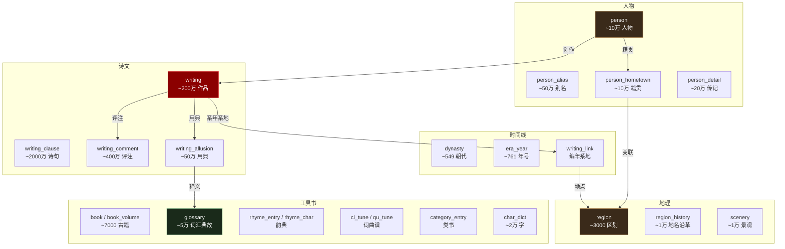

---

## 二、分析维度总览

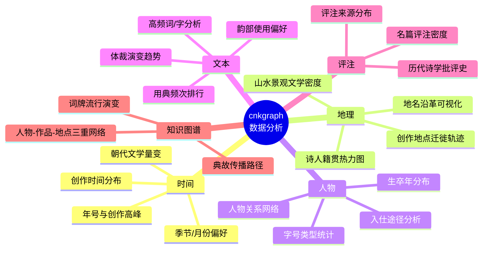

---

## 三、逐维度详解

### 3.1 时间维度 — 文学的时间线

**数据来源**：dynasty + era_year + writing_link(DateTime) + writing(author_date_raw)

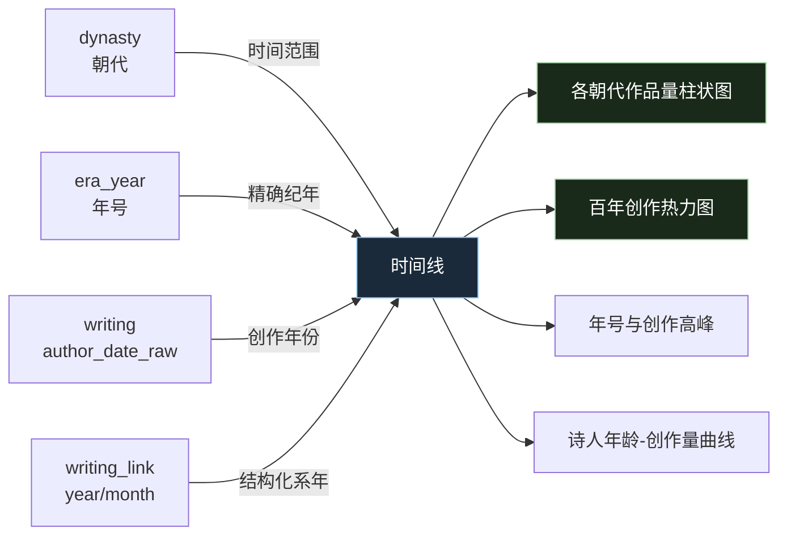

| 分析项 | SQL 思路 | 价值 |
|--------|---------|------|
| 各朝代作品量排行 | `SELECT dynasty, COUNT(*) FROM writing GROUP BY dynasty ORDER BY COUNT(*) DESC` | 直观了解文学产出分布 |
| 某朝代内百年热力图 | 解析 `author_date_raw` 提取年份，按 50 年分桶 | 观察朝代内部的文学兴衰周期 |
| 年号与创作高峰 | JOIN era_year，按年号统计 writing 数量 | 哪些年号催生了大量创作（如开元盛世） |
| 诗人创作年龄曲线 | person.birth_year + writing.author_date_raw 计算创作时年龄 | 李白、杜甫等大诗人的创作高峰期 |

**特色分析**：唐朝内各子时期（初唐/盛唐/中唐/晚唐）的创作量对比，可视化唐诗由盛转衰的过程。

---

### 3.2 地理维度 — 文学的空间分布

**数据来源**：region + region_history + scenery + person_hometown + writing_link(Region) + writing(author_place_raw)

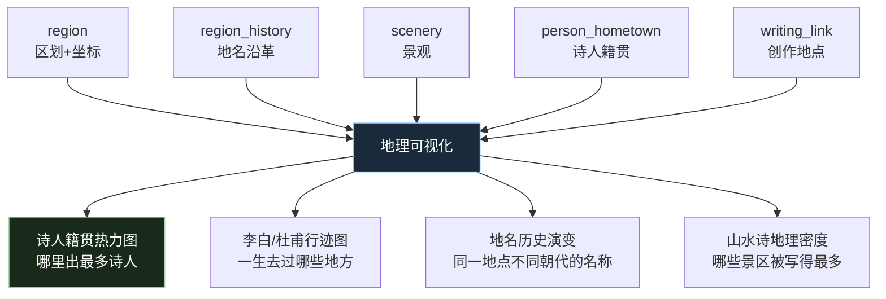

| 分析项 | SQL 思路 | 价值 |
|--------|---------|------|
| 诗人籍贯分布 | `SELECT region_id, COUNT(*) FROM person_hometown GROUP BY region_id` JOIN region 取坐标 | 热力图展示"文学地图" |
| 单诗人行迹 | 某作者所有 writing_link(Region) 按时间排序 | 可视化诗人的地理迁徙 |
| 地名沿革 | `SELECT * FROM region_history WHERE region_id = ? ORDER BY begin_year` | 某地从古至今的名称变化 |
| 景观文学密度 | scenery JOIN writing（按 region 匹配） | 西湖/黄鹤楼等被写过多少次 |

**特色分析**：安史之乱前后唐诗创作地点的南移——从长安/洛阳向江南/四川转移。

---

### 3.3 人物维度 — 诗人群像

**数据来源**：person + person_alias + person_detail + person_hometown

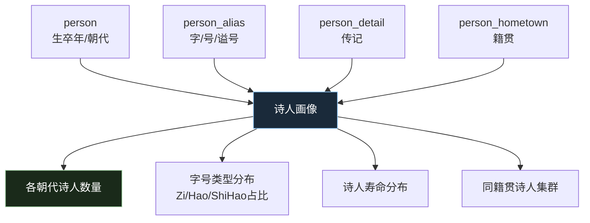

| 分析项 | SQL 思路 | 价值 |
|--------|---------|------|
| 诗人寿命统计 | birth_year - death_year，按朝代分组 | 古人寿命分布，哪个朝代诗人最长寿 |
| 字号类型统计 | `SELECT type, COUNT(*) FROM person_alias GROUP BY type` | 字/号/谥号/行第的占比 |
| 传记来源分布 | `SELECT book, COUNT(*) FROM person_detail GROUP BY book` | 哪些史料被引用最多 |
| 同乡诗人网络 | 按 hometown 的 region_id 聚类 | 江西诗派、吴中四士等地域文学团体 |

**特色分析**：唐代诗人的籍贯 + 活动区域 → 唐代文学地理学。

---

### 3.4 文本维度 — 诗词语料分析

**数据来源**：writing + writing_clause + writing_allusion + glossary + rhyme_entry + rhyme_char

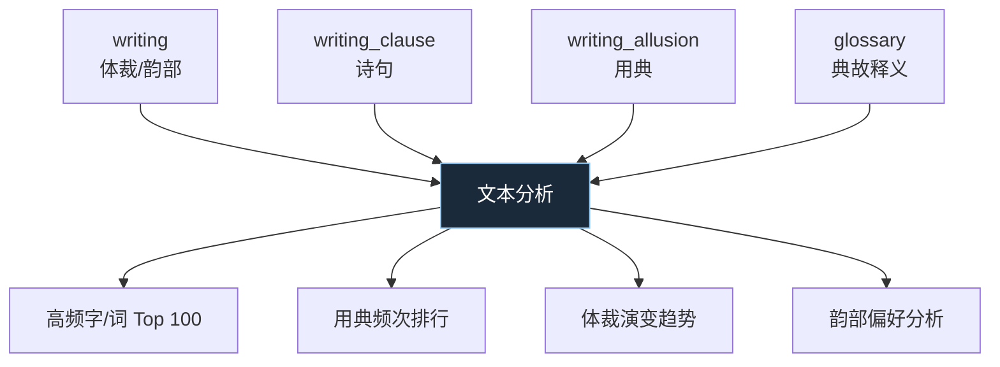

| 分析项 | SQL 思路 | 价值 |
|--------|---------|------|
| 高频字词 | `SELECT content FROM writing_clause`，分词统计 | 古诗中最常用的字/意象 |
| 用典排行 | `SELECT allusion_key, COUNT(*) FROM writing_allusion GROUP BY allusion_key ORDER BY COUNT(*) DESC` | 哪些典故被引用最多 |
| 体裁演变 | `SELECT dynasty, writing_type, COUNT(*) FROM writing GROUP BY dynasty, writing_type` | 绝句/律诗/词各朝代的消长 |
| 韵部偏好 | `SELECT rhyme, COUNT(*) FROM writing WHERE rhyme IS NOT NULL GROUP BY rhyme` | 哪些韵部最受欢迎 |

**特色分析**：唐宋两代用典差异 → 宋诗"以学问为诗"的量化证据。

---

### 3.5 评注维度 — 诗学批评史

**数据来源**：writing_comment + writing(title, dynasty)

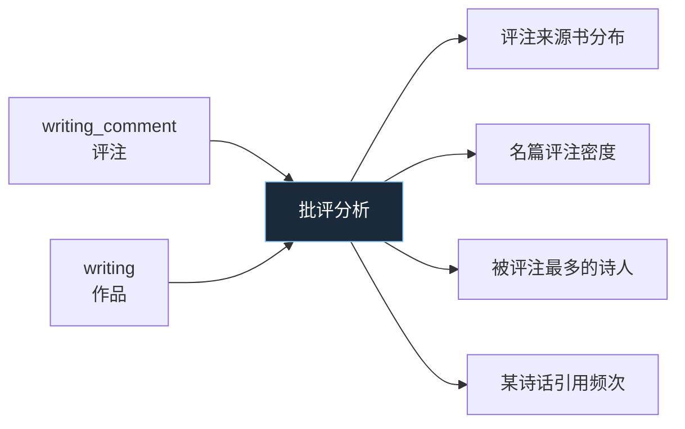

| 分析项 | SQL 思路 | 价值 |
|--------|---------|------|
| 评注来源书 Top 20 | `SELECT book, COUNT(*) FROM writing_comment GROUP BY book ORDER BY COUNT(*) DESC` | 哪些诗话/选本影响最大 |
| 评注最多的作品 | `SELECT writing_id, COUNT(*) FROM writing_comment GROUP BY writing_id ORDER BY COUNT(*) DESC` JOIN writing | 哪些诗最受历代评论家关注 |
| 被评注最多的诗人 | writing_comment JOIN writing → GROUP BY author_id | 杜甫是否被评注最多？ |
| 单部诗话覆盖范围 | `SELECT COUNT(DISTINCT writing_id) FROM writing_comment WHERE book = '沧浪诗话'` | 某部批评著作涉及多少作品 |

**特色分析**：以《沧浪诗话》《诗薮》等为核心，看历代批评家关注点的转移。

---

### 3.6 韵律维度 — 音韵学分析

**数据来源**：rhyme_entry + rhyme_char + writing(rhyme, first_clause_rhyme) + ci_tune + qu_tune

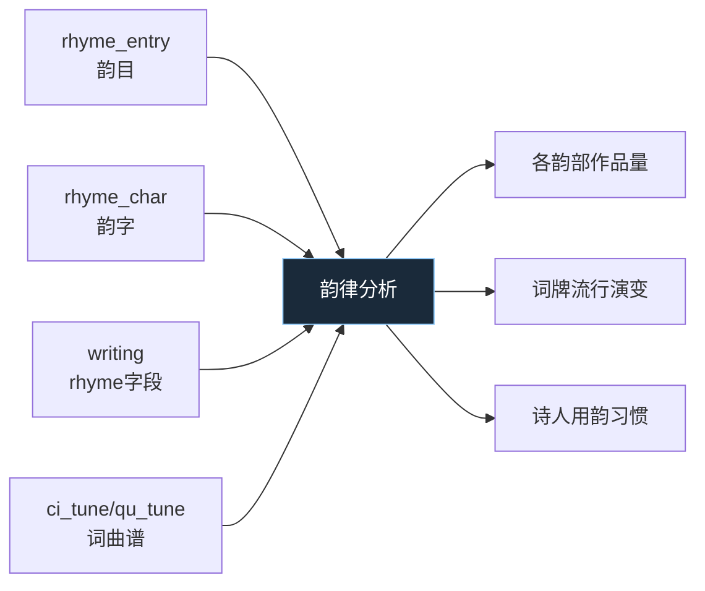

| 分析项 | SQL 思路 | 价值 |
|--------|---------|------|
| 韵部作品量 | `SELECT rhyme, COUNT(*) FROM writing GROUP BY rhyme` | 阳/文/真等韵部的使用频率 |
| 词牌流行度 | 统计 ci_tune 在 writing 中的出现次数 | 哪些词牌被填得最多 |
| 诗人用韵偏好 | 按作者分组统计 rhyme 分布 | 每位诗人的用韵特征 |

---

### 3.7 典故维度 — 文化基因传播

**数据来源**：writing_allusion + glossary + writing

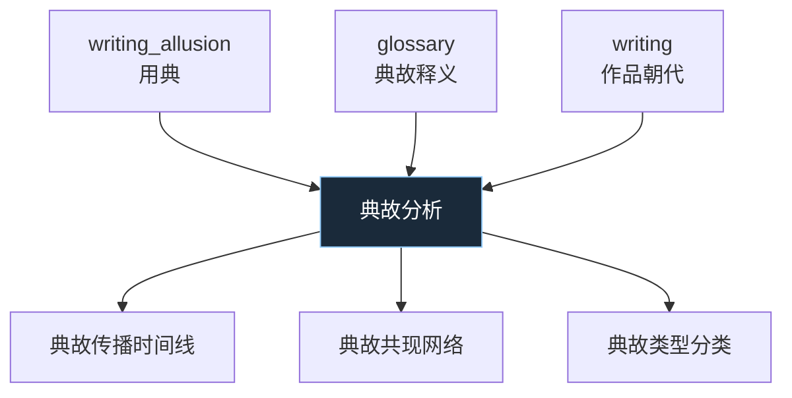

| 分析项 | SQL 思路 | 价值 |
|--------|---------|------|
| 典故传播轨迹 | 同一 allusion_key 在不同朝代的出现频次 | 某典故从何时开始流行 |
| 典故共现 | 同一首 writing 中出现的多组 allusion 关联 | 哪些典故经常被一起使用 |
| 典故类型 | glossary.glossary_type 分布 | 词典/典故/佛典各占多少 |

---

### 3.8 知识图谱 — 跨维度关联

**数据来源**：多表关联

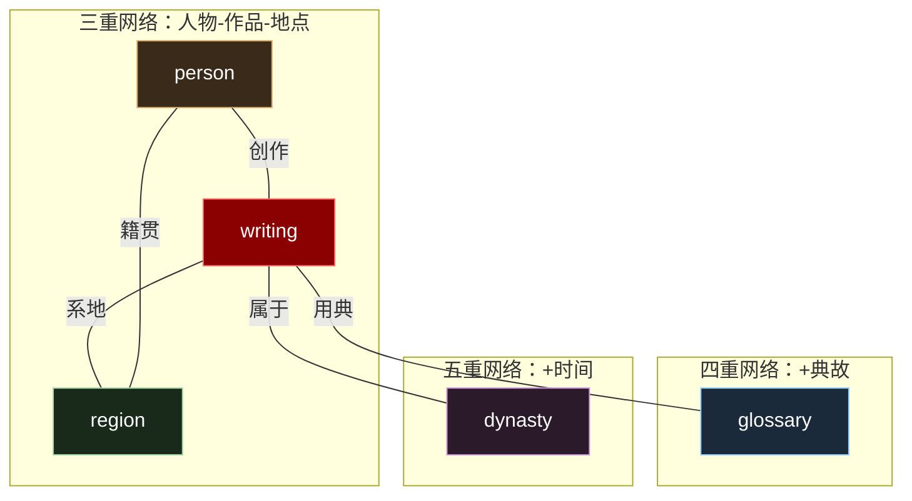

| 分析项 | 说明 |
|--------|------|
| 人物-地点二部图 | 哪些地点与哪些诗人关联最强 |
| 典故传播网络 | 典故从 A 诗人传到 B 诗人的路径 |
| 文学中心转移 | 按朝代统计作品最多的城市，展示文学中心的地理转移 |
| 全唐诗社交网络 | 互相引用/唱和的诗人关系图 |

---

## 四、与唐诗三百首项目结合

当前主项目（pinyin）有 310 首、77 位诗人。爬取 cnkgraph 数据后可以：

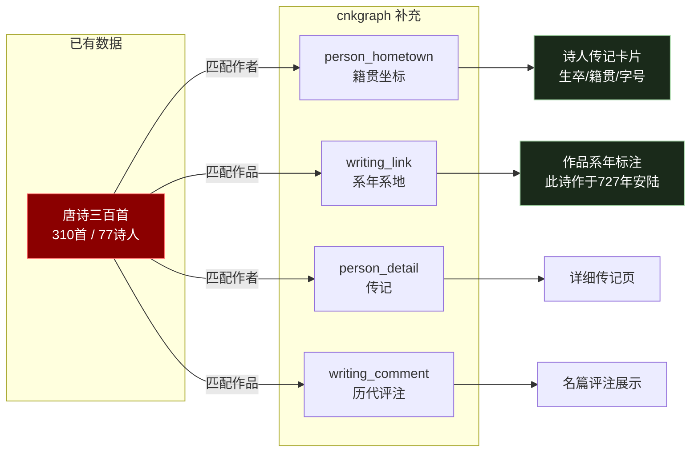

| 功能 | 所需表 | 数据量级 |
|------|--------|---------|
| 诗人传记卡片 | person + person_alias + person_hometown | 77 位诗人 |
| 作品系年标注 | writing_link (DateTime) | ~310 首的编年 |
| 作品系地标注 | writing_link (Region) + region | ~310 首的创作地点 |
| 历代评注展示 | writing_comment | 名篇可能有数十条评注 |
| 诗人行迹地图 | writing_link(Region) 按时间排序 | 李白 ~1000 首的地点 |

---

## 五、cnkgraph 官网已有分析功能

cnkgraph.com 本身提供了丰富的分析维度，可作为我们数据分析的参考和对标。

### 5.1 官网功能架构

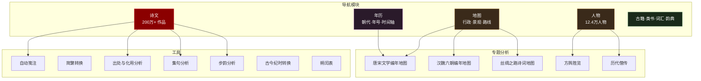

### 5.2 诗文检索与分析（200万+ 作品）

**筛选维度**：

| 筛选条件 | 细分选项 |
|---------|---------|
| 关键词搜索 | 题目 / 单句 / 奇数句 / 偶数句 / 位置精确匹配 |
| 作者过滤 | 姓 / 字 / 号 / 谥号 / 封号 / 籍贯 / 类别 |
| 朝代 | 15 个主要朝代 |
| 体裁 | 律诗 / 绝句 / 排律 / 词 / 散曲 / 赋 / 文 / 联 / 古体 / 乐府 / 偈颂 / 骚 / 四言 / 五言 / 六言 / 七言 |
| 韵部 | 平水韵 106 部 + 词林正韵 |

**分析功能**：
- **律诗用韵分析**：自动标注律诗的韵脚、韵部
- **统计分析**：按多维度统计作品分布

### 5.3 地图可视化

**功能**：
- 行政区域 / 景观 / 路线 三种模式
- 关键词搜索地点
- 省级概览（各省诗人和作品数量）
- 三种地图底图切换

### 5.4 人物检索（12.4万人物）

**筛选维度**：

| 筛选条件 | 说明 |
|---------|------|
| 创作者 / 被提及者 | 分开检索 |
| 关键词 | 姓 / 字 / 号 / 谥号 / 封号 / 籍贯 / 类别 |
| 时间范围 | 起止年份 |
| 朝代 | 38 个子时期（如初唐/盛唐/中唐/晚唐、北宋/南宋） |

**统计维度**：
- 按朝代统计人物数量
- 按籍贯统计人物分布
- 按分类统计（进士 / 僧尼 / 女性 / 等）

### 5.5 年历时间轴

- 完整朝代纪年体系
- 细分子时期（初唐/盛唐/中唐/晚唐、前汉/后汉 等）
- 年号索引与时间换算
- 朔闰表（古代历法辅助工具）

### 5.6 特色分析工具

| 工具 | 功能说明 | 对应数据表 |
|------|---------|-----------|
| 自动笺注 | 自动为诗文添加注释 | writing_allusion + glossary |
| 出处与化用分析 | 检测诗句的出处和化用关系 | writing_clause |
| 集句分析 | 分析集句诗的句子来源 | writing + writing_clause |
| 步韵分析 | 分析同韵作品的传承关系 | writing(rhyme) |
| 古今纪时转换 | 年号↔公元纪年换算 | era_year |
| 古今地名查询 | 地名历史沿革查询 | region + region_history |

### 5.7 官网博客揭示的分析方向

从官网博客文章标题可以看出更多深度分析方向：

- **用典分析**：典故的频次、传播路径、时代特征
- **字词统计**：高频意象、常用字的量化分析
- **人物关系网络**：通过"提及与被提及"构建人物关系图
- **人物再分类**：进士、僧尼、女性等群体的独立分析
- **地域文学**：特定区域的文学产出与风格特征

### 5.8 与我们分析规划的对照

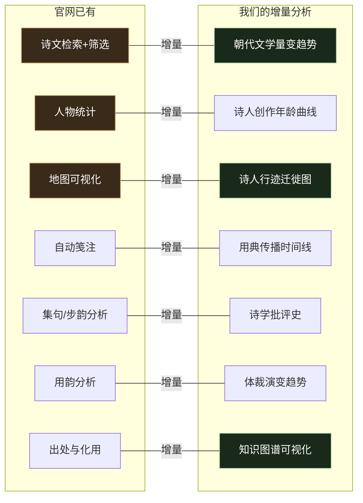

官网提供了**检索和展示**层面的功能，我们可以在**统计分析和可视化**层面做增量——特别是跨维度关联分析（时间×地理×人物×典故）和知识图谱方向，这是官网未深入展开的领域。

---

## 六、CBDB vs cnkgraph 对比分析

CBDB（中国历代人物传记资料库）是本项目的另一个数据源，已通过 dbt 同步到 DuckDB 数仓（77 张表、65.8 万人物）。本节对比两个数据源在分析能力上的差异与互补。

### 6.1 数据源定位

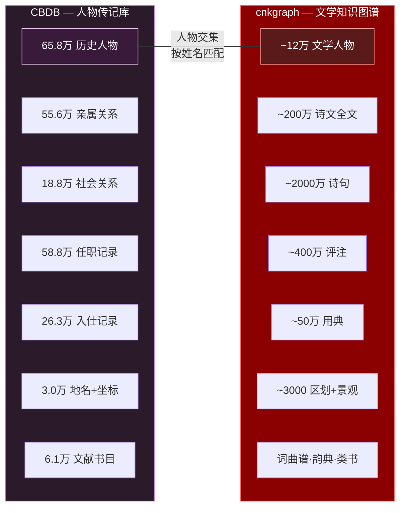

**一句话概括**：CBDB 回答"这个诗人是谁、经历了什么"，cnkgraph 回答"这个诗人写了什么、写得怎样"。

### 6.2 分析维度交叉矩阵

```mermaid
graph TD
    subgraph "重叠区域（两者都能做）"
        OVER1["人物基本信息<br/>姓名/生卒/朝代/别名"]
        OVER2["地理分布<br/>籍贯/地点/坐标"]
        OVER3["时间框架<br/>朝代/年号/纪年"]
        OVER4["人物检索<br/>按姓名/字号/朝代筛选"]
    end

    subgraph "CBDB 独有"
        U1["亲属关系网络<br/>KIN_DATA 55.6万条"]
        U2["社会关系网络<br/>ASSOC_DATA 18.8万条/498种"]
        U3["仕途轨迹<br/>POSTED_TO_OFFICE 58.8万条"]
        U4["入仕途径分析<br/>ENTRY_DATA 26.3万条"]
        U5["社会身份分类<br/>STATUS_DATA 7.1万条"]
        U6["郡望/民族/性别<br/>人口学特征"]
        U7["机构关联<br/>寺庙/书院/社团"]
    end

    subgraph "cnkgraph 独有"
        C1["诗文全文内容<br/>writing 200万+"]
        C2["诗句级分析<br/>writing_clause 2000万"]
        C3["用典分析<br/>writing_allusion 50万"]
        C4["历代评注<br/>writing_comment 400万"]
        C5["体裁/韵律分析<br/>律诗/绝句/词/韵部"]
        C6["词曲谱<br/>ci_tune / qu_tune"]
        C7["自动笺注<br/>出处与化用"]
        C8["景观文学密度<br/>scenery 1万+"]
    end

    OVER1 -.->|"互补"| U1
    OVER1 -.->|"互补"| C1
    OVER2 -.->|"互补"| U3
    OVER2 -.->|"互补"| C8

    style OVER1 fill:#2a2a1a,stroke:#ffd54f,color:#fff
    style OVER2 fill:#2a2a1a,stroke:#ffd54f,color:#fff
    style OVER3 fill:#2a2a1a,stroke:#ffd54f,color:#fff
    style OVER4 fill:#2a2a1a,stroke:#ffd54f,color:#fff
    style U1 fill:#2a1a2a,stroke:#ce93d8,color:#fff
    style U2 fill:#2a1a2a,stroke:#ce93d8,color:#fff
    style U3 fill:#2a1a2a,stroke:#ce93d8,color:#fff
    style C1 fill:#8B0000,stroke:#ff6b6b,color:#fff
    style C2 fill:#8B0000,stroke:#ff6b6b,color:#fff
    style C3 fill:#8B0000,stroke:#ff6b6b,color:#fff
```

### 6.3 详细对比表

| 分析维度 | CBDB | cnkgraph | 互补关系 |
|---------|------|----------|---------|
| **人物规模** | 65.8 万人（全历史） | ~12 万人（文学人物） | CBDB 更广；cnkgraph 专注文学 |
| **人物深度** | 性别/民族/郡望/籍贯 | 字号/谥号/籍贯 | 各有侧重，可合并 |
| **生卒年** | `c_birthyear` / `c_deathyear` | person 表 | 类似，CBDB 更全 |
| **亲属网络** | 55.6 万条、479 种亲属关系 | 无 | CBDB 独有 |
| **社会关系** | 18.8 万条、498 种关系（师友/推荐/政敌） | "提及/被提及"（弱关系） | CBDB 结构化更强 |
| **仕途轨迹** | 58.8 万条任职 + 地点 + 年份 | 无 | CBDB 独有 |
| **入仕途径** | 26.3 万条（进士/举荐/世袭等 272 种） | 无 | CBDB 独有 |
| **诗文内容** | 无（仅书目级文献 6.1 万部） | 200 万首全文 + 2000 万句 | cnkgraph 独有 |
| **单诗系年** | 无（仅文集级） | writing_link（编年系地） | cnkgraph 独有 |
| **诗句分析** | 无 | writing_clause 逐句 | cnkgraph 独有 |
| **用典分析** | 无 | writing_allusion 50 万条 + glossary | cnkgraph 独有 |
| **评注批评** | 无 | writing_comment 400 万条 | cnkgraph 独有 |
| **体裁分类** | 无 | 律诗/绝句/词/散曲/赋等 16 种 | cnkgraph 独有 |
| **韵律分析** | 无 | rhyme_entry + rhyme_char | cnkgraph 独有 |
| **词曲谱** | 无 | ci_tune + qu_tune | cnkgraph 独有 |
| **地理精度** | 3.0 万地名 + 坐标 + 时间范围 | 3000 区划 + 1 万景观 + 历史沿革 | CBDB 更广；cnkgraph 有景观 |
| **地名沿革** | ADDR_BELONGS_DATA（归属关系） | region_history（名称变化） | 互补 |
| **朝代年号** | 85 朝代 + 682 年号 | 549 朝代 + 761 年号 | cnkgraph 更细（含子朝代） |
| **坐标系统** | WGS-84（x_coord, y_coord） | latitude, longitude | 均可直接用于地图 |

### 6.4 互补分析场景

两个数据源结合后，可以做到任何单方做不到的分析：

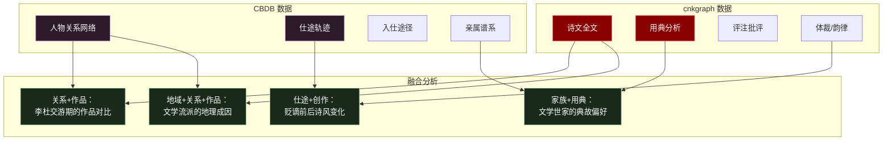

| 融合场景 | CBDB 提供 | cnkgraph 提供 | 分析价值 |
|---------|----------|-------------|---------|
| **关系+作品** | 师友/交游关系及年份 | 同期创作的诗文内容 | 交游期的作品风格对比（如李白杜甫 744 年相遇时各自的创作） |
| **仕途+创作** | 贬谪/升迁的时间地点 | 系年系地的作品 | 官场起伏对创作的影响（如韩愈贬潮州前后诗风变化） |
| **家族+用典** | 亲属关系、文学世家 | 用典偏好数据 | 家族内典故传承（如三苏的用典差异） |
| **地域+关系** | 籍贯、迁徙轨迹 | 创作地点、景观关联 | 文学流派的地理成因（如江西诗派的地域聚集） |
| **入仕+体裁** | 进士/举荐等入仕方式 | 诗/词/赋的体裁分布 | 科举制度对文学体裁的影响 |
| **人口学+文本** | 性别、民族、郡望 | 作品内容、评注 | 女性诗人的主题偏好、少数民族诗人的用典特征 |

### 6.5 数据规模对比

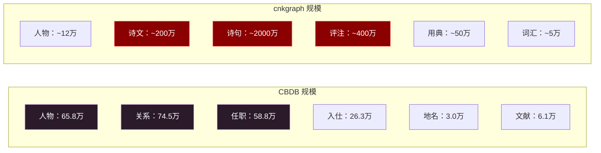

CBDB 以**人物为中心**做广（65.8 万人 × 多维生平），cnkgraph 以**文学为中心**做深（200 万诗文 × 多层分析）。数据量级上 cnkgraph 的文本数据（2000 万句、400 万评注）远大于 CBDB 的关系数据。

### 6.6 数据获取方式对比

| 维度 | CBDB | cnkgraph |
|------|------|----------|
| **获取方式** | 一次性下载 SQLite 文件（575 MB） | API 分阶段爬取（预估 13h） |
| **数据格式** | 关系型（77 张表，完整外键） | JSON API → DuckDB（25 张表） |
| **许可协议** | 学术免费、需标注来源 | 开放 API、限流 |
| **更新频率** | 年度版本（如 cbdb_20260523） | 在线实时 |
| **数据质量** | 经过哈佛大学学术团队审核 | 社区/机构维护 |
| **本地存储** | SQLite → DuckDB（dbt ETL） | 5 个独立 DuckDB 文件 |

### 6.7 结论

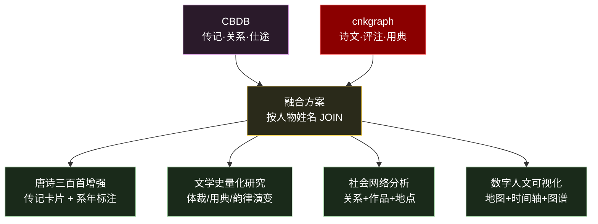

CBDB 和 cnkgraph 是**天然互补**的两个数据源。CBDB 回答诗人"是谁、经历了什么、与谁有关"，cnkgraph 回答"写了什么、怎么写的、后人怎么看"。两者通过人物姓名匹配（唐代 77 位诗人姓名唯一性极高），可以构建完整的**人物—生平—作品—评注—地理**多维分析体系。

---

## 七、分析优先级建议

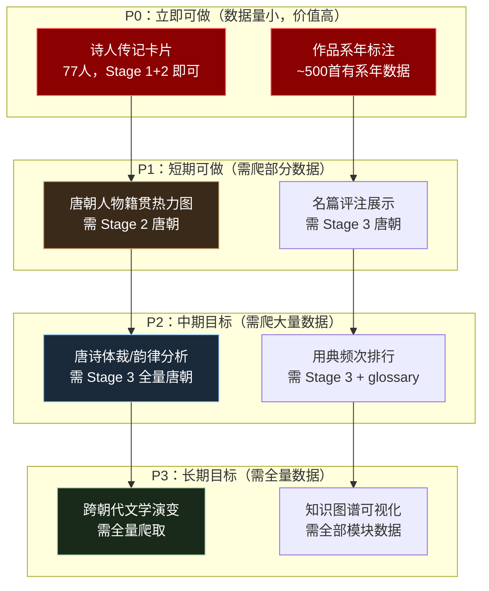

---

*文档日期：2026-06-03*
