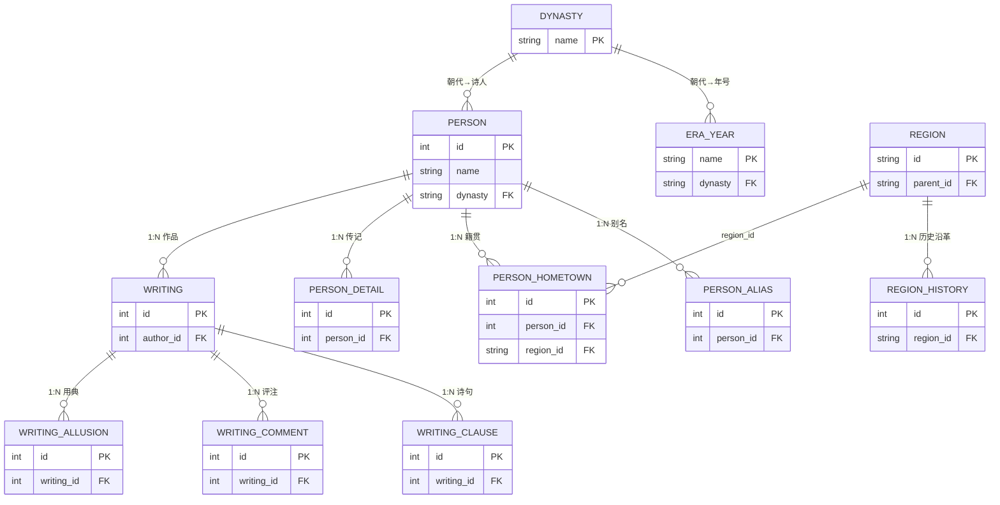
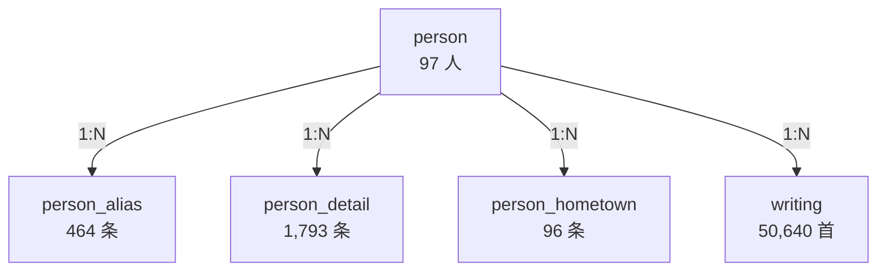
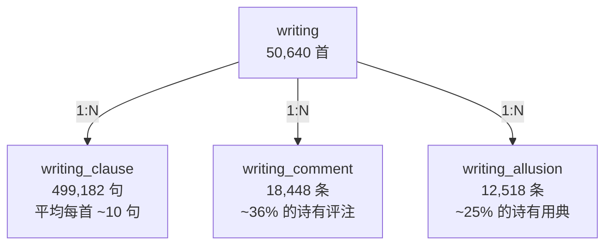
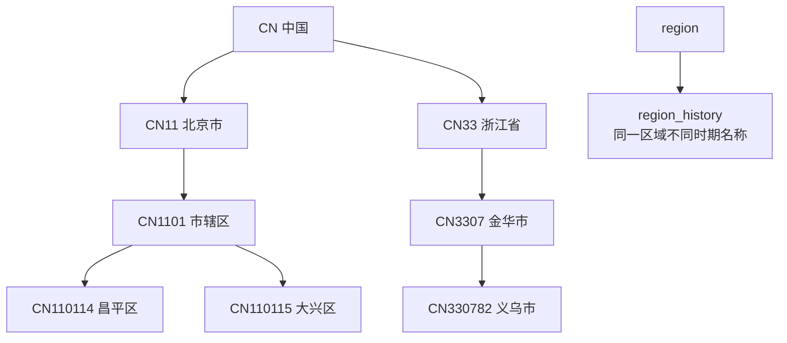
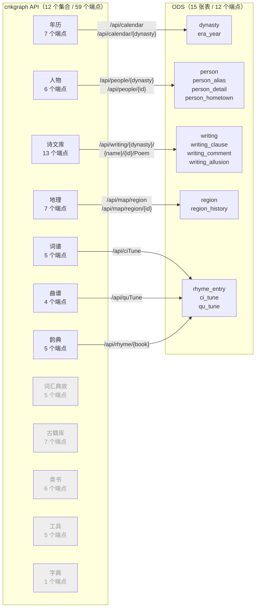
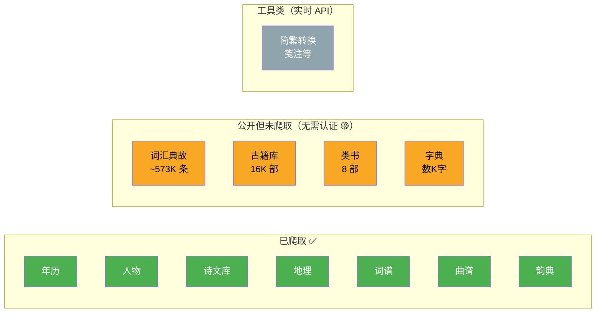

# cnkgraph ODS 数据字典

> 15 张表、597K 行数据，覆盖 97 位诗人、50,650 首诗文。本文档介绍每张表的结构、示例数据、表间关联关系。

***

## 1. 表总览与关联关系



### 按业务域分组

| 域 | 表 | 行数 | 说明 |
|----|-----|------|------|
| **年历** | dynasty | 549 | 中国历代朝代 |
| | era_year | 761 | 各朝代年号 |
| **人物** | person | 97 | 诗人基本信息 |
| | person_alias | 464 | 别名、字号 |
| | person_detail | 1,793 | 传记条目 |
| | person_hometown | 96 | 籍贯 |
| **作品** | writing | 50,640 | 诗文主表 |
| | writing_clause | 499,182 | 逐句拆分 |
| | writing_comment | 18,448 | 历代评注 |
| | writing_allusion | 12,518 | 用典 |
| **地理** | region | 372 | 区域主表 |
| | region_history | 10,453 | 历史沿革 |
| **参考** | rhyme_entry | 106 | 韵部 |
| | ci_tune | 818 | 词牌 |
| | qu_tune | 1,072 | 曲牌 |
| | **合计** | **597,369** | |

***

## 2. 年历域

### dynasty — 朝代表

全量爬取，记录中国从夏朝到清朝的所有朝代及起止年份。

| 字段 | 类型 | 说明 | 示例 |
|------|------|------|------|
| name | string PK | 朝代名称 | `唐朝` |
| begin_year | int | 起始年份（公元纪年，负数=BC） | `618` |
| end_year | int | 终止年份 | `907` |

```
name,begin_year,end_year
夏朝,-2029,-1559
商朝,-1575,-1039
...
唐朝,618,907
宋朝,960,1279
```

### era_year — 年号表

全量爬取，记录各朝代使用的年号。

| 字段 | 类型 | 说明 | 示例 |
|------|------|------|------|
| name | string | 年号名称 | `开元` |
| dynasty | string FK→dynasty | 所属朝代 | `唐朝` |
| begin_year | int | 起始年份 | `713` |
| end_year | int | 终止年份 | `741` |

```
name,dynasty,begin_year,end_year
开元,唐朝,713,741
贞观,唐朝,627,649
绍兴,宋朝,1131,1162
```

***

## 3. 人物域

### person — 诗人基本信息



| 字段 | 类型 | 说明 | 示例 |
|------|------|------|------|
| id | int PK | cnkgraph 唯一 ID | `17270` |
| name | string | 诗人姓名 | `杜甫` |
| surname | string | 姓氏 | `杜` |
| dynasty | string FK→dynasty | 朝代 | `唐朝` |
| birth_year | string | 出生年份 | `712` |
| death_year | string | 逝世年份 | `770` |
| birth_day | string | 出生日期 | |
| death_day | string | 逝世日期 | |

覆盖 7 个朝代：汉（1）、三国（1）、晋（1）、唐（79）、宋（9）、明（2）、清（4）。

```
id,name,surname,dynasty,birth_year,death_year,birth_day,death_day
17270,杜甫,,唐朝,712,770,,
34522,陆游,,宋朝,1125,1210,,
8894,陶潜,,晋朝,376,427,,
```

### person_alias — 别名字号

| 字段 | 类型 | 说明 | 示例 |
|------|------|------|------|
| id | int PK | 自增 ID | `1` |
| person_id | int FK→person | 诗人 ID | `21620` |
| name | string | 别名内容 | `观光` |
| type | string | 类型 | `Zi`（字） |
| source | string | 来源 | |

类型枚举（14 种）：`Zi`（字）、`Hao`（号）、`BieCheng`（别称）、`Ming`（名）、`FamousName`（世称）、`ShiHao`（谥号）等。

```
id,person_id,name,type,source
1,21620,四杰,Hao,
3,21620,观光,Zi,
```

### person_detail — 传记资料

| 字段 | 类型 | 说明 | 示例 |
|------|------|------|------|
| id | int PK | 自增 ID | `1` |
| person_id | int FK→person | 诗人 ID | `21620` |
| book | string | 资料来源书名 | `中国历代人名大辞典` |
| content | string | 传记正文 | `唐婺州义乌人。七岁能诗...` |
| is_review | bool | 是否为评述 | `false` |

平均每位诗人约 18 条传记记录。来源包括《中国历代人名大辞典》、《唐诗大辞典》、《全唐诗》等。

### person_hometown — 籍贯

| 字段 | 类型 | 说明 | 示例 |
|------|------|------|------|
| id | int PK | 自增 ID | `1` |
| person_id | int FK→person | 诗人 ID | `21620` |
| region_id | string FK→region | 地理区域 ID | `CN330782` |
| name | string | 籍贯描述 | `婺州义乌(今浙江义乌)` |

```
id,person_id,region_id,name
1,21620,CN330782,婺州义乌(今浙江义乌)
2,17226,CN410181,河南巩县
```

***

## 4. 作品域

### writing — 诗文主表



| 字段 | 类型 | 说明 | 示例 |
|------|------|------|------|
| id | int PK | 作品唯一 ID | `3423` |
| author_id | int FK→person | 作者 ID | `13897` |
| author_name | string | 作者姓名（冗余） | `李世民` |
| title | string | 标题 | `帝京篇十首` |
| dynasty | string | 时期 | `隋末唐初` |
| author_date_raw | string | 原始创作时间 | |
| author_place_raw | string | 原始创作地点 | |
| writing_type | string | 体裁大类 | `律诗` |
| type_detail | string | 体裁细类 | `WuLv` |
| rhyme | string | 韵部 | `鱼` |
| first_clause_rhyme | string | 首句入韵 | `侵` |
| rank | int | 排序权重 | `0` |
| preface | string | 小序/序言 | `予以万几之暇...` |
| note | string | 注释 | |

**体裁分布（top 10）**：

| 细类 | 数量 | 中文 |
|------|------|------|
| GuFeng | 12,048 | 古风 |
| QiJue | 11,650 | 七绝 |
| QiLv | 9,757 | 七律 |
| WuLv | 9,310 | 五律 |
| WuJue | 2,173 | 五绝 |
| Ci | 2,087 | 词 |
| WuPai | 1,698 | 五排 |
| SiYan | 621 | 四言 |
| YueFu | 617 | 乐府 |
| Others | 309 | 其他 |

**作品量 top 10 诗人**：陆游（9,393）、袁枚（4,563）、杨万里（4,299）、苏轼（3,318）、白居易（2,974）、王安石（1,774）、杜甫（1,464）、李白（1,060）、文天祥（986）、元稹（888）。

### writing_clause — 诗句

每首诗按句拆分，平均每首约 10 句。

| 字段 | 类型 | 说明 | 示例 |
|------|------|------|------|
| id | int PK | 自增 ID | `1` |
| writing_id | int FK→writing | 作品 ID | `3423` |
| idx | int | 句子序号（从 0 开始） | `0` |
| content | string | 诗句正文 | `秦川雄帝宅，` |
| rhyme_char | string | 押韵字 | |

```
id,writing_id,idx,content,rhyme_char
1,3423,0,秦川雄帝宅，
2,3423,1,函谷壮皇居。
3,3423,2,绮殿千寻起，
```

### writing_comment — 历代评注

约 36% 的作品至少有 1 条评注。来源包括《唐诗观澜集》、《网师园唐诗笺》等。

| 字段 | 类型 | 说明 | 示例 |
|------|------|------|------|
| id | int PK | 自增 ID | `1` |
| writing_id | int FK→writing | 作品 ID | `3423` |
| book | string | 评注来源 | `《唐诗观澜集》` |
| section | string | 章节 | |
| content | string | 评注正文 | `已开律径` |
| full_path | string | 完整路径 | `《唐诗观澜集》` |

### writing_allusion — 用典

约 25% 的作品记录了使用的典故。

| 字段 | 类型 | 说明 | 示例 |
|------|------|------|------|
| id | int PK | 自增 ID | `1` |
| writing_id | int FK→writing | 作品 ID | `3426` |
| allusion_index | int | 典故序号 | `1` |
| allusion_key | string | 典故关键词 | |
| sentence_index | int | 所在句子索引 | `1` |

***

## 5. 地理域

### region — 区域主表

全量爬取，编码格式为 `CN` + 行政区划码。



| 字段 | 类型 | 说明 | 示例 |
|------|------|------|------|
| id | string PK | 区域 ID | `CN330782` |
| name | string | 区域名称 | `义乌市` |
| latitude | float | 纬度 | `29.305` |
| longitude | float | 经度 | `120.075` |
| parent_id | string FK→region | 上级区域 | `CN3307` |
| people_count | int | 关联人物数 | `12` |
| has_child | bool | 是否有子区域 | `false` |

### region_history — 区域历史沿革

记录同一地理区域在不同时期的名称变迁。

| 字段 | 类型 | 说明 | 示例 |
|------|------|------|------|
| id | int PK | 自增 ID | `1` |
| region_id | string FK→region | 当前区域 ID | `CN11` |
| history_id | string | 历史区域 ID | `CN11` |
| name | string | 历史名称 | `大都` |
| new_name | string | 现代名称 | `北京市` |
| type | string | 行政区类型 | `郡` |
| begin_year | int | 起始年份 | `1267` |
| end_year | int | 终止年份 | `1368` |
| begin_reason | string | 变更原因 | `元朝` |
| end_reason | string | 废止原因 | |
| belong_to | string | 上级归属 | |
| external_id | string | 外部关联 ID | |
| latitude | float | 纬度 | |
| longitude | float | 经度 | |

```
id,region_id,name,new_name,type,begin_year,end_year
1,CN11,大都,北京市,郡,1267,1368
2,CN11,京师,北京市,州,1280,1367
3,CN11,北京,北京市区,省,1403,1911
```

***

## 6. 参考数据域

### rhyme_entry — 韵部

平水韵 106 韵部 + 中华新韵。

| 字段 | 类型 | 说明 | 示例 |
|------|------|------|------|
| id | int PK | 自增 ID | `1` |
| book | string | 韵书名称 | `平水韵` |
| name | string | 韵部名称 | `一东` |
| chars | string | 该韵部收录的字 | |

### ci_tune — 词牌

| 字段 | 类型 | 说明 | 示例 |
|------|------|------|------|
| id | int PK | 词牌 ID | `1` |
| name | string | 词牌名称 | `归字谣` |
| type | string | 类型（Ping/Ze） | `Ping` |
| aliases | string | 别名（`|` 分隔） | `苍梧谣\|十六字令` |
| desc | string | 说明 | `蔡伸词名《苍梧谣》...` |
| writing_count | int | 关联词作数 | `251` |

### qu_tune — 曲牌

| 字段 | 类型 | 说明 | 示例 |
|------|------|------|------|
| id | int PK | 曲牌 ID | `1` |
| name | string | 曲牌名称 | `喜迁莺` |
| path | string | 路径 | `北曲/黃鍾宮` |
| aliases | string | 别名 | |
| name_comment | string | 名称注释 | |
| writing_count | int | 关联曲作数 | `12` |

***

## 7. API 端点与 ODS 表对应关系

cnkgraph 提供了 12 个 Postman 集合共 **59 个 API 端点**，我们的爬虫使用了其中 **12 个端点**，产出 **15 张 ODS 表**。

### 总览



灰色节点 = **未爬取的 API 集合**（词汇典故、古籍库、类书、工具、字典）。

### 逐表对应

#### 年历域 → dynasty + era_year

| ODS 表 | API 端点 | 方法 | 说明 |
|--------|----------|------|------|
| dynasty | `/api/calendar` | GET | 返回所有朝代列表 |
| era_year | `/api/calendar/{dynasty}` | GET | 返回某朝代所有年号 |

**API 字段 → ODS 字段映射**：

```
/api/calendar 响应:
  Dynasties[].Name        → dynasty.name
  Dynasties[].BeginYear   → dynasty.begin_year
  Dynasties[].EndYear     → dynasty.end_year

/api/calendar/{dynasty} 响应:
  EraYears[].Name         → era_year.name
  EraYears[].Dynasty      → era_year.dynasty
  EraYears[].BeginYear    → era_year.begin_year
  EraYears[].EndYear      → era_year.end_year
```

**Postman 集合**：`年历.postman_collection.json`（7 个端点，我们用了 2 个）

未使用的端点：`/api/calendar/eraYear/{id}`、`/api/calendar/date/{date}`、`/api/calendar/GanZhi/{ganzhi}`、`/api/calendar/date/{date}/links`。

#### 人物域 → person + 3 张子表

| ODS 表 | API 端点 | 方法 | 说明 |
|--------|----------|------|------|
| person | `/api/people/{dynasty}` | GET | 获取诗人列表（含 ID） |
| person + 子表 | `/api/people/{id}` | GET | 获取诗人详情（含别名、籍贯、传记） |

**API 字段 → ODS 字段映射**：

```
/api/people/{dynasty} 响应:
  People[].Id    → person.id（用于后续详情请求）
  People[].Name  → person.name（用于匹配诗人名单）

/api/people/{id} 响应:
  Person.Id             → person.id
  Person.Name           → person.name
  Person.Surname        → person.surname
  Profile.BirthYear     → person.birth_year
  Profile.DeathYear     → person.death_year
  Profile.BirthDay      → person.birth_day
  Profile.DeathDay      → person.death_day
  Profile.Aliases[]     → person_alias（多条）
    .Name               → person_alias.name
    .Type               → person_alias.type
    .Source             → person_alias.source
  Profile.Hometown[]    → person_hometown（多条）
    .RegionId           → person_hometown.region_id
    .Name               → person_hometown.name
  Person.Details[]      → person_detail（多条）
    .Book               → person_detail.book
    .Content            → person_detail.content
    .IsReview           → person_detail.is_review
```

**Postman 集合**：`人物.postman_collection.json`（6 个端点，我们用了 2 个）

未使用的端点：`/api/people`（总览）、`POST /api/people/find`（按籍贯/姓氏/谥号搜索）。

#### 作品域 → writing + 3 张子表

| ODS 表 | API 端点 | 方法 | 说明 |
|--------|----------|------|------|
| writing + 子表 | `/api/writing/{dynasty}/{name}/{id}/Poem?pageNo=N` | GET | 分页获取某诗人全部诗作 |

**API 字段 → ODS 字段映射**：

```
/api/writing/{dynasty}/{name}/{id}/Poem 响应:
  Writings[].Id              → writing.id
  Writings[].AuthorId        → writing.author_id
  Writings[].AuthorName      → writing.author_name
  Writings[].Title           → writing.title
  Writings[].Dynasty         → writing.dynasty
  Writings[].AuthorDateRaw   → writing.author_date_raw
  Writings[].AuthorPlaceRaw  → writing.author_place_raw
  Writings[].WritingType     → writing.writing_type
  Writings[].TypeDetail      → writing.type_detail
  Writings[].Rhyme           → writing.rhyme
  Writings[].FirstClauseRhyme→ writing.first_clause_rhyme
  Writings[].Rank            → writing.rank
  Writings[].Preface         → writing.preface
  Writings[].Note            → writing.note
  Writings[].Clauses[]       → writing_clause（多条）
    .Idx                     → writing_clause.idx
    .Content                 → writing_clause.content
    .RhymeChar               → writing_clause.rhyme_char
  Writings[].Comments[]      → writing_comment（多条）
    .Book                    → writing_comment.book
    .Section                 → writing_comment.section
    .Content                 → writing_comment.content
    .FullPath                → writing_comment.full_path
  Writings[].Allusions[]     → writing_allusion（多条）
    .Index                   → writing_allusion.allusion_index
    .Key                     → writing_allusion.allusion_key
    .SentenceIndex           → writing_allusion.sentence_index
```

**Postman 集合**：`诗文库.postman_collection.json`（13 个端点，我们用了 1 个）

未使用的端点：`/api/writing/{id}`（单篇详情）、`/api/writing/couplet/{words}`（对仗搜索）、`POST /api/writing/find`（组合搜索）、`/api/writing/{id}/tones`（平仄标注）、`/api/writing/{id}/labelize`（自动笺注）等。

#### 地理域 → region + region_history

| ODS 表 | API 端点 | 方法 | 说明 |
|--------|----------|------|------|
| region | `/api/map/region` | GET | 行政区划总览 |
| region + history | `/api/map/region/{id}` | GET | 某区域详情及历史沿革 |

**API 字段 → ODS 字段映射**：

```
/api/map/region 响应:
  Regions[].Id          → region.id
  Regions[].Name        → region.name
  Regions[].Latitude    → region.latitude
  Regions[].Longitude   → region.longitude
  Regions[].ParentId    → region.parent_id
  Regions[].PeopleCount → region.people_count
  Regions[].HasChild    → region.has_child

/api/map/region/{id} 响应:
  Region.Histories[]      → region_history（多条）
    .Id                   → region_history.history_id
    .Name                 → region_history.name
    .NewName              → region_history.new_name
    .Type                 → region_history.type
    .BeginYear            → region_history.begin_year
    .EndYear              → region_history.end_year
    .BeginReason          → region_history.begin_reason
    .EndReason            → region_history.end_reason
    .BelongTo             → region_history.belong_to
    .ExternalId           → region_history.external_id
    .Latitude             → region_history.latitude
    .Longitude            → region_history.longitude
```

**Postman 集合**：`地理.postman_collection.json`（7 个端点，我们用了 2 个）

未使用的端点：`/api/map/region/{name}`（按名称查询）、`/api/map/scenery/{id}`（景观查询）等。

#### 参考数据域 → rhyme_entry + ci_tune + qu_tune

| ODS 表 | API 端点 | 方法 | 说明 |
|--------|----------|------|------|
| ci_tune | `/api/ciTune` | GET | 词牌总览 |
| qu_tune | `/api/quTune` | GET | 曲牌总览 |
| rhyme_entry | `/api/rhyme/{book}` | GET | 某韵书的韵目 |

**API 字段 → ODS 字段映射**：

```
/api/ciTune 响应:
  CiTunes[].Id            → ci_tune.id
  CiTunes[].Name          → ci_tune.name
  CiTunes[].Content.Type  → ci_tune.type
  CiTunes[].Content.Aliases → ci_tune.aliases（| 分隔）
  CiTunes[].Content.Desc  → ci_tune.desc
  CiTunes[].Content.WritingCount → ci_tune.writing_count

/api/quTune 响应:
  QuTunes[].Id            → qu_tune.id
  QuTunes[].Name          → qu_tune.name
  QuTunes[].Content.Path  → qu_tune.path
  QuTunes[].Content.Aliases → qu_tune.aliases
  QuTunes[].Content.NameComment → qu_tune.name_comment
  QuTunes[].Content.WritingCount → qu_tune.writing_count

/api/rhyme/{book} 响应:
  Categories[].Name       → rhyme_entry.name
  Categories[].Chars      → rhyme_entry.chars
  （book 为路径参数）       → rhyme_entry.book
```

**Postman 集合**：`词谱.postman_collection.json`（5 个端点用了 1 个）、`曲谱.postman_collection.json`（4 个端点用了 1 个）、`韵典.postman_collection.json`（5 个端点用了 1 个）。

### 未爬取的 API 集合

| Postman 集合 | 端点数 | 内容 | 是否计划爬取 |
|-------------|--------|------|-------------|
| 词汇、典故 | 5 | 词典、典故、佛典 | 可选 |
| 古籍库 | 7 | 四部全书全文 | 数据量极大 |
| 类书 | 6 | 古今图书集成等 | 可选 |
| 工具 | 5 | 繁简转换、笺注、出处分析 | 实时 API，不适合批量爬取 |
| 字典 | 1 | 单字查询 | 可选 |

**验证结果（2026-06-05 修正）**：上述 5 个集合共 22 个端点实际为 **公开 API，无需认证**。之前误判为需要微信认证是因为使用了错误的 URL 路径。正确路径（小写）均可正常返回 JSON 数据。

数据量估算（二分法探查）：

| API 类型 | 端点路径 | 预估记录数 |
|---------|---------|-----------|
| 词典 | `/api/glossary/词典/{id}` | **~525K** 条 |
| 典故 | `/api/glossary/典故/{id}` | **~11K** 条 |
| 佛典 | `/api/glossary/佛典/{id}` | **~37K** 条 |
| 古籍库 | `/api/book` | **16,221** 部（含多卷全文） |
| 类书 | `/api/category` | **8** 部大类书 |
| 字典 | `/api/char/{char}` | 数千汉字 |
| 工具 | `/api/tool/*` | 实时工具，非数据 |



### 汇总

| 维度 | 数量 |
|------|------|
| API 集合总数 | 12 |
| API 端点总数 | 59 |
| 已使用端点 | 12 |
| 未使用端点 | 47（公开可访问，待决策是否爬取） |
| 产出 ODS 表 | 15 |
| 未爬取集合 | 5（词汇典故~573K、古籍库16K部、类书8部、工具、字典） |

***

## 8. 数据特征总结

### 全量表 vs 过滤表

| 类型 | 表 | 说明 |
|------|-----|------|
| **全量** | dynasty, era_year | 所有朝代和年号 |
| **全量** | region, region_history | 所有地理区域 |
| **全量** | rhyme_entry, ci_tune, qu_tune | 所有韵部、词牌、曲牌 |
| **过滤** | person, person_alias, person_detail, person_hometown | 仅卷01-11涉及的 97 位诗人 |
| **过滤** | writing, writing_clause, writing_comment, writing_allusion | 仅 97 位诗人的作品 |

### 数据密度

| 指标 | 数值 |
|------|------|
| 诗人总数 | 97 |
| 人均别名 | 4.8 个 |
| 人均传记条目 | 18.5 条 |
| 作品总数 | 50,640 |
| 人均作品 | 522 首 |
| 首均诗句 | 9.9 句 |
| 有评注的作品比例 | ~36% |
| 有用典的作品比例 | ~25% |
