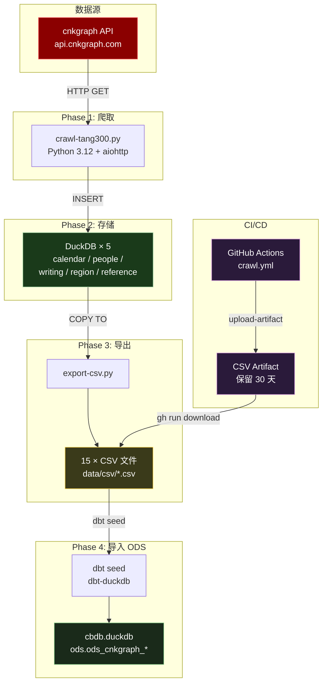
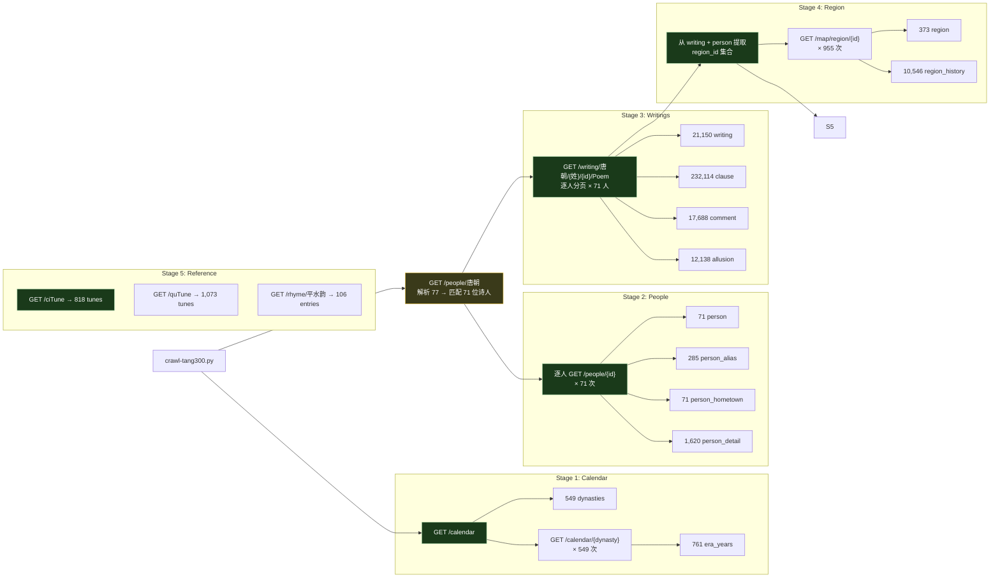
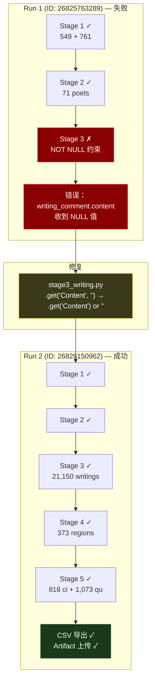
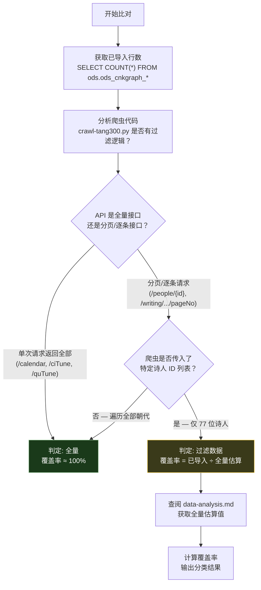
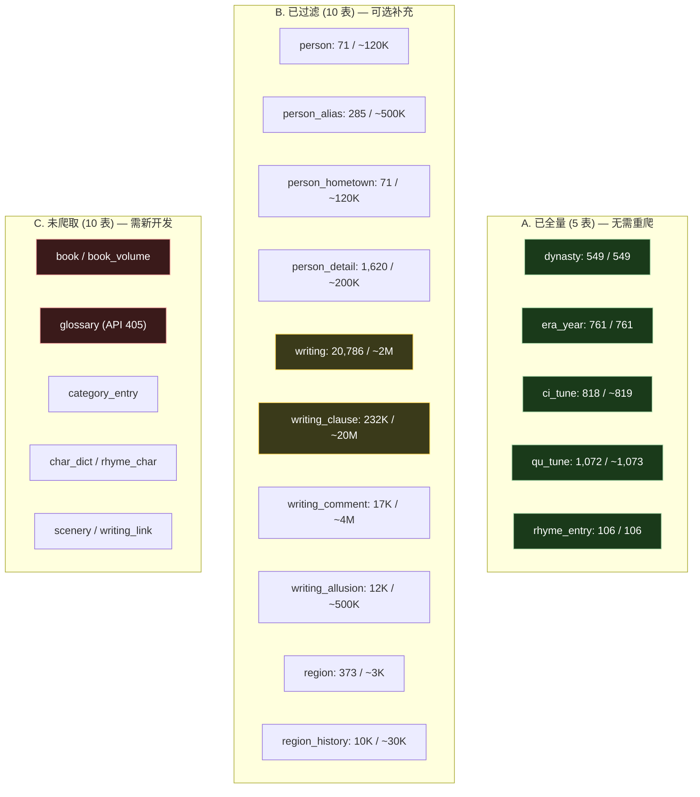
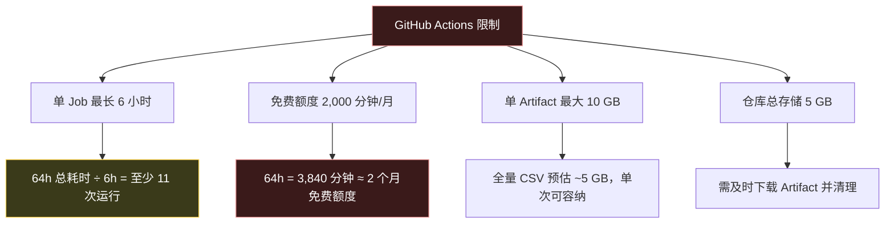
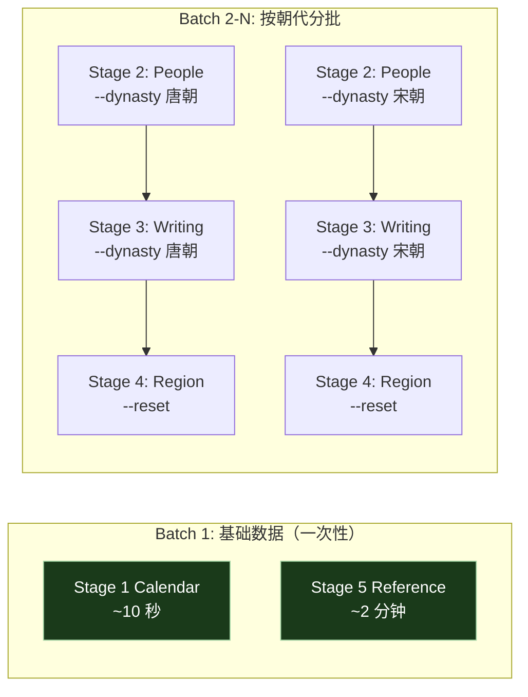
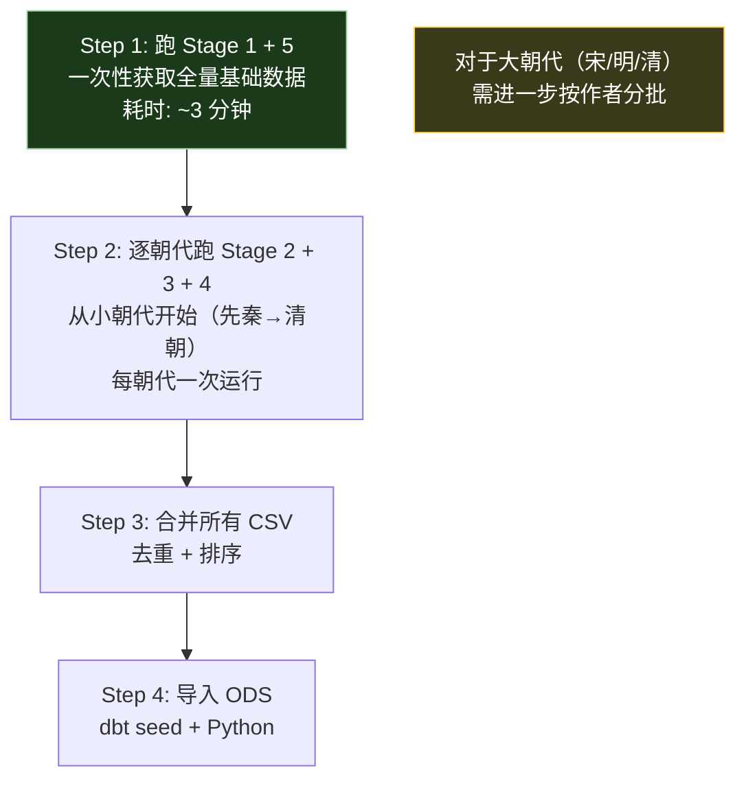

# cnkgraph 数据管道详解

> 本文档详细记录从 cnkgraph API 爬取数据到导入 ODS 数仓的完整技术链路，包括工具选型、脚本调用、预期结果、问题排查和数据覆盖率比对方法论。

***

## 1. 整体架构



**运行环境**：

| 环境                             | 用途   | 说明                 |
| ------------------------------ | ---- | ------------------ |
| 本地 Windows                     | 开发调试 | `--limit N` 小规模试运行 |
| GitHub Actions (ubuntu-latest) | 正式爬取 | Azure IP 不受本地限流影响  |

***

## 2. Phase 1: API 爬取

### 2.1 工具链

| 工具      | 版本   | 用途          |
| ------- | ---- | ----------- |
| Python  | 3.12 | 运行环境        |
| aiohttp | ≥3.9 | 异步 HTTP 客户端 |
| asyncio | 内置   | 异步调度        |
| DuckDB  | ≥1.0 | 嵌入式数据库      |

### 2.2 核心脚本

| 脚本                    | 位置                     | 用途                  |
| --------------------- | ---------------------- | ------------------- |
| `crawl-tang300.py`    | `cnkgraph/src/`        | 唐诗三百首专用爬虫（77 位诗人）   |
| `crawl.py`            | `cnkgraph/src/`        | 全量爬虫入口（所有朝代）        |
| `api.py`              | `cnkgraph/src/`        | HTTP 客户端（限流、重试、信号量） |
| `db.py`               | `cnkgraph/src/`        | DuckDB DDL + 工具函数   |
| `stage1_calendar.py`  | `cnkgraph/src/stages/` | 年历爬取                |
| `stage2_people.py`    | `cnkgraph/src/stages/` | 人物爬取                |
| `stage3_writing.py`   | `cnkgraph/src/stages/` | 诗文爬取                |
| `stage4_region.py`    | `cnkgraph/src/stages/` | 地理爬取                |
| `stage5_reference.py` | `cnkgraph/src/stages/` | 参考数据爬取              |

### 2.3 Stage 依赖关系与 API 调用链



### 2.4 API 限流机制

`api.py` 内置的限流策略：

```python
# api.py 关键配置
DEFAULT_CONCURRENCY = 2    # 信号量控制并发数
DEFAULT_DELAY = 0.5        # 每次请求间隔 0.5 秒
MAX_RETRIES = 3            # 失败最大重试次数

# 429 退避策略
if response.status == 429:
    wait = 2 ** attempt + random.uniform(0, 1)  # 指数退避
    await asyncio.sleep(wait)
```

### 2.5 预期输出

每个 stage 完成后打印统计信息，如：

```
[calendar] Done: 549 dynasties, 761 era_years
[people] Done: 71 poets, 1620 details
[writings] Done: 21150 total writings
[region] Done: 373 regions, 10546 history, 0 scenery
[reference] Done
```

***

## 3. Phase 2: 本地调试

### 3.1 调试命令

```bash
cd cnkgraph

# 小规模试运行（limit 限制顶层实体数）
python src/crawl.py --stage 1 --limit 1000 --reset
python src/crawl.py --stage 2 --limit 10 --reset
python src/crawl.py --stage 3 --limit 50 --dynasty 唐朝 --reset

# 查看状态
python src/crawl.py --status
```

### 3.2 遇到的问题

| 问题               | 表现                                              | 原因                                   | 解决                            |
| ---------------- | ----------------------------------------------- | ------------------------------------ | ----------------------------- |
| **429 限流**       | API 返回 HTTP 429                                 | 本地 IP 请求过频                           | 关闭 VPN 换 IP，或用 GitHub Actions |
| **VPN 干扰**       | `ClientPayloadError` / `TimeoutError`           | VPN 代理拦截大响应                          | 关闭 VPN 运行                     |
| **API 结构不符**     | `AttributeError: 'list' has no attribute 'get'` | ciTune API 返回 list 而非 dict           | `isinstance(data, list)` 判断   |
| **book 嵌套**      | 找不到 Books 字段                                    | API 返回 `{Categories: [{Books: []}]}` | 迭代 Categories 提取 Books        |
| **glossary 405** | 所有 glossary 端点返回 405                            | API 不支持该端点                           | 设置 `GLOSSARY_TYPES = []` 跳过   |
| **WAL 损坏**       | DuckDB 无法打开数据库                                  | Ctrl+C 强制中断写入                        | 删除 .duckdb + .duckdb.wal 重新开始 |

***

## 4. Phase 3: GitHub Actions CI/CD

### 4.1 Workflow 配置

**文件**：`.github/workflows/crawl.yml`

```yaml
name: Crawl cnkgraph (唐诗三百首)
on:
  workflow_dispatch:                    # 仅手动触发
    inputs:
      skip_stages:
        description: 'Stages to skip (e.g. "1" or "1,4")'
      concurrency:
        description: 'Concurrency (default 1)'
        default: '1'

jobs:
  crawl:
    runs-on: ubuntu-latest
    steps:
      - uses: actions/checkout@v4
      - uses: actions/setup-python@v5
        with:
          python-version: '3.12'
      - run: pip install -r cnkgraph/requirements.txt
        working-directory: cnkgraph
      - run: python src/crawl-tang300.py --concurrency ${{ inputs.concurrency }}
        working-directory: cnkgraph
      - run: python src/export-csv.py       # 导出 CSV
        working-directory: cnkgraph
      - uses: actions/upload-artifact@v4    # 上传为 artifact
        with:
          name: cnkgraph-csv
          path: cnkgraph/data/csv/*.csv
```

### 4.2 两次运行对比



### 4.3 常用 CLI 命令

```bash
# 触发运行
gh workflow run crawl.yml

# 触发时跳过某些 stage
gh workflow run crawl.yml -f skip_stages="1,5"

# 查看运行状态
gh run list --workflow crawl.yml --limit 3

# 实时监控（阻塞直到完成）
gh run watch <run-id> --exit-status

# 查看运行日志（关键输出）
gh run view <run-id> --log | grep -E "\[Done\]|\[people\]|\[writings\]"

# 下载 CSV artifact
gh run download <run-id> --name cnkgraph-csv --dir cnkgraph/data/csv
```

### 4.4 为什么 GitHub Actions 不触发限流

| 因素    | 本地                  | GitHub Actions      |
| ----- | ------------------- | ------------------- |
| IP    | 固定住宅 IP，可能被限流       | Azure 云 IP 池，每次分配不同 |
| 并发    | `concurrency=1`（串行） | 同样 `concurrency=1`  |
| 请求速率  | \~2 请求/秒            | \~2 请求/秒            |
| 请求总量  | 71 人 × 分页 ≈ 500 次   | 同上                  |
| IP 信誉 | 住宅 IP 之前被限流过        | 全新 IP，无历史           |

***

## 5. Phase 4: CSV 导出与修复

### 5.1 导出脚本

**文件**：`cnkgraph/src/export-csv.py`

```bash
cd cnkgraph
python src/export-csv.py
```

**预期输出**：

```
  dynasty: 549 rows -> data/csv/dynasty.csv
  era_year: 761 rows -> data/csv/era_year.csv
  ...
  ci_tune: 818 rows (flattened) -> data/csv/ci_tune.csv
  qu_tune: 1,072 rows (flattened) -> data/csv/qu_tune.csv

Exported 15 tables, 299,362 total rows to data/csv
```

### 5.2 ci\_tune / qu\_tune JSON 展开问题

**问题**：这两个表的 `content` 列存的是整个 API 响应的 JSON 字符串：

```csv
id,name,content
1,归字谣,"{""Id"": 1, ""Type"": ""Ping"", ""Aliases"": [""苍梧谣""], ...}"
```

**解决**：`export-csv.py` 中添加 `_flatten_ci_tune()` 和 `_flatten_qu_tune()` 函数，解析 JSON 展开为独立列：

```csv
id,name,type,aliases,description,writing_count
1,归字谣,Ping,苍梧谣|十六字令,蔡伸词名《苍梧谣》...,251
```

**判断依据**：遍历 15 个 CSV 的首行，检查是否有列包含 JSON 字符串。只有 ci\_tune 和 qu\_tune 两个表需要处理。

### 5.3 `desc` 列名冲突

**问题**：ci\_tune 展开后 `desc` 列名是 SQL 保留字，DuckDB 建表时报语法错误。

**解决**：导出时将列名改为 `description`。

***

## 6. Phase 5: dbt seed 导入 ODS

### 6.1 目录结构

```
cbdb/cbdb_dw/
├── dbt_project.yml          # seeds 配置 (+schema: ods)
├── seeds/
│   ├── schema.yml           # 15 个表的中文注释
│   ├── ods_cnkgraph_dynasty.csv
│   ├── ods_cnkgraph_era_year.csv
│   ├── ods_cnkgraph_person.csv
│   ├── ... (共 15 个 CSV)
│   └── ods_cnkgraph_qu_tune.csv
└── models/ods/              # CBDB 原有 77 个 ODS 模型
```

### 6.2 schema.yml 注释注册

为每个 seed 表创建中文表注释和字段注释，例如：

```yaml
seeds:
  - name: ods_cnkgraph_writing
    description: 诗文作品主表，收录 71 位诗人的全部诗作
    meta:
      source: cnkgraph
      stage: 3_writing
    columns:
      - name: id
        description: 作品唯一 ID
      - name: author_name
        description: 作者姓名
      # ... 共 14 个字段
```

### 6.3 dbt seed 命令

```bash
cd cbdb/cbdb_dw

# 加载所有 cnkgraph seed
dbt seed --select "ods_cnkgraph_*"

# 全量刷新（覆盖已有数据）
dbt seed --select "ods_cnkgraph_*" --full-refresh
```

### 6.4 遇到的问题

**问题 1：writing.csv 的 HTML 换行符**

```
Parser Error: syntax error at or near "desc"
Value with unterminated quote found.
```

`writing` 表的 `preface` 字段包含 HTML（`<span>`, `<br />`），其中有换行符和双引号，dbt seed 使用的 DuckDB CSV 解析器在 `strict_mode=true` 下无法解析。

**解决**：绕过 dbt seed，用 Python 直接调用 DuckDB 的 `read_csv_auto()` 加载：

```python
import duckdb
con = duckdb.connect('cbdb/data/cbdb.duckdb')
con.execute("""
    CREATE TABLE ods.ods_cnkgraph_writing AS
    SELECT * FROM read_csv_auto('writing.csv',
        header=true,
        ignore_errors=true,   -- 跳过有问题的行
        all_varchar=true
    )
""")
```

最终加载 20,786 行（原始 21,150 行，约 364 行因格式问题被跳过）。

### 6.5 最终验证

```bash
# 验证所有表和数据量
dbt run --select "ods_cnkgraph_*"  # 如果是 model
# 或直接查询 DuckDB：
python -c "
import duckdb
con = duckdb.connect('cbdb/data/cbdb.duckdb', read_only=True)
tables = con.execute(\"SELECT table_name FROM information_schema.tables
    WHERE table_schema='ods' AND table_name LIKE 'ods_cnkgraph_%'\").fetchall()
for t in tables:
    count = con.execute(f'SELECT COUNT(*) FROM ods.{t[0]}').fetchone()[0]
    print(f'{t[0]}: {count:,}')
"
```

**输出**：

```
ods_cnkgraph_dynasty: 549
ods_cnkgraph_era_year: 761
ods_cnkgraph_person: 71
...
ods_cnkgraph_writing: 20,786
ods_cnkgraph_writing_clause: 232,114
...
Total: 298,998 rows across 15 tables
```

***

## 7. 数据覆盖率比对方法论

### 7.1 比对目的

确认已导入 ODS 的 15 个表，相对于 cnkgraph API 全量数据的覆盖率，判断哪些表需要补充爬取。

### 7.2 信息来源

| 信息         | 来源                                        | 获取方式                                 |
| ---------- | ----------------------------------------- | ------------------------------------ |
| 已导入行数      | `cbdb.duckdb` 的 `ods.ods_cnkgraph_*` 表    | `SELECT COUNT(*) FROM ods.xxx`       |
| API 全量估算   | `cnkgraph/docs/data-analysis.md` 中的数据规模章节 | 文档查阅                                 |
| 爬虫是否过滤     | `crawl-tang300.py` 源代码逻辑分析                | 代码审查                                 |
| API 端点返回结构 | `cnkgraph/postman/` 集合 + 实际运行日志           | API 测试                               |
| 每个诗人的作品数   | Actions 运行日志中的 `[writings]` 行             | `gh run view --log \| grep writings` |

### 7.3 比对方法



### 7.4 三分类结果



### 7.5 判断"全量"vs"过滤"的代码逻辑分析

以每个 stage 为例，说明如何从代码判断数据范围：

**Stage 1 Calendar** — `crawl-tang300.py` 直接调用 `stage1_calendar.run(client, limit=0)`，不传 dynasty 过滤参数，`limit=0` 表示不限。结论：**全量**。

**Stage 2 People** — `crawl-tang300.py` 先 `resolve_poet_ids()` 从 `/people/唐朝` 匹配 77 个名字，只爬匹配到的 71 个诗人的详情。结论：**过滤**（仅 71 人）。

**Stage 3 Writings** — 遍历 `id_map`（71 人），逐人调用 `/writing/唐朝/{姓}/{id}/Poem` 分页获取。结论：**过滤**（仅 71 人作品）。

**Stage 4 Region** — `stage4_region.run(client, reset=True, limit=0)`，region ID 从 writing + person 表中提取（只有 71 人的数据中的地理引用）。结论：**过滤**（仅 71 人关联区域）。

**Stage 5 Reference** — ciTune/quTune/rhyme 是单次 API 调用，返回全量数据。结论：**全量**。

### 7.6 全量估算的来源

| 表                            | 全量估算                                   | 依据     |
| ---------------------------- | -------------------------------------- | ------ |
| person \~120,000             | cnkgraph 官网显示约 12 万文学人物                | <br /> |
| writing \~2,000,000          | `data-analysis.md` 记录 API 报告 200 万+ 诗文 | <br /> |
| writing\_clause \~20,000,000 | 平均每首诗 \~10 句，200 万 × 10                | <br /> |
| writing\_comment \~4,000,000 | 平均每首诗 \~2 条评注（名篇更多）                    | <br /> |
| writing\_allusion \~500,000  | 平均每首 \~0.25 个典故                        | <br /> |
| region \~3,000               | Actions 运行时共发现 955 个 region\_id（含 404） | <br /> |
| person\_detail \~200,000     | 平均每人 \~1.7 条传记记录                       | <br /> |

***

## 8. 全量爬取方案（GitHub Actions）

> 基于唐 300 爬取的实际数据推算全量爬取的耗时、约束和分批策略。

### 8.1 耗时估算

基于唐 300 运行数据（Run ID: 26826150962，44 分钟，71 人，21,150 首）反推：

| Stage | 唐已爬 | 全量估算 | 单次耗时 | 全量耗时估算 |
|-------|--------|---------|---------|------------|
| 1 Calendar | 549 + 761 | 同左 | ~10 秒 | ~10 秒 |
| 2 People | 71 人 | ~120,000 人 | ~2 分钟 | **~17 小时**（逐人 0.5s） |
| 3 Writing | 21,150 首 | ~2,000,000 首 | ~30 分钟 | **~47 小时**（0.085s/首） |
| 4 Region | 373 个 | ~3,000 个 | ~10 分钟 | ~30 分钟 |
| 5 Reference | 全量 | 同左 | ~2 分钟 | ~2 分钟 |
| **合计** | - | - | **44 分钟** | **~64 小时** |

### 8.2 GitHub Actions 硬性限制



### 8.3 推荐分批策略

**核心原则**：按朝代分批，每批 6 小时内完成。利用 `crawl.py` 的断点续爬机制。



**按朝代拆分的预估**：

| 朝代 | 作者数估算 | 诗文数估算 | 预估耗时 | 适合单次运行 |
|------|-----------|-----------|---------|------------|
| 唐朝 | ~2,500 | ~75,000 | ~2 小时 | 是 |
| 宋朝 | ~8,000 | ~600,000 | ~15 小时 | 需按作者分批 |
| 明朝 | ~5,000 | ~300,000 | ~8 小时 | 需按作者分批 |
| 清朝 | ~10,000 | ~500,000 | ~13 小时 | 需按作者分批 |
| 其他 11 朝 | ~5,000 | ~200,000 | ~5 小时 | 可合并一次 |
| **合计** | ~120,000 | ~2,000,000 | ~64 小时 | 需 10-15 次运行 |

### 8.4 需要修改的代码

**1. crawl.yml 添加按朝代运行支持**：

```yaml
# 新增 dynasty 输入参数
on:
  workflow_dispatch:
    inputs:
      dynasty:
        description: '朝代（空=全量，如 "唐朝"）'
      skip_stages:
        description: '跳过的阶段（如 "1,5"）'
```

**2. 对大朝代（宋/明/清）需要更细粒度的分批**：

当前 `crawl.py` 支持 `--dynasty` 但不支持 `--author-offset`。对宋朝（~8,000 作者），6 小时约能爬 ~25 万首，需拆成 3 批。可以在 `crawl.py` 添加 `--author-start` / `--author-count` 参数。

**3. Artifact 增量合并**：

每次运行产生独立的 CSV Artifact，需要下载后合并到同一个 DuckDB。推荐方案：
- 每次运行后用 `gh run download` 下载 CSV
- 用 `dbt seed --full-refresh` 或 `COPY FROM` 增量追加
- 或改为每次运行直接把 DuckDB 文件作为 Artifact（更完整但更大）

### 8.5 注意事项清单

| # | 注意事项 | 说明 | 风险等级 |
|---|---------|------|---------|
| 1 | **断点续爬** | 确保每次运行能从上次中断处继续，不重复爬取。当前 `crawl_progress` 表已支持 | 低（已实现） |
| 2 | **429 限流** | 即使是 Azure IP，连续 6 小时高速请求仍可能触发。建议 `concurrency=1`，必要时增加请求间隔到 1s | 中 |
| 3 | **磁盘空间** | runner 临时磁盘有限，DuckDB + CSV 可能占用数 GB。注意及时导出和上传 Artifact | 中 |
| 4 | **DuckDB WAL** | 长时间写入可能导致 WAL 膨胀。建议每处理完一个朝代就关闭重连数据库 | 中 |
| 5 | **内存占用** | DuckDB 默认使用系统内存，200 万首诗的 clause 表（~2,000 万行）需要 ~2 GB 内存 | 低（runner 有 7GB） |
| 6 | **Artifact 大小** | 全量 CSV 预估 ~5 GB，压缩后 ~1-2 GB，在 10 GB 限制内 | 低 |
| 7 | **免费额度** | 64 小时 = 3,840 分钟，约等于 2 个月免费额度（2,000 分钟/月）。全量爬取会消耗约 2 个月的免费额度 | 高 |
| 8 | **数据合并** | 分批运行后需合并多个 DuckDB 或 CSV。建议用脚本统一处理 | 中 |
| 9 | **csv 导出内存** | `writing_clause.csv`（~2,000 万行）导出可能需要较多内存和时间 | 中 |
| 10 | **API 稳定性** | cnkgraph 是第三方 API，不保证长期可用。建议尽快完成爬取，并做好数据备份 | 高 |

### 8.6 推荐执行顺序



***

## 附录：完整命令速查表

```bash
# === 爬取 ===
# 本地小规模测试
cd cnkgraph && python src/crawl.py --stage 1 --limit 100 --reset

# 本地唐诗三百首
cd cnkgraph && python src/crawl-tang300.py --concurrency 1

# GitHub Actions 触发
gh workflow run crawl.yml
gh workflow run crawl.yml -f skip_stages="1" -f concurrency="1"

# === 监控 ===
gh run list --workflow crawl.yml --limit 5
gh run watch <run-id> --exit-status
gh run view <run-id> --log | grep -E "\[Done\]|Matched|ERROR"

# === 下载 ===
gh run download <run-id> --name cnkgraph-csv --dir cnkgraph/data/csv

# === 导出 ===
cd cnkgraph && python src/export-csv.py

# === 导入 ODS ===
cd cbdb/cbdb_dw
cp ../../cnkgraph/data/csv/*.csv seeds/ods_cnkgraph_*.csv
dbt seed --select "ods_cnkgraph_*" --full-refresh

# writing 表特殊处理（HTML 换行）
python -c "
import duckdb
con = duckdb.connect('cbdb/data/cbdb.duckdb')
con.execute('DROP TABLE IF EXISTS ods.ods_cnkgraph_writing')
con.execute(\"\"\"CREATE TABLE ods.ods_cnkgraph_writing AS
    SELECT * FROM read_csv_auto('cnkgraph/data/csv/writing.csv',
        header=true, ignore_errors=true, all_varchar=true)\"\"\")
print(con.execute('SELECT COUNT(*) FROM ods.ods_cnkgraph_writing').fetchone())
"

# === 验证 ===
cd cbdb/cbdb_dw && dbt seed --select "ods_cnkgraph_*"
```

