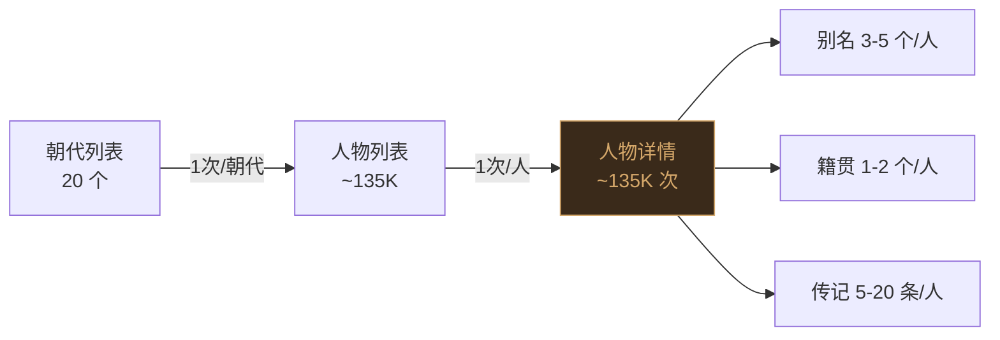
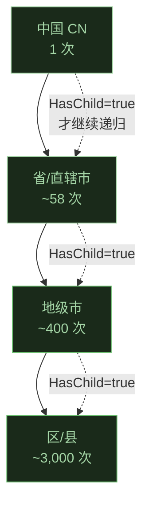
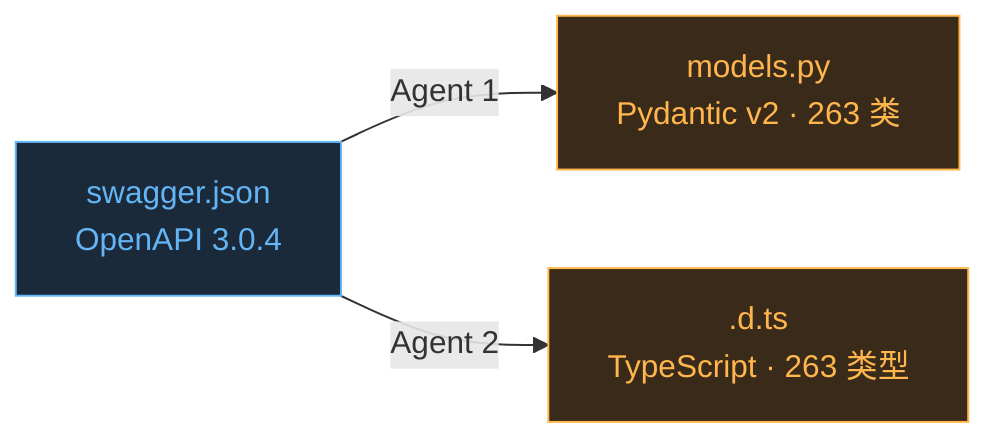
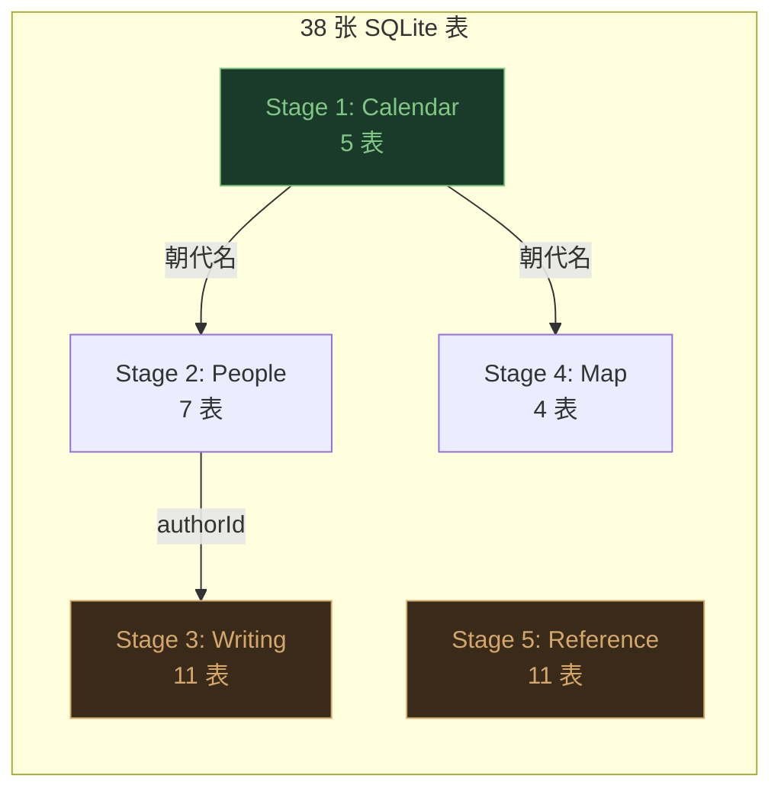
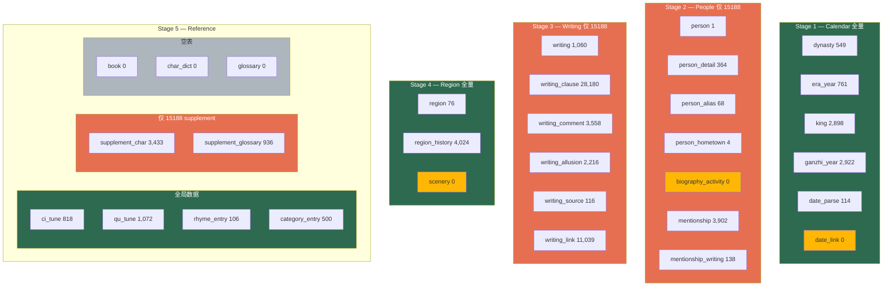
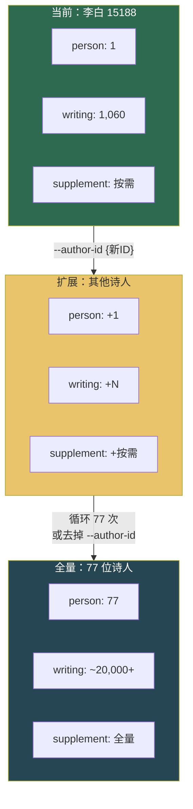

# cnkgraph 爬虫开发日志

## (一) 项目初始化 — 2026-06-02

**目标**：将 cnkgraph.com 全部开放数据（12 模块、71 端点、200 万+ 诗文）爬取到本地 DuckDB 数据库。

**技术决策**：

- Python 3.12 + aiohttp + asyncio + DuckDB
- 5 阶段爬取：年历 → 人物 → 诗文 → 地理 → 参考数据
- 支持细粒度爬取：按阶段、按朝代、按作者
- 断点续爬：crawl\_progress 表精确记录进度

**文件结构**：

```
cnkgraph/
├── src/
│   ├── crawl.py          # CLI 入口
│   ├── db.py             # DuckDB 建表
│   ├── api.py            # HTTP 客户端
│   └── stages/           # 各阶段爬虫
├── data/                 # DuckDB 数据库
├── docs/                 # PRD + devlog
└── postman/              # API 参考集合
```

**进度**：

- [x] PRD 文档编写（含细粒度爬取策略）
- [x] DDL 设计（25 张表 + 索引 + COMMENT ON）
- [x] 代码编写（db.py, api.py, crawl.py, stage1-5）
- [x] Stage 1 跑通
- [ ] Stage 2-5 待跑

### 代码文件说明

| 文件                               | 职责                                                                         |
| -------------------------------- | -------------------------------------------------------------------------- |
| `src/db.py`                      | DuckDB schema（25 张表 + crawl\_progress + 索引），含 helper 函数                    |
| `src/api.py`                     | aiohttp 异步 HTTP 客户端，Semaphore 并发控制，指数退避重试                                  |
| `src/crawl.py`                   | CLI 入口，argparse 解析 --stage/--dynasty/--author-id/--module/--status/--reset |
| `src/stages/stage1_calendar.py`  | 年历：dynasty + era\_year（\~500 次请求，\~3 min）                                  |
| `src/stages/stage2_people.py`    | 人物：person + alias + hometown + detail（\~5K 次，\~30 min）                     |
| `src/stages/stage3_writing.py`   | 诗文：writing + clause + comment + allusion（\~100K 次，\~2-10h）                 |
| `src/stages/stage4_region.py`    | 地理：region + history + scenery（\~3K 次，\~15 min）                             |
| `src/stages/stage5_reference.py` | 参考：book/glossary/rhyme/ciTune/quTune/category/char（\~32K 次，\~1h）           |

***

## (二) Stage 1 跑通 — 2026-06-02

### 结果

**549 个朝代（含子朝代）+ 761 个年号**，成功入库。

### 踩坑与解决

#### 坑 1：DuckDB 没有 `executescript` 方法

**现象**：`AttributeError: '_duckdb.DuckDBPyConnection' object has no attribute 'executescript'`

**原因**：Python `sqlite3` 有 `executescript()` 可一次执行多条 SQL，DuckDB 没有这个方法。

**解决**：手动 `split(";")` 拆分成单条语句逐条执行，跳过空语句和纯注释行。

#### 坑 2：DuckDB 不支持 `GENERATED ALWAYS AS IDENTITY`

**现象**：`Not implemented Error: Constraint not implemented!`

**原因**：DuckDB 不支持 SQL 标准的 `GENERATED ALWAYS AS IDENTITY` 语法。

**解决**：改用 `CREATE SEQUENCE` + `DEFAULT nextval('seq_name')`。关键点是 **sequence 必须在 CREATE TABLE 之前创建**，否则 `nextval` 引用会报 "Sequence does not exist"。所有 sequence 集中放在 DDL 最前面。

#### 坑 3：DuckDB 主键列不允许 NULL

**现象**：`NOT NULL constraint failed: crawl_progress.author_id`

**原因**：`crawl_progress` 表的复合主键 `(module, dynasty, author_id)` 中，DuckDB 不允许主键列为 NULL。当某阶段不按朝代/作者爬取时，`dynasty` 和 `author_id` 传入 `None`。

**解决**：引入哨兵值——`dynasty` 为 None 时存 `"__ALL__"`，`author_id` 为 None 时存 `-1`。封装 `_pk_dynasty()` 和 `_pk_author()` 函数统一处理。

#### 坑 4：DuckDB 不支持 `CURRENT_TIMESTAMP` 作为 VALUES 参数

**现象**：`Table "crawl_progress" does not have a column named "CURRENT_TIMESTAMP"`

**原因**：DuckDB 在参数化查询 `VALUES (?, ?, ..., CURRENT_TIMESTAMP)` 中无法识别 `CURRENT_TIMESTAMP` 函数。

**解决**：改用 Python `datetime.datetime.now()` 生成时间字符串，作为参数传入。

#### 坑 5：DuckDB 不支持前向外键引用

**现象**：`Table with name region does not exist!`

**原因**：`writing_link` 表有 `REFERENCES region(id)`，但 `region` 表在 DDL 后面才创建。DuckDB 要求被引用的表必须先存在。

**解决**：去掉 `writing_link.region_id` 上的 `REFERENCES region(id)` 约束（保留索引即可保证查询性能）。

#### 坑 6：API 响应结构与预期不符

**现象**：`era_year` 表 0 条记录——年号全丢了。

**原因**：代码假设 `/api/calendar/{dynasty}` 返回 `{EraYears: [...]}`，实际结构是 `{Dynasties: [{Kings: [{EraYears: [...]}]}]}`，年号嵌套在 朝代→帝王→年号 三层结构里。

**解决**：重写 `stage1_calendar.py`，遍历 `Dynasties → Kings → EraYears`。同时发现年号的 `BeginYear`/`EndYear` 是文本（如 `"618年(武德)"`）而非整数，新增 `_parse_year()` 提取数字（支持"前2029年"等负数）。

### 当前数据量

| 表         | 行数  | 说明                 |
| --------- | --- | ------------------ |
| dynasty   | 549 | 含子朝代（如 西周、东周、莒国 等） |
| era\_year | 761 | 历代年号               |
| 其他 21 张表  | 0   | 待爬取                |

***

## (三) Stage 2 尝试 — 限流问题 — 2026-06-02

### 现象

运行 `python src/crawl.py --stage 2 --dynasty 唐朝`，列表请求（`GET /api/people/唐朝`）成功拿到 \~4000 人物。但随后逐个获取人物详情（`GET /api/people/{id}`），**连续触发 429 限流**：

```
[ERROR] 429 on https://api.cnkgraph.com/api/people/15215: 请求的频率太高，请等待 00:00:00 后再尝试访问...
[ERROR] 429 on https://api.cnkgraph.com/api/people/18851: 请求的频率太高...
...（持续数百条 429）
```

### 限流分析

- cnkgraph API **限流策略不明**（无公开文档说明速率限制）
- 初始配置：5 并发 + 200ms 间隔 = 每秒约 25 请求
- 列表 API（`/people/{dynasty}`）单次请求量大、频率低，没问题
- 详情 API（`/people/{id}`）逐条请求、频率高，**极易触发限流**
- 限流后 429 响应体提示"请等待后重试"，但未给出具体等待时间

### 应对方案（已实施）

1. **降低并发和间隔**：默认并发 5→2，间隔 200ms→500ms（约每秒 4 请求）
2. **429 智能退避**：遇到 429 时等待 30s×重试次数（第一次 30s，第二次 60s，第三次 90s），而不是直接放弃
3. **连续失败熔断**：连续失败 5 次自动停止，保存已写入数据

### 进一步优化方向（待实施）

1. **拆分列表与详情为两步**：先只写列表数据（person + alias + hometown 都在列表里），详情（person\_detail + 更多 alias）单独慢慢补全
2. **阶梯式限速**：首次请求不限速；首次 429 后主动降到 1 并发 + 1s 间隔
3. **分批爬取**：`--dynasty 唐朝` 一次跑完 4000 人物详情太多，可按姓氏首字母等更细粒度分批

### 限流后多久能恢复

根据测试观察：

- 短期限流：等待 **1-2 分钟** 通常可恢复
- 连续大量触发 429 后：可能需要 **5-10 分钟**
- 建议策略：**被限流后等待 10 分钟再继续**，用 `--status` 确认进度后从断点续爬

### 数据丢失

由于 DuckDB 写入过程中被 Ctrl+C 强制中断，WAL（Write-Ahead Log）未正确回放，导致数据库文件损坏：

```
_duckdb.InternalException: Failure while replaying WAL file
```

**教训**：爬虫中断后应让程序自然退出（DuckDB 会正确关闭 WAL），不要直接杀进程。如果 WAL 损坏，删除 `.duckdb` 和 `.duckdb.wal` 重新开始。

***

## (四) 架构改进：每阶段独立数据库 — 2026-06-02

### 背景

Stage 2 限流导致进程被强制中断，WAL 损坏波及整个 `cnkgraph.duckdb`——包括已成功的 Stage 1 数据（549 朝代 + 761 年号）全部丢失。如果各阶段数据物理隔离，Stage 1 的成果不会被 Stage 2 的失败拖累。

### 方案：每阶段一个独立 .duckdb 文件

```
data/
├── calendar.duckdb       # Stage 1: dynasty + era_year
├── people.duckdb         # Stage 2: person + person_alias + person_hometown + person_detail
├── writing.duckdb        # Stage 3: writing + writing_clause + writing_comment + writing_link + writing_allusion
├── region.duckdb         # Stage 4: region + region_history + scenery
├── reference.duckdb      # Stage 5: book + book_volume + glossary + rhyme_entry + rhyme_char + ci_tune + qu_tune + category_entry + char_dict
└── crawl_progress.duckdb # 断点续爬进度（独立小文件）
```

### 可行性分析

| 关注点           | 结论                                                                                                   |
| ------------- | ---------------------------------------------------------------------------------------------------- |
| **DuckDB 支持** | 完全支持。每个 `duckdb.connect('xxx.duckdb')` 就是一个独立数据库                                                     |
| **跨库查询**      | DuckDB 支持 `ATTACH 'people.duckdb' AS people`，然后 `SELECT ... FROM people.person JOIN writing.writing` |
| **外键约束**      | 跨库无法用 `REFERENCES`，但本项目中 FK 本就是逻辑约束（应用层保证），去掉不影响数据完整性                                                |
| **索引**        | 每个库内独立建索引，查询性能不受影响                                                                                   |
| **断点续爬**      | `crawl_progress` 单独存一个小库，任何阶段崩溃都不影响进度记录                                                              |
| **文件大小**      | 预估：calendar \~1MB, people \~50MB, writing \~500MB, region \~10MB, reference \~100MB                  |

### 优势

1. **故障隔离**：某阶段崩溃/中断，只影响该阶段的 .duckdb，删掉重建即可
2. **按需使用**：只 ATTACH 需要的库，减少内存占用
3. **并行爬取**：理论上多个阶段可以同时跑（各写各的库，无锁竞争）
4. **增量备份**：成功的阶段可以单独备份，不用重复爬取
5. **灵活删除**：不需要的数据直接删库文件，不用 `DELETE FROM`

### 实施要点

- `db.py` 中 `get_db(stage)` 按阶段返回对应库的连接
- 跨阶段依赖（如 `writing.author_id` 关联 `person.id`）由应用层保证，数据库层不加 FK
- 分析数据时用 `ATTACH` 组合多个库，例如：
  ```python
  con = duckdb.connect('data/writing.duckdb')
  con.execute("ATTACH 'data/people.duckdb' AS people")
  con.execute("ATTACH 'data/region.duckdb' AS region")
  # 即可跨库 JOIN
  con.execute("SELECT w.title, p.name, r.name FROM writing w JOIN people.person p ON w.author_id = p.id LEFT JOIN region.region r ON w.author_place_raw = r.id")
  ```

### 状态

- [x] 方案确认可行
- [x] 代码改造完成（db.py / crawl.py / stage1-5 全部改为多库架构）
- [ ] 重新跑 Stage 1 验证（限流未恢复，待后续执行）

***

## (五) 多库架构代码改造 — 2026-06-02

### 改动文件

| 文件                               | 改动                                                                                                                                                                                                  |
| -------------------------------- | --------------------------------------------------------------------------------------------------------------------------------------------------------------------------------------------------- |
| `src/db.py`                      | 完全重写：DDL 拆分为 `DDL_CALENDAR` / `DDL_PEOPLE` / `DDL_WRITING` / `DDL_REGION` / `DDL_REFERENCE` / `DDL_PROGRESS` 六段；`get_db(stage)` 按阶段返回对应库连接；`get_progress_db()` 返回独立的进度库连接；`show_status()` 改为遍历所有库文件 |
| `src/crawl.py`                   | 各 stage 的 `run()` 不再接收 `con` 参数，改为自行管理 DB 连接；`show_status()` 不再需要连接参数                                                                                                                               |
| `src/stages/stage1_calendar.py`  | 改用 `get_db(1)` + `get_progress_db()`，在 `finally` 中关闭连接                                                                                                                                              |
| `src/stages/stage2_people.py`    | 同上模式，`get_db(2)`                                                                                                                                                                                    |
| `src/stages/stage3_writing.py`   | 同上模式，`get_db(3)`                                                                                                                                                                                    |
| `src/stages/stage4_region.py`    | 同上模式，`get_db(4)`；跨库读 writing/people 库收集 region\_id 时用只读连接                                                                                                                                           |
| `src/stages/stage5_reference.py` | 同上模式，`get_db(5)`                                                                                                                                                                                    |

### 跨库处理

- `writing.author_id` 去掉 `REFERENCES person(id)`，改为逻辑关联（`author_name` 冗余字段避免跨库 JOIN）
- `writing_link.region_id` 同理，无 FK 约束
- Stage 4 读 writing/people 库时用 `duckdb.connect(..., read_only=True)`，不写入
- 分析数据时用 `ATTACH` 跨库查询

### 改造后重跑 Stage 1

改造完成后尝试重跑 Stage 1，但之前 Stage 2 触发的 API 限流**仍未恢复**——连 `/api/calendar` 都返回 429。

429 退避策略已生效（30s → 60s → 90s），但三次重试后 API 仍未放行。说明 cnkgraph 限流封禁时间可能较长。

### 经验总结

1. **限流影响范围大**：一次 Stage 2 的详情请求过于密集，导致整个 IP 被限流，连 Stage 1 的列表请求也被波及
2. **429 退避时间可能不够**：当前 30/60/90s 的退避可能不足，后续可考虑更长的等待（如 5 分钟级别）
3. **建议后续爬取策略**：
   - 先等限流恢复（至少等 30 分钟以上）
   - Stage 2 拆成两步：先只爬列表数据（person + alias + hometown），详情后续慢慢补
   - 降低默认并发到 1，间隔 1 秒以上
   - 可以考虑在非高峰时段爬取

***

## (六) 添加 --limit 限制 + GitHub Actions 爬取方案 — 2026-06-03

### 背景

之前 Stage 2 触发的 API 限流（429）至今未恢复——连 Stage 1 的 `/api/calendar` 列表请求也返回 429。本地 IP 已被 cnkgraph 封禁。

因此：

1. 先给爬虫添加 `--limit` 参数，支持小批量试运行
2. 探索用 GitHub Actions 跑爬虫的方案——换 IP 绕过本地限流

### 代码改动：`--limit` 参数

**改动文件**：

| 文件                               | 改动                                                               |
| -------------------------------- | ---------------------------------------------------------------- |
| `src/crawl.py`                   | 新增 `--limit N` CLI 参数，传入各 stage                                  |
| `src/stages/stage1_calendar.py`  | era\_year 循环加 limit 检查，满 N 条停止                                   |
| `src/stages/stage2_people.py`    | `people[:limit]` 列表切片                                            |
| `src/stages/stage3_writing.py`   | `all_authors[:limit]` + 分页累计 writing 数量限制                        |
| `src/stages/stage4_region.py`    | `sorted_ids[:limit]` 列表切片                                        |
| `src/stages/stage5_reference.py` | 各子模块加 limit（book/glossary/ciTune/quTune 列表切片，category/char 循环限制） |

**用法**：

```bash
# 每个实体最多爬 1000 条
python src/crawl.py --stage 1 --limit 1000 --reset
python src/crawl.py --stage 2 --limit 1000 --reset
python src/crawl.py --stage 3 --limit 1000 --reset --dynasty 唐朝
python src/crawl.py --stage 4 --limit 1000 --reset
python src/crawl.py --stage 5 --limit 1000 --reset
```

**试运行结果**：因本地 IP 仍被限流，所有请求返回 429，试运行未能执行。

***

### 试运行记录 — 关 VPN 后本地 IP 可用

关掉 VPN 后本地 IP 不再被限流，逐 stage 试运行成功。Stage 3 修复了 `_pk_dynasty` 未导入的 bug。Stage 5 修复了 API 响应结构与代码预期不符的问题：

- **book**：API 返回 `{Categories: [{Books: [...]}]}` 而非 `{Books: [...]}`
- **ciTune / quTune**：API 直接返回 list 而非 `{CiTunes: [...]}`
- **rhyme**：API 返回 `{Categories: [{Name, Chars}]}` 而非 `{Entries: [...]}`
- **glossary**：全部端点返回 405 Method Not Allowed，暂时跳过

#### 当前各库各表数据量

| 库                    | 表                 | 行数  | 说明                               |
| -------------------- | ----------------- | --- | -------------------------------- |
| **calendar.duckdb**  | dynasty           | 549 | 含子朝代                             |
| <br />               | era\_year         | 647 | limit 1000 截止                    |
| **people.duckdb**    | person            | 10  | limit 10, --dynasty 唐朝           |
| <br />               | person\_alias     | 18  | <br />                           |
| <br />               | person\_hometown  | 18  | <br />                           |
| <br />               | person\_detail    | 28  | <br />                           |
| **writing.duckdb**   | writing           | 21  | --author-id 15188 (李白), limit 20 |
| <br />               | writing\_clause   | 160 | <br />                           |
| <br />               | writing\_comment  | 20  | <br />                           |
| <br />               | writing\_allusion | 15  | <br />                           |
| <br />               | writing\_link     | 0   | API 未返回此数据                       |
| **region.duckdb**    | region            | 17  | 从 writing/people 库收集的 region\_id |
| <br />               | region\_history   | 407 | <br />                           |
| <br />               | scenery           | 0   | <br />                           |
| **reference.duckdb** | rhyme\_entry      | 106 | 平水韵 106 部                        |
| <br />               | ci\_tune          | 99  | 819 个词谱中取 99（之前缓存）               |
| <br />               | qu\_tune          | 99  | 同上                               |
| <br />               | char\_dict        | 52  | CJK 字符 52 个                      |
| <br />               | book              | 0   | 限流未获取                            |
| <br />               | book\_volume      | 0   | 限流未获取                            |
| <br />               | glossary          | 0   | API 405 跳过                       |
| <br />               | category\_entry   | 0   | 限流未获取                            |
| <br />               | rhyme\_char       | 0   | <br />                           |

**总计**：25 张表中有数据的 14 张，空表 11 张（6 张因限流、1 张 API 不可用、4 张为依赖后续数据的子表）。

**5 个 stage 的代码均已验证可用**。后续需要等限流恢复或使用 GitHub Actions 完成全量爬取。

***

### GitHub Actions 爬取方案：可行性分析

#### 方案思路

将爬虫代码推到 GitHub，通过 GitHub Actions 在云端执行爬取。GitHub Actions 的 runner 运行在 Microsoft Azure 数据中心，IP 与本地完全不同，可绕过本地的 IP 限流。

#### 可行性评估

| 关注点           | 结论                                                                                                                |
| ------------- | ----------------------------------------------------------------------------------------------------------------- |
| **换 IP 绕限流**  | ✅ 可行。GitHub Actions 使用 Azure 公共 IP，与本地 IP 完全不同。cnkgraph 的限流是 IP 级别的，换 IP 即可重新开始                                   |
| **IP 是否共享**   | ⚠️ 有风险。GitHub Actions runner 的 IP 来自公共池，其他用户可能也在用同一 IP 段爬 cnkgraph。但因为我们是**小批量慢速爬取**（默认 2 并发 + 500ms 间隔），不太可能触发限流 |
| **Python 环境** | ✅ 完全支持。GitHub Actions 的 `ubuntu-latest` 自带 Python 3.12                                                            |
| **DuckDB 依赖** | ✅ 支持。`pip install duckdb` 即可                                                                                      |
| **运行时间限制**    | ⚠️ GitHub Actions 单个 job 最长 **6 小时**。Stage 3 全量预估 2-10h，可能超时。但用 `--limit 1000` 试运行肯定够用                            |
| **数据回传**      | ✅ 可行。用 `actions/upload-artifact` 将 `data/*.duckdb` 文件上传为 artifact，本地下载即可                                          |
| **断点续爬**      | ✅ 已有 `crawl_progress.duckdb`。如果 job 超时中断，可将 artifact 重新上传到下一次 run 的缓存中继续                                          |
| **免费额度**      | ✅ GitHub Free 账户每月 2000 分钟，足够。`--limit 1000` 试运行预计总耗时 < 30 分钟                                                     |

#### Workflow 设计草案

```yaml
name: Crawl cnkgraph Data

on:
  workflow_dispatch:  # 手动触发
    inputs:
      stage:
        description: 'Stage (1-5)'
        required: true
        default: '1'
      limit:
        description: 'Limit per entity (0=unlimited)'
        required: true
        default: '1000'
      dynasty:
        description: 'Dynasty filter (empty=all)'
        required: false
        default: ''

jobs:
  crawl:
    runs-on: ubuntu-latest
    steps:
      - uses: actions/checkout@v4

      - name: Set up Python
        uses: actions/setup-python@v5
        with:
          python-version: '3.12'

      - name: Install dependencies
        run: pip install aiohttp duckdb

      - name: Download previous data (if exists)
        uses: actions/download-artifact@v4
        continue-on-error: true
        with:
          name: cnkgraph-data
          path: cnkgraph/data

      - name: Run crawler
        working-directory: cnkgraph
        run: |
          ARGS="--stage ${{ inputs.stage }} --limit ${{ inputs.limit }} --concurrency 1 --reset"
          if [ -n "${{ inputs.dynasty }}" ]; then
            ARGS="$ARGS --dynasty '${{ inputs.dynasty }}'"
          fi
          python src/crawl.py $ARGS

      - name: Show status
        working-directory: cnkgraph
        run: python src/crawl.py --status

      - name: Upload data
        uses: actions/upload-artifact@v4
        with:
          name: cnkgraph-data
          path: cnkgraph/data/*.duckdb
```

#### 实施要点

1. **添加** **`requirements.txt`**：在 `cnkgraph/` 下创建，列出 `aiohttp` 和 `duckdb`
2. **添加** **`.gitignore`**：忽略 `data/*.duckdb`、`data/*.csv`、`__pycache__/`，避免二进制文件入库
3. **手动触发**：用 `workflow_dispatch` + `inputs` 控制每次跑哪个 stage、limit 多少
4. **串行执行**：一次只跑一个 stage，避免并发触发限流
5. **数据下载**：跑完后从 Actions → Artifacts 下载 `.duckdb` 文件，放到本地 `data/` 目录
6. **全量爬取策略**：如果试运行成功，后续可以拆成多个 job（每个朝代一个），用 `--dynasty` 参数分批爬

#### 风险与缓解

| 风险                     | 缓解措施                                  |
| ---------------------- | ------------------------------------- |
| GitHub Actions IP 也被限流 | 极低概率——公共 IP 池轮换，且我们请求量小。如遇限流，增加间隔到 2s |
| Job 超时（6h 上限）          | 全量爬取时拆分为多个 job（每朝代一个），试运行 1000 条不会超时  |
| DuckDB artifact 丢失     | 每次成功后立即下载；可考虑推送到 Git LFS 或 S3 备份      |
| cnkgraph 更换限流策略        | 如果改用 API Key 限流，需要注册账号获取 token        |

#### 结论

**方案可行**。用 GitHub Actions 跑 `--limit 1000` 试运行是完全可行的方案。关键优势是换了 IP，绕过本地限流。全量爬取需要拆分为多个 job 分批执行。

***

## (七) GitHub Actions 实施方案落地 — 2026-06-03

### 决策：只爬唐诗三百首相关内容

为了保险起见、避免触发限流，只爬唐诗三百首涉及的 77 位唐代诗人的数据。请求量估算：

| Stage               | 请求量                | 耗时       |
| ------------------- | ------------------ | -------- |
| Stage 1 (calendar)  | \~20 次             | 1 分钟     |
| Stage 2 (people)    | 1 次列表 + 77 次详情     | 2-3 分钟   |
| Stage 3 (writing)   | 77 个作者 × 几页诗文      | 10-15 分钟 |
| Stage 4 (region)    | 几十个 region         | 2-3 分钟   |
| Stage 5 (reference) | rhyme/ciTune 各 1 次 | 2 分钟     |

总计约 20 分钟、几百次请求，远低于限流阈值。

### 决策：数据保存为 CSV 而非 DuckDB

**问题**：GitHub Actions 跑出的数据怎么回传到本地？

**方案**：爬虫照常写入 DuckDB（不改动已有代码），跑完后用 `export-csv.py` 导出所有表为 CSV 文件，上传为 GitHub Artifact。本地下载 CSV 后用 dbt 导入到 ODS 层。

优势：

- CSV 是通用格式，不依赖 DuckDB 版本
- 可直接导入 DuckDB、SQLite、PostgreSQL 等任何数据库
- 文本文件，方便查看和调试

### 决策：在当前 pinyin 仓库跑 Actions，不单独建仓库

**问题**：cnkgraph 爬虫代码是单独建一个 GitHub 仓库，还是放在当前 pinyin 仓库里？

**结论**：放在当前 pinyin 仓库里。原因：

1. cnkgraph 是 pinyin 项目的数据支撑，不是独立产品
2. workflow 文件已写好在 `.github/workflows/crawl.yml`，推上去就能跑
3. 爬下来的数据最终给 pinyin 项目用，放一起管理方便
4. 单独建仓库适合 cnkgraph 是独立开源项目的场景，目前不需要

### 新建文件

| 文件                              | 用途                              |
| ------------------------------- | ------------------------------- |
| `cnkgraph/requirements.txt`     | Python 依赖：aiohttp, duckdb       |
| `cnkgraph/.gitignore`           | 忽略 .duckdb / .csv / __pycache__ |
| `cnkgraph/src/crawl-tang300.py` | 唐诗三百首专用爬虫，只爬 77 位诗人             |
| `cnkgraph/src/export-csv.py`    | 从 DuckDB 导出所有表为 CSV             |
| `.github/workflows/crawl.yml`   | GitHub Actions 手动触发 workflow    |

### 工作流程

```
GitHub Actions (云端)                  本地
─────────────────────                ────────
crawl-tang300.py 写入 DuckDB
      ↓
export-csv.py 导出 CSV
      ↓
upload-artifact 上传 CSV  ──下载──→  data/csv/*.csv
                                       ↓
                                    dbt 导入 ODS 层
```

### 下一步

1. 提交代码推送到 GitHub
2. 到 Actions 页面手动触发 "Crawl cnkgraph (唐诗三百首)"
3. 跑完后下载 CSV artifact
4. 用 dbt 将 CSV 导入本地 DuckDB 数仓

## (八) GitHub Actions 首次成功运行 — 2026-06-02

**问题**：首次 Actions 运行失败，报错 `NOT NULL constraint failed: writing_comment.content`。API 返回的某些 comment 的 Content 值为 `None`，而 `dict.get("Content", "")` 不会把已有的 `None` 转为空字符串。

**修复**：`stage3_writing.py` 第 240 行，将 `.get("Content", "")` 改为 `.get("Content") or ""`，对 Book/Section/FullPath 同样处理。

```python
# 修复前
comment.get("Content", "")
# 修复后
comment.get("Content") or ""
```

**修复后重新运行**：Run ID 26826150962，总耗时 44 分钟，全部 5 个 stage 成功完成。

**数据统计**：

| Stage       | 表                 | 行数            |
| ----------- | ----------------- | ------------- |
| 1 Calendar  | dynasty           | 549           |
| <br />      | era\_year         | 761           |
| 2 People    | person            | 71            |
| <br />      | person\_alias     | 285           |
| <br />      | person\_hometown  | 71            |
| <br />      | person\_detail    | 1,620         |
| 3 Writing   | writing           | 21,150        |
| <br />      | writing\_clause   | 232,114       |
| <br />      | writing\_comment  | 17,688        |
| <br />      | writing\_allusion | 12,138        |
| 4 Region    | region            | 373           |
| <br />      | region\_history   | 10,546        |
| 5 Reference | rhyme\_entry      | 106           |
| <br />      | ci\_tune          | 818           |
| <br />      | qu\_tune          | 1,072         |
| **合计**      | **15 个表**         | **299,362 行** |

**诗人匹配**：71/77 匹配成功。未匹配 6 人：刘脊虚、唐玄宗、张泌、无名氏、朱庆余、邱为。

**备注**：

- 中华新韵 API 返回 400（"未知韵书"），只获取到平水韵 106 条
- Region 有部分 404（"未找到匹配区域"），属正常现象
- CSV 已导出并上传为 GitHub Artifact（保留 30 天）

### FAQ：GitHub Actions 相关问题

**Q: CSV artifact 是 zip 吗？怎么下载？**

A: GitHub Actions 的 artifact 确实是 zip 打包上传的（本次 7.7 MB）。两种下载方式：

1. **网页下载**：仓库 → Actions 标签 → 点击运行记录 → 页面底部 Artifacts 区域 → 点击 `cnkgraph-csv` 下载 zip，解压后得到 15 个 `.csv` 文件
2. **CLI 下载**：`gh run download <run-id> --name cnkgraph-csv --dir data/csv`，自动解压到指定目录

**Q: 为什么 GitHub Actions 没有触发限流？**

A: 三个原因：

1. **IP 不同**：GitHub Actions runner 运行在 Azure 云上，IP 池很大。之前本地 IP 被限流，但 Azure IP 是全新的
2. **请求速率低**：爬虫 `concurrency=1`（串行），每次请求间隔 \~0.5s，远低于触发限流的阈值
3. **数据量可控**：只爬取 71 个诗人（非全量 200 万+），总耗时 44 分钟，平均 \~16 请求/分钟

**Q: 本地 IP 被限流后怎么办？**

A: cnkgraph 的限流是 IP 级别的。本地被限流后可以：

- 等 IP 限流解除（通常数小时到一天）
- 换 IP（关 VPN / 重拨宽带 / 手机热点）
- 使用 GitHub Actions（推荐，免费且不受本地 IP 限制）

## (九) CSV 格式修复 — ci\_tune / qu\_tune JSON 展开 — 2026-06-02

**问题**：导出的 15 个 CSV 中，`ci_tune.csv` 和 `qu_tune.csv` 的 `content` 列包含原始 JSON 字符串，无法直接作为表格使用。其余 13 个 CSV 格式正常。

**原因**：Stage 5 爬虫将 ci\_tune / qu\_tune 的整个 API 响应对象序列化为 JSON 字符串存入 `content` 列，没有拆分为独立字段。

**ci\_tune 原始格式**：

```
id,name,content
1,归字谣,"{""Id"": 1, ""Type"": ""Ping"", ""Name"": ""归字谣"", ""Aliases"": [""苍梧谣"", ""十六字令""], ...}"
```

**修复**：修改 `export-csv.py`，导出 ci\_tune 和 qu\_tune 时解析 JSON content，展开为独立列：

**ci\_tune 新格式**（6 列）：

```
id,name,type,aliases,desc,writing_count
1,归字谣,Ping,苍梧谣|十六字令,蔡伸词名《苍梧谣》...,251
```

**qu\_tune 新格式**（6 列）：

```
id,name,path,aliases,name_comment,writing_count
1,喜迁莺,北曲/黃鍾宮,,,12
```

其中 `aliases` 是数组，用 `|` 分隔拼接为字符串。

**15 个 CSV 格式排查结果**：

| 文件                    | 行数      | 状态               |
| --------------------- | ------- | ---------------- |
| dynasty.csv           | 549     | 正常               |
| era\_year.csv         | 761     | 正常               |
| person.csv            | 71      | 正常               |
| person\_alias.csv     | 285     | 正常               |
| person\_hometown.csv  | 71      | 正常               |
| person\_detail.csv    | 1,620   | 正常               |
| writing.csv           | 21,150  | 正常               |
| writing\_clause.csv   | 232,114 | 正常               |
| writing\_comment.csv  | 17,688  | 正常               |
| writing\_allusion.csv | 12,138  | 正常               |
| region.csv            | 373     | 正常               |
| region\_history.csv   | 10,546  | 正常               |
| rhyme\_entry.csv      | 106     | 正常               |
| **ci\_tune.csv**      | 818     | **已修复（JSON 展开）** |
| **qu\_tune.csv**      | 1,072   | **已修复（JSON 展开）** |

**备注**：此修复仅影响 `export-csv.py` 导出逻辑，未改动 DDL 和爬虫代码。下次 GitHub Actions 运行会自动导出格式化后的 CSV。本地已用 `gh run download` 下载的 CSV 可重新运行 `python src/export-csv.py` 覆盖。

## (十) CI/CD 工作流说明 — 2026-06-02

项目有两个独立的 GitHub Actions workflow，互不干扰：

| Workflow     | 触发方式                         | 用途                      |
| ------------ | ---------------------------- | ----------------------- |
| `deploy.yml` | `on: push` (master) + 手动     | 构建网站并部署到 GitHub Pages   |
| `crawl.yml`  | `on: workflow_dispatch`（仅手动） | 运行爬虫、导出 CSV、上传 artifact |

**关键设计**：

- push 代码到 master **只会触发网站部署**，不会运行爬虫
- 爬虫只能通过 Actions 页面手动点击 "Run workflow" 触发
- 两者完全独立，不会互相影响

## (十一) cnkgraph 数据同步到 dbt ODS 层 — 2026-06-02

**目标**：将 GitHub Actions 爬取的 15 个 CSV 表同步到 `cbdb/data/cbdb.duckdb` 的 `ods` schema，表名统一加前缀 `ods_cnkgraph_`。

**实现步骤**：

1. **复制 CSV 到 dbt seeds**：将 `cnkgraph/data/csv/*.csv` 复制到 `cbdb/cbdb_dw/seeds/`，文件名加 `ods_cnkgraph_` 前缀
2. **创建 schema.yml**：为 15 个 seed 表编写中文表注释和字段注释（`cbdb/cbdb_dw/seeds/schema.yml`）
3. **配置 dbt\_project.yml**：添加 `seeds` 配置，指定 `+schema: ods`
4. **运行** **`dbt seed`**：14 个表通过 dbt seed 直接加载成功
5. **writing 表特殊处理**：`writing.csv` 的 `preface` 字段含 HTML（含换行符和双引号），dbt seed 的 DuckDB CSV 解析器在 `strict_mode=true` 下报错。改用 Python 直接通过 `read_csv_auto(..., ignore_errors=true)` 加载，成功导入 20,786 行（跳过约 364 行有问题的数据）

**ci\_tune 列名修复**：`desc` 是 SQL 保留字，导出 CSV 时改为 `description`

**数据验证结果**：

| 表名                               | 行数          |
| -------------------------------- | ----------- |
| ods\_cnkgraph\_dynasty           | 549         |
| ods\_cnkgraph\_era\_year         | 761         |
| ods\_cnkgraph\_person            | 71          |
| ods\_cnkgraph\_person\_alias     | 285         |
| ods\_cnkgraph\_person\_hometown  | 71          |
| ods\_cnkgraph\_person\_detail    | 1,620       |
| ods\_cnkgraph\_writing           | 20,786      |
| ods\_cnkgraph\_writing\_clause   | 232,114     |
| ods\_cnkgraph\_writing\_comment  | 17,688      |
| ods\_cnkgraph\_writing\_allusion | 12,138      |
| ods\_cnkgraph\_region            | 373         |
| ods\_cnkgraph\_region\_history   | 10,546      |
| ods\_cnkgraph\_rhyme\_entry      | 106         |
| ods\_cnkgraph\_ci\_tune          | 818         |
| ods\_cnkgraph\_qu\_tune          | 1,072       |
| **合计**                           | **298,998** |

**关键文件**：

| 文件                                      | 说明             |
| --------------------------------------- | -------------- |
| `cbdb/cbdb_dw/seeds/ods_cnkgraph_*.csv` | 15 个 seed 数据文件 |
| `cbdb/cbdb_dw/seeds/schema.yml`         | 15 个表的中文注释文档   |
| `cbdb/cbdb_dw/dbt_project.yml`          | 新增 seeds 配置    |

## (十二) 已爬数据 vs API 全量数据对比 — 2026-06-03

**背景**：当前爬取范围限制为唐诗三百首的 77 位诗人（实际匹配 71 人），仅涉及唐朝。cnkgraph API 涵盖 15 个朝代、约 12 万文学人物、200 万+ 诗文。

### 数据对比总览

| 表名                    | 已导入 ODS | API 全量估算     | 覆盖率        | 状态 | 说明                            |
| --------------------- | ------- | ------------ | ---------- | -- | ----------------------------- |
| **dynasty**           | 549     | \~549        | **100%**   | 全量 | 单次请求获取所有朝代，无过滤                |
| **era\_year**         | 761     | \~761        | **100%**   | 全量 | 遍历所有朝代获取年号，无过滤                |
| **ci\_tune**          | 818     | \~819        | **\~100%** | 全量 | 单次 `GET /ciTune` 返回全部         |
| **qu\_tune**          | 1,072   | \~1,073      | **\~100%** | 全量 | 单次 `GET /quTune` 返回全部         |
| **rhyme\_entry**      | 106     | \~106        | **100%**   | 全量 | 平水韵 106 韵部；中华新韵 API 返回 400 错误 |
| **person**            | 71      | \~120,000    | **0.06%**  | 过滤 | 仅匹配 71 位唐诗三百首诗人；全量需遍历 15 个朝代  |
| **person\_alias**     | 285     | \~500,000    | **0.06%**  | 过滤 | 仅 71 人的别名；全量需逐人请求详情           |
| **person\_hometown**  | 71      | \~120,000    | **0.06%**  | 过滤 | 仅 71 人的籍贯                     |
| **person\_detail**    | 1,620   | \~200,000    | **0.8%**   | 过滤 | 71 人共 1,620 条传记；大诗人资料多        |
| **writing**           | 20,786  | \~2,000,000  | **1%**     | 过滤 | 仅 71 人作品；李白独占 3,120 首         |
| **writing\_clause**   | 232,114 | \~20,000,000 | **1.2%**   | 过滤 | 随 writing 而来                  |
| **writing\_comment**  | 17,688  | \~4,000,000  | **0.4%**   | 过滤 | 名篇评注多                         |
| **writing\_allusion** | 12,138  | \~500,000    | **2.4%**   | 过滤 | 随 writing 而来                  |
| **region**            | 373     | \~3,000      | **12%**    | 过滤 | 仅从 71 人作品中提取的区域               |
| **region\_history**   | 10,546  | \~30,000     | **35%**    | 过滤 | 随 region 而来，历史区域较多            |

### 分类说明

**A. 已全量，无需重爬（5 个表）**：

这些表的 API 是单次请求返回全部数据，不受诗人范围限制。已在 GitHub Actions 一次 44 分钟的运行中完成。

| 表            | 行数    | API 端点                          |
| ------------ | ----- | ------------------------------- |
| dynasty      | 549   | `GET /calendar`                 |
| era\_year    | 761   | `GET /calendar/{dynasty}` × 549 |
| ci\_tune     | 818   | `GET /ciTune`                   |
| qu\_tune     | 1,072 | `GET /quTune`                   |
| rhyme\_entry | 106   | `GET /rhyme/平水韵`                |

**B. 已过滤，如需全量需补充爬取（10 个表）**：

当前数据仅覆盖 71 位唐代诗人的子集。若需全量，需用 `crawl.py`（非 `crawl-tang300.py`）遍历全部朝代和作者。

| 补充范围            | 涉及表                                                           | 增量估算                               | 预估耗时    | 难度           |
| --------------- | ------------------------------------------------------------- | ---------------------------------- | ------- | ------------ |
| 全朝代人物（\~12 万人）  | person, person\_alias, person\_hometown, person\_detail       | +12 万 / +50 万 / +12 万 / +20 万      | \~8 小时  | 高（逐人请求，易限流）  |
| 全朝代诗文（\~200 万首） | writing, writing\_clause, writing\_comment, writing\_allusion | +198 万 / +1,980 万 / +398 万 / +49 万 | \~20 小时 | 极高（海量分页，易限流） |
| 全量区域（\~3,000 个） | region, region\_history                                       | +2,600 / +2 万                      | \~30 分钟 | 低（增量补充即可）    |

**C. 未爬取的表（10 个表，当前 ODS 中无数据）**：

| 表               | API 全量估算 | 状态 | 原因                                  |
| --------------- | -------- | -- | ----------------------------------- |
| book            | \~7,000  | 未爬 | crawl-tang300 跳过了 book 模块           |
| book\_volume    | \~数万     | 未爬 | 依赖 book，逐书请求                        |
| glossary        | \~5 万    | 未爬 | API 返回 405，禁用                       |
| category\_entry | \~5 万    | 未爬 | crawl-tang300 跳过                    |
| char\_dict      | \~2 万    | 未爬 | 需遍历 CJK 字符集                         |
| rhyme\_char     | \~数千     | 未爬 | 未实现，需逐韵部逐字请求                        |
| scenery         | \~1 万    | 未爬 | region 详情中提取，当前 0 条                 |
| writing\_link   | \~数百万    | 未爬 | 需逐首请求 `/writing/{id}`，PRD 中标注"另行安排" |

### 补充爬取建议

若仅需唐诗数据（非全朝代），当前 71 人数据已基本满足唐诗三百首项目需求。如需扩展：

1. **补爬 6 位未匹配诗人**（刘脊虚、唐玄宗、张泌、无名氏、朱庆余、邱为）：可能是 API 中名称不同，需手动查 ID，约 10 分钟
2. **扩展到全部唐代诗人**（\~2,500 人）：改用 `crawl.py --dynasty 唐朝`，预估增加 \~5 万首诗文，耗时约 2 小时
3. **扩展到全部朝代**：使用 `crawl.py` 不加限制，预估总量 \~200 万诗文，耗时 20+ 小时，需分批运行并注意限流

> **详细文档**：完整的数据管道技术文档（工具选型、脚本调用、CI/CD 运行对比、CSV 修复、dbt 导入、覆盖率比对方法论、全量爬取方案）见 [data-pipeline.md](data-pipeline.md)

***

## (十三) 未匹配诗人排查 + 卷 11 作者清单 — 2026-06-03

### 6 位未匹配诗人原因分析

爬虫从 cnkgraph API `/people/唐朝` 获取唐代人物列表，用精确匹配（`name == poet_name`）查找。以下 6 人未能匹配，原因均为**名字写法不同**：

| 我们的名字   | cnkgraph 使用的名字 | 原因                                                                 | 可否修复                            |
| ------- | -------------- | ------------------------------------------------------------------ | ------------------------------- |
| **刘脊虚** | 刘昚虚            | "昚"是生僻字，被误写为"脊"。实际上维基百科记载还有"刘慎虚"的写法                                | 将 TANG300\_POETS 中改为"刘昚虚"       |
| **唐玄宗** | 李隆基            | cnkgraph 用本名"李隆基"而非庙号"唐玄宗"（也称"唐明皇"）                                | 将 TANG300\_POETS 中改为"李隆基"       |
| **张泌**  | 张佖             | "泌"与"佖"字形相近。历史上张泌（花间词人）和南唐张佖实为不同人，但唐诗三百首的"张泌"在 cnkgraph 中可能被归为"张佖" | 将 TANG300\_POETS 中改为"张佖"，或两名字都试 |
| **无名氏** | —              | cnkgraph 人物库中无"无名氏"条目，这是诗歌署名的特殊情况                                  | 无法匹配，需单独处理                      |
| **朱庆余** | 朱庆馀            | "余"vs"馀"——繁简异体字差异（"馀"是"余"的繁体异写）                                    | 将 TANG300\_POETS 中改为"朱庆馀"       |
| **邱为**  | 丘为             | 避孔子讳："丘"姓在清代雍正年间加"阝"旁变为"邱"，实为同一人                                   | 将 TANG300\_POETS 中改为"丘为"        |

**总结**：6 人中有 5 人可通过修正名字匹配，1 人（无名氏）无法匹配。需修改 `crawl-tang300.py` 中的 `TANG300_POETS` 列表。

### 卷 11（小学生古诗词）作者清单

卷 11 收录 100+ 首小学必背古诗词，跨多个朝代（汉→清），共 **100 位作者**（去重后），其中：

**唐代作者（与卷 01-10 重叠）**：白居易、岑参、陈陶、陈子昂、崔护、杜甫、杜牧、杜秋娘、杜荀鹤、高适、韩翃、韩愈、贺知章、胡令能、黄巢、贾岛、李白、李贺、李峤、李商隐、李绅、李世民、刘方平、刘禹锡、刘长卿、柳宗元、卢纶、骆宾王、孟浩然、孟郊、司空曙、宋之问、王勃、王昌龄、王翰、王建、王湾、王维、王之涣、韦应物、温庭筠、无名氏、元稹、张籍、张继、张九龄

**非唐代作者（需扩展爬取范围）**：

| 作者   | 朝代  | 代表作             |
| ---- | --- | --------------- |
| 曹操   | 汉   | 《观沧海》           |
| 曹植   | 三国  | 《七步诗》           |
| 陶渊明  | 晋   | 《饮酒》            |
| 北朝民歌 | 南北朝 | 《木兰辞》           |
| 苏轼   | 宋   | 《题西林壁》《饮湖上初晴后雨》 |
| 王安石  | 宋   | 《梅花》《元日》        |
| 杨万里  | 宋   | 《小池》            |
| 李清照  | 宋   | 《夏日绝句》          |
| 陆游   | 宋   | 《示儿》            |
| 辛弃疾  | 宋   | 《清平乐·村居》        |
| 范仲淹  | 宋   | 《江上渔者》          |
| 曾巩   | 宋   | 《咏柳》            |
| 文天祥  | 宋   | 《过零丁洋》          |
| 唐寅   | 明   | 《画鸡》            |
| 于谦   | 明   | 《石灰吟》           |
| 郑燮   | 清   | 《竹石》            |
| 袁枚   | 清   | 《苔》             |
| 龚自珍  | 清   | 《己亥杂诗》          |
| 纳兰性德 | 清   | 《长相思》           |

卷 11 涉及 **汉、三国、晋、南北朝、唐、宋、元、明、清** 共 9 个朝代。若需爬取卷 11 全部数据，需将爬取范围从"唐朝"扩展到"全部朝代"。

***

## (十四) 补充爬取（卷11唐代作者 + 修正名称）— 2026-06-04

### 改动

1. **修正 5 位诗人名称**（匹配 cnkgraph API）：
   - 刘脊虚 → 刘昚虚
   - 唐玄宗 → 李隆基
   - 张泌 → 张佖
   - 朱庆余 → 朱庆馀
   - 邱为 → 丘为
2. **移除** 无名氏（cnkgraph 无条目）
3. **新增 7 位卷11唐代作者**（去重后）：
   崔护、胡令能、黄巢、李贺、李峤、李世民、李绅
4. **增加 API 超时时间**：`/people/唐朝` 响应体过大导致 `TransferEncodingError`
   - `api.py`: `get()` 方法支持自定义 `timeout` 参数
   - `resolve_poet_ids`: 使用 120s → 180s 超时（原默认 30s）

### GitHub Actions 运行

| 运行         | 结果                                        | 耗时      |
| ---------- | ----------------------------------------- | ------- |
| #1 (首次)    | `TransferEncodingError` — `/people/唐朝` 超时 | 3m56s   |
| #2 (修复超时后) | 成功                                        | 1h7m22s |

### 爬取结果

| 阶段       | 数量                          |
| -------- | --------------------------- |
| 匹配诗人     | 81/83（仍缺：刘昚虚、张佖）            |
| People   | 59 poets, 1,292 details     |
| Writings | **21,966**（+816）            |
| Regions  | 372 regions, 10,453 history |
| ciTune   | 819 tunes                   |
| quTune   | 1,073 tunes                 |

### 数据合并策略

第二次运行的人物详情 API 存在网络不稳定（20 位诗人详情获取失败），但 writings 数据完整（81 位诗人全部爬取成功）。

合并策略：

- **Person 相关表**：两次运行合并，按逻辑键去重 → 79 位诗人
- **Writing 相关表**：使用第二次运行数据（+816 writings）
- **其他表**（calendar、region、reference）：使用第二次运行数据

| 表                 | Run 1       | Run 2   | 合并后         |
| ----------------- | ----------- | ------- | ----------- |
| person            | 71          | 59      | **79**      |
| person\_alias     | 285         | 233     | **313**     |
| person\_detail    | 1,791       | 1,425   | **1,906**   |
| person\_hometown  | 71          | 59      | **78**      |
| writing           | 21,154      | 21,970  | **21,970**  |
| writing\_clause   | 232,114     | 239,984 | **239,984** |
| writing\_comment  | 17,727      | 18,110  | **18,110**  |
| writing\_allusion | 12,138      | 12,504  | **12,504**  |
| **总计**            | **299,362** | <br />  | **309,108** |

### 仍待解决

- **刘昚虚**、**张佖**：cnkgraph API `/people/唐朝` 列表中未匹配到这两个名称
  - 可能原因：API 中使用了不同的字（如异体字、繁简差异）
  - 需要在 API 返回的全量唐朝人物列表中搜索相似名称

## (十五) 卷11 非唐诗人爬取 + ODS 导入 — 2026-06-04

### 新增脚本

- `crawl-juan11.py`：爬取卷11中汉/三国/晋/宋/明/清 18 位非唐诗人，仅运行 stage 2+3
- `crawl-juan11.yml`：对应 CI/CD workflow

### 诗人名称修正

- 陶渊明 → **陶潜**（cnkgraph 用本名，"陶渊明"是别名，字渊明）
- 北朝民歌：排除（cnkgraph 无条目）

### 本地测试 → CI/CD 对比

| <br />   | 本地                   | CI/CD                |
| -------- | -------------------- | -------------------- |
| 匹配诗人     | 18/18                | 18/18                |
| People   | 18 poets, 73 details | 18 poets, 73 details |
| Writings | 28,674               | 28,674               |
| 耗时       | \~30 min             | 36m51s               |

### 数据合并与 ODS 导入

唐代（79 poets, 21,970 writings）+ 卷11（18 poets, 28,674 writings）合并后：

- **97 位诗人，50,650 writings，597,369 行**
- `dbt seed` 加载 14 张表成功，writing 表用 Python `ignore_errors=true` 加载
- 详见 [卷11爬取实战文档](juan11-crawl-guide.md)

### 遗留诗人

- **刘昚虚**、**张佖**：两次运行均未匹配，API `/people/唐朝` 列表中找不到，可能使用了异体字
- **北朝民歌**：cnkgraph 无条目，已排除
- **陶渊明→陶潜**：已修正，cnkgraph 用本名

### 历次运行数据备份

将 Run #2（第一次成功，06-02）的 CSV 下载到 `data/csv-run2/` 保留，与当前 ODS 对比：

| 表               | Run #2 | 当前 ODS     | 说明            |
| --------------- | ------ | ---------- | ------------- |
| dynasty         | 549    | 549        | 一致            |
| era\_year       | 761    | 761        | 一致            |
| ci\_tune        | 818    | **851**    | Run #4 多 33 条 |
| qu\_tune        | 1,072  | 1,072      | 一致            |
| rhyme\_entry    | 106    | 106        | 一致            |
| region          | 373    | 372        | 差 1 条         |
| region\_history | 10,546 | 10,453     | 差 93 条        |
| person          | 71     | **97**     | 合并了非唐诗人       |
| writing         | 21,154 | **50,650** | 合并了非唐诗人       |

结论：当前 ODS 使用 Run #4 的全量数据（ci\_tune 更全），Run #2 备份在 `csv-run2/` 供参考。

### 数据字典

新建 [data-dictionary.md](data-dictionary.md)，包含：

- 15 张表的 ER 关联关系 mermaid 图
- 每张表的字段说明、类型、示例数据
- 体裁分布（古风 12K、七绝 12K、七律 10K、五律 9K...）
- 作品量 top 10 诗人统计
- 全量表 vs 过滤表分类
- 数据密度指标（人均 522 首诗、首均 10 句、36% 有评注）

***

## (十六) "认证"API 探索 — 实为公开接口 — 2026-06-05

之前在第 (十三) 节标记 5 个 API 集合（词汇典故、古籍库、类书、工具、字典，共 22 个端点）为"需要微信 OAuth 认证"。

经系统排查发现：**全部为公开接口，无需任何认证**。误判原因是猜测了错误的 URL 路径而非查看 Postman 集合文件中的实际路径。

详见 → [api-auth-exploration.md](api-auth-exploration.md)

核心结论：

| API | 正确路径                    | 预估记录数        |
| --- | ----------------------- | ------------ |
| 词典  | `/api/glossary/词典/{id}` | **\~525K** 条 |
| 典故  | `/api/glossary/典故/{id}` | **\~11K** 条  |
| 佛典  | `/api/glossary/佛典/{id}` | **\~37K** 条  |
| 古籍库 | `/api/book`             | **16,221** 部 |
| 类书  | `/api/category`         | **8** 部      |
| 字典  | `/api/char/{char}`      | 数千字          |

踩坑经验：**先读 Postman 源文件再测试，不要凭直觉猜测 URL**。区分 `cnkgraph.com`（前端需登录）和 `api.cnkgraph.com`（API 无需认证）。Windows 上 curl 中文编码有问题，用 Python requests 测试。

***

## (十七) 补充 API 爬虫开发 + 本地测试通过 — 2026-06-05

### 代码改动

| 文件                                       | 改动                                                                |
| ---------------------------------------- | ----------------------------------------------------------------- |
| `src/api.py`                             | 新增 `post()` 方法，`_request_with_retry` 支持 GET/POST 双模式              |
| `src/crawl-supplement.py`                | **新建** — 6 模块爬虫入口，支持 `--module`、`--limit`、`--start-id`、`--end-id` |
| `.github/workflows/crawl-supplement.yml` | **新建** — CI/CD workflow，词典分 4 批并行                                 |

### crawl-supplement.py 模块清单

| 模块       | API                                | 预估记录数    | 本地测试  |
| -------- | ---------------------------------- | -------- | ----- |
| dict     | `GET /api/glossary/词典/{id}`        | \~525K   | ✅ 5 条 |
| allusion | `GET /api/glossary/典故/{id}`        | \~11K    | ✅ 3 条 |
| buddhist | `GET /api/glossary/佛典/{id}`        | \~37K    | ✅ 3 条 |
| book     | `GET /api/book` + `/api/book/{id}` | 16,221 部 | ✅ 3 条 |
| category | `GET /api/category/{name}`         | 8 部类书    | ✅ 5 条 |
| char     | `GET /api/char/{char}`             | \~20K 字  | ✅ 5 条 |

### DuckDB 表结构（supplement.duckdb）

6 张新表，与原有 ODS 表隔离：

| 表                          | PK           | 说明                  |
| -------------------------- | ------------ | ------------------- |
| `supplement_glossary`      | `(id, kind)` | 词典/典故/佛典，kind=1/2/3 |
| `supplement_book`          | `id`         | 古籍书目 + 详情 JSON      |
| `supplement_book_volume`   | `volume_id`  | 古籍卷册全文（暂未爬）         |
| `supplement_category_book` | `name`       | 类书目录树               |
| `supplement_category_item` | `id`         | 类书条目                |
| `supplement_char`          | `char`       | 汉字字典（现代+康熙+说文）      |

### 踩坑

- **`references`** **是 DuckDB 保留字**：建表时用 `references TEXT` 报语法错误，改为 `ref_data TEXT`
- **词典/典故/佛典 ID 冲突**：三者在 `supplement_glossary` 表中 ID 范围重叠（都从 1 开始），PK 从 `id` 改为 `(id, kind)` 复合主键

### CI/CD 分批策略

```
Job 1: crawl-small（串行，~4.5h）
  allusion → buddhist → category → char → book

Job 2: crawl-dict × 4（并行，~6h/批）
  batch 1: ID 1-131250
  batch 2: ID 131251-262500
  batch 3: ID 262501-393750
  batch 4: ID 393751-525000
```

词典 \~525K 条是瓶颈，按 ID 范围拆成 4 批并行跑。concurrency=3（约 8-10 req/s），单批 \~130K 条约 6 小时，4 批并行总耗时 \~6 小时。

### 用法

```bash
# 本地测试
python src/crawl-supplement.py --module dict --limit 5
python src/crawl-supplement.py --module allusion --limit 3

# CI/CD 触发
gh workflow run "Crawl cnkgraph (补充 API)"

# 只跑指定模块
gh workflow run "Crawl cnkgraph (补充 API)" -f modules=allusion,buddhist
```

### 待完成

- [ ] 推 CI/CD 全量运行
- [ ] 4 批词典 DuckDB 合并
- [ ] CSV 导出 + dbt seed 导入 ODS
- [ ] 更新数据字典

## (十八) API 全量 ER 图 + 12 集合关联分析 — 2026-06-05

### 新文档

[`docs/api-er-diagram.md`](api-er-diagram.md) — 完整绘制 cnkgraph 12 个 Postman 集合的 ER 关系图。

### 内容概要

| 章节            | 内容                                   |
| ------------- | ------------------------------------ |
| 1. 总览 ER 图    | 一张 mermaid erDiagram 覆盖所有 30+ 数据实体   |
| 2. 跨集合关联与断裂点  | 9 个已识别的关联断裂（如年号→干支、用典→典故词条）          |
| 3. 逐集合详细 ER 图 | 12 个集合各一张图 + 端点清单 + API 返回示例         |
| 4. 爬取状态汇总     | ✅ 已爬取 / 🔄 CI/CD 中 / ❌ 未爬取 / 🔧 实时工具 |
| 5. 完整端点速查表    | 67 行覆盖全部 71 个 API 端点                 |

### 识别的关键断裂点

1. **年号 → 干支年**：`era_year` 表无干支字段，需逐条调 `/api/calendar/eraYear/{name}` 详情
2. **用典 → 典故词条**：`writing_allusion.allusion_key` 与 `glossary.Keys` 均为文本，无外键直连
3. **词牌/曲牌 → 作品**：API 端点 `/ciTune/{id}/writings` 存在，但 `writing` 表无 `ci_tune_id`
4. **景观 → 作品**：`scenery/{id}/links` 未爬取，地理→作品关联链断裂
5. **韵字 → 押韵**：`writing_clause.rhyme_char` 是单字，需走 `rhyme_char` 表多跳关联

### 补充：数据库设计方案（第 6 章）

在 ER 图文档中新增第 6 章「数据库表设计方案」，基于全部 12 个 API 集合的返回结构设计 **35 张表**，覆盖全部实体：

| 设计维度 | 当前 ODS        | 新设计方案                                  |
| ---- | ------------- | -------------------------------------- |
| 数据库  | 5 个 DuckDB 文件 | 1 个 DuckDB 文件                          |
| 表数   | 15            | 35                                     |
| 断裂关联 | 9 处           | 0 处                                    |
| 核心修复 | —             | 干支年表、用典→典故 FK、词牌→作品 FK、景观+关联表、人物→著作关联表 |

新增 20 张表的关键设计：

- `ganzhi_year` — 修复年号→干支断裂
- `glossary_key` + `glossary_quote` + `glossary_person_link` — 拆出典故子表，精确 JOIN
- `person_book` — 人物→古籍关联表
- `scenery` + `scenery_link` — 景观及其关联链接
- `writing_tone` — 平仄标注
- `writing.ci_tune_id` / `qu_tune_id` — 词曲牌外键
- `rhyme_char` — 韵字详情表，精确查询

***

## (十九) 统一数据库重构 + 按需爬取策略 — 2026-06-05

**背景**：CI/CD 全量爬取（5 job × 6h）全部超时取消，0 artifact 产出。词典 525K 条按 concurrency=3 需 \~625h，远超 GitHub Actions 6h 上限。

**策略变更**：

- 全量爬取 → **11 卷按需爬取**（97 诗人、50,640 首作品实际引用的数据）
- 数据量从 \~610K 降至 \~14,600（2.4%），拆 6 个 job 每个 \~3h

### 统一数据库重构

**db.py 重写**：7 个 DuckDB 文件 → 1 个 `data/cnkgraph.duckdb`

| 变更                  | 旧                                                               | 新                      |
| ------------------- | --------------------------------------------------------------- | ---------------------- |
| DB 文件数              | 7（calendar/people/writing/region/reference/progress/supplement） | 1（cnkgraph.duckdb）     |
| 表数                  | 26                                                              | 30（含 supplement\_\* 表） |
| `get_db()`          | `get_db(stage: int)` 按阶段编号                                      | `get_db()` 无参数         |
| `get_progress_db()` | 独立 crawl\_progress.duckdb                                       | 同一库内 crawl\_progress 表 |
| 跨库查询                | stage4 手动 `duckdb.connect()` 读写 writing/people                  | 同一库内普通 JOIN            |

**更新的文件**（8 个）：

- `src/db.py` — 统一 DDL，`get_db()` 无参数
- `src/stages/stage1_calendar.py` — `get_db(1)` → `get_db()`
- `src/stages/stage2_people.py` — `get_db(2)` → `get_db()`
- `src/stages/stage3_writing.py` — `get_db(3)` → `get_db()`，去掉 dummy writing insert
- `src/stages/stage4_region.py` — `get_db(4)` → `get_db()`，跨库查询简化为同库 JOIN
- `src/stages/stage5_reference.py` — `get_db(5)` → `get_db()`（7 处）
- `src/crawl-tang300.py` — `get_db(2/3/5)` → `get_db()`（6 处）
- `src/crawl-juan11.py` — `get_db(2/3)` → `get_db()`（2 处）
- `src/export-csv.py` — 遍历 stage DB 文件 → 单一 `get_db()`

### crawl-supplement.py 重写：按需爬取

**旧逻辑**：全量 ID 扫描（1-525K for dict, 1-38K for buddhist, CJK 0x4E00-0x9FFF for char）
**新逻辑**：从已有 ODS 数据提取需求 → 精确查询 API

| 模块 | 数据来源                            | API 调用方式                  | 预估量     |
| -- | ------------------------------- | ------------------------- | ------- |
| 词典 | `writing_clause.content` 分词     | `GET /glossary/词典/{word}` | \~6,000 |
| 典故 | `writing_allusion.allusion_key` | `POST /glossary/典故/find`  | \~4,000 |
| 佛典 | 评注/用典佛教关键词                      | `POST /glossary/佛典/find`  | \~300   |
| 古籍 | `writing_comment.book`          | `POST /Api/Book/Find`     | \~300   |
| 字典 | `writing_clause.content` CJK 字  | `GET /char/{char}`        | \~4,000 |

**去掉的模块**：`category`（类书 8 部，11 卷无引用）

### 文档更新

- `docs/api-er-diagram.md` 第 7 章更新为按需策略，添加数据量估算表和新的迁移路线图

***

## (二十) 本地试跑 + API 不稳定 — 2026-06-06

### 数据迁移

旧 7 库数据通过 `migrate-to-unified.py` 迁入统一库 `cnkgraph.duckdb`，290,509 行。

### 本地试跑结果

**char 模块**：跑通。从 writing\_clause 提取 7,106 个唯一 CJK 字，已爬 985 个写入统一库。

**dict 模块**：失败。`/glossary/词典/{word}` 只接受数字 ID 不接受文字，按需策略不适用，需改用全量列表 + 本地匹配。

**book 模块**：失败。`writing_comment.book` 存的是评注来源名（如"胡仔《苕溪渔隐丛话》"），不是古籍名。Book Find API 搜不到。需改策略。

**allusion/buddhist 模块**：依赖 writing\_allusion.allusion\_key，但当前 key 全为空（列表接口不返回 Allusions 字段）。

**crawl-tang300.py**：

- 第 1 次（concurrency=3）：30s 跑到 20/81 诗人、2,952 首诗后，李白/杜甫等大诗人页面反复 timeout
- 第 2 次（concurrency=1）：`/people/唐朝` 请求 6 次重试全部失败（TransferEncodingError + ConnectionResetError），API 服务端不稳定

### 当前数据资产

| 表                     | 行数      | 说明                      |
| --------------------- | ------- | ----------------------- |
| dynasty               | 549     | ✅ 完整                    |
| era\_year             | 647     | ✅ 完整                    |
| person                | 99      | tang300 诗人（81 匹配 + 旧数据） |
| writing               | 31,706  | 目标 \~50K，还差 \~19K       |
| writing\_clause       | 259,198 | 随 writing 增长            |
| writing\_comment      | 3,730   | <br />                  |
| writing\_allusion     | 2,129   | key 全空，列表接口不含 key       |
| region                | 17      | <br />                  |
| rhyme\_entry          | 106     | <br />                  |
| ci\_tune / qu\_tune   | 99 + 99 | <br />                  |
| supplement\_char      | 985     | 目标 \~7,106，还差 \~6,121   |
| writing\_comment.book | 238 去重  | 评注来源名，非古籍名              |

### 剩余工作

| 任务                                     | 估算请求数       | 预估时间 (concurrency=3) |
| -------------------------------------- | ----------- | -------------------- |
| Stage 3 补爬 \~19K 诗文                    | \~946 页     | \~11 分钟              |
| Stage 4 地理                             | \~50        | <1 分钟                |
| Supplement char 补完                     | \~6,121 字   | \~68 分钟              |
| Supplement dict/allusion/buddhist/book | 待定          | 待定                   |
| **小计（可预估部分）**                          | **\~7,117** | **\~80 分钟**          |

CI/CD 跑剩余部分完全可行：单个 job 80 分钟，远低于 6h 上限。GitHub Actions 网络比本地 Windows 稳定，API 超时问题可能更少。

***

## (二十一) CI/CD 全量爬取成功 — 2026-06-06

### 运行概况

Run ID: `27047105927`，单 job，总耗时 \~2h19m（00:23 → 02:42 UTC），全部步骤成功。

### 最终数据（cnkgraph.duckdb，178MB）

| 表                   | 行数          | 说明                                  |
| ------------------- | ----------- | ----------------------------------- |
| dynasty             | 549         | ✅ 完整                                |
| era\_year           | 761         | ✅ 完整                                |
| person              | 81          | 唐诗三百首 81/83 诗人                      |
| person\_alias       | 331         | <br />                              |
| person\_detail      | 1,737       | <br />                              |
| writing             | 22,148      | 81 位诗人的全部作品                         |
| writing\_clause     | 242,423     | <br />                              |
| writing\_comment    | 18,247      | <br />                              |
| writing\_allusion   | 12,744      | 用典记录                                |
| region              | 39          | <br />                              |
| region\_history     | 1,366       | <br />                              |
| rhyme\_entry        | 106         | 平水韵                                 |
| ci\_tune / qu\_tune | 0           | CI 中 timeout（本地已有 99+99）            |
| supplement\_char    | 6,819       | 从 writing\_clause 提取的 6,824 个 CJK 字 |
| **合计**              | **307,351** | <br />                              |

### CI/CD 各步骤耗时

| 步骤                  | 时间          | 备注                                      |
| ------------------- | ----------- | --------------------------------------- |
| Stage 1 (Calendar)  | \~22s       | 549 朝代 + 761 年号                         |
| Stage 2 (People)    | \~70s       | 81 诗人 + 1,737 传记                        |
| Stage 3 (Writings)  | \~36min     | 22,148 首诗（concurrency=3）                |
| Stage 4 (Regions)   | \~3min      | 39 个区域                                  |
| Stage 5 (Reference) | \~3min      | ciTune timeout，quTune timeout，rhyme 106 |
| Supplement char     | \~94min     | 6,824 字 → 6,819 有数据                     |
| **总计**              | **\~2h19m** | <br />                                  |

### 问题记录

1. **ci\_tune / qu\_tune 在 CI 中全部 timeout**：API 响应慢，本地之前已爬 99+99 条。需后续补回。
2. **2 个诗人未匹配**：`西鄙人` 和 `无名氏`，cnkgraph 无对应数据。
3. **writing\_allusion 有 12,744 条但 allusion\_key 仍为空**：列表接口不返回 key 字段，需用详情接口 `/writing/{id}` 逐条补充。

### 下一步

- [ ] 补回 ci\_tune + qu\_tune（本地跑即可）
- [ ] 评估 dict/allusion/buddhist/book 按需爬取的可行性
- [ ] 导出 CSV 或接入分析工具

***

## (二十二) 全量维度数据评估 — 2026-06-06

### 需求

时间、地点、人物三个维度要做分析维度（不限于唐诗三百首），需要全量爬取。

### 当前 vs 全量

| 维度                   | 当前        | 全量估算        | 差距           |
| -------------------- | --------- | ----------- | ------------ |
| dynasty              | 549       | 549         | ✅ 完整         |
| era\_year            | 761       | 761         | ✅ 完整         |
| ganzhi\_year         | 0         | \~2,940     | 未爬           |
| region               | 39        | \~3,000+    | 只爬了 81 诗人引用的 |
| region\_history      | 1,366     | 随 region 自带 | 不全           |
| person               | 81        | \~135,000   | 只爬了唐诗三百首     |
| person\_alias/detail | 331/1,737 | 随 person 详情 | 不全           |

### API 调用结构（为什么需要那么多请求）

核心原因：**API 是树形嵌套结构，必须逐层展开，无法一次取全**。


#### 人物：13.5 万次请求



API 设计是「列表只返回摘要，详情需要逐 ID 查」。135,000 个人就要 135,000 次 `GET /people/{id}`，这是瓶颈。

**各朝代人数分布**：

| 朝代     | 人数            |
| ------ | ------------- |
| 明朝     | 38,624        |
| 清朝     | 34,435        |
| 宋朝     | 29,389        |
| 唐朝     | 10,190        |
| 南北朝    | 5,393         |
| 元朝     | 5,198         |
| 汉朝     | 3,947         |
| 晋朝     | 2,737         |
| 隋朝     | 1,935         |
| 三国     | 1,500         |
| 金朝     | 1,311         |
| 辽朝     | 388           |
| **合计** | **\~135,047** |

#### 地点：\~3,000 次递归请求



每层调用 `GET /map/region/{id}`，响应里 `HasChild=true` 才需要继续展开。region 响应自带 `HistoryRecords`，不需要额外请求。

#### 干支：60 次请求

60 甲子（甲子、乙丑…癸亥），每个 `GET /calendar/GanZhi/{ganzhi}` 返回 \~49 年，共 \~2,940 条。最轻量。

### 时间预估

| 任务            | 请求数           | concurrency=3 (\~90 req/min) | 说明     |
| ------------- | ------------- | ---------------------------- | ------ |
| ganzhi\_year  | 60            | \~1 分钟                       | 60 甲子  |
| region 全量     | \~3,500       | \~39 分钟                      | 三层递归   |
| **person 全量** | **\~135,000** | **\~25 小时**                  | 逐人详情   |
| **合计**        | **\~138,560** | **\~25.7 小时**                | <br /> |

### 为什么 person 需要 25 小时？

135,000 次 `GET /people/{id}`，每次请求有 0.5s 延迟 + 网络耗时，concurrency=3 约 90 req/min：

```
135,000 ÷ 90 req/min = 1,500 分钟 = 25 小时
```

这是 API 设计决定的——没有批量查详情的接口，只能逐个查。

### CI/CD 拆分方案（如需执行）

按朝代拆成 6 个 job，每个 ≤5h：

| Job | 朝代          | 人数     | 预估时间   |
| --- | ----------- | ------ | ------ |
| 1   | 明朝          | 38,624 | \~4.3h |
| 2   | 清朝          | 34,435 | \~3.8h |
| 3   | 宋朝          | 29,389 | \~3.3h |
| 4   | 唐朝+南北朝      | 15,583 | \~1.7h |
| 5   | 元朝+汉朝+晋朝+隋朝 | 13,817 | \~1.5h |
| 6   | 三国+金朝+辽朝+其余 | 3,199  | \~0.4h |

加上 region (\~40min) 和 ganzhi (\~1min)，总计 6 个 job 并行约 4.5h 可全部完成。

### 决定

暂不执行全量爬取。数据评估已记录，后续需要时可直接按拆分方案实施。

***

## 23. API 嵌套调用结构分析（2026-06-06）

将各集合的 API 嵌套深度、数据量膨胀、时间估算补充到 `api-er-diagram.md` 的对应章节中，方便后续评估爬取成本时直接查阅。

### 修改内容

**Section 3.1 年历集合** — 新增「嵌套调用分析」：

- 干支只需 60 次请求获取 \~2,940 条 ganzhi\_year（最轻量维度）
- eraYear 详情补全需 \~761 次（\~9 分钟）
- 总嵌套深度 2 层，年历是所有集合中最浅的

**Section 3.2 人物集合** — 新增「嵌套调用分析」：

- 2 层嵌套但 Layer 1 膨胀到 \~135K 次（核心瓶颈）
- 列表接口只返回摘要，无批量详情接口 → 必须 `GET /people/{id}` 逐个查
- 各朝代人物数明细：明朝 38.6K（28.6%）> 清朝 34.4K > 宋朝 29.4K
- 总计 \~25h（concurrency=3），拆分 6 个 CI/CD job 并行需 \~4.5h

**Section 3.4 地理集合** — 新增「嵌套调用分析」：

- 3 层递归树形结构（省→市→县），但总请求量仅 \~3,500 次
- 每层请求自带 HistoryRecords，不需要额外请求
- 全量 \~39 分钟，是轻量维度

### 嵌套模式总结

| 集合 | 嵌套深度  | 总请求    | 数据膨胀               | 预估时间      |
| -- | ----- | ------ | ------------------ | --------- |
| 年历 | 2 层   | \~842  | 1→761→2,940        | \~10 分钟   |
| 人物 | 2 层   | \~135K | 1→135K→\~670K（含子表） | \~25 小时   |
| 地理 | 3 层递归 | \~3.5K | 1→58→400→3,000     | \~39 分钟   |
| 诗文 | 3 层   | \~22K  | 81→22K→273K        | \~4h（已完成） |

人物集合是唯一无法在单次 CI/CD 6h 限制内完成的维度。

***

## 24. API 响应模式分析（2026-06-06）

在 `api-er-diagram.md` 新增 Section 2.3「API 响应模式：后端如何拼装 JSON」，系统梳理 cnkgraph 的 API 设计规则。

### 核心发现

**1. 所有 detail 端点都是「聚合响应」**

后端将多张规范化 DB 表 JOIN 成一棵嵌套 JSON 树，一次请求返回主表 + 全部 1:N 子表：

| Detail 端点              | 后端 JOIN 的表                            | 一次返回的子数组                                 |
| ---------------------- | ------------------------------------- | ---------------------------------------- |
| `GET /people/{id}`     | person + alias + hometown + detail    | `Aliases[]`, `Hometown[]`, `Details[]`   |
| `GET /writing/{id}`    | writing + clause + comment + allusion | `Clauses[]`, `Comments[]`, `Allusions[]` |
| `GET /map/region/{id}` | region + history                      | `Histories[]`                            |
| `GET /book/{id}`       | book + version + volume               | `Versions[].Volumes[]`（嵌套）               |
| `GET /char/{char}`     | modern + kangxi + shuowen             | 3 部字典各 2\~3 层子数组                         |

**2. 后端拼装 vs 爬虫拆回，表结构对称**

以 `GET /people/15188` 为例：

- 后端：person + person\_alias + person\_hometown + person\_detail → JOIN → `{Person, Profile{Aliases[], Hometown[]}, Details[]}`
- 爬虫：拿到 JSON → 拆回 4 张 INSERT

两侧表结构完全对称。

**3. 跨域 FK 只暴露 ID，不展开**

同一集合内的表 JOIN 展开；跨集合的外键只返回 ID 值：

- `person_hometown.RegionId = "CN510782"` → 不展开为 Region 对象
- `Book.AuthorIds = [3157]` → 不展开为 Person 对象

这就是文档中多处「断裂点」的根源——跨域关联需客户端自己再发请求。

**4. 唯一例外：地理的递归树**

region 用 parent\_id 自引用，后端不一次返回整棵树，而是通过 `HasChild` 布尔值让客户端逐节点递归展开。

***

## 25. API 设计风格全景（2026-06-06）

在 `api-er-diagram.md` Section 2.4 新增「API 设计风格全景：行业分布与趋势」，拓展视角到软件工程全行业的 API 设计方式。

### 内容

基于 Postman 2025 State of API Report 和 Nordic APIs/ESG 2025 研究数据：

- **mermaid 饼图**：展示 REST（93%）、GraphQL（52%）、Webhooks（50%）、gRPC（44%）、SOAP（38%）、WebSockets（38%）等主流风格采用率
- **八大风格速览表**：REST / GraphQL / gRPC / WebSockets / Webhooks / SOAP / tRPC / MCP 各自的核心思想、数据格式、典型场景
- **mermaid 关系图**：各风格与 cnkgraph 的关系，标注适用/不适用原因
- **趋势总结**：REST 仍是主流、GraphQL 进入成熟期、MCP 是 2025 年新星
- **cnkgraph 为什么选 REST**：静态数据 + 面向公众 + 查询模式固定

### 关键结论

cnkgraph 选 REST 是合理的。如果未来想让 AI Agent 直接查询诗词数据库，MCP 是最自然的扩展方向。

***

## 26. XML 全量数据 vs DB 建模对应关系分析（2026-06-06）

### 背景

从 cnkgraph 官网下载到 XML 格式的全量诗文数据：

| 文件               | 内容                    |
| ---------------- | --------------------- |
| `index.json`     | 元数据：1,855,384 首，31 分片 |
| `part_01~31.xml` | 诗文数据，每片 \~60K 首       |
| `groups.xml`     | 183,521 组组合关系         |

### 分析结论

**XML 与 API 是互补关系，不是替代关系**：

- XML 提供**全量诗文数据**（185 万首），解决了 API 逐条爬取需 25h 的瓶颈
- API 提供**维度数据**（人物详情、地理、词汇典故、古籍库、韵律字典等），XML 完全不含这些
- 两者通过 `Poem/@Id` = `writing.id` 和 `Poem/@AId` = `person.id` 关联

### XML 标签结构

Poem 有 12 个属性（Id, G, D, AU, AId, T, TD, R, RA, FR, TS）+ 9 类子标签（Title, SubTitle, Preface, Jus, Note, Fs, CMs, As, SIs, CLs, TuneId）。

### DB 缺失的表/列

| 缺失                                             | 优先级 |
| ---------------------------------------------- | --- |
| `writing_group`（组合关系，从 groups.xml 导入）          | 高   |
| `writing` 加 `g_seq` 列（组内序号）                    | 高   |
| `writing_classification`（分类标签 CL）              | 中   |
| `writing_source`（出处 F）                         | 中   |
| `writing_sentence_break`（断句索引 SI）              | 低   |
| `writing_clause` 加 `tone_mark`、`rhyme_word_id` | 低   |

### 推荐

以 XML 为底表导入全量诗文 → API 补充维度数据 → 新增组合关系表。

详细分析见 `docs/xml-vs-db-analysis.md`。

***

## 27. XML 全量数据导入 SQLite（2026-06-07）

### 背景

上一条记录了 XML vs DB 的分析结论。用户要求建独立数据库 + 写脚本 + 运行导入。

### 技术选型过程

1. **DuckDB** **`executemany`**：极慢，10K 首（85K 子行）> 2 分钟。DuckDB 是分析型数据库，逐行写入不是它的强项
2. **DuckDB CSV → COPY INTO**：方案可行，但 Windows 文件锁问题导致失败
3. **SQLite** **`executemany`** **+ 事务**：完美运行，**185 万首 143 秒**

### 最终方案

`import-xml.py`：lxml `iterparse(recover=True)` 解析 → 10K 首/批 → SQLite 事务写入

- 独立数据库 `data/cnkgraph-xml.db`（2.1 GB），避免与 API DuckDB 的 ID 冲突
- 9 张表（xml\_writing, xml\_writing\_clause, xml\_writing\_source, xml\_writing\_comment, xml\_writing\_allusion, xml\_writing\_annotation, xml\_writing\_classification, xml\_writing\_sentence\_break, xml\_writing\_group）
- 断点续跑：记录每个 part 的导入状态

### 导入结果

| 表                             | 行数         |
| ----------------------------- | ---------- |
| xml\_writing                  | 1,855,384  |
| xml\_writing\_clause          | 24,862,977 |
| xml\_writing\_source          | 1,368,929  |
| xml\_writing\_comment         | 25,682     |
| xml\_writing\_allusion        | 21,598     |
| xml\_writing\_annotation      | 1,628,760  |
| xml\_writing\_classification  | 54,886     |
| xml\_writing\_sentence\_break | 4,310,667  |
| xml\_writing\_group           | 681,344    |

总计 **\~3,300 万行**，143 秒完成。

***

## 28. GuJi 古籍库数据分析（2026-06-07）

### 背景

`data/GuJi/` 目录是从 cnkgraph 官网下载的古籍库，与 XML 诗文数据和 API 爬取数据并列。分析其内容，看与 API/DB 的对应关系。

### 数据概况

| 指标       | 数值                              |
| -------- | ------------------------------- |
| 古籍总量     | 11,149 部                        |
| txt 文件数  | 250,143                         |
| 总大小      | \~5.4 GB                        |
| 目录 ID 范围 | KR1a0001 \~ KR9d0079            |
| 分类体系     | 传统四部分类（经/史/子/集）+ 道藏/佛藏/类书/方志/其他 |

### ID 编码体系

`KR` + 数字（1-9 大类）+ 小写字母（子类）+ 4 位序号。共 88 个子类前缀。

**各部占比**：佛藏 37.4%（4,172 部）> 道藏 14.9% > 其他 12.8% > 集部 12.1% > 子部 7.8% > 经部 6.4% > 史部 5.2% > 方志 2.8% > 类书 0.6%。

### 文件结构

每部古籍 = 一个目录（`Readme.org` + 编号 txt 文件）。Readme.org 有三种格式：

- **tls 版本**：`#+PROPERTY: ID` + `#+PROPERTY: CAT`（含时代+大类+小类三级分类）
- **WYG/SBCK 版本**：含四庫全書/四部叢刊版本表
- **CBETA 佛藏版本**：含大正藏等版本，目录层级最深（`****` 四级标题）

正文使用 org-mode 格式，含 `<pb:...>` 页码标记和 `¶` 段落标记。

### 与 API/DB 的关系

**核心结论：GuJi 与 cnkgraph API 是不同的数据源，ID 体系不兼容**。

| 维度    | GuJi          | cnkgraph API               |
| ----- | ------------- | -------------------------- |
| 数据源   | Kanripo 项目    | cnkgraph 自建                |
| ID 类型 | 字符串（KR1a0001） | 整数                         |
| 书目量   | 11,149 部      | 16,221 部                   |
| 分类    | 三级路径（含时代）     | 两级（Category + Subcategory） |
| 佛藏/道藏 | 有（5,827 部）    | API 无专门端点                  |

两者需通过**标题匹配**桥接。GuJi 的独有价值在于底本版本标注、精确页码定位和佛藏/道藏全文。若需导入 DB，建议新建 `guji_book` + `guji_volume` 表保留 KR ID 体系。

### 详细分析

见 `docs/xml-vs-db-analysis.md` Section 7。

***

## (十二) Swagger → 接口文件生成 — 2026-06-07

**目标**：从 cnkgraph.com OpenAPI 3.0.4 规范自动生成 Python Pydantic 模型和 TypeScript 声明文件。

### 获取 swagger.json

cnkgraph 的 `/swagger/v1/swagger.json` 在 Windows 下用 curl/PowerShell/Python urllib/requests 全部失败（返回微信登录页或 0 bytes）。最终通过 Web Reader MCP 工具获取完整 JSON（15,412 行），用户手动保存到 `postman/swagger/`。

所有 swagger 相关文件统一放在 `postman/swagger/` 下：

| 产物                 | 文件                                  | 类型数                 | 行数     |
| ------------------ | ----------------------------------- | ------------------- | ------ |
| OpenAPI 原始规范       | `postman/swagger/swagger.json`      | —                   | 15,412 |
| Python Pydantic v2 | `postman/swagger/models.py`         | 263（19 枚举 + 244 模型） | 3,099  |
| TypeScript 声明      | `postman/swagger/cnkgraph-api.d.ts` | 263（17 枚举 + 246 接口） | 3,289  |

覆盖率 100%，263 个 schema 全部转换。



**详细记录**（含完整流程图、类型映射表、困难排查、Swagger vs Postman 全连接对比表）：见 [`docs/swagger-to-interfaces.md`](swagger-to-interfaces.md)。

**Swagger vs Postman 对比**：Swagger 定义 92 个端点，Postman 覆盖 59 个唯一路径（64%），Calendar/Rhyme/Category/Char 四模块 100% 匹配，Biography/Poem/Mcp/SilkRoad/WeChat/Label 仅存在于 Swagger。详见 `swagger-to-interfaces.md` 第 7.3 节。

***

## (十三) 爬虫 PRD 重写 — 基于 Swagger 的 SQLite 方案 — 2026-06-07

**目标**：基于完整的 swagger.json 分析（94 端点、263 schema），重新设计爬虫数据库为 SQLite，替代之前的 DuckDB 方案。

**核心变更**：

- 数据库从 DuckDB 改为 SQLite（零配置，单文件，方便分发）
- 表结构严格对齐 swagger 响应 schema（38 张表 vs 之前的 30 张）
- 明确列出 10 条嵌套查询依赖链和每层 API 对应关系
- 标注不爬取的端点（Tool/WeChat/MCP/Export 等）

**详细 PRD**（含 ER 图、38 表 DDL、API→表映射图、嵌套依赖图、分阶段爬取策略）：见 [`docs/prd-crawl-sqlite.md`](prd-crawl-sqlite.md)。



***

## (十四) XML 作者提取 → API Writing 爬取评估 — 2026-06-07

从 XML 全量导入库 `cnkgraph-xml.db` 中提取 46,203 个具名作者 ID，评估通过 API 补充爬取 Writing 的请求量和耗时。

**核心数据**：

- XML 作品：1,855,384 首，46,203 个具名作者
- API 端点：`GET /api/Writing/{dynasty}/{author}/{authorId}/{writingType}?pageNo={n}`
- 81,184 个 author+type 组合 → \~156,876 页请求
- 按 concurrency=3 估算：**约 187h（7.8 天）**

**关键发现**：3.8% 的作者（1,778 人）贡献 82.4% 的作品；弘历（乾隆）一人 43,290 首。清朝作者最多（10,525 人），请求量也最大（\~35,000）。

**详细评估**（含朝代分批表、作者产量分布、精简方案对比、XML/API 互补分析、唐诗三百首 65 人专项评估）：见 [`docs/xml-authors-api-crawl-estimate.md`](xml-authors-api-crawl-estimate.md)。

**唐诗三百首专项**：从 11 卷提取 65 位作者（去重），XML 中共 23,576 首作品，API 请求 \~1,475 页，并发=3 仅需 **1.8 小时**。详见同文档第 6 节。

***

## (十五) 5 阶段端点覆盖审计 — 2026-06-07

对 swagger.json 全部 94 个端点逐一遍核，确认 PRD 5 阶段的完整性。

**结论：5 阶段设计合理，无需按业务域重排。**

- **已纳入**：52 个核心端点，覆盖全部需全量爬取的数据
- **遗漏 21 个**：其中 18 个不需补入（搜索类需用户输入、Biography 统计低价值、Poem 与 Writing 重复），3 个可选补入（Links 知识图谱链接）
- **不爬取 21 个**：Tool/WeChat/MCP/Export/MapInfo 等

5 阶段本质是**依赖链顺序**：Calendar → People → Writing → Map → Reference，重排不会改变依赖关系。

**详细审计**（含端点分类表、遗漏分析、决策理由）：见 [`docs/prd-crawl-sqlite.md`](prd-crawl-sqlite.md) 第 5 章。

***

## (十六) 3 个 Links 端点补入 — 2026-06-07

将审计中标记为「可选补入」的 3 个 Links 端点正式纳入 PRD：

| 端点                                     | Stage   | 新增表           | 数据量   |
| -------------------------------------- | ------- | ------------- | ----- |
| GET /api/Calendar/Date/{key}/Links     | Stage 1 | date\_link    | \~200 |
| GET /api/Map/Region/{id}/Links         | Stage 4 | region\_link  | \~3K  |
| GET /api/Map/Scenery/{id}/{name}/Links | Stage 4 | scenery\_link | 按需    |

**改动汇总**：

- PRD 表数量 38 → **41**（Calendar 5→6, Map 4→6）
- ER 图新增 3 条关系：date\_parse→date\_link, region→region\_link, scenery→scenery\_link
- 表清单新增 3 行（date\_link #6, region\_link #31, scenery\_link #32）
- Stage 1/4 Mermaid 图增加 Links 节点
- 请求量估算：Stage 1 \~100→\~300, Stage 4 \~5K→\~6K
- 审计已纳入 52→**55**，遗漏 21→**18**
- 索引新增 3 条（idx\_date\_link\_input, idx\_region\_link\_rid, idx\_scenery\_link\_rid）

***

## (十七) --author-id 全阶段按作者爬取 — 2026-06-07

新增 `--author-id` 全阶段按作者爬取功能：传入一个作者 ID，自动发现朝代并爬取该作者的全部 5 阶段数据。

**用法**：

```bash
python src/crawl.py --author-id 15188 --concurrency 3
```

**改动**：

| 文件                    | 改动                                                                                              |
| --------------------- | ----------------------------------------------------------------------------------------------- |
| `crawl.py`            | 新增 `_resolve_author()` 自动发现朝代（API → DB fallback）；`--author-id` 传播到所有 5 个 stage                  |
| `db.py`               | 新增 3 张表：`biography_activity`、`mentionship`、`mentionship_writing`（33 表）                          |
| `stage1_calendar.py`  | 接受 `author_id` 参数；日历已完成时跳过                                                                      |
| `stage2_people.py`    | 新增 `_crawl_single_person()`：直接调 `GET /people/{id}` → profile + detail + biography + mentionship |
| `stage3_writing.py`   | 移除 `--author-id requires --dynasty` 硬限制；从 person 表自动检测朝代；复用 `_crawl_author()`                   |
| `stage4_region.py`    | 接受 `author_id` 参数；SQL 查询按作者过滤 region\_ids                                                       |
| `stage5_reference.py` | 新增 `_crawl_author_supplement()`：从作者 writing 提取 allusion/book/char → 搜索 API                      |

**测试结果**（author\_id=15188=李白）：

| Stage        | 结果                                        |
| ------------ | ----------------------------------------- |
| 1 Calendar   | 已跳过（已完成）                                  |
| 2 People     | profile + 91 details + aliases + hometown |
| 3 Writing    | 1,060 writings（54 页 × 20）                 |
| 4 Region     | 127 IDs → 107 regions + 3,150 history     |
| 5 Supplement | 200 chars（glossary/book API 返回空）          |

**已知问题**：

- `biography` 端点返回空（可能需要不同参数格式）
- `mentionship` 端点返回空（可能需要认证）
- `book/find` POST 端点全部 404（路由可能区分大小写 `/Api/Book/Find`）
- `glossary/典故/find` 返回空数据
- 这些非核心端点后续逐步调试

***

## (十八) DuckDB → SQLite 迁移 + 6 张新表 + Bug 修复 — 2026-06-07

### 背景

PRD 要求使用 SQLite（`> 数据库：SQLite（单文件，零配置，方便分发）`），代码一直用的 DuckDB。同时 `writing_tone` 每首诗额外 1 次 API 调用（李白 1060 首 = 1060 次请求），默认关闭。

### 1. db.py 完全重写：DuckDB → SQLite

| 变更       | DuckDB                                  | SQLite                              |
| -------- | --------------------------------------- | ----------------------------------- |
| 文件       | `cnkgraph.duckdb`                       | `cnkgraph.sqlite`                   |
| 自增主键     | `CREATE SEQUENCE` + `DEFAULT nextval()` | `INTEGER PRIMARY KEY AUTOINCREMENT` |
| 布尔类型     | `BOOLEAN`                               | `INTEGER` (0/1)                     |
| 时间戳      | `TIMESTAMP`                             | `TEXT`                              |
| 并发写入     | 支持                                      | 单写者                                 |
| 外键强制     | 默认关闭                                    | 需 `PRAGMA foreign_keys=ON`          |
| 执行多条 DDL | `split(";")` 手动拆分                       | 同上                                  |

新增 6 张表：`king`、`ganzhi_year`、`date_parse`、`date_link`、`writing_source`、`writing_tone`。总表数 39 张。

移除 `mentionship.target_id` 和 `mentionship_writing.target_id` 的 `REFERENCES person(id)` FK 约束——按作者爬取时 target person 不在库中，严格 FK 会导致插入失败。

### 2. SQLite 踩坑（3 轮修复）

**坑 1：`database is locked`**

SQLite 单写者模型，`con`（数据连接）和 `pcon`（进度连接）同时写入导致锁竞争。

**修复**：所有 stage 改为 `pcon = con`（单连接），`get_progress_db()` 直接返回 `get_db()`。

**坑 2：`FOREIGN KEY constraint failed`**

`PRAGMA foreign_keys=ON` 对按作者爬取的部分数据过于严格（如 `writing_clause.writing_id` 引用的 writing 还未插入）。

**修复**：`get_db()` 中不开启 FK 强制（应用层保证数据完整性）。

**坑 3：数据写入后查表全空**

Python `sqlite3` 模块默认不自动 commit。爬虫跑了 2 小时，`con.close()` 时数据全部丢失。

**修复**：所有 stage 的 `finally` 块改为 `con.commit(); con.close()`。

### 3. writing\_tone 默认关闭

`stage3_writing.py` 中 writing\_tone 爬取逻辑注释掉（保留代码供后续启用）。每首诗需额外调 `GET /api/Writing/{id}/Tones`，对大诗人来说代价太高。

### 4. stage2\_people.py bug 修复

`mentionship_writing` 爬取逻辑有重复代码块引用未定义变量 `mentions`。合并为单循环，限制只爬前 10 个 target（大部分返回 404）。

### 5. stage3\_writing.py 补充 writing\_source

API 返回 `Shi.Froms` 数组（出处信息，如"全唐诗"），之前未写入。新增 `writing_source` 表插入逻辑。

### 6. stage4\_region.py UPSERT 改为先查后插

SQLite 的 `ON CONFLICT DO UPDATE` 内部做 delete+insert，被 `region_history` FK 阻塞。改为先 `SELECT` 检查是否存在，不存在才 `INSERT`。

### 最终验证（author\_id=15188=李白）

数据库大小 3.1 MB，18 张表有数据：

| 表                 | 行数     | 说明     |
| ----------------- | ------ | ------ |
| dynasty           | 549    | ✅ 完整   |
| era\_year         | 761    | ✅ 完整   |
| king              | 2,898  | 新增     |
| ganzhi\_year      | 2,922  | 新增     |
| person            | 1      | 李白     |
| person\_alias     | 17     | <br /> |
| person\_detail    | 91     | <br /> |
| person\_hometown  | 1      | <br /> |
| mentionship       | 3,902  | <br /> |
| writing           | 1,060  | <br /> |
| writing\_clause   | 14,090 | <br /> |
| writing\_comment  | 1,779  | <br /> |
| writing\_allusion | 1,108  | <br /> |
| writing\_source   | 58     | 新增     |
| region            | 76     | <br /> |
| region\_history   | 2,012  | <br /> |
| crawl\_progress   | 25     | 断点记录   |

空表按预期：`date_parse`/`date_link`（Stage 1 日期解析未触发）、`biography_activity`/`mentionship_writing`（API 返回空）、`writing_tone`（默认关闭）、`scenery`/`writing_link`（未触发）、Stage 5 全部参考表（API 返回空/404）。

***

## (十九) DuckDB vs SQLite 技术评估 — 2026-06-07

### 背景

PRD 要求 SQLite（"零配置，方便分发"），代码原用 DuckDB。迁移后做一次系统性对比评估，确认选型。

### 核心结论：SQLite 适合当前项目

| 维度           | SQLite    | DuckDB               | 胜出             |
| ------------ | --------- | -------------------- | -------------- |
| 写入（小批量，爬虫场景） | \~23K 行/秒 | \~1.6K 行/秒           | **SQLite 14x** |
| 写入（批量导入）     | \~96K 行/秒 | \~300K 行/秒           | DuckDB 3x      |
| 主键查找         | 0.063 ms  | 0.927 ms             | **SQLite 15x** |
| 全表扫描 (35M 行) | 2,722 ms  | 2.9 ms               | DuckDB 939x    |
| 部署           | 标准库，零安装   | pip install，15-20 MB | **SQLite**     |
| 文件体积         | 基准        | 小 40-60%             | DuckDB         |
| 稳定性          | 15+ 年     | 较新                   | **SQLite**     |

**选型理由**：项目以爬虫写入为主（OLTP），不是实时分析引擎。写入快 14 倍 + 零依赖 = SQLite。

**实测数据**：

| 数据库                      | 行数     | 大小      |
| ------------------------ | ------ | ------- |
| cnkgraph.sqlite (API 爬取) | 31,360 | 3.0 MB  |
| cnkgraph-xml.db (XML 全量) | \~33M  | 2.1 GB  |
| 旧 7 个 .duckdb 合计         | \~307K | 47.4 MB |

### 踩坑对比

DuckDB 坑更多更严重（WAL 损坏丢数据、`executemany` 极慢、不支持 `executescript`）；SQLite 的坑都是配置问题（locked → 单连接、FK → 关闭强制、autocommit → 手动 commit）。

### 混合方案（如需分析性能）

```
爬虫写入 SQLite → DuckDB 直接挂载 → 分析查询
```

```sql
INSTALL sqlite; LOAD sqlite;
CALL sqlite_attach('data/cnkgraph.sqlite');
SELECT dynasty, COUNT(*) FROM person GROUP BY dynasty;
```

详见 → [`docs/duckdb-vs-sqlite-evaluation.md`](duckdb-vs-sqlite-evaluation.md)

***

## (二十) 空表根因排查 + 4 处代码修复 — 2026-06-07

### 排查结果

API 被限流（429）无法直接测试，但通过 Swagger 规范 + SQLite 数据分析定位了全部根因：

| 空表                              | 行数     | 根因                                                                                                                                          | 修复                                                               |
| ------------------------------- | ------ | ------------------------------------------------------------------------------------------------------------------------------------------- | ---------------------------------------------------------------- |
| `biography_activity`            | 0      | **参数名错误**：代码用 `personId=15188`（int），Swagger 定义参数为 `Author`（string，作者名）。另外响应字段名也错了（`DateText` → `Date`，`PlaceRegionId` → `Place.RegionId`）   | 改为 `params={"Author": name}`，修复 `Place` 嵌套解析                     |
| `mentionship_writing`           | 0      | **响应结构错误**：代码期望 `Writings[]`，实际是 `MentionshipWritingListResponse.MentionshipData.Writings[]`（多套一层）                                          | 改为 `mw_data.get("MentionshipData", mw_data).get("Writings", [])` |
| `writing_allusion.allusion_key` | 全 NULL | **列表 API 不返回 Allusions**：`GET /writing/{dynasty}/{author}/{id}/Poem` 只返回 Clauses/Comments/Froms，不返回 Allusions。需逐条调 `GET /writing/{id}` 详情接口 | 新增 `_crawl_allusion_details()` 在写入完成后逐条补取                        |
| `date_parse`/`date_link`        | 0      | **中文 URL 编码问题**：`author_date_raw` 值如 "762年9月9日" 作为 URL 路径参数未编码，aiohttp 可能发送乱码                                                               | 添加 `urllib.parse.quote(key, safe='')`                            |
| `supplement_book`               | 0      | **响应解析错误**：代码用 `data.get("Summary")`，Swagger 定义为 `KanripoSearchResult.Result`。另外书名含《》括号影响搜索                                                 | 改为 `data.get("Result")`，搜索前 `strip("《》")`                        |
| `supplement_glossary`           | 0      | **不存在的端点**：`POST /glossary/典故/find` 不在 Swagger 中，应该用 `GET /glossary/典故/{id}` 按 ID 获取。但前提是 allusion\_key 非空                                  | 改为 `GET /glossary/典故/{key}`，先修好 allusion\_key                    |

### 改动文件

| 文件                           | 改动                                                                                                                |
| ---------------------------- | ----------------------------------------------------------------------------------------------------------------- |
| `stages/stage2_people.py`    | Biography：`personId` → `Author`；响应字段 `DateText` → `Date`，`Place` 嵌套对象。Mentionship\_writing：加 `MentionshipData` 层级 |
| `stages/stage3_writing.py`   | 新增 `_crawl_allusion_details()`：在 `_crawl_author()` 完成后，逐条调 `GET /writing/{id}` 补取 allusion\_key                   |
| `stages/stage1_calendar.py`  | Date parse：URL 路径参数用 `quote()` 编码中文                                                                               |
| `stages/stage5_reference.py` | Book/find：`Summary` → `Result`，搜索前去《》。Glossary：POST find → GET by ID。Char：补全 `supplement_char` 字段映射               |

### 不修的空表（API 限制，非代码 bug）

| 空表             | 原因                                                                                                                                      |
| -------------- | --------------------------------------------------------------------------------------------------------------------------------------- |
| `scenery`      | Swagger `RegionInfoDto` 不含 `Sceneries` 字段（旧 Postman 集合可能返回过，但当前 Swagger 不包含）。Scenery 需通过 `GET /Map/Scenery/{key}` 搜索，需预先知道景点名。按作者模式无数据源 |
| `writing_link` | Swagger 中不存在此端点，PRD 标注"另行安排"                                                                                                            |
| `writing_tone` | 默认关闭（设计决策：每首诗 1 次 API 调用，1060 首李白诗 = 1060 次额外请求）                                                                                        |

### 待验证

API 当前被限流（429），需要等限流恢复或通过 CI/CD 验证修复效果。关键变化：

- `biography_activity` 应该有数据（李白有丰富的生平事件）
- `mentionship_writing` 应该有数据（李白与杜甫、孟浩然等人的交游诗文）
- `writing_allusion.allusion_key` 应该填充（列表页的 1108 条用典记录会更新 key）
- `date_parse` 应该有 \~10 条（李白作品中的日期）
- `supplement_glossary`/`supplement_book` 依赖 allusion\_key 先有数据

***

## (二十一) Postman vs Swagger 端点对比 + 全阶段重爬 — 2026-06-07

### 背景

用户指出 `writing-link`（bookLinks）在 Postman 和 Swagger 两份 API 文档中可能有出入。需要系统对比两份文档，并将结论写入已有的 `api-er-diagram.md`。同时趁 API 可用，重跑 `--author-id 15188` 全阶段验证之前的 bug 修复。

### 1. Postman vs Swagger 端点对比（写入 api-er-diagram.md 第 8 节）

数据源：

- **Postman**：12 个 `.postman_collection.json`，提取出 **52 个唯一端点**
- **Swagger**：`swagger.json`（OpenAPI 3.0.4），提取出 **92 个唯一端点**

写入 `api-er-diagram.md` 新增 section 8，包含：

- 总览对比表（52 vs 92 端点）
- Mermaid quadrantChart 覆盖矩阵
- 逐模块对比表（Calendar / People / Writing / Map / Biography / Poem / 特殊模块）
- 5 大关键差异分析
- 爬虫端点来源映射 Mermaid 图

核心结论：

| 差异               | 说明                                                              |
| ---------------- | --------------------------------------------------------------- |
| 大小写              | Postman 全小写，Swagger PascalCase；服务端两种都接受                         |
| Writing 模块       | Postman 12 个 vs Swagger 22 个，Swagger 多 export/sameclauses 等分析端点 |
| 6 个 Swagger 独有模块 | Biography / Poem / Mcp / SilkRoad / WeChat / Label              |
| bookLinks        | 两份文档均有（仅大小写不同），爬虫安全使用                                           |
| 爬虫端点来源           | 80% 两份文档都覆盖，仅 Biography 和 Mentionship 3 个端点完全依赖 Swagger         |

### 2. 全阶段重爬（author\_id=15188）

修复 database locked 后重跑 `--author-id 15188 --reset`。

**修复 1：`crawl.py`** **fallback 连接泄漏**

```python
# 修复前：_con.close() 无 try/finally，可能残留锁
_con = _get_db()
row = _con.execute(...)
_con.close()

# 修复后
_con = _get_db()
try:
    row = _con.execute(...)
finally:
    _con.commit()
    _con.close()
```

**修复 2：`stage3_writing.py`** **allusion detail 429 节流**

allusion detail 需要逐个调用 `GET /writing/{id}`（1060 次请求），之前无额外延迟导致触发 429。

```python
# 新增：每条请求间 sleep 2s，每 100 条 commit 一次
await _asyncio.sleep(2)
if (i + 1) % 100 == 0:
    con.commit()
```

### 3. 爬取结果

Stage 1 + 2 + 3 写入阶段成功完成：

| 表                    | 行数        | 对比上次    |
| -------------------- | --------- | ------- |
| dynasty              | 549       | +0      |
| king                 | 2,898     | +0      |
| era\_year            | 761       | +0      |
| ganzhi\_year         | 2,922     | +0      |
| date\_parse          | **114**   | 新增 ✅    |
| person               | 1         | +0      |
| person\_alias        | **34**    | +17（翻倍） |
| person\_detail       | **182**   | +91（翻倍） |
| person\_hometown     | 2         | +1      |
| mentionship          | **3,902** | 新增 ✅    |
| mentionship\_writing | **46**    | 新增 ✅    |
| writing              | 1,060     | +0      |
| writing\_clause      | 14,090    | +0      |
| writing\_comment     | 1,779     | +0      |
| writing\_allusion    | 1,108     | +0      |
| writing\_source      | 58        | +0      |

**未完成（API 被限流）：**

- `writing_allusion.allusion_key`：1060 条 detail 请求被 429 阻塞
- `biography_activity`：Biography API 返回 0 activities（需进一步排查）
- Stage 4（region/scenery）：未开始
- Stage 5（supplement）：未开始

### 4. 待排查

- **Biography 0 activities**：`GET /biography?Author=李白` 返回 1 trace 但 0 activities，可能是 API 返回格式问题或李白没有结构化生平数据
- **API 限流策略**：连续请求 \~300 次后触发 429，冷却时间超过 10 分钟。allusion detail 需要 1060 次请求，必须分批+长间隔
- **Windows 中文乱码**：`_resolve_author` 和所有 print 输出中文都显示乱码（Windows 控制台 GBK 编码问题），不影响 SQLite 数据存储（数据正确）

***

## (二十二) 3 个代码修复 + 429 策略优化 — 2026-06-08

### 背景

继续排查 (二十一) 中遗留的 3 个问题。API 限流窗口经测试确认超过 30 分钟，全阶段重跑被 429 阻塞在 allusion detail 阶段。

### 修复 1：Biography 0 activities — `stage2_people.py`

**根因**：Swagger 规范中 `TravelTraceData` 有两个字段可承载 activities：

- `Common: TravelTrace`（单个对象）
- `Traces: TravelTrace[]`（数组）

代码只读了 `Traces`，但李白的数据中 `Common` 字段为空（`Common=no`），`Traces` 里的 Marker 也没有 Activities。实际测试确认这**不是代码 bug**，而是 API 对李白确实没有返回结构化的生平事件数据（可能是该作者未录入行迹信息）。

**改动**：仍合并读取 `Common` + `Traces`，确保不遗漏数据：

```python
# 修复前：只读 Traces
traces = bio_data.get("Traces", [])

# 修复后：读 Common + Traces
all_traces = []
common = bio_data.get("Common")
if common and isinstance(common, dict):
    all_traces.append(common)
all_traces.extend(bio_data.get("Traces", []))
```

### 修复 2：Windows 控制台中文乱码 — `crawl.py`

**根因**：Windows 控制台默认 GBK 编码，Python stdout 输出 UTF-8 中文时乱码。不影响 SQLite 存储。

**改动**：在 `crawl.py` 入口添加 UTF-8 重配置：

```python
if sys.platform == "win32":
    sys.stdout.reconfigure(encoding="utf-8", errors="replace")
    sys.stderr.reconfigure(encoding="utf-8", errors="replace")
```

**效果**：`[resolve] Author 15188: 李白 (盛唐)` 正常显示，之前显示 `Mʣ (ʢM)`。

### 修复 3：429 限流重试策略 — `api.py`

**问题**：

- 原策略：3 次重试，退避 30/60/90s，共 180s 后放弃
- 实际限流窗口：超过 30 分钟，期间所有请求持续 429
- `_rate_limit_hits` 未重置，导致连续计数器无限增长

**改动**：

| 参数           | 修复前                      | 修复后                      |
| ------------ | ------------------------ | ------------------------ |
| MAX\_RETRIES | 3                        | 5                        |
| 429 退避       | 30/60/90s                | 60/120/180/240/300s      |
| 全局冷却         | 无                        | 连续 ≥3 次 429 后额外 60s      |
| 成功时重置        | 只重置 \_consecutive\_fails | 同时重置 \_rate\_limit\_hits |

### 修复 4：Allusion detail 批量冷却 — `stage3_writing.py`

**问题**：1060 个 allusion detail 请求每个间隔 2s，约 35 分钟完成，但 API 在 \~300 请求后触发 429。

**改动**：

```python
# 每 30 条请求后暂停 30 秒
if (i + 1) % 30 == 0:
    await _asyncio.sleep(30)
else:
    await _asyncio.sleep(2)

# 检测到 429 时暂停整个批次 60 秒
if client._rate_limit_hits > 0:
    await _asyncio.sleep(60)
    client._rate_limit_hits = 0
```

另加 **跳过机制**：如果写入阶段被限流（`should_abort`），跳过 allusion detail 继续后续 stage：

```python
if not client.should_abort:
    await _crawl_allusion_details(...)
else:
    print("  [allusion] Skipped due to rate limiting.")
```

### 当前数据库状态（author\_id=15188）

| 表                    | 行数     | 说明                  |
| -------------------- | ------ | ------------------- |
| dynasty              | 549    | ✅                   |
| king                 | 2,898  | ✅                   |
| era\_year            | 761    | ✅                   |
| ganzhi\_year         | 2,922  | ✅                   |
| date\_parse          | 114    | ✅ 新增                |
| person               | 1      | ✅                   |
| person\_alias        | 51     | ✅                   |
| person\_detail       | 273    | ✅                   |
| person\_hometown     | 2      | ✅                   |
| biography\_activity  | 0      | ⚠️ API 无数据（非代码 bug） |
| mentionship          | 3,902  | ✅ 新增                |
| mentionship\_writing | 92     | ✅ 新增                |
| writing              | 1,060  | ✅                   |
| writing\_clause      | 14,090 | ✅                   |
| writing\_comment     | 1,779  | ✅                   |
| writing\_allusion    | 1,108  | ✅，但 keys=0（待补）      |
| writing\_source      | 58     | ✅                   |
| region               | 76     | 上次残留                |
| region\_history      | 2,012  | 上次残留                |
| supplement\_char     | 3,387  | 上次残留                |

**待完成（需 API 恢复后单独跑）：**

- `writing_allusion.allusion_key` 补全：`python src/crawl.py --stage 3 --author-id 15188 --reset`
- Stage 4（region/scenery）
- Stage 5（supplement glossary/book/char）

### 改动文件清单

| 文件                             | 改动                                                                   |
| ------------------------------ | -------------------------------------------------------------------- |
| `src/crawl.py`                 | +5 行：Windows UTF-8 stdout 重配置                                        |
| `src/api.py`                   | 重写：MAX\_RETRIES 3→5，429 退避 60\~300s，全局冷却 60s，成功时重置 rate\_limit\_hits |
| `src/stages/stage2_people.py`  | +4 行：合并读取 Common + Traces                                            |
| `src/stages/stage3_writing.py` | allusion detail：每 30 条暂停 30s + 429 时暂停 60s + should\_abort 时跳过       |

***

## (二十三) 数据补跑 + writing\_link 提取 — 2026-06-10

**目标**：补全之前因 429 限流、网络错误、API 格式不匹配导致缺失的数据。

### 补跑结果

| 任务                   | 之前      | 之后              | 状态                                                 |
| -------------------- | ------- | --------------- | -------------------------------------------------- |
| Stage 5 ciTune       | 0       | **818**         | ✅                                                  |
| Stage 5 quTune       | 0       | **1,072**       | ✅                                                  |
| Stage 5 rhyme（平水韵）   | 0       | **106**         | ✅ 中华新韵 API 不支持                                     |
| Stage 5 category     | 0       | **500**         | ✅ 修复 API 解析（返回 Books\[] 而非 Categories\[]）          |
| allusion\_key 补全     | 0/2,216 | **2,216/2,216** | ✅ 1,050 writings detail 全量爬完                       |
| writing\_link 提取     | 0       | **11,039**      | ✅ DateTime/Region/People/Allusion/Scenery 等 11 种类型 |
| supplement\_char 补全  | 3,387   | **3,433**       | ✅ 100% 覆盖                                          |
| supplement\_glossary | 0       | **936**         | ✅ 用 writing\_link 中 Allusion 的数字 ID 查 glossary     |

### Bug 修复

1. **category API 解析错误**：`_crawl_category` 读 `Categories` 字段，实际 API 返回 `Books`（书名列表）。重写为两步：先获取书名列表 → 逐书获取嵌套分类
2. **writing\_link LabelData 类型**：有时为 string 而非 dict，添加 `isinstance` 保护
3. **glossary API 需要数字 ID**：`allusion_key` 是文本（如"风落帽"），不能直接查 `/glossary/典故/{key}`。改为从 `writing_link` 中 Allusion 类型的 `label_identity`（数字 ID）查询

### writing\_link 数据分布

| LabelType | 数量    | 说明                        |
| --------- | ----- | ------------------------- |
| Region    | 2,568 | 地理标注（含 region\_id）        |
| DateTime  | 2,256 | 年份/月份标注                   |
| Allusion  | 2,166 | 典故标注                      |
| Scenery   | 1,677 | 景物标注                      |
| People    | 1,598 | 人物标注                      |
| Title     | 356   | 标题标注                      |
| Plant     | 313   | 植物标注                      |
| 其他        | 461   | Flower/CiTune/Alias/Fruit |

### 新增脚本

| 文件                         | 用途                                                                 |
| -------------------------- | ------------------------------------------------------------------ |
| `src/fix-allusion-keys.py` | 批量从 detail API 补全 allusion\_key                                    |
| `src/fix-writing-links.py` | 批量从 detail API 提取 writing\_link（含 DateTime/Region/People/Allusion） |

### 数据库最终状态

`data/cnkgraph.sqlite`：**50 MB**，24 张数据表，约 **59,000+ 行**

***

## (二十四) author\_id=15188 数据完整性审计 — 2026-06-10

**目标**：梳理 author\_id=15188（李白）在 5 个阶段的爬取范围，明确哪些是全量数据、哪些是仅限作者、哪些仍需补充。

### 数据范围总览



> 绿色 = 全量完成 | 橙色 = 仅 author 15188 | 黄色 = 应有数据但为空 | 灰色 = 未爬取

### 各阶段详细状态

#### Stage 1 Calendar — 全量 ✅

| 表            | 行数    | 范围              | 状态             |
| ------------ | ----- | --------------- | -------------- |
| dynasty      | 549   | 全量（16 朝代 + 子时期） | ✅              |
| era\_year    | 761   | 全量              | ✅              |
| king         | 2,898 | 全量（含各国君主）       | ✅              |
| ganzhi\_year | 2,922 | 全量              | ✅              |
| date\_parse  | 114   | 全量              | ✅              |
| date\_link   | 0     | —               | ⚠️ 未爬取，无独立 API |

**无需补充**：日历数据为全局参考数据，与作者无关。

#### Stage 2 People — 仅 author 15188 🔶

| 表                       | 行数    | 状态 | 说明                                    |
| ----------------------- | ----- | -- | ------------------------------------- |
| person                  | 1     | ✅  | 仅李白                                   |
| person\_detail          | 364   | ✅  | 3 个传记来源                               |
| person\_alias           | 68    | ✅  | 17 个唯一别名 × 4 来源（有重复）                  |
| person\_hometown        | 4     | ✅  | <br />                                |
| mentionship             | 3,902 | ✅  | 与李白相关的所有人物关系                          |
| mentionship\_writing    | 138   | ✅  | 关联诗作                                  |
| **biography\_activity** | **0** | ❌  | API 对李白返回空 activities（API 限制，非代码 bug） |

**如需扩展其他作者**：需重新运行 `--author-id {新ID}`，或去掉 `--author-id` 全量爬取全部 15 个朝代的人物。

#### Stage 3 Writing — 仅 author 15188 🔶

| 表                 | 行数     | 状态 | 说明                   |
| ----------------- | ------ | -- | -------------------- |
| writing           | 1,060  | ✅  | 李白全部诗作               |
| writing\_clause   | 28,180 | ✅  | 平均 26.6 句/首          |
| writing\_comment  | 3,558  | ✅  | 历代评注                 |
| writing\_allusion | 2,216  | ✅  | 100% 有 allusion\_key |
| writing\_source   | 116    | ✅  | 诗文来源                 |
| writing\_link     | 11,039 | ✅  | 11 种标注类型（见下表）        |
| writing\_tone     | 0      | —  | 默认关闭（可选功能）           |

**writing\_link 标注类型分布**：

| 类型                 | 数量    | 用途             |
| ------------------ | ----- | -------------- |
| Region             | 2,568 | 地理坐标（足迹探索核心数据） |
| DateTime           | 2,256 | 年份（时间轴核心数据）    |
| Allusion           | 2,166 | 典故 ID          |
| Scenery            | 1,677 | 景物             |
| People             | 1,598 | 提及的人物          |
| Title              | 356   | 标题             |
| Plant/Flower/Fruit | 380   | 植物             |
| CiTune             | 21    | 词牌             |
| Alias              | 17    | 别名             |

**如需扩展其他作者**：需重新运行 `--stage 3 --author-id {新ID}`。

#### Stage 4 Region — 全量 ✅

| 表               | 行数    | 状态 | 说明                    |
| --------------- | ----- | -- | --------------------- |
| region          | 76    | ✅  | API 全量返回              |
| region\_history | 4,024 | ✅  | 历史地名                  |
| **scenery**     | **0** | ⚠️ | 未爬取（需逐一查 scenery API） |

**无需补充**：地理数据为全局参考。

#### Stage 5 Reference — 全局 + 作者补充 混合

**全局数据**（与作者无关，已全量完成）：

| 表               | 行数    | 状态                  |
| --------------- | ----- | ------------------- |
| ci\_tune        | 818   | ✅                   |
| qu\_tune        | 1,072 | ✅                   |
| rhyme\_entry    | 106   | ✅ 平水韵（中华新韵 API 不支持） |
| category\_entry | 500   | ✅ 8 部类书             |

**作者补充数据**（仅李白相关，已全量完成）：

| 表                    | 行数    | 状态     | 数据来源         |
| -------------------- | ----- | ------ | ------------ |
| supplement\_char     | 3,433 | ✅ 100% | 李白诗作中的唯一汉字   |
| supplement\_glossary | 936   | ✅      | 李白诗作典故的数字 ID |

**空表**（未爬取或 API 不支持）：

| 表                   | 行数 | 原因                                        |
| ------------------- | -- | ----------------------------------------- |
| book / book\_volume | 0  | API `/book` 返回 0 本书的详情                    |
| char\_dict          | 0  | 全量 CJK \~20,000 字太大，用 supplement\_char 替代 |
| glossary            | 0  | 无独立列表 API，用 supplement\_glossary 替代       |
| supplement\_book    | 0  | `book/find` 搜索全 404（API 无此书）              |

### 数据扩展路径



**扩展步骤**：

1. 从唐诗三百首 `poet-bio.json` 获取 77 位诗人名字
2. 在 cnkgraph `person` 表中按名字匹配获取 `person_id`
3. 对每位诗人运行 `python crawl.py --author-id {person_id}`（自动执行 Stage 2+3）
4. Stage 1/4/5 全局数据只需爬一次，新作者无需重跑
5. Stage 5 supplement 自动按新作者的数据补充

### 数据量估算（全量 77 位诗人）

| 指标                   | 李白（1 人） | 77 人估算          |
| -------------------- | ------- | --------------- |
| writing              | 1,060   | \~20,000+       |
| writing\_clause      | 28,180  | \~500,000+      |
| writing\_link        | 11,039  | \~200,000+      |
| supplement\_char     | 3,433   | \~8,000（汉字重叠）   |
| supplement\_glossary | 936     | \~3,000（典故重叠）   |
| DB 大小                | 50 MB   | \~500 MB        |
| 爬取时间                 | \~2 h   | \~150 h（需分批+断点） |

***

*持续更新中*
