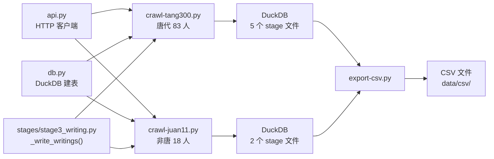
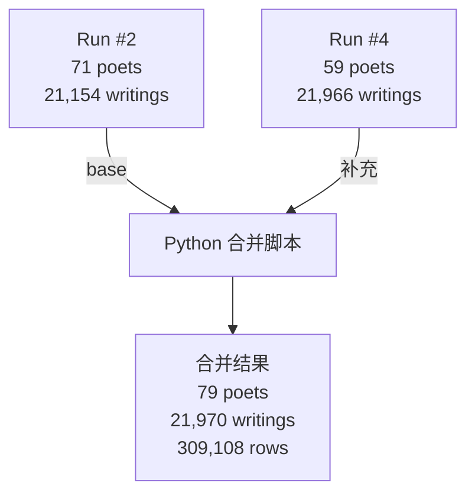
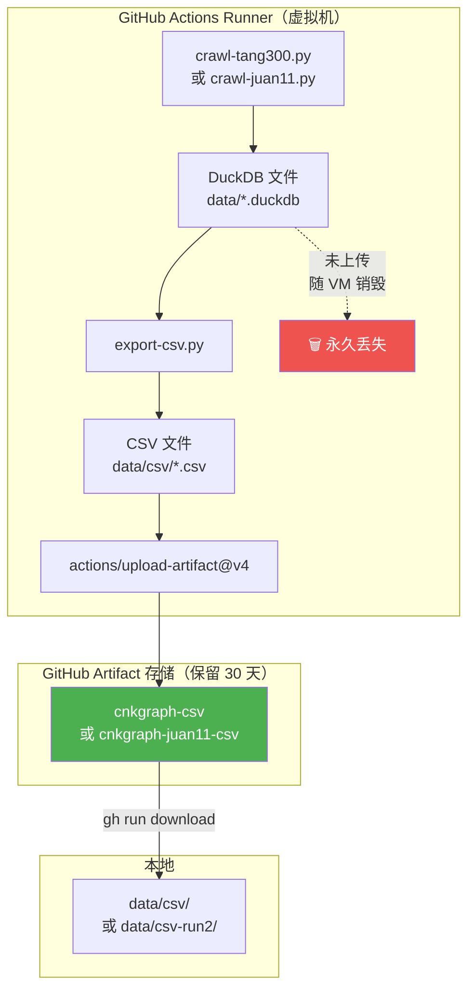
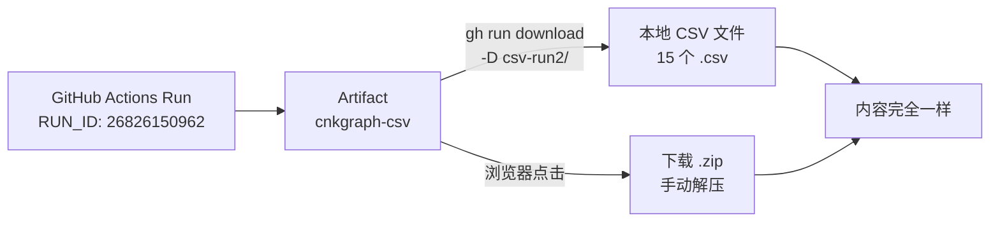
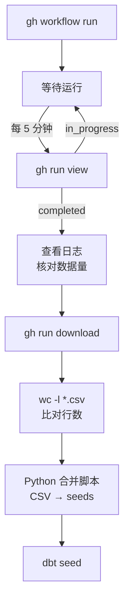
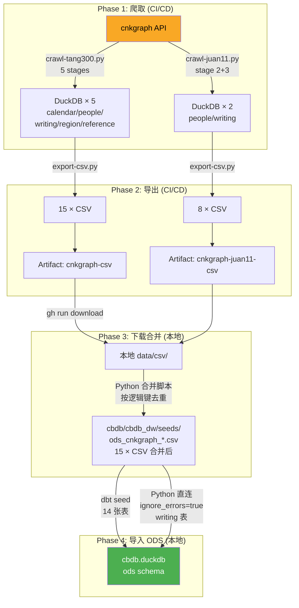

# 卷11 爬取实战：从本地测试到 CI/CD 到 ODS 导入

> 本文档记录卷01-10 唐代诗人 + 卷11 非唐诗人两次爬取的完整实战过程：本地测试、CI/CD 运行、数据合并、ODS 导入。包含脚本说明、gh CLI 用法、数据量对比、mermaid 架构图。

***

## 1. 脚本清单与作用

| 脚本 | 作用 | 输入 | 输出 |
|------|------|------|------|
| `cnkgraph/src/crawl-tang300.py` | 爬取卷01-11 唐代诗人（83人） | cnkgraph API | `data/*.duckdb` × 5 |
| `cnkgraph/src/crawl-juan11.py` | 爬取卷11 非唐诗人（18人） | cnkgraph API | `data/*.duckdb` × 2 |
| `cnkgraph/src/api.py` | HTTP 客户端（限流、重试、超时） | — | 被 crawl 脚本调用 |
| `cnkgraph/src/db.py` | DuckDB 建表、进度管理 | — | 被 crawl 脚本调用 |
| `cnkgraph/src/stages/stage3_writing.py` | writing 数据写入逻辑 | API JSON | DuckDB |
| `cnkgraph/src/export-csv.py` | DuckDB → CSV 导出 | `data/*.duckdb` | `data/csv/*.csv` |
| `.github/workflows/crawl.yml` | 唐代诗人 CI/CD workflow | git push / 手动 | CSV artifact |
| `.github/workflows/crawl-juan11.yml` | 卷11 非唐诗人 CI/CD workflow | 手动触发 | CSV artifact |

### 脚本依赖关系



### 两个爬虫脚本的区别

| | crawl-tang300.py | crawl-juan11.py |
|---|---|---|
| 诗人范围 | 唐朝 83 人 | 汉/三国/晋/宋/明/清 18 人 |
| 运行 stage | 1-5 全部 5 个 | 仅 2 (people) + 3 (writings) |
| 共性表 | 需要爬（calendar、region、reference） | **不爬**，已由唐朝脚本全量覆盖 |
| DuckDB 文件 | 5 个 (calendar/people/writing/region/reference) | 2 个 (people/writing) |
| 耗时 (CI/CD) | ~1h7m | ~37m |

***

## 2. 唐代诗人爬取

### 本地测试

```
$ python src/crawl-tang300.py
```

本地因网络原因（VPN 干扰 cnkgraph API），`/people/唐朝` 大响应经常 `TransferEncodingError`，故主要依赖 CI/CD 运行。

### CI/CD 运行记录

| # | 时间 | 结果 | 耗时 | 说明 |
|---|------|------|------|------|
| 1 | 06-02 14:17 | **失败** | 2m55s | writing_comment.content NOT NULL 约束 |
| 2 | 06-02 14:23 | **成功** | 44m12s | 全量跑通，299,362 行 |
| 3 | 06-04 04:51 | **失败** | 3m56s | `/people/唐朝` 超时 (TransferEncodingError) |
| 4 | 06-04 04:59 | **成功** | 1h7m22s | 增加超时到 120s/180s 后跑通 |

### Run #4 结果

```
[tang300] Matched 81/83 poets
[tang300] Unmatched: 刘昚虚, 张佖
[people] Done: 59 poets, 1292 details
[writings] Done: 21966 total writings
[region] Done: 372 regions, 10453 history
[ciTune] 819 tunes
[quTune] 1073 tunes
```

> 注意：81 位匹配但 people 只写入 59 位，因为部分诗人详情 API 超时。writings 数据是完整的（81 位全部爬取）。

### 数据合并策略

第二次运行（Run #4）的 people 数据不完整，需要与 Run #2 合并：



合并规则：
- **person**: 按 `id` 去重，Run #2 为 base
- **person_alias**: 按 `(person_id, name, type)` 去重
- **person_detail**: 按 `(person_id, book, content)` 去重
- **person_hometown**: 按 `(person_id, region_id, name)` 去重
- **writing 系列**: 使用 Run #4 数据（更完整，含卷11新增唐代诗人）

***

## 3. 卷11 非唐诗人爬取

### 诗人名单

| 朝代 | 诗人 | 备注 |
|------|------|------|
| 汉 | 项羽 | 仅《垓下歌》1 首 |
| 三国 | 曹植 | |
| 晋 | 陶潜 | 原名陶渊明，cnkgraph 用本名"陶潜" |
| 宋 | 范仲淹、曾巩、王安石、苏轼、李清照、陆游、杨万里、辛弃疾、文天祥 | 9 人 |
| 明 | 于谦、唐寅 | |
| 清 | 纳兰性德、郑燮、袁枚、龚自珍 | |
| — | 北朝民歌 | **排除**：cnkgraph 无条目 |

### 本地测试

```bash
$ cd cnkgraph
$ python -u src/crawl-juan11.py
```

结果（约 30 分钟）：

```
[juan11] Total matched: 18/18
[people] Done: 18 poets, 73 details
[writings] Done: 28674 total writings
```

各诗人作品量：

| 诗人 | writings | 诗人 | writings |
|------|----------|------|----------|
| 项羽 | 1 | 辛弃疾 | 3,393 |
| 曹植 | 154 | 文天祥 | 986 |
| 陶潜 | 180 | 于谦 | 427 |
| 范仲淹 | 323 | 唐寅 | 444 |
| 曾巩 | 457 | 纳兰性德 | 703 |
| 王安石 | 1,774 | 郑燮 | 79 |
| 李清照 | 93 | 袁枚 | 4,590 |
| 苏轼 | 3,314 | 龚自珍 | 710 |
| **陆游** | **9,386** | 杨万里 | 4,282 |

### CI/CD 运行

| # | 时间 | 结果 | 耗时 |
|---|------|------|------|
| 1 | 06-04 15:10 | **成功** | 36m51s |

CI/CD 结果与本地一致：18/18 poets, 28,674 writings。

> 本地测试因 VPN 导致部分 API 超时，但 GitHub Actions 的 Azure IP 不受限制，数据更完整可靠。

***

## 4. CI/CD 操作手册

### gh CLI 常用命令

```bash
# 触发 workflow
gh workflow run "Crawl cnkgraph (唐诗三百首)"
gh workflow run "Crawl cnkgraph (卷11 非唐诗人)"

# 查看运行列表
gh run list --workflow=crawl.yml --limit=5
gh run list --workflow=crawl-juan11.yml --limit=5

# 查看运行状态
gh run view <RUN_ID>

# 查看步骤进度
gh api repos/<owner>/<repo>/actions/runs/<RUN_ID>/jobs \
  --jq '.jobs[0].steps[] | "\(.status) \(.name)"'

# 查看日志（运行中不可用，需等完成）
gh run view --job=<JOB_ID> --log

# 过滤关键日志
gh run view --job=<JOB_ID> --log 2>&1 | grep -E '\[(tang300|juan11|people|writings|Done)\]'

# 下载 artifact（CSV 文件）
gh run download <RUN_ID> -n cnkgraph-csv -D cnkgraph/data/csv/
gh run download <RUN_ID> -n cnkgraph-juan11-csv -D cnkgraph/data/csv/
```

### Artifact 详解

#### Artifact 是什么

GitHub Artifact 是 Actions 运行产物的临时存储。爬虫运行结束后，虚拟机（runner）上的所有文件都会被销毁，只有通过 `actions/upload-artifact` 显式上传的文件才能保留下来。



#### 上传了什么，没上传什么

| 文件 | 是否上传 | 原因 |
|------|----------|------|
| `data/csv/*.csv` | **是** | 爬虫最终产出，最重要 |
| `data/*.duckdb` | **否** | 数百 MB，且可从 CSV 重建 |
| `data/crawl_progress.duckdb` | **否** | 爬虫进度，仅运行时有用 |

#### Artifact 保留规则

- **保留时间**：30 天（workflow 中 `retention-days: 30`）
- **存储上限**：每个 artifact 最大 10 GB，仓库总量上限见 GitHub 文档
- **过期后**：自动删除，无法恢复
- **同 workflow 多次运行**：每次运行独立 artifact，互不影响

#### 下载方式

**方式一：gh CLI 下载（推荐）**

```bash
# 基本语法
gh run download <RUN_ID> -n <artifact名称> -D <目标目录>

# 实际例子
# 下载唐朝 Run #4 的 CSV
gh run download 26931787136 -n cnkgraph-csv -D cnkgraph/data/csv/

# 下载卷11 Run #1 的 CSV
gh run download 26960711629 -n cnkgraph-juan11-csv -D cnkgraph/data/csv/

# 下载唐朝 Run #2（第一次成功）的 CSV 到单独目录，避免覆盖
gh run download 26826150962 -n cnkgraph-csv -D cnkgraph/data/csv-run2/
```

注意事项：
- `-n` 指定 artifact 名称，必须与 workflow 中 `upload-artifact` 的 `name` 一致
- `-D` 指定下载目录，**目录内已有同名文件会报错**，需先 `rm -f *.csv`
- **一次下载整个 artifact 的所有文件**，不能只挑某几个 CSV
- 下载后是原始 CSV 文件，不是压缩包

**方式二：浏览器下载**

1. 打开 `https://github.com/<owner>/<repo>/actions/runs/<RUN_ID>`
2. 页面底部 **Artifacts** 区域 → 点击 artifact 名称
3. 浏览器下载一个 **.zip 文件**，内含所有 CSV
4. 手动解压到目标目录



#### 如何找到 RUN_ID

```bash
# 列出某 workflow 的所有运行
gh run list --workflow=crawl.yml --limit=10

# 输出示例：
# completed  success  2026-06-04  26931787136  ← RUN_ID
# completed  success  2026-06-04  26931549927
# completed  success  2026-06-02  26826150962  ← 第一次成功

# 查看某次运行的详情（含 artifact 名称）
gh run view 26826150962
# 输出中 ARTIFACTS 部分会显示 artifact 名称
```

#### 如何只下载全量表（不包含 writing 等大表）

`gh run download` **不支持下载部分文件**。但可以用其他方式：

```bash
# 方法1：下载全部到临时目录，只拷贝需要的文件
gh run download 26826150962 -n cnkgraph-csv -D /tmp/csv-all/
cp /tmp/csv-all/dynasty.csv /tmp/csv-all/era_year.csv /tmp/csv-all/rhyme_entry.csv \
   /tmp/csv-all/ci_tune.csv /tmp/csv-all/qu_tune.csv /tmp/csv-all/region.csv \
   /tmp/csv-all/region_history.csv cnkgraph/data/csv-full/

# 方法2：用 GitHub API 单文件下载（更复杂，不推荐）
```

实际上，我们当前 ODS seeds 中的 7 张全量表已经是最新的（来自 Run #4），无需再从 Run #2 下载。Run #2 备份在 `data/csv-run2/` 供对比参考。

### 监控和核对流程



核对要点：
1. 日志中的 matched poets 数是否正确（预期 81/83 或 18/18）
2. 日志中的 total writings 数与 CSV 行数是否一致
3. 下载 CSV 后 `wc -l` 确认行数
4. 合并后比对 DuckDB `SELECT count(*)` 与 CSV 行数

***

## 5. 完整数据链路：API → ODS



### 各阶段数据量变化

| 阶段 | 唐代 | 卷11非唐 | 合并后 |
|------|------|----------|--------|
| API 爬取 (writings) | 21,966 | 28,674 | — |
| CSV 导出 | 15 表 / 299K 行 | 8 表 / 289K 行 | 15 表 / 598K 行 |
| dbt seed 导入 | — | — | 597,369 行 |
| 差异 (跳过行) | — | — | 307 行 (writing 表 HTML 引号) |

***

## 6. dbt seed 导入详解

### 命令

```bash
cd cbdb/cbdb_dw
dbt seed --target dev
```

### 结果

```
14 of 15 OK  ← 14 张表成功
1  of 15 ERROR  ← ods_cnkgraph_writing 失败
```

**writing 表失败原因**：`preface` 字段包含 HTML 内容（引号、换行），DuckDB CSV 解析器 `strict_mode=true` 无法处理。

**解决方案**：Python 直连 DuckDB，使用 `ignore_errors=true`：

```python
import duckdb
con = duckdb.connect('cbdb/data/cbdb.duckdb')
con.execute('DROP TABLE IF EXISTS ods.ods_cnkgraph_writing')
con.execute('''
    CREATE TABLE ods.ods_cnkgraph_writing AS
    SELECT * FROM read_csv_auto(
        'cbdb/cbdb_dw/seeds/ods_cnkgraph_writing.csv',
        header=true, ignore_errors=true
    )
''')
# 50,640 rows loaded (307 skipped)
```

### 最终 ODS 数据量

| 表 | 行数 | 来源 |
|----|------|------|
| ods_cnkgraph_person | 97 | 唐朝 79 + 非唐 18 |
| ods_cnkgraph_person_alias | 464 | — |
| ods_cnkgraph_person_detail | 1,793 | — |
| ods_cnkgraph_person_hometown | 96 | — |
| ods_cnkgraph_writing | 50,640 | 唐朝 21,970 + 非唐 28,670 |
| ods_cnkgraph_writing_clause | 499,182 | — |
| ods_cnkgraph_writing_comment | 18,448 | — |
| ods_cnkgraph_writing_allusion | 12,518 | — |
| ods_cnkgraph_dynasty | 549 | 全量 |
| ods_cnkgraph_era_year | 761 | 全量 |
| ods_cnkgraph_region | 372 | 全量 |
| ods_cnkgraph_region_history | 10,453 | 全量 |
| ods_cnkgraph_rhyme_entry | 106 | 全量 |
| ods_cnkgraph_ci_tune | 818 | 全量 |
| ods_cnkgraph_qu_tune | 1,072 | 全量 |
| **合计** | **597,369** | |

***

## 7. 已知问题与待办

| 问题 | 状态 | 说明 |
|------|------|------|
| 刘昚虚、张佖匹配不到 | 待查 | cnkgraph API 可能使用异体字 |
| writing 表 CSV 解析失败 | 已绕过 | 用 Python `ignore_errors=true` |
| `/people/唐朝` 大响应超时 | 已修复 | 超时从 30s → 120s/180s |
| 本地 VPN 干扰 API | 已知 | 优先用 CI/CD 运行 |
| 北朝民歌无 API 条目 | 排除 | cnkgraph 无此人物数据 |
