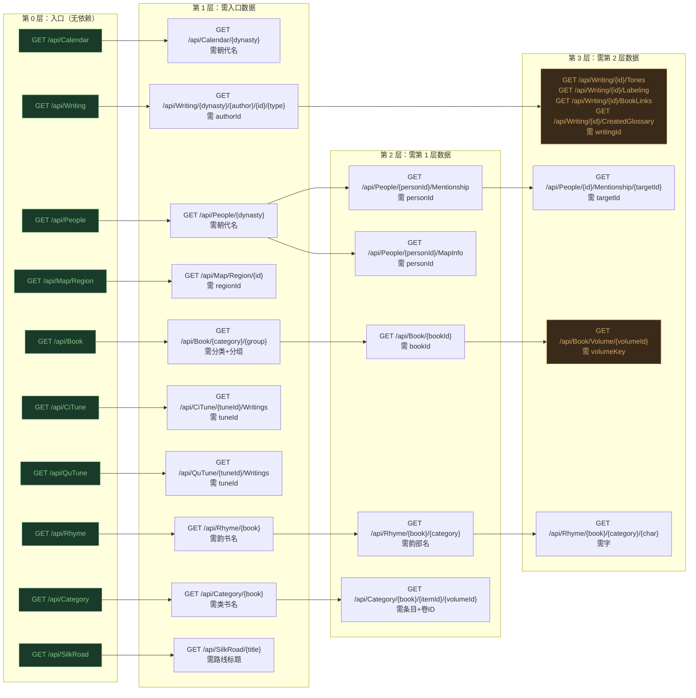
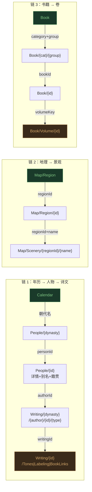
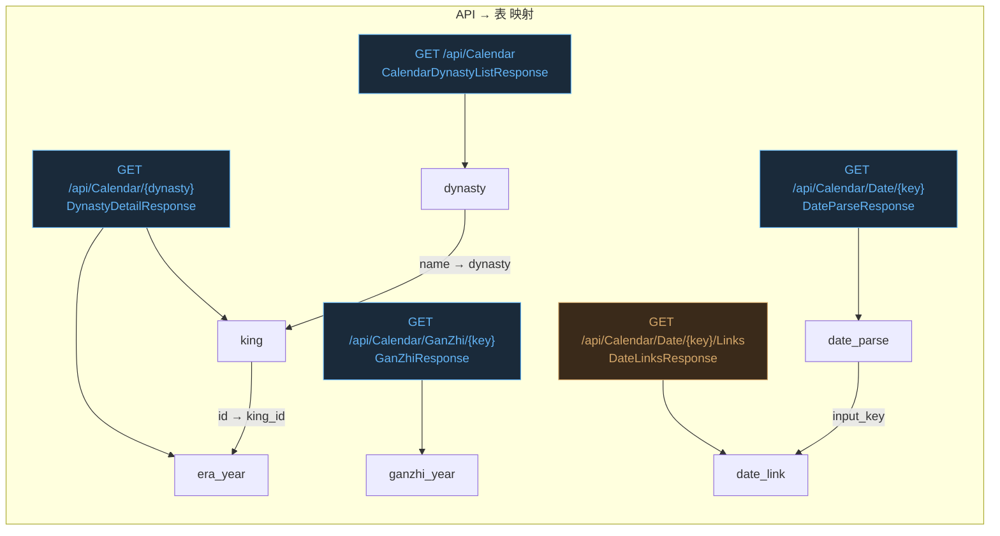
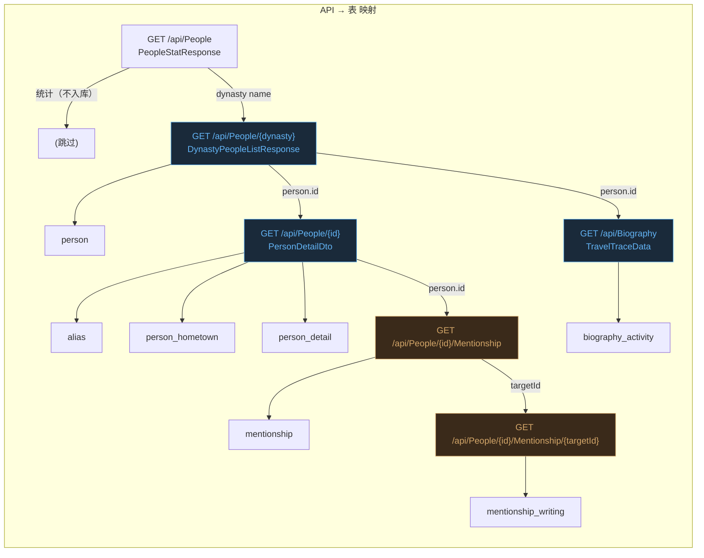
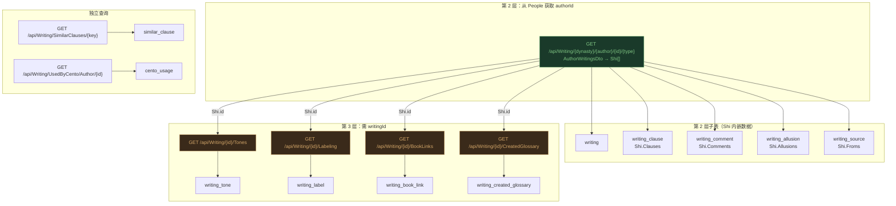
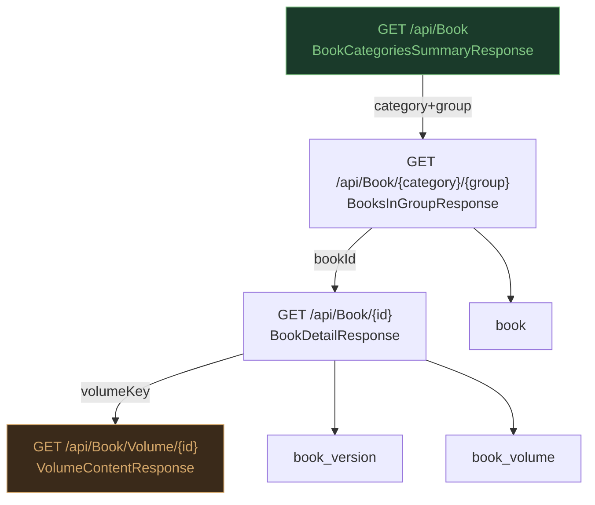
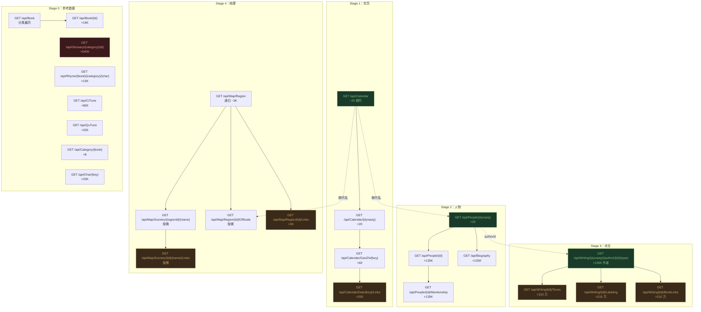
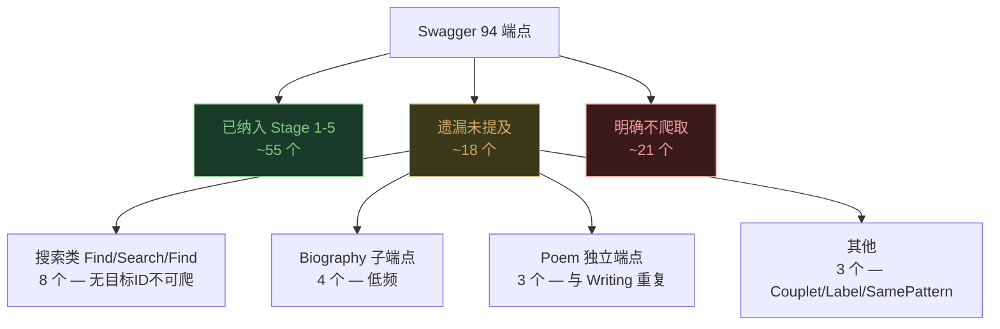
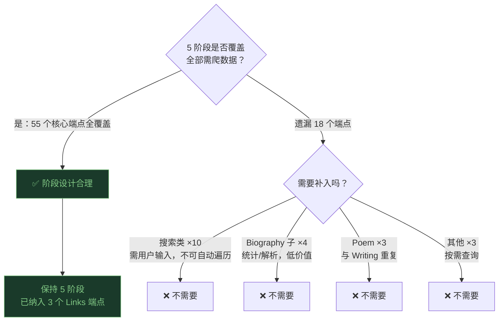

# PRD: cnkgraph API 爬虫 — SQLite 版

> 日期：2026-06-07
> 数据来源：`postman/swagger/swagger.json`（OpenAPI 3.0.4，94 端点，263 schema）
> 数据库：SQLite（单文件，零配置，方便分发）
> 目标：将 cnkgraph.com 全部开放数据爬取到本地 SQLite，支持离线分析

***

## 1. 数据源概览

cnkgraph API 共 17 个标签、94 个端点，数据量级估算如下：

| 模块              | 入口端点                | 数据量级                      | 嵌套层数   | <br /> |
| --------------- | ------------------- | ------------------------- | ------ | :----- |
| Calendar（年历）    | GET /api/Calendar   | \~20 朝代 × \~10 年号 = \~200 | 2      | <br /> |
| People（人物）      | GET /api/People     | \~135K 人物                 | 3      | <br /> |
| Biography（生平）   | GET /api/Biography  | \~135K 人物 × \~20 事件       | \~2.7M | 1      |
| Writing（诗文）     | GET /api/Writing    | \~210 万首                  | 3+     | <br /> |
| Poem（诗作）        | GET /api/Poem/{id}  | 与 Writing 重复              | 1      | <br /> |
| Map（地理）         | GET /api/Map/Region | \~3,000 区域 + \~景点         | 3      | <br /> |
| Book（古籍）        | GET /api/Book       | \~16K 书 × \~15 卷          | 3      | <br /> |
| Glossary（典故/词典） | GET /api/Glossary   | \~540K 词条                 | 2      | <br /> |
| Rhyme（韵典）       | GET /api/Rhyme      | 3 韵书 × \~100 韵部 × \~5K 字  | 3      | <br /> |
| CiTune（词谱）      | GET /api/CiTune     | \~800 词牌                  | 2      | <br /> |
| QuTune（曲谱）      | GET /api/QuTune     | \~200 曲牌                  | 2      | <br /> |
| Category（类书）    | GET /api/Category   | 8 部类书                     | 3      | <br /> |
| Char（字典）        | GET /api/Char/{key} | \~20K 字                   | 1      | <br /> |
| Tool（工具）        | POST /api/Tool/\*   | 按需调用                      | 0      | <br /> |
| SilkRoad（丝路）    | GET /api/SilkRoad   | \~10 条路线                  | 1      | <br /> |
| Label（标签）       | GET /api/Label/\*   | 按需调用                      | 1      | <br /> |
| MCP（AI 代理）      | POST /mcp           | 不爬取                       | —      | <br /> |

***

## 2. 嵌套查询依赖图

API 设计为「列表 → 详情 → 子详情」的逐层展开模式。以下展示完整的调用依赖链：



### 核心依赖链（爬取顺序）



***

## 3. SQLite 表结构设计

### 3.1 ER 总图

```mermaid
erDiagram
    dynasty ||--o{ era_year : "has"
    dynasty ||--o{ king : "has"
    king ||--o{ era_year : "has"

    person ||--o{ alias : "has"
    person ||--o{ person_hometown : "has"
    person ||--o{ person_detail : "has"
    person ||--o{ biography_activity : "has"
    person ||--o{ person_mentionship : "mentions"

    writing ||--o{ writing_clause : "has"
    writing ||--o{ writing_comment : "has"
    writing ||--o{ writing_allusion : "has"
    writing ||--o{ writing_source : "from"
    writing ||--o{ writing_tone : "has"
    writing ||--o{ writing_label : "has"
    writing ||--o{ writing_book_link : "refs"
    person ||--o{ writing : "writes"

    date_parse ||--o{ date_link : "links"

    region ||--o{ region : "parent"
    region ||--o{ scenery : "contains"
    region ||--o{ region_official : "has"
    region ||--o{ region_link : "links"
    scenery ||--o{ scenery_link : "links"

    book ||--o{ book_version : "has"
    book_version ||--o{ book_volume : "has"

    glossary ||--o{ glossary_key : "has"
    glossary ||--o{ glossary_quote : "refs"
    glossary ||--o{ glossary_person : "refs"

    rhyme_book ||--o{ rhyme_category : "has"
    rhyme_category ||--o{ rhyme_char : "has"

    ci_tune ||--o{ ci_tune_format : "has"
    qu_tune ||--o{ qu_tune_format : "has"

    category_book ||--o{ category_entry : "has"
    category_entry ||--o{ category_volume : "has"

    char_dict ||--o{ char_kangxi : "has"
    char_dict ||--o{ char_shuowen : "has"
```



### 3.2 表清单

共 **41 张表**，分为 10 个模块。API 端点 94 个，其中需要爬取存储的约 63 个（排除 Tool/WeChat/MCP 等无状态端点）。

| #  | 模块       | 表                          | 数据来源端点                                                | 嵌套层数 |
| -- | -------- | -------------------------- | ----------------------------------------------------- | ---- |
| 1  | Calendar | dynasty                    | GET /api/Calendar                                     | 0    |
| 2  | Calendar | king                       | GET /api/Calendar/{dynasty}                           | 1    |
| 3  | Calendar | era\_year                  | GET /api/Calendar/{dynasty} → KingEraYearsDto         | 1    |
| 4  | Calendar | ganzhi\_year               | GET /api/Calendar/GanZhi/{key}                        | 0    |
| 5  | Calendar | date\_parse                | GET /api/Calendar/Date/{key}                          | 0    |
| 6  | Calendar | date\_link                 | GET /api/Calendar/Date/{key}/Links                    | 1    |
| 7  | People   | person                     | GET /api/People/{dynasty} → PersonProfileDto          | 1    |
| 8  | People   | alias                      | GET /api/People/{id} → Alias\[]                       | 2    |
| 9  | People   | person\_hometown           | GET /api/People/{id} → Hometown\[]                    | 2    |
| 10 | People   | person\_detail             | GET /api/People/{id} → PersonDetailDto                | 2    |
| 11 | People   | biography\_activity        | GET /api/Biography → ActivityItem\[]                  | 1    |
| 12 | People   | mentionship                | GET /api/People/{id}/Mentionship                      | 2    |
| 13 | People   | mentionship\_writing       | GET /api/People/{id}/Mentionship/{targetId}           | 3    |
| 14 | Writing  | writing                    | GET /api/Writing/{dynasty}/{author}/{id}/{type} → Shi | 2    |
| 15 | Writing  | writing\_clause            | Shi.Clauses → Ju\[]                                   | 2    |
| 16 | Writing  | writing\_comment           | Shi.Comments → Quote\[]                               | 2    |
| 17 | Writing  | writing\_allusion          | Shi.Allusions → SentenceAllusionInfo\[]               | 2    |
| 18 | Writing  | writing\_source            | Shi.Froms → string\[]                                 | 2    |
| 19 | Writing  | writing\_tone              | GET /api/Writing/{id}/Tones                           | 3    |
| 20 | Writing  | writing\_label             | GET /api/Writing/{id}/Labeling                        | 3    |
| 21 | Writing  | writing\_book\_link        | GET /api/Writing/{id}/BookLinks                       | 3    |
| 22 | Writing  | writing\_created\_glossary | GET /api/Writing/{id}/CreatedGlossary                 | 3    |
| 23 | Writing  | similar\_clause            | GET /api/Writing/SimilarClauses/{key}                 | 2    |
| 24 | Writing  | same\_rhyme                | GET /api/Writing/SameRhymes/{key}                     | 2    |
| 25 | Writing  | cento\_usage               | GET /api/Writing/UsedByCento/Author/{authorId}        | 2    |
| 26 | Map      | region                     | GET /api/Map/Region → RegionInfoDto                   | 0    |
| 27 | Map      | scenery                    | GET /api/Map/Scenery/{regionId}/{name}                | 2    |
| 28 | Map      | region\_official           | GET /api/Map/Region/{id}/Officials/{dynasty}          | 2    |
| 29 | Map      | silkroad\_trace            | GET /api/SilkRoad → TravelTrace                       | 0    |
| 30 | Map      | silkroad\_marker           | GET /api/SilkRoad/{title} → Marker\[]                 | 1    |
| 31 | Map      | region\_link               | GET /api/Map/Region/{id}/Links                        | 1    |
| 32 | Map      | scenery\_link              | GET /api/Map/Scenery/{regionId}/{name}/Links          | 2    |
| 33 | Book     | book                       | GET /api/Book/{category}/{group} → BookBasicInfo      | 1    |
| 34 | Book     | book\_version              | GET /api/Book/{id} → BookVersionResponse              | 2    |
| 35 | Book     | book\_volume               | GET /api/Book/{id} → BookVolumeItem                   | 2    |
| 36 | Glossary | glossary                   | GET /api/Glossary/{category}/{id}                     | 1    |
| 37 | Glossary | glossary\_key              | GlossaryAllusionDto.Keys                              | 1    |
| 38 | Glossary | glossary\_quote            | GlossaryAllusionDto.Quotes                            | 1    |
| 39 | Rhyme    | rhyme\_book                | GET /api/Rhyme → string\[]                            | 0    |
| 40 | Rhyme    | rhyme\_category            | GET /api/Rhyme/{book} → TongYunGroupDto\[]            | 1    |
| 41 | Rhyme    | rhyme\_char                | GET /api/Rhyme/{book}/{category}/{char}               | 2    |
| 42 | CiTune   | ci\_tune                   | GET /api/CiTune → CiTuneSummaryDto                    | 0    |
| 43 | CiTune   | ci\_tune\_format           | GET /api/CiTune/{tuneId}/{formatIndex}                | 1    |
| 44 | QuTune   | qu\_tune                   | GET /api/QuTune → QuTuneSummaryDto                    | 0    |
| 45 | QuTune   | qu\_tune\_format           | GET /api/QuTune/{tuneId}/{formatIndex}                | 1    |
| 46 | Category | category\_book             | GET /api/Category → string\[]                         | 0    |
| 47 | Category | category\_entry            | GET /api/Category/{book} → entries                    | 1    |
| 48 | Category | category\_volume           | GET /api/Category/{book}/{itemId}/{volumeId}          | 2    |
| 49 | Char     | char\_dict                 | GET /api/Char/{key} → ChineseChar\[]                  | 0    |
| 50 | Char     | char\_kangxi               | GET /api/Char/{key} → KangXiChar\[]                   | 0    |
| 51 | Char     | char\_shuowen              | GET /api/Char/{key} → ShuoWenChar\[]                  | 0    |

### 3.3 表结构 DDL（核心表）

> 以下列出每个模块的核心表字段。`crawl_progress` 表记录每个端点的爬取进度，支持断点续爬。

#### Calendar（年历）— 6 表

```sql
-- 朝代表：存储历史朝代及其子朝代（来自 GET /api/Calendar → CalendarDynastyItemDto）
CREATE TABLE dynasty (
    name        TEXT PRIMARY KEY,       -- 朝代名称，如"唐朝"、"宋朝"
    begin_year  INTEGER,                -- 起始公元年份
    end_year    INTEGER,                -- 结束公元年份
    is_sub      INTEGER DEFAULT 0,      -- 是否子朝代：0=主朝代，1=子朝代（如南北朝下的"南朝宋"）
    parent      TEXT,                   -- 父朝代名，子朝代时填写，外键→dynasty(name)
    FOREIGN KEY (parent) REFERENCES dynasty(name)
);

-- 君主表：存储各朝代帝王及其统治时间（来自 GET /api/Calendar/{dynasty} → KingEraYearsDto）
CREATE TABLE king (
    id              INTEGER PRIMARY KEY,    -- 君主内部唯一标识
    name            TEXT,                   -- 君主名称，如"唐太宗"
    dynasty         TEXT NOT NULL,          -- 所属朝代名，外键→dynasty(name)
    govern_begin    TEXT,                   -- 统治起始时间描述
    govern_end      TEXT,                   -- 统治结束时间描述
    author_id       INTEGER,                -- 关联人物ID，外键→person(id)
    FOREIGN KEY (dynasty) REFERENCES dynasty(name)
);

-- 年号表：存储君主使用的年号及起止年份（来自 KingEraYearsDto.EraYears → EraYearDto）
CREATE TABLE era_year (
    id                  INTEGER PRIMARY KEY,    -- 年号内部唯一标识
    king_id             INTEGER NOT NULL,       -- 所属君主ID，外键→king(id)
    name                TEXT NOT NULL,           -- 年号名称，如"贞观"、"开元"
    begin_year          TEXT,                   -- 年号开始年
    end_year            TEXT,                   -- 年号结束年
    span                TEXT,                   -- 跨度描述，如"共23年"
    comment             TEXT,                   -- 补充说明
    calculated_year     TEXT,                   -- 与查询年份对齐后的说明标签
    inherited_offset    INTEGER DEFAULT 0,      -- 沿用前任年号导致的起算年偏移
    extended_span       INTEGER DEFAULT 0,      -- 扩展跨度
    FOREIGN KEY (king_id) REFERENCES king(id)
);

-- 干支年表：存储干支纪年与公元年份的对应关系（来自 GET /api/Calendar/GanZhi/{key} → GanZhiYearCandidateDto）
CREATE TABLE ganzhi_year (
    id          INTEGER PRIMARY KEY AUTOINCREMENT,  -- 自增主键
    ganzhi      TEXT NOT NULL,                       -- 干支字符串，如"甲子"、"乙丑"
    year        INTEGER NOT NULL,                    -- 对应公元年份
    link_count  INTEGER DEFAULT 0,                   -- 关联链接数量
    UNIQUE(ganzhi, year)
);

-- 日期解析表：存储日期文本解析结果（来自 GET /api/Calendar/Date/{key} → DateParseResponse）
CREATE TABLE date_parse (
    id          INTEGER PRIMARY KEY AUTOINCREMENT,  -- 自增主键
    input_key   TEXT NOT NULL,                       -- 输入日期文本，如"贞观元年三月"
    year        TEXT,                               -- 解析出的年份
    year_ganzhi TEXT,                               -- 年份对应的干支
    month       TEXT,                               -- 解析出的月份
    day         TEXT,                               -- 解析出的日
    day_ganzhi  TEXT,                               -- 日对应的干支
    era_name    TEXT,                               -- 年号名称
    era_id      INTEGER,                            -- 年号内部ID，外键→era_year(id)
    link_count  INTEGER DEFAULT 0,                  -- 关联链接数量
    UNIQUE(input_key)
);

-- 日期链接表：存储日期关联的知识图谱节点（来自 GET /api/Calendar/Date/{key}/Links → DateLinksResponse）
CREATE TABLE date_link (
    id              INTEGER PRIMARY KEY AUTOINCREMENT,  -- 自增主键
    input_key       TEXT NOT NULL,                       -- 关联的日期文本，外键→date_parse(input_key)
    label_type      INTEGER,                            -- 标签类型，LabelType 枚举
    label_identity  TEXT,                               -- 标签唯一标识
    resource_type   INTEGER,                            -- 资源类型，ResourceType 枚举
    resource_id     INTEGER,                            -- 资源ID
    value           TEXT,                               -- 标签值/显示文本
    start           INTEGER,                            -- 文本起始位置
    length          INTEGER,                            -- 文本长度
    weight          INTEGER DEFAULT 0,                  -- 权重
    FOREIGN KEY (input_key) REFERENCES date_parse(input_key)
);
```



#### People（人物）— 7 表

```sql
-- 人物表：存储历史人物基本信息（来自 GET /api/People/{dynasty} → PersonProfileDto）
CREATE TABLE person (
    id          INTEGER PRIMARY KEY,     -- 人物唯一标识
    name        TEXT NOT NULL,           -- 姓名（已按简繁设置转换）
    dynasty     TEXT,                    -- 所属朝代显示名称，外键→dynasty(name)
    birth_year  TEXT,                    -- 出生年份（可能为上下限描述）
    birthday    TEXT,                    -- 出生日期
    death_year  TEXT,                    -- 死亡年份
    deathday    TEXT,                    -- 忌日
    FOREIGN KEY (dynasty) REFERENCES dynasty(name)
);

-- 别名表：存储人物的字、号、谥号等称谓（来自 PersonProfileDto.Aliases → Alias）
CREATE TABLE alias (
    id          INTEGER PRIMARY KEY AUTOINCREMENT,  -- 自增主键
    person_id   INTEGER NOT NULL,                   -- 所属人物ID，外键→person(id)
    name        TEXT,                               -- 别名/称谓文本
    type        INTEGER NOT NULL,                   -- AliasType枚举 (0-23)：1=名,2=字,3=号,4=谥号,5=别称,6=行第,7=封爵,8=小名,9=小字,10=赐号,11=俗姓,12=俗名,13=庙号,14=尊号,15=庙额,16=其他译名,17=本姓,18=法号,19=曾用名,20=人称,21=姓,22=姓名,23=其它
    from_dynasty TEXT,                              -- 别名来源朝代
    from_detail  TEXT,                              -- 别名来源详情
    from_year   INTEGER,                            -- 别名来源年份
    FOREIGN KEY (person_id) REFERENCES person(id)
);

-- 籍贯表：存储人物与地域的关联（来自 PersonProfileDto.Hometown → PersonHometownDto）
CREATE TABLE person_hometown (
    id          INTEGER PRIMARY KEY AUTOINCREMENT,  -- 自增主键
    person_id   INTEGER NOT NULL,                   -- 所属人物ID，外键→person(id)
    region_id   TEXT,                               -- 地域ID，外键→region(id)
    region_name TEXT,                               -- 地域名称
    FOREIGN KEY (person_id) REFERENCES person(id),
    FOREIGN KEY (region_id) REFERENCES region(id)
);

-- 人物引用表：存储传记段落及评述（来自 GET /api/People/{id} → PersonDetailDto.Details → PersonQuoteDto）
CREATE TABLE person_detail (
    id          INTEGER PRIMARY KEY AUTOINCREMENT,  -- 自增主键
    person_id   INTEGER NOT NULL,                   -- 所属人物ID，外键→person(id)
    book        TEXT,                               -- 来源书籍
    section     TEXT,                               -- 书中分卷/章节标识
    content     TEXT,                               -- 引文内容（HTML或纯文本）
    is_review   INTEGER DEFAULT 0,                  -- 是否评述/评论性条目：0=否，1=是
    FOREIGN KEY (person_id) REFERENCES person(id)
);

-- 传略活动表：存储人物按年排列的生平事件（来自 GET /api/Biography → BiographyActivityItem）
CREATE TABLE biography_activity (
    id              INTEGER PRIMARY KEY AUTOINCREMENT,  -- 自增主键
    person_id       INTEGER NOT NULL,                   -- 所属人物ID，外键→person(id)
    year            INTEGER,                            -- 发生年份
    month           TEXT,                               -- 发生月份
    day             TEXT,                               -- 发生日
    date_text       TEXT,                               -- 日期文本
    old_year        TEXT,                               -- 古代纪年
    place_region_id TEXT,                               -- 活动地点区域ID，外键→region(id)
    place_country   TEXT,                               -- 国家
    place_province  TEXT,                               -- 省份
    place_city      TEXT,                               -- 城市
    place_old_city  TEXT,                               -- 古城市名
    place_detail    TEXT,                               -- 具体地点
    title           TEXT,                               -- 职称/官职
    activity        TEXT,                               -- 活动内容
    category        TEXT,                               -- 分类标签
    related_people  TEXT,                               -- JSON数组，存储相关人物名称列表
    from_book       TEXT,                               -- 出处书籍
    subject         TEXT,                               -- 诗/文标题
    article_type    INTEGER DEFAULT 0,                  -- WritingType枚举 (Flags)：0=未知,2=诗,4=文,8=句,16=文句,32=赋,64=词,128=书,256=疏,512=表,1024=铭,2048=赞
    FOREIGN KEY (person_id) REFERENCES person(id)
);

-- 述及关系表：存储人物间的提及关系（来自 GET /api/People/{id}/Mentionship）
CREATE TABLE mentionship (
    id              INTEGER PRIMARY KEY AUTOINCREMENT,  -- 自增主键
    person_id       INTEGER NOT NULL,                   -- 源人物ID，外键→person(id)
    target_id       INTEGER NOT NULL,                   -- 目标人物ID，外键→person(id)
    direction       TEXT,                               -- 方向："mention"=提及他人，"mentioned_by"=被他人提及
    FOREIGN KEY (person_id) REFERENCES person(id),
    FOREIGN KEY (target_id) REFERENCES person(id),
    UNIQUE(person_id, target_id, direction)
);

-- 述及作品表：存储述及关系中涉及的具体作品（来自 GET /api/People/{id}/Mentionship/{targetId}）
CREATE TABLE mentionship_writing (
    id              INTEGER PRIMARY KEY AUTOINCREMENT,  -- 自增主键
    person_id       INTEGER NOT NULL,                   -- 源人物ID，外键→person(id)
    target_id       INTEGER NOT NULL,                   -- 目标人物ID，外键→person(id)
    writing_id      INTEGER NOT NULL,                   -- 涉及作品ID，外键→writing(id)
    FOREIGN KEY (person_id) REFERENCES person(id),
    FOREIGN KEY (target_id) REFERENCES person(id),
    FOREIGN KEY (writing_id) REFERENCES writing(id)
);
```



#### Writing（诗文）— 11 表

```sql
-- 诗文表：存储诗/词/文作品基本信息（来自 GET /api/Writing/{dynasty}/{author}/{id}/{type} → Shi）
CREATE TABLE writing (
    id                  INTEGER PRIMARY KEY,    -- 作品唯一标识
    author_id           INTEGER NOT NULL,       -- 作者ID，外键→person(id)
    author_name         TEXT NOT NULL,           -- 作者姓名
    dynasty             TEXT,                   -- 所属朝代，外键→dynasty(name)
    title               TEXT NOT NULL,           -- 作品标题
    subtitle            TEXT,                   -- 副标题/组诗子标题
    writing_type        TEXT,                   -- 体裁类型名称，如"律诗"、"绝句"
    type_detail         INTEGER DEFAULT 0,      -- DetailPoemType枚举 (Flags)：细分体裁标记（1=五言,2=七言,4=绝,8=律,16=排,32=词,128=四言,512=古风,1024=乐府,8192=曲,16384=赋,524288=文）
    rhyme               TEXT,                   -- 所押韵部名称
    first_clause_rhyme  TEXT,                   -- 律诗首句用韵
    group_index         INTEGER DEFAULT 0,      -- 组诗索引号
    preface             TEXT,                   -- 序言
    note                TEXT,                   -- 对整首诗的按语
    tune_id             INTEGER,                -- 词牌ID，外键→ci_tune(id)
    rank                INTEGER DEFAULT 0,      -- 作品影响力/排名
    author_date         TEXT,                   -- 创作时间描述
    author_years        TEXT,                   -- JSON数组，存储创作年份范围
    author_place        TEXT,                   -- 创作地点
    has_tone            INTEGER DEFAULT 0,      -- 是否有声调标注：0=无，1=有
    FOREIGN KEY (author_id) REFERENCES person(id),
    FOREIGN KEY (dynasty) REFERENCES dynasty(name)
);

-- 诗句表：存储作品的逐句内容（来自 Shi.Clauses → Ju）
CREATE TABLE writing_clause (
    id          INTEGER PRIMARY KEY AUTOINCREMENT,  -- 自增主键
    writing_id  INTEGER NOT NULL,                   -- 所属作品ID，外键→writing(id)
    idx         INTEGER NOT NULL,                   -- 句子在作品中的序号
    content     TEXT NOT NULL,                       -- 诗句内容
    tone_mark   TEXT,                               -- 平仄模式标记
    rhyme       TEXT,                               -- 本句韵脚
    break_after TEXT,                               -- 此句后是否换行/分段
    FOREIGN KEY (writing_id) REFERENCES writing(id)
);

-- 诗文评论表：存储对作品的赏析/评论引用（来自 Shi.Comments → Quote）
CREATE TABLE writing_comment (
    id          INTEGER PRIMARY KEY AUTOINCREMENT,  -- 自增主键
    writing_id  INTEGER NOT NULL,                   -- 所属作品ID，外键→writing(id)
    book        TEXT,                               -- 引用来源书籍
    section     TEXT,                               -- 书中卷/节标识
    content     TEXT,                               -- 引文/评论内容
    is_review   INTEGER DEFAULT 0,                  -- 是否作品评论类：0=否，1=是
    FOREIGN KEY (writing_id) REFERENCES writing(id)
);

-- 用典表：存储作品中使用的典故（来自 Shi.Allusions → SentenceAllusionInfo）
CREATE TABLE writing_allusion (
    id              INTEGER PRIMARY KEY AUTOINCREMENT,  -- 自增主键
    writing_id      INTEGER NOT NULL,                   -- 所属作品ID，外键→writing(id)
    allusion_id     INTEGER,                            -- 典故ID，外键→glossary(id)
    allusion_key    TEXT,                               -- 典故关键词
    sentence_index  INTEGER,                            -- 用典所在句的索引
    FOREIGN KEY (writing_id) REFERENCES writing(id)
);

-- 出处表：存储作品的来源书目（来自 Shi.Froms → string[]）
CREATE TABLE writing_source (
    id          INTEGER PRIMARY KEY AUTOINCREMENT,  -- 自增主键
    writing_id  INTEGER NOT NULL,                   -- 所属作品ID，外键→writing(id)
    content     TEXT,                               -- 出处名称，如"全唐诗"
    FOREIGN KEY (writing_id) REFERENCES writing(id)
);

-- 声调表：存储作品逐字平仄标注（来自 GET /api/Writing/{id}/Tones → CharacterToneDto[][]）
CREATE TABLE writing_tone (
    id          INTEGER PRIMARY KEY AUTOINCREMENT,  -- 自增主键
    writing_id  INTEGER NOT NULL,                   -- 所属作品ID，外键→writing(id)
    clause_idx  INTEGER NOT NULL,                   -- 句子索引
    char_idx    INTEGER NOT NULL,                   -- 句中字索引
    char        TEXT,                               -- 汉字
    tone        TEXT,                               -- 声调："平"/"仄"/"?"
    FOREIGN KEY (writing_id) REFERENCES writing(id)
);

-- 标注表：存储作品的知识图谱标注（来自 GET /api/Writing/{id}/Labeling → KnowledgeNodeBase[]）
CREATE TABLE writing_label (
    id              INTEGER PRIMARY KEY AUTOINCREMENT,  -- 自增主键
    writing_id      INTEGER NOT NULL,                   -- 所属作品ID，外键→writing(id)
    label_type      INTEGER,                            -- LabelType枚举 (0-21)：标注类型
    label_identity  TEXT,                               -- 标签完整标识
    resource_type   INTEGER,                            -- ResourceType枚举 (0-4)：资源类型
    resource_id     INTEGER,                            -- 关联资源ID
    value           TEXT,                               -- 命中的实际文本
    start           INTEGER,                            -- 标注起始位置
    length          INTEGER,                            -- 标注长度
    weight          INTEGER DEFAULT 0,                  -- 权重，值越小优先权越高
    FOREIGN KEY (writing_id) REFERENCES writing(id)
);

-- 书籍链接表：存储作品与古籍的关联（来自 GET /api/Writing/{id}/BookLinks）
CREATE TABLE writing_book_link (
    id              INTEGER PRIMARY KEY AUTOINCREMENT,  -- 自增主键
    writing_id      INTEGER NOT NULL,                   -- 所属作品ID，外键→writing(id)
    link_type       TEXT,                               -- 链接类型描述
    book_id         INTEGER,                            -- 关联书籍ID，外键→book(id)
    volume_id       TEXT,                               -- 关联卷ID
    content         TEXT,                               -- 链接内容/描述
    FOREIGN KEY (writing_id) REFERENCES writing(id)
);

-- 创造典故表：存储作品创造或首用的典故/新词（来自 GET /api/Writing/{id}/CreatedGlossary → CreatedGlossaryDto）
CREATE TABLE writing_created_glossary (
    id              INTEGER PRIMARY KEY AUTOINCREMENT,  -- 自增主键
    writing_id      INTEGER NOT NULL,                   -- 所属作品ID，外键→writing(id)
    glossary_id     INTEGER,                            -- 典故/词汇ID，外键→glossary(id)
    glossary_kind   INTEGER,                            -- GlossaryItemType枚举：1=词汇，2=典故
    key             TEXT,                               -- 典故/词汇关键词
    FOREIGN KEY (writing_id) REFERENCES writing(id)
);

-- 相似句表：存储作品间的相似句匹配（来自 GET /api/Writing/SimilarClauses/{key}）
CREATE TABLE similar_clause (
    id              INTEGER PRIMARY KEY AUTOINCREMENT,  -- 自增主键
    source_writing_id INTEGER,                          -- 源作品ID，外键→writing(id)
    source_clause    TEXT,                              -- 源句子内容
    matched_writing_id INTEGER NOT NULL,                -- 匹配作品ID，外键→writing(id)
    matched_clause   TEXT,                              -- 匹配句子内容
    matched_author   TEXT,                              -- 匹配作品作者
    matched_dynasty  TEXT,                              -- 匹配作品朝代
    FOREIGN KEY (matched_writing_id) REFERENCES writing(id)
);

-- 集句引用表：存储集句诗中的引用来源（来自 GET /api/Writing/UsedByCento/Author/{authorId}）
CREATE TABLE cento_usage (
    id              INTEGER PRIMARY KEY AUTOINCREMENT,  -- 自增主键
    author_id       INTEGER NOT NULL,                   -- 引用作者ID，外键→person(id)
    writing_id      INTEGER NOT NULL,                   -- 集句作品ID，外键→writing(id)
    clause          TEXT,                               -- 被引用的原句
    source_writing_id INTEGER,                          -- 原句出处作品ID，外键→writing(id)
    source_author   TEXT,                               -- 原句作者名
    FOREIGN KEY (author_id) REFERENCES person(id),
    FOREIGN KEY (writing_id) REFERENCES writing(id)
);
```



#### Map（地理）— 6 表

```sql
-- 区域表：存储行政区划层级关系（来自 GET /api/Map/Region → RegionInfoDto）
CREATE TABLE region (
    id              TEXT PRIMARY KEY,     -- 区域ID（如"CN3301"）
    name            TEXT NOT NULL,        -- 区域名称
    parent_id       TEXT,                 -- 父级区域ID，外键→region(id)
    latitude        REAL,                 -- 纬度
    longitude       REAL,                 -- 经度
    people_count    INTEGER DEFAULT 0,    -- 该区域关联人物数量
    has_child       INTEGER DEFAULT 0,    -- 是否存在子区域：0=无，1=有
    FOREIGN KEY (parent_id) REFERENCES region(id)
);

-- 景点表：存储名胜古迹详情（来自 GET /api/Map/Scenery/{regionId}/{name} → SceneryDetailDto）
CREATE TABLE scenery (
    id          INTEGER PRIMARY KEY AUTOINCREMENT,  -- 自增主键
    region_id   TEXT NOT NULL,                       -- 所属区域ID，外键→region(id)
    name        TEXT NOT NULL,                       -- 景点名称
    province    TEXT,                               -- 所在省份
    city        TEXT,                               -- 所在城市
    latitude    REAL,                               -- 纬度
    longitude   REAL,                               -- 经度
    summary     TEXT,                               -- 简介
    detail      TEXT,                               -- 正文/详细描述
    aliases     TEXT,                               -- JSON数组，存储景点别名列表
    link_count  INTEGER DEFAULT 0,                  -- 关联链接数量
    FOREIGN KEY (region_id) REFERENCES region(id),
    UNIQUE(region_id, name)
);

-- 区域官员表：存储各地区历任官员（来自 GET /api/Map/Region/{id}/Officials/{dynasty}）
CREATE TABLE region_official (
    id          INTEGER PRIMARY KEY AUTOINCREMENT,  -- 自增主键
    region_id   TEXT NOT NULL,                       -- 所属区域ID，外键→region(id)
    dynasty     TEXT,                               -- 朝代
    person_id   INTEGER,                            -- 人物ID，外键→person(id)
    person_name TEXT,                               -- 人物姓名
    title       TEXT,                               -- 官职名称
    is_local    INTEGER DEFAULT 1,                  -- 是否本地官员：1=本地，0=外地
    FOREIGN KEY (region_id) REFERENCES region(id),
    FOREIGN KEY (person_id) REFERENCES person(id)
);

-- 丝路地标表：存储丝绸之路路线及途经地点（来自 GET /api/SilkRoad → TravelTrace, GET /api/SilkRoad/{title} → Marker[]）
CREATE TABLE silkroad_marker (
    id          INTEGER PRIMARY KEY AUTOINCREMENT,  -- 自增主键
    trace_title TEXT NOT NULL,                       -- 所属路线标题
    marker_id   TEXT,                               -- 地标ID
    title       TEXT,                               -- 地标标题
    latitude    REAL,                               -- 纬度
    longitude   REAL,                               -- 经度
    summary     TEXT,                               -- 简介
    detail      TEXT,                               -- 详情描述
    region_id   TEXT,                               -- 关联区域ID，外键→region(id)
    region_l1   TEXT,                               -- 一级区域名称
    region_l2   TEXT,                               -- 二级区域名称
    FOREIGN KEY (region_id) REFERENCES region(id)
);

-- 区域链接表：存储区域关联的知识图谱节点（来自 GET /api/Map/Region/{id}/Links → RegionLinksResponse）
CREATE TABLE region_link (
    id              INTEGER PRIMARY KEY AUTOINCREMENT,  -- 自增主键
    region_id       TEXT NOT NULL,                       -- 关联区域ID，外键→region(id)
    label_type      INTEGER,                            -- 标签类型，LabelType 枚举
    label_identity  TEXT,                               -- 标签唯一标识
    resource_type   INTEGER,                            -- 资源类型，ResourceType 枚举
    resource_id     INTEGER,                            -- 资源ID
    value           TEXT,                               -- 标签值/显示文本
    start           INTEGER,                            -- 文本起始位置
    length          INTEGER,                            -- 文本长度
    weight          INTEGER DEFAULT 0,                  -- 权重
    FOREIGN KEY (region_id) REFERENCES region(id)
);

-- 景点链接表：存储景点关联的知识图谱节点（来自 GET /api/Map/Scenery/{regionId}/{name}/Links → SceneryLinksResponse）
CREATE TABLE scenery_link (
    id              INTEGER PRIMARY KEY AUTOINCREMENT,  -- 自增主键
    region_id       TEXT NOT NULL,                       -- 景点所属区域ID
    scenery_name    TEXT NOT NULL,                       -- 景点名称
    label_type      INTEGER,                            -- 标签类型，LabelType 枚举
    label_identity  TEXT,                               -- 标签唯一标识
    resource_type   INTEGER,                            -- 资源类型，ResourceType 枚举
    resource_id     INTEGER,                            -- 资源ID
    value           TEXT,                               -- 标签值/显示文本
    start           INTEGER,                            -- 文本起始位置
    length          INTEGER,                            -- 文本长度
    weight          INTEGER DEFAULT 0,                  -- 权重
    FOREIGN KEY (region_id) REFERENCES region(id)
);
```

#### Book（古籍）— 3 表

```sql
-- 书籍表：存储古籍基本信息（来自 GET /api/Book/{category}/{group} → BookBasicInfo）
CREATE TABLE book (
    id          INTEGER PRIMARY KEY,    -- 书籍内部唯一标识
    name        TEXT NOT NULL,           -- 书名
    author      TEXT,                   -- 作者
    dynasty     TEXT,                   -- 朝代，外键→dynasty(name)
    category    TEXT,                   -- 主分类（经/史/子/集）
    subcategory TEXT,                   -- 次分类
    author_ids  TEXT,                   -- JSON数组，存储作者ID列表
    FOREIGN KEY (dynasty) REFERENCES dynasty(name)
);

-- 书籍版本表：存储古籍的不同版本/来源（来自 GET /api/Book/{id} → BookVersionResponse）
CREATE TABLE book_version (
    id          INTEGER PRIMARY KEY AUTOINCREMENT,  -- 自增主键
    book_id     INTEGER NOT NULL,                   -- 所属书籍ID，外键→book(id)
    type        TEXT,                               -- 版本类型
    comment     TEXT,                               -- 版本备注
    source      TEXT,                               -- 来源标识
    archive_url TEXT,                               -- 打包文件下载URL
    FOREIGN KEY (book_id) REFERENCES book(id)
);

-- 书籍卷目表：存储古籍各卷信息（来自 BookVersionResponse.Volumes → BookVolumeItem）
CREATE TABLE book_volume (
    id          INTEGER PRIMARY KEY AUTOINCREMENT,  -- 自增主键
    version_id  INTEGER NOT NULL,                   -- 所属版本ID，外键→book_version(id)
    name        TEXT,                               -- 卷名称
    url         TEXT,                               -- 卷内容访问/下载URL
    volume_key  TEXT,                               -- 卷内部定位键，如"KR4h0140_024"
    FOREIGN KEY (version_id) REFERENCES book_version(id)
);
```



#### Glossary（典故/词典）— 3 表

```sql
-- 词典/典故表：存储典故、词汇、佛典词条（来自 GET /api/Glossary/{category}/{id} → GlossaryAllusionDto / GlossaryWordDto）
CREATE TABLE glossary (
    id                  INTEGER PRIMARY KEY,    -- 词条唯一标识
    kind                INTEGER NOT NULL,       -- GlossaryItemType枚举：1=词汇，2=典故
    word                TEXT,                   -- 词汇文本
    original_word       TEXT,                   -- 原始词形
    from_source         TEXT,                   -- 来源
    spellings           TEXT,                   -- 拼音字符串
    explains            TEXT,                   -- JSON数组，存储解释列表
    categories          TEXT,                   -- JSON数组，存储所属分类标签列表
    count_in_writings   INTEGER DEFAULT 0,      -- 被诗文引用次数
    correlations        TEXT,                   -- JSON数组，存储语义相关典故关键词列表
    references_keys     TEXT                    -- JSON数组，存储引用/参考典故关键词列表
);

-- 典故关键词表：存储典故的所有关键词（来自 GlossaryAllusionDto.Keys）
CREATE TABLE glossary_key (
    id          INTEGER PRIMARY KEY AUTOINCREMENT,  -- 自增主键
    glossary_id INTEGER NOT NULL,                   -- 所属典故ID，外键→glossary(id)
    key         TEXT NOT NULL,                       -- 关键词文本
    FOREIGN KEY (glossary_id) REFERENCES glossary(id)
);

-- 典故引用表：存储典故的出处引文（来自 GlossaryAllusionDto.Quotes → QuoteDto）
CREATE TABLE glossary_quote (
    id          INTEGER PRIMARY KEY AUTOINCREMENT,  -- 自增主键
    glossary_id INTEGER NOT NULL,                   -- 所属典故ID，外键→glossary(id)
    book        TEXT,                               -- 来源书籍名称
    section     TEXT,                               -- 节选原文
    content     TEXT,                               -- 引文内容
    FOREIGN KEY (glossary_id) REFERENCES glossary(id)
);
```

#### Rhyme（韵典）— 3 表

```sql
-- 韵书表：存储支持的韵书名称（来自 GET /api/Rhyme → string[]）
CREATE TABLE rhyme_book (
    name        TEXT PRIMARY KEY       -- 韵书名称，如"平水韵"、"中华通韵"
);

-- 韵部表：存储韵书下的韵部分组（来自 GET /api/Rhyme/{book} → TongYunGroupDto[]）
CREATE TABLE rhyme_category (
    id          INTEGER PRIMARY KEY AUTOINCREMENT,  -- 自增主键
    book_name   TEXT NOT NULL,                       -- 所属韵书名，外键→rhyme_book(name)
    name        TEXT NOT NULL,                       -- 韵部名称，如"青"、"冬"
    FOREIGN KEY (book_name) REFERENCES rhyme_book(name),
    UNIQUE(book_name, name)
);

-- 韵字表：存储韵部下的单字及其韵部信息（来自 GET /api/Rhyme/{book}/{category}/{char} → RhymeCharResponse）
CREATE TABLE rhyme_char (
    id          INTEGER PRIMARY KEY AUTOINCREMENT,  -- 自增主键
    book_name   TEXT NOT NULL,                       -- 所属韵书名，外键→rhyme_book(name)
    category    TEXT NOT NULL,                       -- 所属韵部名，外键→rhyme_category(name)
    char        TEXT NOT NULL,                       -- 查询的汉字
    comment     TEXT,                               -- 简要注释
    sames       TEXT,                               -- 同韵字集合
    spellings   TEXT,                               -- JSON数组，存储拼音/读音列表
    FOREIGN KEY (book_name) REFERENCES rhyme_book(name),
    UNIQUE(book_name, category, char)
);
```

#### CiTune/QuTune（词谱/曲谱）— 4 表

```sql
-- 词牌表：存储词牌概要信息（来自 GET /api/CiTune → CiTuneSummaryDto）
CREATE TABLE ci_tune (
    id              INTEGER PRIMARY KEY,    -- 词牌唯一标识
    name            TEXT NOT NULL,           -- 词牌名称，如"菩萨蛮"、"念奴娇"
    type            INTEGER DEFAULT 0,      -- CiTuneType枚举：词谱格调
    aliases         TEXT,                   -- JSON数组，存储别名列表
    description     TEXT,                   -- 词牌简述
    writing_count   INTEGER DEFAULT 0       -- 收录作品总数
);

-- 词牌格式表：存储词牌的各体格式定义（来自 GET /api/CiTune/{tuneId}/{formatIndex} → CiTuneFormatDto）
CREATE TABLE ci_tune_format (
    id              INTEGER PRIMARY KEY AUTOINCREMENT,  -- 自增主键
    tune_id         INTEGER NOT NULL,                   -- 所属词牌ID，外键→ci_tune(id)
    format_index    INTEGER NOT NULL,                   -- 格式索引号
    description     TEXT,                               -- 格式描述
    comment         TEXT,                               -- 格式备注
    sample_author   TEXT,                               -- 例词作者
    sample_content  TEXT,                               -- 例词全文
    definition      TEXT,                               -- 词牌定义文本
    format_html     TEXT,                               -- 格式HTML展示
    leading_chars   TEXT,                               -- JSON数组，存储领格字位置列表
    FOREIGN KEY (tune_id) REFERENCES ci_tune(id),
    UNIQUE(tune_id, format_index)
);

-- 曲牌表：存储曲牌概要信息（来自 GET /api/QuTune → QuTuneSummaryDto）
CREATE TABLE qu_tune (
    id              INTEGER PRIMARY KEY,    -- 曲牌唯一标识
    name            TEXT NOT NULL,           -- 曲牌名称
    path            TEXT,                   -- 在典籍中的卷秩路径
    aliases         TEXT,                   -- JSON数组，存储别名列表
    name_comment    TEXT,                   -- 名称注释
    writing_count   INTEGER DEFAULT 0       -- 关联作品数量
);

-- 曲牌格式表：存储曲牌的各体格式定义（来自 GET /api/QuTune/{tuneId}/{formatIndex} → QuTuneFormatDto）
CREATE TABLE qu_tune_format (
    id              INTEGER PRIMARY KEY AUTOINCREMENT,  -- 自增主键
    tune_id         INTEGER NOT NULL,                   -- 所属曲牌ID，外键→qu_tune(id)
    format_index    INTEGER NOT NULL,                   -- 格式索引号
    format_comment  TEXT,                               -- 格式注记
    comment         TEXT,                               -- 按语
    sample_from     TEXT,                               -- 例曲出处
    tune_from       TEXT,                               -- 曲谱出处
    definition      TEXT,                               -- JSON对象数组(QuCharPiece[])，存储格式字符定义
    FOREIGN KEY (tune_id) REFERENCES qu_tune(id),
    UNIQUE(tune_id, format_index)
);
```

#### Category（类书）— 3 表

```sql
-- 类书表：存储类书名称列表（来自 GET /api/Category → string[]）
CREATE TABLE category_book (
    name        TEXT PRIMARY KEY       -- 类书名称，如"艺文类聚"、"太平御览"
);

-- 类书条目表：存储类书中的分类条目（来自 GET /api/Category/{book} → CategoryGroupDto[]）
CREATE TABLE category_entry (
    id          INTEGER PRIMARY KEY AUTOINCREMENT,  -- 自增主键
    book_name   TEXT NOT NULL,                       -- 所属类书名，外键→category_book(name)
    entry_id    TEXT NOT NULL,                       -- 条目唯一ID
    name        TEXT,                               -- 条目名称
    alias       TEXT,                               -- 条目别名
    note        TEXT,                               -- 条目简要说明
    FOREIGN KEY (book_name) REFERENCES category_book(name),
    UNIQUE(book_name, entry_id)
);

-- 类书卷目表：存储类书条目的卷级正文内容（来自 GET /api/Category/{book}/{itemId}/{volumeId} → CategoryItemSummaryDto）
CREATE TABLE category_volume (
    id          INTEGER PRIMARY KEY AUTOINCREMENT,  -- 自增主键
    book_name   TEXT NOT NULL,                       -- 所属类书名，外键→category_book(name)
    entry_id    TEXT NOT NULL,                       -- 所属条目ID
    volume_id   TEXT NOT NULL,                       -- 卷标识ID
    name        TEXT,                               -- 卷名称
    content     TEXT,                               -- 正文内容（纯文本或HTML）
    image_urls  TEXT,                               -- JSON数组，存储影像页面图片URL列表
    FOREIGN KEY (book_name) REFERENCES category_book(name),
    UNIQUE(book_name, entry_id, volume_id)
);
```

#### Char（字典）— 3 表

```sql
-- 汉字字典表：存储汉字的现代字典信息（来自 GET /api/Char/{key} → ChineseChar）
CREATE TABLE char_dict (
    id          INTEGER PRIMARY KEY AUTOINCREMENT,  -- 自增主键
    char        TEXT NOT NULL UNIQUE,               -- 汉字
    spells      TEXT,                               -- JSON数组，存储该字所有拼音
    advance     TEXT,                               -- JSON对象(DictContent)，存储高级用法集合
    standard    TEXT,                               -- JSON对象(DictContent)，存储标准用法集合
    rhymes      TEXT                                -- JSON数组，存储韵部占位列表
);

-- 康熙字典表：存储汉字的《康熙字典》信息（来自 GET /api/Char/{key} → KangXiChar）
CREATE TABLE char_kangxi (
    id          INTEGER PRIMARY KEY AUTOINCREMENT,  -- 自增主键
    char        TEXT NOT NULL,                       -- 汉字
    category    TEXT,                               -- 部首
    total_stroke INTEGER,                            -- 总笔画数
    stroke_except_category INTEGER,                  -- 除部首外的笔画数
    refer_chars TEXT,                               -- 参照（关联）字集合
    ancient_chars TEXT,                              -- 古文字形列表
    items       TEXT,                               -- JSON对象数组(KangXiItem[])，存储子项集合
    UNIQUE(char)
);

-- 说文解字表：存储汉字的《说文解字》信息（来自 GET /api/Char/{key} → ShuoWenChar）
CREATE TABLE char_shuowen (
    id          INTEGER PRIMARY KEY AUTOINCREMENT,  -- 自增主键
    char        TEXT NOT NULL,                       -- 汉字
    ancient_chars TEXT,                              -- JSON对象数组(AncientChar[])，存储古文字/异体字形
    explains    TEXT,                               -- JSON对象数组(Quote[])，存储引用/条目解释集合
    UNIQUE(char)
);
```

#### 公共表

```sql
-- 爬取进度表：记录每个端点的爬取状态，支持断点续爬
CREATE TABLE crawl_progress (
    module      TEXT NOT NULL,          -- 模块名，如"people"、"writing"、"calendar"
    key         TEXT NOT NULL,          -- 爬取标识，如朝代名、personId、bookName
    status      TEXT DEFAULT 'done',    -- 爬取状态：done=已完成，partial=部分完成，error=出错需重试
    count       INTEGER DEFAULT 0,      -- 已爬取记录数
    updated_at  TEXT,                   -- 最后更新时间
    PRIMARY KEY (module, key)
);

-- 通用索引：加速常用查询路径
CREATE INDEX idx_person_dynasty ON person(dynasty);          -- 按朝代查人物
CREATE INDEX idx_writing_author ON writing(author_id);        -- 按作者查作品
CREATE INDEX idx_writing_dynasty ON writing(dynasty);         -- 按朝代查作品
CREATE INDEX idx_writing_clause_wid ON writing_clause(writing_id);  -- 按作品查诗句
CREATE INDEX idx_region_parent ON region(parent_id);          -- 按父区域查子区域（递归树）
CREATE INDEX idx_book_category ON book(category, subcategory);  -- 按分类查书籍
CREATE INDEX idx_glossary_kind ON glossary(kind);             -- 按类型查词条（词汇/典故）
CREATE INDEX idx_date_link_input ON date_link(input_key);     -- 按日期文本查链接
CREATE INDEX idx_region_link_rid ON region_link(region_id);   -- 按区域ID查链接
CREATE INDEX idx_scenery_link_rid ON scenery_link(region_id); -- 按区域ID查景点链接
```

***

## 4. 爬取策略

### 4.1 分阶段执行



### 4.2 请求量与时间估算

| Stage  | 端点                    | 请求次数       | 并发=3 估算    | 备注                  |
| ------ | --------------------- | ---------- | ---------- | ------------------- |
| 1      | Calendar + Date/Links | \~300      | < 1 min    | 基础数据 + 日期链接         |
| 2      | People + Biography    | \~405K     | \~48h      | 瓶颈：135K 人物详情        |
| 3      | Writing               | \~630K     | \~75h      | 最大瓶颈：210 万诗文        |
| 4      | Map + Links           | \~6K       | \~43 min   | 递归树 + 区域/景点链接       |
| 5      | Reference             | \~600K     | \~71h      | 词典 540K 最大          |
| **合计** | <br />                | **\~1.6M** | **\~195h** | 按并发=3（\~14 req/min） |

> **关键约束**：全量爬取需 \~195h，远超 GitHub Actions 6h 上限。必须分批 + 断点续爬。
> **建议策略**：Stage 1-2 按朝代分批，Stage 3 按作者分批，Stage 5 仅爬 11 卷实际引用数据。

### 4.3 断点续爬机制

`crawl_progress` 表按 `(module, key)` 精确记录每个爬取单元的状态：

- `done`：已完成，跳过
- `partial`：部分完成，重新爬取
- `error`：出错，重试

每次爬虫启动时查询 `crawl_progress`，只处理 `status != 'done'` 的记录。

***

## 5. 端点覆盖审计与分类

### 5.1 审计方法

将 swagger.json 全部 94 个端点逐一与 5 个 Stage 对照，分为三类：**已纳入**、**需补充**、**明确不爬**。



### 5.2 已纳入的端点（55 个）

| Stage       | 端点数 | 端点列表                                                                                                                                        |
| ----------- | --- | ------------------------------------------------------------------------------------------------------------------------------------------- |
| 1 Calendar  | 6   | Calendar, Calendar/{dynasty}, EraYear/{key}, GanZhi/{key}, Date/{key}, Date/{key}/Links                                                     |
| 2 People    | 6   | People, People/{dynasty}, People/{id}, Biography, Mentionship, Mentionship/{targetId}                                                       |
| 3 Writing   | 9   | Writing, Writing/{dynasty}/{a}/{id}/{t}, Writing/{id}, Tones, Labeling, BookLinks, CreatedGlossary, SimilarClauses, SameRhymes, UsedByCento |
| 4 Map       | 8   | Map/Region, Map/Region/{key}, Map/Scenery/{id}/{name}, Officials, SilkRoad, SilkRoad/{id}, Region/{id}/Links, Scenery/{id}/{name}/Links     |
| 5 Reference | 26  | Book(4), Category(3), Char(1), CiTune(2), QuTune(2), Rhyme(4), Glossary(1), 共 17 个 GET                                                      |

### 5.3 遗漏端点分析（21 个）

以下按「是否需要补入 Stage」分类：

#### A. 搜索类 — 不需补入（8 个）

搜索端点需要用户输入关键词，无法自动遍历全量。它们的实际用途是按需查特定内容，不是全量爬取的目标。

| 端点                            | 理由                         |
| ----------------------------- | -------------------------- |
| POST /api/People/Find         | 按姓名/籍贯搜索，无全量 ID 列表可遍历      |
| POST /api/Book/Find           | 按关键词搜索书籍，Stage 5 已通过分类遍历覆盖 |
| POST /api/Book/Search         | 同 Find，简单检索                |
| POST /api/Category/Find       | 按关键词搜索类书条目，已通过层级遍历覆盖       |
| POST /api/CiTune/Find         | 按关键词搜索词牌，已通过 GET 列表覆盖      |
| POST /api/CiTune/Pattern      | 按平仄模式匹配词牌，需用户输入            |
| POST /api/QuTune/Find         | 同 CiTune/Find              |
| POST /api/Rhyme/Find          | 按字/韵部搜索，已通过层级遍历覆盖          |
| POST /api/Glossary/{cat}/Find | 按关键词搜索典故/词汇                |
| POST /api/Writing/Find        | 综合搜索，需用户输入条件               |

#### B. Links 统计类 — 已纳入（3 个）

这些端点返回知识图谱关联链接的分页数据，已补入对应 Stage。

| 端点                                     | 对应 Stage | 数据量            | 对应表           |
| -------------------------------------- | -------- | -------------- | ------------- |
| GET /api/Calendar/Date/{key}/Links     | Stage 1  | \~200 条日期 × 分页 | date\_link    |
| GET /api/Map/Region/{id}/Links         | Stage 4  | \~3K 区域 × 分页   | region\_link  |
| GET /api/Map/Scenery/{id}/{name}/Links | Stage 4  | 按景点            | scenery\_link |

#### C. Biography 子端点 — 不需补入（4 个）

| 端点                             | 理由                         |
| ------------------------------ | -------------------------- |
| GET /api/Biography/WritingStat | 创作统计 CSV，数据已从 Writing 端点获取 |
| GET /api/Biography/Places      | 活动地名集合，低频查询用               |
| GET /api/Biography/Places/{id} | 地点解析，需前端交互                 |
| GET /api/Biography/Stat        | 统计数据，可从已有表聚合               |

#### D. Poem 独立端点 — 不需补入（3 个）

Poem 标签与 Writing 标签功能重叠。Writing 端点返回的 `Shi` schema 包含所有 Poem 数据，且 Writing 覆盖更广（含词、曲、文）。

| 端点                                 | 理由                               |
| ---------------------------------- | -------------------------------- |
| GET /api/Poem/{id}                 | 等价于 Writing/{id}，返回相同 Shi schema |
| GET /api/Poem/SimilarClauses/{key} | 等价于 Writing/SimilarClauses/{key} |
| GET /api/Poem/SameRhymes/{key}     | 等价于 Writing/SameRhymes/{key}     |

#### E. 其他零散端点 — 不需补入（3 个）

| 端点                                       | 理由                      |
| ---------------------------------------- | ----------------------- |
| GET /api/Writing/Couplet/{id}            | 对仗词汇查询，按需使用非全量          |
| GET /api/Writing/SameClausePattern/{...} | 同句式搜索，需已有 writingId     |
| GET /api/Label/{type}/{id}/{subId}       | 标签数据，需知道具体 labelType+id |

#### F. 批量查询类 — 不需补入（2 个）

| 端点                                    | 理由                              |
| ------------------------------------- | ------------------------------- |
| POST /api/Glossary/{cat}              | 批量获取词条（最多 100 个 ID），不如逐个 GET 简单 |
| GET /api/Glossary/CategoryWords/{cat} | 分类词汇列表，低频参考数据                   |

### 5.4 明确不爬取的端点（21 个）

| 模块                 | 端点数                                                                               | 原因                          |
| ------------------ | --------------------------------------------------------------------------------- | --------------------------- |
| Tool (8)           | CharsetConvert, Label, Reference, Texting, AnalyzePoem, AnalyzeCi, AnalyzeCouplet | 无状态工具，输入即输出                 |
| WeChat (3)         | GET/POST /api/WeChat                                                              | 微信回调接口                      |
| MCP (2)            | POST /mcp, /api/mcp                                                               | AI 代理协议，无固定 schema          |
| Label PUT (1)      | PUT /api/Label/...                                                                | 需登录态，修改操作                   |
| Writing Export (3) | BookLinks/Export, Export, SimilarClauses/Export                                   | Excel 二进制                   |
| MapInfo (2)        | People/{id}/MapInfo, Writing/{id}/MapInfo                                         | 空 schema，需前端渲染              |
| Poem BookLinks (1) | Poem/{id}/BookLinks                                                               | 与 Writing/{id}/BookLinks 重复 |

### 5.5 结论：5 阶段设计合理，无需重排



**结论**：5 阶段按依赖链排列（Calendar → People → Writing → Map → Reference），逻辑清晰，覆盖了全部需全量爬取的 55 个核心端点。遗漏的 18 个端点中：

- **18 个不需补入**：搜索类需用户输入（10）、Biography 统计类低价值（4）、Poem 与 Writing 重复（3）、其他按需查询（3）
- **3 个 Links 端点已补入**：Calendar/Date/Links → Stage 1、Map/Region/Links → Stage 4、Map/Scenery/Links → Stage 4

5 阶段无需按业务域重排。阶段划分的本质是**依赖链顺序**而非业务主题，Calendar 是 People 的前置（需朝代名），People 是 Writing 的前置（需 authorId），这个依赖关系不会因为重排而改变。

***

## 6. 文件结构

```
cnkgraph/
├── src/
│   ├── crawl.py              # CLI 入口
│   ├── db.py                 # SQLite schema（41 表 + 索引）
│   ├── api.py                # aiohttp 异步 HTTP 客户端
│   └── stages/
│       ├── stage1_calendar.py
│       ├── stage2_people.py
│       ├── stage3_writing.py
│       ├── stage4_region.py
│       └── stage5_reference.py
├── data/
│   └── cnkgraph.db           # SQLite 数据库（单文件）
├── postman/
│   ├── swagger/
│   │   ├── swagger.json
│   │   ├── models.py
│   │   └── cnkgraph-api.d.ts
│   └── *.postman_collection.json
└── docs/
    ├── prd-crawl-sqlite.md   # 本文档
    ├── devlog.md
    └── swagger-to-interfaces.md
```

