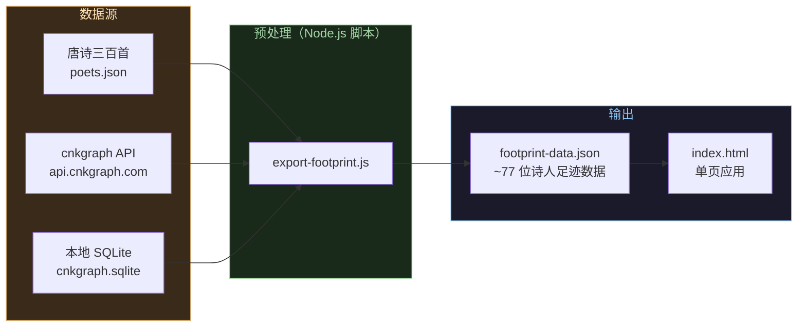
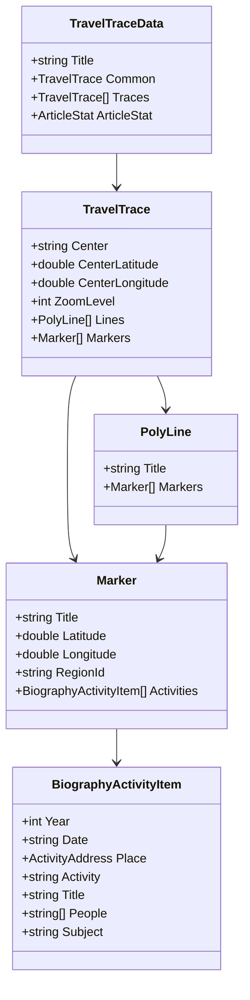
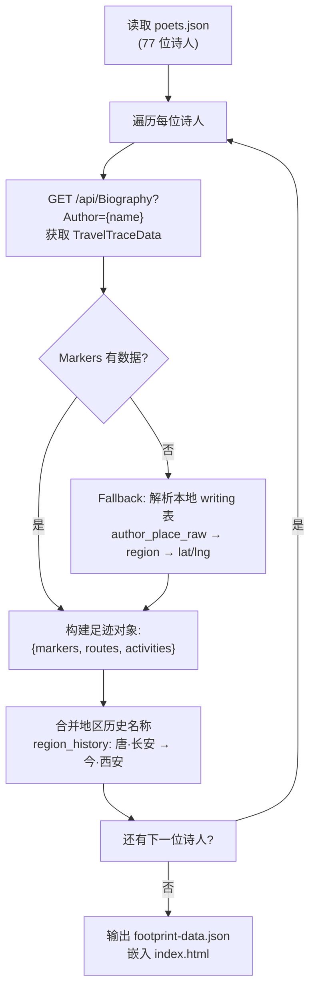
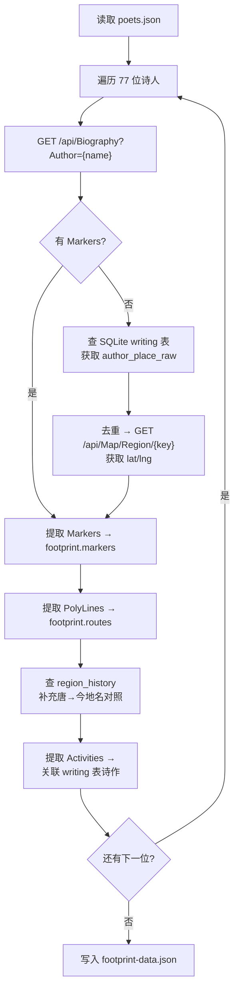
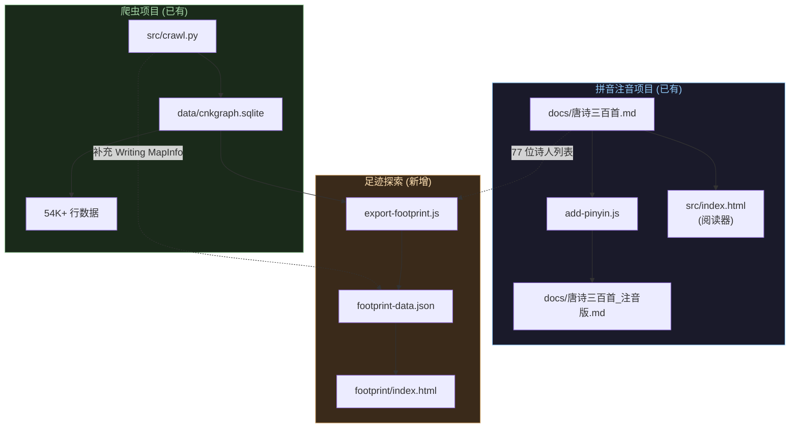

# PRD: 唐诗诗人足迹探索

> 以地图可视化展示唐代诗人的生平轨迹与创作地点，让唐诗三百首"活"在地图上。

## 1. 产品愿景

**一句话**：选择一位唐代诗人，在暗色古风地图上看到他一生的行迹——从出生地到仕途辗转，从饮酒赋诗到流放归途——每一步都附带时间、事件和对应的诗作。

**用户故事**：

- 作为一个唐诗爱好者，我想看到李白从碎叶城到长安再到流放夜郎的完整路线，感受他"仰天大笑出门去"的豪迈
- 作为一个学生，我想在地图上对比杜甫和李白的人生轨迹，理解"诗仙"与"诗圣"为何风格迥异
- 作为一个研究者，我想用时间轴过滤安史之乱前后诗人的创作地点变化

## 2. 数据架构

### 2.1 数据流总览



### 2.2 数据源详解

| 数据 | 来源 | 获取方式 | 说明 |
|------|------|---------|------|
| 诗人列表 | `docs/唐诗三百首.md` | 解析 `###` 标题下的 `>` 行 | 77 位诗人 |
| 生平行迹 | `GET /api/Biography?Author={name}` | 实时 API | TravelTraceData（Markers + PolyLines）|
| 作品地理 | `GET /api/Writing/{id}/MapInfo` | 实时 API | 作品关联的地域标注（Swagger 未文档化）|
| 地理坐标 | `GET /api/Map/Region/{key}` | 实时 API | RegionInfoDto（lat/lng）|
| 地区历史 | 本地 `region_history` 表 | SQLite | 唐朝地名→现代地名+坐标 |
| 作品文本 | 本地 `writing` + `writing_clause` 表 | SQLite | 诗作内容 + `author_place_raw` |
| 创作统计 | `GET /api/Biography/Stat` | 实时 API | 按地区统计作品数量 |

### 2.3 API 数据模型



## 3. 核心功能

### 3.1 功能矩阵

| # | 功能 | 优先级 | 说明 |
|---|------|--------|------|
| F1 | 诗人选择器 | P0 | 左栏列表，支持搜索，显示朝代和诗作数 |
| F2 | 交互式地图 | P0 | 暗色底图 + 足迹标记 + 路线连线 |
| F3 | 足迹标记点 | P0 | 点击标记显示：地点名、年份、事件、诗作片段 |
| F4 | 时间轴滑块 | P1 | 底部年份轴，拖动过滤对应年代的足迹 |
| F5 | 路线动画 | P1 | 按年份顺序依次点亮标记，模拟旅行 |
| F6 | 多诗人对比 | P2 | 叠加 2-3 位诗人轨迹，不同颜色区分 |
| F7 | 诗作弹窗 | P2 | 点击标记显示完整诗作（原文+拼音注音）|
| F8 | 地区热力图 | P3 | 按 `/api/Biography/Stat` 渲染创作密度 |

### 3.2 页面布局

```
┌─────────────────────────────────────────────────────────────┐
│  唐诗足迹探索                              [☀/🌙 主题切换]   │
├──────────┬──────────────────────────────────────────────────┤
│ 诗人列表  │                                                  │
│ ┌──────┐ │                                                  │
│ │🔍 搜索 │ │                                                  │
│ └──────┘ │              交互式地图                           │
│          │         （MapLibre GL 暗色底图）                   │
│ ☑ 李白   │                                                  │
│   盛唐    │     ● 开元十三年·出蜀                            │
│   310首   │       ↓                                         │
│ ☐ 杜甫   │     ● 江陵                                      │
│   盛唐    │       ↓                                         │
│   298首   │     ● 天宝元年·入长安                           │
│ ☐ 王维   │       ↓                                         │
│   盛唐    │     ● 终南山                                    │
│   ...    │       ...                                       │
│          │     ● 宝应元年·当涂                              │
│ ─────── │                                                  │
│ 图例     │                                                  │
│ ● 出生  │                                                  │
│ ● 仕途  │                                                  │
│ ● 流放  │                                                  │
│ ● 隐居  │                                                  │
├──────────┴──────────────────────────────────────────────────┤
│  701 ───────●────────●──────────●────────────●────── 762   │
│             出蜀    长安      安史之乱       晚年             │
│                        ◀── 时间轴滑块 ──▶                    │
└─────────────────────────────────────────────────────────────┘
```

### 3.3 标记点交互

```
点击标记 → 弹出卡片:
┌──────────────────────────────┐
│  📍 长安 (今西安)             │
│  天宝元年 (742)               │
│  ─────────────────────       │
│  事件：奉诏入京，供奉翰林      │
│  官职：翰林供奉               │
│  相关人物：贺知章、唐玄宗      │
│  ─────────────────────       │
│  《清平调·其一》               │
│  云想衣裳花想容，              │
│  春风拂槛露华浓。              │
│  若非群玉山头见，              │
│  会向瑶台月下逢。              │
│                     [查看全诗] │
└──────────────────────────────┘
```

## 4. 数据策略

### 4.1 方案对比

| 维度 | A: 纯实时 API | B: 纯预处理 JSON | C: 混合（推荐） |
|------|-------------|----------------|---------------|
| 离线可用 | ❌ | ✅ | ✅（核心数据离线）|
| 数据新鲜度 | ✅ 实时 | ❌ 需重跑 | ⚠️ 增量更新 |
| API 压力 | 大（每次打开都请求）| 无 | 小（仅首次/刷新）|
| 加载速度 | 慢（串行请求多）| 快 | 快 |
| 部署难度 | 需 CORS 支持 | 纯静态 | 纯静态 |

### 4.2 推荐方案：混合策略（C）

**预处理阶段**（Node.js 脚本 `export-footprint.js`）：



**Fallback 链路**（Biography 无数据时）：

```
writing.author_place_raw (如 "长安")
    → GET /api/Map/Region/{key} (获取 lat/lng)
    → 或 GET /api/Writing/{id}/MapInfo
    → 或查本地 region_history 表匹配
```

### 4.3 输出数据格式

```json
{
  "poets": [
    {
      "id": 15188,
      "name": "李白",
      "dynasty": "盛唐",
      "poemCount": 310,
      "birthYear": 701,
      "deathYear": 762,
      "center": { "lat": 34.26, "lng": 108.94, "zoom": 5 },
      "markers": [
        {
          "id": "m1",
          "title": "碎叶城",
          "modernName": "吉尔吉斯斯坦托克马克",
          "lat": 42.83,
          "lng": 75.30,
          "year": 701,
          "category": "出生",
          "activities": ["出生于碎叶城"],
          "people": [],
          "poems": []
        },
        {
          "id": "m2",
          "title": "长安",
          "modernName": "陕西西安",
          "lat": 34.26,
          "lng": 108.94,
          "year": 742,
          "category": "仕途",
          "activities": ["奉诏入京，供奉翰林"],
          "people": ["贺知章", "唐玄宗"],
          "poems": [
            { "id": 25558, "title": "清平调·其一", "clauses": ["云想衣裳花想容", "春风拂槛露华浓"] }
          ]
        }
      ],
      "routes": [
        {
          "title": "出蜀入京",
          "yearRange": [725, 742],
          "points": [[30.57, 104.07], [32.06, 112.15], [34.26, 108.94]],
          "markerIds": ["m_蜀", "m_江陵", "m_长安"]
        }
      ]
    }
  ]
}
```

## 5. 技术方案

### 5.1 技术选型

| 组件 | 选型 | 理由 |
|------|------|------|
| 地图引擎 | **MapLibre GL JS** v4 | 开源免费，矢量瓦片，暗色主题，动画流畅 |
| 底图瓦片 | CartoDB Dark Matter | 免费，无需 API key，暗色风格 |
| 前端框架 | **无框架（Vanilla JS）** | 与现有 `src/index.html` 一致 |
| 数据预处理 | **Node.js 脚本** | 与现有 `build.js` 一致 |
| 部署 | **GitHub Pages** | 纯静态，零成本 |
| 主题 | CSS custom properties | 复用现有 dark/light 主题系统 |

### 5.2 地图瓦片选项

| 瓦片源 | URL | 免费 | 暗色 | 中文 |
|--------|-----|------|------|------|
| CartoDB Dark Matter | `basemaps.cartocdn.com/dark_all` | ✅ | ✅ | ❌ |
| Stadia Maps Alidade Smooth Dark | `tiles.stadiamaps.com/tiles/alidade_smooth_dark` | ✅ | ✅ | ❌ |
| 高德暗色 | `wprd0{s}.is.autonavi.com` | ✅ | ✅ | ✅ |
| 天地图暗色 | `t{s}.tianditu.gov.cn` | 需 key | ✅ | ✅ |

**推荐**：CartoDB Dark Matter 作为默认（无需 key），高德暗色作为中文可选替代。

### 5.3 文件结构

```
cnkgraph/
├── footprint/                    # 足迹探索前端
│   ├── index.html               # 单页应用（HTML+CSS+JS 内联）
│   ├── data/
│   │   └── footprint-data.json  # 预处理的诗人足迹数据
│   └── export-footprint.js      # 数据预处理脚本
├── src/
│   ├── crawl.py                 # 现有爬虫（补充 footprint 数据导出）
│   └── stages/                  # 现有 stage 文件
└── docs/
    └── prd-footprint-explorer.md # 本文档
```

### 5.4 依赖

```
# index.html 仅引入 CDN
<script src="https://unpkg.com/maplibre-gl@4.x/dist/maplibre-gl.js"></script>
<link href="https://unpkg.com/maplibre-gl@4.x/dist/maplibre-gl.css" rel="stylesheet" />

# export-footprint.js 使用现有 Node.js 依赖
# 无新增 npm 包
```

## 6. 数据预处理脚本设计

### 6.1 `export-footprint.js` 流程



### 6.2 诗人列表来源

从现有 `docs/唐诗三百首.md` 提取诗人列表（77 位），格式：

```json
[
  { "name": "李白", "dynasty": "盛唐", "poems": 310 },
  { "name": "杜甫", "dynasty": "盛唐", "poems": 298 },
  { "name": "王维", "dynasty": "盛唐", "poems": 145 },
  ...
]
```

### 6.3 Fallback 策略详解

```
1. 首选：GET /api/Biography?Author={name}
   → TravelTraceData.Markers[].Activities[]

2. Fallback A：GET /api/Writing/{id}/MapInfo
   → 未文档化，需实测

3. Fallback B：解析本地 writing.author_place_raw
   → GET /api/Map/Region/{place_raw}
   → 匹配本地 region_history.name (WHERE begin_year <= 年 AND end_year >= 年)

4. Fallback C：GET /api/People/{id}/MapInfo
   → 籍贯 + 活动地点映射
```

## 7. UI 设计规范

### 7.1 配色

沿用现有主题系统，新增地图专用色：

```css
/* 地图标记颜色 */
--marker-birth: #4caf50;       /* 出生 — 绿色 */
--marker-career: #2196f3;      /* 仕途 — 蓝色 */
--marker-exile: #f44336;       /* 流放 — 红色 */
--marker-hermit: #ff9800;      /* 隐居 — 橙色 */
--marker-travel: #9c27b0;      /* 游历 — 紫色 */
--marker-death: #9e9e9e;       /* 逝世 — 灰色 */

/* 路线颜色 */
--route-line: rgba(212, 167, 106, 0.6);  /* 金色半透明 */
--route-active: rgba(212, 167, 106, 1.0); /* 金色实线 */

/* 多诗人对比色 */
--poet-color-1: #ef5350;       /* 诗人1 — 红 */
--poet-color-2: #42a5f5;       /* 诗人2 — 蓝 */
--poet-color-3: #66bb6a;       /* 诗人3 — 绿 */
```

### 7.2 标记图标

使用 MapLibre GL 的 HTML Marker，自定义 DOM 元素：

```
普通标记:  ● (圆形，6px，带颜色)
当前选中:  ● + 光晕效果 (box-shadow)
有诗作:    ● + 右上角小诗卷图标
```

### 7.3 时间轴

```
底部固定栏，高度 60px:
- 背景：半透明深色
- 年份刻度：每 10 年一个刻度
- 滑块：双滑块（起始年-结束年）
- 当前范围高亮：金色条
- 事件标注：重要事件显示小三角标记
```

## 8. 实施路线图

### 第一期：MVP（预计 2-3 天）

**目标**：李白单人足迹地图，验证数据链路

| 步骤 | 内容 | 产出 |
|------|------|------|
| 1 | 编写 `export-footprint.js`，导出李白足迹 JSON | `footprint-data.json` |
| 2 | 创建 `footprint/index.html`，加载 JSON + MapLibre GL | 可交互地图 |
| 3 | 实现诗人选择器 + 标记点 + 点击弹窗 | 基础功能 |

**MVP 验收标准**：
- 选择李白 → 地图定位到中国
- 看到 10+ 个标记点（至少覆盖长安、洛阳、成都、金陵）
- 点击标记显示地点名 + 年份 + 事件描述
- 标记之间有连线

### 第二期：完善（预计 2 天）

**目标**：77 位诗人全覆盖 + 时间轴

| 步骤 | 内容 |
|------|------|
| 4 | 扩展 `export-footprint.js` 预处理全部 77 位诗人 |
| 5 | 实现时间轴滑块，拖动过滤标记 |
| 6 | 标记点显示诗作片段 |
| 7 | 路线动画（按年份依次点亮） |
| 8 | 响应式布局（移动端适配） |

### 第三期：增强（预计 2 天）

**目标**：多诗人对比 + 热力图 + 部署

| 步骤 | 内容 |
|------|------|
| 9 | 多诗人叠加对比（不同颜色路线） |
| 10 | 地区热力图（`/api/Biography/Stat`） |
| 11 | 主题切换（dark/light） |
| 12 | 部署到 GitHub Pages |
| 13 | 在主项目 README 中添加入口链接 |

## 9. 风险与应对

| 风险 | 影响 | 应对 |
|------|------|------|
| Biography API 对多数诗人返回空 | 足迹数据不全 | Fallback: 解析 `writing.author_place_raw` + `region_history` |
| API 429 限流 | 预处理脚本中断 | 已有重试机制；预处理只需跑一次 |
| 地区历史名称匹配不准 | 足迹坐标偏移 | 用 `region_history.begin_year/end_year` 限定朝代范围 |
| 移动端地图性能差 | 体验差 | 限制同时显示的标记数量，使用聚合 |
| CartoDB 瓦片国内加载慢 | 中国用户白屏 | 备选高德暗色瓦片 |
| 诗人同名/多名 | 数据匹配错误 | 使用 `person_alias` 表匹配所有别名 |

## 10. 与现有项目的关系



三个子系统共享 `唐诗三百首` 诗人列表和 cnkgraph 数据，但各自独立运行、独立部署。
