# PRD: cnkgraph 全量数据爬虫

## 一、项目目标

将古籍文献知识图谱网 (cnkgraph.com) 的全部开放数据爬取到本地 DuckDB 数据库，一次爬取永久受用。

## 二、技术栈选型：Python

### 2.1 JS vs Python 对比

| 对比项 | Python | Node.js |
|-------|--------|---------|
| DuckDB 绑定 | **官方一等公民** (1.5.2 已装) | npm 第三方包，API 不全 |
| 异步 HTTP | **aiohttp 3.13 已装**，支持连接池/限速 | fetch 原生，但无连接池 |
| 并发模型 | asyncio + Semaphore 精确控并发 | 单线程事件循环 |
| 进度显示 | tqdm（需装） | 自写 |
| 数据处理 | pandas / 原生 | 手写 |
| 与主项目关系 | **独立脚本，不影响 build.js** | 同一生态但职责不同 |
| 重试/容错 | tenacious 等成熟库 | 手写 |
| DB 批量写入 | **duckdb Python COPY 极快** | 逐条 INSERT |

**结论：Python。** DuckDB 官方绑定 + aiohttp + asyncio 三件套，本机已就绪，零配置启动。

### 2.2 技术栈

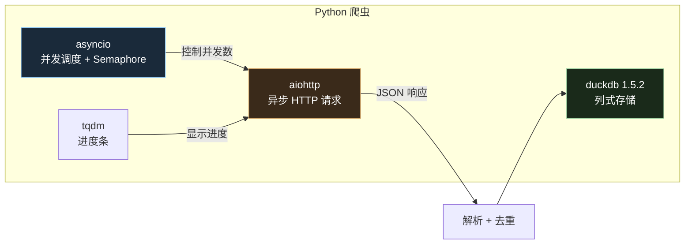

## 三、数据源与规模

| 模块 | 端点前缀 | 数据量 | API 页数 |
|------|---------|--------|---------|
| 年历 | `/api/calendar` | ~30 朝代 + ~5000 年号 | ~500 |
| 人物 | `/api/people` | ~100,000 人 | ~5,000 |
| 诗文 | `/api/writing` | **2,012,794 首** | ~100,000 |
| 地理 | `/api/map/region` | ~3,000 区划 | ~3,000 |
| 古籍 | `/api/book` | ~7,000 部 | ~7,000 |
| 词汇典故 | `/api/glossary` | ~50,000 条 | ~3,000 |
| 韵典 | `/api/rhyme` | ~300 韵目 | ~100 |
| 词谱 | `/api/ciTune` | ~800 词牌 | ~50 |
| 曲谱 | `/api/quTune` | ~400 曲牌 | ~30 |
| 类书 | `/api/category` | ~50,000 条 | ~2,000 |
| 字典 | `/api/char` | ~20,000 字 | ~20,000 |
| 景观 | `/api/map/scenery` | ~10,000 处 | ~500 |

**总计**：~141,000 次 API 调用，300ms 间隔 → 单线程 ~12h，5 并发 → ~3h。

## 四、系统架构

### 4.1 目录结构

```
cnkgraph/
├── data/
│   └── cnkgraph.duckdb          # 爬取目标数据库
├── docs/
│   └── prd.md                   # 本文档
├── postman/                     # API 参考集合
├── src/
│   ├── crawl.py                 # 主入口：CLI 调度
│   ├── db.py                    # DuckDB 建表 + 写入
│   ├── api.py                   # aiohttp 客户端 + 限速
│   ├── stages/                  # 各阶段爬虫
│   │   ├── stage1_calendar.py   # 年历
│   │   ├── stage2_people.py     # 人物
│   │   ├── stage3_writing.py    # 诗文（重头）
│   │   ├── stage4_region.py     # 地理
│   │   └── stage5_reference.py  # 古籍/词汇/韵典/词曲谱/类书/字典
│   └── models.py                # 数据清洗 + 转换
└── output/                      # 导出产物
```

### 4.2 爬取流程

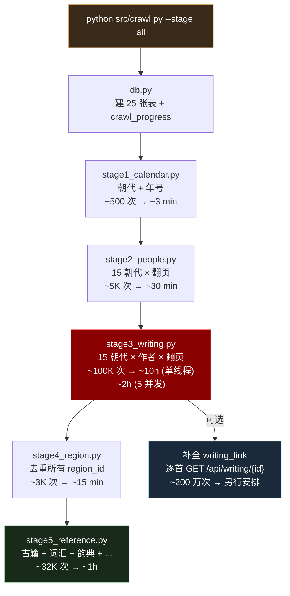

### 4.3 断点续爬

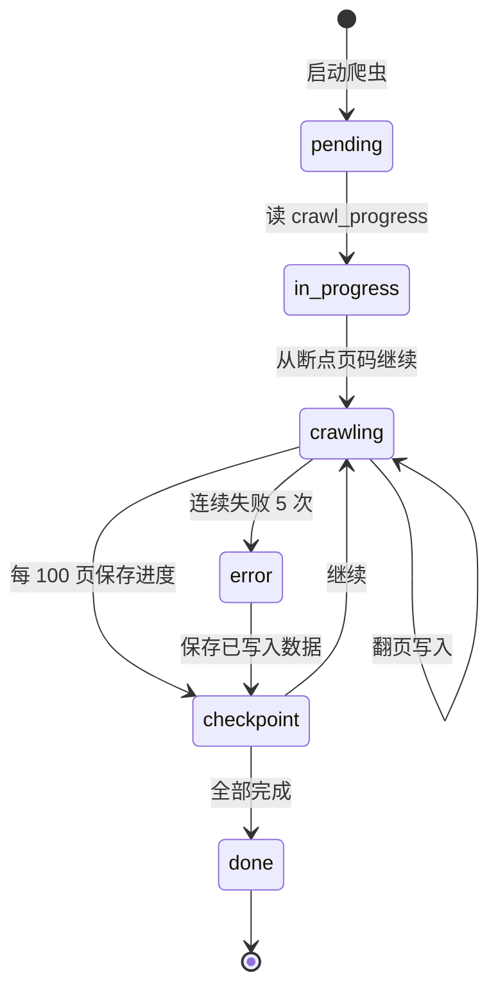

每个 stage 在 `crawl_progress` 表中记录：

| 字段 | 说明 |
|------|------|
| module | 模块名 (writing/people/region/...) |
| dynasty | 当前朝代 |
| author_id | 当前作者 |
| page_no | 当前页码 |
| status | pending / in_progress / done |
| row_count | 已写入行数 |
| updated_at | 最后更新时间 |

### 4.4 并发与限速

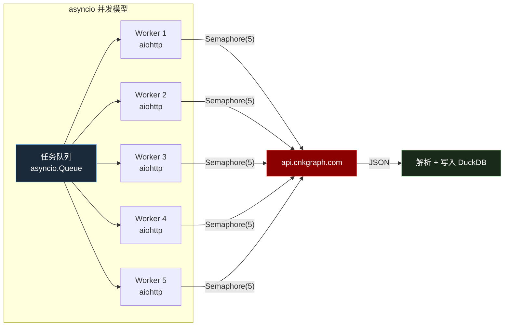

- **并发数**：默认 5（Semaphore 控制）
- **间隔**：每个请求间 200ms 随机抖动（避免被限流）
- **重试**：失败自动重试 3 次，指数退避 (1s, 2s, 4s)
- **连续失败**：同一页连续失败 5 次则跳过，记录到 error_log 表

## 五、25 张表设计

见 `docs/poem-dating-research.md` 第六章。爬虫按以下依赖顺序写入：

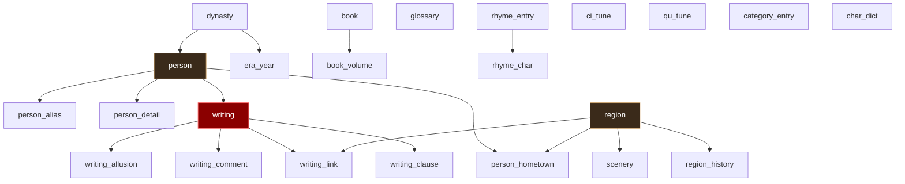

## 六、各阶段详细设计

### Stage 1: 年历 (~3 min)

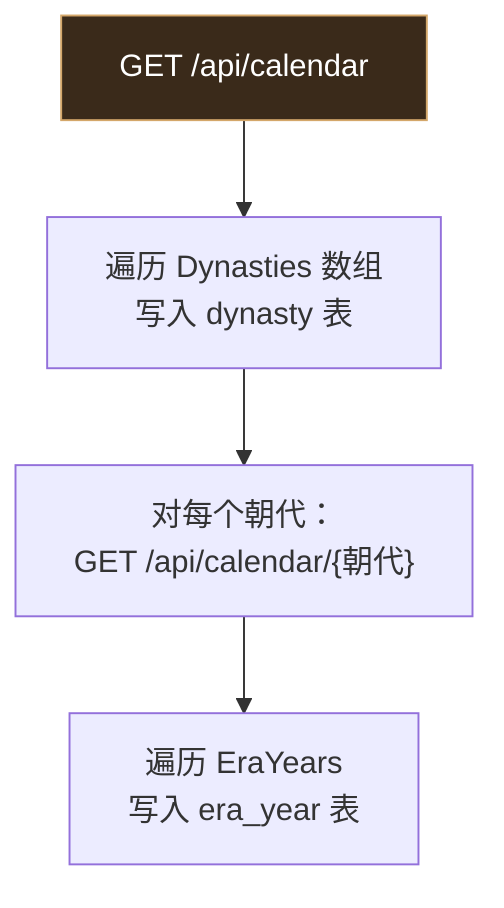

### Stage 2: 人物 (~30 min)

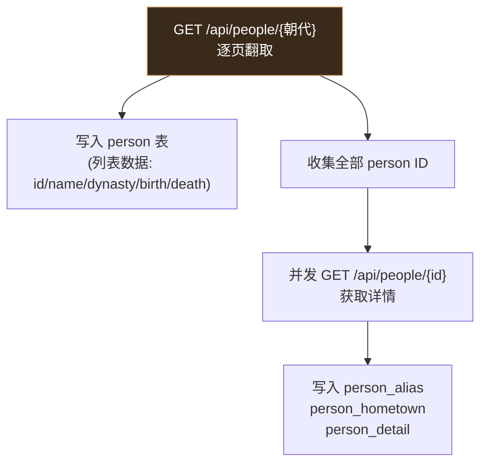

### Stage 3: 诗文 (~2-10 h)

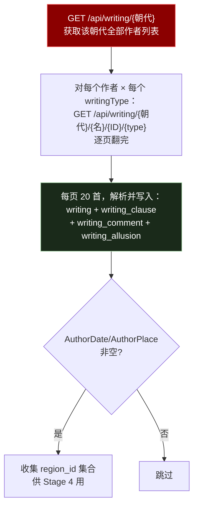

**优化**：按朝代大小排序（宋朝 46 万首 > 明朝 61 万首 > 清朝 76 万首），先爬小朝代快速产出可用数据。

### Stage 4: 地理 (~15 min)

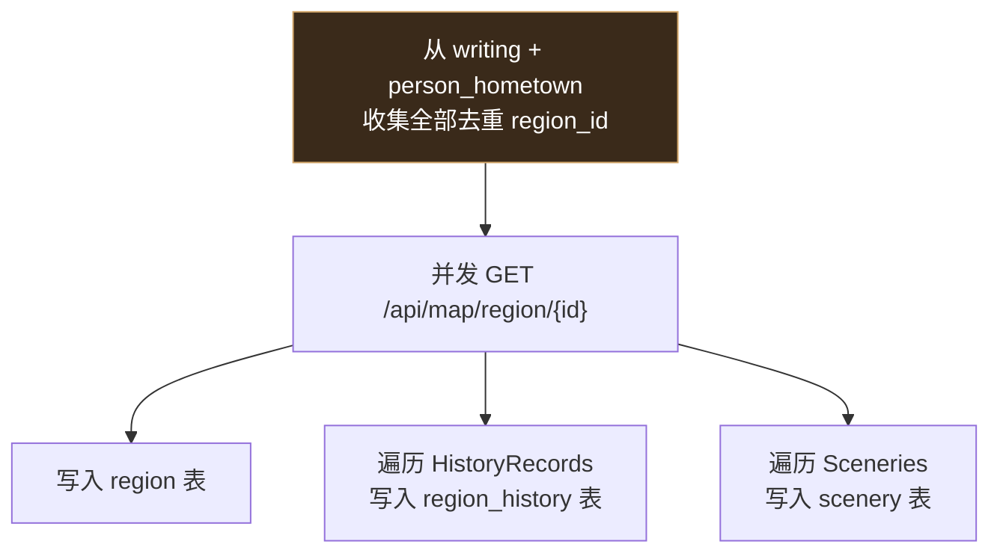

### Stage 5: 参考数据 (~1 h)

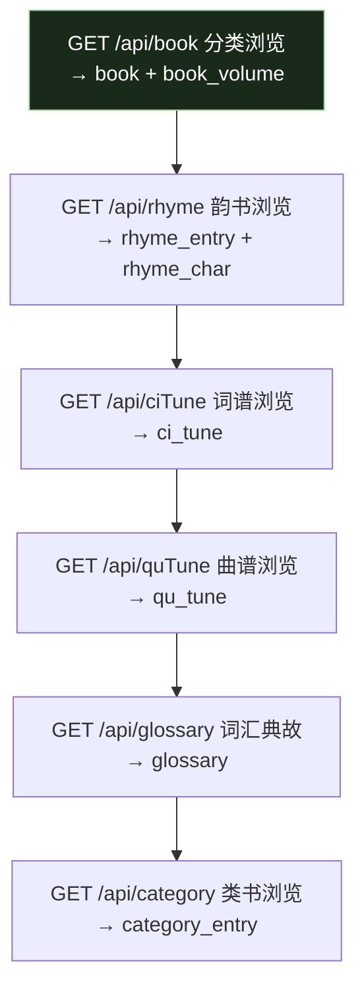

## 七、容错设计

| 场景 | 策略 |
|------|------|
| 网络超时 | aiohttp timeout=30s，自动重试 3 次 |
| 服务器 5xx | 指数退避重试 (1s, 2s, 4s) |
| 返回 HTML 错误页 | 检测 Content-Type，非 JSON 则跳过并记录 |
| 数据库写入失败 | 事务回滚，不丢失已写入数据 |
| 进程中断 | crawl_progress 记录精确断点，重启后续爬 |
| 磁盘满 | 每阶段开始前检查磁盘剩余 |
| 重复数据 | 所有表用 PRIMARY KEY 去重，INSERT OR IGNORE |

## 八、细粒度爬取策略

由于数据量大（200 万+ 诗文），用户需要**一张表一张表、乃至一个朝代或一位作者地分批爬取**，避免一次性耗时过长。

### 8.1 爬取粒度层级

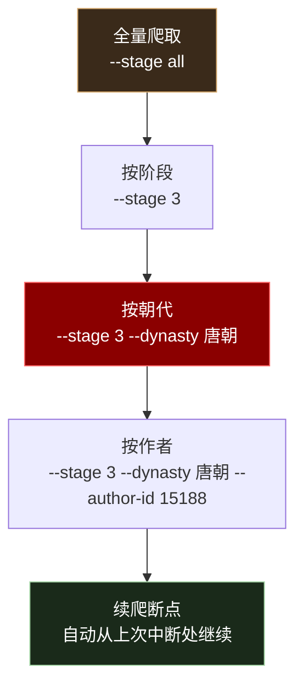

### 8.2 各阶段支持的粒度

| 阶段 | 模块 | 粒度参数 | 示例 |
|------|------|---------|------|
| 1 | 年历 | 全量（3 min，无需拆分） | `--stage 1` |
| 2 | 人物 | `--dynasty` | `--stage 2 --dynasty 唐朝` |
| 3 | 诗文 | `--dynasty` + `--author-id` | `--stage 3 --dynasty 唐朝 --author-id 15188` |
| 4 | 地理 | 全量（15 min，无需拆分） | `--stage 4` |
| 5 | 参考数据 | 按子模块：book/glossary/rhyme/ciTune/quTune/category/char | `--stage 5 --module book` |

### 8.3 Stage 3（诗文）朝代爬取顺序建议

按数据量从小到大排序，先爬小朝代快速产出可用数据：

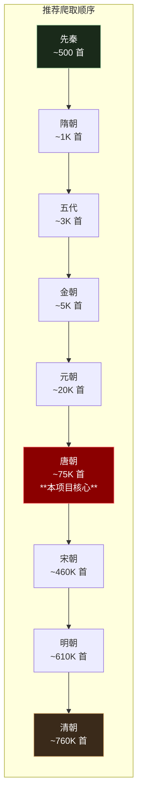

### 8.4 典型使用场景

```bash
# 场景一：先爬唐诗三百首所需的唐朝数据（~75K 首，约 20 分钟）
python src/crawl.py --stage 1
python src/crawl.py --stage 2 --dynasty 唐朝
python src/crawl.py --stage 3 --dynasty 唐朝
python src/crawl.py --stage 4

# 场景二：只爬某位作者的全部诗文
python src/crawl.py --stage 3 --dynasty 唐朝 --author-id 15188   # 李白全部诗文

# 场景三：周末爬全量，分多天完成
# 第一天：基础数据 + 人物 + 唐宋诗文
python src/crawl.py --stage 1
python src/crawl.py --stage 2
python src/crawl.py --stage 3 --dynasty 先秦
python src/crawl.py --stage 3 --dynasty 秦朝
# ... 每天爬几个朝代
# 最后：地理 + 参考数据
python src/crawl.py --stage 4
python src/crawl.py --stage 5

# 场景四：参考数据分模块爬
python src/crawl.py --stage 5 --module book       # 古籍
python src/crawl.py --stage 5 --module glossary   # 词汇典故
python src/crawl.py --stage 5 --module char        # 字典（耗时最长）
```

### 8.5 断点续爬机制

每个爬取任务在 `crawl_progress` 表中精确记录断点。**任意时刻中断后重启，自动从断点继续**，已写入的数据不会重复（`INSERT ON CONFLICT DO NOTHING`）。

```
第一次运行：python src/crawl.py --stage 3 --dynasty 唐朝
  → 爬到第 50 页时 Ctrl+C 中断

第二次运行：python src/crawl.py --stage 3 --dynasty 唐朝
  → 自动从第 51 页继续，前 50 页数据完整保留
```

## 九、CLI 接口

```bash
# 全量爬取（按顺序执行 5 个阶段）
python src/crawl.py

# 只跑某个阶段
python src/crawl.py --stage 1          # 年历
python src/crawl.py --stage 3          # 诗文（全部朝代）

# 按朝代爬取
python src/crawl.py --stage 3 --dynasty 唐朝    # 只爬唐朝诗文
python src/crawl.py --stage 2 --dynasty 唐朝    # 只爬唐朝人物

# 按作者爬取
python src/crawl.py --stage 3 --dynasty 唐朝 --author-id 15188  # 李白全部诗文

# 参考数据按模块爬取
python src/crawl.py --stage 5 --module book       # 古籍
python src/crawl.py --stage 5 --module glossary   # 词汇典故
python src/crawl.py --stage 5 --module rhyme      # 韵典
python src/crawl.py --stage 5 --module ciTune     # 词谱
python src/crawl.py --stage 5 --module quTune     # 曲谱
python src/crawl.py --stage 5 --module category   # 类书
python src/crawl.py --stage 5 --module char       # 字典

# 并发控制
python src/crawl.py --concurrency 10   # 10 并发（默认 5）

# 断点续爬（默认行为）
python src/crawl.py                     # 自动从上次中断处继续

# 重置某个阶段
python src/crawl.py --stage 3 --reset

# 查看进度
python src/crawl.py --status
```

## 十、验收标准

| 指标 | 标准 |
|------|------|
| writing 表行数 | > 2,000,000 |
| person 表行数 | > 100,000 |
| region 表行数 | > 2,000 |
| dynasty 覆盖 | 全部 15 个朝代 |
| 断点续爬 | 中断后重启可继续 |
| DuckDB 文件 | < 2 GB |

## 十一、风险与对策

| 风险 | 对策 |
|------|------|
| API 被限流/封 IP | Semaphore 控并发 + 随机间隔；被封则降低并发 |
| 爬取时间过长（10h+） | 分阶段可中断；5 并发缩至 2-3h |
| 数据格式变化 | 解析失败跳过并记录，不中断全流程 |
| DuckDB 文件过大 | 列式压缩预计 500MB-1GB；超预期可裁剪 |
| 非商业使用限制 | 仅用于个人学习项目，不对外提供服务 |

---

*文档更新日期：2026-06-02*
