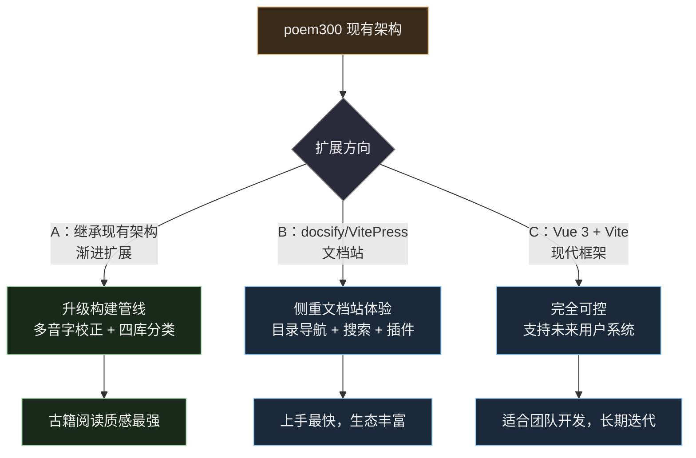
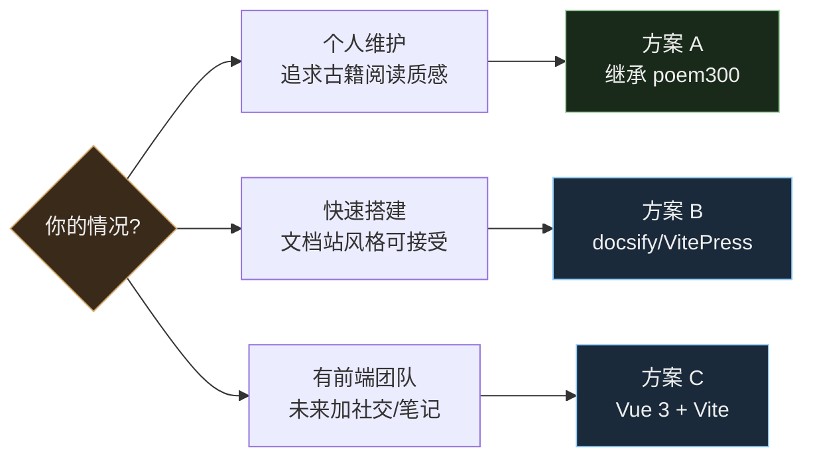
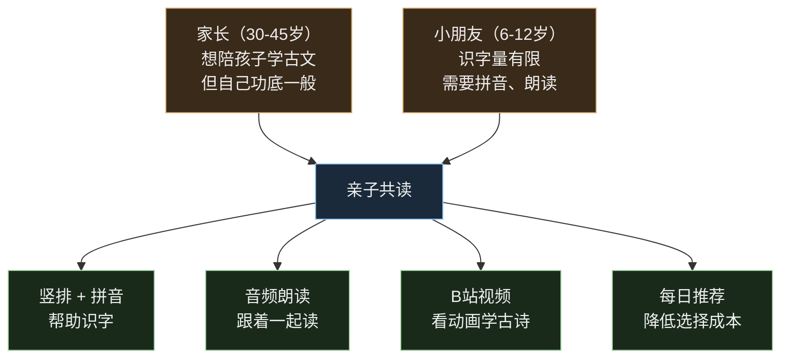
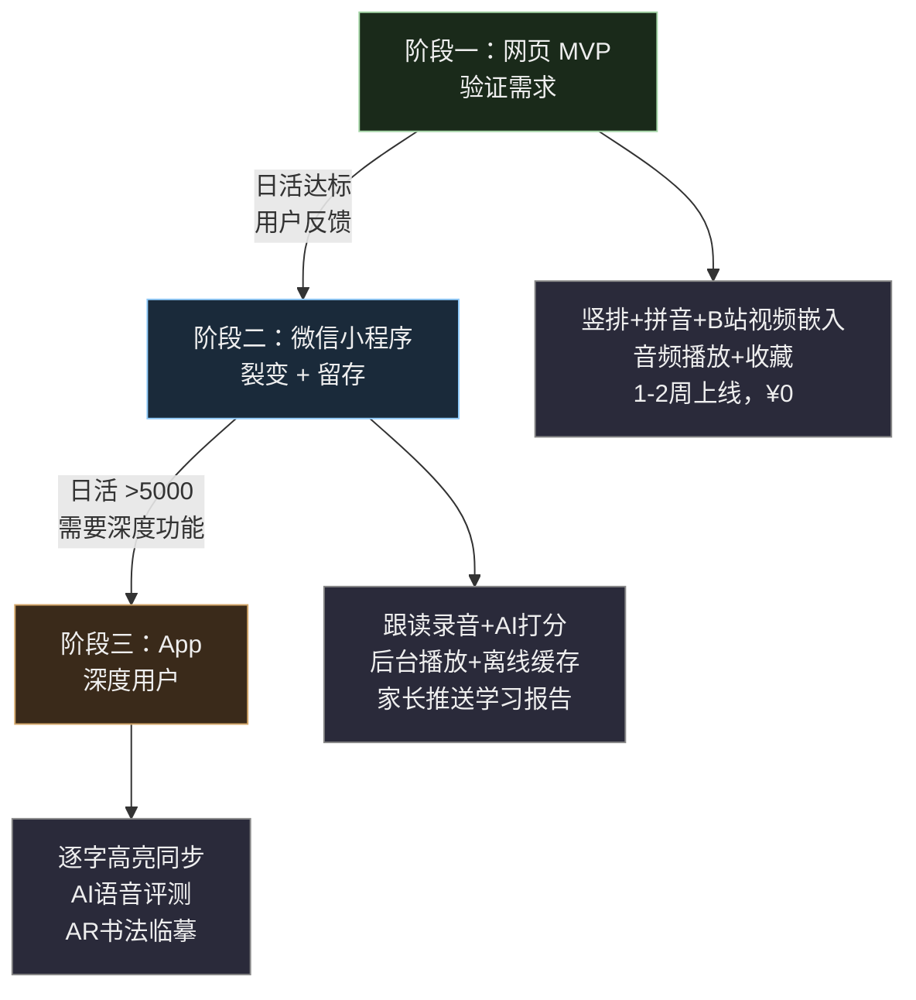

# 中华经典文库 — 产品扩展方案

> 基于 Kimi 对话整理，从「唐诗三百首注音版」扩展到「经史子集全品类」的产品规划，以及面向「亲子共读」场景的平台策略。

## 一、现有架构评价

| 环节 | 技术 | 评价 |
|------|------|------|
| 拼音生成 | `pinyin-pro` + Node.js | 稳定可靠，适合批量处理 |
| 竖排排版 | 赫蹏 heti | 专门的中文竖排方案 |
| 前端 | 原生 HTML/CSS/JS | 零依赖，加载快 |
| 数据 | Markdown → JSON 构建管线 | 作者友好，易维护 |
| 部署 | GitHub Pages 静态站 | 免费，CDN 全球加速 |

## 二、扩展到四库全品类的方案选型

### 三种技术路线



### 方案对比

| 维度 | A：继承 poem300 | B：docsify/VitePress | C：Vue 3 + Vite |
|------|----------------|---------------------|-----------------|
| 竖排控制 | 精细（heti 专门优化） | 需额外 CSS 调优 | 完全自由 |
| 拼音位置 | 四方位可调 | 默认上方，需自定义 | 完全自由 |
| 古籍质感 | 最强 | 偏文档风格 | 完全可控 |
| 维护成本 | 中 | 低（自带很多功能） | 高 |
| 扩展性 | 高（完全可控） | 中（受限于框架架构） | 最高 |
| 适合场景 | 个人维护、追求质感 | 快速搭建 | 团队开发、长期迭代 |

### 推荐策略



## 三、多音字问题

这是古诗文注音最大的坑。`pinyin-pro` 对古汉语多音字（如「说(yuè)乎」「乐(lè/yào)」）会标错。

**解决方案**：建立 `corrections.json` 人工校正表，构建时先自动注音再覆盖。

```json
{
  "论语": {
    "学而时习之不亦说乎": { "说": "yuè" },
    "有朋自远方来不亦乐乎": { "乐": "lè" }
  }
}
```

## 四、文档站方案补充对比

除 docsify 外，还有几个适合竖排+拼音的方案：

| 方案 | 上手难度 | 竖排控制 | 构建速度 | 适合人群 |
|------|---------|---------|---------|---------|
| **docsify** | 最简单 | 需 CSS | 无构建 | 快速验证 |
| **VitePress** | 简单 | 完全可控 | 很快 | Vue 用户 |
| **MkDocs** | 简单 | 需 CSS | 快 | Python 用户 |
| **Docusaurus** | 中等 | 完全可控 | 中等 | React 用户 |
| **Astro** | 中等 | 完全可控 | 最快 | 追求性能 |

**VitePress 不推荐的原因**：它是为技术文档设计的，竖排古籍的 `writing-mode: vertical-rl` + 拼音四方位定位 + 阅读设置持久化需要大量 hack，不如原生方案自如。

## 五、面向亲子共读的产品设计

### 核心场景



### 音频/视频格式支持

| 格式 | 支持方式 | 网页可行性 |
|------|---------|-----------|
| MP3 音频 | HTML5 `<audio>` 标签 | 完美支持 |
| B站视频 | iframe 嵌入播放器 | 完美支持 |
| MP4 视频 | HTML5 `<video>` 标签 | 完美支持 |
| 逐句跟读 | Web Audio API + 字幕同步 | 可实现 |

**网页版的限制**：音频不能后台锁屏播放、不能缓存到本地、没有播放进度记忆。

## 六、平台选型：网页 vs 小程序 vs App

### 分阶段策略



### 平台能力对比

| 维度 | 网页 H5 | 微信小程序 | App |
|------|---------|-----------|-----|
| 开发成本 | 最低 | 中 | 最高 |
| 音频后台播放 | 浏览器限制 | 原生支持 | 完美 |
| 音频离线缓存 | 有限 | 支持 | 完美 |
| 跟读打分 | Web Audio 精度差 | 录音 API 好 | 最佳 |
| 家长分享传播 | 复制链接 | 微信一键分享 | 需下载 |
| 小朋友使用门槛 | 低 | 低 | 高 |
| 支付/会员 | 麻烦 | 微信支付 | 内购 |

### 小程序特有的亲子功能

```
小朋友端：
  打开 → "今日任务：背《春晓》"（家长预设或系统推荐）
  听朗读 → 跟读录音 → AI打分（流畅度/准确度）
  完成打卡 → 获得积分/勋章

家长端：
  微信推送："小明今天完成了《春晓》跟读，得分85分"
  查看周报：本周背了5首，总时长30分钟
  设置学习计划：每天一首，周末复习
```

## 七、从内容站到阅读产品的演进


### 各阶段技术栈

| 阶段 | 架构 | 成本 |
|------|------|------|
| 一 | GitHub Pages 静态站 | ¥0 |
| 二 | Vercel/Cloudflare + Supabase | ¥0-50/月 |
| 三 | Vercel + Supabase + Redis + 对象存储 | ¥100-300/月 |

## 八、关键决策建议

| 问题 | 建议 |
|------|------|
| 先做网页还是小程序？ | **网页 MVP 验证 → 小程序做留存** |
| 音频存在哪？ | 阶段一：CDN/对象存储；阶段二：小程序云存储 |
| B站视频还是自制音频？ | 初期用 B站现成资源，零成本测试 |
| AI 朗读还是真人朗读？ | 先用 AI（成本低），数据好再请专业录制 |
| 收费模式？ | 免费基础内容 + 会员解锁全部音频/跟读功能 |
| 古籍特色功能？ | 背诵打卡、书法临摹、历代评点多层嵌套 |
