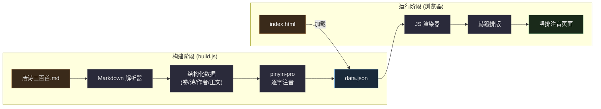
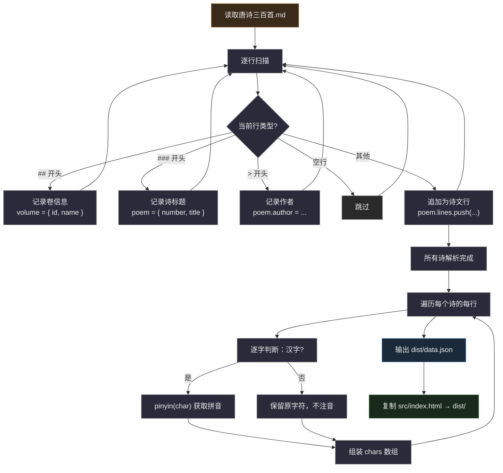
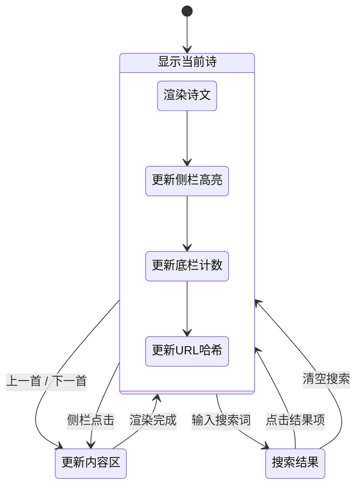
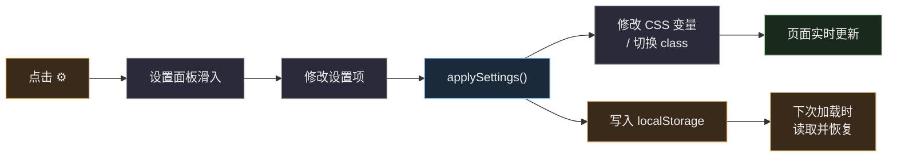
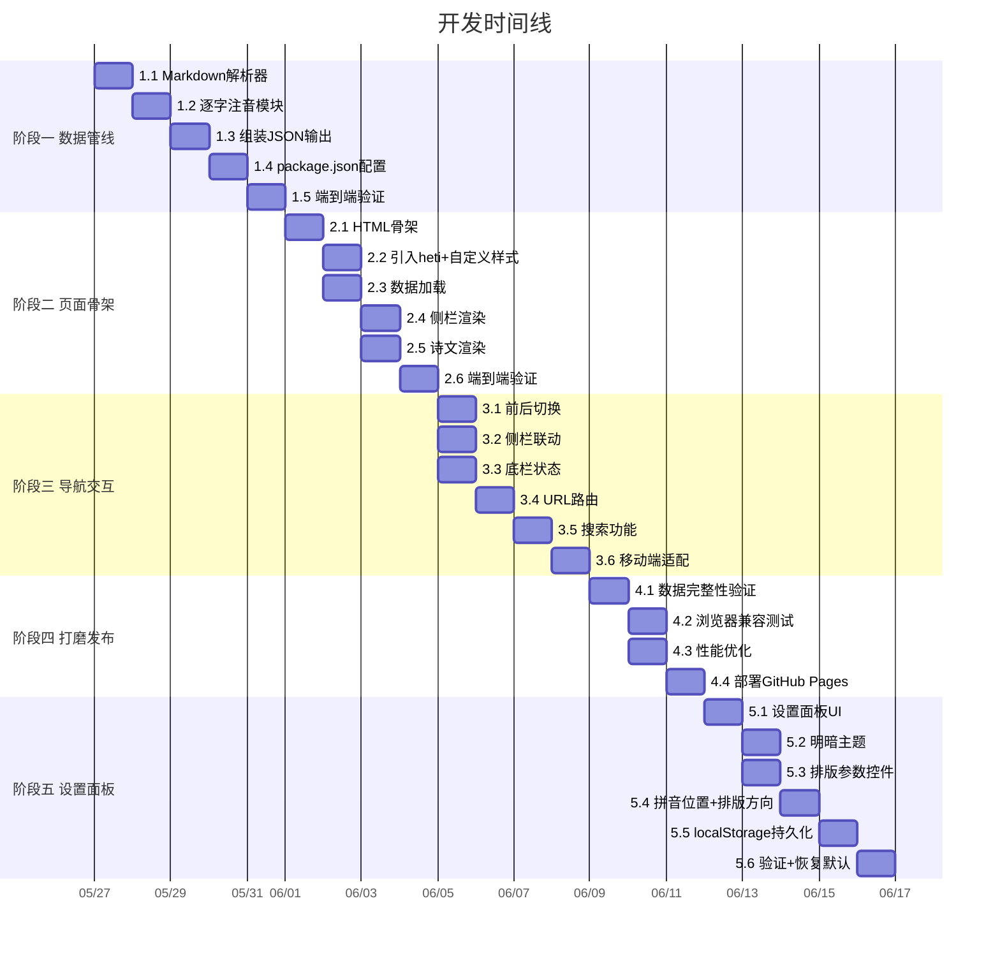
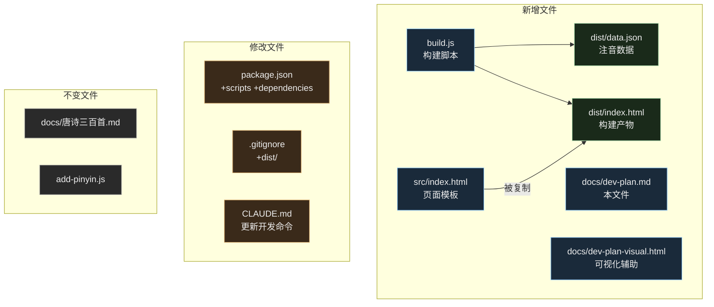

# 开发规划 — 唐诗三百首注音网页版（古籍竖排）

> 配套可视化：`docs/dev-plan-visual.html`

## 整体架构

## 里程碑与任务拆解

### 阶段一：数据管线（build.js）

目标：把 markdown 源文件转换为带拼音的结构化 JSON。

| # | 任务 | 产出 | 依赖 |
|---|------|------|------|
| 1.1 | 编写 markdown 行解析器，识别 `##`/`###`/`>`/空行/正文 | `parseMarkdown()` 函数 | 无 |
| 1.2 | 编写逐字注音模块，用 pinyin-pro 给汉字注音，标点保留 | `annotateChars()` 函数 | 1.1 |
| 1.3 | 组装 JSON 结构（volumes + poems），写入 `dist/data.json` | `build.js` 主流程 | 1.1, 1.2 |
| 1.4 | 复制 `src/index.html` 到 `dist/index.html`，添加 npm scripts | `package.json` 更新 | 1.3 |
| 1.5 | 端到端验证：运行 `node build.js`，检查输出 JSON 结构和内容 | 验证通过 | 1.4 |

### 阶段二：页面骨架（index.html）

目标：搭出侧栏 + 内容区的布局骨架，能加载 JSON 并渲染第一首诗。

```mermaid
graph TD
    subgraph 页面结构
        HEADER["顶栏：唐诗三百首 · 注音版"]
        SIDEBAR["侧栏目录<br/>按卷分组"]
        CONTENT["内容区<br/>诗文展示"]
        FOOTER["底栏：第X首/共310首"]
        SETTINGS["⚙ 设置面板<br/>排版/主题/拼音"]
    end

    HEADER --> SIDEBAR
    HEADER --> CONTENT
    HEADER --> SETTINGS
    CONTENT --> FOOTER

    subgraph 侧栏数据流
        S1["data.json → volumes"] --> S2["渲染卷标题"]
        S1 --> S3["渲染诗列表<br/>(编号 + 标题)"]
        S3 --> S4["点击 → 切换当前诗"]
    end

    subgraph 内容区数据流
        C1["data.json → poems[id]"] --> C2["生成 &lt;ruby&gt; HTML"]
        C2 --> C3["套用赫蹏类名<br/>heti--ancient<br/>heti--vertical<br/>heti--annotation"]
    end

    subgraph 设置数据流
        ST1["localStorage"] --> ST2["读取设置"]
        ST2 --> ST3["applySettings()"]
        ST3 --> ST4["修改 CSS 变量<br/>切换 class"]
    end

    style HEADER fill:#3a2a1a,stroke:#d4a76a,color:#eee
    style SIDEBAR fill:#3a2a1a,stroke:#d4a76a,color:#eee
    style CONTENT fill:#1a2a1a,stroke:#a5d6a7,color:#eee
    style FOOTER fill:#3a2a1a,stroke:#d4a76a,color:#eee
    style SETTINGS fill:#1a2a3a,stroke:#90caf9,color:#eee
    style S1 fill:#1a2a3a,stroke:#90caf9,color:#eee
    style S2 fill:#2a2a3a,stroke:#888,color:#eee
    style S3 fill:#2a2a3a,stroke:#888,color:#eee
    style S4 fill:#2a2a3a,stroke:#888,color:#eee
    style C1 fill:#1a2a3a,stroke:#90caf9,color:#eee
    style C2 fill:#2a2a3a,stroke:#888,color:#eee
    style C3 fill:#2a2a3a,stroke:#888,color:#eee
    style ST1 fill:#3a2a1a,stroke:#d4a76a,color:#eee
    style ST2 fill:#2a2a3a,stroke:#888,color:#eee
    style ST3 fill:#2a2a3a,stroke:#888,color:#eee
    style ST4 fill:#2a2a3a,stroke:#888,color:#eee
```

| # | 任务 | 产出 | 依赖 |
|---|------|------|------|
| 2.1 | 编写 HTML 骨架：顶栏 + 侧栏 + 内容区 + 底栏 | `src/index.html` 结构 | 无 |
| 2.2 | 引入 heti CSS/JS，编写自定义样式（宣纸背景、墨色文字） | `<style>` 部分 | 2.1 |
| 2.3 | 编写 `loadData()` — fetch data.json，存为全局状态 | JS 数据加载 | 2.1 |
| 2.4 | 编写 `renderSidebar()` — 按卷分组渲染诗列表，点击切换 | 侧栏交互 | 2.3 |
| 2.5 | 编写 `renderPoem()` — 根据诗数据生成 ruby HTML + 赫蹏类名 | 诗文渲染 | 2.3 |
| 2.6 | 端到端验证：浏览器打开，确认第一首诗竖排注音显示正常 | 验证通过 | 2.4, 2.5 |

### 阶段三：导航与交互

目标：完成前后切换、键盘控制、搜索等交互功能。

| # | 任务 | 产出 | 依赖 |
|---|------|------|------|
| 3.1 | 上一首/下一首按钮 + 键盘左右箭头控制 | 导航按钮 | 阶段二 |
| 3.2 | 侧栏当前诗高亮，自动滚动到可见 | 侧栏联动 | 阶段二 |
| 3.3 | 底栏 "第X首/共310首" 更新 | 底栏状态 | 阶段二 |
| 3.4 | URL hash 路由（`#poem-001`），支持分享和前进后退 | hash 路由 | 3.1 |
| 3.5 | 搜索框：按标题/作者/诗句过滤，显示匹配列表 | 搜索功能 | 3.4 |
| 3.6 | 响应式适配：移动端侧栏折叠为汉堡菜单 | 移动端适配 | 3.5 |

### 阶段四：打磨与发布

| # | 任务 | 产出 | 依赖 |
|---|------|------|------|
| 4.1 | 验证全部 310 首诗渲染无报错（批量检查 data.json 完整性） | 数据完整性验证 | 阶段三 |
| 4.2 | 浏览器兼容测试（Chrome / Firefox / Safari / 移动端） | 兼容性报告 | 4.1 |
| 4.3 | 性能优化：data.json gzip 后体积检查，按需加载评估 | 性能基线 | 4.1 |
| 4.4 | 部署到 GitHub Pages | 线上可访问 | 4.2 |

### 阶段五：设置面板

目标：用户可自定义排版参数（主题、字体、字距、行距、拼音大小/位置、排版方向），设置持久化到 localStorage。

| # | 任务 | 产出 | 依赖 |
|---|------|------|------|
| 5.1 | 设置面板 HTML/CSS：侧滑面板 + 表单控件 | 设置面板 UI | 阶段四 |
| 5.2 | 明暗主题切换：CSS 变量覆盖 + `data-theme` 属性 | 主题系统 | 5.1 |
| 5.3 | 排版参数控件：字体、字号、字距、行距、拼音大小滑块 | 排版参数控制 | 5.1 |
| 5.4 | 拼音位置切换（左/右）+ 排版方向切换（竖/横） | 方向控制 | 5.3 |
| 5.5 | localStorage 持久化 + 页面加载时恢复设置 | 设置持久化 | 5.4 |
| 5.6 | 恢复默认按钮 + 验证所有设置项联动正常 | 完整性验证 | 5.5 |

## 任务依赖关系

## 文件变更清单

## 关键技术决策

| 决策 | 选择 | 理由 |
|------|------|------|
| 排版库 | 赫蹏 (heti) | 内置古文/竖排/行间注/诗词版式，MIT 协议 |
| 拼音生成 | pinyin-pro（Node.js 后端） | 已有依赖，API 简单，支持声调 |
| 前端框架 | 无（原生 JS） | 项目规模小，无需引入框架 |
| 数据传递 | 构建 JSON，运行时 fetch | 分离构建和渲染，页面可离线使用 |
| 路由 | URL hash（`#poem-001`） | 无需服务器配置，GitHub Pages 直接支持 |
| 部署 | GitHub Pages | 免费，直接从 dist/ 目录发布 |
