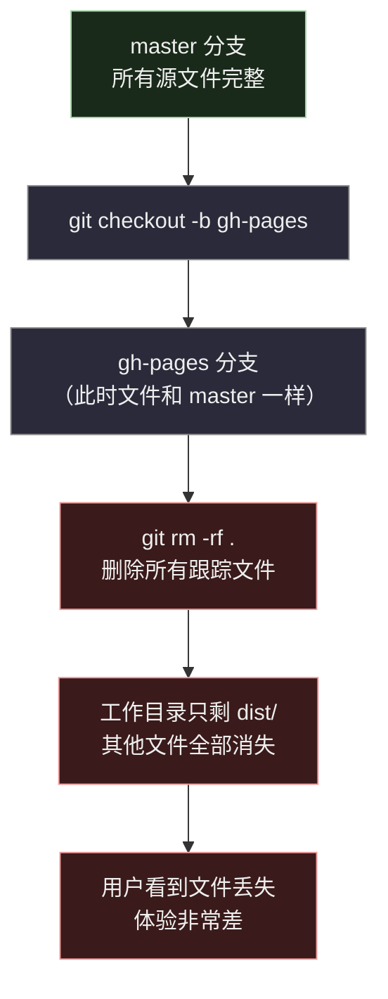
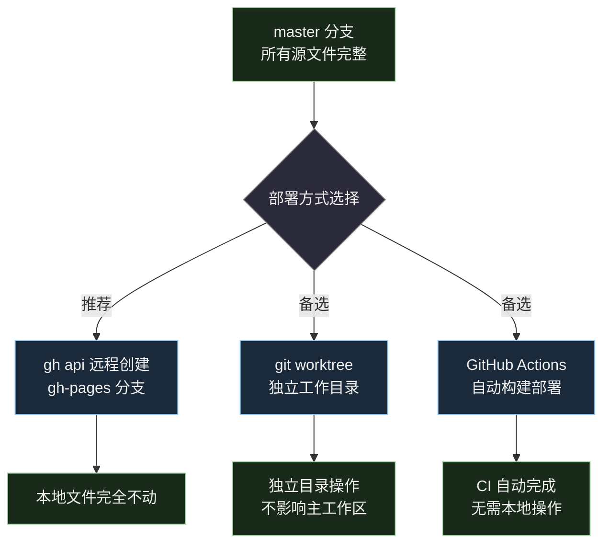
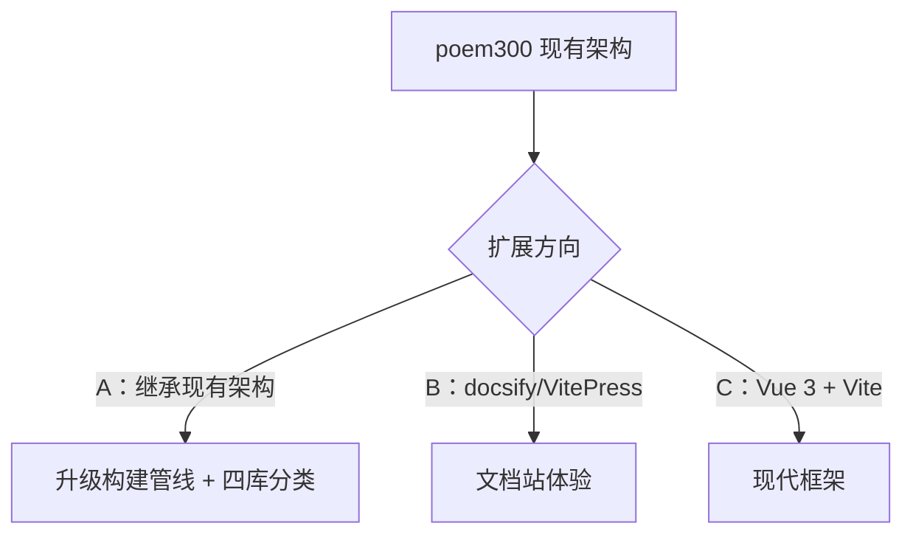

# DevLog — 唐诗三百首注音网页版（古籍竖排）

## 2026-05-26 开发记录

### 项目背景

将 `docs/唐诗三百首.md` 中 310+ 首唐诗做成古籍竖排风格的静态网页，每首诗一页，支持拼音注音和前后切换。

### 今天的开发过程

#### 1. PRD 编写与调研

- 编写了 [docs/prd-web.md](prd-web.md)，确定技术方案：纯静态站 + Node.js 构建脚本
- 调研了 7 个 GitHub 竖排相关项目（vert-cjk-web、縱書卷軸模板、Rubify、LuaTeX-CN、vRain、charch、赫蹏）
- 最终选定 [赫蹏 (heti)](https://github.com/sivan/heti) 作为排版库：内置古文版式、竖排、行间注、诗词排版，MIT 协议，6.4k stars

#### 2. 开发规划

- 编写了 [docs/dev-plan.md](dev-plan.md)，含 6 张 Mermaid 图（架构图、流程图、状态机、甘特图等）
- 编写了 [docs/dev-plan-visual.html](dev-plan-visual.html)，自包含 HTML 可视化页面，含竖排效果预览

#### 3. 阶段一：构建脚本 build.js

**文件**：`build.js`（新增）

核心逻辑：
- `parseMarkdown()` — 逐行扫描 markdown，识别 `##` 卷标题、`###` 诗标题、`>` 作者、正文行
- 跳过非诗歌区域（"内容提要"、"编选介绍"）
- `annotateLine()` — 用 pinyin-pro 逐字注音，汉字标声调拼音，标点保留不注音
- 输出 `dist/data.json`，每字单独标注 `{ char, pinyin }` 方便前端生成 `<ruby>` 标签
- 同时复制 `src/index.html` → `dist/index.html`

数据验证结果：
- 10 卷，320 首诗，0 首无作者，0 首空诗
- data.json 大小 0.82 MB

遇到的问题：
- 源文件中有 `## 内容提要` 和 `## 编选介绍` 两个非诗歌区域，需要用 `SKIP_SECTIONS` 跳过
- 部分诗后有不属于正文的注释行（如"又作岳"），当前被作为正文行处理，暂不处理

#### 4. 阶段二+三：页面与交互（合并开发）

**文件**：`src/index.html`（新增）

所有前端逻辑写在一个文件中，无框架依赖：

| 模块 | 实现 |
|------|------|
| 布局 | 顶栏 + 侧栏目录 + 内容区 + 底栏，CSS Flexbox |
| 排版 | 赫蹏 `heti--ancient heti--vertical heti--annotation`，宣纸色 + 墨色 |
| 数据加载 | `fetch('data.json')` → 全局状态 |
| 侧栏 | `renderSidebar()` 按卷分组，可折叠，点击切换 |
| 诗文渲染 | `renderPoem()` 逐字生成 `<ruby>` HTML |
| 导航 | 上一首/下一首按钮 + 键盘左右箭头 |
| 路由 | URL hash（`#001`），支持分享和前进后退 |
| 搜索 | 按标题/作者/诗句实时过滤，下拉结果列表 |
| 移动端 | 侧栏折叠为汉堡菜单，`<768px` 响应式适配 |

赫蹏增强脚本：`heti.autoSpacing()` 自动处理中西文间距和标点挤压

#### 5. 样式修复

用户反馈的问题及修复：

| 问题 | 原因 | 修复 |
|------|------|------|
| 看不到作者 | 作者和标题挤在 `<h2>` 的 `<span>` 里，竖排模式下不明显 | 拆分为独立的 `<span class="poem-author">〔唐〕作者</span>`，增加字号和颜色区分 |
| 拼音和汉字间距太近 | `letter-spacing: 2px` + `line-height: 2.4` 偏小 | 调为 `letter-spacing: 4px`，`line-height: 2.8`，诗句 `line-height: 3.2` |
| 诗句行间距不够 | 默认 `<br>` 换行间距不足 | `<p>` 设置 `line-height: 3.2` |

### 文件变更汇总

```
新增:
  build.js                  构建脚本
  src/index.html            页面模板（含全部 JS/CSS）
  dist/data.json            构建产物：320 首诗注音数据
  dist/index.html           构建产物：页面
  docs/prd-web.md           产品需求文档
  docs/dev-plan.md          开发规划（Mermaid）
  docs/dev-plan-visual.html 可视化规划页面

修改:
  package.json              +build/preview scripts
  .gitignore                +dist/

不变:
  docs/唐诗三百首.md        数据源
  add-pinyin.js             旧脚本，保留
  CLAUDE.md                 项目说明
```

### 待办

- [ ] 部署到 GitHub Pages
- [ ] 部分诗后的注释行（如"又作岳"）需要过滤
- [ ] 多浏览器兼容测试

---

## 2026-05-27 更新记录

### 1. 样式修复（用户反馈）

| 问题 | 原因 | 修复 |
|------|------|------|
| 看不到作者 | 竖排模式下作者和标题挤在一起 | 拆为独立 `<span class="poem-author">〔唐〕作者`，18px 灰色 |
| 拼音和汉字间距太近 | `letter-spacing: 2px` 偏小 | 调为 `4px` |
| 诗句行间距不够 | `line-height: 2.4` 偏小 | 诗文 `<p>` 调为 `line-height: 3.2` |

### 2. PRD 更新 — 新增设置面板需求

用户提出需要可自定义的排版设置，已补充到 `docs/prd-web.md`：

| 设置项 | 类型 | 默认值 | 范围 |
|--------|------|--------|------|
| 明暗主题 | 切换 | 浅色 | 浅色 / 深色 / 跟随系统 |
| 字体 | 下拉 | 宋体 | 宋体 / 楷体 / 黑体 / 仿宋 |
| 字号 | 滑块 | 22px | 14–36px |
| 字距 | 滑块 | 4px | 0–12px |
| 行距 | 滑块 | 3.2 | 1.5–5.0 |
| 拼音大小 | 滑块 | 0.42em | 0.2–0.8em |
| 拼音位置 | 切换 | 右侧 | 左侧 / 右侧 |
| 排版方向 | 切换 | 竖排 | 竖排 / 横排 |

设置面板为顶栏齿轮图标触发的侧滑面板，所有设置实时生效，通过 `localStorage` 持久化。

### 3. 开发规划更新 — 新增阶段五

`docs/dev-plan.md` 新增"阶段五：设置面板"：

- 5.1 设置面板 HTML/CSS（侧滑面板 + 表单控件）
- 5.2 明暗主题切换（CSS 变量覆盖 + `data-theme`）
- 5.3 排版参数控件（字体/字号/字距/行距/拼音大小滑块）
- 5.4 拼音位置 + 排版方向切换
- 5.5 localStorage 持久化 + 页面加载恢复
- 5.6 恢复默认按钮 + 验证联动

### 4. Mermaid 图表样式统一

用户要求统一 mermaid 图的配色。根据全局 memory（`~/.claude/memory/feedback-dark-mermaid.md`），IDE 为暗色主题，mermaid 必须使用暗色 fill + 浅色 stroke。已更新项目 memory 并修改 `docs/dev-plan.md` 中全部 mermaid 代码块：

| 节点类型 | fill | stroke | 用途 |
|----------|------|--------|------|
| 数据源/输入 | `#3a2a1a` | `#d4a76a` | 源文件、用户操作入口 |
| 产出/中间件 | `#1a2a3a` | `#90caf9` | 脚本、面板、新增文件 |
| 最终结果 | `#1a2a1a` | `#a5d6a7` | 输出文件、渲染结果 |
| 不变/跳过 | `#2a2a2a` | `#888` | 不变文件、跳过节点 |
| 流程节点 | `#2a2a3a` | `#888` | 中间处理步骤 |

已更新 6 张 mermaid 图的 style 指令：
- 整体架构图
- 数据管线流程图（补全全部节点样式）
- 页面结构图（新增设置面板数据流）
- 导航状态机
- 甘特图（新增阶段五）
- 文件变更图（补全缺失节点样式）

### 文件变更

```
修改:
  docs/prd-web.md           +设置面板需求（9 个设置项 + UI 示意 + 技术要点）
  docs/dev-plan.md           +阶段五任务、+设置面板流程图、mermaid styles 统一
  docs/devlog.md             +本节更新记录

新增:
  ~/.claude/memory/feedback-dark-mermaid.md      全局 memory：暗色 IDE 要求 mermaid 暗色 fill
  memory/feedback-mermaid-styles.md              项目 memory：适配暗色主题的 mermaid 配色方案
  memory/MEMORY.md                                memory 索引
```

---

## 2026-05-27 更新记录（二）— 设置面板实现

### 1. 设置面板 v1 实现

在 `src/index.html` 中添加了侧滑设置面板，包含 8 项设置：

| 设置项 | 控件 | 实现方式 |
|--------|------|----------|
| 明暗主题 | 按钮组（浅色/深色/自动） | `data-theme` 属性切换，auto 跟随 `prefers-color-scheme` |
| 字体 | 下拉选择（宋/楷/黑/仿宋） | CSS 变量 `--poem-font` |
| 字号 | 滑块 14–36px | CSS 变量 `--font-size` |
| 字距 | 滑块 0–12px | CSS 变量 `--letter-spacing` |
| 行距 | 滑块 1.5–5.0 | CSS 变量 `--line-height` |
| 拼音大小 | 滑块 0.2–0.8em | CSS 变量 `--pinyin-size` |
| 拼音位置 | 按钮组（右侧/左侧） | CSS `ruby-position: over/under` |
| 排版方向 | 按钮组（竖排/横排） | CSS `writing-mode` 切换 |

所有设置通过 `localStorage` 持久化，页面加载时恢复。

### 2. 文件变更

```
修改:
  docs/prd-web.md           +设置面板需求（8 个设置项 + UI 示意 + 技术要点）
  docs/dev-plan.md           +阶段五任务、+设置面板流程图、mermaid styles 统一
  docs/devlog.md             +本节更新记录

新增:
  ~/.claude/memory/feedback-dark-mermaid.md      全局 memory：暗色 IDE 要求 mermaid 暗色 fill
  memory/feedback-mermaid-styles.md              项目 memory：适配暗色主题的 mermaid 配色方案
  memory/MEMORY.md                                memory 索引
```

---

## 2026-05-27 更新记录（三）— 注音定位系统重构

### 用户反馈与需求

1. **横排/竖排切换不实时**：修改方向设置后需要手动翻页才能看到效果
2. **标点不明显**：竖排模式下标点符号与汉字挤在一起，缺乏视觉区分
3. **拼音方向问题**：竖排模式下拼音文字也被旋转，无法正常拼读
4. **注音距离**：需要可调节汉字和拼音之间的距离
5. **拼音四方位**：从原来的左/右两个位置扩展为上/下/左/右四个方位

### 2. PRD 更新

设置项变更：

| 变更 | 旧 | 新 |
|------|----|----|
| 拼音位置 | 2 选项（左侧/右侧） | 4 选项（上方/下方/左侧/右侧） |
| 注音距离 | 无 | 新增，滑块 0–16px，默认 2px |
| 默认主题 | 浅色 | 深色 |

技术实现要点更新：
- 不再使用 `<ruby>` 标签，改用自定义 `span.pz` + CSS 绝对定位
- 拼音通过 `writing-mode: horizontal-tb` 始终保持水平显示
- 标点单独包裹为 `<span class="pz-punct">`，增加可见间距
- 排版方向和拼音位置通过 `data-dir` / `data-pos` 属性实时切换，无需重新渲染 HTML

### 3. 注音定位系统重构

**核心改动**：用自定义 `span.pz` 替代 `<ruby>` 标签，实现四方位定位。

**HTML 结构变化**：

```html
<!-- 旧：ruby 标签 -->
<ruby>汉<rp>(</rp><rt>hàn</rt><rp>)</rp></ruby>

<!-- 新：自定义 span -->
<span class="pz">
  <span class="pz-base">汉</span>
  <span class="pz-text">hàn</span>
</span>

<!-- 标点占位 -->
<span class="pz-punct">，</span>
```

**CSS 定位机制**：

```css
.pz { position: relative; display: inline; }
.pz-text { position: absolute; writing-mode: horizontal-tb; }

/* 通过 data-pos 属性选择定位方向 */
.poem-card[data-pos="right"] .pz-text { left: 100%; top: 50%; transform: translateY(-50%); }
.poem-card[data-pos="left"]  .pz-text { right: 100%; top: 50%; transform: translateY(-50%); }
.poem-card[data-pos="top"]   .pz-text { bottom: 100%; left: 50%; transform: translateX(-50%); }
.poem-card[data-pos="bottom"].pz-text { top: 100%; left: 50%; transform: translateX(-50%); }
```

**实时切换机制**：

方向和位置设置通过 `poem-card` 元素的 `data-dir` / `data-pos` 属性控制，`applySettings()` 直接更新属性值，CSS 选择器自动生效，无需重新渲染诗文 HTML。

### 4. 标点处理

通过正则表达式识别中文标点：

```javascript
const PUNCT_RE = /[，。、；：！？""''《》（）—…·「」『』【】〔〕〈〉　-〿＀-￯]/;
```

标点包裹为 `<span class="pz-punct">`，CSS 设置 `min-width: 0.6em` 确保标点在竖排中有足够的视觉空间。

### 文件变更

```
修改:
  docs/prd-web.md           设置项更新（拼音四方位 + 注音距离 + 标点说明）
  docs/devlog.md             +本节更新记录
  src/index.html             注音定位系统重构
  dist/index.html            构建产物更新
  dist/data.json             不变
```

---

## 2026-05-27 更新记录（四）— 长诗滚动 + 标题作者注音

### 1. 长诗滚动

长诗（如长恨歌 840 字、琵琶行 616 字并含诗序 45 行）在竖排模式下生成大量列，内容向左延伸超出可视区域，无法阅读。

**方案**：卡片内滚动。

改动：
- `.poem-view` 的 `overflow` 从 `auto` 改为 `hidden`，不再由视图层滚动
- `.poem-card` 新增 `max-width`（上限 800px）和 `max-height`（基于视口），`overflow: auto`
- 短诗不受影响，卡片按内容尺寸居中显示；长诗在卡片内滚动

**竖排滚动修复**：

初始方案在 `.poem-card`（horizontal-tb）上设 `overflow: auto`，但竖排内容（vertical-rl）向左溢出，卡片层的水平滚动条无法正确匹配竖排阅读方向，导致滚动几乎无效。

修复：竖排模式下将滚动交给 `.poem-body`（vertical-rl 元素），浏览器自动处理正确的滚动方向。横排模式保持卡片自身滚动。

```css
/* 竖排：body 内部滚动 */
.poem-card[data-dir="vertical"] { overflow: hidden; }
.poem-card[data-dir="vertical"] .poem-body {
  writing-mode: vertical-rl;
  max-width: min(calc(100vw - var(--sidebar-w) - 140px), 700px);
  overflow: auto;
}

/* 横排：卡片滚动 */
.poem-card[data-dir="horizontal"] { overflow: auto; }
```

### 2. 标题和作者注音

经用户确认，标题和作者名不需要注音，保持纯文字显示。仅诗文正文逐字注音。

之前曾实现过标题/作者注音（build.js 新增 `titleChars` / `authorChars`，前端渲染 `.pz` 注音），后按用户要求回退。data.json 从 0.90 MB 回到 0.82 MB。

### 文件变更

```
修改:
  build.js                  回退 titleChars/authorChars
  src/index.html             +竖排滚动修复 + 回退标题作者注音
  docs/prd-web.md            标题作者不注音 + 长诗滚动方案更新
  docs/devlog.md             +本节更新记录

构建产物:
  dist/data.json             0.90 MB → 0.82 MB（回退标题作者注音数据）
  dist/index.html            同步更新
```

---

## 2026-05-27 更新记录（五）— 项目文档完善

### 1. 项目 README

新增 `README.md`，包含项目简介、在线预览说明、快速上手、技术栈、项目结构（Mermaid 图）、功能截图描述、开发命令等。

### 2. 适配其他经典的指南

新增 `docs/guide-adapt.md`，详细介绍如何将本项目适配到其他中国古典文献（如《论语》《道德经》《大学》《中庸》等），包含：
- 准备材料清单
- Markdown 源文件格式规范（Mermaid 流程图）
- 数据管线各环节说明（Mermaid 架构图）
- 分步操作流程
- 自定义排版样式的方法

配套可视化页面 `docs/guide-adapt-visual.html`，用暗色/亮色双主题 HTML 展示适配流程和 Markdown 格式示例。

### 文件变更

```
新增:
  README.md                  项目介绍和快速上手
  docs/guide-adapt.md        适配其他经典的指南
  docs/guide-adapt-visual.html  适配流程可视化页面
```

---

## 2026-05-27 更新记录（六）— GitHub Pages 部署踩坑

### 背景

项目已推送到 https://github.com/yeyangchen2009/poem300 ，需要把 `dist/` 目录部署为 GitHub Pages 静态站。

### 踩坑：gh-pages 分支操作导致本地文件消失

**错误做法**：在本地仓库直接切分支、删文件，只留 dist 内容。



**问题根源**：

1. `git checkout -b gh-pages` 创建新分支，工作目录仍指向同一文件夹
2. `git rm -rf .` 从 git 跟踪中移除所有文件，工作目录上的文件也被删除
3. 虽然文件在 master 分支上安全，但用户看到本地文件突然全没了，非常吓人

**正确做法**：不应该在本地分支上做破坏性操作，而应通过远程 API 或独立工作目录完成部署。



### 恢复操作

```bash
# 切回 master
git checkout master

# 用远程代码覆盖本地（恢复所有文件）
git reset --hard origin/master

# 删除 gh-pages 分支
git branch -D gh-pages
```

### 教训

- **永远不要在主工作目录上做破坏性 git 操作来部署 Pages**
- 部署是远程操作，应尽量通过 API 或 CI 完成，不影响本地文件
- 操作前要向用户解释清楚即将发生什么，尤其是看起来像「删文件」的操作

---

## 2026-05-27 更新记录（七）— GitHub Actions 部署 + 教程文档

### 1. GitHub Actions 部署

最终采用 GitHub Actions 方案部署，本地文件零影响。

**创建的文件**：`.github/workflows/deploy.yml`

流程：push → 触发 workflow → 云端 `npm ci && npm run build` → 上传 dist/ → 部署到 Pages。

**踩坑与修复**：

| 问题 | 原因 | 修复 |
|------|------|------|
| `npm ci` 报错找不到 lock 文件 | `package-lock.json` 在 `.gitignore` 中 | 从 `.gitignore` 移除 `package-lock.json` |
| 首次构建失败 | 同上 | 提交 lock 文件后第二次构建成功 |

**启用 Pages**：

```bash
gh api repos/yeyangchen2009/poem300/pages --method POST \
  -f build_type=workflow -f source[branch]=master -f source[path]=/
```

站点地址：https://yeyangchen2009.github.io/poem300/

### 2. 教程文档

新增 `docs/github-actions-pages-tutorial.md`，包含：

- GitHub Actions 原理（核心概念、workflow 文件结构、sequence 流程图）
- gh CLI 操作 Pages 的常用命令
- 两种方式的异同对比（Mermaid 图 + 对比表格）
- 选择决策流程图
- 本项目实际部署流程图
- 踩坑记录流程图

### 文件变更

```
新增:
  .github/workflows/deploy.yml      GitHub Actions 部署工作流
  docs/github-actions-pages-tutorial.md  Actions + Pages 教程

修改:
  .gitignore                         移除 package-lock.json
  docs/devlog.md                     +本节更新记录
```

---

## 2026-05-28 开发记录

### （八）经典文库扩展方案整理

基于 Kimi 对话内容，整理了从「唐诗三百首注音版」扩展到「经史子集全品类」的产品规划文档。

新增 `docs/classic-library-expansion.md`，包含以下内容：

#### 1. 现有架构评价

对当前技术栈（pinyin-pro + heti + 原生 HTML/CSS/JS + GitHub Pages）的稳定性与适用性评估。

#### 2. 四库全品类扩展的三种技术路线



- **方案 A**：继承现有架构，古籍阅读质感最强，适合个人维护
- **方案 B**：docsify/VitePress 文档站，上手最快，生态丰富
- **方案 C**：Vue 3 + Vite 现代框架，适合团队开发、长期迭代

#### 3. 多音字问题与解决方案

古诗文注音最大的坑——多音字（如「说(yuè)乎」「乐(lè/yào)」）会标错。

解决方案：建立 `corrections.json` 人工校正表，构建时先自动注音再覆盖。

#### 4. 文档站方案补充对比

对比了 docsify、VitePress、MkDocs、Docusaurus、Astro 五种方案的上手难度、竖排控制和构建速度。

#### 5. 亲子共读场景产品设计

核心用户画像：家长（30-45岁）+ 小朋友（6-12岁），需要拼音辅助识字、音频朗读、每日推荐等功能。

#### 6. 平台选型

分阶段策略：网页 MVP 验证 → 微信小程序裂变留存 → App 深度用户。

各平台能力对比（网页 H5 / 微信小程序 / App）涵盖开发成本、音频能力、传播方式、支付等维度。

#### 7. 从内容站到阅读产品的演进

三阶段路线：内容站（¥0）→ 轻账户（¥0-50/月）→ 社区化（¥100-300/月）。

### 文件变更

```
新增:
  docs/classic-library-expansion.md    中华经典文库产品扩展方案

修改:
  docs/devlog.md                       +本节更新记录
```
