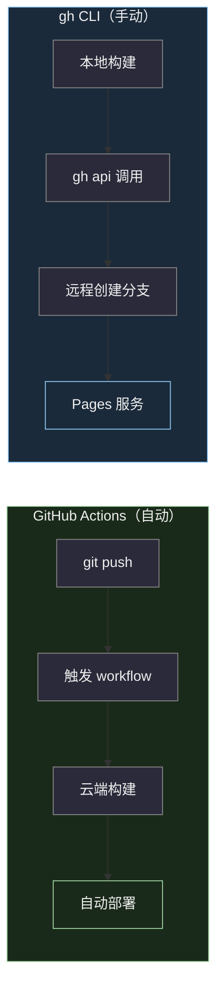
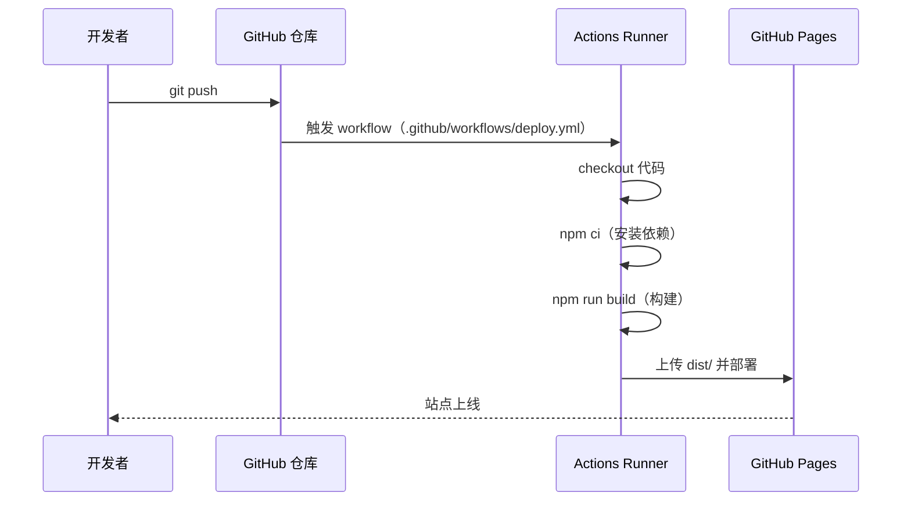
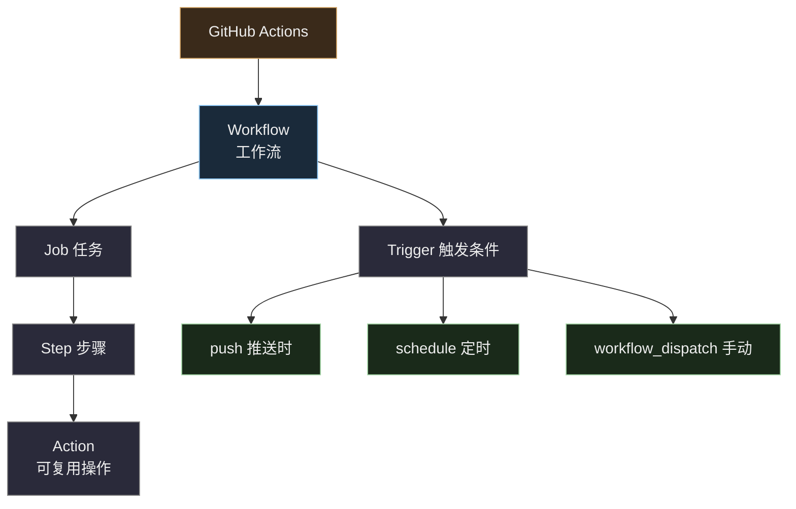
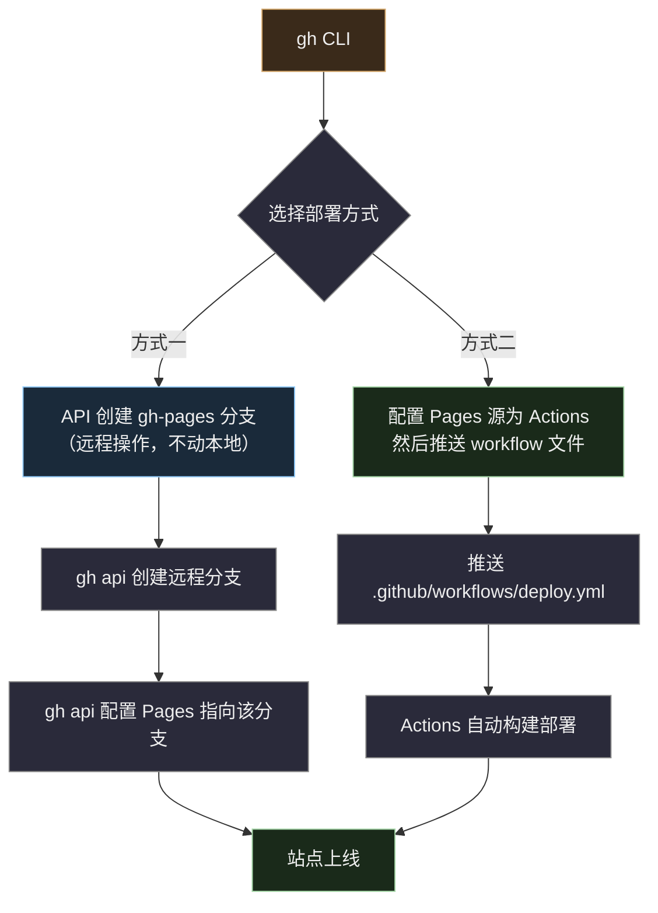
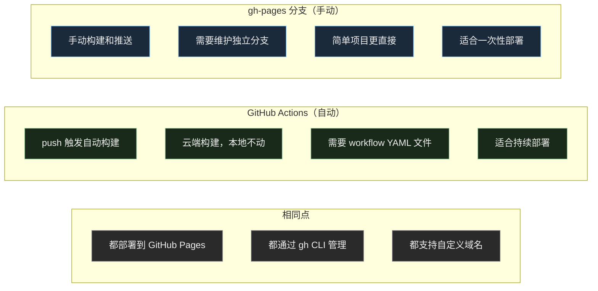
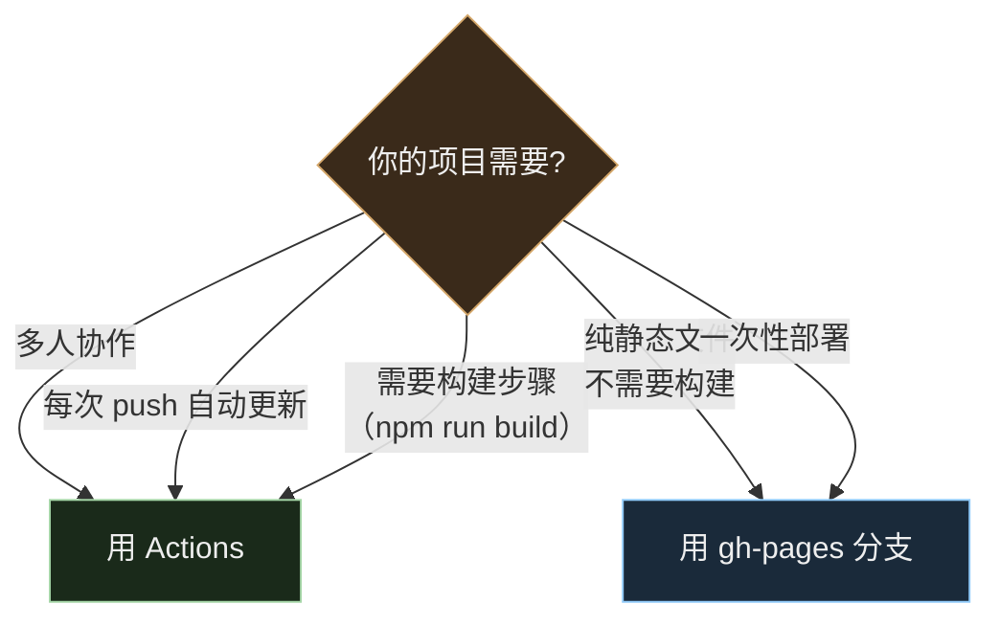
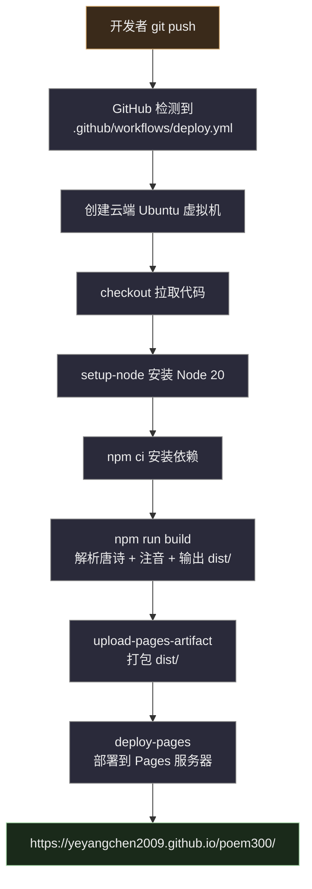
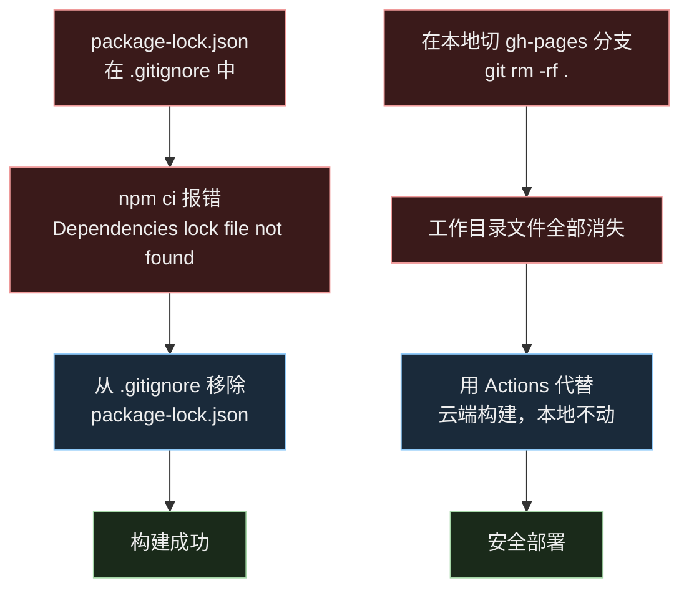

# GitHub Actions 与 gh CLI Pages 部署教程

> 本文档介绍两种将项目部署到 GitHub Pages 的方式：GitHub Actions 自动化部署 和 gh CLI 手动部署，以及它们的原理、操作步骤和适用场景。

## 整体架构对比



## 一、GitHub Actions 原理

### 什么是 GitHub Actions

GitHub Actions 是 GitHub 内置的 CI/CD（持续集成/持续部署）服务。它在 GitHub 的云服务器上自动运行你定义的工作流，不需要本地参与。

### 工作原理



### 核心概念



| 概念 | 说明 | 类比 |
|------|------|------|
| **Workflow** | 一个完整的自动化流程，写在 YAML 文件中 | 一份菜谱 |
| **Trigger** | 什么时候触发（push、定时、手动） | 开火信号 |
| **Job** | 一组步骤的集合，在一个虚拟机上运行 | 厨房 |
| **Step** | 具体的操作命令或调用 Action | 一个烹饪步骤 |
| **Action** | 可复用的操作单元（如 `actions/checkout@v4`） | 预制调料包 |

### Workflow 文件结构

```
.github/
└── workflows/
    └── deploy.yml    ← GitHub 自动识别这个目录下的 YAML 文件
```

```yaml
name: Deploy to GitHub Pages       # 工作流名称

on:                                 # 触发条件
  push:
    branches: [master]              # master 分支有推送时触发
  workflow_dispatch:                 # 也支持手动触发

permissions:                        # 权限声明
  contents: read                    # 读取代码
  pages: write                      # 写入 Pages
  id-token: write                   # OIDC 身份验证

jobs:
  build-and-deploy:                 # 任务名称
    runs-on: ubuntu-latest          # 运行环境
    steps:                          # 步骤列表
      - uses: actions/checkout@v4   # 拉取代码
      - uses: actions/setup-node@v4 # 安装 Node.js
      - run: npm ci                 # 安装依赖
      - run: npm run build          # 构建
      - uses: actions/deploy-pages@v4  # 部署到 Pages
```

### 常用 gh CLI 命令（Actions 相关）

```bash
# 查看所有 workflow 运行记录
gh run list

# 查看某次运行的详情
gh run view <run-id>

# 查看失败的日志
gh run view <run-id> --log-failed

# 实时观看运行状态
gh run watch <run-id>

# 手动触发 workflow
gh workflow run deploy.yml

# 查看 workflow 列表
gh workflow list
```

---

## 二、gh CLI 操作 GitHub Pages

### 什么是 gh CLI

`gh` 是 GitHub 官方命令行工具，可以直接在终端操作 GitHub 的各种功能（Issue、PR、Pages、Actions 等），不需要打开浏览器。

### Pages 部署方式

通过 gh CLI 部署 Pages 有两种方式：



### 常用 gh CLI 命令（Pages 相关）

```bash
# 查看 Pages 状态
gh api repos/<owner>/<repo>/pages

# 启用 Pages（源为 Actions workflow）
gh api repos/<owner>/<repo>/pages --method POST \
  -f build_type=workflow \
  -f source[branch]=master \
  -f source[path]=/

# 启用 Pages（源为 gh-pages 分支的根目录）
gh api repos/<owner>/<repo>/pages --method POST \
  -f build_type=legacy \
  -f source[branch]=gh-pages \
  -f source[path]=/

# 查看 Pages 部署历史
gh api repos/<owner>/<repo>/pages/deployments

# 删除 Pages 站点
gh api repos/<owner>/<repo>/pages --method DELETE
```

---

## 三、两种方式对比



| 对比维度 | GitHub Actions | gh-pages 分支 |
|----------|---------------|---------------|
| **构建位置** | GitHub 云端 | 本地 |
| **本地文件影响** | 零影响 | 可能需要切分支操作 |
| **触发方式** | push 自动触发 | 手动推送 |
| **配置复杂度** | 需要写 YAML | 简单直接 |
| **依赖管理** | 需要 `package-lock.json` | 不需要 |
| **构建一致性** | 云端环境一致 | 取决于本地环境 |
| **回滚** | 可通过 `gh run` 重新部署 | 需要回退分支 commit |
| **适用场景** | 团队协作、持续部署 | 个人项目、快速原型 |

### 如何选择



---

## 四、本项目的实际部署流程

本项目使用 GitHub Actions 方案，完整流程：



### 踩坑记录


