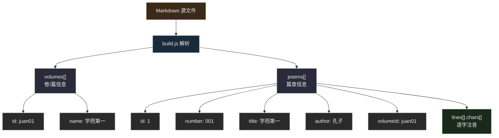
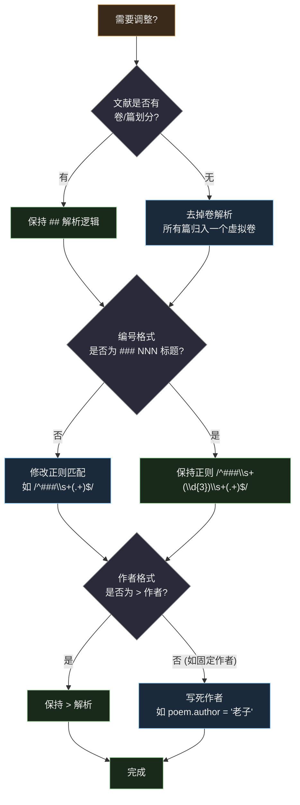
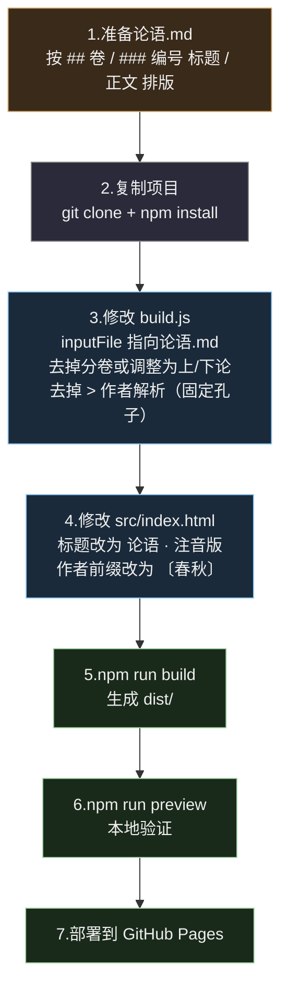

# 适配其他经典 — 指南

> 本项目（唐诗三百首注音网页版）不限于唐诗。任何按篇/章/节结构化的中国古典文献，都可以复用本项目的构建管线和网页模板，快速生成带拼音注音的在线阅读器。

## 适用范围

适合用本项目适配的文献特征：

- **纯文本为主** — 不含复杂版面（如注释、夹注、多层批注）
- **分篇结构清晰** — 有明确的卷/篇/章划分
- **以汉字为主** — 拼音引擎对现代汉字注音效果最好

适合的例子：论语、道德经、大学、中庸、诗经、楚辞、千家诗、古文观止（选篇）等。

不适合的例子：含大量古文字（甲骨文、金文）的文献、需要版本校勘注释的学术著作。

## 整体流程


## ① 准备 Markdown 源文件

### 格式规范

Markdown 源文件需要遵循以下结构，`build.js` 才能正确解析：

```markdown
## 卷01-学而第一

### 001 学而第一
> 孔子

子曰：「学而时习之，不亦说乎？有朋自远方来，不亦乐乎？人不知而不愠，不亦君子乎？」

### 002 为政以德
> 孔子

子曰：「为政以德，譬如北辰，居其所而众星共之。」
```

格式规则：

| 标记 | 含义 | 示例 |
|------|------|------|
| `## ` | 卷/篇标题 | `## 卷01-学而第一` |
| `### 编号 标题` | 篇章标题 | `### 001 学而第一` |
| `> ` | 作者/出处 | `> 孔子` |
| 空行 | 分隔 | 篇与篇之间的空行 |
| 其他 | 正文 | 逐字注音 |

### 数据结构映射



### 准备材料清单

| 材料 | 说明 | 来源建议 |
|------|------|----------|
| 文本内容 | 完整的篇章文字 | [中国哲学书电子化计划](https://ctext.org)、[国学导航](http://www.guoxue123.com) |
| 篇章划分 | 按传统分章/分篇 | 原典目录 |
| 编号系统 | 每篇一个三位编号（001、002…） | 自行编排 |
| 分卷信息 | 按上/下编或主题分卷 | 原典结构 |

## ② 调整 build.js 解析规则

不同文献的 Markdown 格式可能不同，需要修改 `build.js` 中的 `parseMarkdown()` 函数。

### 可能需要调整的地方



### 示例：适配《道德经》

道德经 81 章，没有「作者」变化（都是老子），没有分卷。需要修改：

```javascript
// 1. 去掉分卷（或创建一个虚拟卷）
currentVolume = { id: 'juan01', name: '道德经' };
volumes.push(currentVolume);

// 2. 修改编号解析（道德经章节号可能是"第一章"而非"001"）
// 如果用 ### 第一章 道可道非常道 格式：
const match = trimmed.match(/^###\s+第([一二三四五六七八九十百]+)章\s+(.+)$/);
if (match) {
  currentPoem = {
    id: poems.length + 1,
    number: String(poems.length + 1).padStart(3, '0'),
    title: match[2],
    author: '老子',
    volumeId: currentVolume.id,
    lines: [],
  };
}

// 3. 去掉 SKIP_SECTIONS（道德经没有非正文区域）
// 4. 去掉 > 作者解析（固定为老子）
```

## ③ 运行构建

```bash
# 把你的 Markdown 文件放到 docs/ 目录
cp 我的文献.md docs/论语.md

# 修改 build.js 中的 inputFile 路径
# const inputFile = path.join(__dirname, 'docs', '论语.md');

# 运行构建
npm run build

# 验证输出
ls dist/
# data.json  index.html
```

验证要点：
- `data.json` 中的 `volumes` 和 `poems` 数量是否正确
- 拼音注音是否正常（检查 `chars` 数组中汉字的 `pinyin` 字段）
- 文件大小是否合理（一般 0.5–3 MB）

## ④ 调整页面样式

`src/index.html` 中可自定义的部分：

| 项目 | 位置 | 示例 |
|------|------|------|
| 页面标题 | `<title>` | `论语 · 注音版` |
| 顶栏标题 | `<h1>` | `论语 · 注音版` |
| 作者前缀 | `renderPoem()` | `〔春秋〕` 代替 `〔唐〕` |
| 主题配色 | CSS 变量 | 调整 `--accent`、`--bg-card` 等 |
| 字体默认 | `DEFAULTS.font` | 改为楷体更适合古文 |

## ⑤ 部署

```bash
# 方式一：GitHub Pages
# 将 dist/ 目录设为 Pages 源
git add dist/ && git commit -m "deploy" && git push

# 方式二：任意静态托管
# 将 dist/ 目录上传即可
```

## 完整示例：从零适配《论语》



> 配套可视化：[guide-adapt-visual.html](guide-adapt-visual.html)
