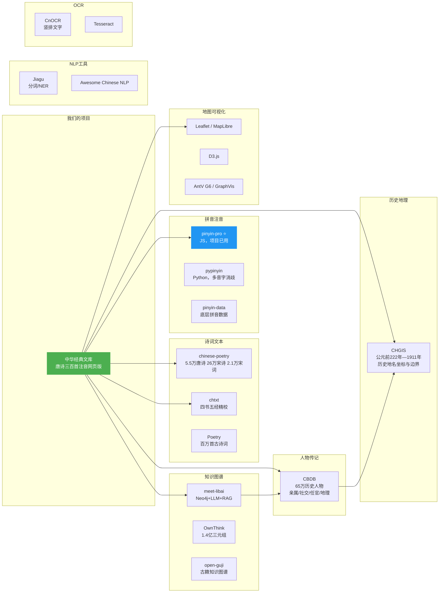

# 可用开源资源汇总

本文档汇总了对"中华经典文库"项目有价值的开源项目和学术资源，按类别组织。

***

## 一、诗词文本数据库

### 1.1 chinese-poetry — 最全中华古典文集数据库

| 项目    | 信息                                                 |
| ----- | -------------------------------------------------- |
| 仓库    | <https://github.com/chinese-poetry/chinese-poetry> |
| Stars | 45,000+                                            |
| 格式    | JSON                                               |
| 许可    | MIT                                                |

**数据量**：

| 类别  | 数量                 |
| --- | ------------------ |
| 唐诗  | 5.5 万首             |
| 宋诗  | 26 万首              |
| 宋词  | 2.1 万首（1,564 位词人）  |
| 古诗人 | 唐宋两朝近 1.4 万位       |
| 其他  | 论语、诗经、四书五经、蒙学、花间集等 |

**对我们的价值**：

- 扩展内容时可直接引用 JSON 数据，省去手工录入
- 诗经、楚辞等专题数据已包含在内
- `chinese-poetry` 组织下还有 [chinese-poetry-npm](https://github.com/chinese-poetry/chinese-poetry-npm)（Node.js 版）和 [官网](https://github.com/chinese-poetry/chinese-poetry.github.io)（在线浏览）

**不足**：

- 不含拼音注音数据（社区有 [Issue #336](https://github.com/chinese-poetry/chinese-poetry/issues/336) 请求此功能）
- 无生平年谱、地点坐标等结构化数据

***

### 1.2 chtxt — 中华经典古籍精校文本

| 项目 | 信息                                      |
| -- | --------------------------------------- |
| 仓库 | <https://github.com/JasonWade001/chtxt> |
| 格式 | TXT                                     |

覆盖四书五经及诸子百家的精校版本：

- 儒家：论语、孟子、大学、中庸、荀子、孔子家语、诗经
- 道家：道德经、庄子、列子
- 法家：管子、韩非子、商君书
- 兵家：六韬

**对我们的价值**：扩展到非诗歌经典时，提供可靠的精校底本。

***

### 1.3 chinese-poetry-index — 古诗词全文搜索引擎

| 项目  | 信息                                                  |
| --- | --------------------------------------------------- |
| 仓库  | <https://github.com/KonghaYao/chinese-poetry-index> |
| 数据量 | 7 万+ 古典诗词                                           |

基于 chinese-poetry 构建的全文索引，提供统一的搜索接口，支持二次开发。

**对我们的价值**：可作为站内搜索引擎的技术参考。

***

### 1.4 xiu-ze/Poetry — 百万首古诗词语料库

| 项目  | 信息                                 |
| --- | ---------------------------------- |
| 仓库  | <https://github.com/xiu-ze/Poetry> |
| 数据量 | 100 万+ 首                           |
| 格式  | CSV                                |
| 覆盖  | 先秦至当代                              |

***

## 二、历史人物传记数据库

### 2.1 CBDB — 中国历代人物传记资料库（已详细分析）

| 项目        | 信息                                                 |
| --------- | -------------------------------------------------- |
| 官网        | <https://cbdb.hsites.harvard.edu/>                 |
| 结构说明      | <https://cbdb.hsites.harvard.edu/structure-cbdb>   |
| SQLite 下载 | <https://huggingface.co/datasets/cbdb/cbdb-sqlite> |
| 人物总量      | 658,339 人                                          |

详细的表结构和 ER 图见 `cbdb/README.md`。

**核心价值**：

| 需求     | 可用数据                                               |
| ------ | -------------------------------------------------- |
| 诗人年谱地图 | BIOG\_ADDR\_DATA + ADDR\_CODES 的经纬度 + EVENTS\_DATA |
| 诗人关系网  | ASSOC\_DATA（18.8 万条社会关系）+ KIN\_DATA（55.7 万条亲属关系）   |
| 任官轨迹   | POSTING\_DATA（58.8 万次任官记录）                         |
| 历史纪年   | DYNASTIES（85 个朝代）+ NIAN\_HAO（682 个年号）              |

***

## 三、历史地理信息系统

### 3.1 CHGIS — 中国历史地理信息系统

| 项目   | 信息                                   |
| ---- | ------------------------------------ |
| 主办   | 复旦大学 + 哈佛大学                          |
| 官网   | <https://yugong.fudan.edu.cn/CHGIS/> |
| 时间跨度 | 公元前 222 年 — 公元 1911 年                |
| 数据类型 | 矢量化历史地图、政区边界、地名坐标                    |

CHGIS 是 CBDB 地名坐标数据（ADDR\_CODES 中的 x\_coord, y\_coord）的来源。CBDB 记录的是行政中心的点坐标，CHGIS 则提供完整的政区边界。

**对我们的价值**：

- 诗人年谱地图的地理底图数据
- 古今地名对照（同一个"长安"在不同朝代的管辖范围不同）
- 矢量化地图可用于前端可视化

**获取方式**：注册 [中国历史地理信息平台](https://yugong.fudan.edu.cn/CHGIS/) 后可下载数据。

***

### 3.2 D-PLACE — 文化、语言与地理数据库

| 项目     | 信息                                  |
| ------ | ----------------------------------- |
| 网址     | <https://d-place.org/>              |
| GitHub | <https://github.com/D-PLACE/dplace> |
| 数据量    | 全球 1,400+ 社会群体                      |

跨文化研究数据库，包含语言、地理坐标、文化特征。虽然不直接针对中国，但其数据模型（社会群体 + 地理位置 + 文化属性）对我们的年谱地图设计有参考价值。

***

## 四、拼音/注音工具库

### 4.1 pypinyin（Python）

| 项目 | 信息                                           |
| -- | -------------------------------------------- |
| 仓库 | <https://github.com/mozillazg/python-pinyin> |
| 文档 | <https://pypinyin.readthedocs.io/>           |
| 语言 | Python                                       |

特性：

- 根据词组智能匹配最正确的拼音，支持多音字消歧
- 推荐配合 **jieba 分词** 提升多音字准确率
- 支持繁体、注音符号、威妥玛拼音
- 支持自定义拼音词典（可用于古汉语专有词汇）

***

### 4.2 pinyin-pro（JavaScript）— 我们项目当前使用

| 项目 | 信息                                    |
| -- | ------------------------------------- |
| 仓库 | <https://github.com/zh-lx/pinyin-pro> |
| 语言 | JavaScript / TypeScript               |

特性：

- 多音字识别，高准确率
- 支持声母、韵母、首字母、音调
- 支持姓氏拼音、拼音匹配、中文分词
- 纯前端可用，无服务端依赖

> **当前项目已在用**：`add-pinyin.js` 使用 `pinyin-pro` 生成数字标调拼音。

***

### 4.3 overtrue/pinyin（PHP）

| 项目 | 信息                                   |
| -- | ------------------------------------ |
| 仓库 | <https://github.com/overtrue/pinyin> |
| 语言 | PHP                                  |

基于词库的中文转拼音，多音字处理优秀。如果未来后端需要拼音转换可参考。

***

### 4.4 拼音数据底层 — pinyin-data

| 项目 | 信息                                         |
| -- | ------------------------------------------ |
| 仓库 | <https://github.com/mozillazg/pinyin-data> |

pypinyin 和 overtrue/pinyin 共用的拼音数据源，包含完整的汉字-拼音映射表。可用于构建自定义的拼音修正字典。

***

## 五、知识图谱项目

### 5.1 meet-libai — 李白知识图谱

| 项目  | 信息                                      |
| --- | --------------------------------------- |
| 仓库  | <https://github.com/BinNong/meet-libai> |
| 技术栈 | Neo4j + LLM + RAG                       |

以李白为核心构建古诗词文化知识图谱，实现了：

- 知识图谱构建（实体与关系抽取）
- 图谱可视化探索
- 基于大模型的智能问答
- RAG 检索增强生成

**对我们的价值**：

- 诗人年谱地图、关系网、典故溯源的技术参考
- 知识图谱 schema 设计的参考（实体类型、关系类型）
- Neo4j 图数据库的实践案例

***

### 5.2 Ming-Dynasty-Knowledge-Graph — 明朝历史知识图谱

| 项目 | 信息                                                        |
| -- | --------------------------------------------------------- |
| 仓库 | <https://github.com/aspxcor/Ming-Dynasty-Knowledge-Graph> |

基于明代历史人物及事件的知识图谱，展示历史人物关系。

***

### 5.3 chinese-graph — 中文成语图谱

| 项目 | 信息                                        |
| -- | ----------------------------------------- |
| 仓库 | <https://github.com/wey-gu/chinese-graph> |

中文成语、汉字、读音图谱构建工具。可用于典故溯源模块的成语关系数据。

***

### 5.4 OwnThink — 1.4 亿中文知识图谱

| 项目     | 信息                                           |
| ------ | -------------------------------------------- |
| GitHub | <https://github.com/ownthink/KnowledgeGraph> |
| 数据量    | 1.4 亿条三元组                                    |
| 格式     | （实体, 属性, 值）和（实体, 关系, 实体）                     |

最大的开源中文知识图谱，可用于典故溯源的背景知识补充。

***

### 5.5 open-guji — 古籍数字化开源组织

| 项目     | 信息                             |
| ------ | ------------------------------ |
| GitHub | <https://github.com/open-guji> |

致力于古籍智能检索与知识图谱构建，降低古籍研究门槛。值得关注其后续发展。

***

## 六、古籍 OCR 识别

如果未来需要从纸质古籍或古旧地图中提取文字，以下工具可用：

### 6.1 CnOCR

| 项目 | 信息                                    |
| -- | ------------------------------------- |
| 仓库 | <https://github.com/breezedeus/cnocr> |
| 语言 | Python                                |
| 特性 | 支持竖排文字、繁体中文                           |

基于深度学习的中英文 OCR 工具包。**支持竖排文字识别**，对古籍竖排文本特别有用。

### 6.2 Tesseract + tessdata\_chi

| 项目   | 信息                                           |
| ---- | -------------------------------------------- |
| 主仓库  | <https://github.com/tesseract-ocr/tesseract> |
| 中文增强 | <https://github.com/gumblex/tessdata_chi>    |
| 语言   | C++ / Python (pytesseract)                   |

最成熟的开源 OCR 引擎，可自定义训练字库以针对古籍字体优化。Google 维护，支持 100+ 种语言。

***

## 七、地图可视化工具

### 7.1 Leaflet / MapLibre GL

| 项目          | 信息                                                |
| ----------- | ------------------------------------------------- |
| Leaflet     | <https://github.com/Leaflet/Leaflet> (40k+ stars) |
| MapLibre GL | <https://github.com/maplibre/maplibre-gl-js>      |

轻量级前端地图库。Leaflet 适合 2D 地图（诗人行迹标注），MapLibre GL 支持 3D 地形和矢量瓦片。两者均开源免费。

### 7.2 D3.js

| 项目 | 信息                         |
| -- | -------------------------- |
| 仓库 | <https://github.com/d3/d3> |

数据可视化领域最强大的 JS 库。适合绘制诗人关系网络图、年谱时间轴、地理热力图等自定义可视化。

### 7.3 AntV G6 / GraphVis — 关系图可视化

| 项目       | 信息                                      |
| -------- | --------------------------------------- |
| AntV G6  | <https://github.com/antvis/g6>          |
| GraphVis | <https://github.com/dubaopeng/GraphVis> |

专门用于关系图/知识图谱可视化的前端库。适合展示诗人社交网络、亲属关系图等。

***

## 八、中文 NLP 工具

### 8.1 Awesome Chinese NLP — 资源大全

| 项目 | 信息                                                |
| -- | ------------------------------------------------- |
| 仓库 | <https://github.com/crownpku/awesome-chinese-nlp> |

中文 NLP 领域最全的资源索引，涵盖分词、词性标注、命名实体识别、情感分析、知识图谱等。

### 8.2 Jiagu — 中文 NLP 工具包

| 项目 | 信息                                  |
| -- | ----------------------------------- |
| 仓库 | <https://github.com/ownthink/Jiagu> |
| 语言 | Python                              |

基于 BiLSTM 等深度学习模型，提供中文分词、词性标注、命名实体识别。可用于古诗词文本的自动标注（如自动识别人名、地名、典故等）。

***

## 九、资源总览图

***

## 十、按项目阶段的推荐优先级

| 阶段       | 推荐资源                       | 理由                          |
| -------- | -------------------------- | --------------------------- |
| 当前（注音打磨） | pinyin-pro + pypinyin      | 多音字扫描和修正                    |
| 扩展诗词内容   | chinese-poetry             | JSON 格式直接可用，5.5万唐诗 + 2.1万宋词 |
| 扩展经史子集   | chtxt                      | 四书五经精校底本                    |
| 诗人年谱地图   | CBDB + CHGIS               | 65万人物传记 + 历史地名坐标            |
| 诗人关系网    | CBDB ASSOC\_DATA + AntV G6 | 18.8万条社会关系 + 关系图可视化         |
| 知识图谱     | meet-libai + Neo4j         | 技术方案参考                      |
| 古籍数字化    | CnOCR + Tesseract          | 竖排文字识别                      |
| 智能问答     | LLM + RAG + OwnThink       | 知识增强检索                      |

***

*文档更新日期：2026-05-30*
