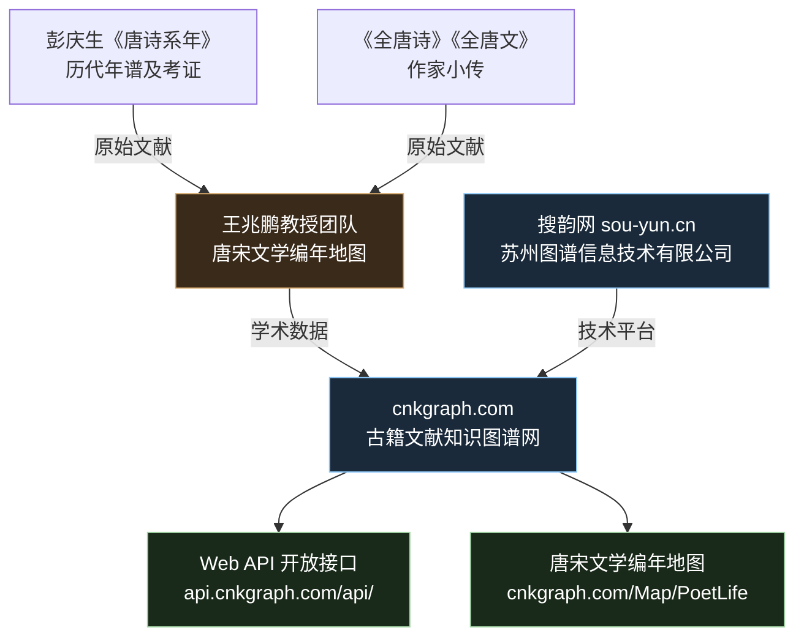
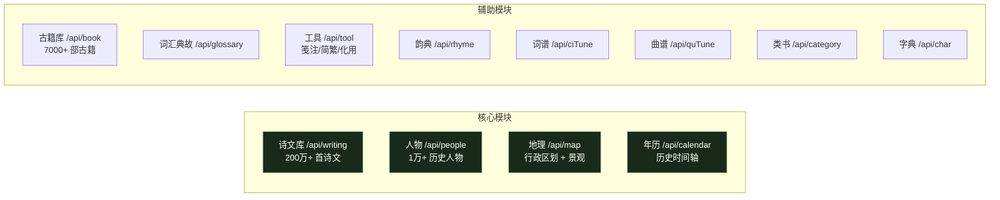
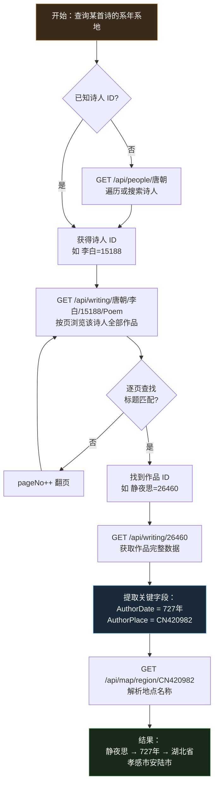
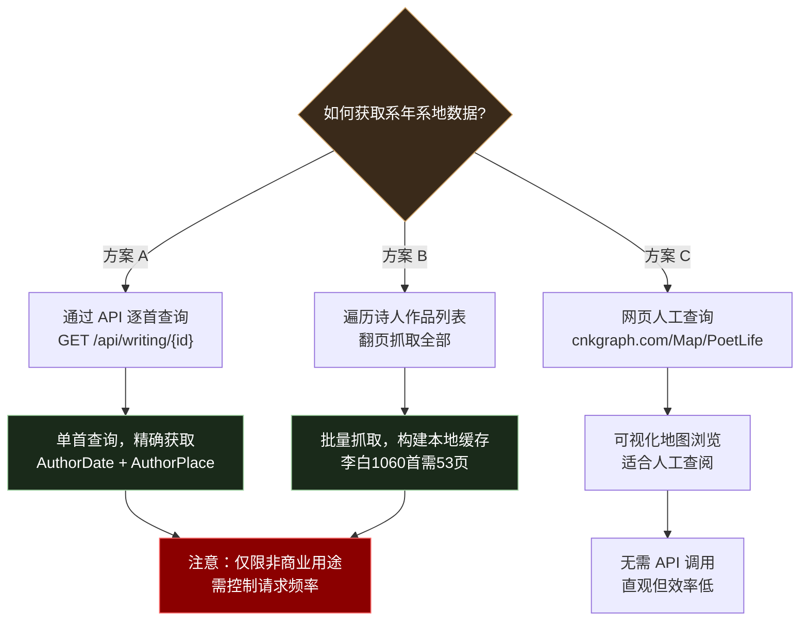
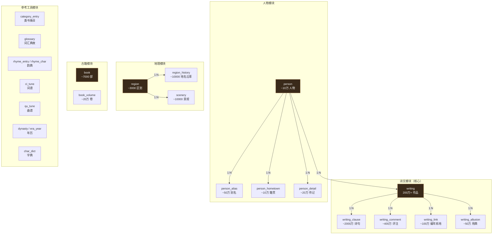
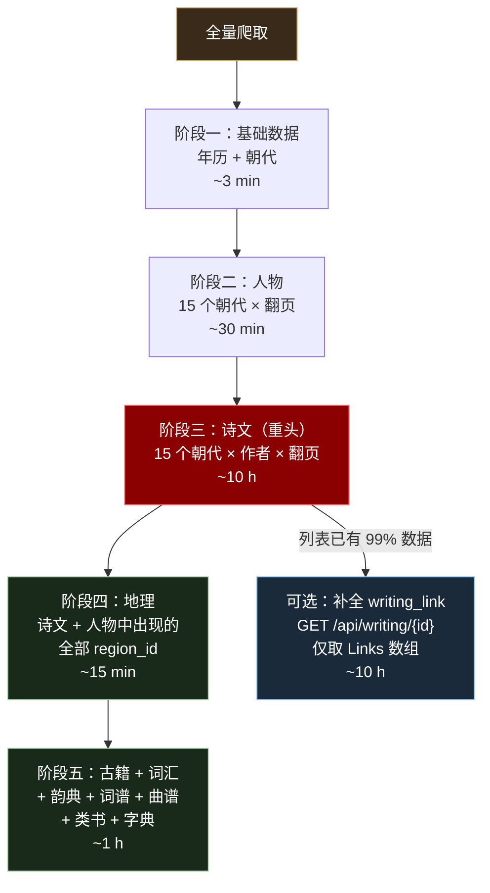
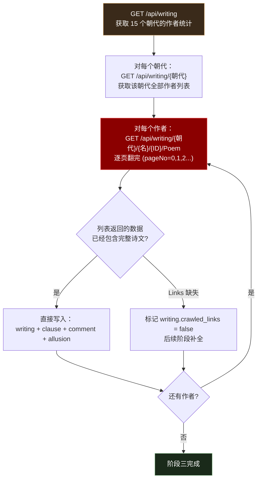

# 诗歌系年系地数据调研

静夜思等唐诗的"创作年份"在 CBDB 中查不到，因为 CBDB 的粒度是"人物"和"文集"，不是"单首诗"。本文档调研现有数据源的系年能力，并重点介绍已发现的开放 API。

***

## 一、CBDB 的文献体系

CBDB 的 TEXT\_CODES 表存储的是"书/文集"级别（61,070 部），不是单首诗：

| 表                    | 粒度          | 有无系年                        |
| -------------------- | ----------- | --------------------------- |
| TEXT\_CODES          | 文集（如《李太白集》） | c\_text\_year 字段存在但大量为 null |
| BIOG\_TEXT\_DATA     | 人物↔文集关联     | c\_year 为 -1 或 null         |
| TEXT\_INSTANCE\_DATA | 文集版本/刊本     | 出版年 c\_pub\_year，非创作年       |

以李白为例，CBDB 只记录了 4 部文集（李太白集、李翰林集、草堂集等），无单首诗记录。**静夜思不在 CBDB 中**。

CBDB 适合回答"某人在某年去了某地任某职"，但无法回答"某首诗写于某年"。

***

## 二、古籍文献知识图谱网（cnkgraph.com）— 首选方案

### 2.1 平台概况

**唯一已知的公开结构化诗歌系年系地数据源**，由王兆鹏教授团队（四川大学/中南民族大学）提供学术数据，搜韵网（苏州图谱信息技术有限公司）提供技术支持。

| 项目         | 详情                                                                                  |
| ---------- | ----------------------------------------------------------------------------------- |
| 网站         | <https://cnkgraph.com/>                                                             |
| API 地址     | `https://api.cnkgraph.com/api/`                                                     |
| 诗文总量       | 2,012,794 首                                                                         |
| 唐诗量        | 74,805 首（5,434 位作者）                                                                 |
| 编年记录       | 62,559 条（含创作年份）                                                                     |
| 系地记录       | 33,217 条（含创作地点坐标）                                                                   |
| 覆盖朝代       | 先秦 \~ 当代（15 个朝代）                                                                    |
| 使用限制       | **仅限非商业用途**                                                                         |
| Postman 集合 | <https://open.cnkgraph.com/Api/postman.zip（12> 个模块）                                 |
| API 文档 PDF | <https://opendata.library.sh.cn/download/opendata/2023/搜韵网知识图谱Web%20API%20开放接口.pdf> |

### 2.2 数据来源



### 2.3 API 模块总览

Postman 集合共 12 个模块，关键端点如下：



### 2.4 系年系地数据获取流程



### 2.5 关键 API 端点详解

#### (1) 诗文库浏览 — 获取某诗人全部作品

```
GET https://api.cnkgraph.com/api/writing/{dynasty}/{authorName}/{authorId}/{writingType}?pageNo={pageNo}
```

| 参数          | 说明                 | 示例                      |
| ----------- | ------------------ | ----------------------- |
| dynasty     | 朝代                 | 唐朝                      |
| authorName  | 作者名（URL编码）         | 李白 → %E6%9D%8E%E7%99%BD |
| authorId    | 作者 ID              | 15188                   |
| writingType | 作品类型               | Poem, Ci, Fu, Article 等 |
| pageNo      | 页码（从 0 开始，每页 20 首） | 0                       |

返回 JSON 中每首作品的关键字段：

| 字段              | 说明             | 示例                                  |
| --------------- | -------------- | ----------------------------------- |
| `Id`            | 作品唯一 ID        | 26460                               |
| `Title.Content` | 标题             | "静夜思"                               |
| `AuthorDate`    | **创作年份（系年）**   | "727年"                              |
| `AuthorPlace`   | **创作地点编码（系地）** | "CN420982"                          |
| `Type`          | 体裁大类           | "绝句"                                |
| `TypeDetail`    | 体裁细分           | "WuJue"（五绝）                         |
| `Rhyme`         | 韵部             | "阳"                                 |
| `Dynasty`       | 朝代细分           | "盛唐"                                |
| `Clauses`       | 诗句数组           | \[{Content: "床前明月光，"}, ...]         |
| `Comments`      | 历代评注           | \[{Book: "《唐诗品汇》", Content: "..."}] |

#### (2) 单首作品详情

```
GET https://api.cnkgraph.com/api/writing/{writingId}
```

返回完整作品信息，额外包含：

| 字段                       | 说明                           |
| ------------------------ | ---------------------------- |
| `Links`                  | 结构化编年系地标签数组                  |
| `Links[].LabelType`      | "DateTime"（时间）或 "Region"（地点） |
| `Links[].LabelData.Year` | 年份                           |
| `Links[].Value`          | 人类可读值，如 "727年"、"湖北省孝感市安陆市"   |

#### (3) 人物查询

```
GET https://api.cnkgraph.com/api/people/{dynasty}        # 按朝代浏览
GET https://api.cnkgraph.com/api/people/{personId}       # 按ID查详情
```

返回人物传记数据：生卒年、字号别号、官职、籍贯（含坐标）、传记原文（引自《中国历代人名大辞典》《唐诗大辞典》等）。

#### (4) 地理编码解析

```
GET https://api.cnkgraph.com/api/map/region/{regionId}   # 按ID查
GET https://api.cnkgraph.com/api/map/region/{regionName} # 按名称查
```

将 `CN420982` 这类编码解析为"湖北省孝感市安陆市"。

### 2.6 系年系地数据覆盖情况

| 诗人 | 作品数     | 有系年      | 有系地      | 示例               |
| -- | ------- | -------- | -------- | ---------------- |
| 李白 | 1,060   | 大量       | 大量       | 赠孟浩然→736年→CN4206 |
| 杜甫 | \~1,400 | 大量       | 大量       | —                |
| 王维 | \~400   | 大量       | 大量       | —                |
| 全库 | —       | 62,559 条 | 33,217 条 | —                |

**注意**：并非每首诗都有系年数据。部分作品 `AuthorDate` 为 null，表示学界尚未确定创作年份。

***

## 三、GitHub 开源项目

### 3.1 chinese-poetry（45k+ stars）

- 仓库：<https://github.com/chinese-poetry/chinese-poetry>
- 内容：5.5 万首唐诗 + 26 万首宋诗 + 2.1 万首宋词
- 格式：JSON
- **无系年字段**：数据结构为 `{title, author, paragraphs}`，无创作年份

### 3.2 其他数据库

| 项目                                                                        | 规模    | 有无系年            |
| ------------------------------------------------------------------------- | ----- | --------------- |
| [chinese-poetry](https://github.com/chinese-poetry/chinese-poetry)        | 30 万首 | 无               |
| [PoetryLibrary](https://github.com/yaonphy/PoetryLibrary)                 | 82 万首 | 无               |
| [chinese-poem-analysis](https://github.com/gintian/chinese-poem-analysis) | 10 万首 | 有"考证"文本字段（非结构化） |
| [GuWen](https://github.com/lhw828/GuWen)                                  | 多种古籍  | 无               |

**结论：GitHub 上无结构化的诗歌系年数据库。cnkgraph API 是唯一的公开来源。**

***

## 四、能否拿到数据库？

**不能直接下载数据库文件。** cnkgraph.com 不提供数据库导出或数据集下载。

可行方案：



**对唐诗三百首项目（511 首）**：推荐方案 B — 编写脚本遍历 77 位诗人的作品列表，匹配标题提取系年系地，构建本地 JSON 缓存。API 无需认证，但需控制请求频率（建议每次请求间隔 200-500ms）。

***

## 五、API 调用示例

### 5.1 curl 示例

```bash
# 查看诗文库总览
curl -s "https://api.cnkgraph.com/api/writing" | jq .

# 浏览唐朝诗人列表（返回 JSON，含作者 ID）
curl -s "https://api.cnkgraph.com/api/writing/唐朝" | jq .

# 获取李白第1页诗作（每页20首）
curl -s "https://api.cnkgraph.com/api/writing/唐朝/李白/15188/Poem?pageNo=0" | jq '.Writings[] | {Id, Title: .Title.Content, AuthorDate, AuthorPlace}'

# 获取静夜思完整数据
curl -s "https://api.cnkgraph.com/api/writing/26460" | jq '.Writing | {Title: .Title.Content, Author, AuthorDate, AuthorPlace, Dynasty, Type, Rhyme}'

# 获取地点详情
curl -s "https://api.cnkgraph.com/api/map/region/CN420982" | jq .

# 获取李白人物详情（含生卒年、字号、官职、传记）
curl -s "https://api.cnkgraph.com/api/people/15188" | jq '.Person.Profile | {Name, BirthYear, DeathYear, Dynasty, Aliases, Titles, Hometown}'
```

### 5.2 Node.js 批量抓取脚本思路

```javascript
// 伪代码：为唐诗三百首批量提取系年系地
const POETS = ['李白', '杜甫', '王维', ...]; // 77位诗人

for (const poet of POETS) {
  // 1. 获取诗人 ID（可在 API 返回的唐朝列表中查找）
  // 2. 遍历该诗人所有作品页面
  for (let page = 0; ; page++) {
    const res = await fetch(
      `https://api.cnkgraph.com/api/writing/唐朝/${poet}/${poetId}/Poem?pageNo=${page}`
    );
    const data = await res.json();
    for (const w of data.Writings) {
      // 3. 匹配唐诗三百首中的标题
      if (poemTitles.includes(w.Title.Content)) {
        // 4. 提取系年系地
        results[w.Title.Content] = {
          year: w.AuthorDate,    // "727年" 或 null
          place: w.AuthorPlace,  // "CN420982" 或 null
        };
      }
    }
    if (data.Writings.length < 20) break; // 最后一页
    await sleep(300); // 控制频率
  }
}
```

***

## 六、数据库设计 — 全量爬取方案

### 6.1 设计原则

**一次爬取，永久受用。** 把 cnkgraph 12 个模块、71 个端点的全部数据爬到本地数据库。不管以后做唐诗三百首、宋词三百首、还是全唐诗分析，都不用再爬。

### 6.2 存储选型：DuckDB

| 对比项 | DuckDB | SQLite |
|-------|--------|--------|
| 存储模型 | 列式（压缩率高） | 行式 |
| 全量压缩后 | ~500 MB（预估） | ~1.5 GB（预估） |
| 分析查询 | 极快（向量化执行） | 可用但慢 |
| 批量写入 | COPY 极快 | 事务逐条写 |
| 项目兼容 | 已在 cbdb/ 使用 | 已在 cbdb/ 使用 |
| 适用场景 | 一次爬取 + 反复分析 | OLTP 增删改查 |

**选 DuckDB。** 200 万首诗文是分析型数据，列式压缩省空间，聚合查询快，且 cbdb/ 项目已有 DuckDB 依赖。

### 6.3 全量数据规模

| 模块 | API 端点 | 数据量 | 爬取页数 | 耗时估算 |
|------|---------|--------|---------|---------|
| 诗文库 | `/api/writing` | **2,012,794 首** | ~100K 页 | ~10 h |
| 人物 | `/api/people` | ~100,000 人 | ~5K 页 | ~30 min |
| 地理 | `/api/map/region` | ~3,000 区划 | ~3K 页 | ~15 min |
| 古籍库 | `/api/book` | ~7,000 部 | ~7K 页 | ~40 min |
| 年历 | `/api/calendar` | ~5,000 年号 | ~500 页 | ~3 min |
| 韵典 | `/api/rhyme` | 平水韵等 | ~100 页 | ~1 min |
| 词谱 | `/api/ciTune` | ~800 词牌 | ~50 页 | < 1 min |
| 曲谱 | `/api/quTune` | ~400 曲牌 | ~30 页 | < 1 min |
| 词汇典故 | `/api/glossary` | ~50,000 条 | ~3K 页 | ~15 min |
| 类书 | `/api/category` | 数万条 | ~2K 页 | ~10 min |
| 字典 | `/api/char` | ~20,000 字 | ~20K 页 | ~2 h |
| 景观 | `/api/map/scenery` | ~10,000 处 | ~500 页 | ~3 min |

**总计**：约 13 小时（300ms 间隔，单线程）。可分批、多天完成。

### 6.4 25 张表总览



### 6.5 ER 图

```mermaid
erDiagram
    dynasty ||--o{ era_year : "has"
    dynasty ||--o{ person : "belongs_to"
    person ||--o{ person_alias : "has"
    person ||--o{ person_hometown : "from"
    person ||--o{ person_detail : "described_in"
    person ||--o{ writing : "writes"
    writing ||--o{ writing_clause : "contains"
    writing ||--o{ writing_comment : "reviewed_by"
    writing ||--o{ writing_link : "labeled_with"
    writing ||--o{ writing_allusion : "uses"
    region ||--o{ region_history : "evolved_from"
    region ||--o{ scenery : "located_in"
    region ||--o{ person_hometown : "home_of"
    region ||--o{ writing_link : "referenced_in"
    book ||--o{ book_volume : "contains"

    dynasty {
        text name PK "朝代名"
        int begin_year "起始年"
        int end_year "终止年"
    }

    era_year {
        text name PK "年号"
        text dynasty "所属朝代"
        int begin_year "起始年"
        int end_year "终止年"
    }

    person {
        int id PK "人物ID"
        text name "姓名"
        text dynasty "朝代细分"
        text birth_year "生年"
        text death_year "卒年"
    }

    person_alias {
        int id PK
        int person_id FK
        text name "别名"
        text type "Zi/Hao/ShiHao/..."
    }

    person_hometown {
        int id PK
        int person_id FK
        text region_id FK "区划编码"
        text name "地名"
    }

    person_detail {
        int id PK
        int person_id FK
        text book "来源书名"
        text content "传记原文"
        boolean is_review "是否评论"
    }

    writing {
        int id PK "作品ID"
        int author_id FK "作者ID"
        text title "标题"
        text dynasty "朝代细分"
        text author_date_raw "系年原始文本"
        text author_place_raw "系地原始编码"
        text writing_type "体裁大类"
        text type_detail "体裁细分"
        text rhyme "韵部"
    }

    writing_clause {
        int id PK
        int writing_id FK
        int idx "序号"
        text content "诗句"
    }

    writing_comment {
        int id PK
        int writing_id FK
        text book "出处"
        text content "评注"
    }

    writing_link {
        int id PK
        int writing_id FK
        text label_type "DateTime/Region"
        text label_identity "标识"
        text value "人类可读值"
        text year "年份"
        text region_id FK "区划编码"
        int weight "权重"
    }

    writing_allusion {
        int id PK
        int writing_id FK
        int allusion_index "典故ID"
        text allusion_key "典故关键词"
        int sentence_index "出现句序"
    }

    region {
        text id PK "区划编码"
        text name "名称"
        real latitude "纬度"
        real longitude "经度"
        text parent_id "上级区划"
    }

    region_history {
        int id PK
        text region_id FK
        text name "历史地名"
        text type "区划类型"
        int begin_year "起始年"
        int end_year "终止年"
        text belong_to "隶属"
    }

    scenery {
        int id PK
        text region_id FK
        text name "景观名"
    }

    book {
        int id PK "古籍ID"
        text title "书名"
        text category "分类"
        text subcategory "子类"
    }

    book_volume {
        text id PK "卷编码"
        int book_id FK
        text title "卷名"
        text content "卷内容"
    }

    glossary {
        int id PK
        text glossary_type "词典/典故/佛典"
        int source_id "API Id"
        text text "词目"
        text content "释义"
        text spells "拼音"
    }

    rhyme_entry {
        int id PK
        text book "韵书名"
        text name "韵目名"
        text chars "韵字列表"
    }

    rhyme_char {
        int id PK
        text book "韵书名"
        text entry_name "韵目"
        text char "韵字"
        text detail "详情 JSON"
    }

    ci_tune {
        int id PK
        text name "词牌名"
        text content "平仄谱 JSON"
    }

    qu_tune {
        int id PK
        text name "曲牌名"
        text content "平仄谱 JSON"
    }

    category_entry {
        text id PK "条目编码"
        text book "类书名"
        text parent_id "父条目"
        text title "条目名"
        text content "内容"
    }

    char_dict {
        text char PK "汉字"
        text content "字典数据 JSON"
    }
```



### 6.6 DDL（25 张表）

```sql
-- ============================================================
-- 一、年历模块
-- ============================================================

CREATE TABLE dynasty (
    name        TEXT PRIMARY KEY,   -- 朝代名，如 "唐朝"
    begin_year  INTEGER,            -- 朝代起始年份，如 618
    end_year    INTEGER             -- 朝代终止年份，如 907
);
COMMENT ON TABLE dynasty IS '朝代表，来自 /api/calendar';
COMMENT ON COLUMN dynasty.name IS '朝代名，如 唐朝、宋朝';
COMMENT ON COLUMN dynasty.begin_year IS '朝代起始年份（公元纪年），如 618';
COMMENT ON COLUMN dynasty.end_year IS '朝代终止年份（公元纪年），如 907';

CREATE TABLE era_year (
    name        TEXT PRIMARY KEY,   -- 年号，如 "开元"
    dynasty     TEXT,               -- 所属朝代，如 "唐朝"
    begin_year  INTEGER,            -- 年号起始年
    end_year    INTEGER             -- 年号终止年
);
COMMENT ON TABLE era_year IS '年号表，来自 /api/calendar/{dynasty}';
COMMENT ON COLUMN era_year.name IS '年号名，如 开元、绍兴';
COMMENT ON COLUMN era_year.dynasty IS '所属朝代';
COMMENT ON COLUMN era_year.begin_year IS '年号起始年';
COMMENT ON COLUMN era_year.end_year IS '年号终止年';

-- ============================================================
-- 二、人物模块
-- ============================================================

CREATE TABLE person (
    id          INTEGER PRIMARY KEY,   -- API 人物 ID，如 15188
    name        TEXT NOT NULL,         -- 姓名，如 "李白"
    surname     TEXT,                  -- 姓氏，如 "李"
    dynasty     TEXT,                  -- 朝代细分，如 "盛唐"
    birth_year  TEXT,                  -- 生年，如 "701"
    death_year  TEXT,                  -- 卒年，如 "762"
    birth_day   TEXT,                  -- 生日，如 "1/16"
    death_day   TEXT                   -- 忌日
);
COMMENT ON TABLE person IS '历史人物表，来自 /api/people/{dynasty} 列表 + /api/people/{id} 详情';
COMMENT ON COLUMN person.id IS 'API 人物唯一 ID，如 李白=15188';
COMMENT ON COLUMN person.name IS '姓名';
COMMENT ON COLUMN person.surname IS '姓氏（用于按姓检索）';
COMMENT ON COLUMN person.dynasty IS '朝代细分，如 盛唐、中唐、晚唐';
COMMENT ON COLUMN person.birth_year IS '出生年份（文本，部分为 null）';
COMMENT ON COLUMN person.death_year IS '去世年份（文本，部分为 null）';
COMMENT ON COLUMN person.birth_day IS '出生月/日，如 1/16';
COMMENT ON COLUMN person.death_day IS '去世月/日';

CREATE TABLE person_alias (
    id          INTEGER PRIMARY KEY AUTOINCREMENT,
    person_id   INTEGER NOT NULL REFERENCES person(id),
    name        TEXT NOT NULL,         -- 别名内容，如 "太白"
    type        TEXT NOT NULL,         -- 别名类型
    source      TEXT                   -- 来源说明
);
COMMENT ON TABLE person_alias IS '人物别名表（字/号/谥号/行第等），来自 Person.Aliases';
COMMENT ON COLUMN person_alias.name IS '别名内容，如 太白、青莲居士';
COMMENT ON COLUMN person_alias.type IS '别名类型：Zi=字, Hao=号, ShiHao=谥号, HangDi=行第, FamousName=美称, BieCheng=别称, FengJue=封爵, SuXing=俗姓';
COMMENT ON COLUMN person_alias.source IS '来源说明（多为 null）';

CREATE TABLE person_hometown (
    id          INTEGER PRIMARY KEY AUTOINCREMENT,
    person_id   INTEGER NOT NULL REFERENCES person(id),
    region_id   TEXT,                  -- 行政区划编码，如 "CN6205"
    name        TEXT                   -- 地名原文，如 "陇西成纪(今甘肃秦安西北)"
);
COMMENT ON TABLE person_hometown IS '人物籍贯表，来自 Person.Hometown';
COMMENT ON COLUMN person_hometown.region_id IS '行政区划编码，关联 region.id';
COMMENT ON COLUMN person_hometown.name IS '地名原文，如 陇西成纪(今甘肃秦安西北)';

CREATE TABLE person_detail (
    id          INTEGER PRIMARY KEY AUTOINCREMENT,
    person_id   INTEGER NOT NULL REFERENCES person(id),
    book        TEXT,                  -- 来源书名
    content     TEXT,                  -- 传记/评论全文
    is_review   BOOLEAN DEFAULT FALSE  -- 是否为评论（vs 正式传记）
);
COMMENT ON TABLE person_detail IS '人物传记详情表，来自 Person.Details 数组';
COMMENT ON COLUMN person_detail.book IS '来源书名，如 中國歷代人名大辭典、唐詩大辭典 修訂本';
COMMENT ON COLUMN person_detail.content IS '传记或评论全文（含 HTML 链接）';
COMMENT ON COLUMN person_detail.is_review IS 'TRUE=诗话评论，FALSE=正式传记';

-- ============================================================
-- 三、诗文模块（核心）
-- ============================================================

CREATE TABLE writing (
    id                  INTEGER PRIMARY KEY,   -- API 作品 ID，如 26460
    author_id           INTEGER NOT NULL REFERENCES person(id),
    author_name         TEXT NOT NULL,         -- 作者姓名（冗余，加速查询）
    title               TEXT NOT NULL,         -- 作品标题，如 "静夜思"
    dynasty             TEXT,                  -- 朝代细分，如 "盛唐"
    author_date_raw     TEXT,                  -- 系年原始文本，如 "727年"
    author_place_raw    TEXT,                  -- 系地原始编码，如 "CN420982"
    writing_type        TEXT,                  -- 体裁大类，如 "绝句"
    type_detail         TEXT,                  -- 体裁细分，如 "WuJue"
    rhyme               TEXT,                  -- 韵部，如 "阳"
    first_clause_rhyme  TEXT,                  -- 首句韵字
    rank                INTEGER DEFAULT 0,     -- 排名/热度
    preface             TEXT,                  -- 小序
    note                TEXT                   -- 注释
);
COMMENT ON TABLE writing IS '诗文作品表，来自 /api/writing/{朝代}/{作者} 列表';
COMMENT ON COLUMN writing.id IS 'API 作品唯一 ID，如 静夜思=26460';
COMMENT ON COLUMN writing.author_name IS '作者姓名（冗余存储，避免 JOIN）';
COMMENT ON COLUMN writing.author_date_raw IS '创作年份原始文本，如 727年、754年秋。null 表示学界未确定';
COMMENT ON COLUMN writing.author_place_raw IS '创作地点原始编码，如 CN420982。需关联 region 表解析地名';
COMMENT ON COLUMN writing.writing_type IS '体裁大类：律诗/绝句/词/曲/赋/文/联/古体/乐府等';
COMMENT ON COLUMN writing.type_detail IS '体裁细分编码：WuLv=五律, QiLv=七律, WuJue=五绝, QiJue=七绝, Pai=排律 等';
COMMENT ON COLUMN writing.rhyme IS '韵部名称，如 阳、文、真';
COMMENT ON COLUMN writing.first_clause_rhyme IS '首句入韵字，部分体裁无';
COMMENT ON COLUMN writing.rank IS '排名/热度分，0 表示无排名';
COMMENT ON COLUMN writing.preface IS '作品小序（部分作品有）';

CREATE TABLE writing_clause (
    id          INTEGER PRIMARY KEY AUTOINCREMENT,
    writing_id  INTEGER NOT NULL REFERENCES writing(id),
    idx         INTEGER NOT NULL,       -- 0-based 诗句序号
    content     TEXT NOT NULL,          -- 诗句文本
    rhyme_char  TEXT                    -- 该句韵字
);
COMMENT ON TABLE writing_clause IS '诗句表，来自 Writing.Clauses 数组';
COMMENT ON COLUMN writing_clause.idx IS '诗句序号（0-based），按原诗顺序';
COMMENT ON COLUMN writing_clause.content IS '诗句文本，如 床前明月光，';
COMMENT ON COLUMN writing_clause.rhyme_char IS '该句韵字（部分数据有）';

CREATE TABLE writing_comment (
    id          INTEGER PRIMARY KEY AUTOINCREMENT,
    writing_id  INTEGER NOT NULL REFERENCES writing(id),
    book        TEXT,                   -- 评注出处书名
    section     TEXT,                   -- 篇章/章节
    content     TEXT NOT NULL,          -- 评注全文
    full_path   TEXT                    -- 完整引用路径
);
COMMENT ON TABLE writing_comment IS '历代评注表，来自 Writing.Comments 数组';
COMMENT ON COLUMN writing_comment.book IS '评注出处，如 《唐诗品汇》、《诗薮》、《沧浪诗话》';
COMMENT ON COLUMN writing_comment.content IS '评注全文（含 HTML 格式）';
COMMENT ON COLUMN writing_comment.full_path IS '完整引用路径，如 《四溟诗话》';

CREATE TABLE writing_link (
    id              INTEGER PRIMARY KEY AUTOINCREMENT,
    writing_id      INTEGER NOT NULL REFERENCES writing(id),
    label_type      TEXT NOT NULL,       -- 标签类型
    label_identity  TEXT,                -- 标签标识
    value           TEXT NOT NULL,       -- 人类可读值
    resource_path   TEXT,                -- 数据来源路径
    year            TEXT,                -- 年份（仅 DateTime）
    month           TEXT,                -- 月份（仅 DateTime）
    region_id       TEXT REFERENCES region(id), -- 区划编码（仅 Region）
    confident_level INTEGER DEFAULT 0,   -- 置信度
    weight          INTEGER DEFAULT 0    -- 权重
);
COMMENT ON TABLE writing_link IS '作品编年系地标签表，来自 /api/writing/{id} 返回的 Links 数组';
COMMENT ON COLUMN writing_link.label_type IS '标签类型：DateTime=创作时间, Region=创作地点';
COMMENT ON COLUMN writing_link.label_identity IS '标签标识，如 Year/727 或 CN420982';
COMMENT ON COLUMN writing_link.value IS '人类可读值，如 727年、湖北省孝感市安陆市';
COMMENT ON COLUMN writing_link.resource_path IS '数据来源字段：AuthorDate=创作年份, AuthorPlace=创作地点, null=作品内容中提取';
COMMENT ON COLUMN writing_link.year IS '年份（仅 DateTime 类型有值），如 727';
COMMENT ON COLUMN writing_link.month IS '月份（部分精确到月的有值）';
COMMENT ON COLUMN writing_link.region_id IS '行政区划编码（仅 Region 类型有值），关联 region.id';
COMMENT ON COLUMN writing_link.confident_level IS '系年置信度，0=未分级';
COMMENT ON COLUMN writing_link.weight IS '权重，0 或 1';

CREATE TABLE writing_allusion (
    id              INTEGER PRIMARY KEY AUTOINCREMENT,
    writing_id      INTEGER NOT NULL REFERENCES writing(id),
    allusion_index  INTEGER,            -- 典故 ID
    allusion_key    TEXT,               -- 典故关键词
    sentence_index  INTEGER             -- 出现在第几句
);
COMMENT ON TABLE writing_allusion IS '作品用典表，来自 Writing.Allusions 数组';
COMMENT ON COLUMN writing_allusion.allusion_index IS '典故在词汇库中的 ID';
COMMENT ON COLUMN writing_allusion.allusion_key IS '典故关键词，如 中圣';
COMMENT ON COLUMN writing_allusion.sentence_index IS '典故出现在第几句（0-based）';

-- ============================================================
-- 四、地理模块
-- ============================================================

CREATE TABLE region (
    id          TEXT PRIMARY KEY,       -- 区划编码，如 "CN420982"
    name        TEXT NOT NULL,          -- 当前名称，如 "安陆市"
    latitude    REAL,                   -- 中心纬度
    longitude   REAL,                   -- 中心经度
    parent_id   TEXT,                   -- 上级区划编码
    people_count INTEGER DEFAULT 0,     -- 关联人物数
    has_child   BOOLEAN DEFAULT FALSE   -- 是否有下级区划
);
COMMENT ON TABLE region IS '行政区划表，来自 /api/map/region/{id}';
COMMENT ON COLUMN region.id IS '行政区划编码，格式 CN + 行政代码，如 CN420982';
COMMENT ON COLUMN region.name IS '当前行政区划名称，如 安陆市';
COMMENT ON COLUMN region.latitude IS '中心纬度（WGS84）';
COMMENT ON COLUMN region.longitude IS '中心经度（WGS84）';
COMMENT ON COLUMN region.parent_id IS '上级区划编码，如 CN4209';
COMMENT ON COLUMN region.people_count IS '与该区划关联的历史人物数量';
COMMENT ON COLUMN region.has_child IS '是否有下级行政区划';

CREATE TABLE region_history (
    id              INTEGER PRIMARY KEY AUTOINCREMENT,
    region_id       TEXT NOT NULL REFERENCES region(id),
    history_id      TEXT,               -- 历史记录 ID，如 "H_3192"
    name            TEXT NOT NULL,      -- 历史地名，如 "安陆县"
    new_name        TEXT,               -- 现代对应名，如 "湖北安陆市"
    type            TEXT,               -- 区划类型，如 县/郡/州/府
    begin_year      INTEGER,            -- 地名起始年
    end_year        INTEGER,            -- 地名终止年
    begin_reason    TEXT,               -- 置换原因
    end_reason      TEXT,               -- 废弃原因
    belong_to       TEXT,               -- 隶属关系
    external_id     TEXT,               -- 外部引用 ID，如 hvd_43603
    latitude        REAL,               -- 历史位置纬度
    longitude       REAL                -- 历史位置经度
);
COMMENT ON TABLE region_history IS '地名沿革表，来自 Region.HistoryRecords 数组';
COMMENT ON COLUMN region_history.name IS '历史地名，如 安陆县、江夏郡';
COMMENT ON COLUMN region_history.new_name IS '现代对应名称，如 湖北安陆市';
COMMENT ON COLUMN region_history.type IS '行政区划类型：县、郡、州、府、路、省等';
COMMENT ON COLUMN region_history.belong_to IS '历史隶属关系，如 德安府，荆湖北路，宋朝 (960 - 1279)';
COMMENT ON COLUMN region_history.external_id IS '外部数据库引用 ID（如哈佛中国历史地理信息系统）';

CREATE TABLE scenery (
    id          INTEGER PRIMARY KEY AUTOINCREMENT,
    region_id   TEXT NOT NULL REFERENCES region(id),
    name        TEXT NOT NULL           -- 景观名称，如 "西湖"
);
COMMENT ON TABLE scenery IS '景观表，来自 /api/map/scenery/{regionId}';
COMMENT ON COLUMN scenery.name IS '景观名称，如 西湖、黄鹤楼';

-- ============================================================
-- 五、古籍模块
-- ============================================================

CREATE TABLE book (
    id          INTEGER PRIMARY KEY,   -- 古籍 ID
    title       TEXT NOT NULL,         -- 书名
    category    TEXT,                  -- 四部分类，如 "史部"
    subcategory TEXT                   -- 子类，如 "正史类"
);
COMMENT ON TABLE book IS '古籍书目表，来自 /api/book';
COMMENT ON COLUMN book.category IS '四部分类：经部、史部、子部、集部';
COMMENT ON COLUMN book.subcategory IS '子分类，如 正史类、别集类';

CREATE TABLE book_volume (
    id          TEXT PRIMARY KEY,      -- 卷编码，如 "KR4h0140_024"
    book_id     INTEGER NOT NULL REFERENCES book(id),
    title       TEXT,                  -- 卷名/篇名
    content     TEXT                   -- 卷全文
);
COMMENT ON TABLE book_volume IS '古籍卷表，来自 /api/book/volume/{code}';
COMMENT ON COLUMN book_volume.id IS '卷编码，格式 KR + 分类码 + 序号';

-- ============================================================
-- 六、词汇典故模块
-- ============================================================

CREATE TABLE glossary (
    id              INTEGER PRIMARY KEY AUTOINCREMENT,
    glossary_type   TEXT NOT NULL,       -- 词典/典故/佛典
    source_id       INTEGER,            -- API 原始 ID
    text            TEXT NOT NULL,       -- 词目
    content         TEXT,               -- 释义（HTML）
    spells          TEXT,               -- 拼音
    traditional     TEXT                -- 繁体原文
);
COMMENT ON TABLE glossary IS '词汇典故表，来自 /api/glossary/{type}/{id}';
COMMENT ON COLUMN glossary.glossary_type IS '类型：词典、典故、佛典';
COMMENT ON COLUMN glossary.text IS '词目文本，如 红颜、中圣';
COMMENT ON COLUMN glossary.content IS '释义全文（HTML 格式，含引用链接）';
COMMENT ON COLUMN glossary.spells IS '拼音，如 hóng yán';

-- ============================================================
-- 七、韵典模块
-- ============================================================

CREATE TABLE rhyme_entry (
    id          INTEGER PRIMARY KEY AUTOINCREMENT,
    book        TEXT NOT NULL,          -- 韵书名，如 "平水韵"
    name        TEXT NOT NULL,          -- 韵目名，如 "一东"
    chars       TEXT                    -- 韵字列表
);
COMMENT ON TABLE rhyme_entry IS '韵目表，来自 /api/rhyme/{book}';
COMMENT ON COLUMN rhyme_entry.name IS '韵目名，如 一东、二冬、七虞';

CREATE TABLE rhyme_char (
    id          INTEGER PRIMARY KEY AUTOINCREMENT,
    book        TEXT NOT NULL,          -- 韵书名
    entry_name  TEXT NOT NULL,          -- 所属韵目
    char        TEXT NOT NULL,          -- 韵字
    detail      TEXT                    -- 韵字详情 JSON
);
COMMENT ON TABLE rhyme_char IS '韵字表，来自 /api/rhyme/{book}/{entry}/{char}';

-- ============================================================
-- 八、词谱 / 曲谱模块
-- ============================================================

CREATE TABLE ci_tune (
    id          INTEGER PRIMARY KEY,   -- 词谱 ID
    name        TEXT NOT NULL,         -- 词牌名，如 "菩萨蛮"
    content     TEXT                   -- 平仄谱 JSON
);
COMMENT ON TABLE ci_tune IS '词谱表，来自 /api/ciTune';
COMMENT ON COLUMN ci_tune.name IS '词牌名，如 菩萨蛮、浣溪沙';
COMMENT ON COLUMN ci_tune.content IS '平仄谱（JSON 格式）';

CREATE TABLE qu_tune (
    id          INTEGER PRIMARY KEY,   -- 曲谱 ID
    name        TEXT NOT NULL,         -- 曲牌名
    content     TEXT                   -- 平仄谱 JSON
);
COMMENT ON TABLE qu_tune IS '曲谱表，来自 /api/quTune';

-- ============================================================
-- 九、类书模块
-- ============================================================

CREATE TABLE category_entry (
    id          TEXT PRIMARY KEY,      -- 条目编码
    book        TEXT NOT NULL,         -- 类书名，如 "钦定古今图书集成"
    parent_id   TEXT,                  -- 父条目编码
    title       TEXT,                  -- 条目名
    content     TEXT                   -- 条目内容
);
COMMENT ON TABLE category_entry IS '类书条目表，来自 /api/category';
COMMENT ON COLUMN category_entry.book IS '类书名：钦定古今图书集成、渊鉴类函、方舆胜览';

-- ============================================================
-- 十、字典模块
-- ============================================================

CREATE TABLE char_dict (
    char        TEXT PRIMARY KEY,      -- 汉字
    content     TEXT                   -- 字典数据 JSON
);
COMMENT ON TABLE char_dict IS '汉字字典表，来自 /api/char/{char}';

-- ============================================================
-- 索引
-- ============================================================

CREATE INDEX idx_person_dynasty ON person(dynasty);
CREATE INDEX idx_person_alias_person ON person_alias(person_id);
CREATE INDEX idx_person_detail_person ON person_detail(person_id);

CREATE INDEX idx_writing_author ON writing(author_id);
CREATE INDEX idx_writing_dynasty ON writing(dynasty);
CREATE INDEX idx_writing_type ON writing(writing_type);
CREATE INDEX idx_writing_title ON writing(title);

CREATE INDEX idx_writing_clause_writing ON writing_clause(writing_id);
CREATE INDEX idx_writing_comment_writing ON writing_comment(writing_id);
CREATE INDEX idx_writing_link_writing ON writing_link(writing_id);
CREATE INDEX idx_writing_link_type ON writing_link(label_type);
CREATE INDEX idx_writing_link_region ON writing_link(region_id);
CREATE INDEX idx_writing_allusion_writing ON writing_allusion(writing_id);

CREATE INDEX idx_region_parent ON region(parent_id);
CREATE INDEX idx_region_history_region ON region_history(region_id);
CREATE INDEX idx_scenery_region ON scenery(region_id);

CREATE INDEX idx_book_category ON book(category);
CREATE INDEX idx_book_volume_book ON book_volume(book_id);
```

### 6.7 爬取策略

分阶段爬取，每阶段独立，可中断续爬：



**阶段三（诗文）详解**——唯一耗时的部分：



**关键发现**：列表接口 `/api/writing/{朝代}/{名}/{ID}/Poem` 每页 20 首，返回的数据**已经包含完整诗句 (Clauses)、评注 (Comments)、用典 (Allusions)**。唯一缺失的是 `Links`（结构化编年系地标签），需要单独调用 `/api/writing/{id}` 获取。

因此：
- `writing_link` 可以后台慢慢补全，不影响诗文内容使用
- 列表返回的 `AuthorDate` 和 `AuthorPlace` 已直接存在 `writing` 表里，系年系地的文本值直接可用

### 6.8 数据量估算

| 表 | 预估行数 | 说明 |
|---|---|---|
| dynasty | ~30 | 含子朝代 |
| era_year | ~5,000 | 历代年号 |
| person | ~100,000 | 15 个朝代 |
| person_alias | ~500,000 | 每人平均 5 个 |
| person_hometown | ~100,000 | 每人 0-3 个 |
| person_detail | ~200,000 | 每人 0-5 条传记 |
| **writing** | **~2,000,000** | 全量诗文 |
| writing_clause | ~20,000,000 | 每首平均 10 句 |
| writing_comment | ~4,000,000 | 部分诗有评注 |
| writing_link | ~1,000,000 | 有系年系地的作品 |
| writing_allusion | ~500,000 | 部分诗有用典 |
| region | ~3,000 | 行政区划 |
| region_history | ~10,000 | 地名沿革 |
| scenery | ~10,000 | 景观 |
| book | ~7,000 | 古籍 |
| book_volume | ~200,000 | 古籍卷 |
| glossary | ~50,000 | 词汇典故 |
| rhyme_entry | ~300 | 韵目 |
| rhyme_char | ~20,000 | 韵字 |
| ci_tune | ~800 | 词牌 |
| qu_tune | ~400 | 曲牌 |
| category_entry | ~50,000 | 类书条目 |
| char_dict | ~20,000 | 汉字 |

**DuckDB 文件预估**：500 MB ~ 1 GB（列式压缩后）。

### 6.9 断点续爬设计

爬取可能耗时 10+ 小时，需要支持中断续爬：

```sql
CREATE TABLE crawl_progress (
    module      TEXT PRIMARY KEY,      -- writing / people / region / ...
    dynasty     TEXT,                  -- 当前朝代
    author_id   INTEGER,              -- 当前作者
    page_no     INTEGER DEFAULT 0,    -- 当前页码
    status      TEXT DEFAULT 'pending', -- pending / in_progress / done
    updated_at  TIMESTAMP DEFAULT CURRENT_TIMESTAMP,
    row_count   INTEGER DEFAULT 0     -- 已写入行数
);
```

每次启动爬虫时读取 `crawl_progress`，从上次中断的 `(module, dynasty, author_id, page_no)` 处继续。

***

## 七、总结

| 数据源 | 系年精度 | 可得性 | 适用场景 |
|---|---|---|---|
| **cnkgraph API** | **精确到年/月** | **开放 API，无需认证** | **首选方案** |
| CBDB | 无（仅人物级别） | 开源 | 诗人生平行迹 |
| chinese-poetry | 无 | 开源 | 诗歌文本 |
| 传统学术著作 | 精确到年 | 纸质/电子书 | 人工标注参考 |

**执行计划**：
1. DuckDB 存储，25 张表，覆盖 cnkgraph 全部 12 个模块
2. 分 5 阶段爬取，支持断点续爬
3. 阶段三（诗文）耗时最长 ~10h，但列表接口已含 99% 数据
4. `writing_link`（结构化编年系地）可后台异步补全
5. 完成后任何诗词项目均可直接查库，无需再调 API

***

*文档更新日期：2026-06-01*
