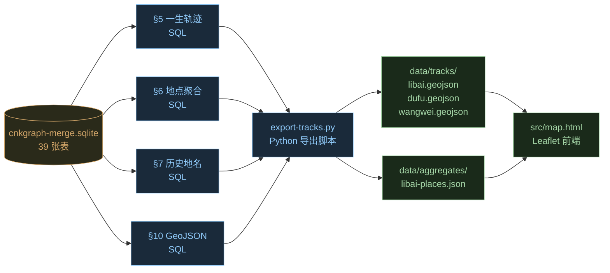
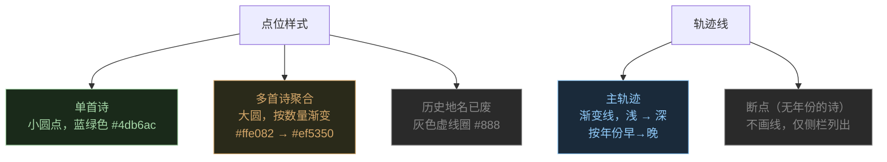
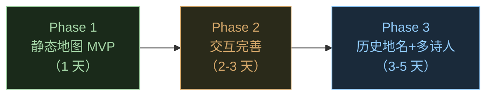

# PRD：诗人编年系地 × 地图联动

> 配套文件：`docs/test.sql`（编年系地 SQL 集合，§1-§11）
> 数据库：`cnkgraph/data/cnkgraph-merge.sqlite`（SQLite 3，39 表，已含李白/杜甫/王维）
> 状态：规划稿，未实现

---

## 1. 产品愿景

把 `cnkgraph` 数据库里的「写作 → 时间 → 地点」三元组，变成一张**可交互的中国历史地图**：

> 用户选一位诗人（如李白），地图上画出他一生走过的所有地点、按年份排出一条**编年轨迹**；点击任意一个点位，弹出他在这里写过的诗、什么时候写的、当时这地方叫什么。

一句话：**让诗人在地图上活一遍**。

### 1.1 核心问题（必须回答）

| # | 问题 | 数据从哪来 |
|---|------|-----------|
| Q1 | 这首诗是哪年写的？ | `writing.author_date_raw` + `writing_link (DateTime)` |
| Q2 | 这首诗在哪里写的？ | `writing.author_place_raw` + `writing_link (Region)` |
| Q3 | 当时这地方叫什么？ | `region_history`（按写作年份过滤 `begin_year/end_year`） |
| Q4 | 这个诗人在哪写了多少首诗？ | `§6` 聚合 SQL |
| Q5 | 诗人的一生怎么走的？ | `§5` 按年份排序的诗作轨迹 |

### 1.2 已知数据局限

| 局限 | 影响 | 应对策略 |
|------|------|---------|
| `biography_activity` 表为空 | 没有诗人年表（仅当官/行旅记录） | 用 `writing_link` 反推"伪年表"（见 test.sql §9） |
| `writing_link.year` 是 TEXT，含"去年""襄王"等 | 数字聚合会混入字符串 | 所有聚合必须 `WHERE year GLOB '[0-9]*'` |
| `writing_link.region_id` 多值逗号分隔 | 不能直接 JOIN | 用 §3 递归 CTE 拆开，或用 `LIKE '%,id,%'` 模糊匹配 |
| 历史地名同名异位（唐"南京"=成都） | 直接显示当代名会误导 | §7 用 `region_history` 还原古名 + 当时经纬度 |
| 部分诗无时间 / 无地点 | 轨迹有断点 | UI 上分两组：可定位的画在地图，不可定位的列在侧栏 |

---

## 2. 数据流架构



**关键设计：离线预生成 GeoJSON**，不把 SQL 暴露到前端。
- 开发期：`python export-tracks.py --author-id 15188` 生成 `data/tracks/libai.geojson`
- 运行期：前端直接 fetch 这个静态文件
- 好处：① 没有查询延迟；② 可以提交到 git，GitHub Pages 直接托管；③ 不需要后端

---

## 3. 三层数据产物

### 3.1 Layer 1：诗作点位（Point）

每首可定位的诗一个 GeoJSON Feature：
```json
{
  "type": "Feature",
  "geometry": { "type": "Point", "coordinates": [108.946, 34.347] },
  "properties": {
    "writing_id": 25516,
    "title": "九日龙山饮",
    "author": "李白",
    "year": 762,
    "date_text": "762年9月9日",
    "place_modern": "西安市",
    "place_historical": "长安",
    "lines": ["九日龙山饮，", "黄花笑逐臣。", "醉看风落帽，", "舞爱月留人。"]
  }
}
```
对应 SQL：`test.sql §10`

### 3.2 Layer 2：诗人轨迹（LineString / MultiPoint）

把 Layer 1 的点按年份排序连成一条线：
```json
{
  "type": "Feature",
  "geometry": {
    "type": "LineString",
    "coordinates": [
      [108.946, 34.347],   // 725 长安
      [118.803, 32.065],   // 726 南京
      [114.312, 30.598]    // 728 武汉
    ]
  },
  "properties": { "author": "李白", "year_range": "725-762" }
}
```
对应 SQL：`test.sql §5`（按年份排序的诗作 + 地点）

### 3.3 Layer 3：地点热度（Circle / Heatmap）

每个地点一个聚合点，半径=诗作数：
```json
{
  "type": "Feature",
  "geometry": { "type": "Point", "coordinates": [108.946, 34.347] },
  "properties": {
    "place": "西安市",
    "poem_count": 221,
    "first_year": 730,
    "last_year": 762,
    "sample_titles": "长相思、行路难、将进酒"
  }
}
```
对应 SQL：`test.sql §6`

---

## 4. 地图 UI 设计

### 4.1 整体布局

```
┌─────────────────────────────────────────────────────────────────┐
│  [诗人▾李白] [显示轨迹☑] [显示热度☐] [历史地名☑] [年份范围 725─762] │
├──────────────────────────────────────────┬──────────────────────┤
│                                          │ 诗单（侧栏）         │
│                                          │                      │
│         [中国历史地图]                   │ ▸ 725 长安           │
│                                          │   • 长相思           │
│      ●━━━━●                              │   • 行路难           │
│      长安  洛阳                           │ ▸ 726 南京           │
│           │                              │   • 金陵凤凰台       │
│           ●━━━━●━━━━●                    │ ▸ 728 武汉           │
│          南京  九江  安陆                 │   • 黄鹤楼送孟浩然   │
│                                          │                      │
│  点击点位 → 弹窗：诗全文 + 写作背景       │ 点击诗题 → 飞到点位   │
└──────────────────────────────────────────┴──────────────────────┘
```

### 4.2 五种交互

| # | 交互 | 实现 |
|---|------|------|
| 1 | 选诗人 → 重画地图 | 切换 `libai.geojson` / `dufu.geojson` |
| 2 | 拖年份滑块 → 渐次显示 | 按年份过滤 Feature (`year >= range[0] && year <= range[1]`) |
| 3 | 点击点位 → 弹窗 | Leaflet `bindPopup`，展示 `properties.lines` 全诗 |
| 4 | 勾选"历史地名" → 切换标签 | popup 里同时显示 `place_modern` + `place_historical` |
| 5 | 点击诗题 → 地图飞到该点 | `map.flyTo([lat,lng], 8)` |

### 4.3 视觉规范



---

## 5. 技术选型

### 5.1 前端（强推 Leaflet）

| 选项 | 体积 | 离线 | 中文地图瓦片 | 评价 |
|------|------|------|-------------|------|
| **Leaflet**（推荐） | 42 KB | ✅ | ✅ 天地图 / 高德 | 简单、零依赖、GitHub Pages 友好 |
| Mapbox GL JS | 800 KB | ❌（需 token） | ✅ | 效果漂亮但要 key，超出本仓库轻量级定位 |
| Echarts geo | 1 MB | ✅ | ✅ | 适合图表，弱于真地图交互 |
| D3 + d3-geo | 250 KB | ✅ | 需自己找 GeoJSON | 灵活但工作量大 |

**结论**：Leaflet + 天地图瓦片（免费、中文、无 token）。

### 5.2 历史底图

可选叠加层：
- 谭其骧《中国历史地图集》扫描切片（公开）→ 加为 Leaflet overlay
- 不强求，第一版用现代底图 + popup 里写「当时叫 XX」即可

### 5.3 后端 / 数据管线

| 步骤 | 工具 |
|------|------|
| 从 SQLite 导出 GeoJSON | Python + `sqlite3` + `json`（脚本 ≤ 100 行） |
| 历史地名映射 | 直接 SQL JOIN `region_history`，不另建服务 |
| 部署 | 静态文件托管到 GitHub Pages（同当前 `src/index.html`） |

---

## 6. 实现路线（三阶段）



### Phase 1：MVP（李白一个人，单层点位）
- [ ] 写 `cnkgraph/src/export-tracks.py`：跑 §10 SQL → 输出 `data/tracks/libai.geojson`
- [ ] 新建 `src/map.html`：Leaflet + 天地图 + 加载 GeoJSON + 简单 popup
- [ ] 验证：能看到李白一生的几十个点位

### Phase 2：交互完善（侧栏 + 年份滑块 + 轨迹线）
- [ ] 加诗单侧栏（左/右栏可折叠），点击诗题飞到点位
- [ ] 加年份范围滑块（noUiSlider，10 KB），拖动时过滤图层
- [ ] 用 §5 SQL 生成 LineString 轨迹，叠加显示
- [ ] 加"显示/隐藏"开关：点位 / 轨迹 / 热度（用 §6 数据）

### Phase 3：历史地名 + 多诗人
- [ ] 用 §7 SQL 把 `place_historical` 注入每个 Feature 的 properties
- [ ] 加诗人切换下拉框（李白 / 杜甫 / 王维），分别加载不同 geojson
- [ ] 加"历史地名"复选框：勾上后点位 label 切换为古名
- [ ] 加点位的颜色/大小映射（按诗作数）

---

## 7. 与现有项目的集成

### 7.1 仓库结构变更

```
pinyin/
├── docs/
│   ├── test.sql               ← 本次新增（编年系地 SQL）
│   ├── prd-map.md             ← 本文档
│   └── ...
├── cnkgraph/
│   ├── src/
│   │   ├── export-tracks.py   ← Phase 1 新增（导出脚本）
│   │   └── ...
│   └── data/
│       ├── cnkgraph-merge.sqlite
│       └── tracks/            ← Phase 1 新增（GeoJSON 产物）
│           ├── libai.geojson
│           ├── dufu.geojson
│           └── wangwei.geojson
└── src/
    ├── index.html             ← 现有注音版（不动）
    └── map.html               ← Phase 1 新增（地图页）
```

### 7.2 与 `src/index.html` 的关系
- 两个页面**完全独立**，互不影响
- 注音版（`index.html`）：以诗为单位，逐字注音
- 地图版（`map.html`）：以诗人为单位，按地点展开
- 互相链接：`index.html` 的诗人卡片加一个「在地图上看」按钮 → 跳到 `map.html?author=15188`

### 7.3 与 cnkgraph 爬虫的关系
- 地图用**已爬到的数据**（李白/杜甫/王维三个诗人）
- 未来爬更多诗人（如白居易、苏轼），重跑 `export-tracks.py` 即可生成新轨迹
- 不需要改爬虫代码

---

## 8. 风险与开放问题

| 风险 | 影响 | 备选 |
|------|------|------|
| `biography_activity` 永远为空 | 年表只能用诗作推断，缺当官/行旅记录 | 后续单独爬 CBDB API 补全 |
| 部分诗的 `author_place_raw` 为空 | 这部分点位缺失 | 用 `writing_link (Region)` 兜底（§8） |
| 历史地名经纬度大量缺失 | 古名点位可能和当代点位重合 | 用 `region.latitude/longitude` 兜底显示 |
| 地图瓦片被墙（天地图偶尔不稳） | 国内用户偶尔加载慢 | 备选高德瓦片 |
| GeoJSON 文件可能很大（李白 2000+ 首） | 加载慢 | 按 5 年/10 年分块，按需加载 |

### 开放问题（待用户决策）
1. **是否需要"按诗题搜索"功能？** 还是只通过侧栏诗单浏览？
2. **多诗人对比模式**：要不要支持同时显示李白+杜甫，看他们是否曾在同年同地？
3. **移动端适配**：地图页是否需要做响应式（手机上侧栏改成抽屉）？

---

## 9. 验收标准（Phase 1）

- [ ] `data/tracks/libai.geojson` 至少包含 200 个 Feature（李白可定位的诗）
- [ ] 打开 `src/map.html`，3 秒内看到中国地图 + 所有点位
- [ ] 点击任一点位，popup 显示：诗题、作者、年份、地点（古名+今名）、全文
- [ ] 拖动地图、缩放无卡顿（点位 < 500 时）
- [ ] GitHub Pages 部署后可正常访问（无需本地服务器）

---

## 10. 参考链接

- Leaflet 官方教程：https://leafletjs.com/examples/quick-start/
- 天地图 API（需注册 key）：https://console.tianditu.gov.cn/
- SQLite 递归 CTE 拆字符串：https://www.sqlite.org/lang_with.html
- 现有数据：`cnkgraph/data/cnkgraph-merge.sqlite`（李白/杜甫/王维已爬完）
- 配套 SQL：`docs/test.sql`
