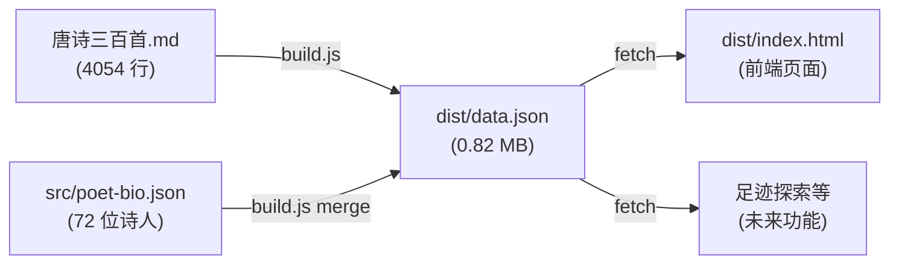
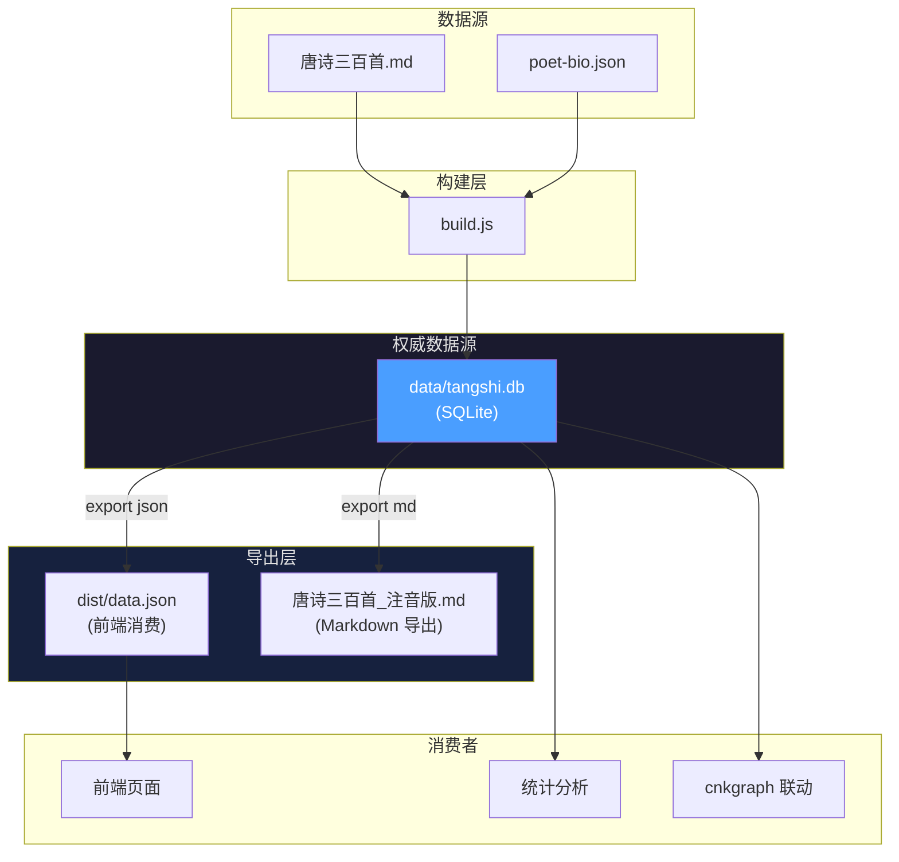
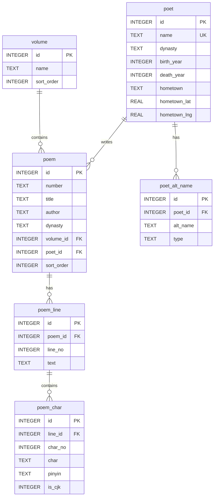
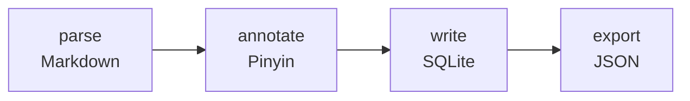
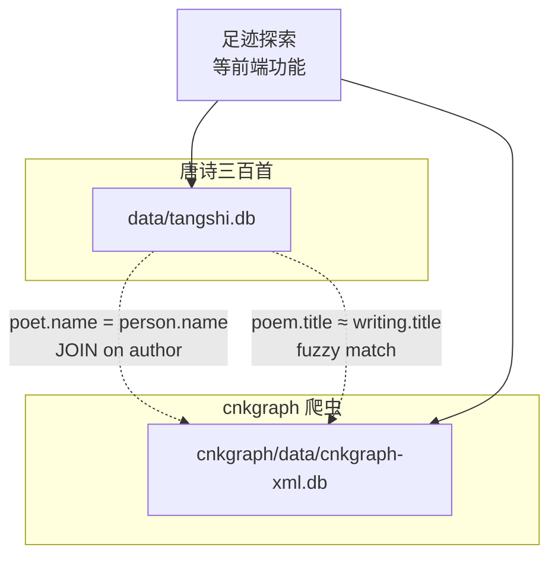

# PRD — 唐诗三百首数据存储 SQLite 化

## 1. 产品愿景

**一句话**：将唐诗三百首从"Markdown 文本 + JSON 文件"升级为结构化 SQLite 数据库，作为项目权威数据源，支持查询、统计与增量更新。

**用户故事**：

- 作为开发者，我想用 SQL 查询"杜甫有多少首五言律诗"，而不是解析 JSON
- 作为开发者，我想增量更新某一首诗的注音，而不是全量重建 data.json
- 作为开发者，我想统一管理唐诗三百首和 cnkgraph 爬虫数据，而不是分散在多个文件中
- 作为前端用户，我希望加载速度更快（按需查询，而非下载整个 0.82 MB JSON）

## 2. 当前架构 vs 目标架构

### 2.1 当前数据流



**问题**：

| 问题 | 说明 |
|------|------|
| 无法查询 | JSON 不是数据库，统计需要加载全部数据后在 JS 中过滤 |
| 全量重建 | 修改一首诗需要重新运行 build.js 生成整个 data.json |
| 数据冗余 | poet-bio.json 与 data.json 中的诗人信息重复 |
| 不利于扩展 | cnkgraph 已用 SQLite，两个数据源无法统一查询 |

### 2.2 目标数据流



**核心改变**：SQLite 成为唯一权威数据源，JSON/Markdown 降级为导出视图。

## 3. Schema 设计

### 3.1 ER 图



### 3.2 表结构详情

#### `volume` — 卷

| 列名 | 类型 | 约束 | 说明 |
|------|------|------|------|
| id | INTEGER | PK, AUTOINCREMENT | |
| name | TEXT | NOT NULL | "卷01-五言古诗" |
| sort_order | INTEGER | NOT NULL | 排序号 |

数据量：~10 行

#### `poem` — 诗

| 列名 | 类型 | 约束 | 说明 |
|------|------|------|------|
| id | INTEGER | PK, AUTOINCREMENT | |
| number | TEXT | NOT NULL | "001" |
| title | TEXT | NOT NULL | "感遇其一" |
| author | TEXT | NOT NULL | "张九龄" |
| dynasty | TEXT | | "唐" |
| volume_id | INTEGER | FK → volume.id | |
| poet_id | INTEGER | FK → poet.id | 可为空（未匹配到诗人时） |
| sort_order | INTEGER | NOT NULL | 全局排序号 |

数据量：~320 行
索引：`idx_poem_volume_id`、`idx_poem_author`、`idx_poem_poet_id`

#### `poem_line` — 诗句行

| 列名 | 类型 | 约束 | 说明 |
|------|------|------|------|
| id | INTEGER | PK, AUTOINCREMENT | |
| poem_id | INTEGER | FK → poem.id, NOT NULL | |
| line_no | INTEGER | NOT NULL | 行序号（从 0 开始） |
| text | TEXT | NOT NULL | 原始文本 |

数据量：~2,500 行
索引：`idx_line_poem_id`

#### `poem_char` — 逐字注音

| 列名 | 类型 | 约束 | 说明 |
|------|------|------|------|
| id | INTEGER | PK, AUTOINCREMENT | |
| line_id | INTEGER | FK → poem_line.id, NOT NULL | |
| char_no | INTEGER | NOT NULL | 字序号（从 0 开始） |
| char | TEXT | NOT NULL, LENGTH=1 | 单字 |
| pinyin | TEXT | | 拼音（含声调符号），非汉字为空 |
| is_cjk | INTEGER | NOT NULL, DEFAULT 0 | 是否汉字（0/1） |

数据量：~50,000 行
索引：`idx_char_line_id`、`idx_char_pinyin`

#### `poet` — 诗人

| 列名 | 类型 | 约束 | 说明 |
|------|------|------|------|
| id | INTEGER | PK, AUTOINCREMENT | |
| name | TEXT | NOT NULL, UNIQUE | "李白" |
| dynasty | TEXT | | "唐" |
| birth_year | INTEGER | | 生年 |
| death_year | INTEGER | | 卒年 |
| hometown | TEXT | | 故乡 |
| hometown_lat | REAL | | 纬度 |
| hometown_lng | REAL | | 经度 |

数据量：~77 行

#### `poet_alt_name` — 诗人别名

| 列名 | 类型 | 约束 | 说明 |
|------|------|------|------|
| id | INTEGER | PK, AUTOINCREMENT | |
| poet_id | INTEGER | FK → poet.id, NOT NULL | |
| alt_name | TEXT | NOT NULL | "字太白" |
| type | TEXT | | "字"/"号"/"谥号"/"行第" |

数据量：~150 行
索引：`idx_alt_poet_id`

### 3.3 数据映射

当前 JSON → SQLite 的映射关系：

```
data.json
├── volumes[]          → volume 表
├── poems[]
│   ├── id/number/title/author/dynasty  → poem 表
│   ├── volumeId                        → poem.volume_id
│   └── lines[]
│       ├── text                        → poem_line.text
│       └── chars[]
│           ├── char/pinyin             → poem_char
│           └── (CJK test)              → poem_char.is_cjk
└── poetBios{}
    ├── key (author name)               → poet.name
    ├── birthYear/deathYear/dynasty     → poet 表
    ├── hometown/hometownCoord          → poet 表
    └── altNames[]                      → poet_alt_name 表
        └── "字子壽"                     → alt_name="子壽", type="字"
```

## 4. 技术方案

### 4.1 依赖选择

| 方案 | 优点 | 缺点 |
|------|------|------|
| **better-sqlite3** | 同步 API，无需 async；纯 C++ 绑定，性能好 | 需要 native 编译 |
| sql.js | 纯 WASM，无需编译 | 性能较差；DB 在内存中 |
| Prisma/Drizzle | ORM，类型安全 | 过度工程化，320 首诗不需要 ORM |

**推荐**：`better-sqlite3`。同步 API 与当前 build.js 的同步风格一致，迁移成本最低。

### 4.2 文件结构

```
pinyin/
├── build.js              # 修改：增加 SQLite 写入逻辑
├── data/
│   └── tangshi.db        # 新增：SQLite 数据库
├── dist/
│   ├── data.json         # 保留：从 SQLite 导出的 JSON
│   └── index.html        # 保留：前端页面
├── docs/
│   └── prd-sqlite-migration.md  # 本文档
└── src/
    ├── poet-bio.json     # 保留：数据源，导入 SQLite 后仍可保留
    └── index.html        # 保留：前端模板
```

### 4.3 build.js 改造

构建过程变为两步：



```javascript
// build.js 伪代码
const Database = require('better-sqlite3');

function build() {
  // 1. 解析 Markdown（不变）
  const { volumes, poems } = parseMarkdown(content);

  // 2. 注音（不变）
  annotatePoems(poems);

  // 3. 写入 SQLite（新增）
  const db = new Database('data/tangshi.db');
  createTables(db);
  const poetMap = buildPoetTable(db, poems, poetBios);
  writeVolumes(db, volumes);
  writePoems(db, poems, poetMap);

  // 4. 从 SQLite 导出 JSON（替代直接生成 JSON）
  exportToJson(db, 'dist/data.json');

  // 5. 复制前端页面（不变）
  copyFileSync('src/index.html', 'dist/index.html');
}
```

### 4.4 导出命令

| 命令 | 作用 |
|------|------|
| `node build.js` | 完整构建：解析 → SQLite → JSON → HTML |
| `node build.js --export json` | 仅从 SQLite 导出 JSON（不重新解析） |
| `node build.js --export md` | 从 SQLite 导出注音 Markdown |
| `node build.js --stats` | 打印统计信息 |

### 4.5 统计查询示例

```sql
-- 各卷诗数
SELECT v.name, COUNT(p.id) AS poem_count
FROM volume v LEFT JOIN poem p ON p.volume_id = v.id
GROUP BY v.id ORDER BY v.sort_order;

-- 各作者诗数 TOP 10
SELECT author, COUNT(*) AS cnt FROM poem GROUP BY author ORDER BY cnt DESC LIMIT 10;

-- 含某字的诗句
SELECT pl.text FROM poem_line pl
JOIN poem_char pc ON pc.line_id = pl.id
WHERE pc.char = '月' AND pc.is_cjk = 1;

-- 拼音查询（如所有读 "yue4" 的字）
SELECT DISTINCT char, pinyin FROM poem_char
WHERE pinyin LIKE 'yu%' ORDER BY pinyin;
```

## 5. 迁移策略

### Phase 1：SQLite 写入 + JSON 保留（当前 PRD 范围）

- build.js 增加 `better-sqlite3` 依赖
- 构建时同时写入 SQLite 和生成 JSON
- 前端行为不变（仍读 data.json）
- **零风险**：JSON 输出与现有完全一致

### Phase 2：查询与统计

- 增加 `--stats` 命令
- 增加韵脚统计、用字频率分析
- 可选：从 cnkgraph writing 表匹配诗作，丰富关联数据

### Phase 3：前端适配（远期）

- 前端可直接 fetch SQLite 导出的分页 JSON（按卷/按诗人分文件）
- 或使用 sql.js 在浏览器端直接查询 SQLite
- 为足迹探索等功能提供统一数据源

## 6. 与 cnkgraph 的关系



- `tangshi.db.poet.name` 可与 `cnkgraph-xml.db.person.name` 关联
- 关联后可查询诗人的 cnkgraph ID，进而获取足迹、年谱等数据
- 未来可合并为单一 DB，但当前保持独立更便于管理

## 7. 风险评估

| 风险 | 影响 | 缓解 |
|------|------|------|
| better-sqlite3 在 Windows 需编译 | 安装可能失败 | 提供 prebuild；或 fallback 到 sql.js |
| JSON 导出格式变化 | 前端可能 break | Phase 1 保证 JSON 格式 100% 兼容 |
| 诗人名字匹配不一致 | poet.name 与 poem.author 不完全对应 | 建立名字映射表，手动校验 |
