# 中华经典文库 — 产品构想与深度探讨

> 从「唐诗三百首注音版」出发，探讨经史子集全品类的产品可能性。本文档定位为持续演进的构想空间，汇集 Kimi 方案整理、独立思考、以及用户交流中产生的想法。

## 一、现有架构评价

| 环节   | 技术                     | 评价          |
| ---- | ---------------------- | ----------- |
| 拼音生成 | `pinyin-pro` + Node.js | 稳定可靠，适合批量处理 |
| 竖排排版 | 赫蹏 heti                | 专门的中文竖排方案   |
| 前端   | 原生 HTML/CSS/JS         | 零依赖，加载快     |
| 数据   | Markdown → JSON 构建管线   | 作者友好，易维护    |
| 部署   | GitHub Pages 静态站       | 免费，CDN 全球加速 |

> **优化建议**：Kimi 的评价表偏静态，只说了"是什么"，没说"下一步往哪走"。实际上这张表最大的价值是帮我们看清**哪些环节已经够好不用动，哪些是该升级的短板**。

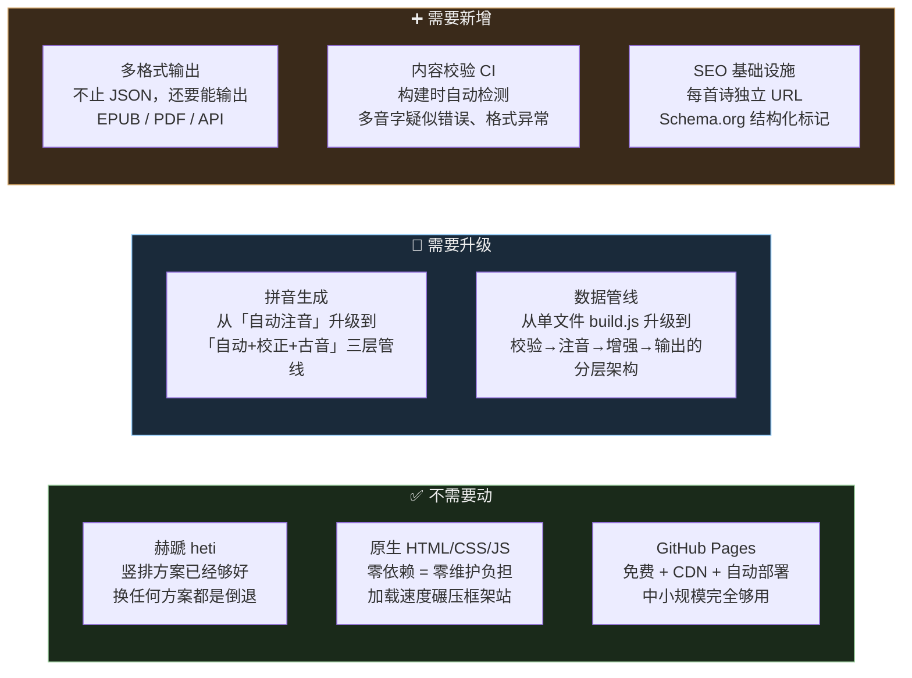

## 一½、深度思考：Kimi 方案的盲区与突破口

> 以下是对上文 Kimi 方案的反思与深化，补充几个被忽略的关键维度。

### 1. 方案 A 不是"过渡方案"，而是长期最优解

Kimi 把方案 A 定位为"个人维护、追求质感"的折中选择，暗示它是权宜之计。但这忽略了一个关键事实：

**竖排古籍的排版难题，恰恰只有原生 CSS 才能解决。**

`writing-mode: vertical-rl` + 拼音四方位绝对定位 + 标点间距控制 —— 这些需求在 Vue/React 组件化体系中，要么被抽象掉失去控制力，要么需要大量 hack 绕过框架。poem300 的"零框架"架构不是简陋，而是被硬需求逼出来的精准选择。

```
框架的承诺：组件化 → 复用 → 高效
古籍的现实：每个排版细节都要像素级控制 → 框架的抽象层反而是障碍
```

**真正该升级的不是"换框架"，而是"构建管线的工程化"**：

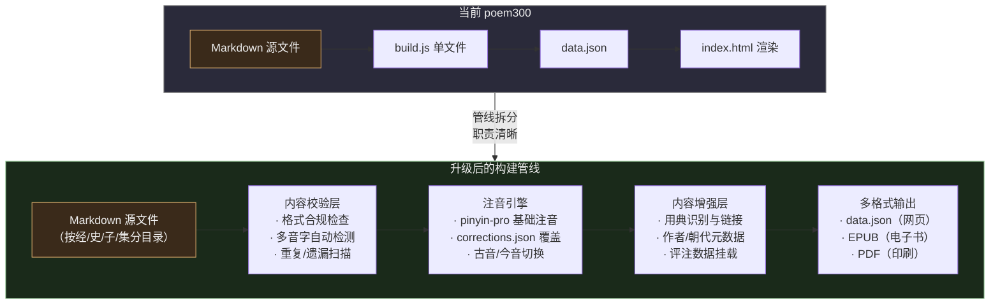

**核心原则：前端渲染层保持原生 HTML/CSS，但构建管线从单文件演进为分层架构。**

### 2. 内容才是护城河，不是技术

四库全书是公共领域内容，谁都能拿到原文。但"准确的古汉语注音"和"系统整理的历代评注"是苦活累活，做了就有壁垒。

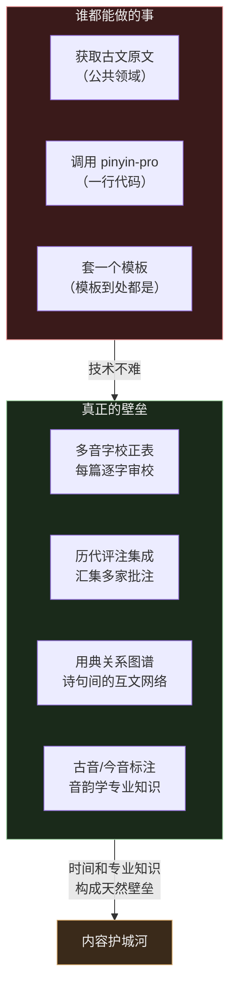

**可操作的第一步**：先为唐诗三百首建立完整的 `corrections.json`，这本身就是一个可独立发布、有价值的数据集。

### 3. 缺失的关键维度：知识图谱

古诗文不是孤立的 310 首诗，它们之间有复杂的引用和互文关系：

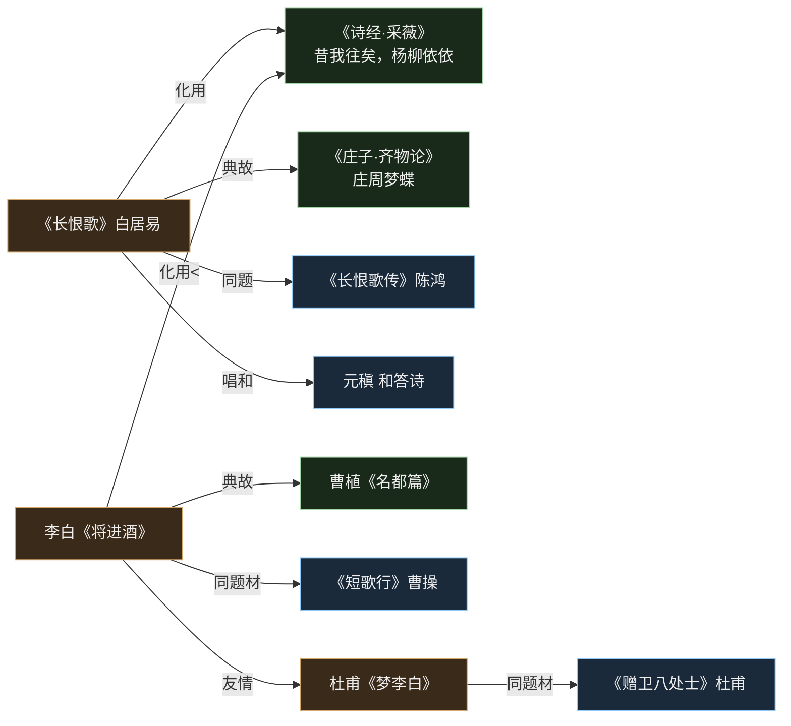

**这能做出什么独特的产品功能？**

- **"典故溯源"**：点击诗中的典故词，弹出该典故的出处原文和演变脉络
- **"意象地图"**：同一意象（月亮、柳树、酒）在不同诗人笔下的运用对比
- **"诗人关系网"**：李白-杜甫-孟浩然之间的交游关系可视化
- **"学习路径"**：基于难度和典故依赖关系，自动生成阅读顺序

目前市面上（古诗文网、西窗烛等）都把每首诗当作独立页面展示，**没有人把诗与诗之间的关系做成可交互的网络**。这是一个真正的差异化机会。

### 4. 目标用户：不只是亲子，更是"想读但读不动"的成年人

Kimi 的方案聚焦在 6-12 岁亲子场景，这没错但太窄了。更大的潜在用户群：

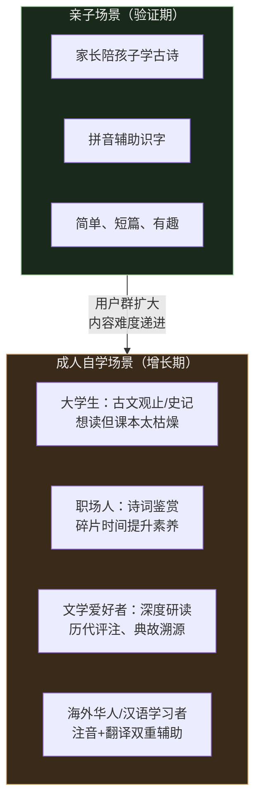

**成人场景对功能的需求完全不同**：

- 不需要"跟读打分"，需要的是"这句为什么这么写"的注释和评析
- 不需要"每日一首"，需要的是"按主题/按用典/按意象"的系统性阅读
- 不需要"积分勋章"，需要的是"我的批注和读书笔记"

**建议的产品演进方向**：

| 阶段 | 内容          | 核心用户      | 差异化功能         |
| -- | ----------- | --------- | ------------- |
| 现在 | 唐诗三百首       | 古典文学爱好者   | 竖排+拼音+四方位     |
| V2 | 唐宋词 + 古文观止  | 大学生/文学爱好者 | 典故溯源 + 知识图谱   |
| V3 | 四书五经 + 史记选篇 | 深度研读者     | 多层批注 + 古今对照   |
| V4 | 全品类 + 社区    | 全年龄段      | 用户协作注音 + 批注分享 |

### 5. 被忽视的武器：GitHub 开源协作

这个项目天然适合 GitHub 协作模式，但 Kimi 完全没提：

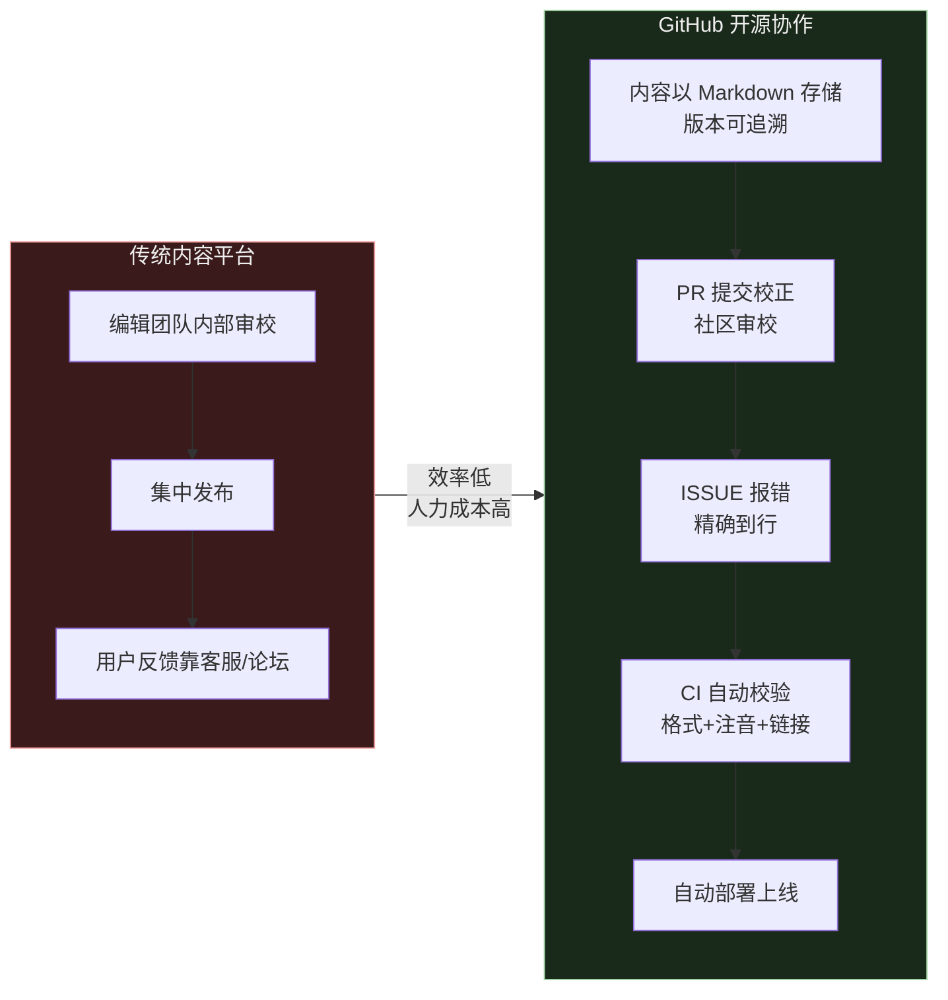

**具体怎么做**：

- **注音校正**：每个用户都可以提交 PR 修改 `corrections.json`，reviewer 只需检查 diff
- **内容扩充**：新经典以 PR 形式提交，CI 自动跑格式校验 + 注音预览
- **质量保障**：GitHub Actions 不只部署网站，还可以跑测试——检测多音字疑似错误、格式合规性、死链接等
- **贡献激励**：GitHub 贡献图本身就是激励，加上 CONTRIBUTORS.md 彰显贡献者

这套机制不需要额外开发任何平台，**GitHub 本身就是现成的内容协作系统**。

### 6. 一个技术上的大胆想法：Web Components

如果未来真的要从单页扩展到多品类，不用换 Vue/React，可以用 **Web Components**：

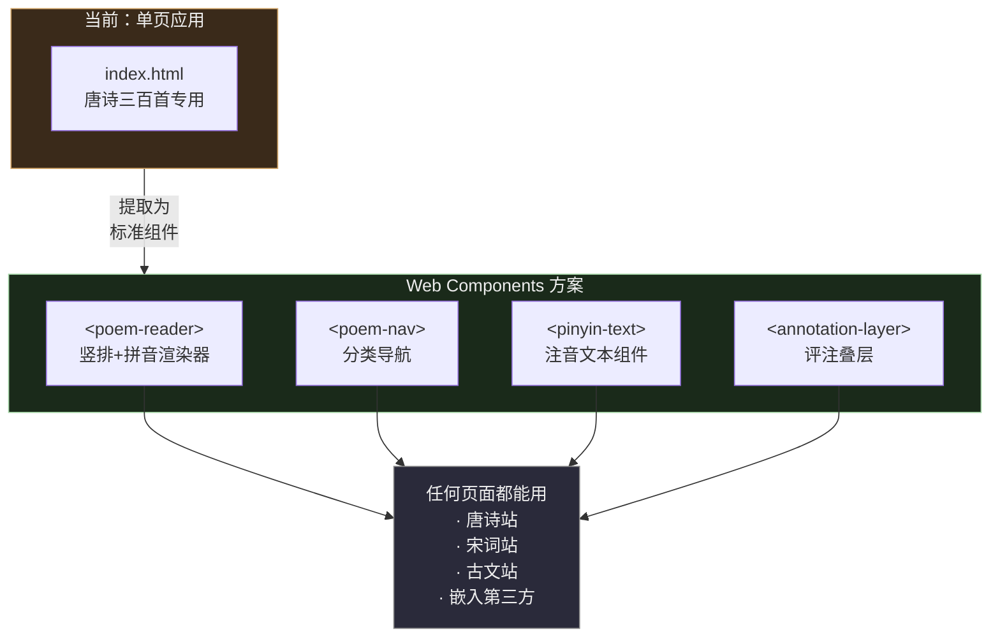

Web Components 的好处：

- **不绑定框架**：原生浏览器支持，不依赖 Vue/React/Angular
- **真正的复用**：`<pinyin-text>` 组件可以在任何网页中直接使用
- **渐进增强**：从当前代码逐步提取，不需要重写
- **第三方嵌入**：其他网站可以用 `<script>` 引入你的组件库

***

## 二、扩展到四库全品类的方案选型

### 三种技术路线

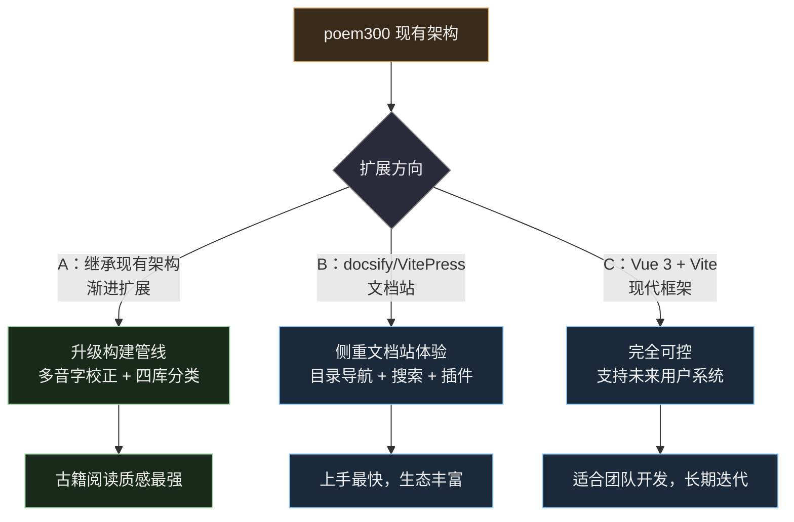

### 方案对比

| 维度   | A：继承 poem300  | B：docsify/VitePress | C：Vue 3 + Vite |
| ---- | ------------- | ------------------- | -------------- |
| 竖排控制 | 精细（heti 专门优化） | 需额外 CSS 调优          | 完全自由           |
| 拼音位置 | 四方位可调         | 默认上方，需自定义           | 完全自由           |
| 古籍质感 | 最强            | 偏文档风格               | 完全可控           |
| 维护成本 | 中             | 低（自带很多功能）           | 高              |
| 扩展性  | 高（完全可控）       | 中（受限于框架架构）          | 最高             |
| 适合场景 | 个人维护、追求质感     | 快速搭建                | 团队开发、长期迭代      |

### 推荐策略

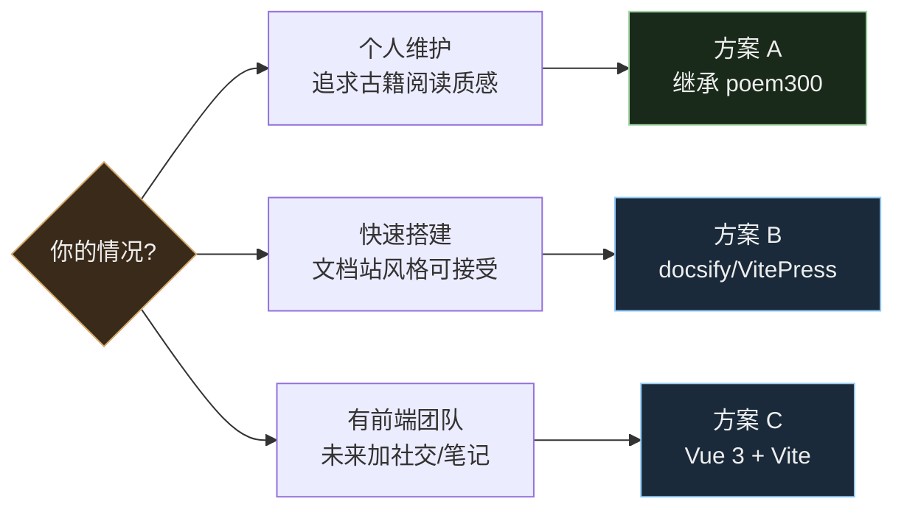

> **优化建议**：Kimi 把三种方案当作"三选一"的选择题，但实际上更合理的做法是**在方案 A 的基础上，渐进地借鉴 B 和 C 的优点**，而不是全盘切换。

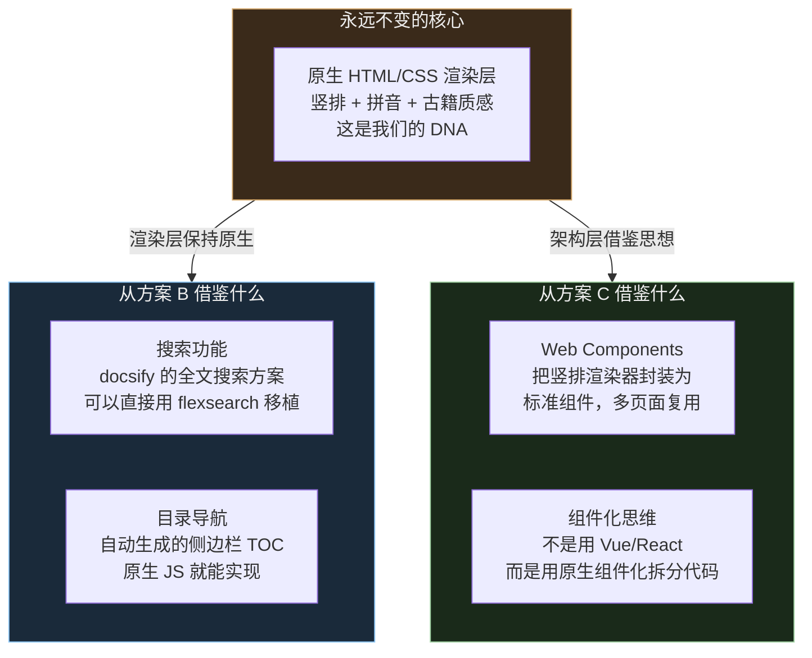

Kimi 的对比表里有一个隐含假设：扩展品类 = 技术架构大改。但实际上**扩展品类的瓶颈不在技术，在内容整理**。chinese-poetry 项目已经证明——5.5万首唐诗用一个简单的 JSON 结构就能承载。真正的挑战是怎么给每首诗标注注音、典故、时空坐标，这跟用什么框架无关。

这是古诗文注音最大的坑。`pinyin-pro` 对古汉语多音字（如「说(yuè)乎」「乐(lè/yào)」）会标错。

**解决方案**：建立 `corrections.json` 人工校正表，构建时先自动注音再覆盖。

```json
{
  "论语": {
    "学而时习之不亦说乎": { "说": "yuè" },
    "有朋自远方来不亦乐乎": { "乐": "lè" }
  }
}
```

### 多音字校正的工程化方案

单纯的 JSON 校正表在内容量大了之后会变成维护噩梦。需要一个分层策略：

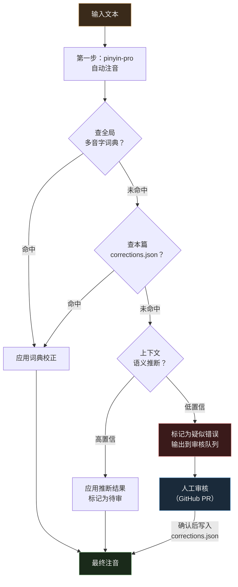

**三层校正机制**：

| 层级          | 数据源                                        | 覆盖率   | 维护方式               |
| ----------- | ------------------------------------------ | ----- | ------------------ |
| **L1 全局词典** | `polyphone-dict.json` — 常见古汉语多音字规则（\~500条） | \~80% | 随项目维护，PR 更新        |
| **L2 篇目校正** | `corrections.json` — 每篇特定句子的读音             | \~15% | 逐篇审校时补充            |
| **L3 人工审核** | 构建输出中的 `?` 标记（低置信度）                        | \~5%  | GitHub ISSUE/PR 流程 |

**关键洞察**：L1 全局词典做一次，所有篇目受益。比如「骑」在古诗中读 `jì`（名词，骑兵）的概率远大于 `qí`，写一条规则就能覆盖几百首诗。

## 四、文档站方案补充对比

除 docsify 外，还有几个适合竖排+拼音的方案：

| 方案             | 上手难度 | 竖排控制  | 构建速度 | 适合人群      |
| -------------- | ---- | ----- | ---- | --------- |
| **docsify**    | 最简单  | 需 CSS | 无构建  | 快速验证      |
| **VitePress**  | 简单   | 完全可控  | 很快   | Vue 用户    |
| **MkDocs**     | 简单   | 需 CSS | 快    | Python 用户 |
| **Docusaurus** | 中等   | 完全可控  | 中等   | React 用户  |
| **Astro**      | 中等   | 完全可控  | 最快   | 追求性能      |

**VitePress 不推荐的原因**：它是为技术文档设计的，竖排古籍的 `writing-mode: vertical-rl` + 拼音四方位定位 + 阅读设置持久化需要大量 hack，不如原生方案自如。

> **优化建议**：Kimi 列了五种文档站方案做对比，但这个对比本身就是伪命题——**我们不需要文档站**。文档站是为"很多人写很多文档"的场景设计的（团队文档、API 文档、教程），而我们是"一个人维护的结构化内容库"。真正该对比的不是"用哪个文档站框架"，而是"怎么让搜索引擎和用户找到每一首诗"。

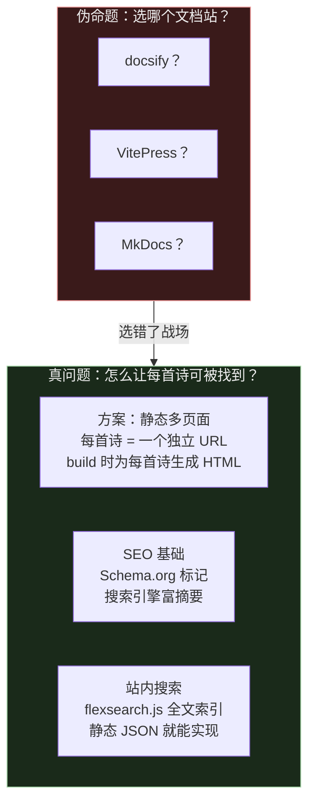

当前 poem300 是单页应用（所有诗在一个 index.html 里），这对 SEO 不友好——搜索引擎只能收录一个页面。扩展到多品类时，应该改为**每首诗一个独立页面**，构建时自动生成。这才是真正该做的架构升级。

## 五、面向亲子共读的产品设计

### 核心场景

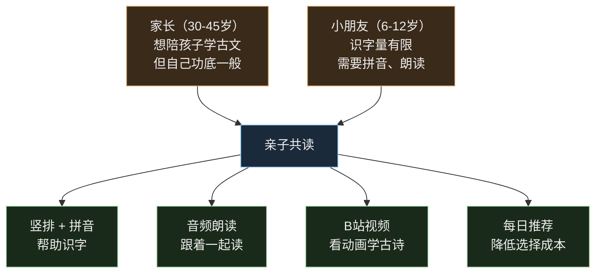

### 音频/视频格式支持

| 格式     | 支持方式                 | 网页可行性 |
| ------ | -------------------- | ----- |
| MP3 音频 | HTML5 `<audio>` 标签   | 完美支持  |
| B站视频   | iframe 嵌入播放器         | 完美支持  |
| MP4 视频 | HTML5 `<video>` 标签   | 完美支持  |
| 逐句跟读   | Web Audio API + 字幕同步 | 可实现   |

**网页版的限制**：音频不能后台锁屏播放、不能缓存到本地、没有播放进度记忆。

> **优化建议**：Kimi 把"亲子共读"当作核心场景，这没错但太窄了。而且它列的四个功能（拼音识字、音频朗读、B站视频、每日推荐）都是"内容消费型"功能，缺少"内容探索型"的想象力。更关键的是，亲子场景的付费意愿低、竞争激烈（洪恩识字、斑马AI、叫叫阅读一堆），反而是更难做的市场。

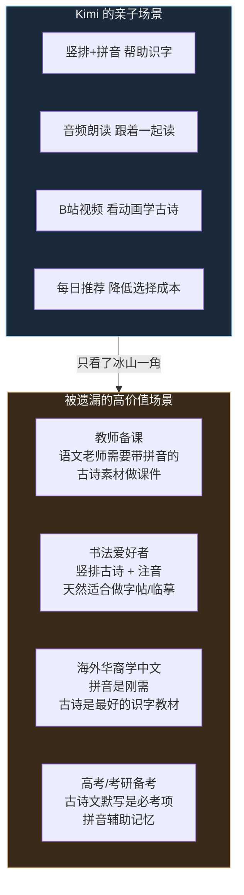

**这些被遗漏场景的共同特点**：都是"有明确需求、愿意付费、但市面产品做得差"的群体。一个语文老师在古诗文网上复制粘贴拼课件，一个海外家长在 YouTube 上找古诗拼音视频——这些人的需求，我们的竖排+拼音天然就能满足。

**建议的场景优先级调整**：

| 场景 | 用户规模 | 竞争程度 | 付费意愿 | 与我们产品的契合度 |
|------|---------|---------|---------|----------------|
| 亲子共读 | 大 | 极高（巨头林立） | 低 | 中 |
| 古典文学爱好者 | 中 | 低 | 中 | **极高** |
| 语文教师备课 | 中 | 低 | 高（学校付费） | **高** |
| 海外华裔学中文 | 中 | 中 | 中 | **高** |
| 书法爱好者 | 小 | 极低 | 高 | 高 |
| 高考备考 | 大 | 高 | 中 | 中 |

## 六、平台选型：网页 vs 小程序 vs App

### 分阶段策略

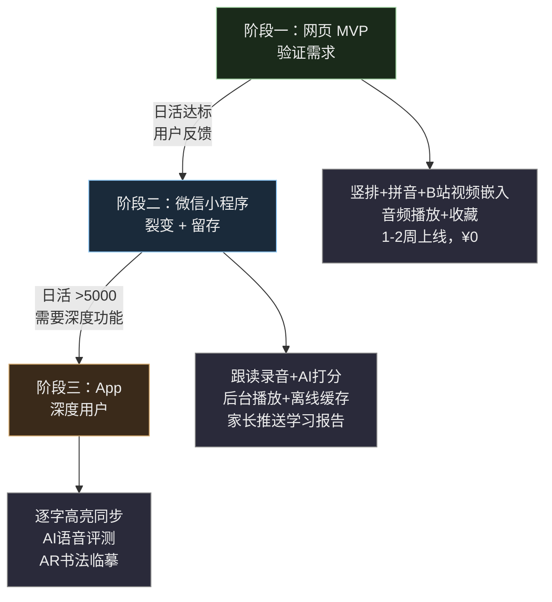

### 平台能力对比

| 维度      | 网页 H5         | 微信小程序    | App |
| ------- | ------------- | -------- | --- |
| 开发成本    | 最低            | 中        | 最高  |
| 音频后台播放  | 浏览器限制         | 原生支持     | 完美  |
| 音频离线缓存  | 有限            | 支持       | 完美  |
| 跟读打分    | Web Audio 精度差 | 录音 API 好 | 最佳  |
| 家长分享传播  | 复制链接          | 微信一键分享   | 需下载 |
| 小朋友使用门槛 | 低             | 低        | 高   |
| 支付/会员   | 麻烦            | 微信支付     | 内购  |

### 小程序特有的亲子功能

```
小朋友端：
  打开 → "今日任务：背《春晓》"（家长预设或系统推荐）
  听朗读 → 跟读录音 → AI打分（流畅度/准确度）
  完成打卡 → 获得积分/勋章

家长端：
  微信推送："小明今天完成了《春晓》跟读，得分85分"
  查看周报：本周背了5首，总时长30分钟
  设置学习计划：每天一首，周末复习
```

> **优化建议**：第六节的平台选型是整篇 Kimi 方案里偏差最大的部分。它把"网页→小程序→App"当作默认路径，但忽略了一个根本问题：**这个产品的核心是静态内容阅读，不是交互式服务。** 静态内容阅读产品最好的载体就是网页——维基百科、古诗文网、豆瓣读书都证明了这一点。第十三节已有详细的修正方案，这里只补充一个关键的决策矩阵：

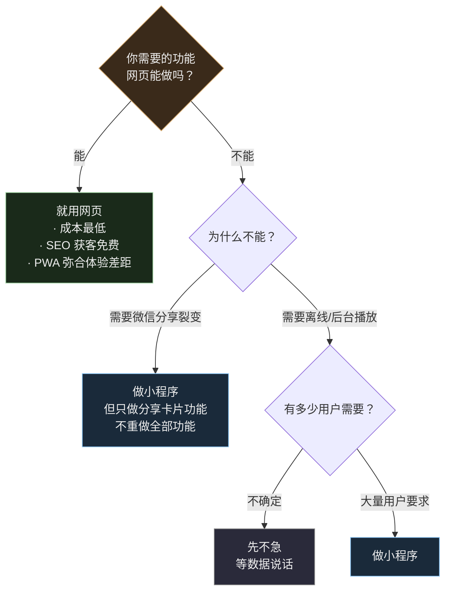

Kimi 提到"小程序特有亲子功能"（跟读打分、学习计划、家长推送），这些功能对一个小团队来说开发成本极高，而且需要持续的内容运营。建议把这些当作"远期愿景"而非近期目标——**先证明用户愿意来读诗，再考虑要不要做跟读打分。**


> **优化建议**：Kimi 的三阶段演进（内容站→轻账户→社区化）逻辑上没问题，但缺了一个关键的判断标准——**每个阶段的进入条件是什么？** 没有条件约束的阶段划分容易导致"还没验证就急着做下一阶段"。

```mermaid
flowchart TD
    subgraph P1["阶段一：内容站"]
        C["做什么：<br/>· 扩充品类到 1000+ 首<br/>· 知识图谱四重透镜<br/>· SEO 优化"]
    end

    subgraph Gate1{"门控条件"}
        G1["月活 > 3000<br/>且用户平均停留 > 3分钟<br/>且有一定比例重复访问"]
    end

    subgraph P2["阶段二：轻账户"]
        U["做什么：<br/>· 阅读进度同步<br/>· 收藏/书架<br/>· 基于用户行为的推荐"]
    end

    subgraph Gate2{"门控条件"}
        G2["有用户主动问<br/>「能不能保存阅读进度」<br/>（真实的用户反馈）"]
    end

    subgraph P3["阶段三：社区化"]
        S["做什么：<br/>· 批注分享<br/>· 协作注音<br/>· 读书圈子"]
    end

    P1 -->|"没达标就<br/>继续做内容"| P1
    P1 --> Gate1
    Gate1 -->|"达标"| P2
    P2 -->|"没达标就<br/>继续打磨"| P2
    P2 --> Gate2
    Gate2 -->|"达标"| P3

    style P1 fill:#1a2a1a,stroke:#a5d6a7,color:#eee
    style Gate1 fill:#3a2a1a,stroke:#d4a76a,color:#eee
    style P2 fill:#1a2a3a,stroke:#90caf9,color:#eee
    style Gate2 fill:#3a2a1a,stroke:#d4a76a,color:#eee
    style P3 fill:#3a1a1a,stroke:#ef9a9a,color:#eee
```

**关键原则**：每个阶段的"门"必须用真实数据来开，不能用主观判断。如果阶段一做了半年，搜索引擎流量没起来、用户停留时间不到1分钟——那不该做阶段二，而是该回去想"是不是内容还不够好"。

另外，Kimi 的"社区化"放在第三阶段，但**开源协作本身就是一种社区化**。GitHub 上的 PR 审校、ISSUE 反馈、贡献者互动——这就是最早的社区形态，不需要等到做用户账户系统。把社区化的门槛放低，从 GitHub 社区开始，而不是从用户登录系统开始。

### 演进策略的一个关键原则：先做内容密度，再做功能

很多阅读产品犯的错误是过早投入功能开发（账户、社区、互动），而内容本身还很单薄。唐诗三百首只有 310 首，一个用户认真读可能一周就读完了，然后就没理由再回来。


**内容扩充的优先级建议**：

| 优先级 | 经典           | 理由             | 工作量     |
| --- | ------------ | -------------- | ------- |
| P0  | 唐诗三百首（已完成）   | 基础验证           | ✅ 已完成   |
| P1  | 宋词三百首        | 与唐诗风格互补，受众重合度高 | 中       |
| P1  | 古文观止选篇（30篇）  | 测试长文竖排+注释能力    | 中       |
| P2  | 诗经选篇（50首）    | 溯源典故的上游文本      | 高（生僻字多） |
| P2  | 论语 + 大学 + 中庸 | 四书入门，需求量大      | 中       |
| P3  | 道德经          | 短小精深，适合做注释实验   | 低       |

### 各阶段技术栈

| 阶段 | 架构                               | 成本         |
| -- | -------------------------------- | ---------- |
| 一  | GitHub Pages 静态站                 | ¥0         |
| 二  | Vercel/Cloudflare + Supabase     | ¥0-50/月    |
| 三  | Vercel + Supabase + Redis + 对象存储 | ¥100-300/月 |

## 八、关键决策建议

| 问题           | 建议                      |
| ------------ | ----------------------- |
| 先做网页还是小程序？   | **网页 MVP 验证 → 小程序做留存**  |
| 音频存在哪？       | 阶段一：CDN/对象存储；阶段二：小程序云存储 |
| B站视频还是自制音频？  | 初期用 B站现成资源，零成本测试        |
| AI 朗读还是真人朗读？ | 先用 AI（成本低），数据好再请专业录制    |
| 收费模式？        | 免费基础内容 + 会员解锁全部音频/跟读功能  |
| 古籍特色功能？      | 背诵打卡、书法临摹、历代评点多层嵌套      |

> **优化建议**：Kimi 的决策表给出了"正确但泛泛"的建议。结合我们后续的深度讨论，用更具体的决策替换：

| 问题 | Kimi 的建议 | **修正后的建议** | 为什么修正 |
|------|-----------|--------------|---------|
| 先做网页还是小程序？ | 网页验证 → 小程序留存 | **网页深做，不急着做小程序** | 网页的 SEO 长尾流量比小程序裂变更可持续，且成本为零 |
| 音频存在哪？ | CDN/对象存储 | **初期不做音频** | 内容没做厚时，音频的投入产出比太低。先把文字内容做到极致 |
| B站视频还是自制音频？ | 用B站现成资源 | **都不急，先做知识图谱** | 典故溯源、诗人年谱这些功能的差异化价值远大于音频 |
| AI朗读还是真人朗读？ | 先用AI | **现阶段不考虑** | 理由同上。等到用户主动问"能不能听"再说 |
| 收费模式？ | 免费基础+会员解锁 | **数据变现优先于用户付费** | 注音数据+知识图谱数据本身可以授权/API化，比向C端用户收费更早可行 |
| 古籍特色功能？ | 背诵打卡、书法临摹 | **年谱地图 + 典故溯源 + 意象地图** | 这些才是市面没人做的差异化功能，而不是照搬教育产品的功能 |


**一句话**：Kimi 的建议偏向"做一个教育产品"，但我们的定位应该是"做一个文化产品"。教育产品拼功能和运营，文化产品拼内容深度和独特体验。我们有竖排+拼音的排版优势，有知识图谱的差异化功能——这些才是值得投入的地方，而不是去和洪恩识字拼跟读打分。

## 九、综合建议：一条务实的技术路线

把以上所有思考串起来，我认为最务实的路线是：

```mermaid
flowchart TD
    subgraph Q1["Q3 2026：内容深化"]
        Q1A["corrections.json<br/>唐诗三百首逐篇审校"]
        Q1B["L1 全局多音字词典<br/>覆盖常见古汉语多音字"]
        Q1C["构建管线拆分<br/>校验→注音→增强→输出"]
    end

    subgraph Q2["Q4 2026：品类扩展"]
        Q2A["宋词三百首<br/>复用现有管线"]
        Q2B["古文观止选篇<br/>测试长文竖排"]
        Q2C["Web Components 提取<br/>多站复用渲染器"]
    end

    subgraph Q3["Q1 2027：差异化功能"]
        Q3A["典故溯源<br/>用典→出处原文"]
        Q3B["诗人关系图<br/>交游可视化"]
        Q3C["意象地图<br/>同意象跨诗对比"]
    end

    subgraph Q4["Q2 2027：社区与协作"]
        Q4A["开源注音协作<br/>GitHub PR 审校流程"]
        Q4B["用户批注系统<br/>历代评注 + 现代解读"]
        Q4C["EPUB/PDF 导出<br/>印刷级排版"]
    end

    Q1 --> Q2 --> Q3 --> Q4

    style Q1 fill:#1a2a1a,stroke:#a5d6a7,color:#eee
    style Q2 fill:#1a2a3a,stroke:#90caf9,color:#eee
    style Q3 fill:#3a2a1a,stroke:#d4a76a,color:#eee
    style Q4 fill:#2a2a3a,stroke:#888,color:#eee
```

**一句话总结**：保持原生 HTML/CSS 的渲染层不动，升级构建管线的工程化能力，用内容质量和知识图谱建立壁垒，用 GitHub 开源协作降低内容生产成本。先做深再做广。

***

## 十、诗人年谱地图：以时空双轴重读一生

> 这个想法来源于一个直觉：读李白的诗，如果按时间顺序、沿着他走过的路线读，和随便翻一本诗集的体验完全不同。诗不是孤立的文本，它锚定在一个人的生命坐标上——某个年纪、某个地方、某种心境。

### 1. 核心理念：每首诗都是一个时空坐标点

```mermaid
flowchart TD
    Poem["一首诗"] --> T["时间轴<br/>诗人几岁？什么年份？"]
    Poem --> S["空间轴<br/>写在哪儿？为什么在那里？"]
    Poem --> M["心境轴<br/>仕途顺/逆？离别/重逢？"]

    T --> Story["合成一个完整的<br/>「人生故事切片」"]
    S --> Story
    M --> Story

    Story --> Effect["阅读体验质变<br/>· 不再是 310 首孤立的诗<br/>· 而是一个人一生的情感轨迹<br/>· 诗句背后的分量突然变得沉甸甸的"]

    style Poem fill:#3a2a1a,stroke:#d4a76a,color:#eee
    style T fill:#1a2a1a,stroke:#a5d6a7,color:#eee
    style S fill:#1a2a3a,stroke:#90caf9,color:#eee
    style M fill:#3a1a1a,stroke:#ef9a9a,color:#eee
    style Story fill:#2a2a3a,stroke:#888,color:#eee
    style Effect fill:#1a2a1a,stroke:#a5d6a7,color:#eee
```

**一个具体的例子**：读「早发白帝城」——

| 维度 | 信息            | 对诗的理解                    |
| -- | ------------- | ------------------------ |
| 时间 | 759 年，李白 58 岁 | 经历了安史之乱、入狱、流放夜郎          |
| 地点 | 白帝城（今重庆奉节）    | 流放途中忽然收到赦免，即景放舟东下        |
| 心境 | 绝处逢生的狂喜       | "轻舟已过万重山"不是写风景，是写劫后余生的畅快 |

如果不知道这些背景，这首诗就是一个"轻快的写景诗"。知道了背景，它就是一首让人热泪盈眶的生命之歌。**这就是时空坐标给诗歌带来的质变。**

### 2. 以李白为原型：一生行迹图

李白可能是最适合做年谱地图的诗人——他一生足迹遍布半个中国，而且几乎每到一处都有名作：

```mermaid
flowchart LR
    subgraph 少年["701-724 · 蜀中成长"]
        A1["碎叶城（今吉尔吉斯斯坦）<br/>出生于此"]
        A2["四川江油<br/>少年读书学剑"]
        A3["峨眉山<br/>《峨眉山月歌》"]
    end

    subgraph 出蜀["725-727 · 辞亲远游"]
        B1["荆门<br/>《渡荆门送别》<br/>「山随平野尽，江入大荒流」"]
        B2["湖北安陆<br/>入赘故宰相许圉师家"]
        B3["洞庭湖/金陵<br/>初游江南"]
    end

    subgraph 长安["742-744 · 供奉翰林"]
        C1["长安<br/>唐玄宗召见<br/>「仰天大笑出门去」"]
        C2["兴庆宫<br/>《清平调》三首<br/>「云想衣裳花想容」"]
        C3["长安<br/>权贵排挤<br/>赐金放还"]
    end

    subgraph 漫游["744-755 · 二次漫游"]
        D1["洛阳遇杜甫<br/>中国文学史上最伟大的相遇"]
        D2["齐鲁<br/>《梦游天姥吟留别》<br/>「安能摧眉折腰事权贵」"]
        D3["将进酒<br/>「天生我材必有用」"]
    end

    subgraph 乱世["755-759 · 安史之乱"]
        E1["庐山<br/>入永王李璘幕府"]
        E2["浔阳狱<br/>永王兵败，李白下狱"]
        E3["流放夜郎<br/>沿长江逆流西上"]
    end

    subgraph 暮年["759-762 · 暮年"]
        F1["白帝城<br/>遇赦！《早发白帝城》<br/>「轻舟已过万重山」"]
        F2["江南<br/>投奔族叔李阳冰"]
        F3["当涂<br/>卒，终年 62 岁"]
    end

    少年 --> 出蜀 --> 长安 --> 漫游 --> 乱世 --> 暮年

    style 少年 fill:#1a2a1a,stroke:#a5d6a7,color:#eee
    style 出蜀 fill:#1a2a3a,stroke:#90caf9,color:#eee
    style 长安 fill:#3a2a1a,stroke:#d4a76a,color:#eee
    style 漫游 fill:#1a2a1a,stroke:#a5d6a7,color:#eee
    style 乱世 fill:#3a1a1a,stroke:#ef9a9a,color:#eee
    style 暮年 fill:#2a2a3a,stroke:#888,color:#eee
```

### 3. 产品形态：地图 + 时间线 + 诗歌卡片的融合

想象这样一个界面：

```mermaid
flowchart TD
    subgraph UI["产品界面概念"]
        direction LR
        Map["左侧：唐代地图<br/>· 诗人行迹路径动画<br/>· 点击城市弹出诗篇列表<br/>· 路径颜色 = 心境色调"]
        TL["底部：时间轴滑块<br/>· 拖拽浏览诗人一生<br/>· 关键事件标注（入京/贬谪/遇赦）<br/>· 与地图联动"]
        Card["右侧：诗歌卡片<br/>· 竖排+拼音（复用现有渲染器）<br/>· 背景：此地此年的史实<br/>· 心情弧线图"]
    end

    Map <-->|"空间↔时间联动"| TL
    TL <-->|"时间点→诗歌内容"| Card
    Map <-->|"地点→相关诗歌"| Card

    style UI fill:#2a2a3a,stroke:#888,color:#eee
    style Map fill:#1a2a1a,stroke:#a5d6a7,color:#eee
    style TL fill:#1a2a3a,stroke:#90caf9,color:#eee
    style Card fill:#3a2a1a,stroke:#d4a76a,color:#eee
```

**心境色调**是这个想法里最有意思的细节——把诗人的情绪用颜色编码：

```mermaid
flowchart LR
    subgraph 色调["心境色调方案"]
        H1["🟢 少年意气<br/>壮志、好奇、豪迈"]
        H2["🟡 风华正茂<br/>得意、自信、浪漫"]
        H3["🔵 沉郁顿挫<br/>失意、思乡、感怀"]
        H4["🔴 悲愤乱世<br/>愤怒、忧国、痛心"]
        H5["⚪ 超然物外<br/>释然、旷达、归隐"]
    end

    色调 --> Example["应用到李白行迹图上<br/>呈现一条彩色的情绪弧线<br/>一目了然看到一生的起落"]

    style 色调 fill:#2a2a3a,stroke:#888,color:#eee
    style Example fill:#3a2a1a,stroke:#d4a76a,color:#eee
```

**李白一生的情绪弧线**（粗略）：

```
意气 ──── 得意 ────── 失意 ──────────── 旷达 ──── 悲愤 ──── 释然
   少年出蜀   奉召入京   赐金放还   漫游天下   安史之乱   遇赦东归
            ↑                ↓                         ↑
         人生巅峰        跌入低谷                   最后的光
```

### 4. 不止李白：一个可复用的「诗人年谱系统」

李白做原型，但这个系统天然适合扩展到其他诗人。最有意思的是**不同诗人的人生轨迹可以叠加对比**：

```mermaid
flowchart TD
    subgraph 李白["李白：一生行走地图"]
        LB["碎叶→蜀→长安→齐鲁→江南→夜郎→白帝→当涂<br/>风格：豪放飘逸，浪漫主义"]
    end

    subgraph 杜甫["杜甫：与国运同行的苦难"]
        DF["巩县→长安→奉先→成都→夔州→湖南<br/>风格：沉郁顿挫，现实主义<br/>安史之乱贯穿创作黄金期"]
    end

    subgraph 苏轼["苏轼：三起三落的旷达人生"]
        SQ["眉山→开封→黄州→杭州→惠州→儋州<br/>每次贬谪都是创作高峰<br/>「日啖荔枝三百颗」写在流放地"]
    end

    subgraph 李清照["李清照：国破家亡的断肠史"]
        LQZ["济南→汴京→青州→江南<br/>以南渡为界，前半生婉约，后半生悲壮<br/>同一个人，两种截然不同的词风"]
    end

    李白 --> Cross["交叉对比"]
    杜甫 --> Cross
    苏轼 --> Cross
    李清照 --> Cross

    Cross --> Insights["有趣的发现<br/>· 744年李白杜甫在洛阳相遇<br/>· 苏轼被贬黄州时写前后《赤壁赋》<br/>· 李清照南渡路线与杜甫避乱路线重合"]

    style 李白 fill:#3a2a1a,stroke:#d4a76a,color:#eee
    style 杜甫 fill:#1a2a3a,stroke:#90caf9,color:#eee
    style 苏轼 fill:#1a2a1a,stroke:#a5d6a7,color:#eee
    style 李清照 fill:#3a1a1a,stroke:#ef9a9a,color:#eee
    style Cross fill:#2a2a3a,stroke:#888,color:#eee
    style Insights fill:#1a2a1a,stroke:#a5d6a7,color:#eee
```

### 5. 技术可行性：需要什么数据

这个功能的实现门槛不在技术，在**数据整理**。需要为每首诗标注三类元数据：

```json
{
  "title": "早发白帝城",
  "author": "李白",
  "year": 759,
  "age": 58,
  "location": {
    "name": "白帝城",
    "modern": "重庆市奉节县",
    "lat": 31.04,
    "lng": 109.47
  },
  "life_stage": "遇赦东归",
  "mood": "狂喜·畅快",
  "mood_color": "#4CAF50",
  "historical_context": "安史之乱未平。李白因入永王幕府获罪流放夜郎，行至白帝城遇赦。",
  "related_poems": [
    {"title": "流夜郎赠辛判官", "relation": "同一段经历", "direction": "before"},
    {"title": "望庐山瀑布", "relation": "遇赦后东下途中", "direction": "after"}
  ]
}
```

**数据来源**：这类信息散落在年谱、传记、学术论文中，需要人工整理。但一旦整理好，它就是一个独立有价值的**结构化数据集**——诗歌+时空坐标+心境标注。

### 6. 为什么这个想法值得做

```mermaid
flowchart TD
    subgraph 市面产品["市面现有产品"]
        M1["古诗文网<br/>按朝代/作者分类<br/>每首诗独立页面"]
        M2["西窗烛<br/>每日推荐+社区<br/>诗词卡片流"]
        M3["诗词大会等综艺<br/>竞赛+背诵<br/>记忆导向"]
    end

    subgraph 我们["年谱地图的差异化"]
        O1["时空叙事<br/>不是查字典，是读故事"]
        O2["情感轨迹<br/>可视化诗人一生的心境起伏"]
        O3["交叉对比<br/>不同诗人同地/同时的交集"]
        O4["历史脉络<br/>诗与历史事件互为注脚"]
    end

    市面产品 -->|"都把诗当作<br/>独立的知识点"| Gap["没有人把诗<br/>串成人的一生"]
    Gap --> 我们

    style 市面产品 fill:#2a2a3a,stroke:#888,color:#eee
    style 我们 fill:#1a2a1a,stroke:#a5d6a7,color:#eee
    style Gap fill:#3a2a1a,stroke:#d4a76a,color:#eee
```

**一句话**：现有产品都是"诗的词典"——查一首知道一首。年谱地图是"诗的传记"——跟着诗人走一遍他的人生，诗句自然就有了血肉和温度。

### 7. 落地路径：从小做起

这个功能做全套很重（地图引擎、时空数据、UI 交互），但可以分步骤验证：

```mermaid
flowchart TD
    subgraph MVP["Step 1：静态时间线（2周）"]
        S1["为李白 30 首名作标注<br/>年份+地点+心境"]
        S2["做一个纯前端时间线页面<br/>时间轴 + 诗歌卡片<br/>复用现有竖排+拼音渲染器"]
    end

    subgraph V2["Step 2：地图集成（1月）"]
        S3["引入轻量地图库<br/>（Leaflet.js，开源免费）"]
        S4["诗人的行迹路径<br/>标注在地图上"]
    end

    subgraph V3["Step 3：多诗人对比（1月）"]
        S5["扩展到杜甫、苏轼"]
        S6["多诗人路径叠加<br/>发现时空交集"]
    end

    subgraph V4["Step 4：社区协作标注"]
        S7["开放数据标注流程<br/>GitHub PR 提交诗篇元数据"]
        S8["社区共建<br/>年谱数据集"]
    end

    MVP --> V2 --> V3 --> V4

    style MVP fill:#1a2a1a,stroke:#a5d6a7,color:#eee
    style V2 fill:#1a2a3a,stroke:#90caf9,color:#eee
    style V3 fill:#3a2a1a,stroke:#d4a76a,color:#eee
    style V4 fill:#2a2a3a,stroke:#888,color:#eee
```

**Step 1 就可以验证核心假设**：用户会不会因为"按诗人人生轨迹读诗"这个体验而留下来？如果会，后面的地图和对比才有意义。如果不会，那就不用投入更多了。

***

## 十一、知识图谱的四重透镜

> 年谱地图、典故溯源、意象地图、诗人关系网——看起来是四个功能，但本质上是同一张数据图谱的四种观察方式。用户从任何一个入口进来，都应该能自然地滑到其他三个。

### 1. 统一底座：一张图说清四者的关系

```mermaid
flowchart TD
    subgraph 实体["数据实体"]
        P["诗篇"]
        A["诗人"]
        L["地点"]
        IMG["意象<br/>月/柳/酒/梅..."]
        ALL["典故出处"]
        EVT["历史事件"]
    end

    subgraph 透镜一["透镜一：年谱地图"]
        L1["以「诗人」为中心<br/>串起 → 时间 + 地点 + 心境"]
    end

    subgraph 透镜二["透镜二：典故溯源"]
        L2["以「用典」为线索<br/>向前追溯 → 典故出处"]
    end

    subgraph 透镜三["透镜三：意象地图"]
        L3["以「意象」为坐标<br/>横向展开 → 同一意象在不同诗人笔下的流变"]
    end

    subgraph 透镜四["透镜四：诗人关系网"]
        L4["以「人际关系」为网络<br/>连接 → 师承/交游/唱和/竞逐"]
    end

    实体 --> 透镜一
    实体 --> 透镜二
    实体 --> 透镜三
    实体 --> 透镜四

    透镜一 <-->|"互跳"| 透镜二
    透镜二 <-->|"互跳"| 透镜三
    透镜三 <-->|"互跳"| 透镜四
    透镜四 <-->|"互跳"| 透镜一

    style 实体 fill:#2a2a3a,stroke:#888,color:#eee
    style 透镜一 fill:#3a2a1a,stroke:#d4a76a,color:#eee
    style 透镜二 fill:#1a2a1a,stroke:#a5d6a7,color:#eee
    style 透镜三 fill:#1a2a3a,stroke:#90caf9,color:#eee
    style 透镜四 fill:#3a1a1a,stroke:#ef9a9a,color:#eee
```

**为什么这四个是天然一体的？** 因为它们的数据源完全重叠：

| 数据字段 | 年谱地图    | 典故溯源     | 意象地图      | 诗人关系网    |
| ---- | ------- | -------- | --------- | -------- |
| 诗篇文本 | ✓ 渲染内容  | ✓ 定位用典位置 | ✓ 提取意象    | ✓ 唱和/赠答  |
| 作者   | ✓ 时间线主角 | ✓ 谁引用了谁  | ✓ 谁用了这个意象 | ✓ 网络节点   |
| 年份   | ✓ 时间轴   | ✓ 溯源链时间  | ✓ 意象演变时间  | ✓ 关系发生时间 |
| 地点   | ✓ 行迹路径  | —        | ✓ 意象地域分布  | ✓ 相遇地点   |
| 典故标签 | ✓ 诗篇注释  | ✓ 核心数据   | —         | —        |
| 意象标签 | ✓ 心境推断  | —        | ✓ 核心数据    | —        |
| 人物关系 | —       | —        | —         | ✓ 核心数据   |

**同一个数据集，四种切面。** 这意味着整理一次数据，四个功能全部受益。

### 2. 透镜二：典故溯源——诗句的「地层剖面图」

古诗不是凭空写出来的，每一首都踩在前人文本的肩膀上。典故溯源就是做一次"考古挖掘"，把一首诗底下的文化地层一层层掀开。

#### 典故的四层深度

```mermaid
flowchart TD
    Poem["李商隐《锦瑟》<br/>「沧海月明珠有泪，蓝田日暖玉生烟」"] --> L1

    subgraph L1["第一层：直接典故"]
        D1["沧海珠：鲛人泣珠<br/>出处《搜神记》"]
        D2["蓝田玉：蓝田产美玉<br/>出处《汉书·地理志》"]
    end

    L1 --> L2

    subgraph L2["第二层：化用前人"]
        D3["戴叔伦：<br/>「诗家之景如蓝田日暖<br/>良玉生烟，可望不可置于眉睫」"]
    end

    L2 --> L3

    subgraph L3["第三层：意象传承"]
        D4["鲛人泣珠 ← 泣血意象<br/>← 嫘祖/湘妃/娥皇女英"]
        D5["玉生烟 ← 仙山烟雾意象<br/>← 蓬莱/瀛洲"]
    end

    L3 --> L4

    subgraph L4["第四层：文化原型"]
        D6["沧海/珠/泪/玉/烟<br/>全部指向「可望不可即的美好」<br/>中国文学最核心的悲剧母题"]
    end

    style Poem fill:#3a2a1a,stroke:#d4a76a,color:#eee
    style L1 fill:#1a2a1a,stroke:#a5d6a7,color:#eee
    style L2 fill:#1a2a3a,stroke:#90caf9,color:#eee
    style L3 fill:#1a2a3a,stroke:#90caf9,color:#eee
    style L4 fill:#3a2a1a,stroke:#d4a76a,color:#eee
```

**四层深度的含义**：

| 层级 | 名称   | 含义             | 产品展示方式              |
| -- | ---- | -------------- | ------------------- |
| L1 | 直接典故 | 诗中明确引用的故事/出处   | 悬浮卡片：出处原文 + 白话解释    |
| L2 | 化用前人 | 变着法子用了前人某句的意境  | 对比视图：左原句，右化用句，高亮对应词 |
| L3 | 意象传承 | 沿用了某个世代相传的文化符号 | 时间线：这个意象从最早到现在的演变链  |
| L4 | 文化原型 | 触及了中国文学最深层的母题  | 专题页：这个母题在所有作品中的体现   |

#### 一个完整的溯源链示例：「折柳」的千年流变

```mermaid
flowchart TD
    subgraph 源头["先秦"]
        S1["《诗经·采薇》<br/>「昔我往矣，杨柳依依」<br/>柳 = 春天 + 离别"]
    end

    subgraph 汉魏["汉魏"]
        H1["汉乐府《折杨柳》<br/>折柳赠别成为习俗"]
        H2["《古诗十九首》<br/>「青青河畔草，郁郁园中柳」"]
    end

    subgraph 南朝["南朝"]
        N1["乐府横吹曲辞<br/>《折杨柳》成为固定曲牌"]
    end

    subgraph 唐代["唐代"]
        T1["王之涣<br/>「羌笛何须怨杨柳」"]
        T2["李白<br/>「年年柳色，灞陵伤别」"]
        T3["王维<br/>「渭城朝雨浥轻尘<br/>客舍青青柳色新」"]
        T4["柳宗元<br/>「零落残魂飞不散<br/>交加新绿柳初成」"]
    end

    subgraph 宋代["宋代"]
        S2["柳永<br/>「杨柳岸，晓风残月」<br/>柳成为宋词最核心的离别意象"]
        S3["周邦彦<br/>「柳阴直，烟里丝丝弄碧」"]
    end

    源头 --> 汉魏 --> 南朝 --> 唐代 --> 宋代

    style 源头 fill:#3a2a1a,stroke:#d4a76a,color:#eee
    style 汉魏 fill:#1a2a1a,stroke:#a5d6a7,color:#eee
    style 南朝 fill:#1a2a3a,stroke:#90caf9,color:#eee
    style 唐代 fill:#1a2a1a,stroke:#a5d6a7,color:#eee
    style 宋代 fill:#3a2a1a,stroke:#d4a76a,color:#eee
```

**产品形态**：用户在年谱地图里读到王维的《渭城曲》，点一下"柳色新"三个字，弹出一张纵向的时间线——从《诗经》到柳永，"柳"这个意象怎么一步步从"春天的树"变成"离别的代名词"。每一层都能点进去看原文。

### 3. 透镜三：意象地图——同一个字，不同的灵魂

这是四个透镜里最"文艺"的一个。核心问题是：**同一个意象（月、酒、柳、梅），在不同诗人笔下，承载的情感完全不同。**

#### 以「酒」为例：四位诗人，四种酒

```mermaid
flowchart LR
    Wine["「酒」<br/>中国诗歌出现频率最高的意象"]

    Wine --> LB["李白"]
    Wine --> DF["杜甫"]
    Wine --> SQ["苏轼"]
    Wine --> LQZ["李清照"]

    LB --> LB1["「人生得意须尽欢<br/>莫使金樽空对月」<br/>将进酒"]
    LB --> LB2["「举杯邀明月<br/>对影成三人」<br/>月下独酌"]
    LB1 & LB2 --> LB_["李白的酒 = 自由<br/>越喝越豪放<br/>酒是通向宇宙的门票"]

    DF --> DF1["「艰难苦恨繁霜鬓<br/>潦倒新停浊酒杯」<br/>登高"]
    DF --> DF2["「白日放歌须纵酒<br/>青春作伴好还乡」<br/>闻官军收河南河北"]
    DF1 & DF2 --> DF_["杜甫的酒 = 苦涩<br/>想喝却喝不起<br/>唯一一次痛快喝是因为国难结束"]

    SQ --> SQ1["「明月几时有<br/>把酒问青天」<br/>水调歌头"]
    SQ --> SQ2["「一蓑烟雨任平生<br/>...回首向来萧瑟处」<br/>不需要酒就已经超然"]
    SQ1 & SQ2 --> SQ_["苏轼的酒 = 旷达<br/>喝不喝都行<br/>关键是用酒问天、看透人生"]

    LQZ --> LQZ1["「三杯两盏淡酒<br/>怎敌他晚来风急」<br/>声声慢"]
    LQZ --> LQZ2["「东篱把酒黄昏后<br/>有暗香盈袖」<br/>醉花阴"]
    LQZ1 & LQZ2 --> LQZ_["李清照的酒 = 愁绪<br/>年轻时微醺是情趣<br/>国破后怎么喝都消不掉愁"]

    style Wine fill:#3a2a1a,stroke:#d4a76a,color:#eee
    style LB fill:#1a2a1a,stroke:#a5d6a7,color:#eee
    style DF fill:#1a2a3a,stroke:#90caf9,color:#eee
    style SQ fill:#3a2a1a,stroke:#d4a76a,color:#eee
    style LQZ fill:#3a1a1a,stroke:#ef9a9a,color:#eee
    style LB_ fill:#1a2a1a,stroke:#a5d6a7,color:#eee
    style DF_ fill:#1a2a3a,stroke:#90caf9,color:#eee
    style SQ_ fill:#3a2a1a,stroke:#d4a76a,color:#eee
    style LQZ_ fill:#3a1a1a,stroke:#ef9a9a,color:#eee
```

**意象地图的产品形态**：用户选择一个意象（比如"月"），看到一张星空图——每个诗人是一颗星，他们写过的带"月"的诗是星星的光芒。点击任何一颗星，跳转到年谱地图中那段时期的诗篇。拖拽时间轴，看"月"这个意象从先秦到明清的情感变迁。

#### 意象的"情感光谱"

更有意思的是给每个意象建立情感光谱：

```mermaid
flowchart LR
    subgraph 月["「月」的情感光谱"]
        direction LR
        M1["思念<br/>「举头望明月<br/>低头思故乡」"] --> M2["永恒<br/>「江畔何人初见月<br/>江月何年初照人」"] --> M3["孤独<br/>「举杯邀明月<br/>对影成三人」"] --> M4["美满<br/>「月上柳梢头<br/>人约黄昏后」"] --> M5["残缺<br/>「人有悲欢离合<br/>月有阴晴圆缺」"]
    end

    style 月 fill:#2a2a3a,stroke:#888,color:#eee
    style M1 fill:#1a2a3a,stroke:#90caf9,color:#eee
    style M2 fill:#3a2a1a,stroke:#d4a76a,color:#eee
    style M3 fill:#1a2a1a,stroke:#a5d6a7,color:#eee
    style M4 fill:#1a2a1a,stroke:#a5d6a7,color:#eee
    style M5 fill:#3a1a1a,stroke:#ef9a9a,color:#eee
```

同一个意象可以承载截然相反的情感。用户选择"月"之后，不是看到一堆含"月"的诗，而是看到一个光谱——"你想读哪一种月？思念的月？永恒的月？孤独的月？"

#### 高频意象清单（可做第一批数据）

| 意象 | 核心情感     | 代表诗句    | 在唐诗三百首中出现次数 |
| -- | -------- | ------- | ----------- |
| 月  | 思念/永恒/孤独 | 举头望明月   | \~50次       |
| 酒  | 自由/愁绪/豪迈 | 将进酒     | \~40次       |
| 柳  | 离别/春天    | 客舍青青柳色新 | \~25次       |
| 山  | 隐逸/崇高    | 会当凌绝顶   | \~30次       |
| 水  | 时光/离别    | 桃花潭水深千尺 | \~35次       |
| 花  | 短暂/美好    | 人面桃花相映红 | \~30次       |
| 雁  | 思乡/书信    | 塞下秋来风景异 | \~15次       |
| 梅  | 坚韧/孤高    | 墙角数枝梅   | \~10次       |

### 4. 透镜四：诗人关系网——谁认识谁，谁影响了谁

#### 唐代诗人的社交网络（核心子集）

```mermaid
flowchart TD
    subgraph CT["初唐"]
        CL["陈子昂"] --- SLH["宋之问"]
    end

    subgraph ST["盛唐"]
        LB["李白"] ---"至交<br/>杜甫写了15首<br/>怀念李白的诗"--> DF["杜甫"]
        LB ---"山水诗友"--> WW["王维"]
        LB ---"忘年交"--> MHR["孟浩然"]
        DF ---"诗风继承"--> CL
        WW ---"并称王孟"--> MHR
        CX["岑参"] ---"并称高岑"--> GS["高适"]
        DF ---"短暂同行"--> GS
        WZL["王之涣"] ---"边塞诗友"--> GS
    end

    subgraph ZT["中唐"]
        BJY["白居易"] ---"至交<br/>世称元白"--> YZ["元稹"]
        BJY ---"推崇"--> DF
        HY["韩愈"] ---"韩孟诗派"--> MJ["孟郊"]
        LJY["柳宗元"] ---"并称韩柳"--> HY
        LS["李绅"] ---"新乐府运动"--> BJY
    end

    subgraph WT["晚唐"]
        LSY["李商隐"] ---"仰慕<br/>「刻意伤春又伤别」"--> DQ["杜牧"]
        LSY ---"师承"--> HY
        DQ ---"风格追溯"--> DF
    end

    style CT fill:#2a2a3a,stroke:#888,color:#eee
    style ST fill:#3a2a1a,stroke:#d4a76a,color:#eee
    style ZT fill:#1a2a1a,stroke:#a5d6a7,color:#eee
    style WT fill:#1a2a3a,stroke:#90caf9,color:#eee
```

#### 关系网的五种边（连接类型）

```mermaid
flowchart TD
    subgraph 关系类型["诗人之间的五种连接"]
        direction TB
        R1["师承<br/>前辈 → 后辈的影响关系<br/>例：杜甫 → 李商隐"]
        R2["交游<br/>同时代人，相识并有过交往<br/>例：李白 ↔ 杜甫（744洛阳相遇）"]
        R3["唱和<br/>互相赠诗答诗<br/>例：元稹 ↔ 白居易（数百首唱和诗）"]
        R4["隔代知音<br/>跨时空的精神共鸣<br/>例：苏轼 → 陶渊明（跨越600年）"]
        R5["并称/流派<br/>后人归类的文学群体<br/>例：李杜/王孟/韩孟/元白"]
    end

    style 关系类型 fill:#2a2a3a,stroke:#888,color:#eee
```

**关系网的产品形态**：

- **力导向图**：诗人是节点，关系是连线，拖拽任何一个诗人，整个网络跟着动
- **连线颜色区分关系类型**：师承(绿)、交游(蓝)、唱和(金)、隔代(灰)、并称(白)
- **点击连线**：弹出两人交往的详情——相遇的时间地点、互赠的诗篇、后世评价
- **切换时代**：时间轴拖动，不同时代的诗人"亮起来"，已故的"暗下去"，能看到一个时代文坛的全貌

**最有戏剧性的几个关系节点**：

| 关系       | 故事                    | 产品亮点                |
| -------- | --------------------- | ------------------- |
| 李白 ↔ 杜甫  | 744年洛阳相遇，同游梁宋，此后再未相见  | 年谱地图上两条路径的交汇点，放大显示  |
| 杜甫 → 李白  | 杜甫写了15首怀念李白的诗，李白只回了一首 | 单向箭头的粗细对比，引发用户思考    |
| 白居易 ↔ 元稹 | "君写我诗盈一屋，我题君句满千笺"     | 唱和诗数量可视化，史上最密集的诗友通信 |
| 苏轼 → 陶渊明 | 苏轼晚年写124首和陶诗，隔空对话     | 时间跨度600年的虚线连接       |
| 李商隐 → 杜牧 | 仰慕但终未谋面，写"刻意伤春复伤别"赠杜牧 | 关系网上的"未完成"标记        |

### 5. 四重透镜的联动场景

这才是关键——用户怎么在四个模块之间自然地流动：

```mermaid
flowchart TD
    Start["用户在年谱地图中<br/>看到李白744年在洛阳"] -->|"注意到旁边<br/>有个诗人图标"| Click1["点击：杜甫也在洛阳"]

    Click1 -->|"跳转到"| RelNet["诗人关系网<br/>看到李白↔杜甫的连线"]

    RelNet -->|"点击两人的交集"| BackToMap["回到年谱地图<br/>两段人生路径叠加<br/>看到744年那个交汇点"]

    BackToMap -->|"继续浏览李白<br/>看到《将进酒》"| Poem1["读《将进酒》<br/>点击「杯莫停」"]

    Poem1 -->|"典故溯源"| Allusion["溯源「饮酒」意象<br/>从曹操「对酒当歌」<br/>到李白「将进酒」<br/>再到苏轼「把酒问青天」"]

    Allusion -->|"点进「月」这个意象"| ImgMap["意象地图<br/>看到「酒+月」组合<br/>在所有诗人中的分布"]

    ImgMap -->|"发现苏轼的<br/>「把酒问青天」"| JumpSQ["跳转到苏轼的年谱地图<br/>看到他写《水调歌头》时<br/>正在密州，思念弟弟"]

    style Start fill:#3a2a1a,stroke:#d4a76a,color:#eee
    style Click1 fill:#1a2a1a,stroke:#a5d6a7,color:#eee
    style RelNet fill:#3a1a1a,stroke:#ef9a9a,color:#eee
    style BackToMap fill:#3a2a1a,stroke:#d4a76a,color:#eee
    style Poem1 fill:#1a2a1a,stroke:#a5d6a7,color:#eee
    style Allusion fill:#1a2a1a,stroke:#a5d6a7,color:#eee
    style ImgMap fill:#1a2a3a,stroke:#90caf9,color:#eee
    style JumpSQ fill:#3a2a1a,stroke:#d4a76a,color:#eee
```

**这个用户旅程在做什么？**

从李白的一个人生节点出发，发现了杜甫，追溯了"酒"的典故，看到了"月"的意象谱系，最终跳到了苏轼的人生故事。**整个过程中，用户不是在"查字典"，而是在一个有深度、有广度、有温度的文学宇宙中漫游。**

这就是四重透镜联动的核心价值：**任何一个入口都能通向所有其他内容，用户的探索路径由好奇心驱动，不受功能边界限制。**

### 6. 落地优先级：先做哪个透镜

```mermaid
flowchart TD
    subgraph P0["P0：年谱地图（先做）"]
        R0["为什么先做？<br/>· 数据门槛最低（诗+年份+地点）<br/>· 独立可用，不依赖其他模块<br/>· 用户体验最直观（地图+时间线）<br/>· 为其他三个模块积累数据"]
    end

    subgraph P1["P1：典故溯源（第二）"]
        R1["为什么第二？<br/>· 在年谱地图的诗篇卡片中<br/>  自然延伸出来的功能<br/>· 数据可渐进积累（先做高频典故）<br/>· 与年谱地图共享诗篇数据"]
    end

    subgraph P2["P2：诗人关系网（第三）"]
        R2["为什么第三？<br/>· 需要多个诗人的年谱数据<br/>  （做完李白+杜甫才有意义）<br/>· 关系数据相对好整理<br/>  （文学史已有大量考证）"]
    end

    subgraph P3["P3：意象地图（第四）"]
        R3["为什么第四？<br/>· 需要对所有诗篇做意象标注<br/>· 意象分类体系需要设计<br/>· 但一旦完成，是差异化最强的功能"]
    end

    P0 -->|"积累了诗篇数据"| P1
    P1 -->|"典故关联了多个诗人"| P2
    P2 -->|"多诗人数据完备"| P3

    style P0 fill:#1a2a1a,stroke:#a5d6a7,color:#eee
    style P1 fill:#1a2a3a,stroke:#90caf9,color:#eee
    style P2 fill:#3a2a1a,stroke:#d4a76a,color:#eee
    style P3 fill:#3a1a1a,stroke:#ef9a9a,color:#eee
```

**总结：四个模块的定位**

| 模块    | 核心体验          | 一句话定位           | 依赖        |
| ----- | ------------- | --------------- | --------- |
| 年谱地图  | 跟着诗人走一生       | "读一个人的传记"       | 无（基础模块）   |
| 典故溯源  | 掀开诗句的文化地层     | "看一句话的家族树"      | 年谱地图的诗篇数据 |
| 诗人关系网 | 谁认识谁、谁影响了谁    | "一张唐代文学界的社交网络"  | 多个诗人的年谱数据 |
| 意象地图  | 同一个字在不同灵魂中的折射 | "月亮在李白和杜甫眼中不一样" | 全部诗篇的意象标注 |

四个透镜加在一起，就是一个完整的\*\*「中国古典文学知识图谱」\*\*。单独任何一个都有独立价值，组合在一起就是市面独一无二的产品。

***

## 十二、先知先觉：已有的数据宝藏与先行者

> 孟子说"先知先觉，后知后觉"。我们想做的诗人年谱、典故溯源、意象标注这些数据标注工作，前人其实已经做了大量基础工作——从千年前的年谱传统，到当代学术巨著，再到 GitHub 上的开源数据集。关键不是从零开始，而是**找到这些宝藏，站在肩膀上**。

### 1. 数据来源全景图

```mermaid
flowchart TD
    subgraph 古人["古人的「年谱」传统"]
        G1["年谱体例始于宋代<br/>为重要人物编年立传"]
        G2["诗文集编年笺注<br/>把每首诗系于具体年份"]
        G3["历代评注<br/>注疏、批点、集评"]
    end

    subgraph 现代["现代学术著作"]
        M1["安旗《李白全集编年笺注》<br/>每首诗都系了年份"]
        M2["孔凡礼《苏轼年谱》<br/>苏轼一生的逐日记录"]
        M3["夏承焘《唐宋词人年谱》<br/>十余位词人的编年"]
        M4["陈贻焮《杜甫评传》<br/>以杜诗编年为经"]
    end

    subgraph 数字["数字人文先行者"]
        D1["CBDB 哈佛大学<br/>52万+历史人物传记数据"]
        D2["chinese-poetry<br/>GitHub 45k stars 诗词数据库"]
        D3["meet-libai<br/>李白知识图谱项目"]
    end

    古人 -->|"千年积累<br/>数据底座"| 现代
    现代 -->|"学术成果<br/>可数字化"| 数字
    数字 -->|"可直接引用"| 我们["我们的项目<br/>站在所有这些肩膀上"]

    style 古人 fill:#3a2a1a,stroke:#d4a76a,color:#eee
    style 现代 fill:#1a2a1a,stroke:#a5d6a7,color:#eee
    style 数字 fill:#1a2a3a,stroke:#90caf9,color:#eee
    style 我们 fill:#1a2a1a,stroke:#a5d6a7,color:#eee
```

### 2. 最关键的发现：CBDB 中国历代人物传记资料库

**这是最大的宝藏。** 由哈佛大学费正清中国研究中心、中研院史语所、北京大学联合维护，收录 **52万+** 历史人物的传记资料。

```mermaid
flowchart TD
    CBDB["CBDB 中国历代人物传记资料库<br/>哈佛大学 | 中研院 | 北京大学"] --> Data

    subgraph Data["包含什么数据"]
        D1["人物基本信息<br/>姓名、生卒年、籍贯"]
        D2["仕宦经历<br/>任何官职、任何地点、任何年份"]
        D3["社会关系<br/>亲属、师生、交游、同年"]
        D4["地理信息<br/>出生地、任官地、迁徙轨迹"]
        D5["作品信息<br/>著作、诗文集"]
    end

    Data --> Match["与我们的需求匹配度"]

    subgraph Match["匹配到哪些需求"]
        M1["✓ 年谱地图<br/>诗人生卒年 + 迁徙轨迹<br/>CBDB 直接提供"]
        M2["✓ 诗人关系网<br/>人物之间的社会关系<br/>CBDB 直接提供"]
        M3["✓ 地理可视化<br/>出生地、任官地坐标<br/>CBDB 直接提供"]
        M4["✗ 诗篇文本内容<br/>CBDB 不收录诗歌原文"]
        M5["✗ 典故/意象标注<br/>CBDB 不涉及文学分析"]
    end

    Match --> Gap["缺口：<br/>诗篇文本 + 文学分析<br/>需要其他数据源补充"]

    style CBDB fill:#3a2a1a,stroke:#d4a76a,color:#eee
    style Data fill:#1a2a1a,stroke:#a5d6a7,color:#eee
    style Match fill:#1a2a3a,stroke:#90caf9,color:#eee
    style Gap fill:#3a1a1a,stroke:#ef9a9a,color:#eee
```

**CBDB 的关键数据字段（与我们需求的对应）**：

| CBDB 字段                       | 含义             | 对应我们的需求   |
| ----------------------------- | -------------- | --------- |
| `c_personid`                  | 人物唯一ID         | 诗人节点主键    |
| `c_birthyear` / `c_deathyear` | 生卒年            | 年谱时间线     |
| `c_indexyear`                 | 索引年（重要年份）      | 人生关键节点    |
| `c_birthplace`                | 出生地代码          | 年谱起点      |
| `c_assoc`                     | 社会关系表          | 诗人关系网     |
| `c_assoc_code`                | 关系类型（师生/亲属/交游） | 关系网的"边类型" |
| `c_office`                    | 任官经历           | 迁徙轨迹      |
| `c_entry`                     | 入仕方式（科举/荐举等）   | 人生转折点     |

**如何获取**：[CBDB 官网](https://chinesecbdb.hsites.harvard.edu/) 提供 Access/SQLite 格式下载；[北大数字人文中心](https://pkudh.org/project/cbdb/) 提供在线查询和 GitHub 开源代码。

### 3. GitHub 上的诗词数据集

#### 3.1 核心项目

```mermaid
flowchart LR
    subgraph 诗词文本["诗词原文数据"]
        CP["chinese-poetry<br/>⭐ 45k+<br/>5.5万唐诗 + 26万宋诗<br/>2.1万宋词<br/>JSON 格式"]
        PC["poetry-collection<br/>37万首 诗词曲赋<br/>统一数据建模"]
        QSC["QuanSongCi<br/>2.1万宋词 JSON"]
    end

    subgraph 拼音注音["拼音/多音字数据"]
        PD["mozillazg/pinyin-data<br/>8105汉字拼音数据<br/>含多音字标注"]
        TTS["tts-frontend-dataset<br/>61万句多音字数据<br/>覆盖397个多音字"]
    end

    subgraph 知识图谱["知识图谱先行者"]
        ML["meet-libai<br/>李白知识图谱<br/>Neo4j + LLM + RAG<br/>可问答、可可视化"]
    end

    诗词文本 -->|"文本底座"| 我们2["我们的项目"]
    拼音注音 -->|"注音校正"| 我们2
    知识图谱 -->|"架构参考"| 我们2

    style 诗词文本 fill:#1a2a1a,stroke:#a5d6a7,color:#eee
    style 拼音注音 fill:#1a2a3a,stroke:#90caf9,color:#eee
    style 知识图谱 fill:#3a2a1a,stroke:#d4a76a,color:#eee
    style 我们2 fill:#1a2a1a,stroke:#a5d6a7,color:#eee
```

**各项目详情与链接**：

| 项目                       | Stars | 内容                  | 与我们的关系           | 链接                                                           |
| ------------------------ | ----- | ------------------- | ---------------- | ------------------------------------------------------------ |
| **chinese-poetry**       | 45k+  | 5.5万唐诗+26万宋诗+2.1万宋词 | 诗篇原文的底层数据源       | [GitHub](https://github.com/chinese-poetry/chinese-poetry)   |
| **poetry-collection**    | —     | 37万首诗词曲赋，统一建模       | 更全面的文本补充         | [GitHub](https://github.com/open-chinese/poetry-collection)  |
| **QuanSongCi**           | —     | 全宋词 21050 首 JSON    | 宋词品类的数据源         | [GitHub](https://github.com/Moriafly/QuanSongCi)             |
| **pinyin-data**          | —     | 8105 汉字拼音，含多音字      | 构建 L1 全局多音字词典的底座 | [GitHub](https://github.com/mozillazg/pinyin-data)           |
| **tts-frontend-dataset** | —     | 61万句多音字数据，397个多音字   | 多音字上下文推断的语料      | [GitHub](https://github.com/Jackiexiao/tts-frontend-dataset) |
| **meet-libai**           | —     | 李白知识图谱，Neo4j + LLM  | 知识图谱架构的直接参考      | [GitHub](https://github.com/BinNong/meet-libai)              |

#### 3.2 特别值得关注：meet-libai

[meet-libai](https://github.com/BinNong/meet-libai) 是一个和我们思路高度重合的项目——以李白为核心，构建古诗词知识图谱。技术栈包括 Neo4j 图数据库、大模型（LLM）、RAG 检索增强生成。

**可以借鉴的部分**：

- 知识图谱的实体设计（诗人、诗篇、地点、典故的关系模型）
- 基于 Neo4j 的图数据库方案（如果未来需要图查询能力）
- 前端可视化方案

**与我们的区别**：

- meet-libai 侧重 AI 问答交互，我们侧重竖排阅读体验 + 时空可视化
- meet-libai 只有李白一个诗人，我们需要多诗人扩展
- meet-libai 没有注音/拼音功能

### 4. 学术界的"年谱"传统：千年积累的数据金矿

古人早就做了我们想做的事——"年谱"是中国独有的传记体例，以年份为序记录一个人的生平。宋代以后为重要诗人编撰年谱成为传统，这些著作就是现成的"诗人时间线数据"。

#### 4.1 核心参考书目

```mermaid
flowchart LR
    subgraph 李白["李白研究"]
        LB1["安旗《李白全集编年笺注》<br/>豆瓣 9.3 分<br/>将全部诗文系于具体年份<br/>☆ 最直接可用的年谱数据源"]
        LB2["詹锳《李白诗文系年》<br/>中国李白研究会会长代表作"]
        LB3["安旗《李白传》<br/>面向大众的传记"]
    end

    subgraph 杜甫["杜甫研究"]
        DF1["冯至《杜甫传》<br/>经典之作，文辞优美"]
        DF2["陈贻焮《杜甫评传》三册<br/>以杜诗编年为经<br/>历史记述为纬"]
        DF3["仇兆鳌《杜诗详注》五册<br/>清人注本，集大成之作"]
    end

    subgraph 苏轼["苏轼研究"]
        SQ1["孔凡礼《苏轼年谱》三册<br/>☆ 苏轼研究权威<br/>资料翔赡，校订精审"]
        SQ2["孔凡礼《三苏年谱》<br/>苏洵+苏轼+苏辙合并编年"]
        SQ3["王水照《苏轼评传》<br/>学术性与可读性兼备"]
    end

    subgraph 综合["跨诗人综合"]
        ZH1["夏承焘《唐宋词人年谱》<br/>☆ 词学大师代表作<br/>温庭筠、韦庄、姜夔等十余家"]
        ZH2["邓广铭《稼轩词编年笺注》<br/>辛弃疾词编年经典"]
        ZH3["杨殿珣《中国历代年谱总录》<br/>收录所有现存年谱的工具书"]
    end

    李白 -->|"可直接提取<br/>编年数据"| 年谱数据["结构化年谱数据集"]
    杜甫 --> 年谱数据
    苏轼 --> 年谱数据
    综合 --> 年谱数据

    style 李白 fill:#3a2a1a,stroke:#d4a76a,color:#eee
    style 杜甫 fill:#1a2a1a,stroke:#a5d6a7,color:#eee
    style 苏轼 fill:#1a2a3a,stroke:#90caf9,color:#eee
    style 综合 fill:#3a1a1a,stroke:#ef9a9a,color:#eee
    style 年谱数据 fill:#1a2a1a,stroke:#a5d6a7,color:#eee
```

#### 4.2 年谱著作 = 现成的结构化数据

安旗的《李白全集编年笺注》把李白现存全部诗文按年份排列，每首都标注了写作年份、地点、背景。这本质上就是一个经过学者数十年考证的"李白年谱 JSON"——只是还没有被数字化。

**数字化路径**：

```mermaid
flowchart TD
    subgraph 纸质["纸质著作"]
        Book["安旗《编年笺注》<br/>孔凡礼《苏轼年谱》<br/>夏承焘《词人年谱》"]
    end

    subgraph 数字化["数字化方案"]
        D1["方案A：OCR + 人工校对<br/>扫描 → 识别 → 校对 → 结构化"]
        D2["方案B：LLM 辅助提取<br/>拍照/扫描 → 大模型提取<br/>年份+地点+背景 → JSON"]
        D3["方案C：与学术数据库合作<br/>知网/万方已有大量<br/>数字化年谱论文"]
    end

    纸质 --> 数字化
    数字化 --> Result["结构化年谱数据<br/>{ year, location, poems, context }"]

    style 纸质 fill:#3a2a1a,stroke:#d4a76a,color:#eee
    style 数字化 fill:#1a2a3a,stroke:#90caf9,color:#eee
    style Result fill:#1a2a1a,stroke:#a5d6a7,color:#eee
```

### 5. 历史叙事类参考读物

你提到的蔡东藩是很好的思路。虽然他的《唐史演义》不是严谨学术著作，但提供了唐代历史的通俗叙事框架——**正是年谱地图需要的"历史背景层"**。

| 读物             | 类型     | 可提供什么           | 适合做           |
| -------------- | ------ | --------------- | ------------- |
| 蔡东藩《唐史演义》      | 通俗历史小说 | 唐代 290 年兴衰的大众叙事 | 年谱地图的"历史背景"浮层 |
| 《明朝那些事儿》风格唐史读物 | 通俗历史   | 更符合现代读者口味的历史叙事  | 面向年轻用户的历史背景   |
| 冯至《杜甫传》        | 文学传记   | 杜甫一生的文学化叙事      | 杜甫年谱的故事线      |
| 林语堂《苏东坡传》      | 文学传记   | 苏轼一生的传奇叙事       | 苏轼年谱的故事线      |

**关键洞察**：年谱地图需要两层叙事——**精确的时间线**（来自学术年谱）+ **生动的背景故事**（来自通俗读物）。前者是骨架，后者是血肉。

### 6. 推荐的数据组装策略

把以上所有资源串起来，最优的数据获取路径：

```mermaid
flowchart TD
    subgraph Step1["Step 1：文本底座（立即可用）"]
        S1["chinese-poetry<br/>获取唐诗宋词全文 JSON"]
        S2["我们的 poem300<br/>已有唐诗三百首注音"]
    end

    subgraph Step2["Step 2：人物与地理（CBDB）"]
        S3["下载 CBDB SQLite<br/>查询唐代诗人的生卒年、籍贯"]
        S4["提取任官/迁徙记录<br/>构建地理时间线"]
        S5["提取人物关系表<br/>构建诗人关系网络"]
    end

    subgraph Step3["Step 3：编年数据（学术著作）"]
        S6["参照安旗《编年笺注》<br/>为李白诗篇标注年份地点"]
        S7["参照冯至《杜甫传》<br/>为杜甫诗篇标注年份地点"]
        S8["参照孔凡礼《年谱》<br/>为苏轼诗篇标注年份地点"]
    end

    subgraph Step4["Step 4：注音校正（多音字）"]
        S9["pinyin-data 全局词典<br/>构建 L1 多音字规则"]
        S10["tts-frontend-dataset<br/>多音字上下文语料"]
        S11["学术著作中的注音<br/>古音/今音标注"]
    end

    subgraph Step5["Step 5：典故与意象（待建）"]
        S12["meet-libai 参考架构<br/>设计典故/意象数据模型"]
        S13["唐诗鉴赏辞典<br/>典故出处的人工标注"]
        S14["学术论文<br/>意象分类体系"]
    end

    Step1 --> Step2 --> Step3 --> Step4 --> Step5

    style Step1 fill:#1a2a1a,stroke:#a5d6a7,color:#eee
    style Step2 fill:#1a2a3a,stroke:#90caf9,color:#eee
    style Step3 fill:#3a2a1a,stroke:#d4a76a,color:#eee
    style Step4 fill:#3a1a1a,stroke:#ef9a9a,color:#eee
    style Step5 fill:#2a2a3a,stroke:#888,color:#eee
```

### 7. 结论：我们不需要从零开始

```mermaid
flowchart TD
    subgraph 已有["已有人铺好的路"]
        H1["古人：年谱传统千年积累"]
        H2["学者：安旗/孔凡礼/夏承焘<br/>数十年的考证成果"]
        H3["哈佛 CBDB：52万人结构化数据"]
        H4["GitHub：chinese-poetry 45k stars"]
        H5["先行者：meet-libai 知识图谱"]
    end

    subgraph 我们要做["我们需要做的"]
        W1["把学术年谱数字化<br/>为每首诗标注年份+地点"]
        W2["把 CBDB 人物关系<br/>映射到诗词领域"]
        W3["设计典故/意象的<br/>标注体系和数据格式"]
        W4["做出年谱地图的<br/>可视化产品体验"]
    end

    已有 -->|"数据基础已经非常扎实"| 我们要做

    style 已有 fill:#1a2a1a,stroke:#a5d6a7,color:#eee
    style 我们要做 fill:#3a2a1a,stroke:#d4a76a,color:#eee
```

**一句话**：数据已经被古人和学者做了千年，被 GitHub 先行者做了十年。我们不是在开荒，而是在"架桥"——把已有的学术成果和数据资源，用产品化的方式连接起来，变成人人可用的阅读体验。

### 参考链接汇总

**数据资源**：

- [CBDB 中国历代人物传记资料库（哈佛大学）](https://chinesecbdb.hsites.harvard.edu/)
- [CBDB 北大社区版在线查询](https://pkudh.org/project/cbdb/)
- [chinese-poetry — 最全中华古典文集数据库](https://github.com/chinese-poetry/chinese-poetry)
- [poetry-collection — 37万首诗词曲赋](https://github.com/open-chinese/poetry-collection)
- [QuanSongCi — 全宋词 JSON](https://github.com/Moriafly/QuanSongCi)
- [chinese-poetry-npm — NPM 包版本](https://github.com/chinese-poetry/chinese-poetry-npm)

**拼音/多音字**：

- [pinyin-data — 8105 汉字拼音数据](https://github.com/mozillazg/pinyin-data)
- [tts-frontend-dataset — 61万句多音字数据](https://github.com/Jackiexiao/tts-frontend-dataset)
- [Chinese-TTS-Dataset — 多音字覆盖测试集](https://github.com/danielwei0214/Chinese-TTS-Dataset)

**知识图谱/数字人文**：

- [meet-libai — 李白知识图谱（Neo4j + LLM）](https://github.com/BinNong/meet-libai)
- [poemlect — 唐诗三百首时空可视化](https://github.com/chaaklau/poemlect)
- [CBDB 唐代人物迁徙可视化](https://cbdb.hsites.harvard.edu/%E5%94%90%E4%BB%A3%E4%BA%BA%E7%89%A9%E5%8A%A8%E6%80%81%E8%BF%81%E5%BE%99%E5%9B%BE%EF%BC%9A%E5%9F%BA%E4%BA%8Ecbdb%E7%9A%84%E9%87%8F%E5%8C%96%E5%8E%86%E5%8F%B2%E5%AE%9E%E8%B7%B5)

**学术参考**：

- [Mapping the spatial-temporal evolution of imagery in Tang poetry（论文）](https://www.fupubco.com/index.php/fdtai/article/view/562)
- [古诗词图谱的构建及分析研究（中科院计算所）](https://crad.ict.ac.cn/cn/article/pdf/preview/10.7544/issn1000-1239.2020.20190641.pdf)
- [唐诗意象图谱构建（CCF 论文）](http://tcci.ccf.org.cn/conference/2019/papers/CN37.pdf)
- [中华古诗词知识图谱网页设计（实践文章）](https://www.cnblogs.com/xiaofengzai/p/15763492.html)

**历史地理**：

- [复旦大学 CHGIS 历史地理 GIS 数据](https://yugong.fudan.edu.cn/CHGIS/sjsm.htm)

---

## 十三、产品化路径：一个反直觉的策略

> 第六节（平台选型）给出了标准的"网页验证 → 小程序留存 → App 深度"三阶段路径。这一节补充一些更深层的产品化思考——有些结论可能和直觉相反。

### 1. 先想清楚一个问题：我们到底在做什么？

平台选择不是"功能够不够"的技术问题，而是"用户怎么来、怎么留、怎么付费"的商业问题。不同的产品定位，答案完全不同：

```mermaid
flowchart TD
    Q{"我们的产品定位是什么？"} --> A
    Q --> B
    Q --> C

    A["工具型<br/>「竖排+拼音的古籍阅读器」<br/>用完即走，搜到即用"]
    B["内容型<br/>「中国古典文学的<br/>数字人文平台」<br/>深度阅读，反复回来"]
    C["社区型<br/>「古典文学爱好者的<br/>学习和交流社区」<br/>用户生成内容"]

    A --> PA["网页就够了<br/>SEO + 搜索引擎引流<br/>不需要下载任何东西"]
    B --> PB["网页 + 小程序<br/>网页做深度阅读<br/>小程序做碎片化触达"]
    C --> PC["小程序 + App<br/>需要消息推送<br/>需要深度互动"]

    style Q fill:#3a2a1a,stroke:#d4a76a,color:#eee
    style A fill:#1a2a1a,stroke:#a5d6a7,color:#eee
    style B fill:#1a2a3a,stroke:#90caf9,color:#eee
    style C fill:#3a1a1a,stroke:#ef9a9a,color:#eee
    style PA fill:#1a2a1a,stroke:#a5d6a7,color:#eee
    style PB fill:#1a2a3a,stroke:#90caf9,color:#eee
    style PC fill:#3a1a1a,stroke:#ef9a9a,color:#eee
```

**我建议的定位是 B：内容型平台。** 原因：

- 工具型（A）天花板太低——用户搜一首诗看一眼就走了，没有留存
- 社区型（C）太重——在内容还没做厚之前搞社区，结果就是空壳
- 内容型（B）刚好——有足够的深度让用户反复回来，但又不需要重度社交功能

### 2. 反直觉观点一：App 可能永远不需要做

Kimi 的方案把 App 作为第三阶段的终极形态。但冷静想想——**一个古诗词阅读产品，真的需要用户去 App Store 下载吗？**

```mermaid
flowchart TD
    subgraph App的问题["为什么 App 可能是坑"]
        A1["下载门槛高<br/>古诗词不是刚需<br/>没人愿意为看一首诗下 App"]
        A2["获客成本高<br/>教育/文化类 App<br/>买量成本远高于工具/娱乐"]
        A3["苹果抽成 30%<br/>如果未来有付费<br/>App 内购被截流"]
        A4["维护成本高<br/>iOS + Android 双端<br/>一个人根本做不过来"]
    end

    subgraph 不需要App["什么场景才需要 App"]
        B1["离线需求极强<br/>（比如在飞机上读古文）"]
        B2["需要用到原生硬件<br/>（比如 AR 书法临摹）"]
        B3["需要后台常驻<br/>（比如定时推送学习提醒）"]
    end

    App的问题 -->|"对一个个人维护的<br/>古诗词产品来说"| Verdict["App 的投入产出比<br/>大概率是负的"]
    不需要App -->|"这些场景在<br/>可见的未来不会出现"| Verdict

    style App的问题 fill:#3a1a1a,stroke:#ef9a9a,color:#eee
    style 不需要App fill:#1a2a3a,stroke:#90caf9,color:#eee
    style Verdict fill:#3a2a1a,stroke:#d4a76a,color:#eee
```

**替代方案**：用 PWA（渐进式 Web 应用）代替 App。

```mermaid
flowchart LR
    subgraph PWA["PWA 能做到的"]
        P1["添加到手机桌面<br/>图标和原生 App 一样"]
        P2["Service Worker 离线缓存<br/>没网也能读已缓存的内容"]
        P3["全屏浏览<br/>隐藏浏览器地址栏"]
        P4["推送通知<br/>有限但够用的消息触达"]
    end

    subgraph PWA不能["PWA 做不到的"]
        N1["后台播放音频<br/>（小程序可以）"]
        N2["调用硬件传感器<br/>（AR/陀螺仪等）"]
        N3["在应用商店被搜索到<br/>（但 SEO 可以替代）"]
    end

    style PWA fill:#1a2a1a,stroke:#a5d6a7,color:#eee
    style PWA不能 fill:#3a1a1a,stroke:#ef9a9a,color:#eee
```

PWA 对我们的产品来说几乎够用——用户在手机浏览器打开网站，点"添加到主屏幕"，就得到了一个看起来像 App 的东西，而且不用下载。

### 3. 反直觉观点二：小程序的核心价值不是"功能"，是"传播"

Kimi 的分析把小程序定位为"功能增强"（后台播放、离线缓存、跟读打分）。但我认为**小程序最大的价值是传播裂变**——功能反而是次要的。

```mermaid
flowchart TD
    subgraph 传播引擎["小程序的传播飞轮"]
        direction TB
        S1["用户读了一首诗<br/>觉得美"] --> S2["生成精美卡片<br/>竖排+拼音+山水背景"]
        S2 --> S3["分享到朋友圈<br/>或发给好友"]
        S3 --> S4["朋友看到卡片<br/>点开即用，无需下载"]
        S4 --> S5["新用户进入<br/>开始读诗"]
        S5 --> S1
    end

    subgraph 功能层["小程序的次要价值"]
        F1["音频后台播放"]
        F2["微信登录/收藏同步"]
        F3["订阅消息提醒"]
    end

    传播引擎 -->|"这才是核心"| 核心价值["获客成本接近零"]
    功能层 -->|"锦上添花"| 辅助价值["提升留存率"]

    style 传播引擎 fill:#1a2a1a,stroke:#a5d6a7,color:#eee
    style 功能层 fill:#1a2a3a,stroke:#90caf9,color:#eee
    style 核心价值 fill:#3a2a1a,stroke:#d4a76a,color:#eee
    style 辅助价值 fill:#2a2a3a,stroke:#888,color:#eee
```

**关键的产品设计：分享卡片**

这是小程序成败的单一关键功能。用户读了一首诗，点"分享"，生成一张精心设计的图片卡片：

```
┌─────────────────────────┐
│  ┌───────────────────┐  │
│  │                   │  │
│  │   竖排古诗文本     │  │
│  │   + 拼音注音       │  │
│  │   + 水墨画背景     │  │
│  │                   │  │
│  └───────────────────┘  │
│                         │
│   唐·李白《静夜思》     │
│   ── 来自「中华经典文库」│
│      [小程序码]         │
└─────────────────────────┘
```

**这种卡片在朋友圈的传播力远超任何广告。** 竖排+拼音的古诗本身就有视觉冲击力，加上水墨画背景，用户愿意分享是因为"好看"——而每一次分享都是免费的获客。

### 4. 修正后的产品化路径

综合以上思考，我建议的路径和第六节的方案有所不同：

```mermaid
flowchart TD
    subgraph P1["阶段一：网页深做（现在 → Q4 2026）"]
        direction TB
        W1["完善内容<br/>唐诗 + 宋词 + 古文观止"]
        W2["深化功能<br/>知识图谱四重透镜"]
        W3["PWA 化<br/>离线缓存 + 添加到桌面"]
        W4["SEO 优化<br/>让搜索引擎收录每首诗<br/>自然流量是最优质的流量"]
    end

    subgraph P2["阶段二：小程序传播（Q1 2027，有条件触发）"]
        direction TB
        M1["触发条件<br/>· 网页月活 > 5000<br/>· 用户主动问「有没有小程序」<br/>· 有精力做第二端"]
        M2["核心功能<br/>· 精美分享卡片<br/>· 微信一键登录<br/>· 收藏/阅读进度同步"]
        M3["不做<br/>· 不做跟读打分<br/>· 不做积分勋章<br/>· 不做社交功能"]
    end

    subgraph P3["阶段三：看情况（不做预设）"]
        direction TB
        A1["不预设做 App<br/>除非数据证明 PWA + 小程序不够"]
        A2["真正值得关注的方向<br/>· 内容合作（出版社/学校）<br/>· API 开放（让其他产品调用数据）<br/>· 印刷出版（竖排+拼音天然适合纸质书）"]
    end

    P1 -->|"内容做厚了<br/>用户自然来"| P2
    P2 -->|"传播跑通了<br/>再想下一步"| P3

    style P1 fill:#1a2a1a,stroke:#a5d6a7,color:#eee
    style P2 fill:#1a2a3a,stroke:#90caf9,color:#eee
    style P3 fill:#3a2a1a,stroke:#d4a76a,color:#eee
```

### 5. 阶段一（网页）的技术优先级

在网页阶段，不是所有功能都值得做。优先级的判断标准是：**这个功能能不能让内容更有价值？**

```mermaid
flowchart TD
    subgraph 高优先["高优先级：让内容更值得读"]
        H1["知识图谱四重透镜<br/>给每首诗加上时空、典故、关系维度<br/>→ 内容从 310 首诗变成一个可探索的宇宙"]
        H2["多音字校正完善<br/>corrections.json 逐篇审校<br/>→ 注音准确度是基本盘"]
        H3["SEO + 结构化数据<br/>每首诗独立 URL + Schema.org 标记<br/>→ 搜索引擎精准引流"]
    end

    subgraph 中优先["中优先级：让体验更好"]
        M1["PWA 离线缓存<br/>Service Worker 缓存已读内容"]
        M2["阅读进度记忆<br/>localStorage 保存滚动位置"]
        M3["深色/浅色主题优化<br/>（已有基础，持续打磨）"]
    end

    subgraph 低优先["低优先级：锦上添花"]
        L1["音频朗读<br/>先不急，内容没做厚时<br/>音频的投入产出比低"]
        L2["用户账户<br/>没有足够多的内容时<br/>账户没有意义"]
        L3["社交功能<br/>在内容密度不够时<br/>社交只会暴露空壳"]
    end

    style 高优先 fill:#1a2a1a,stroke:#a5d6a7,color:#eee
    style 中优先 fill:#1a2a3a,stroke:#90caf9,color:#eee
    style 低优先 fill:#3a1a1a,stroke:#ef9a9a,color:#eee
```

### 6. 一个被忽视的增长飞轮：SEO

古诗词产品的最大流量来源不是社交媒体，是**搜索引擎**。想想看——一个学生搜索"静夜思 拼音"或者"将进酒 注音"，如果你的页面出现在前三个结果里，这就是精准的、免费的、持续的用户。

```mermaid
flowchart LR
    subgraph SEO飞轮["SEO 增长飞轮"]
        direction LR
        SEO1["每首诗独立 URL<br/>/poem/静夜思<br/>/poem/将进酒"] --> SEO2["Schema.org 结构化数据<br/>搜索引擎理解内容"]
        SEO2 --> SEO3["搜索结果富摘要<br/>显示拼音、作者、朝代"]
        SEO3 --> SEO4["精准流量<br/>搜「静夜思 拼音」的人<br/>就是目标用户"]
        SEO4 --> SEO5["用户停留、浏览、收藏<br/>搜索引擎判定质量高"]
        SEO5 --> SEO6["排名上升<br/>更多精准流量"]
        SEO6 --> SEO1
    end

    style SEO飞轮 fill:#1a2a1a,stroke:#a5d6a7,color:#eee
```

**为什么 SEO 对我们特别重要**：

| 原因 | 解释 |
|------|------|
| 搜索意图精准 | 搜"XX 拼音"的人就是要看注音版，转化率极高 |
| 长尾流量巨大 | 唐诗三百首就是 310 个长尾关键词，宋词再加 300 个 |
| 零成本获客 | 不用花钱买量，内容做好了自然有流量 |
| 竞品弱 | 古诗文网的注音质量差、排版丑，我们的竖排+拼音有天然优势 |
| 持续性 | 搜索流量不像社交媒体那样有时效性，一首诗的页面可以持续引流数年 |

### 7. 商业化的思考：不着急，但要想清楚

```mermaid
flowchart TD
    subgraph 不收费["不收费阶段（阶段一）"]
        NC1["专注内容和体验<br/>用户量和口碑才是目标"]
        NC2["开源社区建设<br/>GitHub 贡献者就是传播者"]
        NC3["积累数据资产<br/>注音数据 + 知识图谱数据"]
    end

    subgraph 可以收费["可以收费的点（未来验证后）"]
        C1["数据 API<br/>为其他产品/教育机构<br/>提供注音+知识图谱数据接口"]
        C2["印刷出版<br/>竖排+拼音天然适合<br/>做成实体书/字帖"]
        C3["内容授权<br/>把整理好的标注数据<br/>授权给教育产品使用"]
        C4["小程序会员<br/>高级功能<br/>（音频、深度注释等）"]
    end

    不收费 -->|"等用户量验证后<br/>再选择最适合的路径"| 可以收费

    style 不收费 fill:#1a2a1a,stroke:#a5d6a7,color:#eee
    style 可以收费 fill:#3a2a1a,stroke:#d4a76a,color:#eee
```

**一个重要的认知**：这个项目最值钱的不是前端页面，不是小程序，不是 App——**是数据**。逐字审校的注音数据、结构化的知识图谱、标注了时空坐标的诗篇元数据。这些数据做好了，即使前端页面没人用，数据本身也有价值——可以给教育产品做数据源，给学术研究做底座，给出版社做内容素材。

所以商业化路径的核心不是"做产品卖会员"，而是"做数据、建壁垒，数据本身可变现"。

### 8. 总结：修正后的产品化策略

| 维度 | 原方案（第六节） | 修正后 |
|------|----------------|--------|
| 平台路线 | 网页 → 小程序 → App | **网页深做 → PWA → 小程序（可选）→ 不预设 App** |
| 小程序定位 | 功能增强（音频、跟读） | **传播裂变（分享卡片是核心）** |
| App | 第三阶段终极形态 | **大概率不需要，PWA 代替** |
| 增长引擎 | 未明确 | **SEO 长尾流量 + 开源社区** |
| 商业化 | 会员制 | **数据变现（API/授权/出版）优先于用户付费** |
| 核心资产 | 前端产品 | **结构化数据（注音 + 知识图谱 + 年谱标注）** |

**一句话**：把精力放在内容深度和数据质量上，网页做到极致，用 SEO 获取精准用户，用 PWA 弥合网页和 App 的体验差距。小程序只在需要传播裂变时才做，App 大概率永远不需要。最值钱的不是页面，是数据。

---

## 十四、盲区检查：我们还没想到什么

> 回顾整个文档，技术路线、产品形态、数据来源、平台策略都讨论得比较充分了。但站在更高的视角看，还有几个被我们两个人都忽略的维度——有些是技术隐患，有些是产品盲区，有些是执行层面的现实约束。

### 1. 技术隐患：当前架构扩展时会碰到三堵墙

我们一直在说"扩展到四库全品类"，但没有认真想过**当前架构在内容量翻 10 倍时会碰到什么问题**。

```mermaid
flowchart TD
    subgraph 当前["当前状态：310 首唐诗"]
        OK1["单页应用，data.json ~200KB<br/>一次加载全部数据，没问题"]
        OK2["pinyin-pro 处理唐诗<br/>常用汉字，拼音覆盖率 99%"]
        OK3["宋体/楷体渲染<br/>唐诗用字都在基本汉字区内"]
    end

    subgraph 扩展后["扩展后：5000+ 首，多品类"]
        W1["🔴 data.json 膨胀到 3MB+<br/>首屏加载 3 秒+，移动端不可接受"]
        W2["🔴 诗经/楚辞大量生僻字<br/>pinyin-pro 不认识<br/>字体文件也渲染不出来"]
        W3["🔴 全宋词 2.1 万首<br/>当前侧边栏导航直接崩掉"]
    end

    当前 -->|"内容量 10x → 50x"| 扩展后

    style 当前 fill:#1a2a1a,stroke:#a5d6a7,color:#eee
    style 扩展后 fill:#3a1a1a,stroke:#ef9a9a,color:#eee
```

#### 1.1 第一堵墙：单页应用不扩展

当前 poem300 把所有诗篇数据打包成一个 `data.json`，前端一次加载。310 首没问题，但扩展到宋词三百首+古文观止+诗经选篇后，数据量会膨胀到不可接受。

```mermaid
flowchart LR
    subgraph 问题["问题：SPA 全量加载"]
        SPA["单 data.json<br/>310首 = 200KB ✅<br/>1000首 = 600KB ⚠️<br/>5000首 = 3MB+ 🔴"]
    end

    subgraph 解决["解决：按品类/诗人分片"]
        S1["唐诗三百首.json<br/>200KB"]
        S2["宋词三百首.json<br/>180KB"]
        S3["古文观止.json<br/>300KB"]
        S4["李白诗全集.json<br/>150KB"]
        S5["按需加载<br/>用户浏览哪个品类<br/>才加载哪个 JSON"]
    end

    问题 -->|"构建时拆分<br/>路由层按需加载"| 解决

    style 问题 fill:#3a1a1a,stroke:#ef9a9a,color:#eee
    style 解决 fill:#1a2a1a,stroke:#a5d6a7,color:#eee
```

这个改动不复杂，但需要在构建脚本里实现分片输出，前端加一个简单的路由层。**应该在扩展品类之前先做，而不是之后。**

#### 1.2 第二堵墙：生僻字

唐诗用字基本在 Unicode CJK 基本区（U+4E00-U+9FFF），pinyin-pro 和常见字体都能覆盖。但扩展到诗经、楚辞时会碰到大量生僻字：

| 品类 | 生僻字问题 | 严重程度 |
|------|-----------|---------|
| 唐诗三百首 | 极少生僻字 | 无 |
| 宋词三百首 | 少量（蘋、葳蕤） | 低 |
| 诗经 | 大量（雝、雝雝、蓫、茠） | **高** |
| 楚辞 | 大量（憖、馺、遫） | **高** |
| 古文观止 | 中等 | 中 |

**两个层面的问题**：
- **拼音**：pinyin-pro 不认识的字怎么办？需要 fallback 机制
- **字体**：网页默认字体不包含扩展区汉字，渲染为空白方框

```mermaid
flowchart TD
    Char["生僻字：馺"] --> Pinyin{"pinyin-pro<br/>认识吗？"}
    Pinyin -->|"认识"| OK["正常注音"]
    Pinyin -->|"不认识"| Fallback1{"corrections.json<br/>有手动标注？"}
    Fallback1 -->|"有"| OK
    Fallback1 -->|"没有"| Fallback2{"Unicode 数据库<br/>有注音信息？"}
    Fallback2 -->|"有"| Mark1["使用但标记为<br/>「待审校」"]
    Fallback2 -->|"没有"| Mark2["标记为「无注音」<br/>显示空拼音位"]

    Char --> Font{"网页字体<br/>能渲染吗？"}
    Font -->|"能"| OK2["正常显示"]
    Font -->|"不能"| Fix["引入覆盖扩展区的字体<br/>如思源宋体（完整版）<br/>或 Google Noto Sans CJK"]

    style Char fill:#3a2a1a,stroke:#d4a76a,color:#eee
    style OK fill:#1a2a1a,stroke:#a5d6a7,color:#eee
    style Mark1 fill:#1a2a3a,stroke:#90caf9,color:#eee
    style Mark2 fill:#3a1a1a,stroke:#ef9a9a,color:#eee
    style Fix fill:#1a2a3a,stroke:#90caf9,color:#eee
```

**结论**：扩展品类时，字体和拼音的覆盖率是硬性前置条件。唐诗没问题，但诗经/楚辞需要先解决生僻字问题。**建议按"拼音/字体覆盖率"排序品类扩展优先级，而不是按"知名度"。**

#### 1.3 第三堵墙：移动端竖排体验

我们一直按桌面端的思维方式在设计，但超过 60% 的网页流量来自手机。竖排阅读在手机上是一个完全不同的交互问题：

```mermaid
flowchart TD
    subgraph 桌面["桌面端竖排"]
        D1["屏幕宽，可以容纳<br/>多列竖排文字"]
        D2["鼠标滚轮横向滚动<br/>直觉上可接受"]
        D3["大屏看拼音清晰<br/>四方位定位没问题"]
    end

    subgraph 手机["手机端竖排"]
        M1["屏幕窄，只能显示<br/>1-2列竖排文字"]
        M2["横滑手势和系统手势冲突<br/>（返回上一页也是右滑）"]
        M3["拼音字太小看不清<br/>四方位定位空间不够"]
        M4["长诗需要大量横向滚动<br/>拇指操作疲劳"]
    end

    桌面 -->|"交互逻辑<br/>完全不同"| 手机

    style 桌面 fill:#1a2a1a,stroke:#a5d6a7,color:#eee
    style 手机 fill:#3a1a1a,stroke:#ef9a9a,color:#eee
```

**移动端的策略可能需要调整**：不是所有场景都适合竖排。手机上横排+拼音反而可能体验更好（更容易滚动、拼音更清晰）。可以做成一个智能默认值——桌面端默认竖排，手机端默认横排，用户可以手动切换。

### 2. 产品盲区：我们一直在规划，但还没验证

这个文档写了大量的构想——年谱地图、典故溯源、意象地图、知识图谱。但**一个关键假设从未被验证**：用户真的需要这些吗？

```mermaid
flowchart TD
    subgraph 已验证["✅ 已验证的假设"]
        V1["竖排+拼音有人看<br/>→ 项目已部署，有真实用户"]
        V2["四方位拼音可操作<br/>→ 我们自己实现了"]
        V3["静态站部署可行<br/>→ GitHub Pages 在跑"]
    end

    subgraph 未验证["❓ 未验证的假设"]
        U1["用户会按诗人年谱读诗？<br/>→ 还是只会搜特定某首诗？"]
        U2["用户会点典故溯源？<br/>→ 还是只想快速看拼音？"]
        U3["用户会探索意象地图？<br/>→ 还是这个功能只有我们觉得酷？"]
        U4["SEO 会带来流量？<br/>→ 还是古诗文网已经垄断了搜索？"]
    end

    已验证 -->|"这些是确定的"| Safe["可以做"]
    未验证 -->|"这些是赌博"| Risk["需要先验证<br/>否则可能白做"]

    style 已验证 fill:#1a2a1a,stroke:#a5d6a7,color:#eee
    style 未验证 fill:#3a2a1a,stroke:#d4a76a,color:#eee
    style Risk fill:#3a1a1a,stroke:#ef9a9a,color:#eee
```

**验证的方法不需要开发新功能**：

| 假设 | 验证方法 | 成本 | 需要多久 |
|------|---------|------|---------|
| 用户想按诗人年谱读诗 | 在当前页面加一个"按诗人浏览"入口，看点击率 | 1 天 | 1-2 周收集数据 |
| 用户需要典故注释 | 加几首诗的典故标注（实验性），看用户停留时间是否增加 | 2 天 | 2-4 周 |
| SEO 有流量 | 提交 sitemap 到 Google/Baidu，看收录和搜索排名 | 1 天 | 1-3 个月 |
| 用户愿意参与注音校正 | 发一个 GitHub ISSUE 模板，看有没有人提交 PR | 半天 | 持续观察 |

**关键原则：每个大功能实现之前，先用最小成本验证需求是否存在。**

### 3. 执行层面的现实约束：这是一个人的业余项目

整个文档的构想非常宏大——知识图谱、年谱地图、典故溯源、多品类扩展……但有一个我们一直回避的现实：**这是你一个人的业余项目，不是一家 20 人创业公司。**

```mermaid
flowchart TD
    subgraph 构想规模["文档中的构想规模"]
        P1["知识图谱四重透镜"]
        P2["年谱地图 + 地图引擎"]
        P3["典故溯源四层深度"]
        P4["意象地图 + 情感光谱"]
        P5["多品类 5000+ 首"]
        P6["SEO + PWA + 多格式输出"]
    end

    subgraph 现实["一个人的现实"]
        R1["每周能投入 ~10 小时"]
        R2["没有前端/设计/数据标注帮手"]
        R3["需要持续产出正反馈<br/>否则容易放弃"]
    end

    构想规模 -->|"全部做完<br/>需要 2-3 年全职"| 现实

    style 构想规模 fill:#3a2a1a,stroke:#d4a76a,color:#eee
    style 现实 fill:#3a1a1a,stroke:#ef9a9a,color:#eee
```

**这不意味着不该做大梦，但意味着执行节奏必须现实。** 建议：

```mermaid
flowchart LR
    subgraph 现实路径["一个人可执行的路径"]
        direction LR
        Step1["第一步（1月内）<br/>完善 corrections.json<br/>让现有 310 首注音零错误"] --> Step2["第二步（1月内）<br/>SEO 优化<br/>每首诗独立可被搜索到"]
        Step2 --> Step3["第三步（2月内）<br/>数据分片 + 路由<br/>为扩展品类做准备"]
        Step3 --> Step4["第四步（看反馈）<br/>如果 SEO 有流量<br/>再决定做年谱地图还是品类扩展"]
    end

    subgraph 每一步的验收标准
        C1["corrections.json 覆盖率 > 95%"]
        C2["Google 收录 > 200 页"]
        C3["首屏加载 < 1.5 秒"]
        C4["月活 > 1000 再做下一步"]
    end

    style 现实路径 fill:#1a2a1a,stroke:#a5d6a7,color:#eee
    style 每一步的验收标准 fill:#1a2a3a,stroke:#90caf9,color:#eee
```

**核心原则：每个阶段都要有可见的产出——要么是用户看得见的改善，要么是数据上的增长。** 长时间埋头做"基础架构"而看不到成果，是最容易放弃的路径。

### 4. 竞品分析：我们到底在和谁比

文档里零星提到了古诗文网和西窗烛，但没有系统分析。知己知彼才知道差异化在哪。

```mermaid
flowchart TD
    subgraph 竞品["市面主要竞品"]
        direction TB
        C1["古诗文网 gushiwen.cn<br/>月活 ~3000万<br/>· 最全的古诗文数据库<br/>· 注音质量差（自动生成未审校）<br/>· 排版普通（横排、无特色）<br/>· 功能多但都不精"]
        C2["西窗烛 App<br/>月活 ~200万<br/>· 每日推荐 + 诗词卡片<br/>· 社区功能（用户上传书法/朗读）<br/>· 侧重"诗词生活方式"<br/>· 没有竖排，没有拼音"]
        C3["诗词名句网<br/>· 侧重名句摘录<br/>· 适合考试/作文引用<br/>· 不适合深度阅读"]
        C4["微信读书/豆瓣阅读<br/>· 古典文学作为电子书<br/>· 无注音、无注释<br/>· 不是专门为古文设计"]
    end

    subgraph 我们的优势["我们的差异化"]
        D1["✓ 竖排 + 拼音 — 没有人做到我们这个精度"]
        D2["✓ 四方位拼音 — 独有功能"]
        D3["✓ 古籍排版质感 — 远超所有竞品"]
        D4["✓ 知识图谱构想 — 市面无人做的方向"]
    end

    subgraph 我们的短板["需要追赶的"]
        D5["✗ 内容量 — 310 首太少"]
        D6["✗ 搜索收录 — 古诗文网垄断了搜索流量"]
        D7["✗ 品牌认知 — 没人知道我们"]
    end

    竞品 -->|"知己知彼"| 我们的优势
    竞品 -->|"看清差距"| 我们的短板

    style 竞品 fill:#1a2a3a,stroke:#90caf9,color:#eee
    style 我们的优势 fill:#1a2a1a,stroke:#a5d6a7,color:#eee
    style 我们的短板 fill:#3a1a1a,stroke:#ef9a9a,color:#eee
```

**竞品分析的核心结论**：不要和古诗文网拼"全"，拼不过；不要和西窗烛拼"社区"，太重。**我们的赛道是"深度阅读体验"——同一个用户，在古诗文网上查一首诗，在我们这里认真读一首诗。** 这是两个不同的需求，不同的赛道。

### 5. 版权与许可：容易被忽略的法律问题

| 问题 | 分析 |
|------|------|
| 古诗文原文 | 公共领域，无版权问题 |
| pinyin-pro 生成的注音 | 算法生成，无版权问题 |
| 人工校正的注音数据 | 我们自己创造的数据，我们可以选择许可证 |
| CBDB 数据 | 有自己的许可协议，商用需确认 |
| chinese-poetry 的数据 | MIT 许可证，可自由使用 |
| 学术著作中的年谱数据 | **不能直接复制**，需要自己重新整理 |
| 赫蹏 heti | MIT 许可证 |
| 如果引用历代评注文本 | 需要确认出处版本的版权状态 |

**建议**：项目选择一个明确的开源许可证（推荐 MIT），对我们产出的数据（corrections.json、知识图谱标注数据）明确声明许可方式。使用 CBDB 和 chinese-poetry 的数据时遵守其原始许可。

### 6. 总结：盲区清单与优先级

```mermaid
flowchart TD
    subgraph 必须解决["🔴 必须解决（扩展之前）"]
        M1["数据分片加载<br/>否则内容量一大就崩"]
        M2["SEO 基础优化<br/>否则没有自然流量"]
        M3["corrections.json 完善<br/>否则注音质量是硬伤"]
    end

    subgraph 应该考虑["🟡 应该考虑（扩展过程中）"]
        S1["生僻字覆盖策略<br/>扩展到诗经/楚辞时必须解决"]
        S2["移动端体验优化<br/>手机端竖排的交互需要专门设计"]
        S3["开源许可证声明<br/>保护自己也保护贡献者"]
    end

    subgraph 可以后想["🟢 可以后想"]
        L1["竞品深度分析<br/>等到有真实用户反馈时再做"]
        L2["法律细节<br/>目前没有商业化，不急"]
        L3["性能极限优化<br/>5000 首之前不需要"]
    end

    必须解决 -->|"前置条件"| 扩展["品类扩展"]
    应该考虑 --> 扩展
    可以后想 -->|"不阻塞"| 扩展

    style 必须解决 fill:#3a1a1a,stroke:#ef9a9a,color:#eee
    style 应该考虑 fill:#1a2a3a,stroke:#90caf9,color:#eee
    style 可以后想 fill:#1a2a1a,stroke:#a5d6a7,color:#eee
    style 扩展 fill:#3a2a1a,stroke:#d4a76a,color:#eee
```

